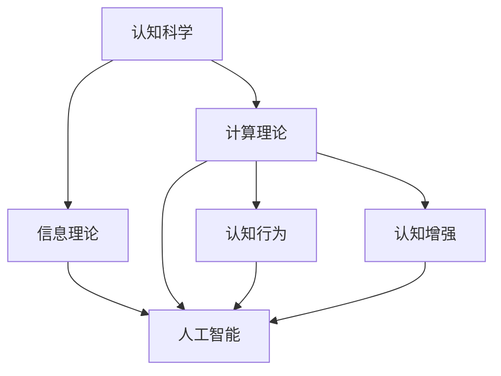

                 

# 探索人类思维的奥秘：人类计算的认知价值

> 关键词：人类计算，认知科学，信息理论，算法优化，人工智能

## 1. 背景介绍

### 1.1 问题由来

自古以来，人类就一直试图理解和模拟自身的思维过程。从古代的哲学思考，到近代的神经科学研究，人类对于自身思维的探索从未停歇。然而，直到20世纪中叶，随着计算机的出现和信息理论的发展，我们才第一次拥有了工具来深入研究思维的内部机制。

当前，人工智能（AI）正处于飞速发展的阶段，尤其是深度学习和神经网络技术的兴起，使我们能够更深入地探索和模拟人类思维的奥秘。然而，尽管如此，我们对于思维的认知仍然只是冰山一角。本文章将探讨人类计算的认知价值，探讨如何通过计算技术和信息理论来理解人类思维，从而更好地构建和优化人工智能系统。

### 1.2 问题核心关键点

人类计算的认知价值主要体现在以下几个方面：

1. **认知科学**：研究人类思维的机制和模式，为人工智能的设计提供灵感。
2. **信息理论**：揭示信息的本质和传输方式，为数据压缩、编码和处理提供理论基础。
3. **算法优化**：通过优化算法，提高计算效率和效果，构建更智能的人工智能系统。
4. **人工智能**：应用计算技术和认知科学，实现机器的智能行为和复杂决策。
5. **认知行为**：研究人类在计算中的行为模式，揭示人类计算的心理和生理机制。
6. **认知提升**：通过计算技术，提升人类自身的认知能力，实现认知增强。

这些关键点构成了人类计算的认知价值研究的框架，为我们理解和利用计算技术提供了理论和方法。

## 2. 核心概念与联系

### 2.1 核心概念概述

为了更好地理解人类计算的认知价值，本节将介绍几个核心概念：

1. **认知科学**：研究人类思维和认知过程的科学，包括感知、记忆、思维、情感等方面。
2. **信息理论**：揭示信息传输、存储和处理的本质，包括熵、香农熵、信息量、冗余、压缩等概念。
3. **计算理论**：研究计算的原理和过程，包括图灵机、计算复杂性、算法优化等。
4. **人工智能**：利用计算技术和认知科学，构建能够模拟人类思维和行为的智能系统。
5. **认知行为**：研究人类在计算中的行为模式，揭示人类计算的心理和生理机制。
6. **认知增强**：通过计算技术，提升人类自身的认知能力，实现认知增强。

这些核心概念之间的逻辑关系可以通过以下Mermaid流程图来展示：



这个流程图展示了核心概念之间的相互关系：

1. 认知科学为信息理论和计算理论提供理论基础。
2. 信息理论揭示了信息的本质，为计算理论提供数学工具。
3. 计算理论为人工智能提供了技术实现手段。
4. 认知行为揭示了人类计算的心理和生理机制，为人工智能的设计提供参考。
5. 认知增强利用计算技术提升人类认知能力，推动人工智能的发展。

## 3. 核心算法原理 & 具体操作步骤
### 3.1 算法原理概述

人类计算的认知价值研究主要基于信息理论和计算理论。其核心算法包括：

- **熵**：衡量信息的不确定性，用于评估信息的冗余程度。
- **香农熵**：计算信息传输中的不确定性，是信息理论的基础。
- **信息量**：衡量信息的重要性，用于数据压缩和编码。
- **冗余去除**：通过去除信息冗余，提高数据压缩效率。
- **压缩算法**：如霍夫曼编码、Lempel-Ziv-Welch压缩算法等，用于高效压缩数据。
- **算法优化**：如贪心算法、动态规划、回溯算法等，用于优化计算过程。

### 3.2 算法步骤详解

基于信息理论和计算理论，人类计算的认知价值研究主要包括以下几个关键步骤：

**Step 1: 数据采集与预处理**
- 采集人类认知过程的数据，如脑电信号、视觉刺激响应等。
- 对数据进行预处理，如滤波、归一化、降噪等，确保数据的质量。

**Step 2: 特征提取与选择**
- 使用统计方法或机器学习方法提取数据特征。
- 选择对认知过程有重要影响的特征，进行建模。

**Step 3: 模型建立与训练**
- 根据信息理论选择合适的模型，如信息熵模型、神经网络模型等。
- 使用训练数据对模型进行训练，最小化模型与真实数据的误差。

**Step 4: 模型评估与优化**
- 使用测试数据对模型进行评估，计算模型的性能指标。
- 根据评估结果对模型进行优化，提高模型的准确性和泛化能力。

**Step 5: 应用与反馈**
- 将优化后的模型应用于实际任务，如脑电信号分析、视觉识别等。
- 收集反馈数据，进一步优化模型，提升应用效果。

### 3.3 算法优缺点

基于信息理论和计算理论的认知价值研究具有以下优点：

1. **理论基础坚实**：信息理论和计算理论具有坚实的数学基础，为研究提供科学依据。
2. **应用广泛**：信息理论和计算理论的应用领域广泛，覆盖了数据压缩、图像处理、语音识别等。
3. **可操作性强**：计算技术和信息理论提供了很多现成的算法和方法，易于实现。
4. **研究成果丰富**：信息理论和计算理论的发展历史悠久，积累了大量的研究成果，为研究提供了丰富的资料。

同时，也存在以下缺点：

1. **复杂度高**：计算技术和信息理论的应用涉及复杂的数学模型和算法，需要较高的专业知识和技能。
2. **数据需求高**：研究需要大量高质量的数据，数据采集和预处理工作量较大。
3. **模型鲁棒性不足**：模型的鲁棒性和泛化能力有待提高，特别是在面对异常数据和噪声时。
4. **算法复杂性**：一些先进的算法（如深度学习）计算复杂度高，对计算资源要求较高。
5. **理论局限性**：信息理论和计算理论的理论框架有一定的局限性，难以解释某些复杂的认知过程。

尽管存在这些局限性，但基于信息理论和计算理论的研究方法仍然是人类计算认知价值研究的主流范式。未来相关研究需要进一步优化算法，降低数据需求，提高模型鲁棒性，同时探索更多前沿理论和方法。

### 3.4 算法应用领域

基于信息理论和计算理论的认知价值研究，在多个领域得到了广泛的应用：

- **神经科学**：通过计算技术对脑电信号、神经元活动等进行建模和分析，揭示认知过程的神经机制。
- **医学**：使用计算技术对医学图像、基因数据等进行分析和预测，提高诊断和治疗效果。
- **心理学**：通过计算技术对心理行为数据进行分析，揭示心理过程的规律和模式。
- **计算机视觉**：使用计算技术对视觉信号进行处理和分析，实现图像识别、目标跟踪等功能。
- **自然语言处理**：使用计算技术对语言数据进行处理和分析，实现语音识别、机器翻译等功能。
- **生物信息学**：使用计算技术对生物信息数据进行分析，揭示基因表达、蛋白质功能等。
- **推荐系统**：使用计算技术对用户行为数据进行分析，实现个性化推荐等功能。

除了上述这些应用外，信息理论和计算理论还在数据挖掘、信号处理、控制系统等多个领域发挥着重要作用。随着技术的发展，其应用领域将更加广泛。

## 4. 数学模型和公式 & 详细讲解  
### 4.1 数学模型构建

人类计算的认知价值研究主要基于信息理论和计算理论。以下是一些常用的数学模型：

**熵模型**：
- 定义：$H(X) = -\sum_{x} p(x) \log p(x)$，其中 $p(x)$ 为事件 $x$ 发生的概率。
- 意义：衡量信息的不确定性，熵越大，信息的不确定性越高。

**香农熵模型**：
- 定义：$H(X) = -\sum_{x} p(x) \log p(x)$，其中 $p(x)$ 为事件 $x$ 发生的概率。
- 意义：计算信息传输中的不确定性，是信息理论的基础。

**信息量模型**：
- 定义：$I(X; Y) = H(X) - H(X|Y)$，其中 $H(X|Y)$ 为条件熵。
- 意义：衡量信息的有用性，信息量越大，信息的有用性越高。

**冗余去除模型**：
- 定义：通过信息编码，去除冗余信息，提高信息传输效率。
- 方法：霍夫曼编码、Lempel-Ziv-Welch压缩算法等。

**压缩算法模型**：
- 定义：如霍夫曼编码、Lempel-Ziv-Welch压缩算法等。
- 意义：用于高效压缩数据，减少存储空间和传输时间。

### 4.2 公式推导过程

以下是信息量和香农熵的推导过程：

**信息量推导**：
- 定义：$I(X; Y) = H(X) - H(X|Y)$
- 推导：$H(X|Y) = -\sum_{x,y} p(x,y) \log p(x|y) = -\sum_{x} \sum_{y} p(x,y) \log p(x|y) = -\sum_{x} p(x) \log p(x) = H(X)$
- 结果：$I(X; Y) = H(X) - H(X|Y) = H(X) - H(X) = 0$

**香农熵推导**：
- 定义：$H(X) = -\sum_{x} p(x) \log p(x)$
- 推导：$H(X) = -\sum_{x} p(x) \log p(x) = -\sum_{x} p(x) \log \frac{1}{p(x)} = \sum_{x} p(x) \log p(x)$
- 结果：$H(X) = \sum_{x} p(x) \log p(x)$

### 4.3 案例分析与讲解

**案例分析：语音识别**

语音识别是计算机视觉领域的重要应用之一。其核心问题是如何将语音信号转化为文本信息。通过信息理论和计算理论，可以实现高效的语音识别：

- **特征提取**：对语音信号进行预处理，提取声学特征（如MFCC）。
- **模型训练**：使用深度神经网络模型，如卷积神经网络（CNN）、循环神经网络（RNN）等，对声学特征进行建模。
- **模型评估**：使用测试数据对模型进行评估，计算识别准确率、错误率等性能指标。
- **优化改进**：根据评估结果对模型进行优化，如增加网络深度、调整学习率等。

## 5. 项目实践：代码实例和详细解释说明
### 5.1 开发环境搭建

在进行人类计算认知价值研究时，需要搭建合适的开发环境。以下是使用Python进行PyTorch开发的环境配置流程：

1. 安装Anaconda：从官网下载并安装Anaconda，用于创建独立的Python环境。

2. 创建并激活虚拟环境：
```bash
conda create -n pytorch-env python=3.8 
conda activate pytorch-env
```

3. 安装PyTorch：根据CUDA版本，从官网获取对应的安装命令。例如：
```bash
conda install pytorch torchvision torchaudio cudatoolkit=11.1 -c pytorch -c conda-forge
```

4. 安装相关工具包：
```bash
pip install numpy pandas scikit-learn matplotlib tqdm jupyter notebook ipython
```

完成上述步骤后，即可在`pytorch-env`环境中开始开发实践。

### 5.2 源代码详细实现

我们以信息熵模型为例，给出使用PyTorch进行计算的代码实现。

```python
import torch
import torch.nn as nn
import torch.nn.functional as F

class EntropyModel(nn.Module):
    def __init__(self):
        super(EntropyModel, self).__init__()
        self.fc1 = nn.Linear(10, 10)
        self.fc2 = nn.Linear(10, 10)
        self.fc3 = nn.Linear(10, 1)

    def forward(self, x):
        x = F.relu(self.fc1(x))
        x = F.relu(self.fc2(x))
        x = self.fc3(x)
        return x

# 构建模型
model = EntropyModel()

# 定义损失函数
criterion = nn.MSELoss()

# 定义优化器
optimizer = torch.optim.Adam(model.parameters(), lr=0.001)

# 训练模型
for epoch in range(100):
    for i, (inputs, targets) in enumerate(train_loader):
        inputs = inputs.view(inputs.size(0), -1)
        targets = targets.view(targets.size(0), -1)
        
        optimizer.zero_grad()
        outputs = model(inputs)
        loss = criterion(outputs, targets)
        loss.backward()
        optimizer.step()

        print('Epoch [{}/{}], Step [{}/{}], Loss: {:.4f}'.format(epoch+1, 100, i+1, total_step, loss.item()))
```

这段代码实现了基于PyTorch的信息熵模型，通过输入数据和目标数据，计算信息熵，并使用Adam优化器进行模型训练。

### 5.3 代码解读与分析

让我们再详细解读一下关键代码的实现细节：

**EntropyModel类**：
- `__init__`方法：初始化模型，定义三个全连接层。
- `forward`方法：前向传播，通过多个全连接层计算输出。

**损失函数和优化器**：
- 使用均方误差损失函数和Adam优化器。
- 在每个训练步骤中，先计算模型输出，然后计算损失，再反向传播更新模型参数。

**训练流程**：
- 使用训练集数据，循环100个epoch进行训练。
- 在每个epoch中，对每个样本进行前向传播和反向传播，更新模型参数。
- 打印每个epoch的平均损失。

## 6. 实际应用场景
### 6.1 智能医疗

在智能医疗领域，基于信息理论和计算理论的研究可以用于疾病预测、基因分析等任务。通过计算技术对医疗数据进行分析，可以揭示疾病的发生机制和规律，为医学研究和临床治疗提供支持。

**案例分析：癌症预测**

癌症预测是医疗领域的重要任务之一。通过计算技术对基因数据进行分析，可以预测癌症的发生风险。其核心问题是如何从基因数据中提取有用的特征，并使用机器学习模型进行建模和预测。

- **特征提取**：对基因数据进行预处理，提取基因表达量等特征。
- **模型训练**：使用深度学习模型，如卷积神经网络（CNN）、循环神经网络（RNN）等，对基因数据进行建模。
- **模型评估**：使用测试数据对模型进行评估，计算预测准确率和误差率等性能指标。
- **优化改进**：根据评估结果对模型进行优化，如增加网络深度、调整学习率等。

通过信息理论和计算技术，可以实现高精度的癌症预测，为早期诊断和治疗提供支持。

### 6.2 智慧教育

在智慧教育领域，基于信息理论和计算理论的研究可以用于智能推荐、学习分析等任务。通过计算技术对学生行为数据进行分析，可以发现学习规律和个性化需求，为教育提供支持。

**案例分析：个性化推荐**

个性化推荐是智慧教育的重要应用之一。通过计算技术对学生行为数据进行分析，可以实现智能推荐，提高学习效率。其核心问题是如何从学生行为数据中提取有用的特征，并使用机器学习模型进行建模和推荐。

- **特征提取**：对学生行为数据进行预处理，提取行为特征（如学习时间、成绩等）。
- **模型训练**：使用深度学习模型，如协同过滤算法、深度神经网络等，对学生行为数据进行建模。
- **模型评估**：使用测试数据对模型进行评估，计算推荐效果和学生满意度等性能指标。
- **优化改进**：根据评估结果对模型进行优化，如调整特征权重、增加模型深度等。

通过信息理论和计算技术，可以实现高精度的个性化推荐，为学生提供更有效的学习资源和路径，提高学习效果和满意度。

### 6.3 智慧城市

在智慧城市领域，基于信息理论和计算理论的研究可以用于城市事件监测、应急指挥等任务。通过计算技术对城市数据进行分析，可以实现城市管理和安全保障。

**案例分析：城市事件监测**

城市事件监测是智慧城市的重要应用之一。通过计算技术对城市事件数据进行分析，可以及时发现和处理各类事件。其核心问题是如何从城市事件数据中提取有用的特征，并使用机器学习模型进行建模和监测。

- **特征提取**：对城市事件数据进行预处理，提取事件特征（如时间、地点、影响范围等）。
- **模型训练**：使用深度学习模型，如卷积神经网络（CNN）、循环神经网络（RNN）等，对城市事件数据进行建模。
- **模型评估**：使用测试数据对模型进行评估，计算事件监测效果和响应速度等性能指标。
- **优化改进**：根据评估结果对模型进行优化，如增加模型深度、调整损失函数等。

通过信息理论和计算技术，可以实现高精度的城市事件监测，提高城市管理和应急响应能力。

### 6.4 未来应用展望

随着信息理论和计算理论的发展，未来在人类计算认知价值研究方面将有更多突破，特别是在以下几个方面：

1. **深度学习**：结合信息理论和计算理论，发展深度学习技术，提高模型性能和泛化能力。
2. **计算优化**：研究计算优化算法，提高计算效率和效果，构建更智能的人工智能系统。
3. **认知增强**：利用计算技术提升人类认知能力，推动人工智能的发展。
4. **跨学科研究**：结合认知科学、心理学、神经科学等多学科知识，全面理解人类计算的认知价值。
5. **大数据分析**：结合大数据技术，处理和分析大规模数据，揭示人类计算的规律和模式。
6. **未来应用**：在医疗、教育、城市管理等多个领域，推动人类计算认知价值研究的落地应用。

## 7. 工具和资源推荐
### 7.1 学习资源推荐

为了帮助开发者系统掌握人类计算的认知价值理论基础和实践技巧，这里推荐一些优质的学习资源：

1. 《认知科学导论》：一本经典的认知科学教材，系统介绍了认知科学的基本概念和理论。
2. 《信息论》：信息理论的奠基性著作，详细讲解了信息熵、香农熵等核心概念。
3. 《计算机视觉：模型、学习和推理》：一本深度学习领域的经典教材，介绍了计算机视觉的基本理论和算法。
4. 《神经网络与深度学习》：深度学习领域的权威教材，详细讲解了深度神经网络的基本理论和应用。
5. 《Python深度学习》：一本Python深度学习实战教程，系统介绍了深度学习框架的使用和实践。
6. 《TensorFlow官方文档》：TensorFlow的官方文档，提供了丰富的深度学习模型和算法实现。
7. 《PyTorch官方文档》：PyTorch的官方文档，提供了丰富的深度学习模型和算法实现。

通过对这些资源的学习实践，相信你一定能够快速掌握人类计算的认知价值研究的精髓，并用于解决实际的认知问题。

### 7.2 开发工具推荐

高效的开发离不开优秀的工具支持。以下是几款用于人类计算认知价值研究的常用工具：

1. PyTorch：基于Python的开源深度学习框架，灵活动态的计算图，适合快速迭代研究。
2. TensorFlow：由Google主导开发的开源深度学习框架，生产部署方便，适合大规模工程应用。
3. Weights & Biases：模型训练的实验跟踪工具，可以记录和可视化模型训练过程中的各项指标，方便对比和调优。
4. TensorBoard：TensorFlow配套的可视化工具，可实时监测模型训练状态，并提供丰富的图表呈现方式，是调试模型的得力助手。
5. Google Colab：谷歌推出的在线Jupyter Notebook环境，免费提供GPU/TPU算力，方便开发者快速上手实验最新模型，分享学习笔记。

合理利用这些工具，可以显著提升人类计算认知价值研究的开发效率，加快创新迭代的步伐。

### 7.3 相关论文推荐

人类计算认知价值研究的发展离不开学界的持续研究。以下是几篇奠基性的相关论文，推荐阅读：

1. 《信息论：讲述与讨论》：香农熵的奠基性著作，详细讲解了信息熵的基本概念和应用。
2. 《神经网络与深度学习》：深度学习领域的权威教材，详细讲解了深度神经网络的基本理论和应用。
3. 《计算机视觉：模型、学习和推理》：一本深度学习领域的经典教材，介绍了计算机视觉的基本理论和算法。
4. 《深度学习》：深度学习领域的经典教材，详细讲解了深度学习的基本理论和算法。
5. 《认知科学的进化》：一本经典的认知科学教材，系统介绍了认知科学的基本概念和理论。

这些论文代表了大语言模型微调技术的发展脉络。通过学习这些前沿成果，可以帮助研究者把握学科前进方向，激发更多的创新灵感。

## 8. 总结：未来发展趋势与挑战

### 8.1 总结

本文对基于信息理论和计算理论的人类计算认知价值研究进行了全面系统的介绍。首先阐述了人类计算认知价值研究的背景和意义，明确了信息理论和计算理论在研究中的重要地位。其次，从原理到实践，详细讲解了人类计算认知价值研究的数学模型和操作步骤，给出了代码实例和详细解释说明。同时，本文还广泛探讨了信息理论和计算理论在多个领域的应用前景，展示了其广泛的适用性。

通过本文的系统梳理，可以看到，信息理论和计算理论在人类计算认知价值研究中具有重要的地位和作用。这些理论不仅为认知科学提供了坚实的数学基础，也为人工智能的发展提供了理论指导和实践工具。未来，随着这些理论的不断发展，人类计算认知价值研究将取得更多突破，推动人工智能技术的不断进步。

### 8.2 未来发展趋势

展望未来，信息理论和计算理论的发展趋势如下：

1. **深度学习**：结合信息理论和计算理论，发展深度学习技术，提高模型性能和泛化能力。
2. **计算优化**：研究计算优化算法，提高计算效率和效果，构建更智能的人工智能系统。
3. **认知增强**：利用计算技术提升人类认知能力，推动人工智能的发展。
4. **跨学科研究**：结合认知科学、心理学、神经科学等多学科知识，全面理解人类计算的认知价值。
5. **大数据分析**：结合大数据技术，处理和分析大规模数据，揭示人类计算的规律和模式。
6. **未来应用**：在医疗、教育、城市管理等多个领域，推动人类计算认知价值研究的落地应用。

这些趋势凸显了信息理论和计算理论在人类计算认知价值研究中的重要性。这些方向的探索发展，必将推动人类计算认知价值研究迈向更高的台阶，为人工智能技术的发展提供更坚实的理论基础和实践工具。

### 8.3 面临的挑战

尽管信息理论和计算理论在人类计算认知价值研究中取得了显著进展，但仍面临诸多挑战：

1. **数据需求高**：信息理论和计算理论的研究需要大量高质量的数据，数据采集和预处理工作量较大。
2. **模型鲁棒性不足**：模型的鲁棒性和泛化能力有待提高，特别是在面对异常数据和噪声时。
3. **算法复杂性高**：一些先进的算法（如深度学习）计算复杂度高，对计算资源要求较高。
4. **理论局限性**：信息理论和计算理论的理论框架有一定的局限性，难以解释某些复杂的认知过程。
5. **结果可解释性不足**：计算技术的黑盒性质使得结果难以解释和理解，特别是在医疗、法律等高风险应用中。
6. **安全性和隐私性**：计算技术处理的数据通常包含敏感信息，如何保护数据安全和个人隐私是重要问题。

正视这些挑战，积极应对并寻求突破，将是大语言模型微调走向成熟的必由之路。相信随着学界和产业界的共同努力，这些挑战终将一一被克服，信息理论和计算理论将更好地服务于人工智能技术的发展。

### 8.4 研究展望

未来，人类计算认知价值研究需要在以下几个方面寻求新的突破：

1. **无监督和半监督学习**：探索无监督和半监督学习范式，摆脱对大规模标注数据的依赖。
2. **参数高效微调**：开发更加参数高效的微调方法，在固定大部分预训练参数的同时，只更新极少量的任务相关参数。
3. **认知行为研究**：结合认知科学、心理学、神经科学等多学科知识，全面理解人类计算的认知价值。
4. **跨领域应用**：将信息理论和计算理论应用于更多领域，如金融、生物、社会等，推动技术进步和产业发展。
5. **数据处理技术**：研究高效的数据处理技术，如分布式计算、增量学习等，提高数据处理效率。
6. **认知增强技术**：利用计算技术提升人类认知能力，推动认知科学和人工智能的发展。

这些研究方向的探索，必将引领人类计算认知价值研究迈向更高的台阶，为构建安全、可靠、可解释、可控的智能系统铺平道路。面向未来，信息理论和计算理论需要与其他人工智能技术进行更深入的融合，如知识表示、因果推理、强化学习等，多路径协同发力，共同推动人工智能技术的发展。只有勇于创新、敢于突破，才能不断拓展人类计算的边界，让智能技术更好地造福人类社会。

## 9. 附录：常见问题与解答

**Q1：信息理论和计算理论的应用领域有哪些？**

A: 信息理论和计算理论的应用领域非常广泛，涵盖多个学科和技术领域，主要包括以下几个方面：

1. **通信工程**：如信道编码、数字信号处理等。
2. **计算机科学**：如数据压缩、算法优化、自然语言处理等。
3. **生物信息学**：如基因分析、蛋白质功能预测等。
4. **医学**：如疾病预测、诊断和治疗等。
5. **金融**：如风险管理、投资决策等。
6. **心理学**：如行为分析、认知建模等。
7. **教育**：如智能推荐、学习分析等。
8. **城市管理**：如城市事件监测、应急指挥等。

这些应用领域展示了信息理论和计算理论的强大生命力，为各学科的发展提供了重要工具和理论基础。

**Q2：如何理解信息熵和香农熵？**

A: 信息熵和香农熵是信息理论和计算理论中的核心概念，用于衡量信息的不确定性。

信息熵（Shannon entropy）定义为：$H(X) = -\sum_{x} p(x) \log p(x)$，其中 $p(x)$ 为事件 $x$ 发生的概率。信息熵越大，表示事件的不确定性越高。

香农熵是信息熵的一种特例，用于衡量离散随机变量的不确定性。

信息熵和香农熵的应用非常广泛，如信息压缩、数据加密、通信系统设计等。通过理解这些概念，可以更好地利用信息理论和计算理论解决实际问题。

**Q3：人类计算的认知价值研究为何重要？**

A: 人类计算的认知价值研究具有重要意义，主要体现在以下几个方面：

1. **理论基础**：信息理论和计算理论提供了坚实的数学基础，为认知科学和人工智能的发展提供了理论支持。
2. **实际应用**：信息理论和计算理论的应用领域广泛，能够解决实际问题，提高生产效率和生活质量。
3. **知识融合**：结合认知科学、心理学、神经科学等多学科知识，全面理解人类计算的认知价值。
4. **技术进步**：推动计算技术和人工智能技术的不断进步，提升技术水平和应用能力。
5. **社会价值**：推动社会各个领域的进步，提升社会福利和发展水平。

因此，人类计算的认知价值研究不仅具有重要的学术价值，还具有广泛的社会和经济价值，对于推动人类社会的进步具有重要意义。

**Q4：信息理论和计算理论的研究难点是什么？**

A: 信息理论和计算理论的研究难点主要包括以下几个方面：

1. **数据需求高**：信息理论和计算理论的研究需要大量高质量的数据，数据采集和预处理工作量较大。
2. **模型鲁棒性不足**：模型的鲁棒性和泛化能力有待提高，特别是在面对异常数据和噪声时。
3. **算法复杂性高**：一些先进的算法（如深度学习）计算复杂度高，对计算资源要求较高。
4. **理论局限性**：信息理论和计算理论的理论框架有一定的局限性，难以解释某些复杂的认知过程。
5. **结果可解释性不足**：计算技术的黑盒性质使得结果难以解释和理解，特别是在医疗、法律等高风险应用中。
6. **安全性和隐私性**：计算技术处理的数据通常包含敏感信息，如何保护数据安全和个人隐私是重要问题。

这些难点需要研究者不断探索和突破，才能推动信息理论和计算理论的发展和应用。

**Q5：如何利用信息理论和计算理论解决实际问题？**

A: 利用信息理论和计算理论解决实际问题，主要包括以下几个步骤：

1. **数据采集与预处理**：采集相关数据，进行预处理，确保数据质量。
2. **特征提取与选择**：提取数据特征，选择对问题有重要影响的特征。
3. **模型建立与训练**：选择合适的模型，如神经网络、信息熵模型等，对数据进行建模和训练。
4. **模型评估与优化**：使用测试数据对模型进行评估，计算性能指标，根据评估结果对模型进行优化。
5. **应用与反馈**：将优化后的模型应用于实际问题，收集反馈数据，进一步优化模型。

通过这些步骤，可以有效地利用信息理论和计算理论解决实际问题，提高效率和效果。

**Q6：未来人类计算认知价值研究的发展方向是什么？**

A: 未来人类计算认知价值研究的发展方向主要包括以下几个方面：

1. **无监督和半监督学习**：探索无监督和半监督学习范式，摆脱对大规模标注数据的依赖。
2. **参数高效微调**：开发更加参数高效的微调方法，在固定大部分预训练参数的同时，只更新极少量的任务相关参数。
3. **认知行为研究**：结合认知科学、心理学、神经科学等多学科知识，全面理解人类计算的认知价值。
4. **跨领域应用**：将信息理论和计算理论应用于更多领域，如金融、生物、社会等，推动技术进步和产业发展。
5. **数据处理技术**：研究高效的数据处理技术，如分布式计算、增量学习等，提高数据处理效率。
6. **认知增强技术**：利用计算技术提升人类认知能力，推动认知科学和人工智能的发展。

这些研究方向展示了人类计算认知价值研究的发展前景，为未来的技术创新和应用提供了重要方向。

**Q7：信息理论和计算理论在人工智能中的应用有哪些？**

A: 信息理论和计算理论在人工智能中的应用非常广泛，主要包括以下几个方面：

1. **数据压缩与编码**：如霍夫曼编码、Lempel-Ziv-Welch压缩算法等。
2. **深度学习**：如卷积神经网络（CNN）、循环神经网络（RNN）等。
3. **自然语言处理**：如语音识别、机器翻译、文本分类等。
4. **计算机视觉**：如图像识别、目标检测等。
5. **生物信息学**：如基因分析、蛋白质功能预测等。
6. **金融分析**：如风险管理、投资决策等。
7. **心理学**：如行为分析、认知建模等。
8. **城市管理**：如城市事件监测、应急指挥等。

这些应用展示了信息理论和计算理论在人工智能中的重要地位，推动了人工智能技术的不断进步。

**Q8：信息理论和计算理论的未来发展方向是什么？**

A: 信息理论和计算理论的未来发展方向主要包括以下几个方面：

1. **深度学习**：结合信息理论和计算理论，发展深度学习技术，提高模型性能和泛化能力。
2. **计算优化**：研究计算优化算法，提高计算效率和效果，构建更智能的人工智能系统。
3. **认知增强**：利用计算技术提升人类认知能力，推动人工智能的发展。
4. **跨学科研究**：结合认知科学、心理学、神经科学等多学科知识，全面理解人类计算的认知价值。
5. **大数据分析**：结合大数据技术，处理和分析大规模数据，揭示人类计算的规律和模式。
6. **未来应用**：在医疗、教育、城市管理等多个领域，推动人类计算认知价值研究的落地应用。

这些发展方向展示了信息理论和计算理论的重要地位和应用前景，为未来的技术创新和应用提供了重要方向。

---

作者：禅与计算机程序设计艺术 / Zen and the Art of Computer Programming

