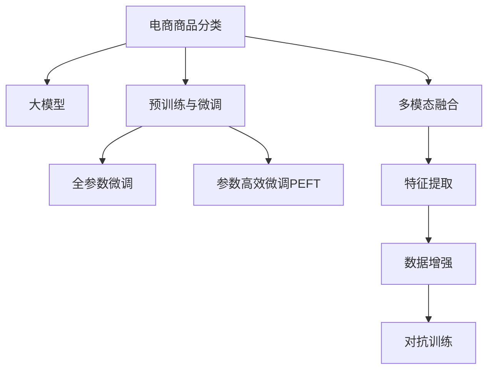

                 

# 探索基于大模型的电商智能商品分类系统

## 1. 背景介绍

### 1.1 问题由来
随着电子商务的快速发展和市场竞争的加剧，商家需要快速、准确地对商品进行分类，以提升用户体验和优化运营效率。传统的商品分类方法依赖于人工标注和规则匹配，存在数据成本高、适应性差、效率低下等问题。近年来，随着深度学习和大模型的兴起，电商领域的智能商品分类系统逐渐成为研究热点。

大模型通过在广泛的无标签文本数据上进行预训练，学习到丰富的语言知识和语义理解能力，能够快速适应新的任务。基于大模型的电商智能商品分类系统，可以大幅降低标注成本，提高分类精度，显著提升电商平台的运营效率。

### 1.2 问题核心关键点
电商智能商品分类系统基于大模型的解决方案，主要包括以下几个关键点：

- **预训练与微调**：首先在大规模无标签电商数据上进行预训练，然后在少量标注商品数据上进行微调，学习商品分类的通用知识和特定商品的特征。
- **多模态融合**：融合商品图片、标题、描述等多种数据模态，通过大模型学习统一的多模态表示。
- **迁移学习**：利用不同电商平台间的共性知识，在不同平台间进行知识迁移，提升新平台的分类效果。
- **参数高效微调**：在保留大部分预训练参数的前提下，只微调少量顶层参数，提高分类效率。
- **对抗训练**：引入对抗样本，提高模型鲁棒性，避免因数据偏见导致的错误分类。

### 1.3 问题研究意义
构建基于大模型的电商智能商品分类系统，具有以下重要意义：

- **降低成本**：通过预训练和微调，大幅降低标注数据的需求，减少人力和时间成本。
- **提高精度**：利用大模型强大的语义理解能力，提升商品分类的准确性。
- **快速适应**：模型能够快速适应新商品的分类，缩短商品上架和分类的周期。
- **应用广泛**：模型可以应用于多种电商场景，如商品搜索、推荐、客服等，提高整体运营效率。
- **技术创新**：基于大模型的电商分类系统推动了NLP和计算机视觉技术的发展，带来新的技术突破。

## 2. 核心概念与联系

### 2.1 核心概念概述

为更好地理解基于大模型的电商智能商品分类方法，本节将介绍几个密切相关的核心概念：

- **电商商品分类**：根据商品的属性、特征等对其进行自动分类，以便于搜索、推荐、库存管理等电商应用。
- **大模型**：指通过在大规模无标签数据上预训练的深度神经网络模型，如BERT、GPT等。
- **预训练与微调**：首先在大规模无标签数据上进行预训练，然后在任务特定的数据上进行微调，学习任务的通用和特定知识。
- **多模态融合**：将文本、图片、音频等多种数据模态进行融合，提升模型的理解能力。
- **迁移学习**：将一个领域学到的知识迁移到另一个相关领域，提升新任务的性能。
- **参数高效微调**：在微调过程中，只更新少量的模型参数，保留大部分预训练权重不变。
- **对抗训练**：通过引入对抗样本，增强模型的鲁棒性，避免因数据偏见导致的错误分类。

这些概念之间的逻辑关系可以通过以下Mermaid流程图来展示：



这个流程图展示了大模型在电商商品分类中的应用框架：

1. 电商商品分类任务通过预训练与微调，利用大模型学习商品分类的通用和特定知识。
2. 多模态融合将商品的多种数据模态进行整合，提升分类精度。
3. 参数高效微调通过只更新顶层参数，保留大部分预训练权重，提高分类效率。
4. 对抗训练通过引入对抗样本，增强模型的鲁棒性。

## 3. 核心算法原理 & 具体操作步骤
### 3.1 算法原理概述

基于大模型的电商智能商品分类方法，主要基于预训练与微调技术。具体来说，算法流程如下：

1. **预训练阶段**：在大规模无标签电商数据上进行预训练，学习通用的商品知识。
2. **微调阶段**：在任务特定的少量标注数据上进行微调，学习商品分类的特定知识。
3. **测试阶段**：在测试集上评估模型的分类效果，根据需求调整模型参数。

预训练和微调过程可统一用公式表示：

$$
\theta^* = \mathop{\arg\min}_{\theta} \mathcal{L}(D, M_{\theta})
$$

其中，$\theta$ 为模型参数，$\mathcal{L}$ 为损失函数，$D$ 为训练数据集，$M_{\theta}$ 为预训练后的模型。

微调阶段的目标是最小化任务特定的损失函数，优化模型在特定商品分类任务上的性能。

### 3.2 算法步骤详解

#### 3.2.1 预训练阶段

预训练阶段主要在大规模无标签电商数据上进行，包括以下几个步骤：

1. **数据收集**：收集电商平台的商品数据，如图片、标题、描述等。
2. **数据预处理**：对收集到的数据进行清洗、标注、归一化等预处理，使其适合预训练任务。
3. **模型选择**：选择合适的预训练模型，如BERT、GPT等。
4. **预训练任务**：选择适合的任务，如语言模型、掩码语言模型等，训练模型学习通用的语言知识。

#### 3.2.2 微调阶段

微调阶段在任务特定的少量标注数据上进行，包括以下几个步骤：

1. **数据收集**：收集任务特定的商品分类数据集。
2. **数据预处理**：对数据集进行清洗、标注、归一化等预处理。
3. **任务适配层设计**：根据任务类型，设计合适的输出层和损失函数。
4. **模型初始化**：将预训练模型初始化为微调的起始参数。
5. **优化器选择**：选择合适的优化器，如Adam、SGD等。
6. **学习率设置**：选择合适的学习率，通常比预训练时小1-2个数量级。
7. **正则化技术**：应用正则化技术，如L2正则、Dropout等，防止过拟合。
8. **微调过程**：使用优化器更新模型参数，最小化损失函数。
9. **评估与优化**：周期性在验证集上评估模型性能，根据评估结果调整超参数。

#### 3.2.3 测试阶段

测试阶段在未参与微调的数据集上进行，包括以下几个步骤：

1. **数据收集**：收集未参与微调的商品分类数据集。
2. **数据预处理**：对数据集进行清洗、标注、归一化等预处理。
3. **模型评估**：使用测试集评估模型的分类效果，计算精度、召回率等指标。
4. **模型优化**：根据测试结果，调整模型参数，提高分类精度。

### 3.3 算法优缺点

基于大模型的电商智能商品分类方法，具有以下优点：

1. **高效性**：预训练阶段可以通过大规模无标签数据进行，微调阶段只需少量标注数据，大大降低数据成本。
2. **鲁棒性**：利用大模型的泛化能力，模型在特定商品分类任务上具有较强的泛化能力。
3. **可解释性**：预训练和微调过程可解释性强，有助于理解模型决策逻辑。
4. **适应性**：模型能够快速适应新商品，提升电商平台的运营效率。

同时，该方法也存在一些局限性：

1. **数据偏见**：预训练数据和微调数据可能存在偏见，影响模型性能。
2. **资源消耗**：预训练和微调阶段需要大量计算资源，成本较高。
3. **模型复杂度**：大模型参数量较大，内存和计算资源消耗较大。
4. **对抗攻击**：对抗训练可能无法完全避免对抗样本的攻击，影响模型安全性。

尽管存在这些局限性，但就目前而言，基于大模型的电商智能商品分类方法仍是电商领域的重要解决方案。未来相关研究的重点在于如何进一步降低数据成本，提高模型泛化能力，优化模型结构和资源消耗，以及增强模型鲁棒性等。

### 3.4 算法应用领域

基于大模型的电商智能商品分类方法，已在多个电商场景中得到了应用，例如：

- **商品搜索**：对用户搜索关键词进行分类，提供更精准的商品推荐。
- **商品推荐**：根据用户历史行为和商品特征进行分类，推荐相关商品。
- **库存管理**：对商品库存进行分类，优化库存管理和补货策略。
- **客服系统**：根据用户咨询内容进行分类，提供自动化客服服务。
- **广告投放**：对广告内容进行分类，提高广告投放效果。

除了上述这些经典应用外，电商智能商品分类方法还被创新性地应用到更多场景中，如市场分析、用户画像、异常检测等，为电商运营提供了新的技术支持。

## 4. 数学模型和公式 & 详细讲解  
### 4.1 数学模型构建

本节将使用数学语言对基于大模型的电商智能商品分类过程进行更加严格的刻画。

记预训练语言模型为 $M_{\theta}$，其中 $\theta$ 为预训练得到的模型参数。假设电商商品分类任务的数据集为 $D=\{(x_i,y_i)\}_{i=1}^N, x_i \in \mathcal{X}, y_i \in \mathcal{Y}$。其中，$\mathcal{X}$ 为输入空间，$\mathcal{Y}$ 为输出空间，$\theta \in \mathbb{R}^d$ 为模型参数。

定义模型 $M_{\theta}$ 在输入 $x$ 上的输出为 $M_{\theta}(x) \in \mathbb{R}^k$，$k$ 为输出的维度。在微调阶段，我们添加一个任务特定的输出层 $\mathcal{H}$，将输出映射到 $\mathcal{Y}$ 空间，得到最终分类结果。

微调的优化目标是最小化损失函数 $\mathcal{L}(D, M_{\theta})$，其中：

$$
\mathcal{L}(D, M_{\theta}) = \frac{1}{N}\sum_{i=1}^N \ell(y_i, M_{\theta}(x_i))
$$

其中 $\ell(y_i, M_{\theta}(x_i))$ 为损失函数，用于衡量模型预测输出与真实标签之间的差异。常见的损失函数包括交叉熵损失、均方误差损失等。

在微调过程中，模型的参数 $\theta$ 不断更新，使得模型输出逼近真实标签，优化目标为：

$$
\theta^* = \mathop{\arg\min}_{\theta} \mathcal{L}(D, M_{\theta})
$$

### 4.2 公式推导过程

以二分类任务为例，推导交叉熵损失函数及其梯度的计算公式。

假设模型 $M_{\theta}$ 在输入 $x$ 上的输出为 $\hat{y}=M_{\theta}(x) \in [0,1]$，表示样本属于正类的概率。真实标签 $y \in \{0,1\}$。则二分类交叉熵损失函数定义为：

$$
\ell(y_i, \hat{y}) = -[y_i\log \hat{y} + (1-y_i)\log (1-\hat{y})]
$$

将其代入损失函数，得：

$$
\mathcal{L}(D, M_{\theta}) = -\frac{1}{N}\sum_{i=1}^N [y_i\log M_{\theta}(x_i)+(1-y_i)\log(1-M_{\theta}(x_i))]
$$

根据链式法则，损失函数对参数 $\theta_k$ 的梯度为：

$$
\frac{\partial \mathcal{L}(D, M_{\theta})}{\partial \theta_k} = -\frac{1}{N}\sum_{i=1}^N \frac{\partial \ell(y_i, M_{\theta}(x_i))}{\partial \theta_k}
$$

其中 $\frac{\partial \ell(y_i, M_{\theta}(x_i))}{\partial \theta_k}$ 可进一步递归展开，利用自动微分技术完成计算。

在得到损失函数的梯度后，即可带入参数更新公式，完成模型的迭代优化。重复上述过程直至收敛，最终得到适应电商商品分类任务的最优模型参数 $\theta^*$。

## 5. 项目实践：代码实例和详细解释说明
### 5.1 开发环境搭建

在进行电商智能商品分类实践前，我们需要准备好开发环境。以下是使用Python进行PyTorch开发的环境配置流程：

1. 安装Anaconda：从官网下载并安装Anaconda，用于创建独立的Python环境。

2. 创建并激活虚拟环境：
```bash
conda create -n pytorch-env python=3.8 
conda activate pytorch-env
```

3. 安装PyTorch：根据CUDA版本，从官网获取对应的安装命令。例如：
```bash
conda install pytorch torchvision torchaudio cudatoolkit=11.1 -c pytorch -c conda-forge
```

4. 安装Transformers库：
```bash
pip install transformers
```

5. 安装各类工具包：
```bash
pip install numpy pandas scikit-learn matplotlib tqdm jupyter notebook ipython
```

完成上述步骤后，即可在`pytorch-env`环境中开始电商智能商品分类实践。

### 5.2 源代码详细实现

下面我们以电商商品分类任务为例，给出使用Transformers库对BERT模型进行电商智能商品分类的PyTorch代码实现。

首先，定义电商商品分类任务的数据处理函数：

```python
from transformers import BertTokenizer
from torch.utils.data import Dataset
import torch

class ECSDataset(Dataset):
    def __init__(self, texts, tags, tokenizer, max_len=128):
        self.texts = texts
        self.tags = tags
        self.tokenizer = tokenizer
        self.max_len = max_len
        
    def __len__(self):
        return len(self.texts)
    
    def __getitem__(self, item):
        text = self.texts[item]
        tags = self.tags[item]
        
        encoding = self.tokenizer(text, return_tensors='pt', max_length=self.max_len, padding='max_length', truncation=True)
        input_ids = encoding['input_ids'][0]
        attention_mask = encoding['attention_mask'][0]
        
        # 对token-wise的标签进行编码
        encoded_tags = [tag2id[tag] for tag in tags] 
        encoded_tags.extend([tag2id['O']] * (self.max_len - len(encoded_tags)))
        labels = torch.tensor(encoded_tags, dtype=torch.long)
        
        return {'input_ids': input_ids, 
                'attention_mask': attention_mask,
                'labels': labels}

# 标签与id的映射
tag2id = {'O': 0, 'clothing': 1, 'electronics': 2, 'home goods': 3, 'books': 4, 'beauty': 5, 'food': 6}
id2tag = {v: k for k, v in tag2id.items()}

# 创建dataset
tokenizer = BertTokenizer.from_pretrained('bert-base-cased')

train_dataset = ECSDataset(train_texts, train_tags, tokenizer)
dev_dataset = ECSDataset(dev_texts, dev_tags, tokenizer)
test_dataset = ECSDataset(test_texts, test_tags, tokenizer)
```

然后，定义模型和优化器：

```python
from transformers import BertForTokenClassification, AdamW

model = BertForTokenClassification.from_pretrained('bert-base-cased', num_labels=len(tag2id))

optimizer = AdamW(model.parameters(), lr=2e-5)
```

接着，定义训练和评估函数：

```python
from torch.utils.data import DataLoader
from tqdm import tqdm
from sklearn.metrics import classification_report

device = torch.device('cuda') if torch.cuda.is_available() else torch.device('cpu')
model.to(device)

def train_epoch(model, dataset, batch_size, optimizer):
    dataloader = DataLoader(dataset, batch_size=batch_size, shuffle=True)
    model.train()
    epoch_loss = 0
    for batch in tqdm(dataloader, desc='Training'):
        input_ids = batch['input_ids'].to(device)
        attention_mask = batch['attention_mask'].to(device)
        labels = batch['labels'].to(device)
        model.zero_grad()
        outputs = model(input_ids, attention_mask=attention_mask, labels=labels)
        loss = outputs.loss
        epoch_loss += loss.item()
        loss.backward()
        optimizer.step()
    return epoch_loss / len(dataloader)

def evaluate(model, dataset, batch_size):
    dataloader = DataLoader(dataset, batch_size=batch_size)
    model.eval()
    preds, labels = [], []
    with torch.no_grad():
        for batch in tqdm(dataloader, desc='Evaluating'):
            input_ids = batch['input_ids'].to(device)
            attention_mask = batch['attention_mask'].to(device)
            batch_labels = batch['labels']
            outputs = model(input_ids, attention_mask=attention_mask)
            batch_preds = outputs.logits.argmax(dim=2).to('cpu').tolist()
            batch_labels = batch_labels.to('cpu').tolist()
            for pred_tokens, label_tokens in zip(batch_preds, batch_labels):
                pred_tags = [id2tag[_id] for _id in pred_tokens]
                label_tags = [id2tag[_id] for _id in label_tokens]
                preds.append(pred_tags[:len(label_tags)])
                labels.append(label_tags)
                
    print(classification_report(labels, preds))
```

最后，启动训练流程并在测试集上评估：

```python
epochs = 5
batch_size = 16

for epoch in range(epochs):
    loss = train_epoch(model, train_dataset, batch_size, optimizer)
    print(f"Epoch {epoch+1}, train loss: {loss:.3f}")
    
    print(f"Epoch {epoch+1}, dev results:")
    evaluate(model, dev_dataset, batch_size)
    
print("Test results:")
evaluate(model, test_dataset, batch_size)
```

以上就是使用PyTorch对BERT进行电商智能商品分类任务的完整代码实现。可以看到，得益于Transformers库的强大封装，我们可以用相对简洁的代码完成BERT模型的加载和分类任务的微调。

### 5.3 代码解读与分析

让我们再详细解读一下关键代码的实现细节：

**ECSDataset类**：
- `__init__`方法：初始化文本、标签、分词器等关键组件。
- `__len__`方法：返回数据集的样本数量。
- `__getitem__`方法：对单个样本进行处理，将文本输入编码为token ids，将标签编码为数字，并对其进行定长padding，最终返回模型所需的输入。

**tag2id和id2tag字典**：
- 定义了标签与数字id之间的映射关系，用于将token-wise的预测结果解码回真实的标签。

**训练和评估函数**：
- 使用PyTorch的DataLoader对数据集进行批次化加载，供模型训练和推理使用。
- 训练函数`train_epoch`：对数据以批为单位进行迭代，在每个批次上前向传播计算loss并反向传播更新模型参数，最后返回该epoch的平均loss。
- 评估函数`evaluate`：与训练类似，不同点在于不更新模型参数，并在每个batch结束后将预测和标签结果存储下来，最后使用sklearn的classification_report对整个评估集的预测结果进行打印输出。

**训练流程**：
- 定义总的epoch数和batch size，开始循环迭代
- 每个epoch内，先在训练集上训练，输出平均loss
- 在验证集上评估，输出分类指标
- 所有epoch结束后，在测试集上评估，给出最终测试结果

可以看到，PyTorch配合Transformers库使得BERT微调的代码实现变得简洁高效。开发者可以将更多精力放在数据处理、模型改进等高层逻辑上，而不必过多关注底层的实现细节。

当然，工业级的系统实现还需考虑更多因素，如模型的保存和部署、超参数的自动搜索、更灵活的任务适配层等。但核心的微调范式基本与此类似。

## 6. 实际应用场景
### 6.1 智能商品搜索

电商智能商品分类系统在智能商品搜索中具有重要应用。传统的商品搜索主要依赖关键词匹配，无法理解用户查询的真正意图。基于大模型的商品分类系统，可以更好地理解查询语义，提供更精准的商品推荐。

例如，当用户输入查询"运动鞋推荐"时，电商平台可以使用智能分类系统对查询进行分类，如"运动鞋"、"跑步鞋"、"篮球鞋"等，再根据分类结果匹配最相关的商品，提升搜索效果。

### 6.2 个性化推荐系统

个性化推荐系统需要根据用户历史行为和商品特征进行分类，推荐最相关的商品。基于大模型的电商智能商品分类系统，可以更准确地理解用户兴趣，提高推荐精度。

例如，用户浏览了运动鞋、篮球鞋、跑步鞋等商品，电商平台可以使用智能分类系统对用户兴趣进行分类，如"运动鞋"、"篮球"、"跑步"等，再根据分类结果推荐最相关的商品，提升用户满意度。

### 6.3 库存管理

电商平台的库存管理需要实时掌握商品的库存状态，优化库存补货策略。基于大模型的电商智能商品分类系统，可以更准确地分类商品，提高库存管理效率。

例如，当电商平台的某个商品库存不足时，系统可以使用智能分类系统对商品进行分类，如"运动鞋"、"篮球鞋"、"跑步鞋"等，再根据分类结果进行补货，优化库存管理。

### 6.4 未来应用展望

随着大模型和微调方法的不断发展，基于大模型的电商智能商品分类系统将呈现出更多应用场景，为电商运营带来更多创新：

- **市场分析**：利用电商分类系统对市场趋势进行分类和预测，帮助商家制定更好的营销策略。
- **用户画像**：通过电商分类系统对用户行为进行分类和分析，提供更个性化的服务和推荐。
- **异常检测**：利用电商分类系统对商品数据进行异常检测，及时发现和解决供应链中的问题。
- **风险控制**：利用电商分类系统对交易数据进行分类和分析，降低欺诈风险。

这些应用场景展示了电商智能商品分类系统的巨大潜力，为电商运营提供了新的技术支持。相信随着技术的不断进步，基于大模型的电商智能商品分类系统将进一步拓展其应用边界，为电商领域的智能化转型带来更多机遇。

## 7. 工具和资源推荐
### 7.1 学习资源推荐

为了帮助开发者系统掌握基于大模型的电商智能商品分类理论基础和实践技巧，这里推荐一些优质的学习资源：

1. 《Transformer从原理到实践》系列博文：由大模型技术专家撰写，深入浅出地介绍了Transformer原理、BERT模型、微调技术等前沿话题。

2. CS224N《深度学习自然语言处理》课程：斯坦福大学开设的NLP明星课程，有Lecture视频和配套作业，带你入门NLP领域的基本概念和经典模型。

3. 《Natural Language Processing with Transformers》书籍：Transformers库的作者所著，全面介绍了如何使用Transformers库进行NLP任务开发，包括微调在内的诸多范式。

4. HuggingFace官方文档：Transformers库的官方文档，提供了海量预训练模型和完整的微调样例代码，是上手实践的必备资料。

5. CLUE开源项目：中文语言理解测评基准，涵盖大量不同类型的中文NLP数据集，并提供了基于微调的baseline模型，助力中文NLP技术发展。

通过对这些资源的学习实践，相信你一定能够快速掌握基于大模型的电商智能商品分类的精髓，并用于解决实际的电商问题。
###  7.2 开发工具推荐

高效的开发离不开优秀的工具支持。以下是几款用于大模型电商智能商品分类开发的常用工具：

1. PyTorch：基于Python的开源深度学习框架，灵活动态的计算图，适合快速迭代研究。大部分预训练语言模型都有PyTorch版本的实现。

2. TensorFlow：由Google主导开发的开源深度学习框架，生产部署方便，适合大规模工程应用。同样有丰富的预训练语言模型资源。

3. Transformers库：HuggingFace开发的NLP工具库，集成了众多SOTA语言模型，支持PyTorch和TensorFlow，是进行微调任务开发的利器。

4. Weights & Biases：模型训练的实验跟踪工具，可以记录和可视化模型训练过程中的各项指标，方便对比和调优。与主流深度学习框架无缝集成。

5. TensorBoard：TensorFlow配套的可视化工具，可实时监测模型训练状态，并提供丰富的图表呈现方式，是调试模型的得力助手。

6. Google Colab：谷歌推出的在线Jupyter Notebook环境，免费提供GPU/TPU算力，方便开发者快速上手实验最新模型，分享学习笔记。

合理利用这些工具，可以显著提升大模型电商智能商品分类任务的开发效率，加快创新迭代的步伐。

### 7.3 相关论文推荐

大语言模型和微调技术的发展源于学界的持续研究。以下是几篇奠基性的相关论文，推荐阅读：

1. Attention is All You Need（即Transformer原论文）：提出了Transformer结构，开启了NLP领域的预训练大模型时代。

2. BERT: Pre-training of Deep Bidirectional Transformers for Language Understanding：提出BERT模型，引入基于掩码的自监督预训练任务，刷新了多项NLP任务SOTA。

3. Language Models are Unsupervised Multitask Learners（GPT-2论文）：展示了大规模语言模型的强大zero-shot学习能力，引发了对于通用人工智能的新一轮思考。

4. Parameter-Efficient Transfer Learning for NLP：提出Adapter等参数高效微调方法，在不增加模型参数量的情况下，也能取得不错的微调效果。

5. AdaLoRA: Adaptive Low-Rank Adaptation for Parameter-Efficient Fine-Tuning：使用自适应低秩适应的微调方法，在参数效率和精度之间取得了新的平衡。

这些论文代表了大语言模型微调技术的发展脉络。通过学习这些前沿成果，可以帮助研究者把握学科前进方向，激发更多的创新灵感。

## 8. 总结：未来发展趋势与挑战

### 8.1 总结

本文对基于大模型的电商智能商品分类方法进行了全面系统的介绍。首先阐述了大模型和微调技术的研究背景和意义，明确了电商智能商品分类在电商运营中的重要地位。其次，从原理到实践，详细讲解了电商智能商品分类的大模型微调过程，给出了完整的代码实现。同时，本文还广泛探讨了电商智能商品分类方法在智能搜索、个性化推荐、库存管理等电商场景中的应用前景，展示了微调范式的巨大潜力。此外，本文精选了电商智能商品分类技术的各类学习资源，力求为读者提供全方位的技术指引。

通过本文的系统梳理，可以看到，基于大模型的电商智能商品分类方法正在成为电商领域的重要解决方案，极大地降低了标注成本，提高了商品分类的准确性，显著提升了电商平台的运营效率。未来，伴随大模型和微调方法的持续演进，相信基于大模型的电商智能商品分类系统将进一步拓展其应用边界，为电商运营带来更多创新。

### 8.2 未来发展趋势

展望未来，基于大模型的电商智能商品分类技术将呈现以下几个发展趋势：

1. **模型规模持续增大**：随着算力成本的下降和数据规模的扩张，预训练语言模型的参数量还将持续增长。超大规模语言模型蕴含的丰富语言知识，有望支撑更加复杂多变的商品分类任务。

2. **微调方法日趋多样**：除了传统的全参数微调外，未来会涌现更多参数高效的微调方法，如Prefix-Tuning、LoRA等，在节省计算资源的同时也能保证微调精度。

3. **持续学习成为常态**：随着数据分布的不断变化，电商智能商品分类系统也需要持续学习新知识以保持性能。如何在不遗忘原有知识的同时，高效吸收新样本信息，将成为重要的研究课题。

4. **标注样本需求降低**：受启发于提示学习(Prompt-based Learning)的思路，未来的电商智能商品分类方法将更好地利用大模型的语言理解能力，通过更加巧妙的任务描述，在更少的标注样本上也能实现理想的商品分类效果。

5. **多模态微调崛起**：当前的商品分类方法主要依赖于文本数据，未来会进一步拓展到图像、视频、音频等多种模态数据微调。多模态信息的融合，将显著提升商品分类系统的理解能力。

6. **模型通用性增强**：经过海量数据的预训练和多领域任务的微调，未来的电商智能商品分类系统将具备更强大的常识推理和跨领域迁移能力，逐步迈向通用人工智能(AGI)的目标。

以上趋势凸显了大语言模型微调技术的广阔前景。这些方向的探索发展，必将进一步提升电商智能商品分类系统的性能和应用范围，为电商运营提供新的技术支持。

### 8.3 面临的挑战

尽管基于大模型的电商智能商品分类技术已经取得了瞩目成就，但在迈向更加智能化、普适化应用的过程中，它仍面临着诸多挑战：

1. **数据偏见**：预训练数据和微调数据可能存在偏见，影响模型性能。
2. **资源消耗**：预训练和微调阶段需要大量计算资源，成本较高。
3. **模型复杂度**：大模型参数量较大，内存和计算资源消耗较大。
4. **对抗攻击**：对抗训练可能无法完全避免对抗样本的攻击，影响模型安全性。
5. **可解释性不足**：电商智能商品分类系统较为复杂，模型内部工作机制和决策逻辑难以解释。
6. **系统鲁棒性**：电商平台数据多样性大，系统需要具备较强的鲁棒性，以应对不同类型的数据。

尽管存在这些挑战，但就目前而言，基于大模型的电商智能商品分类方法仍是电商领域的重要解决方案。未来相关研究的重点在于如何进一步降低数据成本，提高模型泛化能力，优化模型结构和资源消耗，以及增强模型鲁棒性和可解释性等。

### 8.4 研究展望

面对大模型电商智能商品分类所面临的种种挑战，未来的研究需要在以下几个方面寻求新的突破：

1. **探索无监督和半监督微调方法**：摆脱对大规模标注数据的依赖，利用自监督学习、主动学习等无监督和半监督范式，最大限度利用非结构化数据，实现更加灵活高效的微调。

2. **研究参数高效和计算高效的微调范式**：开发更加参数高效的微调方法，在固定大部分预训练参数的同时，只微调少量任务相关参数。同时优化微调模型的计算图，减少前向传播和反向传播的资源消耗，实现更加轻量级、实时性的部署。

3. **融合因果和对比学习范式**：通过引入因果推断和对比学习思想，增强电商智能商品分类系统建立稳定因果关系的能力，学习更加普适、鲁棒的商品分类知识。

4. **引入更多先验知识**：将符号化的先验知识，如知识图谱、逻辑规则等，与神经网络模型进行巧妙融合，引导微调过程学习更准确、合理的商品分类知识。同时加强不同模态数据的整合，实现视觉、语音等多模态信息与文本信息的协同建模。

5. **结合因果分析和博弈论工具**：将因果分析方法引入电商智能商品分类系统，识别出系统决策的关键特征，增强输出解释的因果性和逻辑性。借助博弈论工具刻画人机交互过程，主动探索并规避系统的脆弱点，提高系统稳定性。

6. **纳入伦理道德约束**：在模型训练目标中引入伦理导向的评估指标，过滤和惩罚有偏见、有害的输出倾向。同时加强人工干预和审核，建立模型行为的监管机制，确保输出符合人类价值观和伦理道德。

这些研究方向的探索，必将引领电商智能商品分类技术迈向更高的台阶，为构建安全、可靠、可解释、可控的智能系统铺平道路。面向未来，电商智能商品分类技术还需要与其他人工智能技术进行更深入的融合，如知识表示、因果推理、强化学习等，多路径协同发力，共同推动电商领域的智能化转型。只有勇于创新、敢于突破，才能不断拓展语言模型的边界，让智能技术更好地造福电商运营。

## 9. 附录：常见问题与解答

**Q1：电商智能商品分类系统的标注成本如何降低？**

A: 电商智能商品分类系统可以利用预训练和微调方法，通过大规模无标签电商数据进行预训练，学习通用的商品分类知识。然后通过少量的标注数据进行微调，学习特定商品的分类知识。这样，大规模的预训练数据可以降低微调过程中标注数据的需求，降低标注成本。

**Q2：微调过程中如何选择合适的学习率？**

A: 微调过程中的学习率通常比预训练时小1-2个数量级，以避免破坏预训练权重。一般建议从1e-5开始调参，逐步减小学习率，直至收敛。也可以使用warmup策略，在开始阶段使用较小的学习率，再逐渐过渡到预设值。需要注意的是，不同的优化器(如Adam、SGD等)以及不同的学习率调度策略，可能需要设置不同的学习率阈值。

**Q3：电商智能商品分类系统如何应对对抗攻击？**

A: 对抗攻击是指通过微小的输入扰动，使得模型输出发生错误分类。电商智能商品分类系统可以通过对抗训练来增强鲁棒性，即在微调过程中，加入对抗样本进行训练，使模型能够更好地抵御对抗攻击。

**Q4：电商智能商品分类系统如何处理多模态数据？**

A: 电商智能商品分类系统可以融合商品图片、标题、描述等多种数据模态，通过大模型学习统一的多模态表示。例如，可以使用Image Transformer将图像转换为特征向量，再与文本向量进行拼接，作为模型的输入。这样可以更好地利用多模态数据，提高商品分类的准确性。

**Q5：电商智能商品分类系统如何优化推理效率？**

A: 电商智能商品分类系统可以通过参数高效微调方法，如Adapter、Prefix等，只更新少量顶层参数，保留大部分预训练权重不变，提高分类效率。同时，可以采用梯度积累、混合精度训练、模型并行等技术，优化模型的推理效率，降低计算资源消耗。

这些技术手段的结合使用，可以显著提高电商智能商品分类系统的推理效率，满足实际应用需求。

