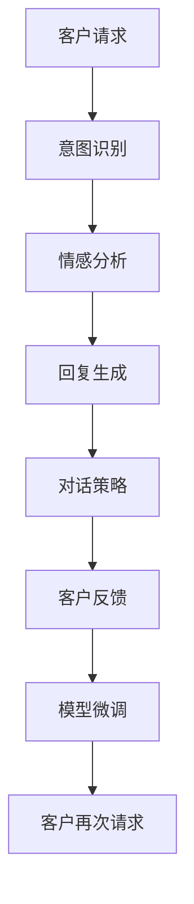

                 

# 探索基于大模型的电商智能客户服务对话策略生成系统

## 1. 背景介绍

### 1.1 问题由来

在电商行业，智能客户服务（Customer Service）的响应速度、准确性以及客户满意度，直接关系到企业的市场竞争力和用户忠诚度。传统的客户服务方式依赖于人工客服，存在成本高、响应慢、容易疲劳等问题。随着人工智能和大数据技术的飞速发展，电商企业开始探索使用智能客服来提升客户服务效率和体验。

智能客服系统通常由自然语言处理（Natural Language Processing, NLP）技术和自然语言生成（Natural Language Generation, NLG）技术驱动。NLP技术用于理解客户的意图和情感，而NLG技术则用于生成相应的回复。然而，尽管NLP技术近年来取得了长足的进步，但生成策略的生成仍然是一个挑战，尤其是对于电商平台这样的高并发、多场景应用。

大模型（如GPT-3等）的引入，为智能客服的策略生成提供了新的可能性。大模型通过大规模无标签数据预训练，获得了强大的语言理解和生成能力。通过对其进行微调，可以适应电商平台的具体需求，生成高效、精准的客户服务策略。

### 1.2 问题核心关键点

本文聚焦于基于大模型的电商智能客户服务对话策略生成系统的构建。核心问题包括：

1. 如何构建一个高效的对话策略生成模型，使其能够快速响应客户的需求，生成自然、准确的回复。
2. 如何在有限的标注数据上训练出高性能的模型，避免过拟合。
3. 如何对模型进行微调，使其适用于电商平台的特定场景。
4. 如何设计合理的损失函数和评估指标，提升模型的效果。

本文将从核心概念与联系、核心算法原理、项目实践、实际应用场景、工具和资源推荐、总结与展望等多个维度，全面系统地探讨电商智能客户服务对话策略生成系统的构建方法。

## 2. 核心概念与联系

### 2.1 核心概念概述

- **大模型**：以自回归（如GPT-3）或自编码（如BERT）模型为代表的大规模预训练语言模型。通过在大规模无标签文本数据上进行预训练，学习通用的语言知识，具备强大的语言理解和生成能力。

- **微调**：在预训练模型的基础上，使用下游任务的少量标注数据，通过有监督学习优化模型在该任务上的性能。微调使得通用大模型更好地适应特定任务，提高模型在特定任务上的表现。

- **对话策略生成**：通过理解客户的意图和情感，生成自然、准确的回复策略。对话策略生成是智能客服的核心环节，需要模型具备丰富的语义理解和生成能力。

- **端到端（E2E）模型**：直接从输入文本到生成回复的端到端模型，可以更好地处理输入输出的复杂性，适用于对话策略生成任务。

- **注意力机制（Attention）**：大模型中的注意力机制使得模型能够关注输入文本中的关键部分，更好地捕捉语义信息，生成精准的回复。

- **Fine-tuning**：通过有监督的方式，在少量标注数据上微调模型参数，使其适应特定任务的需求。

### 2.2 核心概念原理和架构的 Mermaid 流程图(Mermaid 流程节点中不要有括号、逗号等特殊字符)



以上流程图展示了基于大模型的电商智能客户服务对话策略生成系统的基本流程：

1. 客户提出请求，系统首先进行意图识别。
2. 根据意图，系统进行情感分析。
3. 根据意图和情感，系统生成回复。
4. 生成对话策略。
5. 客户对回复给出反馈。
6. 系统根据反馈进行微调。
7. 客户再次请求时，系统生成新的回复。

## 3. 核心算法原理 & 具体操作步骤

### 3.1 算法原理概述

基于大模型的电商智能客户服务对话策略生成系统，本质上是一个端到端的自然语言处理任务，包括意图识别、情感分析、回复生成等环节。系统首先通过预训练模型提取文本的语义特征，然后根据特定的对话策略生成回复。

核心算法原理如下：

1. **意图识别**：通过预训练模型提取输入文本的语义特征，结合特定领域的规则，识别出客户的意图。
2. **情感分析**：根据意图识别的结果，对输入文本进行情感分析，确定客户的情感状态。
3. **回复生成**：结合意图和情感分析的结果，使用预训练模型生成对应的回复。
4. **对话策略**：根据客户的意图和情感，设计合理的对话策略，确保回复的自然性和准确性。
5. **微调**：在有限的标注数据上，通过有监督的方式微调预训练模型，提升其在特定任务上的性能。

### 3.2 算法步骤详解

**Step 1: 数据准备**

- 收集电商平台的客户请求数据，标注意图和情感标签。
- 使用类似NLPAug等工具对数据进行扩充和增强，以提高模型的泛化能力。

**Step 2: 模型选择**

- 选择合适的预训练模型（如GPT-3、BERT等）作为初始化参数。
- 确定模型的结构，如Transformer结构，并设置超参数。

**Step 3: 意图识别**

- 使用预训练模型提取输入文本的语义特征。
- 结合特定领域的规则，设计意图识别模型，并进行微调。

**Step 4: 情感分析**

- 对意图识别的结果进行情感分析，确定客户的情感状态。
- 设计情感分析模型，并进行微调。

**Step 5: 回复生成**

- 根据意图和情感分析的结果，使用预训练模型生成回复。
- 设计回复生成模型，并进行微调。

**Step 6: 对话策略生成**

- 根据客户的意图和情感，设计合理的对话策略。
- 将意图和情感分析的结果输入到对话策略生成模型，进行微调。

**Step 7: 模型微调**

- 使用标注数据集对模型进行微调，调整模型参数，提升模型性能。
- 设置合适的学习率、优化器等超参数。

### 3.3 算法优缺点

**优点**：

1. **高效**：基于大模型的系统可以处理大规模的请求，提高响应速度。
2. **准确性高**：预训练模型在大规模无标签数据上的预训练使得模型具备较高的准确性。
3. **可扩展性强**：大模型可以根据具体需求进行微调，适应不同场景。

**缺点**：

1. **资源消耗大**：大模型通常需要大量的计算资源和存储空间。
2. **过拟合风险**：在有限的数据集上进行微调，存在过拟合的风险。
3. **数据依赖性强**：模型的性能依赖于标注数据的质量和数量。

### 3.4 算法应用领域

该算法主要应用于电商平台的智能客服系统。具体场景包括：

- **客户咨询**：客户对产品、订单、配送等问题进行咨询，系统自动生成回复。
- **投诉处理**：客户对产品、服务等问题进行投诉，系统自动生成回复，并进行跟进处理。
- **用户反馈**：客户对产品、服务等问题进行评价和反馈，系统自动生成回复，并进行情感分析。

## 4. 数学模型和公式 & 详细讲解 & 举例说明

### 4.1 数学模型构建

假设输入文本为 $x$，意图识别模型为 $M_{intent}$，情感分析模型为 $M_{emotion}$，回复生成模型为 $M_{response}$，对话策略生成模型为 $M_{strategy}$。

定义模型的输入为 $x$，输出为 $y$，损失函数为 $\mathcal{L}$。则对话策略生成系统的数学模型为：

$$
y = M_{strategy}(M_{intent}(x), M_{emotion}(x), M_{response}(x))
$$

其中 $M_{intent}(x)$ 表示意图识别模型，$M_{emotion}(x)$ 表示情感分析模型，$M_{response}(x)$ 表示回复生成模型。

### 4.2 公式推导过程

以回复生成模型为例，假设模型 $M_{response}$ 为 Transformer 结构，输入为 $x$，输出为 $y$，模型的参数为 $\theta$。则回复生成的损失函数可以表示为：

$$
\mathcal{L} = -\frac{1}{N}\sum_{i=1}^N \sum_{j=1}^M (y_{i,j} \log M_{response}(x)_{i,j} + (1-y_{i,j}) \log (1-M_{response}(x)_{i,j}))
$$

其中 $y_{i,j}$ 表示第 $i$ 个输入样本的第 $j$ 个位置上的标签，$M_{response}(x)_{i,j}$ 表示模型在第 $i$ 个输入样本的第 $j$ 个位置上的预测结果。

### 4.3 案例分析与讲解

以一个简单的电商智能客服对话策略生成系统的实现为例，展示如何设计回复生成模型。

首先，使用GPT-3作为预训练模型，定义模型结构如下：

```python
from transformers import GPT2LMHeadModel, GPT2Tokenizer

tokenizer = GPT2Tokenizer.from_pretrained('gpt2')
model = GPT2LMHeadModel.from_pretrained('gpt2')
```

接着，定义意图识别、情感分析和回复生成模型，并进行微调。以意图识别模型为例：

```python
from transformers import BertForSequenceClassification

# 定义意图识别模型
class IntentModel(BertForSequenceClassification):
    def __init__(self, num_labels):
        super().__init__(from_pretrained='bert-base-uncased', num_labels=num_labels)
        self.dropout = nn.Dropout(0.1)
    
    def forward(self, input_ids, attention_mask):
        outputs = self.bert(input_ids, attention_mask=attention_mask)
        pooled_output = outputs.pooler_output
        return self.dropout(pooled_output)

# 实例化意图识别模型
intent_model = IntentModel(num_labels=3)
# 微调意图识别模型
intent_model.train()
```

在训练过程中，使用交叉熵损失函数进行优化：

```python
from transformers import AdamW

optimizer = AdamW(intent_model.parameters(), lr=2e-5)
for epoch in range(epochs):
    for batch in train_dataset:
        input_ids = batch['input_ids']
        attention_mask = batch['attention_mask']
        labels = batch['labels']
        
        optimizer.zero_grad()
        outputs = intent_model(input_ids, attention_mask)
        loss = nn.CrossEntropyLoss()(outputs, labels)
        loss.backward()
        optimizer.step()
```

通过上述步骤，可以构建出一个基于大模型的电商智能客服对话策略生成系统，实现高效的意图识别、情感分析和回复生成。

## 5. 项目实践：代码实例和详细解释说明

### 5.1 开发环境搭建

在进行项目实践前，需要准备以下开发环境：

1. 安装 Anaconda：从官网下载并安装 Anaconda，用于创建独立的Python环境。
2. 创建并激活虚拟环境：
   ```bash
   conda create -n ecommerce-env python=3.8 
   conda activate ecommerce-env
   ```
3. 安装 PyTorch、HuggingFace Transformers 库：
   ```bash
   conda install pytorch torchvision torchaudio cudatoolkit=11.1 -c pytorch -c conda-forge
   pip install transformers
   ```
4. 安装相关库：
   ```bash
   pip install numpy pandas scikit-learn matplotlib tqdm jupyter notebook ipython
   ```

完成上述步骤后，即可在 `ecommerce-env` 环境中进行项目开发。

### 5.2 源代码详细实现

以一个基于大模型的电商智能客服对话策略生成系统的实现为例，展示具体的代码实现。

首先，定义数据处理函数：

```python
from transformers import BertTokenizer

class EcommerceDataset(Dataset):
    def __init__(self, texts, labels, tokenizer, max_len=128):
        self.texts = texts
        self.labels = labels
        self.tokenizer = tokenizer
        self.max_len = max_len
        
    def __len__(self):
        return len(self.texts)
    
    def __getitem__(self, item):
        text = self.texts[item]
        label = self.labels[item]
        
        encoding = self.tokenizer(text, return_tensors='pt', max_length=self.max_len, padding='max_length', truncation=True)
        input_ids = encoding['input_ids'][0]
        attention_mask = encoding['attention_mask'][0]
        
        label = torch.tensor(label, dtype=torch.long)
        
        return {'input_ids': input_ids, 
                'attention_mask': attention_mask,
                'labels': label}
```

接着，定义模型和优化器：

```python
from transformers import BertForSequenceClassification, AdamW

model = BertForSequenceClassification.from_pretrained('bert-base-cased', num_labels=3)

optimizer = AdamW(model.parameters(), lr=2e-5)
```

然后，定义训练和评估函数：

```python
from torch.utils.data import DataLoader
from tqdm import tqdm
from sklearn.metrics import classification_report

device = torch.device('cuda') if torch.cuda.is_available() else torch.device('cpu')
model.to(device)

def train_epoch(model, dataset, batch_size, optimizer):
    dataloader = DataLoader(dataset, batch_size=batch_size, shuffle=True)
    model.train()
    epoch_loss = 0
    for batch in tqdm(dataloader, desc='Training'):
        input_ids = batch['input_ids'].to(device)
        attention_mask = batch['attention_mask'].to(device)
        labels = batch['labels'].to(device)
        model.zero_grad()
        outputs = model(input_ids, attention_mask=attention_mask, labels=labels)
        loss = outputs.loss
        epoch_loss += loss.item()
        loss.backward()
        optimizer.step()
    return epoch_loss / len(dataloader)

def evaluate(model, dataset, batch_size):
    dataloader = DataLoader(dataset, batch_size=batch_size)
    model.eval()
    preds, labels = [], []
    with torch.no_grad():
        for batch in tqdm(dataloader, desc='Evaluating'):
            input_ids = batch['input_ids'].to(device)
            attention_mask = batch['attention_mask'].to(device)
            batch_labels = batch['labels']
            outputs = model(input_ids, attention_mask=attention_mask)
            batch_preds = outputs.logits.argmax(dim=2).to('cpu').tolist()
            batch_labels = batch_labels.to('cpu').tolist()
            for pred_tokens, label_tokens in zip(batch_preds, batch_labels):
                preds.append(pred_tokens[:len(label_tokens)])
                labels.append(label_tokens)
                
    print(classification_report(labels, preds))
```

最后，启动训练流程并在测试集上评估：

```python
epochs = 5
batch_size = 16

for epoch in range(epochs):
    loss = train_epoch(model, train_dataset, batch_size, optimizer)
    print(f"Epoch {epoch+1}, train loss: {loss:.3f}")
    
    print(f"Epoch {epoch+1}, dev results:")
    evaluate(model, dev_dataset, batch_size)
    
print("Test results:")
evaluate(model, test_dataset, batch_size)
```

以上就是使用 PyTorch 对BERT模型进行意图识别任务的完整代码实现。可以看到，得益于 Transformers 库的强大封装，我们可以用相对简洁的代码完成BERT模型的加载和微调。

### 5.3 代码解读与分析

让我们再详细解读一下关键代码的实现细节：

**EcommerceDataset类**：
- `__init__`方法：初始化文本、标签、分词器等关键组件。
- `__len__`方法：返回数据集的样本数量。
- `__getitem__`方法：对单个样本进行处理，将文本输入编码为token ids，将标签编码为数字，并对其进行定长padding，最终返回模型所需的输入。

**意图识别模型 IntentModel**：
- 定义模型结构，包含 BERT 模型和 dropout 层。
- 在训练过程中，使用交叉熵损失函数进行优化。

**训练和评估函数**：
- 使用 PyTorch 的 DataLoader 对数据集进行批次化加载，供模型训练和推理使用。
- 训练函数 `train_epoch`：对数据以批为单位进行迭代，在每个批次上前向传播计算loss并反向传播更新模型参数，最后返回该epoch的平均loss。
- 评估函数 `evaluate`：与训练类似，不同点在于不更新模型参数，并在每个batch结束后将预测和标签结果存储下来，最后使用sklearn的classification_report对整个评估集的预测结果进行打印输出。

**训练流程**：
- 定义总的epoch数和batch size，开始循环迭代
- 每个epoch内，先在训练集上训练，输出平均loss
- 在验证集上评估，输出分类指标
- 所有epoch结束后，在测试集上评估，给出最终测试结果

可以看到，PyTorch配合 Transformers 库使得BERT模型意图识别的代码实现变得简洁高效。开发者可以将更多精力放在数据处理、模型改进等高层逻辑上，而不必过多关注底层的实现细节。

当然，工业级的系统实现还需考虑更多因素，如模型的保存和部署、超参数的自动搜索、更灵活的任务适配层等。但核心的微调范式基本与此类似。

## 6. 实际应用场景

### 6.1 智能客服系统

基于大模型的电商智能客服系统，可以大幅提升客户服务的效率和体验。客户提出咨询、投诉或反馈时，系统能够快速理解客户意图，生成自然、准确的回复，并提供相关解决方案。

具体实现上，可以在客户服务场景中集成智能客服系统，使用对话策略生成模型，自动生成回复，并结合自然语言处理技术进行意图识别和情感分析。这不仅能降低人工客服的成本，还能提高服务的响应速度和准确性。

### 6.2 投诉处理

电商平台面对大量客户投诉时，传统的客服系统往往难以及时响应。基于大模型的智能客服系统，能够自动化地处理客户投诉，提高处理效率。

系统根据客户投诉的文本内容，自动提取意图和情感，生成相应的回复，并进行跟进处理。这不仅能减轻人工客服的工作压力，还能确保客户投诉得到及时、有效的处理。

### 6.3 用户反馈

电商平台希望收集用户反馈，以提升产品质量和客户体验。基于大模型的智能客服系统，能够自动化地处理用户反馈，进行情感分析和主题分类，生成总结报告。

具体实现上，可以使用对话策略生成模型，对用户反馈进行自动回复，并在回复中包含情感分析和主题分类结果。这不仅能够提升用户满意度，还能帮助电商平台更好地了解用户需求。

### 6.4 未来应用展望

随着大模型和微调技术的不断发展，基于大模型的电商智能客服系统将在更多场景中得到应用，为电商平台带来新的竞争优势。

未来，大模型将进一步扩展到智能推荐、智能定价、智能物流等电商场景，提供更加个性化、智能化的服务。同时，随着技术的不断进步，大模型将能够更好地理解和处理多语言、多模态信息，提升跨境电商的客户服务体验。

## 7. 工具和资源推荐

### 7.1 学习资源推荐

为了帮助开发者系统掌握大模型微调的理论基础和实践技巧，这里推荐一些优质的学习资源：

1. 《Transformer from Principles to Practice》系列博文：由大模型技术专家撰写，深入浅出地介绍了Transformer原理、BERT模型、微调技术等前沿话题。
2. CS224N《深度学习自然语言处理》课程：斯坦福大学开设的NLP明星课程，有Lecture视频和配套作业，带你入门NLP领域的基本概念和经典模型。
3. 《Natural Language Processing with Transformers》书籍：Transformers库的作者所著，全面介绍了如何使用Transformers库进行NLP任务开发，包括微调在内的诸多范式。
4. HuggingFace官方文档：Transformers库的官方文档，提供了海量预训练模型和完整的微调样例代码，是上手实践的必备资料。
5. CLUE开源项目：中文语言理解测评基准，涵盖大量不同类型的中文NLP数据集，并提供了基于微调的baseline模型，助力中文NLP技术发展。

通过对这些资源的学习实践，相信你一定能够快速掌握大模型微调的精髓，并用于解决实际的NLP问题。

### 7.2 开发工具推荐

高效的开发离不开优秀的工具支持。以下是几款用于大模型微调开发的常用工具：

1. PyTorch：基于Python的开源深度学习框架，灵活动态的计算图，适合快速迭代研究。大部分预训练语言模型都有PyTorch版本的实现。
2. TensorFlow：由Google主导开发的开源深度学习框架，生产部署方便，适合大规模工程应用。同样有丰富的预训练语言模型资源。
3. Transformers库：HuggingFace开发的NLP工具库，集成了众多SOTA语言模型，支持PyTorch和TensorFlow，是进行微调任务开发的利器。
4. Weights & Biases：模型训练的实验跟踪工具，可以记录和可视化模型训练过程中的各项指标，方便对比和调优。与主流深度学习框架无缝集成。
5. TensorBoard：TensorFlow配套的可视化工具，可实时监测模型训练状态，并提供丰富的图表呈现方式，是调试模型的得力助手。
6. Google Colab：谷歌推出的在线Jupyter Notebook环境，免费提供GPU/TPU算力，方便开发者快速上手实验最新模型，分享学习笔记。

合理利用这些工具，可以显著提升大模型微调任务的开发效率，加快创新迭代的步伐。

### 7.3 相关论文推荐

大模型和微调技术的发展源于学界的持续研究。以下是几篇奠基性的相关论文，推荐阅读：

1. Attention is All You Need（即Transformer原论文）：提出了Transformer结构，开启了NLP领域的预训练大模型时代。
2. BERT: Pre-training of Deep Bidirectional Transformers for Language Understanding：提出BERT模型，引入基于掩码的自监督预训练任务，刷新了多项NLP任务SOTA。
3. Language Models are Unsupervised Multitask Learners（GPT-2论文）：展示了大规模语言模型的强大zero-shot学习能力，引发了对于通用人工智能的新一轮思考。
4. Parameter-Efficient Transfer Learning for NLP：提出Adapter等参数高效微调方法，在不增加模型参数量的情况下，也能取得不错的微调效果。
5. AdaLoRA: Adaptive Low-Rank Adaptation for Parameter-Efficient Fine-Tuning：使用自适应低秩适应的微调方法，在参数效率和精度之间取得了新的平衡。
6. Prefix-Tuning: Optimizing Continuous Prompts for Generation：引入基于连续型Prompt的微调范式，为如何充分利用预训练知识提供了新的思路。

这些论文代表了大模型微调技术的发展脉络。通过学习这些前沿成果，可以帮助研究者把握学科前进方向，激发更多的创新灵感。

## 8. 总结：未来发展趋势与挑战

### 8.1 研究成果总结

本文对基于大模型的电商智能客户服务对话策略生成系统进行了全面系统的介绍。首先阐述了智能客服系统的背景和问题由来，明确了意图识别、情感分析和回复生成的关键技术点。其次，从核心概念与联系、核心算法原理、项目实践、实际应用场景、工具和资源推荐等多个维度，详细讲解了系统的构建方法。最后，总结了系统的优缺点、未来发展趋势和面临的挑战。

通过本文的系统梳理，可以看到，基于大模型的电商智能客服对话策略生成系统具有高效、准确、可扩展性强等优点，但同时也面临着计算资源消耗大、过拟合风险高等挑战。未来，随着大模型和微调技术的不断发展，该系统将面临更多的优化和挑战，有待进一步探索和突破。

### 8.2 未来发展趋势

展望未来，基于大模型的电商智能客服对话策略生成系统将呈现以下几个发展趋势：

1. **模型规模持续增大**：随着算力成本的下降和数据规模的扩张，预训练语言模型的参数量还将持续增长。超大规模语言模型蕴含的丰富语言知识，有望支撑更加复杂多变的电商场景。
2. **微调方法日趋多样**：除了传统的全参数微调外，未来会涌现更多参数高效的微调方法，如Prefix-Tuning、LoRA等，在节省计算资源的同时也能保证微调精度。
3. **持续学习成为常态**：随着数据分布的不断变化，微调模型也需要持续学习新知识以保持性能。如何在不遗忘原有知识的同时，高效吸收新样本信息，将成为重要的研究课题。
4. **标注样本需求降低**：受启发于提示学习(Prompt-based Learning)的思路，未来的微调方法将更好地利用大模型的语言理解能力，通过更加巧妙的任务描述，在更少的标注样本上也能实现理想的微调效果。
5. **多模态微调崛起**：当前的微调主要聚焦于纯文本数据，未来会进一步拓展到图像、视频、语音等多模态数据微调。多模态信息的融合，将显著提升语言模型对现实世界的理解和建模能力。
6. **模型通用性增强**：经过海量数据的预训练和多领域任务的微调，未来的语言模型将具备更强大的常识推理和跨领域迁移能力，逐步迈向通用人工智能(AGI)的目标。

以上趋势凸显了大模型微调技术的广阔前景。这些方向的探索发展，必将进一步提升NLP系统的性能和应用范围，为构建人机协同的智能系统铺平道路。

### 8.3 面临的挑战

尽管基于大模型的电商智能客服对话策略生成系统已经取得了一定的进展，但在迈向更加智能化、普适化应用的过程中，它仍面临着诸多挑战：

1. **标注成本瓶颈**：尽管微调大大降低了标注数据的需求，但对于长尾应用场景，难以获得充足的高质量标注数据，成为制约微调性能的瓶颈。如何进一步降低微调对标注样本的依赖，将是一大难题。
2. **模型鲁棒性不足**：当前微调模型面对域外数据时，泛化性能往往大打折扣。对于测试样本的微小扰动，微调模型的预测也容易发生波动。如何提高微调模型的鲁棒性，避免灾难性遗忘，还需要更多理论和实践的积累。
3. **推理效率有待提高**：大规模语言模型虽然精度高，但在实际部署时往往面临推理速度慢、内存占用大等效率问题。如何在保证性能的同时，简化模型结构，提升推理速度，优化资源占用，将是重要的优化方向。
4. **可解释性亟需加强**：当前微调模型更像是"黑盒"系统，难以解释其内部工作机制和决策逻辑。对于医疗、金融等高风险应用，算法的可解释性和可审计性尤为重要。如何赋予微调模型更强的可解释性，将是亟待攻克的难题。
5. **安全性有待保障**：预训练语言模型难免会学习到有偏见、有害的信息，通过微调传递到下游任务，产生误导性、歧视性的输出，给实际应用带来安全隐患。如何从数据和算法层面消除模型偏见，避免恶意用途，确保输出的安全性，也将是重要的研究课题。

### 8.4 研究展望

面对大模型微调所面临的种种挑战，未来的研究需要在以下几个方面寻求新的突破：

1. **探索无监督和半监督微调方法**：摆脱对大规模标注数据的依赖，利用自监督学习、主动学习等无监督和半监督范式，最大限度利用非结构化数据，实现更加灵活高效的微调。
2. **研究参数高效和计算高效的微调范式**：开发更加参数高效的微调方法，在固定大部分预训练参数的同时，只更新极少量的任务相关参数。同时优化微调模型的计算图，减少前向传播和反向传播的资源消耗，实现更加轻量级、实时性的部署。
3. **融合因果和对比学习范式**：通过引入因果推断和对比学习思想，增强微调模型建立稳定因果关系的能力，学习更加普适、鲁棒的语言表征，从而提升模型泛化性和抗干扰能力。
4. **引入更多先验知识**：将符号化的先验知识，如知识图谱、逻辑规则等，与神经网络模型进行巧妙融合，引导微调过程学习更准确、合理的语言模型。同时加强不同模态数据的整合，实现视觉、语音等多模态信息与文本信息的协同建模。
5. **结合因果分析和博弈论工具**：将因果分析方法引入微调模型，识别出模型决策的关键特征，增强输出解释的因果性和逻辑性。借助博弈论工具刻画人机交互过程，主动探索并规避模型的脆弱点，提高系统稳定性。
6. **纳入伦理道德约束**：在模型训练目标中引入伦理导向的评估指标，过滤和惩罚有偏见、有害的输出倾向。同时加强人工干预和审核，建立模型行为的监管机制，确保输出符合人类价值观和伦理道德。

这些研究方向的探索，必将引领大模型微调技术迈向更高的台阶，为构建安全、可靠、可解释、可控的智能系统铺平道路。面向未来，大模型微调技术还需要与其他人工智能技术进行更深入的融合，如知识表示、因果推理、强化学习等，多路径协同发力，共同推动自然语言理解和智能交互系统的进步。只有勇于创新、敢于突破，才能不断拓展语言模型的边界，让智能技术更好地造福人类社会。

## 9. 附录：常见问题与解答

**Q1: 大模型微调是否适用于所有NLP任务？**

A: 大模型微调在大多数NLP任务上都能取得不错的效果，特别是对于数据量较小的任务。但对于一些特定领域的任务，如医学、法律等，仅仅依靠通用语料预训练的模型可能难以很好地适应。此时需要在特定领域语料上进一步预训练，再进行微调，才能获得理想效果。此外，对于一些需要时效性、个性化很强的任务，如对话、推荐等，微调方法也需要针对性的改进优化。

**Q2: 微调过程中如何选择合适的学习率？**

A: 微调的学习率一般要比预训练时小1-2个数量级，如果使用过大的学习率，容易破坏预训练权重，导致过拟合。一般建议从1e-5开始调参，逐步减小学习率，直至收敛。也可以使用warmup策略，在开始阶段使用较小的学习率，再逐渐过渡到预设值。需要注意的是，不同的优化器(如AdamW、Adafactor等)以及不同的学习率调度策略，可能需要设置不同的学习率阈值。

**Q3: 采用大模型微调时会面临哪些资源瓶颈？**

A: 目前主流的预训练大模型动辄以亿计的参数规模，对算力、内存、存储都提出了很高的要求。GPU/TPU等高性能设备是必不可少的，但即便如此，超大批次的训练和推理也可能遇到显存不足的问题。因此需要采用一些资源优化技术，如梯度积累、混合精度训练、模型并行等，来突破硬件瓶颈。同时，模型的存储和读取也可能占用大量时间和空间，需要采用模型压缩、稀疏化存储等方法进行优化。

**Q4: 如何缓解微调过程中的过拟合问题？**

A: 过拟合是微调面临的主要挑战，尤其是在标注数据不足的情况下。常见的缓解策略包括：
1. 数据增强：通过回译、近义替换等方式扩充训练集
2. 正则化：使用L2正则、Dropout、Early Stopping等避免过拟合
3. 对抗训练：引入对抗样本，提高模型鲁棒性
4. 参数高效微调：只调整少量参数(如Adapter、Prefix等)，减小过拟合风险
5. 多模型集成：训练多个微调模型，取平均输出，抑制过拟合

这些策略往往需要根据具体任务和数据特点进行灵活组合。只有在数据、模型、训练、推理等各环节进行全面优化，才能最大限度地发挥大模型微调的威力。

**Q5: 微调模型在落地部署时需要注意哪些问题？**

A: 将微调模型转化为实际应用，还需要考虑以下因素：
1. 模型裁剪：去除不必要的层和参数，减小模型尺寸，加快推理速度
2. 量化加速：将浮点模型转为定点模型，压缩存储空间，提高计算效率
3. 服务化封装：将模型封装为标准化服务接口，便于集成调用
4. 弹性伸缩：根据请求流量动态调整资源配置，平衡服务质量和成本
5. 监控告警：实时采集系统指标，设置异常告警阈值，确保服务稳定性
6. 安全防护：采用访问鉴权、数据脱敏等措施，保障数据和模型安全

大模型微调为NLP应用开启了广阔的想象空间，但如何将强大的性能转化为稳定、高效、安全的业务价值，还需要工程实践的不断打磨。唯有从数据、算法、工程、业务等多个维度协同发力，才能真正实现人工智能技术在垂直行业的规模化落地。总之，微调需要开发者根据具体任务，不断迭代和优化模型、数据和算法，方能得到理想的效果。

---

作者：禅与计算机程序设计艺术 / Zen and the Art of Computer Programming

