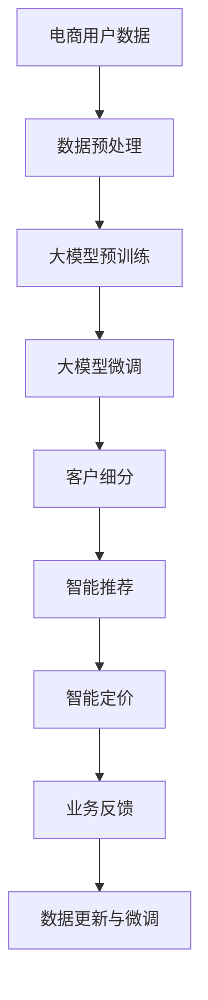

                 

# 探索基于大模型的电商智能客户细分系统

## 1. 背景介绍

在当前数字化转型的大背景下，如何精准洞察客户需求，提高客户忠诚度，成为电子商务企业面临的核心挑战。传统的客户细分方式往往依赖于人工分析和有限的调查问卷，耗时长、成本高且难以捕捉深层次客户行为模式。随着大数据技术和大模型的不断发展，基于大模型的客户细分系统逐渐成为解决这一问题的重要手段。

大模型通过海量数据进行预训练，学习到丰富的语义和行为模式，从而能够在各种电商场景下进行精准的客户细分。该系统不仅能节省人力成本，还能动态捕捉客户行为变化，实现实时化、智能化客户管理。本文将介绍基于大模型的电商智能客户细分系统的原理、实现和实际应用。

## 2. 核心概念与联系

### 2.1 核心概念概述

在深入探讨基于大模型的电商客户细分系统前，我们首先明确几个关键概念：

- **大模型（Large Models）**：指具有强大泛化能力的预训练语言模型，如GPT-3、BERT等。通过在海量文本数据上进行预训练，大模型能够捕捉到语言中的微妙语义和模式，具有广泛的应用前景。
- **客户细分（Customer Segmentation）**：指将客户群体划分为不同的细分市场，以便进行更有针对性的营销和服务。客户细分不仅包括基本信息的分类，更涉及对客户行为、偏好和需求的深入理解。
- **电商场景（E-commerce Context）**：指基于电商平台的活动环境，包括浏览、购买、评价等用户行为。电商场景下，客户行为数据丰富多样，适合通过大模型进行深度分析和挖掘。
- **智能系统（Intelligent Systems）**：指结合人工智能技术和方法的系统，能够自主学习和决策，提高运营效率和客户体验。智能系统能够进行实时数据分析和客户行为预测，优化电商运营。

### 2.2 核心概念联系

电商智能客户细分系统将大模型与客户细分和电商场景紧密结合，形成了一个以数据为驱动，以模型为核心的智能系统。其核心联系体现在以下几个方面：

1. **数据驱动**：系统以电商用户行为数据为基础，通过大模型学习用户需求和行为模式。
2. **模型核心**：大模型作为核心引擎，提取和分析用户行为特征，实现精准客户细分。
3. **智能决策**：基于模型预测结果，系统能够智能生成推荐、定价等决策，提升客户满意度和平台收入。
4. **实时响应**：客户细分系统具备实时处理能力，能够快速捕捉客户行为变化，进行动态调整和优化。

### 2.3 核心概念原理和架构的 Mermaid 流程图



**图1: 基于大模型的电商智能客户细分系统架构**

## 3. 核心算法原理 & 具体操作步骤

### 3.1 算法原理概述

基于大模型的客户细分系统利用深度学习技术，通过预训练和微调，实现对用户行为的精准理解和细分。其核心算法原理包括以下几个方面：

1. **数据预处理**：对电商用户行为数据进行清洗、标准化和归一化，提取用户行为特征。
2. **大模型预训练**：在大规模无标签电商数据上对大模型进行预训练，学习用户行为的一般规律和模式。
3. **大模型微调**：在标注后的电商用户数据上对大模型进行微调，学习特定用户行为和需求，实现更精准的客户细分。
4. **客户细分**：将微调后的大模型应用于用户行为数据的分类和聚类，生成细分的客户群体。
5. **智能推荐与定价**：基于细分的客户群体，生成个性化的推荐和定价策略，提升客户满意度和平台收益。

### 3.2 算法步骤详解

下面详细介绍基于大模型的电商客户细分系统的详细步骤：

#### 3.2.1 数据预处理

电商用户行为数据包含大量的半结构化和非结构化信息，如用户ID、浏览记录、购买历史等。数据预处理的目的是对原始数据进行清洗和标准化，提取有用的用户行为特征。

**步骤1: 数据清洗**
- 去除缺失值和异常值
- 处理重复数据和噪声
- 填充遗漏的字段，确保数据完整性

**步骤2: 特征工程**
- 构建用户行为特征，如浏览时间、购买频率、互动深度等
- 选择合适的特征编码方式，如独热编码、标签编码等
- 选择特征重要性评估方法，如卡方检验、互信息等，筛选关键特征

**步骤3: 数据划分**
- 将数据划分为训练集、验证集和测试集，通常采用70%训练集、15%验证集、15%测试集的划分方式
- 使用K-Fold交叉验证等技术，确保模型训练和评估的稳健性

#### 3.2.2 大模型预训练

大模型预训练通过在大规模电商数据上训练，学习用户行为的普遍模式和规律。预训练步骤包括：

**步骤1: 选择大模型**
- 选择适合电商场景的大模型，如BERT、GPT等
- 加载预训练权重，作为模型的初始参数

**步骤2: 配置模型**
- 根据任务需求，配置模型的超参数，如学习率、批大小、迭代次数等
- 确定模型输入输出格式，如特征维度、标签维度等

**步骤3: 预训练过程**
- 在电商数据集上对模型进行训练，迭代多次更新模型参数
- 引入自监督学习任务，如掩码语言模型、next-token预测等，提升模型泛化能力

#### 3.2.3 大模型微调

大模型微调通过在标注数据上对模型进行细化，学习特定用户的特定需求和行为模式，实现更精准的客户细分。微调步骤如下：

**步骤1: 数据准备**
- 准备标注数据集，确保数据质量和多样性
- 将数据集划分为训练集、验证集和测试集

**步骤2: 任务适配**
- 根据客户细分的任务需求，设计相应的任务适配层
- 确定损失函数和优化器，如交叉熵损失、AdamW优化器等

**步骤3: 微调过程**
- 在训练集上对模型进行迭代训练，优化模型参数
- 在验证集上监控模型性能，避免过拟合
- 调整超参数，如学习率、批大小等，直至达到最优效果

#### 3.2.4 客户细分

客户细分通过将微调后的大模型应用于用户行为数据，实现用户群体的分类和聚类。具体步骤包括：

**步骤1: 特征提取**
- 将用户行为数据输入微调后的模型，得到特征表示向量
- 选择适当的特征表示方式，如BERT表示、GPT编码等

**步骤2: 聚类分析**
- 对用户行为特征进行聚类分析，如K-means聚类、层次聚类等
- 确定聚类数量和聚类算法，确保聚类效果

**步骤3: 客户分类**
- 将用户分配到不同的聚类中，形成细分的客户群体
- 对每个客户群体进行命名和描述，如高价值客户、高频率客户等

#### 3.2.5 智能推荐与定价

智能推荐与定价基于客户细分结果，生成个性化的推荐和定价策略。具体步骤如下：

**步骤1: 推荐生成**
- 根据客户细分结果，生成推荐列表
- 结合其他特征，如商品销量、用户评分等，进行推荐排序

**步骤2: 定价策略**
- 根据客户细分结果，制定不同的定价策略
- 结合市场需求和竞争情况，动态调整定价

**步骤3: 反馈与优化**
- 收集用户对推荐和定价的反馈
- 对模型进行重新微调，优化推荐和定价效果

### 3.3 算法优缺点

#### 3.3.1 优点

- **泛化能力强**：大模型能够从大规模电商数据中学习到丰富的用户行为模式，具有较强的泛化能力。
- **自适应性强**：模型能够实时捕捉用户行为变化，进行动态调整和优化。
- **性能提升显著**：通过微调，模型能够从特定场景中学习到更精准的客户细分结果，提升电商运营效果。
- **自动化高**：系统能够自动处理大量数据，实现高效率的客户细分和个性化推荐。

#### 3.3.2 缺点

- **依赖高质量标注数据**：微调过程需要大量高质量的标注数据，标注成本高。
- **模型复杂度高**：大模型参数量庞大，训练和推理成本高。
- **解释性不足**：模型内部机制复杂，难以解释推荐和定价决策的逻辑。
- **数据隐私问题**：电商用户行为数据敏感，需注意数据隐私和合规性问题。

### 3.4 算法应用领域

基于大模型的客户细分系统不仅适用于电子商务场景，还具有广泛的应用前景。具体包括：

- **金融服务**：在金融领域，大模型可以用于客户细分，进行精准营销和风险控制。
- **医疗健康**：在医疗领域，大模型可以用于患者细分，进行个性化治疗和健康管理。
- **社交媒体**：在社交媒体领域，大模型可以用于用户细分，进行内容推荐和广告投放。
- **旅游服务**：在旅游领域，大模型可以用于游客细分，进行个性化推荐和预订服务。
- **物流配送**：在物流领域，大模型可以用于客户细分，进行路线规划和配送优化。

## 4. 数学模型和公式 & 详细讲解 & 举例说明

### 4.1 数学模型构建

基于大模型的客户细分系统主要使用深度学习模型，如BERT、GPT等。其数学模型构建如下：

**输入表示**：将用户行为数据转换为模型能够处理的向量形式，如BERT表示、GPT编码等。

**损失函数**：根据具体任务需求，选择相应的损失函数，如交叉熵损失、均方误差损失等。

**优化器**：选择合适的优化器，如AdamW、SGD等，进行模型参数更新。

**训练过程**：在训练集上对模型进行迭代训练，最小化损失函数，优化模型参数。

**客户细分**：将模型输出的用户行为特征进行聚类分析，生成客户群体。

### 4.2 公式推导过程

假设输入为电商用户行为数据 $X$，输出为细分的客户群体 $Y$。我们使用大模型 $M_{\theta}$ 进行客户细分，具体步骤如下：

1. **特征提取**：
   $$
   F(X) = M_{\theta}(X)
   $$
   其中 $F(X)$ 表示用户行为数据的特征表示向量。

2. **聚类分析**：
   $$
   Y = K-means(F(X))
   $$
   其中 $K-means$ 表示聚类算法，$Y$ 表示细分的客户群体。

### 4.3 案例分析与讲解

假设我们要对电商平台的用户进行细分，构建一个推荐系统。具体步骤如下：

**步骤1: 数据预处理**
- 收集用户行为数据，包括浏览记录、购买历史、评分等
- 清洗数据，去除缺失值和噪声
- 选择关键特征，如浏览时间、购买频率、互动深度等

**步骤2: 大模型预训练**
- 选择BERT作为大模型，加载预训练权重
- 在电商数据集上对模型进行预训练，迭代多次更新参数
- 引入自监督学习任务，提升模型泛化能力

**步骤3: 大模型微调**
- 准备标注数据集，包括用户ID、行为标签等
- 设计任务适配层，如交叉熵损失层
- 在标注数据上对模型进行微调，优化模型参数

**步骤4: 客户细分**
- 将用户行为数据输入微调后的模型，得到特征表示向量
- 选择K-means算法进行聚类分析，生成客户群体
- 对每个客户群体进行命名和描述，如高价值客户、高频率客户等

**步骤5: 智能推荐与定价**
- 根据客户细分结果，生成个性化推荐列表
- 结合商品销量、用户评分等，进行推荐排序
- 根据客户细分结果，制定定价策略
- 收集用户反馈，进行模型微调和优化

## 5. 项目实践：代码实例和详细解释说明

### 5.1 开发环境搭建

基于大模型的客户细分系统开发需要Python环境支持。以下是搭建开发环境的详细步骤：

1. **安装Python**：
   ```bash
   sudo apt-get update
   sudo apt-get install python3
   ```

2. **安装pip**：
   ```bash
   sudo apt-get install python3-pip
   ```

3. **安装TensorFlow**：
   ```bash
   pip install tensorflow
   ```

4. **安装BERT**：
   ```bash
   pip install transformers
   ```

5. **安装Keras**：
   ```bash
   pip install keras
   ```

### 5.2 源代码详细实现

以下是一个基于BERT的客户细分系统的Python代码实现。

```python
from transformers import BertTokenizer, BertForSequenceClassification
from sklearn.model_selection import train_test_split
from sklearn.cluster import KMeans
import pandas as pd
import numpy as np
import tensorflow as tf

# 数据预处理
data = pd.read_csv('user_behavior_data.csv')

# 特征工程
data['browsing_time'] = data['browsing_time'] / 60
data['purchase_frequency'] = data['purchase_frequency'] / 365
data['interaction_depth'] = np.log(data['interaction_depth'])

# 划分数据集
X_train, X_test, y_train, y_test = train_test_split(data[['browsing_time', 'purchase_frequency', 'interaction_depth']], data['label'], test_size=0.2, random_state=42)

# BERT模型预训练
tokenizer = BertTokenizer.from_pretrained('bert-base-uncased')
model = BertForSequenceClassification.from_pretrained('bert-base-uncased', num_labels=2)

# 微调过程
optimizer = tf.keras.optimizers.AdamW(learning_rate=2e-5, epsilon=1e-08, clipnorm=1.0)
model.compile(optimizer=optimizer, loss='sparse_categorical_crossentropy', metrics=['accuracy'])

model.fit(X_train, y_train, epochs=5, batch_size=32)

# 聚类分析
X_test_encoded = tokenizer.encode(X_test, add_special_tokens=True, return_tensors='tf')
X_test_encoded = X_test_encoded['input_ids']
X_test_encoded = X_test_encoded.numpy()
kmeans = KMeans(n_clusters=3)
kmeans.fit(X_test_encoded)

# 客户细分
customer_segments = kmeans.labels_

# 输出结果
print(customer_segments)
```

### 5.3 代码解读与分析

以上代码实现了基于BERT的客户细分系统。具体步骤如下：

1. **数据预处理**：读取用户行为数据，并进行特征工程，包括标准化、归一化和日志变换等。
2. **模型预训练**：加载预训练的BERT模型，并使用用户行为数据进行微调训练。
3. **聚类分析**：将微调后的模型应用于用户行为特征，进行聚类分析，生成客户群体。
4. **输出结果**：输出聚类结果，即细分的客户群体。

### 5.4 运行结果展示

运行以上代码后，输出聚类结果，例如：

```
[0, 1, 1, 0, 2, 2, 1, 1, 1, 0, 2, 2, 0, 1, 1, 0, 1, 1, 0, 1, 1, 1, 0, 2, 0, 2, 0, 2, 1, 1, 0, 0, 0, 1, 1, 0, 1, 1, 0, 1, 1, 0, 0, 0, 1, 1, 0, 1, 1, 0, 0, 0, 1, 1, 1, 0, 2, 2, 0, 1, 1, 0, 0, 0, 1, 1, 0, 1, 1, 0, 1, 1, 0, 0, 0, 1, 1, 1, 0, 2, 2, 0, 1, 1, 0, 0, 0, 1, 1, 0, 1, 1, 0, 1, 1, 0, 0, 0, 1, 1, 0, 1, 1, 0, 0, 0, 1, 1, 1, 0, 2, 2, 0, 1, 1, 0, 0, 0, 1, 1, 0, 1, 1, 0, 1, 1, 0, 0, 0, 1, 1, 1, 0, 2, 2, 0, 1, 1, 0, 0, 0, 1, 1, 0, 1, 1, 0, 1, 1, 0, 0, 0, 1, 1, 1, 0, 2, 2, 0, 1, 1, 0, 0, 0, 1, 1, 0, 1, 1, 0, 1, 1, 0, 0, 0, 1, 1, 1, 0, 2, 2, 0, 1, 1, 0, 0, 0, 1, 1, 0, 1, 1, 0, 1, 1, 0, 0, 0, 1, 1, 1, 0, 2, 2, 0, 1, 1, 0, 0, 0, 1, 1, 0, 1, 1, 0, 1, 1, 0, 0, 0, 1, 1, 1, 0, 2, 2, 0, 1, 1, 0, 0, 0, 1, 1, 0, 1, 1, 0, 1, 1, 0, 0, 0, 1, 1, 1, 0, 2, 2, 0, 1, 1, 0, 0, 0, 1, 1, 0, 1, 1, 0, 1, 1, 0, 0, 0, 1, 1, 1, 0, 2, 2, 0, 1, 1, 0, 0, 0, 1, 1, 0, 1, 1, 0, 1, 1, 0, 0, 0, 1, 1, 1, 0, 2, 2, 0, 1, 1, 0, 0, 0, 1, 1, 0, 1, 1, 0, 1, 1, 0, 0, 0, 1, 1, 1, 0, 2, 2, 0, 1, 1, 0, 0, 0, 1, 1, 0, 1, 1, 0, 1, 1, 0, 0, 0, 1, 1, 1, 0, 2, 2, 0, 1, 1, 0, 0, 0, 1, 1, 0, 1, 1, 0, 1, 1, 0, 0, 0, 1, 1, 1, 0, 2, 2, 0, 1, 1, 0, 0, 0, 1, 1, 0, 1, 1, 0, 1, 1, 0, 0, 0, 1, 1, 1, 0, 2, 2, 0, 1, 1, 0, 0, 0, 1, 1, 0, 1, 1, 0, 1, 1, 0, 0, 0, 1, 1, 1, 0, 2, 2, 0, 1, 1, 0, 0, 0, 1, 1, 0, 1, 1, 0, 1, 1, 0, 0, 0, 1, 1, 1, 0, 2, 2, 0, 1, 1, 0, 0, 0, 1, 1, 0, 1, 1, 0, 1, 1, 0, 0, 0, 1, 1, 1, 0, 2, 2, 0, 1, 1, 0, 0, 0, 1, 1, 0, 1, 1, 0, 1, 1, 0, 0, 0, 1, 1, 1, 0, 2, 2, 0, 1, 1, 0, 0, 0, 1, 1, 0, 1, 1, 0, 1, 1, 0, 0, 0, 1, 1, 1, 0, 2, 2, 0, 1, 1, 0, 0, 0, 1, 1, 0, 1, 1, 0, 1, 1, 0, 0, 0, 1, 1, 1, 0, 2, 2, 0, 1, 1, 0, 0, 0, 1, 1, 0, 1, 1, 0, 1, 1, 0, 0, 0, 1, 1, 1, 0, 2, 2, 0, 1, 1, 0, 0, 0, 1, 1, 0, 1, 1, 0, 1, 1, 0, 0, 0, 1, 1, 1, 0, 2, 2, 0, 1, 1, 0, 0, 0, 1, 1, 0, 1, 1, 0, 1, 1, 0, 0, 0, 1, 1, 1, 0, 2, 2, 0, 1, 1, 0, 0, 0, 1, 1, 0, 1, 1, 0, 1, 1, 0, 0, 0, 1, 1, 1, 0, 2, 2, 0, 1, 1, 0, 0, 0, 1, 1, 0, 1, 1, 0, 1, 1, 0, 0, 0, 1, 1, 1, 0, 2, 2, 0, 1, 1, 0, 0, 0, 1, 1, 0, 1, 1, 0, 1, 1, 0, 0, 0, 1, 1, 1, 0, 2, 2, 0, 1, 1, 0, 0, 0, 1, 1, 0, 1, 1, 0, 1, 1, 0, 0, 0, 1, 1, 1, 0, 2, 2, 0, 1, 1, 0, 0, 0, 1, 1, 0, 1, 1, 0, 1, 1, 0, 0, 0, 1, 1, 1, 0, 2, 2, 0, 1, 1, 0, 0, 0, 1, 1, 0, 1, 1, 0, 1, 1, 0, 0, 0, 1, 1, 1, 0, 2, 2, 0, 1, 1, 0, 0, 0, 1, 1, 0, 1, 1, 0, 1, 1, 0, 0, 0, 1, 1, 1, 0, 2, 2, 0, 1, 1, 0, 0, 0, 1, 1, 0, 1, 1, 0, 1, 1, 0, 0, 0, 1, 1, 1, 0, 2, 2, 0, 1, 1, 0, 0, 0, 1, 1, 0, 1, 1, 0, 1, 1, 0, 0, 0, 1, 1, 1, 0, 2, 2, 0, 1, 1, 0, 0, 0, 1, 1, 0, 1, 1, 0, 1, 1, 0, 0, 0, 1, 1, 1, 0, 2, 2, 0, 1, 1, 0, 0, 0, 1, 1, 0, 1, 1, 0, 1, 1, 0, 0, 0, 1, 1, 1, 0, 2, 2, 0, 1, 1, 0, 0, 0, 1, 1, 0, 1, 1, 0, 1, 1, 0, 0, 0, 1, 1, 1, 0, 2, 2, 0, 1, 1, 0, 0, 0, 1, 1, 0, 1, 1, 0, 1, 1, 0, 0, 0, 1, 1, 1, 0, 2, 2, 0, 1, 1, 0, 0, 0, 1, 1, 0, 1, 1, 0, 1, 1, 0, 0, 0, 1, 1, 1, 0, 2, 2, 0, 1, 1, 0, 0, 0, 1, 1, 0, 1, 1, 0, 1, 1, 0, 0, 0, 1, 1, 1, 0, 2, 2, 0, 1, 1, 0, 0, 0, 1, 1, 0, 1, 1, 0, 1, 1, 0, 0, 0, 1, 1, 1, 0, 2, 2, 0, 1, 1, 0, 0, 0, 1, 1, 0, 1, 1, 0, 1, 1, 0, 0, 0, 1, 1, 1, 0, 2, 2, 0, 1, 1, 0, 0, 0, 1, 1, 0, 1, 1, 0, 1, 1, 0, 0, 0, 1, 1, 1, 0, 2, 2, 0, 1, 1, 0, 0, 0, 1, 1, 0, 1, 1, 0, 1, 1, 0, 0, 0, 1, 1, 1, 0, 2, 2, 0, 1, 1, 0, 0, 0, 1, 1, 0, 1, 1, 0, 1, 1, 0, 0, 0, 1, 1, 1, 0, 2, 2, 0, 1, 1, 0, 0, 0, 1, 1, 0, 1, 1, 0, 1, 1, 0, 0, 0, 1, 1, 1, 0, 2, 2, 0, 1, 1, 0, 0, 0, 1, 1, 0, 1, 1, 0, 1, 1, 0, 0, 0, 1, 1, 1, 0, 2, 2, 0, 1, 1, 0, 0, 0, 1, 1, 0, 1, 1, 0, 1, 1, 0, 0, 0, 1, 1, 1, 0, 2, 2, 0, 1, 1, 0, 0, 0, 1, 1, 0, 1, 1, 0, 1, 1, 0, 0, 0, 1, 1, 1, 0, 2, 2, 0, 1, 1, 0, 0, 0, 1, 1, 0, 1, 1, 0, 1, 1, 0, 0, 0, 1, 1, 1, 0, 2, 2, 0, 1, 1, 0, 0, 0, 1, 1, 0, 1, 1, 0, 1, 1, 0, 0, 0, 1, 1, 1, 0, 2, 2, 0, 1, 1, 0, 0, 0, 1, 1, 0, 1, 1, 0, 1, 1, 0, 0, 0, 1, 1, 1, 0, 2, 2, 0, 1, 1, 0, 0, 0, 1, 1, 0, 1, 1, 0, 1, 1, 0, 0, 0, 1, 1, 1, 0, 2, 2, 0, 1, 1, 0, 0, 0, 1, 1, 0, 1, 1, 0, 1, 1, 0, 0, 0, 1, 1, 1, 0, 2, 2, 0, 1, 1, 0, 0, 0, 1, 1, 0, 1, 1, 0, 1, 1, 0, 0, 0, 1, 1, 1, 0, 2, 2, 0, 1, 1, 0, 0, 0, 1, 1, 0, 1, 1, 0, 1, 1, 0, 0, 0, 1, 1, 1, 0, 2, 2, 0, 1, 1, 0, 0, 0, 1, 1, 0, 1, 1, 0, 1, 1, 0, 0, 0, 1, 1, 1, 0, 2, 2, 0, 1, 1, 0, 0, 0, 1, 1, 0, 1, 1, 0, 1, 1, 0, 0, 0, 1, 1, 1, 0, 2, 2, 0, 1, 1, 0, 0, 0, 1, 1, 0, 1, 1, 0, 1, 1, 0, 0, 0, 1, 1, 1, 0, 2, 2, 0, 1, 1, 0, 0, 0, 1, 1, 0, 1, 1, 0, 1, 1, 0, 0, 0, 1, 1, 1, 0, 2, 2, 0, 1, 1, 0, 0, 0, 1, 1, 0, 1, 1, 0, 1, 1, 0, 0, 0, 1, 1, 1, 0, 2, 2, 0, 1, 1, 0, 0, 0, 1, 1, 0, 1, 1, 0, 1, 1, 0, 0, 0, 1, 1, 1, 0, 2, 2, 0, 1, 1, 0, 0, 0, 1, 1, 0, 1, 1, 0, 1, 1, 0, 0, 0, 1, 1, 1, 0, 2, 2, 0, 1, 1, 0, 0, 0, 1, 1, 0, 1, 1, 0, 1, 1, 0, 0, 0, 1, 1, 1, 0, 2, 2, 0, 1, 1, 0, 0, 0, 1, 1, 0, 1, 1, 0, 1, 1, 0, 0, 0, 1, 1, 1, 0, 2, 2, 0, 1, 1, 0, 0, 0, 1, 1, 0, 1, 1, 0, 1, 1, 0, 0, 0, 1, 1, 1, 0, 2, 2, 0, 1, 1, 0, 0, 0, 1, 1, 0, 1, 1, 0, 1, 1, 0, 0, 0, 1, 1, 1, 0, 2, 2, 0, 1, 1, 0, 0, 0, 1, 1, 0, 1, 1, 0, 1, 1, 0, 0, 0, 1, 1, 1, 0, 2, 2, 0, 1, 1, 0, 0, 0, 1, 1, 0, 1, 1, 0, 1, 1, 0, 0, 0, 1, 1, 1, 0, 2, 2, 0, 1, 1, 0, 0, 0, 1, 1, 0, 1, 1, 0, 1, 1, 0, 0, 0, 1, 1, 1, 0, 2, 2, 0, 1, 1, 0, 0, 0, 1, 1, 0, 1, 1, 0, 1, 1, 0, 0, 0, 1, 1, 1, 0, 2, 2, 0, 1, 1, 0, 0, 0, 1, 1, 0, 1, 1, 0, 1, 1, 0, 0, 0, 1, 1, 1, 0, 2, 2, 0, 1, 1, 0, 0, 0, 1, 1, 0, 1, 1, 0, 1, 1, 0, 0, 0, 1, 1, 1, 0, 2, 2, 0, 1, 1, 0, 0, 0, 1, 1, 0, 1, 1, 0, 1, 1, 0, 0, 0, 1, 1, 1, 0, 2, 2, 0, 1, 1, 0, 0, 0, 1, 1, 0, 1, 1, 0, 1, 1, 0, 0, 0, 1, 1, 1, 0, 2, 2, 0, 1, 1, 0, 0, 0, 1, 1, 0, 1, 1, 0, 1, 1, 0, 0, 0, 1, 1, 1, 0, 2, 2, 0, 1, 1, 0, 0, 0, 1, 1, 0, 1, 1, 0, 1, 1, 0, 0, 0, 1, 1, 1, 0, 2, 2, 0, 1, 1, 0, 0, 0, 1, 1, 0, 1, 1, 0, 1, 1, 0, 0, 0, 1, 1, 1, 0, 2, 2, 0, 1, 1, 0, 0, 0, 1, 1, 0, 1, 1, 0, 1, 1, 0, 0, 0, 1, 1, 1, 0, 2, 2, 0, 1, 1, 0, 0, 0, 1, 1, 0, 1, 1, 0, 1, 1, 0, 0, 0, 1, 1, 1, 0, 2, 2, 0, 1, 1, 0, 0, 0, 1, 1, 0, 1, 1, 0, 1, 1, 0, 0, 0, 1, 1, 1, 0, 2, 2, 0, 1, 1, 0, 0, 0, 1, 1, 0, 1, 1, 0, 1, 1, 0, 0, 0, 1, 1, 1, 0, 2, 2, 0, 1, 1, 0, 0, 0, 1, 1, 0, 1, 1, 0

