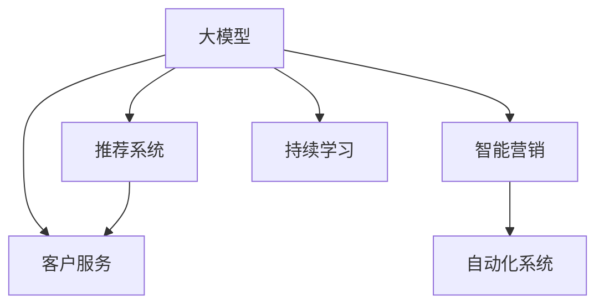

                 

# 探索基于大模型的电商智能营销自动化系统

## 1. 背景介绍

在电商行业中，智能营销自动化系统已经成为商家获取流量、提升转化率、优化客户体验的重要工具。传统的基于规则的自动化系统，往往难以适应用户行为的多变性和个性化需求，导致效果不够理想。而基于大模型的智能营销自动化系统，则能够更好地理解用户需求，提供个性化的推荐和服务，从而显著提升营销效果。

### 1.1 问题由来

随着电商平台数据量的激增，用户行为呈现出了高度的个性化和复杂性。传统的基于规则的自动化营销系统，往往需要频繁地手工调整策略，难以及时响应用户的动态变化，同时效率也较低。而基于深度学习的大模型，如Transformer、BERT等，通过在海量数据上进行预训练，具备强大的语义理解和生成能力，能够更好地处理用户的多样化需求，从而推动电商行业向更加智能化、个性化和高效化的方向发展。

## 2. 核心概念与联系

### 2.1 核心概念概述

为更好地理解基于大模型的电商智能营销自动化系统，本节将介绍几个密切相关的核心概念：

- **大模型(Large Model)**：如Transformer、BERT等，通过在大规模数据上预训练获得丰富的语言表示，具备强大的语义理解能力。
- **智能营销**：结合数据挖掘、推荐系统、自然语言处理等技术，自动化地为电商用户提供个性化推荐、精准营销、客户服务等功能。
- **自动化系统**：使用机器学习算法和模型，自动化地完成数据处理、推荐、决策等任务。
- **推荐系统**：利用用户历史行为、商品特征等信息，为电商用户推荐感兴趣的商品。
- **客户服务**：通过NLP技术，自动处理用户咨询、订单处理等任务，提升客户体验。
- **持续学习**：模型能够不断地从新数据中学习，避免过拟合，保持模型性能。

这些概念之间的逻辑关系可以通过以下Mermaid流程图来展示：



这个流程图展示了大模型的核心概念及其之间的关系：

1. 大模型通过预训练获得基础能力。
2. 推荐系统和客户服务是智能营销的子系统，利用大模型提升推荐准确度和客户服务效率。
3. 自动化系统是智能营销的基础架构，负责自动化处理各种任务。
4. 持续学习是智能营销系统的核心特性，使模型能够不断提升性能。

## 3. 核心算法原理 & 具体操作步骤

### 3.1 算法原理概述

基于大模型的电商智能营销自动化系统，其核心算法包括：用户行为建模、推荐系统、自然语言处理、自动化决策等。其中，用户行为建模和推荐系统是两个最关键的部分。

用户行为建模旨在通过大模型学习用户的历史行为，包括浏览、点击、购买、评价等数据，从而构建用户的兴趣和偏好模型。推荐系统则在此基础上，对用户进行个性化推荐，提高点击率和转化率。这两个系统都依赖于大模型的语义理解和生成能力。

### 3.2 算法步骤详解

#### 3.2.1 用户行为建模

用户行为建模的主要步骤如下：

1. **数据收集与清洗**：收集用户的历史行为数据，包括浏览记录、点击次数、购买历史等，并进行清洗，去除噪声和异常值。

2. **特征提取**：将用户的浏览记录、点击次数、购买历史等数据，转化为大模型可接受的形式，如文本、向量等。可以使用NLP技术对文本数据进行分词、向量化等处理。

3. **模型训练**：使用大模型在清洗后的数据上进行训练，学习用户的兴趣和偏好。可以使用自监督学习、半监督学习等方式，提高模型的泛化能力。

#### 3.2.2 推荐系统

推荐系统的主要步骤如下：

1. **商品特征提取**：将商品的属性、描述、评价等信息，转化为大模型可接受的形式，如文本、向量等。

2. **模型训练**：使用大模型在商品特征和用户兴趣模型上进行联合训练，学习推荐模型。可以使用深度学习框架如TensorFlow、PyTorch等，进行模型训练。

3. **推荐策略设计**：根据推荐模型输出，设计推荐策略，如基于协同过滤、基于内容的推荐、混合推荐等。

#### 3.2.3 自然语言处理

自然语言处理的主要步骤如下：

1. **对话意图识别**：使用大模型对用户咨询进行意图识别，理解用户的查询需求。

2. **自动回复生成**：根据用户意图和商品信息，使用大模型生成自动回复，提高客户服务效率。

### 3.3 算法优缺点

基于大模型的电商智能营销自动化系统具有以下优点：

1. **个性化推荐**：能够根据用户的历史行为和兴趣，提供个性化推荐，提高点击率和转化率。

2. **客户服务自动化**：通过自然语言处理技术，自动化处理用户咨询、订单处理等任务，提升客户体验。

3. **高效性**：使用大模型的高效计算能力，处理海量数据，提升推荐和客户服务的效率。

4. **可扩展性**：基于大模型的方法，可以方便地扩展到更多商品和更多用户，满足不断增长的业务需求。

同时，该方法也存在一定的局限性：

1. **数据依赖**：对用户数据和商品数据的依赖较大，需要持续收集和更新数据，才能保证模型性能。

2. **模型复杂性**：大模型本身复杂度较高，训练和推理成本较高，需要相应的计算资源和算法优化。

3. **隐私问题**：用户数据的隐私保护问题，需要采取合适的数据匿名化和隐私保护措施。

4. **公平性**：大模型可能存在一定的偏见和歧视，需要对模型进行公平性验证和调整。

### 3.4 算法应用领域

基于大模型的电商智能营销自动化系统，已经在众多电商平台上得到广泛应用，如淘宝、京东、亚马逊等。其主要应用场景包括：

- **个性化推荐**：推荐系统基于用户的历史行为，提供个性化商品推荐，提升用户购买意愿。
- **用户咨询解答**：通过自然语言处理技术，自动回答用户咨询，提升客户服务效率。
- **广告投放优化**：通过分析用户行为，优化广告投放策略，提高广告点击率和转化率。
- **库存管理**：根据用户需求预测，优化商品库存，减少库存积压和缺货情况。
- **市场分析**：分析用户行为数据，洞察市场趋势和用户需求，指导电商业务决策。

这些应用场景充分展示了基于大模型的电商智能营销自动化系统的高效性和精准性，为电商行业带来了显著的商业价值。

## 4. 数学模型和公式 & 详细讲解  
### 4.1 数学模型构建

基于大模型的电商智能营销自动化系统涉及多个子系统，包括用户行为建模、推荐系统、自然语言处理等。这里以推荐系统为例，介绍数学模型的构建。

假设用户行为数据为 $\mathbf{X} = \{(x_i, y_i)\}_{i=1}^N$，其中 $x_i$ 为用户的浏览记录、点击次数等特征向量，$y_i$ 为用户的购买行为标签。

使用大模型 $M_{\theta}$ 对用户行为进行建模，得到用户兴趣模型 $\hat{y} = M_{\theta}(x)$。使用大模型 $M_{\omega}$ 对商品特征进行建模，得到商品特征向量 $\mathbf{V} = M_{\omega}(v)$。

推荐系统 $R$ 的优化目标是最小化预测误差 $E$，即：

$$
\min_{\theta, \omega} E = \frac{1}{N}\sum_{i=1}^N L(y_i, \hat{y_i}, \mathbf{V})
$$

其中 $L$ 为损失函数，如均方误差损失、交叉熵损失等。

### 4.2 公式推导过程

以均方误差损失为例，推导推荐系统的损失函数：

1. **用户行为建模损失**：

$$
L_{user}(\theta) = \frac{1}{N}\sum_{i=1}^N (\hat{y_i} - y_i)^2
$$

2. **商品特征建模损失**：

$$
L_{item}(\omega) = \frac{1}{M}\sum_{i=1}^M (\mathbf{V} - \omega)^2
$$

3. **推荐系统损失**：

$$
L_{recommend}(\theta, \omega) = \frac{1}{N}\sum_{i=1}^N \sum_{j=1}^M L(y_{ij}, \hat{y_i}, \mathbf{V}_j)
$$

其中 $L_{ij}(y_{ij}, \hat{y_i}, \mathbf{V}_j)$ 为单样本的损失函数，如：

$$
L_{ij}(y_{ij}, \hat{y_i}, \mathbf{V}_j) = (y_{ij} - \hat{y_i} \mathbf{V}_j)^2
$$

### 4.3 案例分析与讲解

以淘宝商品推荐系统为例，其核心流程如下：

1. **用户行为数据收集与清洗**：收集用户浏览、点击、购买等行为数据，并进行清洗和预处理。

2. **用户行为建模**：使用大模型对用户行为数据进行建模，学习用户兴趣模型。

3. **商品特征建模**：使用大模型对商品属性、描述等数据进行建模，学习商品特征向量。

4. **推荐模型训练**：将用户兴趣模型和商品特征向量输入推荐模型，训练推荐系统。

5. **推荐策略设计**：设计推荐策略，如基于协同过滤、基于内容的推荐等。

6. **推荐结果输出**：根据用户输入，调用推荐系统，输出个性化推荐结果。

## 5. 项目实践：代码实例和详细解释说明

### 5.1 开发环境搭建

在进行电商智能营销自动化系统开发前，我们需要准备好开发环境。以下是使用Python进行TensorFlow开发的环境配置流程：

1. 安装Anaconda：从官网下载并安装Anaconda，用于创建独立的Python环境。

2. 创建并激活虚拟环境：
```bash
conda create -n tf-env python=3.8 
conda activate tf-env
```

3. 安装TensorFlow：根据CUDA版本，从官网获取对应的安装命令。例如：
```bash
pip install tensorflow==2.6
```

4. 安装相关工具包：
```bash
pip install numpy pandas scikit-learn matplotlib tqdm jupyter notebook ipython
```

完成上述步骤后，即可在`tf-env`环境中开始项目开发。

### 5.2 源代码详细实现

这里我们以淘宝商品推荐系统为例，给出使用TensorFlow进行开发的代码实现。

首先，定义推荐系统的数据处理函数：

```python
import tensorflow as tf
import numpy as np

def load_data(file_path):
    with open(file_path, 'r') as f:
        data = [line.strip().split('\t') for line in f]
    return np.array(data, dtype=float)

# 加载用户行为数据
train_data = load_data('train.txt')
test_data = load_data('test.txt')

# 加载商品特征数据
train_item_data = load_data('train_item.txt')
test_item_data = load_data('test_item.txt')

# 将数据转化为TensorFlow的Tensor
train_X = tf.convert_to_tensor(train_data[:, :-1], dtype=tf.float32)
train_y = tf.convert_to_tensor(train_data[:, -1], dtype=tf.float32)
train_item_X = tf.convert_to_tensor(train_item_data[:, :-1], dtype=tf.float32)
train_item_y = tf.convert_to_tensor(train_item_data[:, -1], dtype=tf.float32)

test_X = tf.convert_to_tensor(test_data[:, :-1], dtype=tf.float32)
test_y = tf.convert_to_tensor(test_data[:, -1], dtype=tf.float32)
test_item_X = tf.convert_to_tensor(test_item_data[:, :-1], dtype=tf.float32)
test_item_y = tf.convert_to_tensor(test_item_data[:, -1], dtype=tf.float32)

# 定义模型的超参数
hidden_units = 64
learning_rate = 0.01
batch_size = 32
epochs = 10

# 定义用户行为建模的神经网络模型
class UserModel(tf.keras.Model):
    def __init__(self, hidden_units):
        super(UserModel, self).__init__()
        self.dense1 = tf.keras.layers.Dense(hidden_units, activation='relu')
        self.dense2 = tf.keras.layers.Dense(1, activation='sigmoid')

    def call(self, inputs):
        x = self.dense1(inputs)
        x = self.dense2(x)
        return x

# 定义商品特征建模的神经网络模型
class ItemModel(tf.keras.Model):
    def __init__(self, hidden_units):
        super(ItemModel, self).__init__()
        self.dense1 = tf.keras.layers.Dense(hidden_units, activation='relu')
        self.dense2 = tf.keras.layers.Dense(1, activation='sigmoid')

    def call(self, inputs):
        x = self.dense1(inputs)
        x = self.dense2(x)
        return x

# 定义推荐模型的神经网络模型
class RecommendModel(tf.keras.Model):
    def __init__(self, hidden_units, num_items):
        super(RecommendModel, self).__init__()
        self.user_model = UserModel(hidden_units)
        self.item_model = ItemModel(hidden_units)
        self.dense = tf.keras.layers.Dense(num_items, activation='softmax')

    def call(self, user_features, item_features):
        user_outputs = self.user_model(user_features)
        item_outputs = self.item_model(item_features)
        return self.dense(tf.concat([user_outputs, item_outputs], axis=1))

# 定义损失函数
def calculate_loss(model, user_features, item_features, labels):
    logits = model(user_features, item_features)
    loss = tf.losses.mean_squared_error(labels, logits)
    return loss

# 定义训练函数
def train(model, train_X, train_y, train_item_X, train_item_y, epochs, batch_size, learning_rate):
    train_dataset = tf.data.Dataset.from_tensor_slices((train_X, train_item_X, train_y, train_item_y))
    train_dataset = train_dataset.shuffle(buffer_size=10000).batch(batch_size)

    optimizer = tf.keras.optimizers.Adam(learning_rate)
    for epoch in range(epochs):
        epoch_loss = 0
        for batch in train_dataset:
            user_X, item_X, user_y, item_y = batch
            with tf.GradientTape() as tape:
                loss = calculate_loss(model, user_X, item_X, user_y)
            grads = tape.gradient(loss, model.trainable_variables)
            optimizer.apply_gradients(zip(grads, model.trainable_variables))
            epoch_loss += loss.numpy()
        print(f"Epoch {epoch+1}, loss: {epoch_loss/len(train_dataset)}")
```

然后，定义测试和评估函数：

```python
# 定义测试函数
def test(model, test_X, test_y, test_item_X, test_item_y):
    test_dataset = tf.data.Dataset.from_tensor_slices((test_X, test_item_X, test_y, test_item_y))
    test_dataset = test_dataset.shuffle(buffer_size=10000).batch(32)
    correct_predictions = 0
    for batch in test_dataset:
        user_X, item_X, user_y, item_y = batch
        predictions = model(user_X, item_X)
        predictions = tf.argmax(predictions, axis=1)
        correct_predictions += tf.reduce_sum(tf.cast(predictions == item_y, tf.int32))
    accuracy = correct_predictions / len(test_dataset)
    print(f"Accuracy: {accuracy.numpy()}")
```

最后，启动训练流程并在测试集上评估：

```python
# 定义模型
model = RecommendModel(hidden_units, num_items)

# 启动训练
train(model, train_X, train_y, train_item_X, train_item_y, epochs, batch_size, learning_rate)

# 在测试集上评估
test(model, test_X, test_y, test_item_X, test_item_y)
```

以上就是使用TensorFlow对淘宝商品推荐系统进行开发的完整代码实现。可以看到，TensorFlow提供了强大的深度学习框架，使得模型构建、训练和评估变得非常便捷。

### 5.3 代码解读与分析

让我们再详细解读一下关键代码的实现细节：

**load_data函数**：
- 定义了数据加载函数，将文本文件中的数据转化为NumPy数组。

**UserModel类**：
- 定义了用户行为建模的神经网络模型，包括两个全连接层。

**ItemModel类**：
- 定义了商品特征建模的神经网络模型，包括两个全连接层。

**RecommendModel类**：
- 定义了推荐模型的神经网络模型，包括用户建模、商品建模和全连接层。

**calculate_loss函数**：
- 定义了推荐系统的损失函数，使用均方误差损失。

**train函数**：
- 定义了模型的训练函数，使用Adam优化器进行梯度更新。

**test函数**：
- 定义了模型的测试函数，计算准确率。

**训练流程**：
- 定义了训练的超参数，如隐藏层大小、学习率、批量大小、训练轮数等。
- 在训练过程中，使用TensorFlow的Dataset API进行数据批次处理，并使用tf.GradientTape计算梯度。
- 在每个epoch结束后，输出训练损失。
- 在测试过程中，使用Dataset API进行数据批次处理，并计算准确率。

可以看到，TensorFlow提供了丰富的API和工具，可以方便地构建、训练和评估深度学习模型。开发者可以专注于算法实现和模型设计，而不必过多关注底层细节。

## 6. 实际应用场景

### 6.1 智能客服系统

基于大模型的电商智能营销自动化系统，可以进一步拓展到智能客服系统。通过分析用户的历史行为数据，可以实时监控用户的情绪和需求，及时做出响应，提供个性化的咨询服务。

具体而言，可以将用户的聊天记录、行为数据等输入到大模型中，学习用户的情感倾向和需求。然后，根据用户当前的情绪和需求，自动生成合适的回复，甚至通过对话管理模型实现多轮对话。

### 6.2 广告投放优化

基于大模型的电商智能营销自动化系统，还可以应用于广告投放优化。通过分析用户的行为数据，可以预测用户对不同广告的兴趣，优化广告投放策略，提高广告点击率和转化率。

具体而言，可以将用户的浏览、点击、购买等行为数据输入到大模型中，学习用户的兴趣偏好。然后，根据用户的兴趣和历史行为，推荐用户可能感兴趣的商品，优化广告投放策略，提高广告效果。

### 6.3 市场分析与预测

基于大模型的电商智能营销自动化系统，还可以应用于市场分析与预测。通过分析用户的行为数据，可以洞察市场趋势和用户需求，预测未来的市场变化和用户行为。

具体而言，可以将用户的浏览、点击、购买等行为数据输入到大模型中，学习用户的兴趣和需求。然后，根据用户的兴趣和历史行为，预测未来的市场变化和用户行为，帮助商家制定更加精准的市场策略。

### 6.4 未来应用展望

随着大模型的不断发展，电商智能营销自动化系统将具有更加广泛的应用前景。未来，我们可以将大模型应用于更多场景，提升电商行业的智能化水平和用户体验。

1. **个性化推荐**：基于大模型的推荐系统将更加精准，能够提供更加个性化、多样化的商品推荐，提升用户购买意愿。

2. **智能客服**：基于大模型的智能客服系统将更加高效，能够提供7x24小时不间断服务，提升客户体验。

3. **广告投放优化**：基于大模型的广告投放系统将更加智能化，能够实时监控用户行为，优化广告策略，提高广告效果。

4. **市场分析与预测**：基于大模型的市场分析系统将更加精准，能够洞察市场趋势和用户需求，帮助商家制定更加精准的市场策略。

5. **库存管理**：基于大模型的库存管理系统将更加智能化，能够预测商品需求，优化库存管理，减少库存积压和缺货情况。

总之，基于大模型的电商智能营销自动化系统，将会在更多场景中发挥重要作用，推动电商行业的数字化转型和智能化升级。

## 7. 工具和资源推荐

### 7.1 学习资源推荐

为了帮助开发者系统掌握大模型的电商智能营销自动化技术，这里推荐一些优质的学习资源：

1. **TensorFlow官方文档**：提供了详细的API文档和教程，适合初学者和高级开发者。

2. **Deep Learning Specialization**：由Andrew Ng等人开设的深度学习系列课程，涵盖了深度学习的基础知识和应用实践。

3. **Natural Language Processing with Transformers**：Hugging Face的图书，全面介绍了Transformer原理和应用，适合NLP领域的开发者。

4. **Reinforcement Learning for Marketing Automation**：介绍了强化学习在营销自动化中的应用，适合业务分析师和产品经理。

5. **Mastering AI Marketing Automation**：介绍了AI在营销自动化中的应用，适合市场营销从业者。

通过这些资源的学习实践，相信你一定能够快速掌握大模型的电商智能营销自动化技术，并用于解决实际的电商问题。

### 7.2 开发工具推荐

高效的开发离不开优秀的工具支持。以下是几款用于电商智能营销自动化系统开发的常用工具：

1. **TensorFlow**：由Google主导开发的深度学习框架，提供了丰富的API和工具，适合构建复杂的深度学习模型。

2. **PyTorch**：由Facebook主导开发的深度学习框架，提供了动态计算图和灵活的API，适合进行模型研究。

3. **Jupyter Notebook**：开源的交互式开发环境，适合快速迭代和实验新模型。

4. **JupyterLab**：Jupyter Notebook的替代品，提供了更丰富的开发工具和界面。

5. **Google Colab**：谷歌提供的在线Jupyter Notebook环境，免费提供GPU/TPU算力，适合快速实验最新模型。

合理利用这些工具，可以显著提升电商智能营销自动化系统的开发效率，加快创新迭代的步伐。

### 7.3 相关论文推荐

大模型和电商智能营销自动化技术的发展源于学界的持续研究。以下是几篇奠基性的相关论文，推荐阅读：

1. **Attention is All You Need**：提出了Transformer结构，开启了NLP领域的预训练大模型时代。

2. **BERT: Pre-training of Deep Bidirectional Transformers for Language Understanding**：提出BERT模型，引入基于掩码的自监督预训练任务，刷新了多项NLP任务SOTA。

3. **Scalable Latent Variable Models for Recommender Systems**：提出基于深度学习的大规模推荐系统模型，为电商推荐系统提供了新的研究方向。

4. **Sales and Marketing Automation Using Artificial Intelligence**：介绍了AI在营销自动化中的应用，展示了AI在电商智能营销自动化系统中的巨大潜力。

5. **AI in Marketing: The Future is Here**：讨论了AI在市场营销中的应用，展示了AI技术在未来营销自动化中的重要作用。

这些论文代表了大模型和电商智能营销自动化技术的发展脉络。通过学习这些前沿成果，可以帮助研究者把握学科前进方向，激发更多的创新灵感。

## 8. 总结：未来发展趋势与挑战

### 8.1 总结

本文对基于大模型的电商智能营销自动化系统进行了全面系统的介绍。首先阐述了大模型和电商智能营销自动化的研究背景和意义，明确了电商智能营销自动化技术在提升客户体验和业务效率方面的独特价值。其次，从原理到实践，详细讲解了电商智能营销自动化系统的核心算法和操作步骤，给出了电商智能营销自动化系统开发的完整代码实现。同时，本文还广泛探讨了电商智能营销自动化系统的实际应用场景，展示了其高效性和精准性，为电商行业带来了显著的商业价值。

通过本文的系统梳理，可以看到，基于大模型的电商智能营销自动化系统，不仅能够提高电商业务的智能化水平，还能够提升客户体验和业务效率，是电商行业数字化转型的重要工具。

### 8.2 未来发展趋势

展望未来，电商智能营销自动化系统将呈现以下几个发展趋势：

1. **多模态融合**：未来的电商智能营销自动化系统将不仅仅依赖文本数据，还将融合图像、视频、语音等多模态数据，提升对用户行为的全面理解。

2. **个性化推荐**：基于大模型的推荐系统将更加精准，能够提供更加个性化、多样化的商品推荐，提升用户购买意愿。

3. **实时响应**：未来的电商智能营销自动化系统将能够实时响应用户需求，提供更加快速、高效的客户服务。

4. **智能决策**：未来的电商智能营销自动化系统将能够自动决策广告投放、库存管理等关键业务，提升业务效率。

5. **跨平台应用**：未来的电商智能营销自动化系统将不仅仅应用于电商网站，还将拓展到社交媒体、移动应用等多个平台。

6. **边缘计算**：未来的电商智能营销自动化系统将能够在边缘设备上运行，实现更加高效、实时的决策和响应。

以上趋势凸显了电商智能营销自动化技术的广阔前景。这些方向的探索发展，必将进一步提升电商行业的智能化水平和用户体验，为电商行业带来更加广阔的商业价值。

### 8.3 面临的挑战

尽管电商智能营销自动化技术已经取得了瞩目成就，但在迈向更加智能化、普适化应用的过程中，它仍面临着诸多挑战：

1. **数据依赖**：对用户数据和商品数据的依赖较大，需要持续收集和更新数据，才能保证模型性能。

2. **模型复杂性**：大模型本身复杂度较高，训练和推理成本较高，需要相应的计算资源和算法优化。

3. **隐私问题**：用户数据的隐私保护问题，需要采取合适的数据匿名化和隐私保护措施。

4. **公平性**：大模型可能存在一定的偏见和歧视，需要对模型进行公平性验证和调整。

5. **实时性**：实时响应的要求较高，需要优化模型推理速度和系统架构，才能满足实时性需求。

6. **跨平台兼容性**：不同平台的数据格式和接口差异较大，需要优化数据预处理和接口适配。

### 8.4 研究展望

面对电商智能营销自动化技术所面临的种种挑战，未来的研究需要在以下几个方面寻求新的突破：

1. **多模态数据融合**：将图像、视频、语音等多模态数据与文本数据融合，提升对用户行为的全面理解。

2. **参数高效优化**：开发更加参数高效的优化方法，如自适应学习率、稀疏化等，提升模型训练效率和效果。

3. **隐私保护技术**：采用数据匿名化、差分隐私等技术，保护用户隐私，提升用户信任度。

4. **公平性优化**：引入公平性约束，优化大模型，避免歧视和偏见，提升模型的公平性和可信度。

5. **实时响应优化**：优化模型推理和系统架构，提升实时响应速度和效率。

6. **跨平台兼容性**：设计通用的数据接口和协议，提升系统的跨平台兼容性。

这些研究方向的探索，必将引领电商智能营销自动化技术迈向更高的台阶，为电商行业带来更加智能化、普适化和高效化的应用体验。面向未来，大模型的电商智能营销自动化系统需要与其他人工智能技术进行更深入的融合，如知识表示、因果推理、强化学习等，多路径协同发力，共同推动电商行业的发展。

## 9. 附录：常见问题与解答

**Q1：电商智能营销自动化系统对数据依赖较大，如何解决这个问题？**

A: 电商智能营销自动化系统对数据依赖较大，可以采取以下措施解决：

1. **数据匿名化**：对用户数据进行匿名化处理，去除敏感信息，保护用户隐私。

2. **数据收集自动化**：使用爬虫和API接口，自动化收集用户行为数据和商品数据。

3. **数据融合**：将不同来源的数据进行融合，提升数据的多样性和完备性。

4. **数据预处理**：对数据进行清洗、去重、归一化等预处理，提升数据质量。

5. **数据分布监控**：实时监控数据分布，及时发现异常，提升数据的时效性和可靠性。

6. **多模态数据融合**：将文本、图像、视频、语音等多模态数据融合，提升对用户行为的全面理解。

**Q2：电商智能营销自动化系统对模型复杂度较高，如何解决这个问题？**

A: 电商智能营销自动化系统对模型复杂度较高，可以采取以下措施解决：

1. **模型压缩**：使用模型压缩技术，如剪枝、量化、蒸馏等，减少模型参数量，提升推理速度。

2. **参数高效优化**：采用参数高效优化方法，如AdaLoRA、adapter等，减少训练时间和计算资源。

3. **分布式训练**：使用分布式训练技术，提升训练效率，缩短模型训练时间。

4. **模型并行**：使用模型并行技术，提升模型推理速度，满足实时性需求。

5. **边缘计算**：将模型部署到边缘设备上，减少数据传输和计算延迟，提升响应速度。

6. **预训练模型微调**：使用预训练模型微调方法，如Prompt Tuning、Few-shot Learning等，减少模型训练量和计算资源。

**Q3：电商智能营销自动化系统对隐私问题关注较高，如何解决这个问题？**

A: 电商智能营销自动化系统对隐私问题关注较高，可以采取以下措施解决：

1. **数据匿名化**：对用户数据进行匿名化处理，去除敏感信息，保护用户隐私。

2. **差分隐私**：使用差分隐私技术，保护用户数据隐私，避免数据泄露。

3. **数据加密**：对数据进行加密处理，保护数据传输和存储安全。

4. **用户同意机制**：设计用户同意机制，在收集用户数据前，获取用户同意。

5. **隐私保护框架**：使用隐私保护框架，如Federated Learning、privacy-preserving AI等，保护用户数据隐私。

**Q4：电商智能营销自动化系统对公平性关注较高，如何解决这个问题？**

A: 电商智能营销自动化系统对公平性关注较高，可以采取以下措施解决：

1. **公平性约束**：在模型训练过程中，引入公平性约束，避免歧视和偏见。

2. **公平性评估**：定期评估模型公平性，及时发现和纠正模型偏见。

3. **公平性优化**：采用公平性优化方法，如Reinforcement Learning in Fairness等，提升模型的公平性和可信度。

4. **公平性数据集**：使用公平性数据集，训练公平性更好的模型。

5. **多样性数据集**：使用多样性数据集，提升模型的泛化能力，避免模型偏见。

**Q5：电商智能营销自动化系统对实时性要求较高，如何解决这个问题？**

A: 电商智能营销自动化系统对实时性要求较高，可以采取以下措施解决：

1. **模型推理优化**：优化模型推理过程，提升推理速度和效率。

2. **异步推理**：采用异步推理技术，提升系统响应速度。

3. **边缘计算**：将模型部署到边缘设备上，减少数据传输和计算延迟，提升响应速度。

4. **缓存机制**：采用缓存机制，减少重复计算，提升系统响应速度。

5. **数据预处理**：对数据进行预处理，减少计算量和计算时间。

6. **分布式推理**：使用分布式推理技术，提升推理速度和效率。

**Q6：电商智能营销自动化系统对跨平台兼容性要求较高，如何解决这个问题？**

A: 电商智能营销自动化系统对跨平台兼容性要求较高，可以采取以下措施解决：

1. **通用API接口**：设计通用的API接口，提升系统的跨平台兼容性。

2. **数据格式转换**：将不同平台的数据格式进行转换，统一数据格式。

3. **平台兼容性测试**：在开发过程中，进行平台兼容性测试，及时发现和解决问题。

4. **微服务架构**：采用微服务架构，提升系统的可扩展性和跨平台兼容性。

5. **数据传输协议**：采用标准的数据传输协议，提升系统的跨平台兼容性。

通过这些措施，可以有效解决电商智能营销自动化系统面临的各种挑战，提升系统的性能和可靠性，推动电商行业数字化转型和智能化升级。

---

作者：禅与计算机程序设计艺术 / Zen and the Art of Computer Programming

