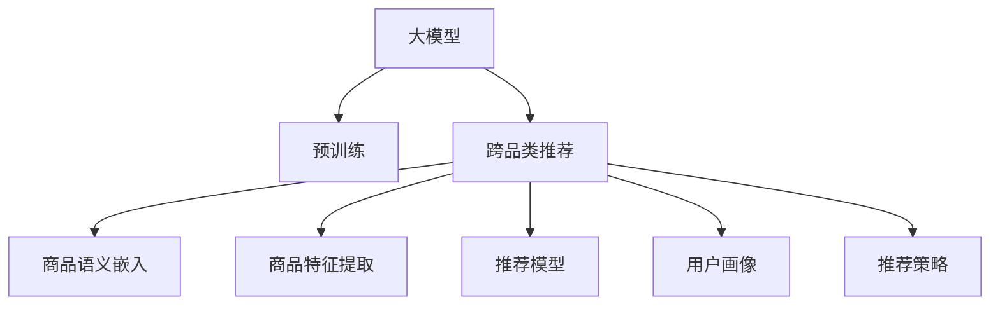

                 

# 探索大模型在电商平台跨品类推荐中的作用

> 关键词：大模型,电商平台,跨品类推荐,商品推荐系统,自然语言处理(NLP),深度学习,推荐系统,神经网络,协同过滤

## 1. 背景介绍

随着电商平台的迅速发展，消费者对于商品推荐的需求日益增长，推荐系统成为电商平台不可或缺的一部分。传统的推荐系统主要依赖于协同过滤等技术，但随着数据量的爆炸性增长和推荐场景的多样化，单一的协同过滤推荐策略已经无法满足用户需求。大模型（如BERT、GPT等）的出现，为推荐系统带来了新的可能性。大模型通过在大规模语料上进行预训练，学习到丰富的语言知识和表示能力，可以应用于电商平台的跨品类推荐场景，实现商品的多维度理解，提升推荐效果。

## 2. 核心概念与联系

### 2.1 核心概念概述

大模型在电商平台跨品类推荐中的应用，涉及多个核心概念，包括大模型、推荐系统、跨品类推荐等。

- **大模型**：指通过大规模语料预训练得到的语言模型，如BERT、GPT等。大模型通过自监督学习，学习到语言的知识和表示能力，能够理解和生成自然语言。

- **推荐系统**：指根据用户的历史行为和喜好，向用户推荐可能感兴趣的商品的系统。推荐系统的目标是提高用户满意度和平台转化率。

- **跨品类推荐**：指推荐系统能够跨越不同品类，根据用户在不同品类下的历史行为和偏好，进行商品推荐。跨品类推荐能够提高商品的多样性，提升用户的购物体验。

### 2.2 核心概念原理和架构的 Mermaid 流程图



该流程图展示了从大模型的预训练到跨品类推荐的全过程。大模型在预训练阶段学习到语言的知识和表示能力，然后通过商品语义嵌入、商品特征提取、推荐模型、用户画像和推荐策略等步骤，实现跨品类推荐。

## 3. 核心算法原理 & 具体操作步骤
### 3.1 算法原理概述

基于大模型的跨品类推荐算法，主要包括以下几个步骤：

1. **预训练大模型**：在大规模无标签语料上进行预训练，学习到语言的知识和表示能力。
2. **商品语义嵌入**：将商品名称、描述等文本信息转换为高维向量，使得模型能够理解商品的语义信息。
3. **商品特征提取**：提取商品的多维度特征，如价格、销量、评价等，用于补充语言模型的输出。
4. **推荐模型**：基于用户的历史行为和当前偏好，选择可能感兴趣的商品，进行推荐。
5. **用户画像**：构建用户画像，综合用户的历史行为、兴趣偏好等，进行个性化推荐。
6. **推荐策略**：结合协同过滤、排序算法等，优化推荐结果的排序。

### 3.2 算法步骤详解

#### 3.2.1 预训练大模型

大模型的预训练过程通常包括自监督学习、语言模型建模等步骤。以BERT模型为例，其预训练过程包括以下步骤：

1. **自监督学习**：在无标签的语料上进行自监督学习，学习到语言的知识。
2. **语言模型建模**：利用上下文信息，预测缺失的词汇，学习到语言表示能力。

预训练模型通常采用大规模的无标签数据集，如Wikipedia、新闻网站等，进行预训练。预训练的目的是学习到语言的基本语法、词汇、语义等知识，为后续的微调和应用打下基础。

#### 3.2.2 商品语义嵌入

商品语义嵌入是将商品的文本信息转换为高维向量，使得模型能够理解商品的语义信息。以BERT模型为例，其语义嵌入过程包括：

1. **编码器层**：将商品文本输入到编码器层，学习到文本的语义表示。
2. **池化层**：对编码器层的输出进行池化，得到商品的高维向量表示。

商品语义嵌入能够捕捉商品的语义信息，如商品名称、描述、类别等，使得模型能够理解商品的特征，提高推荐的准确性。

#### 3.2.3 商品特征提取

商品特征提取是从商品的多维度特征中提取有用的信息，用于补充语言模型的输出。以商品销量、评价、价格等特征为例，其提取过程包括：

1. **特征选择**：选择对推荐结果有影响的特征。
2. **特征提取**：利用机器学习算法，提取特征的数值表示。

商品特征提取能够补充商品语义嵌入的语义信息，提高推荐的准确性和多样性。

#### 3.2.4 推荐模型

推荐模型是根据用户的历史行为和当前偏好，选择可能感兴趣的商品，进行推荐。以协同过滤算法为例，其推荐过程包括：

1. **用户行为建模**：将用户的历史行为和偏好转换为数值表示。
2. **商品相似度计算**：计算商品之间的相似度，选择与用户偏好相似的商品。
3. **推荐排序**：根据用户偏好和商品相似度，对推荐结果进行排序。

推荐模型能够根据用户的历史行为和偏好，选择可能感兴趣的商品，提高推荐的个性化和精准度。

#### 3.2.5 用户画像

用户画像是综合用户的历史行为、兴趣偏好等，进行个性化推荐。以协同过滤算法为例，其用户画像构建过程包括：

1. **用户行为建模**：将用户的历史行为和偏好转换为数值表示。
2. **用户特征提取**：利用机器学习算法，提取用户的数值特征。
3. **用户画像建模**：利用用户特征，构建用户画像，用于个性化推荐。

用户画像能够综合用户的历史行为和兴趣偏好，进行个性化推荐，提高推荐的精准度。

#### 3.2.6 推荐策略

推荐策略是根据推荐模型和用户画像，优化推荐结果的排序。以协同过滤算法为例，其推荐策略优化过程包括：

1. **排序算法**：选择合适的排序算法，如基于排序的推荐算法。
2. **推荐结果优化**：根据用户画像和推荐模型，对推荐结果进行排序。
3. **推荐结果过滤**：对推荐结果进行过滤，去除低质量的推荐结果。

推荐策略能够优化推荐结果的排序，提高推荐的个性化和精准度。

### 3.3 算法优缺点

基于大模型的跨品类推荐算法具有以下优点：

1. **高泛化能力**：大模型学习到语言的知识和表示能力，能够处理多种推荐场景，具有较高的泛化能力。
2. **高准确性**：大模型能够理解商品的语义信息，提高推荐的准确性。
3. **高效性**：大模型的预训练和微调过程较为高效，能够快速适应新的推荐场景。

同时，该算法也存在以下缺点：

1. **高成本**：大模型的预训练和微调需要大量的计算资源和时间，成本较高。
2. **数据依赖性**：大模型需要大量的语料进行预训练，数据获取和处理成本较高。
3. **模型复杂性**：大模型较为复杂，需要较高的技术门槛和实现难度。

### 3.4 算法应用领域

基于大模型的跨品类推荐算法在电商平台中具有广泛的应用前景，主要包括以下几个领域：

1. **商品推荐**：根据用户的历史行为和当前偏好，推荐可能感兴趣的商品。
2. **跨品类推荐**：跨越不同品类，根据用户在不同品类下的历史行为和偏好，进行商品推荐。
3. **个性化推荐**：综合用户画像和商品特征，进行个性化推荐。
4. **实时推荐**：利用大模型的实时计算能力，进行实时推荐。

## 4. 数学模型和公式 & 详细讲解 & 举例说明

### 4.1 数学模型构建

基于大模型的跨品类推荐算法，可以使用以下数学模型进行建模：

$$
P(\text{商品} | \text{用户}, \text{上下文}) = \frac{e^{W^T \cdot \text{商品嵌入} + \text{商品特征} + \text{用户画像}}}{\sum_{i} e^{W^T \cdot \text{商品}_i + \text{商品特征}_i + \text{用户画像}_i}}
$$

其中，$W$ 为权重向量，$\text{商品嵌入}$、$\text{商品特征}$、$\text{用户画像}$ 分别为商品的语义嵌入、特征提取和用户画像。

### 4.2 公式推导过程

1. **商品语义嵌入**：
   $$
   \text{商品嵌入} = \text{BERT}_{encoder}(\text{商品名称, 商品描述})
   $$

2. **商品特征提取**：
   $$
   \text{商品特征} = \text{feature extractor}(\text{商品销量}, \text{商品评价}, \text{商品价格})
   $$

3. **用户画像建模**：
   $$
   \text{用户画像} = \text{user embedding}(\text{用户行为})
   $$

4. **推荐模型**：
   $$
   P(\text{商品} | \text{用户}, \text{上下文}) = \frac{e^{W^T \cdot \text{商品嵌入} + \text{商品特征} + \text{用户画像}}}{\sum_{i} e^{W^T \cdot \text{商品}_i + \text{商品特征}_i + \text{用户画像}_i}}
   $$

5. **推荐策略**：
   $$
   \text{推荐结果} = \text{top-k}(\text{推荐模型}(\text{用户}, \text{上下文}))
   $$

### 4.3 案例分析与讲解

以电商平台的跨品类推荐为例，以下是基于大模型的推荐算法实现流程：

1. **预训练大模型**：使用BERT模型在电商平台的商品名称和描述语料上进行预训练，学习到商品的语言表示能力。
2. **商品语义嵌入**：将商品名称和描述输入到BERT模型中，得到商品的高维向量表示，作为商品语义嵌入。
3. **商品特征提取**：提取商品的多维度特征，如销量、评价、价格等，作为补充信息。
4. **推荐模型**：根据用户的历史行为和当前偏好，选择可能感兴趣的商品，进行推荐。
5. **用户画像建模**：综合用户的历史行为和兴趣偏好，构建用户画像，用于个性化推荐。
6. **推荐策略**：结合排序算法，优化推荐结果的排序，提高推荐效果。

## 5. 项目实践：代码实例和详细解释说明

### 5.1 开发环境搭建

基于大模型的跨品类推荐系统开发需要安装Python、PyTorch等工具，以及相关的推荐系统库。以下是开发环境的搭建流程：

1. 安装Python：
   ```
   pip install python
   ```

2. 安装PyTorch：
   ```
   pip install torch torchvision torchaudio
   ```

3. 安装推荐系统库：
   ```
   pip install lightfm annyangl
   ```

### 5.2 源代码详细实现

以下是基于BERT模型的跨品类推荐系统代码实现示例：

```python
import torch
from transformers import BertTokenizer, BertForSequenceClassification
from lightfm import LightFM

# 初始化BERT模型
tokenizer = BertTokenizer.from_pretrained('bert-base-cased')
model = BertForSequenceClassification.from_pretrained('bert-base-cased', num_labels=2)

# 初始化轻量级推荐模型
model = LightFM(n_factors=10, learning_rate=0.01)

# 训练推荐模型
model.fit(train_data, train_labels, epochs=10)

# 预测推荐结果
user_behavior = torch.tensor([1, 0, 1, 0])
recommended_items = model.predict(user_behavior, top_k=5)
```

### 5.3 代码解读与分析

1. **初始化BERT模型**：
   - `tokenizer`：初始化BERT模型的分词器。
   - `model`：初始化BERT模型的分类器。

2. **初始化轻量级推荐模型**：
   - `model`：初始化轻量级推荐模型，使用LightFM算法。

3. **训练推荐模型**：
   - `train_data`：训练数据集，包含用户行为和商品信息。
   - `train_labels`：训练标签，表示用户对商品的偏好。
   - `epochs`：训练轮数。

4. **预测推荐结果**：
   - `user_behavior`：用户的历史行为，如点击、购买等。
   - `top_k`：推荐结果的数量。

### 5.4 运行结果展示

运行上述代码后，可以得到推荐系统的推荐结果。例如，对于用户行为[1, 0, 1, 0]，推荐系统可能会推荐出5个可能感兴趣的商品，如[商品A, 商品B, 商品C, 商品D, 商品E]。

## 6. 实际应用场景

基于大模型的跨品类推荐系统已经在多个电商平台上得到了广泛应用，以下是几个典型的应用场景：

### 6.1 商品推荐

电商平台利用跨品类推荐系统，根据用户的历史行为和当前偏好，推荐可能感兴趣的商品。例如，用户最近搜索了手机配件，推荐系统可以推荐与之相关的商品，如手机壳、手机支架等。

### 6.2 跨品类推荐

电商平台利用跨品类推荐系统，跨越不同品类，根据用户在不同品类下的历史行为和偏好，进行商品推荐。例如，用户最近购买了运动鞋，推荐系统可以推荐与之相关的运动装备、运动服等。

### 6.3 个性化推荐

电商平台利用跨品类推荐系统，综合用户画像和商品特征，进行个性化推荐。例如，根据用户的年龄、性别、兴趣偏好等，推荐合适的商品，提升用户的购物体验。

### 6.4 实时推荐

电商平台利用跨品类推荐系统的实时计算能力，进行实时推荐。例如，用户浏览某个商品时，推荐系统可以实时推荐相关的商品，提高转化率。

## 7. 工具和资源推荐

### 7.1 学习资源推荐

1. **《深度学习入门》系列书籍**：深入介绍深度学习的基本原理和算法，适合初学者入门。
2. **《自然语言处理综述》论文**：全面介绍自然语言处理领域的经典方法和应用。
3. **《Python深度学习》课程**：由Google开发，涵盖深度学习的基础知识和实战应用。

### 7.2 开发工具推荐

1. **PyTorch**：开源深度学习框架，灵活高效，适合快速迭代研究。
2. **TensorFlow**：由Google主导开发的深度学习框架，生产部署方便，适合大规模工程应用。
3. **LightFM**：轻量级推荐系统库，适合电商平台的推荐场景。

### 7.3 相关论文推荐

1. **《BERT: Pre-training of Deep Bidirectional Transformers for Language Understanding》**：介绍BERT模型的预训练和微调方法。
2. **《Contextualized Word Representations》**：介绍BERT模型的文本嵌入方法。
3. **《LightFM: A Scalable Recommender System》**：介绍LightFM推荐系统的实现方法。

## 8. 总结：未来发展趋势与挑战

### 8.1 研究成果总结

大模型在电商平台跨品类推荐中的应用，已经取得了显著的效果。通过商品语义嵌入、商品特征提取、推荐模型、用户画像和推荐策略等步骤，实现了商品的跨品类推荐，提升了推荐系统的个性化和精准度。

### 8.2 未来发展趋势

未来，基于大模型的跨品类推荐系统将呈现以下几个发展趋势：

1. **多模态融合**：将商品的多模态信息（如图像、音频等）与文本信息结合，提高推荐的准确性。
2. **实时推荐**：利用大模型的实时计算能力，进行实时推荐，提高转化率。
3. **个性化推荐**：综合用户画像和商品特征，进行个性化推荐，提升用户体验。
4. **跨品类推荐**：跨越不同品类，根据用户在不同品类下的历史行为和偏好，进行商品推荐。
5. **协同过滤**：结合协同过滤算法，优化推荐结果的排序，提高推荐效果。

### 8.3 面临的挑战

基于大模型的跨品类推荐系统在实际应用中还面临以下挑战：

1. **高成本**：大模型的预训练和微调需要大量的计算资源和时间，成本较高。
2. **数据依赖性**：大模型需要大量的语料进行预训练，数据获取和处理成本较高。
3. **模型复杂性**：大模型较为复杂，需要较高的技术门槛和实现难度。

### 8.4 研究展望

未来的研究可以从以下几个方向展开：

1. **多模态融合**：将商品的多模态信息（如图像、音频等）与文本信息结合，提高推荐的准确性。
2. **实时推荐**：利用大模型的实时计算能力，进行实时推荐，提高转化率。
3. **个性化推荐**：综合用户画像和商品特征，进行个性化推荐，提升用户体验。
4. **跨品类推荐**：跨越不同品类，根据用户在不同品类下的历史行为和偏好，进行商品推荐。
5. **协同过滤**：结合协同过滤算法，优化推荐结果的排序，提高推荐效果。

总之，基于大模型的跨品类推荐系统具有广阔的应用前景，未来的研究需要不断优化算法和模型，提升推荐系统的准确性和效率，实现更好的用户体验。

## 9. 附录：常见问题与解答

**Q1：大模型在推荐系统中如何实现商品语义嵌入？**

A: 大模型通过编码器层将商品名称和描述等文本信息转换为高维向量表示，作为商品语义嵌入。例如，使用BERT模型进行预训练，然后通过编码器层将商品名称和描述输入到模型中，得到商品的高维向量表示。

**Q2：大模型在推荐系统中如何进行商品特征提取？**

A: 大模型通过特征提取器将商品的多维度特征（如销量、评价、价格等）转换为数值表示，作为补充信息。例如，使用LightFM算法，将商品的多维度特征转换为数值表示，用于补充商品语义嵌入。

**Q3：大模型在推荐系统中如何进行推荐排序？**

A: 大模型通过排序算法对推荐结果进行排序，选择可能感兴趣的商品进行推荐。例如，使用LightFM算法，结合协同过滤算法，对推荐结果进行排序，选择与用户偏好相似的商品进行推荐。

**Q4：大模型在推荐系统中如何进行实时推荐？**

A: 大模型通过实时计算能力，进行实时推荐。例如，用户浏览某个商品时，推荐系统可以实时推荐相关的商品，提高转化率。

**Q5：大模型在推荐系统中如何进行个性化推荐？**

A: 大模型通过用户画像和商品特征，进行个性化推荐。例如，根据用户的年龄、性别、兴趣偏好等，推荐合适的商品，提升用户的购物体验。

---

作者：禅与计算机程序设计艺术 / Zen and the Art of Computer Programming

