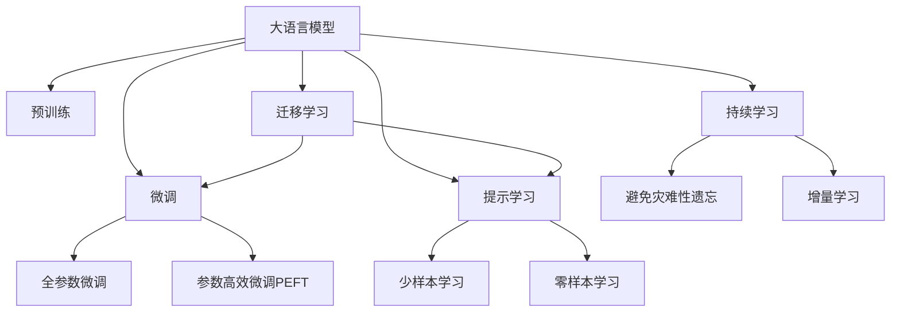

                 

## 1. 背景介绍

### 1.1 问题由来
随着电子商务的兴起，平台商品种类日益繁多，如何有效管理商品属性，提升用户搜索体验和购物转化率，成为电商平台亟待解决的问题。传统的标签分类方法难以捕捉属性之间的复杂关联，而基于深度学习的模型能够挖掘更全面的属性信息，对提升搜索推荐效果具有重要意义。近年来，基于大规模预训练语言模型的商品属性排序方法（Attribute Sorting）逐渐受到关注，成为电商领域重要的研究方向。

### 1.2 问题核心关键点
商品属性排序（Attribute Sorting）旨在根据用户搜索意图，对商品属性进行重要度排序，并用于商品展示、搜索结果排序等。传统方法多依赖特征工程和手工规则，而大模型能够自动学习属性之间的语义关系和用户偏好，具有显著优势。但目前这一领域的研究尚处于初级阶段，算法效果和应用效果有待提升。

### 1.3 问题研究意义
通过大模型进行商品属性排序，不仅能够提升搜索推荐的效果，还能大幅降低数据标注成本，降低算法复杂度，为电商平台的运营提供更智能化的解决方案。同时，这一技术的广泛应用，也将在智能客服、市场营销、个性化推荐等多个电商场景中发挥重要作用。

## 2. 核心概念与联系

### 2.1 核心概念概述

为更好地理解基于大模型的商品属性排序方法，本节将介绍几个关键概念：

- 大语言模型(Large Language Model, LLM)：以自回归(如GPT)或自编码(如BERT)模型为代表的大规模预训练语言模型。通过在大规模无标签文本语料上进行预训练，学习通用的语言表示，具备强大的语言理解和生成能力。

- 预训练(Pre-training)：指在大规模无标签文本语料上，通过自监督学习任务训练通用语言模型的过程。常见的预训练任务包括言语建模、遮挡语言模型等。

- 微调(Fine-tuning)：指在预训练模型的基础上，使用下游任务的少量标注数据，通过有监督学习优化模型在特定任务上的性能。通常只需要调整顶层分类器或解码器，并以较小的学习率更新全部或部分的模型参数。

- 迁移学习(Transfer Learning)：指将一个领域学习到的知识，迁移应用到另一个不同但相关的领域的学习范式。大模型的预训练-微调过程即是一种典型的迁移学习方式。

- 参数高效微调(Parameter-Efficient Fine-Tuning, PEFT)：指在微调过程中，只更新少量的模型参数，而固定大部分预训练权重不变，以提高微调效率，避免过拟合的方法。

- 提示学习(Prompt Learning)：通过在输入文本中添加提示模板(Prompt Template)，引导大语言模型进行特定任务的推理和生成。可以在不更新模型参数的情况下，实现零样本或少样本学习。

- 少样本学习(Few-shot Learning)：指在只有少量标注样本的情况下，模型能够快速适应新任务的学习方法。在大语言模型中，通常通过在输入中提供少量示例来实现，无需更新模型参数。

- 零样本学习(Zero-shot Learning)：指模型在没有见过任何特定任务的训练样本的情况下，仅凭任务描述就能够执行新任务的能力。大语言模型通过预训练获得的广泛知识，使其能够理解任务指令并生成相应输出。

- 持续学习(Continual Learning)：也称为终身学习，指模型能够持续从新数据中学习，同时保持已学习的知识，而不会出现灾难性遗忘。这对于保持大语言模型的时效性和适应性至关重要。

这些核心概念之间的逻辑关系可以通过以下Mermaid流程图来展示：



这个流程图展示了大语言模型的核心概念及其之间的关系：

1. 大语言模型通过预训练获得基础能力。
2. 微调是对预训练模型进行任务特定的优化，可以分为全参数微调和参数高效微调（PEFT）。
3. 提示学习是一种不更新模型参数的方法，可以实现少样本学习和零样本学习。
4. 迁移学习是连接预训练模型与下游任务的桥梁，可以通过微调或提示学习来实现。
5. 持续学习旨在使模型能够不断学习新知识，同时避免遗忘旧知识。

这些概念共同构成了大语言模型的学习和应用框架，使其能够在各种场景下发挥强大的语言理解和生成能力。通过理解这些核心概念，我们可以更好地把握大语言模型的工作原理和优化方向。

## 3. 核心算法原理 & 具体操作步骤
### 3.1 算法原理概述

基于大模型的商品属性排序，本质上是一个有监督的特征重要性排序过程。其核心思想是：将商品属性看作文本中的词汇，利用大模型学习属性之间的语义关系，通过有监督地训练来优化模型对属性重要性的排序。

形式化地，假设商品属性集合为 $A=\{a_1,a_2,\dots,a_n\}$，预训练模型为 $M_{\theta}$，其中 $\theta$ 为预训练得到的模型参数。商品属性之间的关系可以用上下文向量 $\vec{v}_i$ 表示，其中 $i$ 表示属性在文本中的位置。假设商品属性排序任务为给定上下文 $\mathcal{C}_i$，预测属性 $a_i$ 的重要性排序 $r_i$，则任务可以表示为：

$$
r_i = \arg\max_{r} M_{\theta}(\mathcal{C}_i, a_i, r)
$$

其中 $M_{\theta}(\mathcal{C}_i, a_i, r)$ 表示在上下文 $\mathcal{C}_i$ 和属性 $a_i$ 的基础上，预测属性 $r$ 的重要性的概率。

通过梯度下降等优化算法，微调过程不断更新模型参数 $\theta$，最小化预测结果与实际标签之间的差异，使得模型输出逼近真实标签，从而实现属性排序的优化。

### 3.2 算法步骤详解

基于大模型的商品属性排序一般包括以下几个关键步骤：

**Step 1: 准备预训练模型和数据集**
- 选择合适的预训练语言模型 $M_{\theta}$ 作为初始化参数，如 BERT、GPT 等。
- 准备商品属性排序任务的数据集 $D$，包括商品属性、上下文信息等，并划分为训练集、验证集和测试集。一般要求数据集与预训练数据的分布不要差异过大。

**Step 2: 设计任务适配层**
- 根据任务类型，在预训练模型顶层设计合适的输出层和损失函数。
- 对于分类任务，通常在顶层添加线性分类器和交叉熵损失函数。
- 对于生成任务，通常使用语言模型的解码器输出概率分布，并以负对数似然为损失函数。

**Step 3: 设置微调超参数**
- 选择合适的优化算法及其参数，如 AdamW、SGD 等，设置学习率、批大小、迭代轮数等。
- 设置正则化技术及强度，包括权重衰减、Dropout、Early Stopping等。
- 确定冻结预训练参数的策略，如仅微调顶层，或全部参数都参与微调。

**Step 4: 执行梯度训练**
- 将训练集数据分批次输入模型，前向传播计算损失函数。
- 反向传播计算参数梯度，根据设定的优化算法和学习率更新模型参数。
- 周期性在验证集上评估模型性能，根据性能指标决定是否触发 Early Stopping。
- 重复上述步骤直到满足预设的迭代轮数或 Early Stopping 条件。

**Step 5: 测试和部署**
- 在测试集上评估微调后模型 $M_{\hat{\theta}}$ 的性能，对比微调前后的精度提升。
- 使用微调后的模型对新样本进行推理预测，集成到实际的商品展示、搜索结果排序等应用系统中。
- 持续收集新的数据，定期重新微调模型，以适应数据分布的变化。

以上是基于大模型进行商品属性排序的一般流程。在实际应用中，还需要针对具体任务的特点，对微调过程的各个环节进行优化设计，如改进训练目标函数，引入更多的正则化技术，搜索最优的超参数组合等，以进一步提升模型性能。

### 3.3 算法优缺点

基于大模型的商品属性排序方法具有以下优点：
1. 高效灵活。利用大模型学习属性之间的语义关系，无需手工设计特征，能够灵活处理各种属性类型。
2. 效果显著。通过有监督学习，能够显著提升属性排序的准确性和召回率，适用于复杂场景下的推荐。
3. 数据依赖小。相比于传统方法，基于大模型的排序方法对标注数据的依赖小，适应性强。

同时，该方法也存在一定的局限性：
1. 模型复杂度高。预训练大模型参数量巨大，计算和存储成本高。
2. 泛化能力有待提升。大模型可能受到预训练数据的影响，对特定领域或小样本数据泛化能力有限。
3. 隐私和安全问题。商品属性数据涉及用户隐私，如何在微调过程中保护数据安全，仍需进一步探索。

尽管存在这些局限性，但就目前而言，基于大模型的排序方法在电商领域已展现出强大的潜力，是商品推荐、搜索结果排序等应用的重要手段。

## 4. 数学模型和公式 & 详细讲解 & 举例说明
### 4.1 数学模型构建

本节将使用数学语言对基于大模型的商品属性排序过程进行更加严格的刻画。

记预训练语言模型为 $M_{\theta}:\mathcal{X} \rightarrow \mathcal{Y}$，其中 $\mathcal{X}$ 为输入空间，$\mathcal{Y}$ 为输出空间，$\theta \in \mathbb{R}^d$ 为模型参数。假设商品属性排序任务的数据集为 $D=\{(\mathcal{C}_i, a_i, r_i)\}_{i=1}^N$，其中 $\mathcal{C}_i$ 为上下文，$a_i$ 为属性，$r_i$ 为属性重要性排序。

定义模型 $M_{\theta}$ 在输入 $(\mathcal{C}_i, a_i)$ 上的输出为 $r_i$，则在数据集 $D$ 上的经验风险为：

$$
\mathcal{L}(\theta) = \frac{1}{N} \sum_{i=1}^N \ell(M_{\theta}(\mathcal{C}_i, a_i), r_i)
$$

其中 $\ell$ 为损失函数，用于衡量模型预测结果与实际标签之间的差异。常见的损失函数包括交叉熵损失、均方误差损失等。

微调的优化目标是最小化经验风险，即找到最优参数：

$$
\theta^* = \mathop{\arg\min}_{\theta} \mathcal{L}(\theta)
$$

在实践中，我们通常使用基于梯度的优化算法（如SGD、Adam等）来近似求解上述最优化问题。设 $\eta$ 为学习率，$\lambda$ 为正则化系数，则参数的更新公式为：

$$
\theta \leftarrow \theta - \eta \nabla_{\theta}\mathcal{L}(\theta) - \eta\lambda\theta
$$

其中 $\nabla_{\theta}\mathcal{L}(\theta)$ 为损失函数对参数 $\theta$ 的梯度，可通过反向传播算法高效计算。

### 4.2 公式推导过程

以下我们以二分类任务为例，推导交叉熵损失函数及其梯度的计算公式。

假设模型 $M_{\theta}$ 在输入 $(\mathcal{C}_i, a_i)$ 上的输出为 $r_i$，表示属性 $a_i$ 的重要性排序，真实标签 $r_i \in \{1,2\}$。则二分类交叉熵损失函数定义为：

$$
\ell(M_{\theta}(\mathcal{C}_i, a_i),r_i) = -[r_i\log M_{\theta}(\mathcal{C}_i, a_i)+(1-r_i)\log (1-M_{\theta}(\mathcal{C}_i, a_i))]
$$

将其代入经验风险公式，得：

$$
\mathcal{L}(\theta) = -\frac{1}{N}\sum_{i=1}^N [r_i\log M_{\theta}(\mathcal{C}_i, a_i)+(1-r_i)\log(1-M_{\theta}(\mathcal{C}_i, a_i))]
$$

根据链式法则，损失函数对参数 $\theta_k$ 的梯度为：

$$
\frac{\partial \mathcal{L}(\theta)}{\partial \theta_k} = -\frac{1}{N}\sum_{i=1}^N (\frac{r_i}{M_{\theta}(\mathcal{C}_i, a_i)}-\frac{1-r_i}{1-M_{\theta}(\mathcal{C}_i, a_i)}) \frac{\partial M_{\theta}(\mathcal{C}_i, a_i)}{\partial \theta_k}
$$

其中 $\frac{\partial M_{\theta}(\mathcal{C}_i, a_i)}{\partial \theta_k}$ 可进一步递归展开，利用自动微分技术完成计算。

在得到损失函数的梯度后，即可带入参数更新公式，完成模型的迭代优化。重复上述过程直至收敛，最终得到适应商品属性排序任务的最优模型参数 $\theta^*$。

### 4.3 案例分析与讲解

假设我们有一个简单的电商商品属性排序任务，包含三个属性 $a_1$、$a_2$ 和 $a_3$，用户上下文 $\mathcal{C}_i$ 包含属性 $a_1$ 和 $a_2$ 的描述。假设属性 $a_1$ 对用户的重要性排序为 $r_1=2$，属性 $a_2$ 对用户的重要性排序为 $r_2=1$，属性 $a_3$ 对用户的重要性排序为 $r_3=1$。

在商品属性排序任务中，我们使用BERT作为预训练模型，选择线性分类器作为任务适配层，设置交叉熵损失函数。训练过程中，首先对上下文 $\mathcal{C}_i$ 和属性 $a_1$ 进行编码，得到上下文表示 $\vec{v}_i^{a_1}$ 和属性表示 $\vec{v}_{a_1}$。然后，将 $\vec{v}_i^{a_1}$ 和 $\vec{v}_{a_1}$ 拼接，输入到线性分类器中，得到属性重要性排序 $r_i$ 的预测值 $r_i'$。通过交叉熵损失函数计算预测值与真实标签之间的差异，得到损失 $\ell(r_i', r_i)$。

训练过程不断迭代更新模型参数，使得预测值 $r_i'$ 逼近真实标签 $r_i$，从而实现属性排序的优化。最终，训练好的模型可以在新的上下文和属性对上，预测出属性的重要性排序，用于商品展示、搜索结果排序等应用。

## 5. 项目实践：代码实例和详细解释说明
### 5.1 开发环境搭建

在进行商品属性排序实践前，我们需要准备好开发环境。以下是使用Python进行PyTorch开发的环境配置流程：

1. 安装Anaconda：从官网下载并安装Anaconda，用于创建独立的Python环境。

2. 创建并激活虚拟环境：
```bash
conda create -n pytorch-env python=3.8 
conda activate pytorch-env
```

3. 安装PyTorch：根据CUDA版本，从官网获取对应的安装命令。例如：
```bash
conda install pytorch torchvision torchaudio cudatoolkit=11.1 -c pytorch -c conda-forge
```

4. 安装Transformers库：
```bash
pip install transformers
```

5. 安装各类工具包：
```bash
pip install numpy pandas scikit-learn matplotlib tqdm jupyter notebook ipython
```

完成上述步骤后，即可在`pytorch-env`环境中开始商品属性排序实践。

### 5.2 源代码详细实现

下面我们以商品属性排序任务为例，给出使用Transformers库对BERT模型进行微调的PyTorch代码实现。

首先，定义商品属性排序任务的数据处理函数：

```python
from transformers import BertTokenizer
from torch.utils.data import Dataset
import torch

class AttrSortDataset(Dataset):
    def __init__(self, texts, labels, tokenizer, max_len=128):
        self.texts = texts
        self.labels = labels
        self.tokenizer = tokenizer
        self.max_len = max_len
        
    def __len__(self):
        return len(self.texts)
    
    def __getitem__(self, item):
        text = self.texts[item]
        label = self.labels[item]
        
        encoding = self.tokenizer(text, return_tensors='pt', max_length=self.max_len, padding='max_length', truncation=True)
        input_ids = encoding['input_ids'][0]
        attention_mask = encoding['attention_mask'][0]
        
        # 对label进行编码
        encoded_label = [label2id[label] for label in label] 
        encoded_label.extend([label2id['O']] * (self.max_len - len(encoded_label)))
        labels = torch.tensor(encoded_label, dtype=torch.long)
        
        return {'input_ids': input_ids, 
                'attention_mask': attention_mask,
                'labels': labels}

# 标签与id的映射
label2id = {'O': 0, 'A1': 1, 'A2': 2, 'A3': 3}
id2label = {v: k for k, v in label2id.items()}

# 创建dataset
tokenizer = BertTokenizer.from_pretrained('bert-base-cased')

train_dataset = AttrSortDataset(train_texts, train_labels, tokenizer)
dev_dataset = AttrSortDataset(dev_texts, dev_labels, tokenizer)
test_dataset = AttrSortDataset(test_texts, test_labels, tokenizer)
```

然后，定义模型和优化器：

```python
from transformers import BertForTokenClassification, AdamW

model = BertForTokenClassification.from_pretrained('bert-base-cased', num_labels=len(label2id))

optimizer = AdamW(model.parameters(), lr=2e-5)
```

接着，定义训练和评估函数：

```python
from torch.utils.data import DataLoader
from tqdm import tqdm
from sklearn.metrics import classification_report

device = torch.device('cuda') if torch.cuda.is_available() else torch.device('cpu')
model.to(device)

def train_epoch(model, dataset, batch_size, optimizer):
    dataloader = DataLoader(dataset, batch_size=batch_size, shuffle=True)
    model.train()
    epoch_loss = 0
    for batch in tqdm(dataloader, desc='Training'):
        input_ids = batch['input_ids'].to(device)
        attention_mask = batch['attention_mask'].to(device)
        labels = batch['labels'].to(device)
        model.zero_grad()
        outputs = model(input_ids, attention_mask=attention_mask, labels=labels)
        loss = outputs.loss
        epoch_loss += loss.item()
        loss.backward()
        optimizer.step()
    return epoch_loss / len(dataloader)

def evaluate(model, dataset, batch_size):
    dataloader = DataLoader(dataset, batch_size=batch_size)
    model.eval()
    preds, labels = [], []
    with torch.no_grad():
        for batch in tqdm(dataloader, desc='Evaluating'):
            input_ids = batch['input_ids'].to(device)
            attention_mask = batch['attention_mask'].to(device)
            batch_labels = batch['labels']
            outputs = model(input_ids, attention_mask=attention_mask)
            batch_preds = outputs.logits.argmax(dim=2).to('cpu').tolist()
            batch_labels = batch_labels.to('cpu').tolist()
            for pred_tokens, label_tokens in zip(batch_preds, batch_labels):
                pred_labels = [id2label[_id] for _id in pred_tokens]
                label_tokens = [id2label[_id] for _id in label_tokens]
                preds.append(pred_labels[:len(label_tokens)])
                labels.append(label_tokens)
                
    print(classification_report(labels, preds))
```

最后，启动训练流程并在测试集上评估：

```python
epochs = 5
batch_size = 16

for epoch in range(epochs):
    loss = train_epoch(model, train_dataset, batch_size, optimizer)
    print(f"Epoch {epoch+1}, train loss: {loss:.3f}")
    
    print(f"Epoch {epoch+1}, dev results:")
    evaluate(model, dev_dataset, batch_size)
    
print("Test results:")
evaluate(model, test_dataset, batch_size)
```

以上就是使用PyTorch对BERT进行商品属性排序任务微调的完整代码实现。可以看到，得益于Transformers库的强大封装，我们可以用相对简洁的代码完成BERT模型的加载和微调。

### 5.3 代码解读与分析

让我们再详细解读一下关键代码的实现细节：

**AttrSortDataset类**：
- `__init__`方法：初始化文本、标签、分词器等关键组件。
- `__len__`方法：返回数据集的样本数量。
- `__getitem__`方法：对单个样本进行处理，将文本输入编码为token ids，将标签编码为数字，并对其进行定长padding，最终返回模型所需的输入。

**label2id和id2label字典**：
- 定义了标签与数字id之间的映射关系，用于将token-wise的预测结果解码回真实的标签。

**训练和评估函数**：
- 使用PyTorch的DataLoader对数据集进行批次化加载，供模型训练和推理使用。
- 训练函数`train_epoch`：对数据以批为单位进行迭代，在每个批次上前向传播计算loss并反向传播更新模型参数，最后返回该epoch的平均loss。
- 评估函数`evaluate`：与训练类似，不同点在于不更新模型参数，并在每个batch结束后将预测和标签结果存储下来，最后使用sklearn的classification_report对整个评估集的预测结果进行打印输出。

**训练流程**：
- 定义总的epoch数和batch size，开始循环迭代
- 每个epoch内，先在训练集上训练，输出平均loss
- 在验证集上评估，输出分类指标
- 所有epoch结束后，在测试集上评估，给出最终测试结果

可以看到，PyTorch配合Transformers库使得BERT微调的代码实现变得简洁高效。开发者可以将更多精力放在数据处理、模型改进等高层逻辑上，而不必过多关注底层的实现细节。

当然，工业级的系统实现还需考虑更多因素，如模型的保存和部署、超参数的自动搜索、更灵活的任务适配层等。但核心的微调范式基本与此类似。

## 6. 实际应用场景
### 6.1 电商平台商品排序

基于大模型进行商品属性排序，可以在电商平台中广泛应用。例如，当用户输入搜索查询词时，系统可以根据上下文信息，自动对商品属性进行排序，展示最符合用户需求的商品。

在技术实现上，可以收集电商平台的商品描述、属性等信息，构建标注数据集，并在此基础上对预训练语言模型进行微调。微调后的模型能够理解用户上下文，准确预测商品属性排序，提升商品展示效果和用户体验。

### 6.2 智能客服对话

在智能客服场景中，大模型商品属性排序同样具有重要应用。当客服系统需要推荐商品时，可以根据用户对话中的上下文信息，自动进行属性排序，快速生成推荐结果。

具体而言，可以通过分析客服对话数据，标注不同场景下的商品属性重要性排序，构建商品属性排序训练集。训练好的模型能够根据用户对话内容，预测出商品属性排序，为智能客服系统提供更精准的推荐支持。

### 6.3 个性化推荐系统

商品属性排序技术在大规模个性化推荐系统中也有广泛应用。通过分析用户历史行为数据，标注商品属性的重要性排序，训练大模型进行属性排序。

推荐系统可以将用户历史行为数据和属性排序模型结合起来，动态调整商品推荐列表，提高推荐效果。用户侧推模型可以根据用户上下文信息，预测商品属性排序，生成个性化推荐结果，提升用户体验。

### 6.4 未来应用展望

随着大模型和微调技术的不断发展，基于大模型的商品属性排序方法将在更多领域得到应用，为电商平台的运营提供更智能化的解决方案。

在智能客服、市场营销、个性化推荐等多个电商场景中，商品属性排序技术将发挥重要作用。未来的研究将围绕提升排序精度、降低计算成本、提高模型鲁棒性等方面展开，推动大模型微调技术向更深层次发展。

## 7. 工具和资源推荐
### 7.1 学习资源推荐

为了帮助开发者系统掌握商品属性排序的理论基础和实践技巧，这里推荐一些优质的学习资源：

1. 《Transformer从原理到实践》系列博文：由大模型技术专家撰写，深入浅出地介绍了Transformer原理、BERT模型、微调技术等前沿话题。

2. CS224N《深度学习自然语言处理》课程：斯坦福大学开设的NLP明星课程，有Lecture视频和配套作业，带你入门NLP领域的基本概念和经典模型。

3. 《Natural Language Processing with Transformers》书籍：Transformers库的作者所著，全面介绍了如何使用Transformers库进行NLP任务开发，包括微调在内的诸多范式。

4. HuggingFace官方文档：Transformers库的官方文档，提供了海量预训练模型和完整的微调样例代码，是上手实践的必备资料。

5. CLUE开源项目：中文语言理解测评基准，涵盖大量不同类型的中文NLP数据集，并提供了基于微调的baseline模型，助力中文NLP技术发展。

通过对这些资源的学习实践，相信你一定能够快速掌握大语言模型微调的精髓，并用于解决实际的NLP问题。
###  7.2 开发工具推荐

高效的开发离不开优秀的工具支持。以下是几款用于大语言模型微调开发的常用工具：

1. PyTorch：基于Python的开源深度学习框架，灵活动态的计算图，适合快速迭代研究。大部分预训练语言模型都有PyTorch版本的实现。

2. TensorFlow：由Google主导开发的开源深度学习框架，生产部署方便，适合大规模工程应用。同样有丰富的预训练语言模型资源。

3. Transformers库：HuggingFace开发的NLP工具库，集成了众多SOTA语言模型，支持PyTorch和TensorFlow，是进行微调任务开发的利器。

4. Weights & Biases：模型训练的实验跟踪工具，可以记录和可视化模型训练过程中的各项指标，方便对比和调优。与主流深度学习框架无缝集成。

5. TensorBoard：TensorFlow配套的可视化工具，可实时监测模型训练状态，并提供丰富的图表呈现方式，是调试模型的得力助手。

6. Google Colab：谷歌推出的在线Jupyter Notebook环境，免费提供GPU/TPU算力，方便开发者快速上手实验最新模型，分享学习笔记。

合理利用这些工具，可以显著提升大语言模型微调任务的开发效率，加快创新迭代的步伐。

### 7.3 相关论文推荐

大语言模型和微调技术的发展源于学界的持续研究。以下是几篇奠基性的相关论文，推荐阅读：

1. Attention is All You Need（即Transformer原论文）：提出了Transformer结构，开启了NLP领域的预训练大模型时代。

2. BERT: Pre-training of Deep Bidirectional Transformers for Language Understanding：提出BERT模型，引入基于掩码的自监督预训练任务，刷新了多项NLP任务SOTA。

3. Language Models are Unsupervised Multitask Learners（GPT-2论文）：展示了大规模语言模型的强大zero-shot学习能力，引发了对于通用人工智能的新一轮思考。

4. Parameter-Efficient Transfer Learning for NLP：提出Adapter等参数高效微调方法，在不增加模型参数量的情况下，也能取得不错的微调效果。

5. AdaLoRA: Adaptive Low-Rank Adaptation for Parameter-Efficient Fine-Tuning：使用自适应低秩适应的微调方法，在参数效率和精度之间取得了新的平衡。

这些论文代表了大语言模型微调技术的发展脉络。通过学习这些前沿成果，可以帮助研究者把握学科前进方向，激发更多的创新灵感。

## 8. 总结：未来发展趋势与挑战

### 8.1 总结

本文对基于大模型的商品属性排序方法进行了全面系统的介绍。首先阐述了商品属性排序的研究背景和意义，明确了基于大模型的排序方法在电商领域的重要价值。其次，从原理到实践，详细讲解了商品属性排序的数学原理和关键步骤，给出了商品属性排序任务的完整代码实现。同时，本文还广泛探讨了商品属性排序方法在电商、客服、推荐等众多电商场景中的应用前景，展示了其广阔的应用空间。

通过本文的系统梳理，可以看到，基于大模型的商品属性排序方法正在成为电商领域的重要技术手段，极大提升了电商平台的运营效率和用户体验。未来，伴随大模型和微调方法的不断演进，相信基于大模型的商品属性排序技术将展现出更广泛的应用场景，进一步推动电商平台的智能化转型。

### 8.2 未来发展趋势

展望未来，商品属性排序技术将呈现以下几个发展趋势：

1. 模型规模持续增大。随着算力成本的下降和数据规模的扩张，预训练语言模型的参数量还将持续增长。超大规模语言模型蕴含的丰富语言知识，有望支撑更加复杂多变的商品属性排序任务。

2. 微调方法日趋多样。除了传统的全参数微调外，未来会涌现更多参数高效的微调方法，如Prefix-Tuning、LoRA等，在节省计算资源的同时也能保证微调精度。

3. 持续学习成为常态。随着数据分布的不断变化，商品属性排序模型也需要持续学习新知识以保持性能。如何在不遗忘原有知识的同时，高效吸收新样本信息，将成为重要的研究课题。

4. 标注样本需求降低。受启发于提示学习(Prompt-based Learning)的思路，未来的排序方法将更好地利用大模型的语言理解能力，通过更加巧妙的任务描述，在更少的标注样本上也能实现理想的排序效果。

5. 模型通用性增强。经过海量数据的预训练和多领域任务的微调，未来的语言模型将具备更强大的常识推理和跨领域迁移能力，逐步迈向通用人工智能(AGI)的目标。

以上趋势凸显了大语言模型商品属性排序技术的广阔前景。这些方向的探索发展，必将进一步提升电商平台的应用效果，为电商平台的运营提供更智能化的解决方案。

### 8.3 面临的挑战

尽管大语言模型商品属性排序技术已经取得了瞩目成就，但在迈向更加智能化、普适化应用的过程中，它仍面临着诸多挑战：

1. 标注成本瓶颈。虽然微调大大降低了标注数据的需求，但对于长尾应用场景，难以获得充足的高质量标注数据，成为制约微调性能的瓶颈。如何进一步降低微调对标注样本的依赖，将是一大难题。

2. 模型鲁棒性不足。当前微调模型面对域外数据时，泛化性能往往大打折扣。对于测试样本的微小扰动，微调模型的预测也容易发生波动。如何提高微调模型的鲁棒性，避免灾难性遗忘，还需要更多理论和实践的积累。

3. 推理效率有待提高。大规模语言模型虽然精度高，但在实际部署时往往面临推理速度慢、内存占用大等效率问题。如何在保证性能的同时，简化模型结构，提升推理速度，优化资源占用，将是重要的优化方向。

4. 可解释性亟需加强。当前微调模型更像是"黑盒"系统，难以解释其内部工作机制和决策逻辑。对于医疗、金融等高风险应用，算法的可解释性和可审计性尤为重要。如何赋予微调模型更强的可解释性，将是亟待攻克的难题。

5. 安全性有待保障。商品属性数据涉及用户隐私，如何在微调过程中保护数据安全，仍需进一步探索。

6. 知识整合能力不足。现有的微调模型往往局限于任务内数据，难以灵活吸收和运用更广泛的先验知识。如何让微调过程更好地与外部知识库、规则库等专家知识结合，形成更加全面、准确的信息整合能力，还有很大的想象空间。

正视商品属性排序面临的这些挑战，积极应对并寻求突破，将是大语言模型商品属性排序走向成熟的必由之路。相信随着学界和产业界的共同努力，这些挑战终将一一被克服，大语言模型商品属性排序必将在构建人机协同的智能电商平台上发挥更加重要的作用。

### 8.4 研究展望

面对大语言模型商品属性排序所面临的种种挑战，未来的研究需要在以下几个方面寻求新的突破：

1. 探索无监督和半监督商品属性排序方法。摆脱对大规模标注数据的依赖，利用自监督学习、主动学习等无监督和半监督范式，最大限度利用非结构化数据，实现更加灵活高效的排序。

2. 研究参数高效和计算高效的微调范式。开发更加参数高效的微调方法，在固定大部分预训练参数的同时，只更新极少量的任务相关参数。同时优化微调模型的计算图，减少前向传播和反向传播的资源消耗，实现更加轻量级、实时性的部署。

3. 引入因果和对比学习范式。通过引入因果推断和对比学习思想，增强排序模型建立稳定因果关系的能力，学习更加普适、鲁棒的商品属性表示，从而提升模型泛化性和抗干扰能力。

4. 结合因果分析和博弈论工具。将因果分析方法引入排序模型，识别出模型决策的关键特征，增强输出解释的因果性和逻辑性。借助博弈论工具刻画人机交互过程，主动探索并规避模型的脆弱点，提高系统稳定性。

5. 纳入伦理道德约束。在模型训练目标中引入伦理导向的评估指标，过滤和惩罚有偏见、有害的输出倾向。同时加强人工干预和审核，建立模型行为的监管机制，确保输出符合人类价值观和伦理道德。

这些研究方向的探索，必将引领大语言模型商品属性排序技术迈向更高的台阶，为构建安全、可靠、可解释、可控的智能电商系统铺平道路。面向未来，大语言模型商品属性排序技术还需要与其他人工智能技术进行更深入的融合，如知识表示、因果推理、强化学习等，多路径协同发力，共同推动自然语言理解和智能交互系统的进步。只有勇于创新、敢于突破，才能不断拓展语言模型的边界，让智能技术更好地造福人类社会。

## 9. 附录：常见问题与解答
### Q1: 大模型商品属性排序是否适用于所有商品类别？
A: 大模型商品属性排序技术在大多数商品类别上都能取得不错的效果，特别是对于数据量较大的商品。但对于一些特定领域的商品，如医药、汽车等，由于商品属性种类繁多，属性之间的关系复杂，可能需要对模型进行进一步的微调和优化，才能获得理想的效果。

### Q2: 商品属性排序任务中，上下文信息的作用是什么？
A: 上下文信息在商品属性排序任务中起到了至关重要的作用。上下文信息包含了用户对商品属性查询的具体需求和背景信息，如搜索关键词、用户行为历史等。通过上下文信息，模型可以更好地理解用户的查询意图，从而更准确地预测商品属性排序，提高推荐效果。

### Q3: 商品属性排序任务中，如何选择合适的损失函数？
A: 在商品属性排序任务中，选择合适的损失函数至关重要。通常情况下，交叉熵损失函数是一个不错的选择，因为它能够有效地度量模型预测结果与真实标签之间的差异。但在某些任务中，使用自定义的损失函数，如Focal Loss、Gumbel Softmax等，也能取得更好的效果。具体选择哪种损失函数，需要根据任务特点和实验结果进行判断。

### Q4: 商品属性排序任务中，如何评估模型性能？
A: 商品属性排序任务中的模型性能评估通常使用精确率(Precision)、召回率(Recall)、F1分数等指标。在训练过程中，可以使用交叉验证等方法评估模型在验证集上的性能，及时调整模型参数。在测试过程中，可以使用测试集评估模型的最终表现，对比不同模型的性能差异。

### Q5: 商品属性排序任务中，如何缓解过拟合问题？
A: 过拟合是商品属性排序任务中常见的问题，尤其是在数据量较小的情况下。为缓解过拟合问题，可以采用以下策略：
1. 数据增强：通过对训练样本进行改写、回译等方式丰富训练集多样性。
2. 正则化：使用L2正则、Dropout、Early Stopping等方法，防止模型过度适应训练数据。
3. 参数高效微调：只调整极少量的模型参数，固定大部分预训练参数，减少过拟合风险。
4. 多模型集成：训练多个排序模型，取平均输出，抑制过拟合。

这些策略往往需要根据具体任务和数据特点进行灵活组合，以最大限度地提升模型性能。

### Q6: 商品属性排序任务中，如何处理长尾商品属性？
A: 长尾商品属性在电商平台上常见，但传统的排序方法往往难以有效处理。为处理长尾商品属性，可以采用以下方法：
1. 数据增强：对长尾属性的训练样本进行扩充，丰富模型对长尾属性的理解。
2. 特征选择：选择对排序任务影响较大的特征，减少对长尾属性的依赖。
3. 正则化：使用特征稀疏化等方法，降低长尾属性对排序模型的影响。
4. 模型优化：使用如Transformers等深度学习模型，通过神经网络的复杂非线性关系，更好地处理长尾属性。

通过这些方法，可以有效提升模型对长尾商品属性的排序效果，提高电商平台的推荐效果。

### Q7: 商品属性排序任务中，如何平衡模型效率和效果？
A: 在商品属性排序任务中，模型效率和效果之间往往需要权衡。为平衡两者关系，可以采用以下策略：
1. 模型压缩：使用模型裁剪、量化等技术，减小模型规模，提升推理速度。
2. 参数高效微调：只更新极少量的模型参数，固定大部分预训练参数，减小计算资源消耗。
3. 多任务学习：在保持模型参数不变的情况下，进行多任务学习，提升模型效率。
4. 模型并行：使用模型并行技术，提升计算效率，缩短训练时间。

通过这些方法，可以在保证模型效果的同时，提升模型的推理效率和训练效率，更好地应用于实际场景中。

