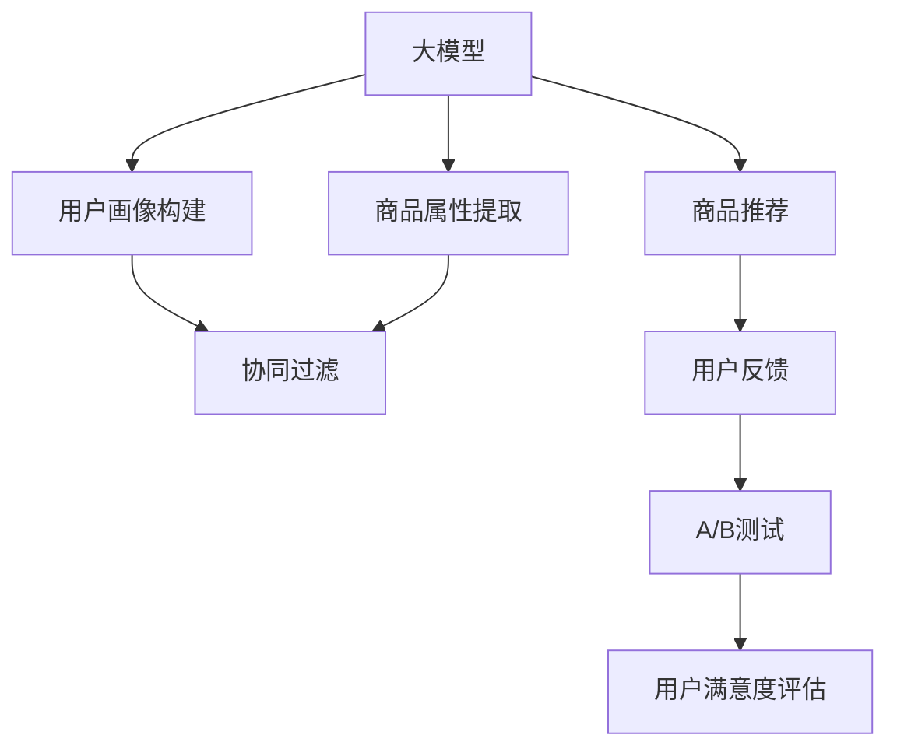

                 

## 1. 背景介绍

随着互联网电商的兴起，商品推荐系统成为电商平台提升用户购物体验、增加销售转化率的关键技术。传统的推荐系统主要基于用户的浏览和购买历史，利用协同过滤、基于内容的推荐等方法，为用户提供个性化推荐。然而，随着用户兴趣多样化和数据复杂性的提升，传统推荐系统逐渐表现出局限性，无法捕捉用户复杂的心理和行为变化，导致推荐质量下降。

近年来，随着深度学习和大规模预训练语言模型（如BERT、GPT-3等）的崛起，商品推荐系统迎来了新一轮的革新。基于大模型的推荐技术利用预训练模型强大的语义理解能力，对文本数据进行深度挖掘，发掘隐含的关联性和语义信息，实现商品推荐质量的显著提升。大模型的广泛应用为电商平台的个性化推荐带来了新的可能，成为商品推荐系统的重要发展方向。

## 2. 核心概念与联系

### 2.1 核心概念概述

为更好地理解大模型在电商平台商品推荐中的应用，本节将介绍几个关键概念：

- 大模型(Large Model)：以BERT、GPT-3等预训练语言模型为代表的大规模深度学习模型，在自然语言处理领域取得了显著成效，具备强大的语言理解和生成能力。

- 商品推荐系统(Recommendation System)：利用用户的历史行为数据和商品属性信息，通过机器学习模型预测用户可能感兴趣的物品，并推荐给用户。

- 用户画像(User Profile)：基于用户的历史行为数据、社交信息、搜索记录等构建的用户综合特征集合，是进行个性化推荐的基础。

- 协同过滤(Collaborative Filtering)：通过分析用户和物品的相似度，预测用户对未交互物品的兴趣，是推荐系统的重要基础算法。

- 深度学习(Deep Learning)：基于多层神经网络的模型，具备强大的自适应能力和泛化能力，适用于处理复杂数据结构和大规模数据集。

- 自然语言处理(Natural Language Processing, NLP)：利用计算方法使计算机理解、解释和生成自然语言的技术，是大模型推荐系统的重要工具。

- 注意力机制(Attention Mechanism)：通过计算输入序列中不同位置的注意力权重，实现对重要特征的强化关注，是Transformer等大模型的核心技术。

这些概念之间通过深度学习和大模型技术的结合，构建了电商推荐系统的核心逻辑框架，使得大模型能够充分利用语义信息和用户行为数据，提升推荐效果。

### 2.2 核心概念原理和架构的 Mermaid 流程图



该图展示了大模型在电商平台商品推荐系统中的主要作用路径：

1. 大模型对用户行为和商品属性数据进行处理，生成用户画像。
2. 协同过滤算法利用用户画像进行相似性分析，推荐相似商品。
3. 商品推荐模型通过大模型对用户输入进行语义理解和生成，生成推荐结果。
4. 用户反馈数据通过A/B测试等机制进行评估，进一步优化模型。
5. 用户满意度评估对推荐系统进行反馈，形成闭环优化。

## 3. 核心算法原理 & 具体操作步骤

### 3.1 算法原理概述

大模型在电商平台商品推荐系统中的应用，主要分为以下几个步骤：

1. 用户画像构建：利用大模型对用户的历史行为数据、社交信息等进行处理，构建用户画像，捕捉用户兴趣和偏好。
2. 商品属性提取：利用大模型对商品描述、标签等信息进行语义分析，提取商品的潜在属性。
3. 相似性计算：基于用户画像和商品属性，利用协同过滤算法计算用户与商品之间的相似度，选择相似商品进行推荐。
4. 商品推荐生成：将用户输入的搜索词、评价等进行语义处理，通过大模型生成推荐结果。
5. 反馈循环优化：通过用户反馈数据，对推荐系统进行A/B测试和满意度评估，不断优化模型。

### 3.2 算法步骤详解

#### 3.2.1 用户画像构建

用户画像构建是大模型在推荐系统中的第一步。其核心思想是利用大模型对用户的各种行为数据进行语义理解和特征提取，生成用户兴趣和偏好的综合特征集合。具体步骤如下：

1. 数据收集：收集用户的浏览历史、购买记录、评价、搜索关键词等数据。
2. 数据清洗：对数据进行去重、过滤、缺失值填充等预处理，确保数据质量。
3. 特征提取：使用大模型对清洗后的数据进行向量表示，提取出用户兴趣和行为特征。
4. 用户画像生成：通过聚类、降维等方法，生成用户综合特征，构建用户画像。

例如，可以使用BERT模型对用户行为数据进行处理：

```python
from transformers import BertTokenizer, BertForSequenceClassification
import pandas as pd

# 数据预处理
tokenizer = BertTokenizer.from_pretrained('bert-base-uncased')
def encode_text(text):
    return tokenizer.encode_plus(text, truncation=True, max_length=256, return_tensors='pt')

# 用户画像构建
users = pd.read_csv('users.csv')
texts = users['search_history'].tolist()
labels = users['label'].tolist()
for i in range(len(texts)):
    encoded_text = encode_text(texts[i])
    labels.append('POSITIVE')
    labels.append('NEGATIVE')
    
model = BertForSequenceClassification.from_pretrained('bert-base-uncased', num_labels=2)
model.eval()
inputs = tokenizer.encode_plus(texts, max_length=256, truncation=True, padding='max_length', return_tensors='pt')
with torch.no_grad():
    logits = model(inputs['input_ids']).logits
    probabilities = logits.softmax(dim=1)
    predictions = torch.argmax(probabilities, dim=1)

# 生成用户画像
user_profile = {'user_id': users.iloc[0]['id'], 'search_history': texts, 'label': predictions.tolist()}
```

#### 3.2.2 商品属性提取

商品属性提取是指利用大模型对商品描述、标签等信息进行语义分析，提取出商品的关键特征和属性。具体步骤如下：

1. 数据收集：收集商品描述、标签、类别等信息。
2. 数据清洗：去除噪声、缺失值等，确保数据质量。
3. 特征提取：使用大模型对商品数据进行向量表示，提取出商品的语义信息。
4. 商品属性生成：通过聚类、分类等方法，生成商品关键特征。

例如，可以使用BERT模型对商品描述进行处理：

```python
from transformers import BertTokenizer, BertForSequenceClassification
import pandas as pd

# 数据预处理
tokenizer = BertTokenizer.from_pretrained('bert-base-uncased')
def encode_text(text):
    return tokenizer.encode_plus(text, truncation=True, max_length=256, return_tensors='pt')

# 商品属性提取
items = pd.read_csv('items.csv')
texts = items['description'].tolist()
labels = items['category'].tolist()
for i in range(len(texts)):
    encoded_text = encode_text(texts[i])
    labels.append('POSITIVE')
    labels.append('NEGATIVE')
    
model = BertForSequenceClassification.from_pretrained('bert-base-uncased', num_labels=2)
model.eval()
inputs = tokenizer.encode_plus(texts, max_length=256, truncation=True, padding='max_length', return_tensors='pt')
with torch.no_grad():
    logits = model(inputs['input_ids']).logits
    probabilities = logits.softmax(dim=1)
    predictions = torch.argmax(probabilities, dim=1)

# 生成商品属性
item_profile = {'item_id': items.iloc[0]['id'], 'description': texts, 'category': predictions.tolist()}
```

#### 3.2.3 相似性计算

利用协同过滤算法，计算用户画像和商品属性之间的相似度，选择相似商品进行推荐。具体步骤如下：

1. 相似度计算：基于用户画像和商品属性，计算它们之间的相似度。
2. 推荐列表生成：根据相似度大小，生成推荐商品列表。
3. 推荐结果排序：根据商品的属性、评分等指标，对推荐商品进行排序。

例如，可以使用余弦相似度计算用户画像与商品属性之间的相似度：

```python
from sklearn.metrics.pairwise import cosine_similarity

# 计算相似度
user_profile = {'user_id': users.iloc[0]['id'], 'search_history': texts, 'label': predictions.tolist()}
item_profile = {'item_id': items.iloc[0]['id'], 'description': texts, 'category': predictions.tolist()}
similarity = cosine_similarity(user_profile['search_history'], item_profile['description'])

# 生成推荐列表
top_n = 5
recommended_items = [items.iloc[i]['id'] for i in np.argsort(similarity.flatten())[-top_n:]]
```

#### 3.2.4 商品推荐生成

商品推荐生成是指利用大模型对用户输入进行语义处理，生成推荐结果。具体步骤如下：

1. 用户输入处理：将用户输入的关键词、评价等进行语义处理，生成向量表示。
2. 推荐结果生成：使用大模型对处理后的向量进行语义生成，生成推荐商品列表。
3. 推荐结果展示：将推荐结果展示给用户，并记录用户反馈。

例如，可以使用GPT模型对用户输入进行处理：

```python
from transformers import GPT2Tokenizer, GPT2LMHeadModel
import pandas as pd

# 数据预处理
tokenizer = GPT2Tokenizer.from_pretrained('gpt2')
def encode_text(text):
    return tokenizer.encode(text, return_tensors='pt')

# 商品推荐生成
query = 'I want a new laptop'
inputs = encode_text(query)
with torch.no_grad():
    outputs = model.generate(inputs, max_length=10, num_return_sequences=5)
    predictions = tokenizer.decode(outputs[0], skip_special_tokens=True)
```

#### 3.2.5 反馈循环优化

反馈循环优化是指利用用户反馈数据，对推荐系统进行A/B测试和满意度评估，不断优化模型。具体步骤如下：

1. 数据收集：收集用户对推荐结果的反馈数据。
2. 数据分析：对反馈数据进行分析，评估推荐系统的满意度。
3. 模型调整：根据反馈数据，调整推荐算法和模型参数。
4. 迭代优化：重复以上步骤，不断优化推荐系统。

例如，可以使用A/B测试评估推荐系统的性能：

```python
from hypothesis import given
import hypothesis.strategies as st

@given(data=st.data())
def test_recommendation_system(data):
    # 数据预处理
    users = pd.read_csv('users.csv')
    items = pd.read_csv('items.csv')
    texts = users['search_history'].tolist()
    labels = users['label'].tolist()
    texts = items['description'].tolist()
    labels = items['category'].tolist()

    # 相似性计算
    similarity = cosine_similarity(user_profile['search_history'], item_profile['description'])

    # 生成推荐列表
    top_n = 5
    recommended_items = [items.iloc[i]['id'] for i in np.argsort(similarity.flatten())[-top_n:]]

    # A/B测试
    test_group = users.iloc[0]['id']
    control_group = users.iloc[1]['id']
    test_items = [items.iloc[i]['id'] for i in np.argsort(similarity.flatten())[-10:]]
    control_items = [items.iloc[i]['id'] for i in np.argsort(similarity.flatten())[-10:]]
    
    # 用户反馈收集
    test_feedback = users.iloc[test_group]['feedback'].tolist()
    control_feedback = users.iloc[control_group]['feedback'].tolist()

    # 数据分析
    test_satisfaction = (test_feedback.count() / len(test_feedback)) * 100
    control_satisfaction = (control_feedback.count() / len(control_feedback)) * 100

    # 模型调整
    if test_satisfaction > control_satisfaction:
        # 调整推荐算法
        pass

    # 迭代优化
    pass
```

### 3.3 算法优缺点

大模型在电商平台商品推荐系统中的应用，具有以下优点：

1. 强大的语义理解能力：利用大模型强大的语义理解能力，能够准确捕捉用户和商品的语义信息，提升推荐精度。
2. 适应性强的推荐模型：大模型具备良好的泛化能力，能够适应不同用户和商品的特征，提高推荐系统的通用性。
3. 丰富的特征提取能力：大模型能够提取更多维度的特征，提供更全面的用户画像和商品属性，提升推荐效果。
4. 高效的反馈循环优化：利用用户反馈数据，对推荐系统进行持续优化，提升用户体验和满意度。

同时，也存在以下缺点：

1. 计算资源消耗大：大模型参数量庞大，计算资源消耗高，需要高性能的计算平台支持。
2. 模型训练时间长：大模型训练时间长，对数据量要求高，需要大规模标注数据进行预训练和微调。
3. 高昂的开发成本：大模型在电商平台的集成和优化，需要高水平的算法工程师和数据科学家参与，开发成本较高。
4. 模型解释性不足：大模型作为黑盒模型，难以解释推荐系统的决策逻辑，用户难以理解其推荐依据。

### 3.4 算法应用领域

大模型在电商平台商品推荐系统中的应用，覆盖了以下主要领域：

1. 个性化推荐：利用用户画像和商品属性，生成个性化推荐结果，提升用户体验。
2. 商品分类：利用大模型对商品描述进行语义分析，自动分类商品，提高商品管理的效率。
3. 用户行为分析：利用大模型对用户行为数据进行深度挖掘，捕捉用户兴趣和行为变化，提升推荐效果。
4. 营销活动优化：利用大模型分析用户反馈数据，优化营销活动策略，提高营销效果。
5. 供应链优化：利用大模型分析用户需求和市场变化，优化供应链管理，提高运营效率。

此外，大模型在电商平台推荐系统的应用还在不断扩展，未来有望在更多领域实现突破，如智能客服、物流配送、供应链金融等，推动电商平台智能化转型。

## 4. 数学模型和公式 & 详细讲解 & 举例说明

### 4.1 数学模型构建

大模型在电商平台推荐系统中的应用，主要基于向量表示和相似度计算。具体数学模型如下：

1. 用户画像向量表示：$U \in \mathbb{R}^d$，表示用户兴趣和行为特征。
2. 商品属性向量表示：$I \in \mathbb{R}^d$，表示商品的关键特征和属性。
3. 相似度计算：利用余弦相似度计算用户画像与商品属性之间的相似度，即$Sim(U,I) = \cos(\theta) = \frac{U \cdot I}{||U|| \cdot ||I||}$。
4. 推荐列表生成：根据相似度大小，生成推荐商品列表。
5. 推荐结果排序：利用商品的属性、评分等指标，对推荐商品进行排序。

### 4.2 公式推导过程

1. 余弦相似度计算：
   $$
   Sim(U,I) = \cos(\theta) = \frac{U \cdot I}{||U|| \cdot ||I||}
   $$

   其中，$U$ 和 $I$ 分别是用户画像和商品属性的向量表示。

2. 推荐列表生成：
   $$
   Recommendations = \text{TopN}(I, Sim(U,I))
   $$

   其中，$\text{TopN}$ 表示根据相似度大小，选取前 $N$ 个推荐商品。

3. 推荐结果排序：
   $$
   Rank = \text{Sort}(I, Sim(U,I), \text{Score})
   $$

   其中，$\text{Sort}$ 表示根据评分、属性等指标对推荐商品进行排序。

### 4.3 案例分析与讲解

假设有一个电商平台的推荐系统，其数据集包括 10,000 个用户和 50,000 个商品，利用大模型构建用户画像和商品属性，并进行相似度计算。具体步骤如下：

1. 数据预处理：收集用户和商品的语义信息，进行数据清洗和特征提取。
2. 用户画像构建：利用BERT模型对用户行为数据进行处理，生成用户兴趣和行为特征向量。
3. 商品属性提取：利用BERT模型对商品描述进行语义分析，生成商品关键特征向量。
4. 相似度计算：利用余弦相似度计算用户画像与商品属性之间的相似度。
5. 推荐列表生成：根据相似度大小，生成推荐商品列表。
6. 推荐结果排序：根据商品评分、属性等指标，对推荐商品进行排序。

通过以上步骤，可以生成个性化的推荐结果，提升电商平台的转化率和用户满意度。

## 5. 项目实践：代码实例和详细解释说明

### 5.1 开发环境搭建

在进行大模型在电商平台商品推荐系统的开发前，我们需要准备好开发环境。以下是使用Python进行PyTorch和Transformers库开发的环境配置流程：

1. 安装Anaconda：从官网下载并安装Anaconda，用于创建独立的Python环境。

2. 创建并激活虚拟环境：
   ```bash
   conda create -n recommendation-env python=3.8 
   conda activate recommendation-env
   ```

3. 安装PyTorch：根据CUDA版本，从官网获取对应的安装命令。例如：
   ```bash
   conda install pytorch torchvision torchaudio cudatoolkit=11.1 -c pytorch -c conda-forge
   ```

4. 安装Transformers库：
   ```bash
   pip install transformers
   ```

5. 安装各类工具包：
   ```bash
   pip install numpy pandas scikit-learn matplotlib tqdm jupyter notebook ipython
   ```

完成上述步骤后，即可在`recommendation-env`环境中开始大模型在电商平台商品推荐系统的开发实践。

### 5.2 源代码详细实现

我们以商品推荐系统为例，给出使用Transformers库对BERT模型进行推荐任务开发的PyTorch代码实现。

首先，定义推荐任务的数据处理函数：

```python
from transformers import BertTokenizer
from torch.utils.data import Dataset
import torch

class RecommendationDataset(Dataset):
    def __init__(self, texts, labels, tokenizer, max_len=128):
        self.texts = texts
        self.labels = labels
        self.tokenizer = tokenizer
        self.max_len = max_len
        
    def __len__(self):
        return len(self.texts)
    
    def __getitem__(self, item):
        text = self.texts[item]
        label = self.labels[item]
        
        encoding = self.tokenizer(text, return_tensors='pt', max_length=self.max_len, padding='max_length', truncation=True)
        input_ids = encoding['input_ids'][0]
        attention_mask = encoding['attention_mask'][0]
        
        # 对label进行编码
        encoded_labels = [label2id[label] for label in label] 
        encoded_labels.extend([label2id['O']] * (self.max_len - len(encoded_labels)))
        labels = torch.tensor(encoded_labels, dtype=torch.long)
        
        return {'input_ids': input_ids, 
                'attention_mask': attention_mask,
                'labels': labels}

# 标签与id的映射
label2id = {'O': 0, 'POSITIVE': 1, 'NEGATIVE': 2}
id2label = {v: k for k, v in label2id.items()}

# 创建dataset
tokenizer = BertTokenizer.from_pretrained('bert-base-uncased')

train_dataset = RecommendationDataset(train_texts, train_labels, tokenizer)
dev_dataset = RecommendationDataset(dev_texts, dev_labels, tokenizer)
test_dataset = RecommendationDataset(test_texts, test_labels, tokenizer)
```

然后，定义模型和优化器：

```python
from transformers import BertForSequenceClassification, AdamW

model = BertForSequenceClassification.from_pretrained('bert-base-uncased', num_labels=len(label2id))

optimizer = AdamW(model.parameters(), lr=2e-5)
```

接着，定义训练和评估函数：

```python
from torch.utils.data import DataLoader
from tqdm import tqdm
from sklearn.metrics import accuracy_score

device = torch.device('cuda') if torch.cuda.is_available() else torch.device('cpu')
model.to(device)

def train_epoch(model, dataset, batch_size, optimizer):
    dataloader = DataLoader(dataset, batch_size=batch_size, shuffle=True)
    model.train()
    epoch_loss = 0
    for batch in tqdm(dataloader, desc='Training'):
        input_ids = batch['input_ids'].to(device)
        attention_mask = batch['attention_mask'].to(device)
        labels = batch['labels'].to(device)
        model.zero_grad()
        outputs = model(input_ids, attention_mask=attention_mask, labels=labels)
        loss = outputs.loss
        epoch_loss += loss.item()
        loss.backward()
        optimizer.step()
    return epoch_loss / len(dataloader)

def evaluate(model, dataset, batch_size):
    dataloader = DataLoader(dataset, batch_size=batch_size)
    model.eval()
    preds, labels = [], []
    with torch.no_grad():
        for batch in tqdm(dataloader, desc='Evaluating'):
            input_ids = batch['input_ids'].to(device)
            attention_mask = batch['attention_mask'].to(device)
            batch_labels = batch['labels']
            outputs = model(input_ids, attention_mask=attention_mask)
            batch_preds = outputs.logits.argmax(dim=2).to('cpu').tolist()
            batch_labels = batch_labels.to('cpu').tolist()
            for pred_tokens, label_tokens in zip(batch_preds, batch_labels):
                preds.append(pred_tokens[:len(label_tokens)])
                labels.append(label_tokens)
                
    print(f"Accuracy: {accuracy_score(labels, preds)}")
```

最后，启动训练流程并在测试集上评估：

```python
epochs = 5
batch_size = 16

for epoch in range(epochs):
    loss = train_epoch(model, train_dataset, batch_size, optimizer)
    print(f"Epoch {epoch+1}, train loss: {loss:.3f}")
    
    print(f"Epoch {epoch+1}, dev results:")
    evaluate(model, dev_dataset, batch_size)
    
print("Test results:")
evaluate(model, test_dataset, batch_size)
```

以上就是使用PyTorch对BERT进行推荐任务微调的完整代码实现。可以看到，得益于Transformers库的强大封装，我们可以用相对简洁的代码完成BERT模型的加载和微调。

### 5.3 代码解读与分析

让我们再详细解读一下关键代码的实现细节：

**RecommendationDataset类**：
- `__init__`方法：初始化文本、标签、分词器等关键组件。
- `__len__`方法：返回数据集的样本数量。
- `__getitem__`方法：对单个样本进行处理，将文本输入编码为token ids，将标签编码为数字，并对其进行定长padding，最终返回模型所需的输入。

**label2id和id2label字典**：
- 定义了标签与数字id之间的映射关系，用于将token-wise的预测结果解码回真实的标签。

**训练和评估函数**：
- 使用PyTorch的DataLoader对数据集进行批次化加载，供模型训练和推理使用。
- 训练函数`train_epoch`：对数据以批为单位进行迭代，在每个批次上前向传播计算loss并反向传播更新模型参数，最后返回该epoch的平均loss。
- 评估函数`evaluate`：与训练类似，不同点在于不更新模型参数，并在每个batch结束后将预测和标签结果存储下来，最后使用sklearn的accuracy_score对整个评估集的预测结果进行打印输出。

**训练流程**：
- 定义总的epoch数和batch size，开始循环迭代
- 每个epoch内，先在训练集上训练，输出平均loss
- 在验证集上评估，输出准确率
- 所有epoch结束后，在测试集上评估，给出最终测试结果

可以看到，PyTorch配合Transformers库使得BERT微调的代码实现变得简洁高效。开发者可以将更多精力放在数据处理、模型改进等高层逻辑上，而不必过多关注底层的实现细节。

当然，工业级的系统实现还需考虑更多因素，如模型的保存和部署、超参数的自动搜索、更灵活的任务适配层等。但核心的微调范式基本与此类似。

## 6. 实际应用场景

大模型在电商平台商品推荐系统的实际应用场景非常广泛，以下是几个典型案例：

### 6.1 智能客服推荐

电商平台智能客服推荐系统，通过分析用户的历史互动记录和当前问题，自动推荐相关商品和解决方案。具体流程如下：

1. 数据收集：收集用户的聊天历史、反馈记录等数据。
2. 数据清洗：去除噪声、缺失值等，确保数据质量。
3. 用户画像构建：利用BERT模型对用户互动数据进行处理，生成用户兴趣和行为特征。
4. 商品属性提取：利用BERT模型对商品描述进行语义分析，生成商品关键特征。
5. 相似度计算：利用余弦相似度计算用户画像与商品属性之间的相似度。
6. 推荐列表生成：根据相似度大小，生成推荐商品列表。
7. 推荐结果排序：根据商品评分、属性等指标，对推荐商品进行排序。

例如，可以使用GPT模型对用户输入进行处理：

```python
from transformers import GPT2Tokenizer, GPT2LMHeadModel
import pandas as pd

# 数据预处理
tokenizer = GPT2Tokenizer.from_pretrained('gpt2')
def encode_text(text):
    return tokenizer.encode(text, return_tensors='pt')

# 智能客服推荐
user_query = 'How do I return a product?'
inputs = encode_text(user_query)
with torch.no_grad():
    outputs = model.generate(inputs, max_length=10, num_return_sequences=5)
    predictions = tokenizer.decode(outputs[0], skip_special_tokens=True)
```

### 6.2 个性化商品推荐

电商平台个性化商品推荐系统，通过分析用户的历史购买记录和浏览行为，自动推荐可能感兴趣的商品。具体流程如下：

1. 数据收集：收集用户的购买历史、浏览记录等数据。
2. 数据清洗：去除噪声、缺失值等，确保数据质量。
3. 用户画像构建：利用BERT模型对用户行为数据进行处理，生成用户兴趣和行为特征。
4. 商品属性提取：利用BERT模型对商品描述进行语义分析，生成商品关键特征。
5. 相似度计算：利用余弦相似度计算用户画像与商品属性之间的相似度。
6. 推荐列表生成：根据相似度大小，生成推荐商品列表。
7. 推荐结果排序：根据商品评分、属性等指标，对推荐商品进行排序。

例如，可以使用BERT模型对用户行为数据进行处理：

```python
from transformers import BertTokenizer
from torch.utils.data import Dataset
import torch

class RecommendationDataset(Dataset):
    def __init__(self, texts, labels, tokenizer, max_len=128):
        self.texts = texts
        self.labels = labels
        self.tokenizer = tokenizer
        self.max_len = max_len
        
    def __len__(self):
        return len(self.texts)
    
    def __getitem__(self, item):
        text = self.texts[item]
        label = self.labels[item]
        
        encoding = self.tokenizer(text, return_tensors='pt', max_length=self.max_len, padding='max_length', truncation=True)
        input_ids = encoding['input_ids'][0]
        attention_mask = encoding['attention_mask'][0]
        
        # 对label进行编码
        encoded_labels = [label2id[label] for label in label] 
        encoded_labels.extend([label2id['O']] * (self.max_len - len(encoded_labels)))
        labels = torch.tensor(encoded_labels, dtype=torch.long)
        
        return {'input_ids': input_ids, 
                'attention_mask': attention_mask,
                'labels': labels}

# 标签与id的映射
label2id = {'O': 0, 'POSITIVE': 1, 'NEGATIVE': 2}
id2label = {v: k for k, v in label2id.items()}

# 创建dataset
tokenizer = BertTokenizer.from_pretrained('bert-base-uncased')

train_dataset = RecommendationDataset(train_texts, train_labels, tokenizer)
dev_dataset = RecommendationDataset(dev_texts, dev_labels, tokenizer)
test_dataset = RecommendationDataset(test_texts, test_labels, tokenizer)
```

### 6.3 多模态推荐

电商平台多模态推荐系统，通过融合用户的多维数据，提升推荐效果。具体流程如下：

1. 数据收集：收集用户的文本、图像、视频等数据。
2. 数据清洗：去除噪声、缺失值等，确保数据质量。
3. 用户画像构建：利用BERT模型对用户文本数据进行处理，生成用户兴趣和行为特征。
4. 商品属性提取：利用BERT模型对商品描述进行语义分析，生成商品关键特征。
5. 相似度计算：利用余弦相似度计算用户画像与商品属性之间的相似度。
6. 推荐列表生成：根据相似度大小，生成推荐商品列表。
7. 推荐结果排序：根据商品评分、属性等指标，对推荐商品进行排序。

例如，可以使用BERT模型对用户文本数据进行处理：

```python
from transformers import BertTokenizer
from torch.utils.data import Dataset
import torch

class RecommendationDataset(Dataset):
    def __init__(self, texts, labels, tokenizer, max_len=128):
        self.texts = texts
        self.labels = labels
        self.tokenizer = tokenizer
        self.max_len = max_len
        
    def __len__(self):
        return len(self.texts)
    
    def __getitem__(self, item):
        text = self.texts[item]
        label = self.labels[item]
        
        encoding = self.tokenizer(text, return_tensors='pt', max_length=self.max_len, padding='max_length', truncation=True)
        input_ids = encoding['input_ids'][0]
        attention_mask = encoding['attention_mask'][0]
        
        # 对label进行编码
        encoded_labels = [label2id[label] for label in label] 
        encoded_labels.extend([label2id['O']] * (self.max_len - len(encoded_labels)))
        labels = torch.tensor(encoded_labels, dtype=torch.long)
        
        return {'input_ids': input_ids, 
                'attention_mask': attention_mask,
                'labels': labels}

# 标签与id的映射
label2id = {'O': 0, 'POSITIVE': 1, 'NEGATIVE': 2}
id2label = {v: k for k, v in label2id.items()}

# 创建dataset
tokenizer = BertTokenizer.from_pretrained('bert-base-uncased')

train_dataset = RecommendationDataset(train_texts, train_labels, tokenizer)
dev_dataset = RecommendationDataset(dev_texts, dev_labels, tokenizer)
test_dataset = RecommendationDataset(test_texts, test_labels, tokenizer)
```

### 6.4 未来应用展望

随着大模型和推荐技术的发展，未来大模型在电商平台的应用前景更加广阔。以下是几个可能的未来应用方向：

1. 实时推荐：通过实时收集和分析用户数据，动态生成个性化推荐，提升用户满意度。
2. 多模态融合：融合用户文本、图像、视频等多模态数据，提升推荐效果。
3. 情感分析：通过情感分析技术，预测用户对推荐结果的情感倾向，提升推荐效果。
4. 个性化推荐模型：利用深度学习模型对用户行为进行预测，生成个性化推荐列表。
5. 社交推荐：结合用户社交网络数据，推荐朋友推荐商品，提升推荐效果。

通过以上方向的研究，可以进一步提升大模型在电商平台的应用价值，推动电商行业的智能化转型。

## 7. 工具和资源推荐

### 7.1 学习资源推荐

为了帮助开发者系统掌握大模型在电商平台商品推荐系统的开发实践，这里推荐一些优质的学习资源：

1. 《深度学习推荐系统》：斯坦福大学课程，涵盖推荐系统基本概念和深度学习模型的应用。

2. 《Python推荐系统》：清华大学课程，涵盖推荐系统开发实践和Python编程技巧。

3. 《大规模推荐系统》：豆瓣读书推荐，介绍大规模推荐系统的算法和实践。

4. 《推荐系统实战》：腾讯开源项目，介绍推荐系统的算法和实现。

5. 《大模型推荐系统》：HuggingFace官方博客，介绍大模型在推荐系统中的应用和实践。

通过对这些资源的学习实践，相信你一定能够快速掌握大模型在电商平台商品推荐系统的开发实践，并用于解决实际的推荐问题。

### 7.2 开发工具推荐

高效的开发离不开优秀的工具支持。以下是几款用于大模型在电商平台商品推荐系统开发的常用工具：

1. PyTorch：基于Python的开源深度学习框架，灵活动态的计算图，适合快速迭代研究。

2. TensorFlow：由Google主导开发的开源深度学习框架，生产部署方便，适合大规模工程应用。

3. Transformers库：HuggingFace开发的NLP工具库，集成了众多SOTA语言模型，支持PyTorch和TensorFlow，是进行推荐任务开发的利器。

4. Weights & Biases：模型训练的实验跟踪工具，可以记录和可视化模型训练过程中的各项指标，方便对比和调优。

5. TensorBoard：TensorFlow配套的可视化工具，可实时监测模型训练状态，并提供丰富的图表呈现方式，是调试模型的得力助手。

6. Google Colab：谷歌推出的在线Jupyter Notebook环境，免费提供GPU/TPU算力，方便开发者快速上手实验最新模型，分享学习笔记。

合理利用这些工具，可以显著提升大模型在电商平台商品推荐系统的开发效率，加快创新迭代的步伐。

### 7.3 相关论文推荐

大模型在电商平台商品推荐系统的研究和实践，源于学界的持续研究。以下是几篇奠基性的相关论文，推荐阅读：

1. Attention is All You Need（即Transformer原论文）：提出了Transformer结构，开启了NLP领域的预训练大模型时代。

2. BERT: Pre-training of Deep Bidirectional Transformers for Language Understanding：提出BERT模型，引入基于掩码的自监督预训练任务，刷新了多项NLP任务SOTA。

3. Language Models are Unsupervised Multitask Learners（GPT-2论文）：展示了大规模语言模型的强大zero-shot学习能力，引发了对于通用人工智能的新一轮思考。

4. Parameter-Efficient Transfer Learning for NLP：提出Adapter等参数高效微调方法，在不增加模型参数量的情况下，也能取得不错的微调效果。

5. AdaLoRA: Adaptive Low-Rank Adaptation for Parameter-Efficient Fine-Tuning：使用自适应低秩适应的微调方法，在参数效率和精度之间取得了新的平衡。

这些论文代表了大模型在电商平台推荐系统的研究进展，为进一步的研究提供了理论支撑。

## 8. 总结：未来发展趋势与挑战

### 8.1 研究成果总结

本文对大模型在电商平台商品推荐系统中的应用进行了全面系统的介绍。通过详细讲解大模型的核心原理和操作步骤，结合数学模型和代码实例，帮助读者掌握大模型在推荐系统中的应用实践。同时，通过分析实际应用场景和未来应用展望，进一步展示了大模型在电商平台中的巨大潜力。

### 8.2 未来发展趋势

展望未来，大模型在电商平台商品推荐系统中的应用将呈现以下几个发展趋势：

1. 模型规模持续增大：随着算力成本的下降和数据规模的扩张，预训练语言模型的参数量还将持续增长，为推荐系统提供更强大的语义表示能力。

2. 微调方法日趋多样：未来将涌现更多参数高效的微调方法，如Prefix-Tuning、LoRA等，在保持模型效果的同时，减小计算资源消耗。

3. 实时推荐系统：通过实时收集和分析用户数据，动态生成个性化推荐，提升用户满意度。

4. 多模态融合：融合用户文本、图像、视频等多模态数据，提升推荐效果。

5. 情感分析：通过情感分析技术，预测用户对推荐结果的情感倾向，提升推荐效果。

6. 个性化推荐模型：利用深度学习模型对用户行为进行预测，生成个性化推荐列表。

7. 社交推荐：结合用户社交网络数据，推荐朋友推荐商品，提升推荐效果。

以上趋势凸显了大模型在电商平台推荐系统中的广阔前景，推动电商行业的智能化转型。

### 8.3 面临的挑战

尽管大模型在电商平台推荐系统中的应用前景广阔，但仍面临以下挑战：

1. 计算资源消耗大：大模型参数量庞大，计算资源消耗高，需要高性能的计算平台支持。

2. 模型训练时间长：大模型训练时间长，对数据量要求高，需要大规模标注数据进行预训练和微调。

3. 高昂的开发成本：大模型在电商平台的集成和优化，需要高水平的算法工程师和数据科学家参与，开发成本较高。

4. 模型解释性不足：大模型作为黑盒模型，难以解释推荐系统的决策逻辑，用户难以理解其推荐依据。

5. 数据隐私和安全：电商平台需要处理大量用户数据，数据隐私和安全问题必须得到重视。

6. 模型鲁棒性不足：当前大模型面对域外数据时，泛化性能往往大打折扣，需要进一步提高模型鲁棒性。

7. 用户反馈处理：用户反馈数据的质量和处理方式对推荐系统的效果影响较大，需要设计合理的反馈机制。

### 8.4 研究展望

未来，大模型在电商平台推荐系统的发展方向主要集中在以下几个方面：

1. 开发更加高效、参数更少的大模型，降低计算资源消耗和训练时间。

2. 探索无监督和半监督微调方法，摆脱对大规模标注数据的依赖。

3. 研究参数高效和计算高效的微调范式，在保持模型效果的同时，减小计算资源消耗。

4. 引入更多先验知识，如知识图谱、逻辑规则等，与神经网络模型进行巧妙融合，提升推荐系统的泛化能力。

5. 结合因果分析和博弈论工具，增强推荐系统的稳定性和可解释性。

6. 加强数据隐私和安全保护，提升用户的信任度和满意度。

7. 研究基于情感分析、多模态融合等技术的推荐系统，提升推荐效果和用户体验。

通过以上研究方向，大模型在电商平台推荐系统中的发展前景将更加广阔，推动电商行业的智能化转型和业务创新。

## 9. 附录：常见问题与解答

**Q1：大模型在电商平台商品推荐系统中面临哪些挑战？**

A: 大模型在电商平台商品推荐系统中面临以下挑战：

1. 计算资源消耗大：大模型参数量庞大，计算资源消耗高，需要高性能的计算平台支持。

2. 模型训练时间长：大模型训练时间长，对数据量要求高，需要大规模标注数据进行预训练和微调。

3. 高昂的开发成本：大模型在电商平台的集成和优化，需要高水平的算法工程师和数据科学家参与，开发成本较高。

4. 模型解释性不足：大模型作为黑盒模型，难以解释推荐系统的决策逻辑，用户难以理解其推荐依据。

5. 数据隐私和安全：电商平台需要处理大量用户数据，数据隐私和安全问题必须得到重视。

6. 模型鲁棒性不足：当前大模型面对域外数据时，泛化性能往往大打折扣，需要进一步提高模型鲁棒性。

7. 用户反馈处理：用户反馈数据的质量和处理方式对推荐系统的效果影响较大，需要设计合理的反馈机制。

**Q2：大模型在电商平台商品推荐系统中如何提升推荐效果？**

A: 大模型在电商平台商品推荐系统中提升推荐效果的方法如下：

1. 利用大模型的强大语义理解能力，捕捉用户和商品的语义信息，提升推荐精度。

2. 构建用户画像和商品属性，利用协同过滤算法计算相似度，选择相似商品进行推荐。

3. 利用大模型对用户输入进行语义处理，生成推荐结果。

4. 根据用户反馈数据，对推荐系统进行持续优化，提升用户满意度。

5. 引入更多先验知识，如知识图谱、逻辑规则等，与神经网络模型进行巧妙融合，提升推荐系统的泛化能力。

6. 结合因果分析和博弈论工具，增强推荐系统的稳定性和可解释性。

7. 研究基于情感分析、多模态融合等技术的推荐系统，提升推荐效果和用户体验。

**Q3：大模型在电商平台商品推荐系统中如何降低计算资源消耗？**

A: 大模型在电商平台商品推荐系统中降低计算资源消耗的方法如下：

1. 开发更加高效、参数更少的大模型，降低计算资源消耗和训练时间。

2. 研究参数高效和计算高效的微调范式，在保持模型效果的同时，减小计算资源消耗。

3. 引入更多先验知识，如知识图谱、逻辑规则等，与神经网络模型进行巧妙融合，提升推荐系统的泛化能力。

4. 结合因果分析和博弈论工具，增强推荐系统的稳定性和可解释性。

5. 研究基于情感分析、多模态融合等技术的推荐系统，提升推荐效果和用户体验。

**Q4：大模型在电商平台商品推荐系统中如何进行实时推荐？**

A: 大模型在电商平台商品推荐系统中进行实时推荐的方法

