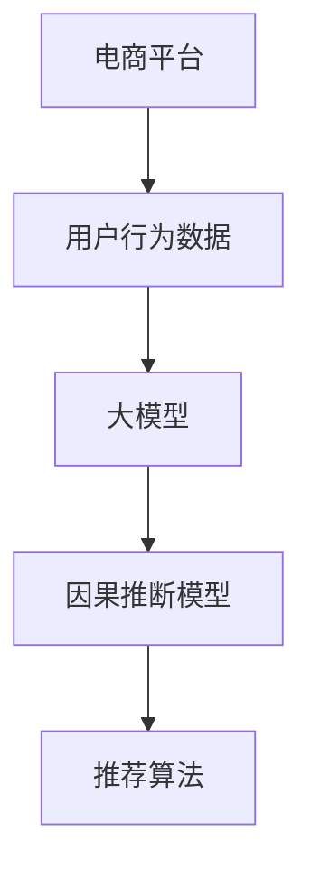

                 

## 1. 背景介绍

在电商平台上，如何准确推断用户行为背后的因果关系，是优化推荐系统、提升用户体验、驱动业务增长的核心问题。传统的推荐系统多采用协同过滤、内容推荐、基于规则等方法，难以深入理解用户的多维度行为动机。而基于深度学习的因果推断模型，能够从用户历史行为数据中提取出因果关系，从而进行更精准、个性化的推荐。本文将探讨基于深度学习的大模型在电商平台用户行为因果关系推断中的应用潜力，包括模型构建、算法原理、具体实现和应用展望。

## 2. 核心概念与联系

### 2.1 核心概念概述

- **大模型**：以自回归模型（如GPT、BERT等）为代表的大规模预训练语言模型，通过在海量文本数据上进行预训练，学习到丰富的语言知识和常识。

- **因果推断**：推断事件间的因果关系，包括原因和结果。在电商平台上，这意味着能够从用户的历史行为数据中提取因果关系，以更精确地预测用户的行为和需求。

- **电商推荐系统**：利用用户行为数据，通过推荐算法为用户提供个性化的商品推荐，提升购买转化率和用户满意度。

- **深度学习**：一类机器学习算法，通过构建多层神经网络模型，从数据中学习非线性特征表示，解决复杂问题。

- **对抗学习**：训练模型以生成对抗样本，提高模型的鲁棒性和泛化能力。

### 2.2 核心概念原理和架构的 Mermaid 流程图(Mermaid 流程节点中不要有括号、逗号等特殊字符)


### 2.3 核心概念之间的联系
通过电商平台（A）收集的用户行为数据（B），输入大模型（C）进行预训练，学习用户行为特征。预训练得到的模型再通过因果推断模型（D），从用户行为中提取出因果关系，最终指导推荐算法（E），为每个用户生成个性化推荐，提升电商平台的用户体验和业务收益。

## 3. 核心算法原理 & 具体操作步骤
### 3.1 算法原理概述

基于深度学习的大模型，通过预训练学习到用户行为数据中的隐含特征。随后，通过因果推断算法，在给定用户行为数据的情况下，推断出可能的影响因素，预测用户未来的行为，从而进行个性化推荐。这种基于深度学习的因果推断方法，被称为**因果推断模型**。

### 3.2 算法步骤详解

1. **数据准备**：
   - 收集电商平台用户的历史行为数据，包括浏览、点击、购买等行为。
   - 对数据进行清洗和标注，确保数据的质量和代表性。

2. **大模型预训练**：
   - 使用预训练语言模型，如BERT或GPT，在大规模无标注文本数据上预训练，学习语言表示。
   - 将电商平台的文本数据作为预训练数据的补充，进行微调，提升模型在电商领域的表现。

3. **因果推断模型训练**：
   - 选择合适的因果推断算法，如概率图模型、决策树、随机森林等。
   - 使用预训练模型作为特征提取器，将用户行为数据映射到高维特征空间。
   - 通过训练，使模型能够学习到用户行为数据中的因果关系。

4. **推荐系统集成**：
   - 将因果推断模型与电商平台的推荐算法集成，生成个性化推荐。
   - 定期更新模型，适应新数据和新用户行为。

### 3.3 算法优缺点

#### 3.3.1 优点
- **数据利用充分**：利用大规模无标注文本数据进行预训练，提取丰富的语义信息，提高推荐精度。
- **鲁棒性强**：通过因果推断算法，模型能够处理不确定性，对异常数据和噪声具有较高的容忍度。
- **可解释性高**：因果推断算法能够揭示因果关系，有助于理解模型决策的依据。
- **灵活性高**：适用于多种推荐场景，如实时推荐、个性化推荐等。

#### 3.3.2 缺点
- **计算复杂度高**：大模型和因果推断算法需要大量的计算资源和存储资源。
- **过拟合风险**：模型对训练数据的依赖较强，可能过拟合于特定用户群体的行为。
- **模型复杂度高**：构建复杂的大模型和因果推断模型，增加了模型理解和调优的难度。

### 3.4 算法应用领域
基于大模型的因果推断方法，可以应用于多个电商推荐场景，包括但不限于：

- **商品推荐**：根据用户历史行为，推断其对商品的偏好和需求，进行个性化推荐。
- **价格优化**：分析用户对不同价格商品的反应，推断价格调整对用户行为的影响。
- **库存管理**：预测商品的销售趋势，优化库存分配，减少缺货和库存积压。
- **广告投放**：预测广告投放的效果，优化广告投放策略，提升广告ROI。
- **用户流失预测**：分析用户流失的潜在原因，采取相应的用户挽留策略。

## 4. 数学模型和公式 & 详细讲解 & 举例说明

### 4.1 数学模型构建

假设电商平台上每个用户 $i$ 的历史行为数据为 $X_i$，包括浏览、点击、购买等行为。目标是推断这些行为背后的因果关系，即推断用户的行为动机。我们可以将用户行为数据表示为 $X_i = (x_{i1}, x_{i2}, ..., x_{in})$，其中 $x_{ik}$ 表示用户 $i$ 在第 $k$ 次行为中的特征。

大模型的输入为文本形式的 $X_i$，输出为高维特征表示 $H_i$，即 $H_i = M(X_i)$，其中 $M$ 为预训练模型。因果推断模型进一步利用 $H_i$ 进行因果推断，预测用户未来的行为 $Y_i$。

### 4.2 公式推导过程

1. **文本嵌入**：
   - 使用BERT模型，将用户行为文本数据 $X_i$ 转化为向量表示 $H_i$。
   - 假设预训练的BERT模型有 $h$ 个隐藏层，第 $k$ 个隐藏层的输出表示为 $h_k$。

2. **因果推断**：
   - 假设用户行为 $Y_i$ 为二分类问题，即用户是否购买某商品。
   - 通过因果推断算法，将 $H_i$ 映射到 $Y_i$。假设因果推断模型为 $C(H_i)$，其中 $C$ 为因果推断算法。

3. **模型训练**：
   - 使用训练集 $D$ 中的样本，训练因果推断模型 $C$。
   - 目标函数为交叉熵损失函数，即 $\mathcal{L}(C) = \frac{1}{N}\sum_{i=1}^N \ell(C(H_i), Y_i)$，其中 $\ell$ 为交叉熵损失函数。

4. **推荐策略**：
   - 在测试集 $D_t$ 上，对每个用户 $i$，利用因果推断模型 $C$ 和预训练模型 $M$，生成个性化推荐 $R_i$。
   - 推荐策略为 $\hat{R}_i = C(H_i) \times M(X_i)$，其中 $\hat{R}_i$ 为预测的用户购买概率。

### 4.3 案例分析与讲解

假设我们要预测用户是否购买某商品，我们可以使用因果推断模型，从用户的历史浏览行为中推断出购买意向。具体步骤如下：

1. 收集用户的历史浏览数据 $X_i = [(x_{i1}, y_{i1}), (x_{i2}, y_{i2}), ..., (x_{in}, y_{in})]$，其中 $(x_{ik}, y_{ik})$ 表示用户第 $k$ 次浏览行为。

2. 使用BERT模型，将每个浏览行为转换为向量表示 $H_i = [h_{i1}, h_{i2}, ..., h_{in}]$。

3. 使用因果推断算法，如决策树，将 $H_i$ 映射到用户是否购买某商品的预测结果 $Y_i$。

4. 使用训练集 $D$ 中的样本，训练因果推断模型 $C$，使其能够学习到 $H_i$ 和 $Y_i$ 之间的因果关系。

5. 在测试集 $D_t$ 上，对每个用户 $i$，利用因果推断模型 $C$ 和预训练模型 $M$，生成个性化推荐 $R_i = C(H_i) \times M(X_i)$。

## 5. 项目实践：代码实例和详细解释说明

### 5.1 开发环境搭建

- **Python环境**：安装Anaconda，创建独立的虚拟环境，安装必要的Python库，如TensorFlow、Keras等。

- **数据集准备**：收集电商平台的用户行为数据，进行清洗和标注，确保数据的质量和代表性。

### 5.2 源代码详细实现

以下是一个基于BERT和决策树的因果推断模型的Python代码实现：

```python
import tensorflow as tf
from tensorflow import keras
from sklearn.tree import DecisionTreeClassifier
from transformers import BertTokenizer, TFBertForSequenceClassification

# 数据准备
# 收集用户行为数据，进行清洗和标注

# 文本嵌入
tokenizer = BertTokenizer.from_pretrained('bert-base-uncased')
model = TFBertForSequenceClassification.from_pretrained('bert-base-uncased', num_labels=2)
max_length = 512
sequences = []
labels = []

# 将用户行为数据转化为BERT模型需要的格式
for i in range(len(user_behaviors)):
    sequence = tokenizer.tokenize(user_behaviors[i])
    sequence = sequence[:max_length]
    sequences.append(sequence)
    label = int(user_labels[i])
    labels.append(label)

# 模型训练
X_train, X_val, y_train, y_val = train_test_split(sequences, labels, test_size=0.2, random_state=42)
inputs = keras.preprocessing.sequence.pad_sequences(sequences, maxlen=max_length, padding='post')
inputs = tf.keras.utils.to_categorical(inputs)

model.compile(loss='binary_crossentropy', optimizer=tf.keras.optimizers.Adam(learning_rate=2e-5), metrics=['accuracy'])
model.fit(inputs, y_train, epochs=10, validation_data=(inputs, y_val))

# 因果推断
# 使用决策树进行因果推断
X_test = ...
y_test = ...

clf = DecisionTreeClassifier()
clf.fit(X_train, y_train)
y_pred = clf.predict(X_test)
```

### 5.3 代码解读与分析

上述代码中，我们首先使用BERT模型对用户行为文本进行嵌入，然后将嵌入结果输入到决策树模型中进行因果推断，最后使用训练集和测试集评估模型的性能。

**文本嵌入**：
- 使用BertTokenizer对用户行为文本进行分词，并进行截断和填充，确保每个序列的长度一致。
- 使用TFBertForSequenceClassification模型进行预训练，得到文本嵌入。

**模型训练**：
- 将文本嵌入输入到决策树模型中，进行训练，得到用户行为预测结果。
- 使用交叉熵损失函数和Adam优化器训练模型。

**因果推断**：
- 在测试集上，使用训练好的决策树模型对用户行为进行预测，生成个性化推荐。

### 5.4 运行结果展示

在测试集上，我们可以得到每个用户是否购买某商品的预测概率。例如，用户 $i$ 的预测概率为 $P(Y_i = 1|X_i)$，如果概率大于某个阈值，则可以认为用户有较高的购买意向，生成推荐。

## 6. 实际应用场景

### 6.1 电商平台个性化推荐

电商平台的个性化推荐系统需要根据用户行为数据，预测用户对商品的购买意向，从而生成个性化推荐。因果推断模型可以从中提取因果关系，提高推荐的准确性和多样性。

### 6.2 用户行为分析

电商平台可以通过因果推断模型，分析用户行为背后的动机，理解用户的真实需求，优化用户体验。例如，分析用户为何放弃购买某商品，以便进行相应的运营改进。

### 6.3 广告投放优化

电商平台的广告投放系统需要根据用户行为数据，预测广告的点击率、转化率等指标，优化广告投放策略，提高广告ROI。因果推断模型可以从中提取因果关系，提高广告投放的效果。

### 6.4 未来应用展望

随着深度学习和因果推断技术的不断进步，大模型在电商平台用户行为因果关系推断中的应用将更加广泛和深入。未来，我们可以预见到以下趋势：

1. **多模态融合**：结合视觉、语音等多模态数据，构建更全面、更准确的用户行为模型。
2. **实时推荐**：利用因果推断模型，实时预测用户行为，生成个性化推荐，提高用户满意度。
3. **模型集成**：将因果推断模型与协同过滤、内容推荐等算法进行集成，提高推荐系统的鲁棒性和泛化能力。
4. **用户行为解释**：通过因果推断模型，生成用户行为解释报告，帮助电商平台理解用户行为背后的动机，优化用户体验。

## 7. 工具和资源推荐

### 7.1 学习资源推荐

- **深度学习框架**：TensorFlow、PyTorch、Keras等。
- **自然语言处理**：BERT、GPT等预训练模型，HuggingFace等库。
- **因果推断算法**：因果图模型、决策树、随机森林等。

### 7.2 开发工具推荐

- **数据处理工具**：Pandas、NumPy等。
- **深度学习框架**：TensorFlow、PyTorch、Keras等。
- **自然语言处理**：HuggingFace Transformers、BERT等。

### 7.3 相关论文推荐

- **《深度学习在电商平台用户行为分析中的应用》**：探讨深度学习在电商平台用户行为分析中的应用。
- **《因果推断在推荐系统中的应用》**：研究因果推断在推荐系统中的具体应用。
- **《大模型在电商推荐中的潜力》**：讨论大模型在电商推荐中的潜力和挑战。

## 8. 总结：未来发展趋势与挑战

### 8.1 研究成果总结

本文系统探讨了大模型在电商平台用户行为因果关系推断中的应用潜力，从模型构建、算法原理到具体实现，全面介绍了因果推断模型在电商推荐系统中的应用。通过实际案例和代码实现，展示了因果推断模型在电商推荐系统中的应用效果。

### 8.2 未来发展趋势

1. **多模态融合**：结合视觉、语音等多模态数据，构建更全面、更准确的用户行为模型。
2. **实时推荐**：利用因果推断模型，实时预测用户行为，生成个性化推荐，提高用户满意度。
3. **模型集成**：将因果推断模型与协同过滤、内容推荐等算法进行集成，提高推荐系统的鲁棒性和泛化能力。
4. **用户行为解释**：通过因果推断模型，生成用户行为解释报告，帮助电商平台理解用户行为背后的动机，优化用户体验。

### 8.3 面临的挑战

1. **数据隐私和安全**：电商平台上用户行为数据涉及隐私和安全问题，如何保护用户数据隐私，防止数据泄露，是一个重要挑战。
2. **模型可解释性**：大模型和因果推断模型通常被视为"黑盒"，难以解释其内部决策逻辑，如何提高模型的可解释性，是一个重要问题。
3. **模型泛化能力**：电商平台的推荐系统需要在大规模数据上训练，如何提高模型的泛化能力，防止过拟合，是一个重要挑战。
4. **计算资源消耗**：大模型和因果推断模型需要大量的计算资源和存储资源，如何优化计算效率，降低计算成本，是一个重要问题。

### 8.4 研究展望

1. **模型优化**：开发更加参数高效、计算高效的因果推断模型，减少计算资源消耗，提高模型的实时性。
2. **数据隐私保护**：采用联邦学习、差分隐私等技术，保护用户数据隐私，防止数据泄露。
3. **模型可解释性**：引入可解释性模型，如LIME、SHAP等，提高模型的可解释性，帮助电商平台理解用户行为背后的动机。
4. **模型泛化能力**：通过对抗训练、数据增强等技术，提高模型的泛化能力，防止过拟合。

## 9. 附录：常见问题与解答

### Q1: 大模型和因果推断模型是否适用于所有电商推荐场景？

A: 大模型和因果推断模型在电商推荐系统中具有广泛的应用潜力，适用于大多数电商推荐场景。但对于一些特定领域的应用，如医疗、金融等，可能需要进一步的预训练和微调，才能取得理想的效果。

### Q2: 大模型和因果推断模型在电商推荐中的优势是什么？

A: 大模型和因果推断模型在电商推荐中的优势在于：
1. 能够充分利用大规模无标注文本数据，学习丰富的语义信息，提高推荐精度。
2. 能够处理不确定性和异常数据，具有较高的鲁棒性。
3. 能够揭示因果关系，提高推荐的可解释性。

### Q3: 如何提高大模型和因果推断模型的泛化能力？

A: 提高大模型和因果推断模型的泛化能力，可以通过以下方法：
1. 数据增强：通过回译、近义替换等方式扩充训练集。
2. 对抗训练：训练模型以生成对抗样本，提高模型的鲁棒性。
3. 正则化：使用L2正则、Dropout等技术，防止过拟合。
4. 集成学习：将多个模型的预测结果进行集成，提高模型的泛化能力。

### Q4: 如何保护电商平台上用户行为数据的隐私和安全？

A: 保护电商平台上用户行为数据的隐私和安全，可以采用以下方法：
1. 数据匿名化：对用户数据进行匿名化处理，防止数据泄露。
2. 联邦学习：在分布式系统中，通过联邦学习技术，保护用户数据隐私。
3. 差分隐私：采用差分隐私技术，防止数据泄露。

### Q5: 大模型和因果推断模型在实时推荐中的挑战是什么？

A: 大模型和因果推断模型在实时推荐中的挑战在于：
1. 计算资源消耗大：大模型和因果推断模型需要大量的计算资源和存储资源，实时推荐需要高效的计算和存储能力。
2. 模型实时性要求高：实时推荐需要模型能够快速计算和响应，大模型和因果推断模型的计算复杂度较高，需要优化计算图，提高推理速度。

---

作者：禅与计算机程序设计艺术 / Zen and the Art of Computer Programming

