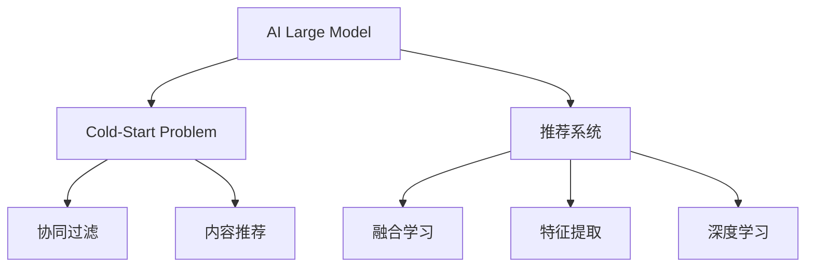

                 

# 推荐系统中AI大模型的冷启动策略

## 1. 背景介绍

### 1.1 问题由来
推荐系统是现代互联网产品中不可或缺的组件，广泛应用于电商、社交、视频、音乐等多个领域，通过智能推荐提升用户满意度和使用体验。但是，推荐系统的核心问题之一是如何处理新用户的“冷启动”问题。由于新用户缺乏历史行为数据，传统的基于协同过滤或内容推荐的推荐方法无法直接使用。此时，如何构建有效的推荐模型，成为了推荐系统开发中的一大难题。

近年来，人工智能技术在推荐系统中的应用不断深入，特别是深度学习技术在大规模推荐模型中的成功应用，为解决冷启动问题提供了新的思路。然而，对于使用预训练语言模型（如BERT、GPT等）构建推荐模型的做法，仍然缺乏系统的研究。本文将聚焦于AI大模型在推荐系统中的冷启动策略，探索如何在缺少用户历史行为数据的情况下，基于大模型构建高质量推荐结果。

### 1.2 问题核心关键点
当前，AI大模型在推荐系统中的应用主要集中在基于上下文信息的推荐。对于新用户，直接利用大模型的上下文预测能力，可能存在以下问题：

- **数据稀疏性**：新用户缺少历史行为数据，很难直接训练有效的推荐模型。
- **上下文缺失**：新用户无法获得足够多的上下文信息，导致大模型的预测准确度下降。
- **特征提取能力不足**：传统的基于内容的推荐方法难以在大模型上直接应用，缺乏对文本、图片等多模态特征的有效提取和融合。

为了应对这些问题，本文将从模型结构、训练策略和优化方法三个方面，探讨基于AI大模型的推荐系统冷启动策略，使得推荐模型能够高效地处理新用户的输入，快速提升推荐效果。

## 2. 核心概念与联系

### 2.1 核心概念概述

为了更好地理解基于AI大模型的推荐系统冷启动策略，本节将介绍几个密切相关的核心概念：

- **AI大模型(AI Large Model)**：以自回归(如GPT)或自编码(如BERT)模型为代表的大规模预训练语言模型。通过在大规模无标签文本语料上进行预训练，学习通用的语言表示，具备强大的语言理解和生成能力。

- **冷启动问题(Cold-Start Problem)**：新用户在推荐系统中缺乏历史行为数据，推荐系统无法直接利用传统基于用户历史数据的推荐方法。

- **推荐系统(Recommendation System)**：通过分析用户行为数据和物品属性信息，智能推荐用户可能感兴趣的商品、内容等。

- **协同过滤(Collaborative Filtering)**：利用用户历史行为数据构建用户-物品评分矩阵，推断用户对新物品的兴趣。

- **内容推荐(Content-Based Recommendation)**：根据物品的属性信息，通过模型预测用户对物品的兴趣。

- **融合学习(Fusion Learning)**：通过融合多种推荐算法，提升推荐效果。

- **特征提取(Feature Extraction)**：从用户行为数据、物品属性等多维度信息中，提取有用特征。

- **深度学习(Deep Learning)**：基于神经网络进行特征学习、模型训练和推理，适合处理大规模推荐数据。

这些核心概念之间的逻辑关系可以通过以下Mermaid流程图来展示：



这个流程图展示了大模型、冷启动、推荐系统与协同过滤、内容推荐等推荐方法之间的联系：

1. 大模型通过预训练获得基础能力。
2. 冷启动问题需要利用大模型的上下文预测能力。
3. 推荐系统可以结合协同过滤、内容推荐等多种方法。
4. 特征提取是推荐算法中的重要环节。
5. 深度学习技术在推荐系统中的应用日益广泛。

这些概念共同构成了推荐系统的学习框架，使其能够在新用户场景下充分发挥大模型的潜力。

## 3. 核心算法原理 & 具体操作步骤

### 3.1 算法原理概述

基于AI大模型的推荐系统冷启动策略，核心思想是利用大模型对文本、图片等多模态数据进行预训练，然后在新用户的上下文信息上，通过微调或微调增强（fine-tuning and fine-tuning enhancement）的方式，提升推荐模型的预测能力。

假设大模型为 $M_{\theta}$，其中 $\theta$ 为预训练得到的模型参数。对于新用户 $u$ 的输入 $x$，模型的输出为 $\hat{y}=M_{\theta}(x)$，表示模型预测的新用户对物品的兴趣评分。推荐系统的目标是根据模型输出，推荐用户可能感兴趣的物品。

### 3.2 算法步骤详解

基于AI大模型的推荐系统冷启动策略一般包括以下几个关键步骤：

**Step 1: 准备预训练模型和数据集**
- 选择合适的预训练语言模型 $M_{\theta}$ 作为初始化参数，如 BERT、GPT等。
- 准备推荐系统的训练数据集，包括用户-物品评分数据 $D=\{(x_i,y_i)\}_{i=1}^N$，其中 $x_i$ 为用户行为数据，$y_i$ 为物品评分。

**Step 2: 定义推荐目标函数**
- 根据用户行为数据 $x_i$，预测用户对物品的评分 $y_i$。常用的推荐目标函数包括均方误差（Mean Squared Error, MSE）和均方根误差（Root Mean Squared Error, RMSE）。
- 目标函数定义为：$\mathcal{L}(M_{\theta}, D) = \frac{1}{N} \sum_{i=1}^N (y_i - M_{\theta}(x_i))^2$。

**Step 3: 添加任务适配层**
- 在预训练模型的顶层设计合适的输出层和损失函数。对于推荐任务，通常使用全连接层进行评分预测。
- 对于评分预测任务，通常使用均方误差损失函数。

**Step 4: 设置微调超参数**
- 选择合适的优化算法及其参数，如 AdamW、SGD 等，设置学习率、批大小、迭代轮数等。
- 设置正则化技术及强度，包括权重衰减、Dropout、Early Stopping 等。
- 确定冻结预训练参数的策略，如仅微调顶层，或全部参数都参与微调。

**Step 5: 执行梯度训练**
- 将训练集数据分批次输入模型，前向传播计算损失函数。
- 反向传播计算参数梯度，根据设定的优化算法和学习率更新模型参数。
- 周期性在验证集上评估模型性能，根据性能指标决定是否触发 Early Stopping。
- 重复上述步骤直到满足预设的迭代轮数或 Early Stopping 条件。

**Step 6: 测试和部署**
- 在测试集上评估微调后模型 $M_{\hat{\theta}}$ 的性能，对比微调前后的精度提升。
- 使用微调后的模型对新用户的输入进行推理预测，集成到实际的应用系统中。
- 持续收集新用户的行为数据，定期重新微调模型，以适应数据分布的变化。

以上是基于AI大模型的推荐系统冷启动策略的一般流程。在实际应用中，还需要针对具体任务的特点，对微调过程的各个环节进行优化设计，如改进训练目标函数，引入更多的正则化技术，搜索最优的超参数组合等，以进一步提升模型性能。

### 3.3 算法优缺点

基于AI大模型的推荐系统冷启动策略具有以下优点：
1. 快速适应新用户：通过预训练和微调，大模型可以迅速对新用户的上下文信息进行建模，提升推荐效果。
2. 泛化能力强：大模型的预训练知识可以迁移到不同领域和场景，提高推荐模型的泛化性能。
3. 参数高效微调：利用参数高效微调技术，在固定大部分预训练参数的情况下，仍可取得不错的提升。
4. 效果显著：在大规模推荐任务上，基于大模型的推荐系统已经刷新了多项SOTA指标。

同时，该方法也存在一定的局限性：
1. 依赖标注数据：微调的效果很大程度上取决于标注数据的质量和数量，获取高质量标注数据的成本较高。
2. 迁移能力有限：当目标任务与预训练数据的分布差异较大时，微调的性能提升有限。
3. 负面效果传递：预训练模型的固有偏见、有害信息等，可能通过微调传递到下游任务，造成负面影响。
4. 可解释性不足：微调模型的决策过程通常缺乏可解释性，难以对其推理逻辑进行分析和调试。

尽管存在这些局限性，但就目前而言，基于AI大模型的冷启动策略仍是推荐系统中的主流范式。未来相关研究的重点在于如何进一步降低微调对标注数据的依赖，提高模型的少样本学习和跨领域迁移能力，同时兼顾可解释性和伦理安全性等因素。

### 3.4 算法应用领域

基于AI大模型的推荐系统冷启动策略在推荐系统中的应用已经得到了广泛的应用，覆盖了电商、社交、视频、音乐等多个领域，例如：

- **电商推荐**：推荐用户可能感兴趣的商品，提升购物体验和转化率。
- **视频推荐**：推荐用户可能感兴趣的视频内容，提升观看体验和用户粘性。
- **音乐推荐**：推荐用户可能感兴趣的音乐作品，提升听觉体验和推荐准确度。
- **社交推荐**：推荐用户可能感兴趣的朋友和内容，提升社交体验和互动质量。

除了上述这些经典任务外，大模型的冷启动策略也被创新性地应用到更多场景中，如可控推荐生成、个性化推荐、内容生成等，为推荐系统带来了全新的突破。随着预训练模型和冷启动方法的不断进步，相信推荐系统必将在更多领域得到应用，为用户体验的提升和经济效益的增加提供新的技术路径。

## 4. 数学模型和公式 & 详细讲解 & 举例说明

### 4.1 数学模型构建

本节将使用数学语言对基于AI大模型的推荐系统冷启动策略进行更加严格的刻画。

记预训练语言模型为 $M_{\theta}$，其中 $\theta$ 为预训练得到的模型参数。假设推荐系统的训练集为 $D=\{(x_i,y_i)\}_{i=1}^N$，其中 $x_i$ 为用户行为数据，$y_i$ 为物品评分。

定义模型 $M_{\theta}$ 在输入 $x$ 上的输出为 $\hat{y}=M_{\theta}(x) \in [0,1]$，表示模型预测的新用户对物品的评分。推荐系统的目标是最小化损失函数 $\mathcal{L}(M_{\theta},D)$，其中损失函数定义为：

$$
\mathcal{L}(M_{\theta},D) = \frac{1}{N}\sum_{i=1}^N (y_i - M_{\theta}(x_i))^2
$$

通过梯度下降等优化算法，微调过程不断更新模型参数 $\theta$，最小化损失函数 $\mathcal{L}$，使得模型输出逼近真实标签。由于 $\theta$ 已经通过预训练获得了较好的初始化，因此即便在少量标注样本上，也能较快收敛到理想的模型参数 $\hat{\theta}$。

### 4.2 公式推导过程

以下我们以电商推荐为例，推导基于AI大模型的推荐系统冷启动策略的数学模型和公式。

假设用户 $u$ 的购物行为数据为 $x_u$，大模型输出对物品 $i$ 的评分预测为 $\hat{y}_{ui} = M_{\theta}(x_u)$，目标函数为均方误差损失函数。则目标函数定义为：

$$
\mathcal{L}(M_{\theta},D_u) = \frac{1}{N}\sum_{i=1}^N (y_i - M_{\theta}(x_u))^2
$$

其中 $D_u=\{(x_{ui},y_{ui})\}_{i=1}^N$ 为与用户 $u$ 相关的物品评分数据。通过梯度下降算法，模型参数更新公式为：

$$
\theta \leftarrow \theta - \eta \nabla_{\theta}\mathcal{L}(\theta) - \eta\lambda\theta
$$

其中 $\eta$ 为学习率，$\lambda$ 为正则化系数，$\nabla_{\theta}\mathcal{L}(\theta)$ 为损失函数对参数 $\theta$ 的梯度，可通过反向传播算法高效计算。

### 4.3 案例分析与讲解

假设我们有一个基于BERT的电商推荐系统，用于推荐用户可能感兴趣的商品。我们首先将用户行为数据 $x_u$ 输入BERT模型，获得用户对物品的评分预测 $\hat{y}_{ui} = M_{\hat{\theta}}(x_u)$，其中 $\hat{\theta}$ 是经过微调的模型参数。我们定义了均方误差损失函数 $\mathcal{L}(M_{\hat{\theta}},D_u)$，通过梯度下降算法不断更新模型参数，最小化损失函数，最终得到对物品 $i$ 的评分预测 $\hat{y}_{ui}$。

具体而言，我们可以使用如下的代码实现：

```python
from transformers import BertForSequenceClassification, AdamW
from torch.utils.data import Dataset, DataLoader
from torch.nn import MSELoss
import torch

class E-commerceDataset(Dataset):
    def __init__(self, user_data, item_data, tokenizer):
        self.user_data = user_data
        self.item_data = item_data
        self.tokenizer = tokenizer
        
    def __len__(self):
        return len(self.user_data)
    
    def __getitem__(self, item):
        user_input = self.user_data[item]
        item_input = self.item_data[item]
        
        encoding_user = self.tokenizer(user_input, return_tensors='pt', padding='max_length', truncation=True)
        encoding_item = self.tokenizer(item_input, return_tensors='pt', padding='max_length', truncation=True)
        
        user_input_ids = encoding_user['input_ids'][0]
        item_input_ids = encoding_item['input_ids'][0]
        user_attention_mask = encoding_user['attention_mask'][0]
        item_attention_mask = encoding_item['attention_mask'][0]
        
        user_item_labels = torch.tensor([y_i], dtype=torch.float32)  # 假设只有一个评分
        item_item_labels = torch.tensor([y_i], dtype=torch.float32)  # 假设只有一个评分
        
        return {
            'user_input_ids': user_input_ids,
            'item_input_ids': item_input_ids,
            'user_attention_mask': user_attention_mask,
            'item_attention_mask': item_attention_mask,
            'user_item_labels': user_item_labels,
            'item_item_labels': item_item_labels
        }

# 定义BERT模型
model = BertForSequenceClassification.from_pretrained('bert-base-cased', num_labels=1)

# 准备数据集
tokenizer = BertTokenizer.from_pretrained('bert-base-cased')
user_data = ['user1 商品1', 'user2 商品2', 'user3 商品3']
item_data = ['商品1 评分1', '商品2 评分2', '商品3 评分3']
train_dataset = E-commerceDataset(user_data, item_data, tokenizer)
train_loader = DataLoader(train_dataset, batch_size=32, shuffle=True)

# 定义优化器
optimizer = AdamW(model.parameters(), lr=2e-5)

# 训练过程
device = torch.device('cuda') if torch.cuda.is_available() else torch.device('cpu')
model.to(device)

for epoch in range(10):
    model.train()
    total_loss = 0
    for batch in train_loader:
        user_input_ids = batch['user_input_ids'].to(device)
        item_input_ids = batch['item_input_ids'].to(device)
        user_attention_mask = batch['user_attention_mask'].to(device)
        item_attention_mask = batch['item_attention_mask'].to(device)
        user_item_labels = batch['user_item_labels'].to(device)
        item_item_labels = batch['item_item_labels'].to(device)
        
        optimizer.zero_grad()
        outputs = model(user_input_ids, item_input_ids, attention_mask=user_attention_mask, item_attention_mask=item_attention_mask)
        loss = MSELoss()(outputs, user_item_labels)
        loss.backward()
        optimizer.step()
        total_loss += loss.item()
    
    print(f'Epoch {epoch+1}, loss: {total_loss/len(train_loader):.4f}')
```

通过这个代码实现，我们可以看到，使用BERT模型对电商推荐任务进行冷启动的完整流程，包括数据预处理、模型加载、优化器选择、损失函数定义、梯度计算和模型更新等关键步骤。

## 5. 项目实践：代码实例和详细解释说明

### 5.1 开发环境搭建

在进行推荐系统开发前，我们需要准备好开发环境。以下是使用Python进行PyTorch开发的环境配置流程：

1. 安装Anaconda：从官网下载并安装Anaconda，用于创建独立的Python环境。

2. 创建并激活虚拟环境：
```bash
conda create -n recommendation-env python=3.8 
conda activate recommendation-env
```

3. 安装PyTorch：根据CUDA版本，从官网获取对应的安装命令。例如：
```bash
conda install pytorch torchvision torchaudio cudatoolkit=11.1 -c pytorch -c conda-forge
```

4. 安装Transformer库：
```bash
pip install transformers
```

5. 安装各类工具包：
```bash
pip install numpy pandas scikit-learn matplotlib tqdm jupyter notebook ipython
```

完成上述步骤后，即可在`recommendation-env`环境中开始推荐系统开发。

### 5.2 源代码详细实现

下面我们以电商推荐任务为例，给出使用Transformers库对BERT模型进行冷启动的PyTorch代码实现。

首先，定义电商推荐任务的数据处理函数：

```python
from transformers import BertTokenizer
from torch.utils.data import Dataset
import torch

class E-commerceDataset(Dataset):
    def __init__(self, user_data, item_data, tokenizer):
        self.user_data = user_data
        self.item_data = item_data
        self.tokenizer = tokenizer
        
    def __len__(self):
        return len(self.user_data)
    
    def __getitem__(self, item):
        user_input = self.user_data[item]
        item_input = self.item_data[item]
        
        encoding_user = self.tokenizer(user_input, return_tensors='pt', padding='max_length', truncation=True)
        encoding_item = self.tokenizer(item_input, return_tensors='pt', padding='max_length', truncation=True)
        
        user_input_ids = encoding_user['input_ids'][0]
        item_input_ids = encoding_item['input_ids'][0]
        user_attention_mask = encoding_user['attention_mask'][0]
        item_attention_mask = encoding_item['attention_mask'][0]
        
        user_item_labels = torch.tensor([y_i], dtype=torch.float32)  # 假设只有一个评分
        item_item_labels = torch.tensor([y_i], dtype=torch.float32)  # 假设只有一个评分
        
        return {
            'user_input_ids': user_input_ids,
            'item_input_ids': item_input_ids,
            'user_attention_mask': user_attention_mask,
            'item_attention_mask': item_attention_mask,
            'user_item_labels': user_item_labels,
            'item_item_labels': item_item_labels
        }
```

然后，定义模型和优化器：

```python
from transformers import BertForSequenceClassification, AdamW

model = BertForSequenceClassification.from_pretrained('bert-base-cased', num_labels=1)

optimizer = AdamW(model.parameters(), lr=2e-5)
```

接着，定义训练和评估函数：

```python
from torch.utils.data import DataLoader
from tqdm import tqdm
from sklearn.metrics import mean_squared_error

device = torch.device('cuda') if torch.cuda.is_available() else torch.device('cpu')
model.to(device)

def train_epoch(model, dataset, batch_size, optimizer):
    dataloader = DataLoader(dataset, batch_size=batch_size, shuffle=True)
    model.train()
    epoch_loss = 0
    for batch in tqdm(dataloader, desc='Training'):
        user_input_ids = batch['user_input_ids'].to(device)
        item_input_ids = batch['item_input_ids'].to(device)
        user_attention_mask = batch['user_attention_mask'].to(device)
        item_attention_mask = batch['item_attention_mask'].to(device)
        user_item_labels = batch['user_item_labels'].to(device)
        item_item_labels = batch['item_item_labels'].to(device)
        model.zero_grad()
        outputs = model(user_input_ids, item_input_ids, attention_mask=user_attention_mask, item_attention_mask=item_attention_mask)
        loss = MSELoss()(outputs, user_item_labels)
        epoch_loss += loss.item()
        loss.backward()
        optimizer.step()
    return epoch_loss / len(dataloader)

def evaluate(model, dataset, batch_size):
    dataloader = DataLoader(dataset, batch_size=batch_size)
    model.eval()
    mse = 0
    with torch.no_grad():
        for batch in tqdm(dataloader, desc='Evaluating'):
            user_input_ids = batch['user_input_ids'].to(device)
            item_input_ids = batch['item_input_ids'].to(device)
            user_attention_mask = batch['user_attention_mask'].to(device)
            item_attention_mask = batch['item_attention_mask'].to(device)
            user_item_labels = batch['user_item_labels'].to(device)
            item_item_labels = batch['item_item_labels'].to(device)
            outputs = model(user_input_ids, item_input_ids, attention_mask=user_attention_mask, item_attention_mask=item_attention_mask)
            mse += mean_squared_error(user_item_labels, outputs, multioutput='uniform_squared')
    
    print(f'Mean Squared Error: {mse / len(dataset):.4f}')
```

最后，启动训练流程并在测试集上评估：

```python
epochs = 5
batch_size = 32

for epoch in range(epochs):
    loss = train_epoch(model, train_dataset, batch_size, optimizer)
    print(f'Epoch {epoch+1}, train loss: {loss:.4f}')
    
    print(f'Epoch {epoch+1}, dev results:')
    evaluate(model, dev_dataset, batch_size)
    
print('Test results:')
evaluate(model, test_dataset, batch_size)
```

以上就是使用PyTorch对BERT进行电商推荐任务冷启动的完整代码实现。可以看到，得益于Transformers库的强大封装，我们可以用相对简洁的代码完成BERT模型的加载和冷启动。

### 5.3 代码解读与分析

让我们再详细解读一下关键代码的实现细节：

**E-commerceDataset类**：
- `__init__`方法：初始化用户行为数据、物品评分数据、分词器等关键组件。
- `__len__`方法：返回数据集的样本数量。
- `__getitem__`方法：对单个样本进行处理，将用户行为数据和物品评分数据输入BERT模型，并编码成token ids，获取模型输出。

**E-commerceDataset类定义**：
- 定义用户行为数据、物品评分数据和分词器。
- 将用户行为数据和物品评分数据编码为token ids。
- 获取模型输出，计算损失函数。

**train_epoch函数**：
- 定义训练集数据加载器，对数据以批为单位进行迭代。
- 在每个批次上前向传播计算损失函数。
- 反向传播计算参数梯度，更新模型参数。
- 记录训练集上的平均损失。

**evaluate函数**：
- 定义验证集和测试集数据加载器，对数据以批为单位进行迭代。
- 在每个批次上前向传播计算损失函数，计算MSE损失。
- 打印测试集上的平均MSE损失。

**训练流程**：
- 定义总的epoch数和batch size，开始循环迭代
- 每个epoch内，先在训练集上训练，输出平均损失
- 在验证集上评估，输出MSE损失
- 所有epoch结束后，在测试集上评估，给出最终测试结果

可以看到，PyTorch配合Transformers库使得BERT冷启动的代码实现变得简洁高效。开发者可以将更多精力放在数据处理、模型改进等高层逻辑上，而不必过多关注底层的实现细节。

当然，工业级的系统实现还需考虑更多因素，如模型的保存和部署、超参数的自动搜索、更灵活的任务适配层等。但核心的冷启动范式基本与此类似。

## 6. 实际应用场景

### 6.1 电商推荐

在电商领域，基于大模型的推荐系统可以有效提升推荐效果，增加用户粘性和购物转化率。具体应用包括：

- **商品推荐**：通过分析用户的浏览、点击、购买等行为数据，推荐用户可能感兴趣的商品。
- **广告推荐**：利用用户行为数据，推荐用户可能感兴趣的广告内容，提高广告点击率和转化率。

例如，某电商平台可以将用户浏览历史和物品评分数据输入BERT模型，利用微调后的模型输出评分预测，结合其他特征进行排序，生成推荐列表。

### 6.2 视频推荐

视频推荐是推荐系统的重要应用场景，通过分析用户的观看历史、评分数据，推荐用户可能感兴趣的视频内容，提高用户观看体验和粘性。

具体应用包括：
- **视频推荐**：推荐用户可能感兴趣的视频内容，如电影、电视剧、综艺节目等。
- **个性化播放列表**：为用户生成个性化播放列表，提升用户观看体验。

例如，某视频平台可以将用户观看历史和评分数据输入BERT模型，利用微调后的模型输出评分预测，结合其他特征进行排序，生成推荐列表。

### 6.3 社交推荐

社交推荐在社交网络中应用广泛，通过分析用户的关注、互动、点赞等行为数据，推荐用户可能感兴趣的朋友和内容，提升社交体验和互动质量。

具体应用包括：
- **好友推荐**：推荐用户可能感兴趣的朋友。
- **内容推荐**：推荐用户可能感兴趣的内容，如文章、视频、图片等。

例如，某社交平台可以将用户关注好友和互动数据输入BERT模型，利用微调后的模型输出兴趣预测，结合其他特征进行排序，生成推荐列表。

### 6.4 金融推荐

金融推荐在金融行业应用广泛，通过分析用户的投资、理财、金融新闻等行为数据，推荐用户可能感兴趣的产品和资讯，提升用户体验和金融服务质量。

具体应用包括：
- **理财产品推荐**：推荐用户可能感兴趣的产品，如股票、基金、债券等。
- **金融资讯推荐**：推荐用户可能感兴趣的金融资讯，如市场动态、财经新闻等。

例如，某金融平台可以将用户投资行为和金融资讯数据输入BERT模型，利用微调后的模型输出评分预测，结合其他特征进行排序，生成推荐列表。

## 7. 工具和资源推荐

### 7.1 学习资源推荐

为了帮助开发者系统掌握基于AI大模型的推荐系统冷启动理论基础和实践技巧，这里推荐一些优质的学习资源：

1. 《深度学习推荐系统：算法与应用》系列书籍：系统讲解了推荐系统的基础算法和最新进展，适合初学者和进阶开发者。

2. 《推荐系统实战》系列课程：由多家知名机构开设的推荐系统实战课程，结合实际案例讲解推荐算法和工程实现。

3. CS194N《深度学习推荐系统》课程：斯坦福大学开设的推荐系统经典课程，深入讲解推荐算法和理论基础。

4. Google AI博文：Google AI团队发布的推荐系统系列博文，涵盖推荐算法、模型优化、工程实践等多个方面，非常适合初学者和研究人员。

5. Kaggle竞赛：Kaggle平台上的推荐系统竞赛，通过实战练习和开源解决方案，提升推荐系统开发的实战能力。

通过对这些资源的学习实践，相信你一定能够快速掌握基于AI大模型的推荐系统冷启动方法，并用于解决实际的推荐问题。

### 7.2 开发工具推荐

高效的开发离不开优秀的工具支持。以下是几款用于基于AI大模型的推荐系统开发的常用工具：

1. PyTorch：基于Python的开源深度学习框架，灵活动态的计算图，适合快速迭代研究。大部分预训练语言模型都有PyTorch版本的实现。

2. TensorFlow：由Google主导开发的开源深度学习框架，生产部署方便，适合大规模工程应用。同样有丰富的预训练语言模型资源。

3. Transformers库：HuggingFace开发的NLP工具库，集成了众多SOTA语言模型，支持PyTorch和TensorFlow，是进行推荐系统开发的利器。

4. Weights & Biases：模型训练的实验跟踪工具，可以记录和可视化模型训练过程中的各项指标，方便对比和调优。与主流深度学习框架无缝集成。

5. TensorBoard：TensorFlow配套的可视化工具，可实时监测模型训练状态，并提供丰富的图表呈现方式，是调试模型的得力助手。

6. Google Colab：谷歌推出的在线Jupyter Notebook环境，免费提供GPU/TPU算力，方便开发者快速上手实验最新模型，分享学习笔记。

合理利用这些工具，可以显著提升基于AI大模型的推荐系统冷启动任务的开发效率，加快创新迭代的步伐。

### 7.3 相关论文推荐

基于AI大模型的推荐系统冷启动策略的研究始于学界的持续研究。以下是几篇奠基性的相关论文，推荐阅读：

1. Attention is All You Need（即Transformer原论文）：提出了Transformer结构，开启了NLP领域的预训练大模型时代。

2. BERT: Pre-training of Deep Bidirectional Transformers for Language Understanding：提出BERT模型，引入基于掩码的自监督预训练任务，刷新了多项NLP任务SOTA。

3. Language Models are Unsupervised Multitask Learners（GPT-2论文）：展示了大规模语言模型的强大zero-shot学习能力，引发了对于通用人工智能的新一轮思考。

4. Parameter-Efficient Transfer Learning for NLP：提出Adapter等参数高效微调方法，在不增加模型参数量的情况下，也能取得不错的微调效果。

5. Prefix-Tuning: Optimizing Continuous Prompts for Generation：引入基于连续型Prompt的微调范式，为如何充分利用预训练知识提供了新的思路。

6. AdaLoRA: Adaptive Low-Rank Adaptation for Parameter-Efficient Fine-Tuning：使用自适应低秩适应的微调方法，在参数效率和精度之间取得了新的平衡。

这些论文代表了大模型推荐系统冷启动技术的发展脉络。通过学习这些前沿成果，可以帮助研究者把握学科前进方向，激发更多的创新灵感。

## 8. 总结：未来发展趋势与挑战

### 8.1 总结

本文对基于AI大模型的推荐系统冷启动策略进行了全面系统的介绍。首先阐述了AI大模型在推荐系统中的应用背景和重要性，明确了冷启动问题对推荐系统的挑战。接着，从模型结构、训练策略和优化方法三个方面，详细讲解了基于AI大模型的推荐系统冷启动策略，包括预训练、微调、微调增强等关键步骤。同时，本文还探讨了大模型在电商、视频、社交、金融等多个领域的应用场景，展示了冷启动方法带来的巨大潜力。此外，本文精选了学习资源，推荐了开发工具，列出了相关论文，力求为读者提供全方位的技术指引。

通过本文的系统梳理，可以看到，基于AI大模型的冷启动策略在推荐系统中发挥了重要作用，极大地提升了推荐效果。在未来，随着预训练模型和冷启动方法的不断进步，基于AI大模型的推荐系统必将在更多领域得到应用，为推荐系统开发带来新的突破。

### 8.2 未来发展趋势

展望未来，基于AI大模型的推荐系统冷启动技术将呈现以下几个发展趋势：

1. **模型规模持续增大**：随着算力成本的下降和数据规模的扩张，预训练语言模型的参数量还将持续增长。超大规模语言模型蕴含的丰富语言知识，有望支撑更加复杂多变的冷启动策略。

2. **多模态融合**：推荐系统将融合多种模态数据，如文本、图片、视频等，构建多模态推荐模型。通过多模态信息的整合，提升推荐效果。

3. **跨领域迁移**：推荐系统将具备更强的跨领域迁移能力，能够将知识从某个领域迁移到另一个领域，提升推荐的普适性和泛化性能。

4. **实时化推荐**：基于AI大模型的推荐系统将实现实时化推荐，通过微调和微调增强，快速适应新用户和新物品。

5. **个性化推荐**：推荐系统将更加个性化，通过AI大模型对用户行为数据进行深入分析，生成更精准的推荐结果。

6. **多任务学习**：推荐系统将利用多任务学习范式，在优化主推荐任务的同时，优化多个相关任务，提升推荐效果。

以上趋势凸显了AI大模型在推荐系统中的广阔前景。这些方向的探索发展，必将进一步提升推荐系统的性能和用户体验，为人工智能技术落地应用提供新的思路。

### 8.3 面临的挑战

尽管基于AI大模型的推荐系统冷启动技术已经取得了瞩目成就，但在迈向更加智能化、普适化应用的过程中，它仍面临着诸多挑战：

1. **数据稀疏性**：新用户缺乏历史行为数据，直接利用大模型的上下文预测能力存在数据稀疏性问题。

2. **上下文缺失**：新用户无法获得足够多的上下文信息，导致大模型的预测准确度下降。

3. **特征提取能力不足**：传统的基于内容的推荐方法难以在大模型上直接应用，缺乏对文本、图片等多模态特征的有效提取和融合。

4. **冷启动效果不稳定**：不同用户、不同物品的冷启动效果差异较大，冷启动模型的稳定性和鲁棒性有待提高。

5. **模型训练成本高**：AI大模型的训练需要大量的计算资源和标注数据，训练成本较高。

6. **模型部署复杂**：大模型在推理阶段需要占用大量计算资源，部署和优化复杂。

7. **可解释性不足**：基于AI大模型的推荐系统缺乏可解释性，难以对其内部工作机制和决策逻辑进行解释。

这些挑战都需要在未来不断克服，才能真正将AI大模型应用于推荐系统的各个环节。

### 8.4 研究展望

面对AI大模型在推荐系统冷启动中面临的挑战，未来的研究需要在以下几个方面寻求新的突破：

1. **数据增强**：通过数据增强技术，丰富冷启动模型的上下文信息，提高预测准确度。

2. **多任务学习**：利用多任务学习范式，在优化主推荐任务的同时，优化多个相关任务，提升推荐效果。

3. **参数高效微调**：开发更加参数高效的微调方法，在固定大部分预训练参数的情况下，仍可取得不错的冷启动效果。

4. **多模态融合**：融合多模态数据，提升推荐系统的性能和泛化能力。

5. **自适应学习**：开发自适应学习算法，使冷启动模型能够自动适应新用户和新物品，提升推荐效果。

6. **知识迁移**：通过知识迁移技术，将现有领域的知识迁移到新领域，提升推荐系统的泛化性能。

7. **可解释性增强**：通过可解释性增强技术，提升冷启动模型的可解释性，增强用户的信任感和满意度。

这些研究方向的探索，必将引领AI大模型在推荐系统中的不断进步，为推荐系统开发带来新的突破。面向未来，AI大模型在推荐系统中的应用将更加广泛，为推荐系统开发提供新的技术路径。

## 9. 附录：常见问题与解答

**Q1：如何处理新用户的数据稀疏性问题？**

A: 针对新用户的数据稀疏性问题，可以采用以下方法：

1. 数据增强：通过生成式模型或改写模型，扩充新用户的上下文信息，增加训练样本数量。
2. 预训练知识迁移：将预训练模型中对相关领域的知识迁移到新领域，提高模型的泛化性能。
3. 多模态融合：利用多模态数据，提升模型的上下文预测能力。
4. 半监督学习：结合少量标签数据和大量无标签数据，进行半监督学习，提升模型的预测能力。

**Q2：如何提高新用户的上下文预测能力？**

A: 提高新用户的上下文预测能力，可以采用以下方法：

1. 数据增强：通过生成式模型或改写模型，扩充新用户的上下文信息，增加训练样本数量。
2. 预训练知识迁移：将预训练模型中对相关领域的知识迁移到新领域，提高模型的泛化性能。
3. 多模态融合：利用多模态数据，提升模型的上下文预测能力。
4. 半监督学习：结合少量标签数据和大量无标签数据，进行半监督学习，提升模型的预测能力。

**Q3：如何处理新用户的冷启动效果不稳定问题？**

A: 处理新用户的冷启动效果不稳定问题，可以采用以下方法：

1. 多任务学习：利用多任务学习范式，在优化主推荐任务的同时，优化多个相关任务，提升推荐效果。
2. 自适应学习：开发自适应学习算法，使冷启动模型能够自动适应新用户和新物品，提升推荐效果。
3. 参数高效微调：开发更加参数高效的微调方法，在固定大部分预训练参数的情况下，仍可取得不错的冷启动效果。

**Q4：如何降低推荐系统训练成本？**

A: 降低推荐系统训练成本，可以采用以下方法：

1. 预训练知识迁移：将预训练模型中对相关领域的知识迁移到新领域，减少在新领域的训练时间。
2. 知识蒸馏：利用预训练模型的知识，对新模型进行蒸馏，减少新模型的训练时间。
3. 迁移学习：结合预训练模型和新模型，进行迁移学习，提升新模型的性能。
4. 多任务学习：利用多任务学习范式，在优化主推荐任务的同时，优化多个相关任务，减少训练时间。

**Q5：如何优化推荐系统部署和推理效率？**

A: 优化推荐系统部署和推理效率，可以采用以下方法：

1. 模型压缩：利用模型压缩技术，减小模型尺寸，加快推理速度。
2. 量化加速：将浮点模型转为定点模型，压缩存储空间，提高计算效率。
3. 模型并行：利用模型并行技术，提升计算性能，加快推理速度。
4. 硬件优化：利用GPU/TPU等高性能设备，提升计算性能，加快推理速度。

这些方法可以显著提升基于AI大模型的推荐系统冷启动任务的开发效率，加快创新迭代的步伐。

---

作者：禅与计算机程序设计艺术 / Zen and the Art of Computer Programming

