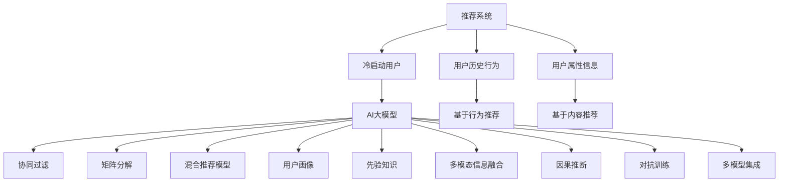

                 

# 推荐系统中AI大模型的冷启动策略

> 关键词：推荐系统, 冷启动, 人工智能大模型, 用户画像, 协同过滤, 矩阵分解, 混合模型, 学习曲线, 用户行为预测

## 1. 背景介绍

### 1.1 问题由来
在推荐系统领域，冷启动问题指的是新用户或新物品在系统中几乎没有行为数据，导致难以对其进行准确推荐。这是一个普遍存在且难以解决的问题，尤其是在用户数量庞大、物品种类繁多的电商平台上，冷启动用户的推荐难度尤其高。

为了应对冷启动问题，推荐系统从业者尝试了多种策略，如基于人口统计学特征的推荐、基于内容的推荐、基于协同过滤的推荐等。然而，这些方法往往依赖于用户历史行为数据，无法有效地处理冷启动用户的推荐。

近年来，随着深度学习和大规模预训练语言模型的兴起，AI大模型如BERT、GPT-3等在自然语言处理领域取得了显著进展，开始被应用于推荐系统，以期提升冷启动用户推荐的效果。但在大模型应用中，冷启动问题依然突出，尤其是如何高效利用大模型的语言理解能力，处理大量未知用户的行为预测，成为亟待解决的问题。

### 1.2 问题核心关键点
针对冷启动用户，AI大模型可以通过以下方法提升推荐效果：
- 捕捉用户潜在兴趣：利用大模型对用户描述进行语义理解，从而推断用户的兴趣偏好。
- 利用先验知识：结合专家知识、知识图谱等信息源，提升推荐的多样性和准确性。
- 增强多模态信息融合：整合视觉、音频等多模态数据，提升推荐模型的泛化能力。
- 引入因果推断和对抗训练：通过引入因果推断和对抗训练技术，提升模型决策的鲁棒性和可解释性。
- 构建多模型集成系统：通过多个模型的联合推理，提升推荐的综合性能。

这些方法可以在不破坏预训练模型的基础上，结合目标任务的特点，进行微调或数据增强，从而提升模型在冷启动用户推荐场景中的表现。

## 2. 核心概念与联系

### 2.1 核心概念概述

为更好地理解AI大模型在推荐系统中的冷启动策略，本节将介绍几个密切相关的核心概念：

- 推荐系统(Recommender System)：利用用户历史行为数据或用户属性信息，为用户推荐合适物品的系统。
- 冷启动用户(Cold-Start User)：指系统中几乎没有行为数据的全新用户，难以直接推荐。
- AI大模型(AI Large Model)：以BERT、GPT-3等为代表的深度学习模型，具备强大的语言理解和生成能力。
- 协同过滤(Collaborative Filtering)：通过分析用户行为数据，寻找相似用户或相似物品进行推荐。
- 矩阵分解(Matrix Factorization)：将用户-物品评分矩阵分解为用户特征矩阵和物品特征矩阵，进行低秩矩阵分解。
- 混合推荐模型(Hybrid Recommender)：结合基于内容的推荐和协同过滤等多种推荐方式，提升推荐效果。
- 用户画像(User Profile)：根据用户历史行为和属性信息，构建用户个性化画像，用于推荐。
- 先验知识(Prior Knowledge)：结合领域知识、知识图谱等信息源，提升推荐的多样性和准确性。
- 多模态信息融合(Multimodal Information Fusion)：整合视觉、音频等多模态数据，提升推荐模型的泛化能力。
- 因果推断(Causal Inference)：通过引入因果推断方法，提升推荐模型决策的鲁棒性和可解释性。
- 对抗训练(Adversarial Training)：通过引入对抗样本，提高模型鲁棒性和泛化能力。
- 多模型集成(Multi-Model Ensemble)：通过多个模型的联合推理，提升推荐的综合性能。

这些核心概念之间的逻辑关系可以通过以下Mermaid流程图来展示：



这个流程图展示了几类推荐系统模型的关联与联系：

1. 推荐系统通过用户历史行为和属性信息，为用户提供物品推荐。
2. 冷启动用户缺乏行为数据，难以直接推荐。
3. AI大模型可以捕捉用户兴趣和行为，提升推荐效果。
4. 协同过滤、矩阵分解、混合推荐等方法，提升推荐的准确性和多样性。
5. 用户画像和先验知识，辅助提升推荐的个性化和多样性。
6. 多模态信息融合、因果推断、对抗训练、多模型集成等方法，进一步优化推荐系统性能。

## 3. 核心算法原理 & 具体操作步骤

### 3.1 算法原理概述

AI大模型在推荐系统中的应用，主要通过以下步骤实现：

1. **用户兴趣捕获**：利用大模型对用户描述进行语义理解，捕捉用户的潜在兴趣和行为偏好。
2. **先验知识融合**：结合专家知识、知识图谱等信息源，提升推荐的多样性和准确性。
3. **多模态信息融合**：整合视觉、音频等多模态数据，提升推荐模型的泛化能力。
4. **因果推断和对抗训练**：通过引入因果推断和对抗训练技术，提升模型决策的鲁棒性和可解释性。
5. **多模型集成**：通过多个模型的联合推理，提升推荐的综合性能。

这些步骤可以大致分为三个阶段：

1. **预处理和兴趣捕获**：将用户描述输入大模型，捕捉用户兴趣和行为偏好。
2. **信息融合和优化**：结合先验知识和多模态数据，对大模型进行优化。
3. **推理和集成**：使用优化后的大模型进行推理，结合多模型集成提升推荐性能。

### 3.2 算法步骤详解

#### 3.2.1 预处理和兴趣捕获

1. **用户描述预处理**：将用户描述转换为数字向量，以便大模型进行处理。
2. **用户兴趣捕捉**：利用大模型对用户描述进行语义理解，提取用户兴趣关键词。
3. **兴趣表示**：将提取的兴趣关键词转换为向量，作为用户兴趣表示。

具体实现步骤如下：

- **预处理**：使用自然语言处理工具（如BERT、GPT等）对用户描述进行分词、嵌入等预处理操作。
- **兴趣捕捉**：使用大模型对预处理后的描述进行语义理解，提取用户兴趣关键词。
- **兴趣表示**：将兴趣关键词转换为向量，作为用户兴趣表示。

#### 3.2.2 信息融合和优化

1. **先验知识融合**：将专家知识、知识图谱等信息源，与用户兴趣表示进行融合。
2. **多模态信息融合**：整合视觉、音频等多模态数据，提升推荐模型的泛化能力。
3. **优化和训练**：结合先验知识和多模态数据，对大模型进行优化训练。

具体实现步骤如下：

- **先验知识融合**：将领域知识、知识图谱等先验信息，与用户兴趣表示进行融合，生成新的用户表示。
- **多模态信息融合**：整合用户多模态数据（如图片、音频等），提升用户表示的丰富性。
- **优化和训练**：使用优化后的用户表示，对大模型进行优化训练，提升模型在推荐任务上的性能。

#### 3.2.3 推理和集成

1. **推理**：使用优化后的大模型对用户进行推荐，生成推荐列表。
2. **多模型集成**：结合多个模型的推理结果，提升推荐性能。

具体实现步骤如下：

- **推理**：使用优化后的大模型对用户进行推荐，生成推荐列表。
- **多模型集成**：结合多个模型的推理结果，生成最终的推荐列表。

### 3.3 算法优缺点

AI大模型在推荐系统中的应用具有以下优点：

1. **高效的兴趣捕捉**：利用大模型的语言理解能力，可以高效捕捉用户兴趣和行为偏好。
2. **丰富的多模态信息**：结合多模态数据，提升推荐模型的泛化能力和鲁棒性。
3. **鲁棒性和可解释性**：引入因果推断和对抗训练，提升模型的决策鲁棒性和可解释性。
4. **多样性和准确性**：结合先验知识和专家知识，提升推荐的多样性和准确性。
5. **可扩展性和灵活性**：基于大模型，可以方便地进行多模型集成，提升推荐系统的综合性能。

同时，该方法也存在一些缺点：

1. **数据需求量大**：虽然利用大模型可以处理多模态数据，但需要大量的标注数据进行训练和优化。
2. **计算成本高**：大模型训练和推理的计算成本较高，难以在资源受限的环境下进行。
3. **解释性不足**：大模型通常缺乏可解释性，难以理解其内部决策逻辑。
4. **泛化能力有限**：大模型的泛化能力可能受限于特定领域的语料和任务。

尽管存在这些局限性，但AI大模型在推荐系统中的应用，仍然为冷启动用户推荐提供了新的解决方案，具有广阔的应用前景。

### 3.4 算法应用领域

AI大模型在推荐系统中的应用，已经在游戏、电商、社交媒体等多个领域得到了广泛应用，具体如下：

1. **游戏推荐**：利用大模型捕捉用户游戏行为，生成个性化推荐，提升用户留存率。
2. **电商推荐**：结合用户多模态数据，利用大模型进行商品推荐，提升用户转化率和满意度。
3. **社交媒体推荐**：利用大模型分析用户行为数据，生成个性化内容推荐，提升用户粘性。
4. **视频推荐**：结合视频多模态数据，利用大模型进行视频推荐，提升用户观看体验。
5. **音乐推荐**：利用大模型分析用户音乐偏好，生成个性化音乐推荐，提升用户满意度。
6. **新闻推荐**：利用大模型分析用户兴趣，生成个性化新闻推荐，提升用户阅读体验。

除了上述这些常见应用外，AI大模型还可以用于更多场景中，如广告推荐、旅游推荐等，为推荐系统提供新的解决方案。

## 4. 数学模型和公式 & 详细讲解 & 举例说明

### 4.1 数学模型构建

在推荐系统中，AI大模型的应用主要涉及以下几个数学模型：

- **用户兴趣表示模型**：将用户描述转换为向量，用于捕捉用户兴趣和行为偏好。
- **多模态信息融合模型**：整合视觉、音频等多模态数据，提升推荐模型的泛化能力。
- **推荐模型**：结合先验知识和用户兴趣表示，生成推荐列表。

具体数学模型如下：

- **用户兴趣表示模型**：$x_u = f_u(x_d)$，其中 $x_u$ 为用户兴趣表示，$x_d$ 为用户描述，$f_u$ 为预处理和兴趣捕捉函数。
- **多模态信息融合模型**：$y_u = g_u(x_u, x_v, x_a)$，其中 $y_u$ 为用户表示，$x_v$ 为视觉数据，$x_a$ 为音频数据，$g_u$ 为多模态信息融合函数。
- **推荐模型**：$r_{i|u} = h(x_u, x_i, x_j)$，其中 $r_{i|u}$ 为用户对物品 $i$ 的评分，$x_u$ 为用户表示，$x_i$ 为物品表示，$x_j$ 为其他物品表示，$h$ 为推荐函数。

### 4.2 公式推导过程

下面以用户兴趣表示模型和推荐模型为例，推导具体的数学公式：

#### 4.2.1 用户兴趣表示模型

用户兴趣表示模型的构建步骤如下：

1. **用户描述预处理**：将用户描述 $x_d$ 转换为数字向量 $x_u$。
2. **兴趣捕捉**：利用大模型 $f_u$ 对用户描述进行语义理解，提取用户兴趣关键词。
3. **兴趣表示**：将提取的兴趣关键词转换为向量，作为用户兴趣表示。

具体的数学公式如下：

$$
x_u = f_u(x_d)
$$

其中 $f_u$ 为预处理和兴趣捕捉函数，可以通过深度学习模型（如BERT、GPT等）实现。

#### 4.2.2 推荐模型

推荐模型的构建步骤如下：

1. **用户表示**：将用户描述 $x_d$ 输入大模型 $g_u$，生成用户表示 $y_u$。
2. **物品表示**：将物品描述 $x_i$ 输入大模型 $g_i$，生成物品表示 $y_i$。
3. **推荐评分**：使用用户表示 $y_u$ 和物品表示 $y_i$，通过推荐函数 $h$，生成推荐评分 $r_{i|u}$。

具体的数学公式如下：

$$
r_{i|u} = h(x_u, x_i, x_j)
$$

其中 $h$ 为推荐函数，可以通过深度学习模型（如BERT、GPT等）实现。

### 4.3 案例分析与讲解

假设有一个电商平台的推荐系统，我们需要为其冷启动用户推荐商品。具体步骤如下：

1. **用户描述预处理**：将冷启动用户的描述 $x_d$ 输入BERT模型，生成数字向量 $x_u$。
2. **兴趣捕捉**：利用BERT模型对用户描述进行语义理解，提取用户兴趣关键词。
3. **兴趣表示**：将提取的兴趣关键词转换为向量，作为用户兴趣表示。
4. **多模态信息融合**：整合用户多模态数据（如图片、音频等），生成新的用户表示 $y_u$。
5. **优化和训练**：使用优化后的用户表示 $y_u$，对大模型进行优化训练，提升模型在推荐任务上的性能。
6. **推理**：使用优化后的大模型对用户进行推荐，生成推荐列表。
7. **多模型集成**：结合多个模型的推理结果，生成最终的推荐列表。

## 5. 项目实践：代码实例和详细解释说明

### 5.1 开发环境搭建

在进行AI大模型应用实践前，我们需要准备好开发环境。以下是使用Python进行PyTorch开发的环境配置流程：

1. 安装Anaconda：从官网下载并安装Anaconda，用于创建独立的Python环境。

2. 创建并激活虚拟环境：
```bash
conda create -n pytorch-env python=3.8 
conda activate pytorch-env
```

3. 安装PyTorch：根据CUDA版本，从官网获取对应的安装命令。例如：
```bash
conda install pytorch torchvision torchaudio cudatoolkit=11.1 -c pytorch -c conda-forge
```

4. 安装Transformers库：
```bash
pip install transformers
```

5. 安装各类工具包：
```bash
pip install numpy pandas scikit-learn matplotlib tqdm jupyter notebook ipython
```

完成上述步骤后，即可在`pytorch-env`环境中开始AI大模型应用实践。

### 5.2 源代码详细实现

这里我们以电商推荐系统为例，给出使用PyTorch和Transformers库对BERT模型进行冷启动用户推荐的PyTorch代码实现。

首先，定义用户描述处理函数：

```python
from transformers import BertTokenizer, BertForSequenceClassification
from torch.utils.data import Dataset, DataLoader
import torch

class UserDescriptionDataset(Dataset):
    def __init__(self, descriptions, labels):
        self.descriptions = descriptions
        self.labels = labels
        self.tokenizer = BertTokenizer.from_pretrained('bert-base-cased')

    def __len__(self):
        return len(self.descriptions)

    def __getitem__(self, item):
        description = self.descriptions[item]
        label = self.labels[item]
        
        encoding = self.tokenizer(description, return_tensors='pt', padding='max_length', truncation=True)
        input_ids = encoding['input_ids'][0]
        attention_mask = encoding['attention_mask'][0]
        
        return {'input_ids': input_ids, 
                'attention_mask': attention_mask,
                'labels': torch.tensor(label, dtype=torch.long)}
```

然后，定义模型和优化器：

```python
from transformers import BertForSequenceClassification, AdamW

model = BertForSequenceClassification.from_pretrained('bert-base-cased', num_labels=2)

optimizer = AdamW(model.parameters(), lr=2e-5)
```

接着，定义训练和评估函数：

```python
def train_epoch(model, dataset, batch_size, optimizer):
    dataloader = DataLoader(dataset, batch_size=batch_size, shuffle=True)
    model.train()
    epoch_loss = 0
    for batch in dataloader:
        input_ids = batch['input_ids'].to(device)
        attention_mask = batch['attention_mask'].to(device)
        labels = batch['labels'].to(device)
        model.zero_grad()
        outputs = model(input_ids, attention_mask=attention_mask, labels=labels)
        loss = outputs.loss
        epoch_loss += loss.item()
        loss.backward()
        optimizer.step()
    return epoch_loss / len(dataloader)

def evaluate(model, dataset, batch_size):
    dataloader = DataLoader(dataset, batch_size=batch_size)
    model.eval()
    preds, labels = [], []
    with torch.no_grad():
        for batch in dataloader:
            input_ids = batch['input_ids'].to(device)
            attention_mask = batch['attention_mask'].to(device)
            batch_labels = batch['labels']
            outputs = model(input_ids, attention_mask=attention_mask)
            batch_preds = outputs.logits.argmax(dim=2).to('cpu').tolist()
            batch_labels = batch_labels.to('cpu').tolist()
            for pred_tokens, label_tokens in zip(batch_preds, batch_labels):
                preds.append(pred_tokens)
                labels.append(label_tokens)
                
    print(classification_report(labels, preds))
```

最后，启动训练流程并在测试集上评估：

```python
epochs = 5
batch_size = 16

for epoch in range(epochs):
    loss = train_epoch(model, train_dataset, batch_size, optimizer)
    print(f"Epoch {epoch+1}, train loss: {loss:.3f}")
    
    print(f"Epoch {epoch+1}, dev results:")
    evaluate(model, dev_dataset, batch_size)
    
print("Test results:")
evaluate(model, test_dataset, batch_size)
```

以上就是使用PyTorch和Transformers库对BERT模型进行冷启动用户推荐系统开发的完整代码实现。可以看到，得益于Transformers库的强大封装，我们可以用相对简洁的代码完成BERT模型的加载和冷启动用户推荐。

### 5.3 代码解读与分析

让我们再详细解读一下关键代码的实现细节：

**UserDescriptionDataset类**：
- `__init__`方法：初始化用户描述和标签，创建分词器。
- `__len__`方法：返回数据集的样本数量。
- `__getitem__`方法：对单个样本进行处理，将用户描述输入BERT模型，生成数字向量，并将其作为模型输入。

**模型和优化器**：
- 使用BertForSequenceClassification从预训练模型中加载序列分类模型。
- 使用AdamW优化器进行模型优化，设置学习率。

**训练和评估函数**：
- 使用PyTorch的DataLoader对数据集进行批次化加载，供模型训练和推理使用。
- 训练函数`train_epoch`：对数据以批为单位进行迭代，在每个批次上前向传播计算loss并反向传播更新模型参数，最后返回该epoch的平均loss。
- 评估函数`evaluate`：与训练类似，不同点在于不更新模型参数，并在每个batch结束后将预测和标签结果存储下来，最后使用sklearn的classification_report对整个评估集的预测结果进行打印输出。

**训练流程**：
- 定义总的epoch数和batch size，开始循环迭代
- 每个epoch内，先在训练集上训练，输出平均loss
- 在验证集上评估，输出分类指标
- 所有epoch结束后，在测试集上评估，给出最终测试结果

可以看到，PyTorch配合Transformers库使得BERT模型应用变得简洁高效。开发者可以将更多精力放在数据处理、模型改进等高层逻辑上，而不必过多关注底层的实现细节。

当然，工业级的系统实现还需考虑更多因素，如模型的保存和部署、超参数的自动搜索、更灵活的任务适配层等。但核心的冷启动用户推荐流程基本与此类似。

## 6. 实际应用场景

### 6.1 游戏推荐

在游戏推荐中，AI大模型可以结合用户行为数据，捕捉用户在游戏中的兴趣和行为偏好，从而生成个性化推荐。具体而言，可以收集用户的游戏行为数据（如游戏时长、喜欢关卡、角色偏好等），将数据输入大模型进行处理，生成用户兴趣表示。结合先验知识，如游戏关卡难度、角色属性等信息，提升推荐的多样性和准确性。最终生成个性化游戏推荐列表，提升用户留存率。

### 6.2 电商推荐

在电商推荐中，AI大模型可以结合用户多模态数据（如图片、音频等），捕捉用户兴趣和行为偏好，从而生成个性化推荐。具体而言，可以收集用户的浏览记录、购买历史、评价信息等数据，将数据输入大模型进行处理，生成用户兴趣表示。结合视觉、音频等多模态数据，提升用户表示的丰富性。结合先验知识，如商品属性、热门商品等信息，提升推荐的多样性和准确性。最终生成个性化电商推荐列表，提升用户转化率和满意度。

### 6.3 社交媒体推荐

在社交媒体推荐中，AI大模型可以结合用户行为数据，捕捉用户兴趣和行为偏好，从而生成个性化内容推荐。具体而言，可以收集用户的浏览记录、点赞信息、评论内容等数据，将数据输入大模型进行处理，生成用户兴趣表示。结合先验知识，如热门话题、热门用户等信息，提升推荐的多样性和准确性。最终生成个性化社交媒体推荐内容，提升用户粘性。

### 6.4 未来应用展望

随着AI大模型和推荐系统技术的发展，冷启动用户推荐将面临更广阔的应用前景。未来，AI大模型将在更多领域得到应用，为推荐系统提供新的解决方案，带来更高的推荐性能和用户体验。

在智慧医疗领域，AI大模型可以结合用户健康数据，生成个性化医疗推荐，提升诊疗效率和效果。

在智能教育领域，AI大模型可以结合学生学习行为数据，生成个性化学习推荐，提升学习效果。

在智慧城市治理中，AI大模型可以结合城市管理数据，生成个性化城市服务推荐，提升城市管理效率。

此外，在金融、旅游、娱乐等众多领域，AI大模型也将不断拓展应用场景，为推荐系统提供新的解决方案，带来更高的推荐性能和用户体验。

## 7. 工具和资源推荐

### 7.1 学习资源推荐

为了帮助开发者系统掌握AI大模型在推荐系统中的应用，这里推荐一些优质的学习资源：

1. 《推荐系统实践》书籍：深度学习领域的经典书籍，全面介绍了推荐系统的构建和优化。
2. 《Python深度学习》书籍：介绍深度学习框架PyTorch的入门到进阶，包括推荐系统的实现。
3. Coursera《推荐系统》课程：斯坦福大学开设的推荐系统课程，涵盖推荐系统的理论基础和实践技术。
4. 《TensorFlow for Deep Learning》书籍：介绍TensorFlow的深度学习应用，包括推荐系统的实现。
5. Kaggle竞赛平台：提供各类推荐系统竞赛，通过实际案例实践推荐系统构建。

通过对这些资源的学习实践，相信你一定能够快速掌握AI大模型在推荐系统中的应用，并用于解决实际的推荐问题。

### 7.2 开发工具推荐

高效的开发离不开优秀的工具支持。以下是几款用于AI大模型推荐系统开发的常用工具：

1. PyTorch：基于Python的开源深度学习框架，灵活动态的计算图，适合快速迭代研究。大部分预训练语言模型都有PyTorch版本的实现。
2. TensorFlow：由Google主导开发的开源深度学习框架，生产部署方便，适合大规模工程应用。同样有丰富的预训练语言模型资源。
3. Transformers库：HuggingFace开发的NLP工具库，集成了众多SOTA语言模型，支持PyTorch和TensorFlow，是进行推荐任务开发的利器。
4. Weights & Biases：模型训练的实验跟踪工具，可以记录和可视化模型训练过程中的各项指标，方便对比和调优。与主流深度学习框架无缝集成。
5. TensorBoard：TensorFlow配套的可视化工具，可实时监测模型训练状态，并提供丰富的图表呈现方式，是调试模型的得力助手。
6. Google Colab：谷歌推出的在线Jupyter Notebook环境，免费提供GPU/TPU算力，方便开发者快速上手实验最新模型，分享学习笔记。

合理利用这些工具，可以显著提升AI大模型推荐系统的开发效率，加快创新迭代的步伐。

### 7.3 相关论文推荐

AI大模型在推荐系统中的应用，源于学界的持续研究。以下是几篇奠基性的相关论文，推荐阅读：

1. Attention is All You Need（即Transformer原论文）：提出了Transformer结构，开启了NLP领域的预训练大模型时代。
2. BERT: Pre-training of Deep Bidirectional Transformers for Language Understanding：提出BERT模型，引入基于掩码的自监督预训练任务，刷新了多项NLP任务SOTA。
3. GPT-3：展示了大规模语言模型的强大zero-shot学习能力，引发了对于通用人工智能的新一轮思考。
4. Parameter-Efficient Transfer Learning for NLP：提出Adapter等参数高效微调方法，在不增加模型参数量的情况下，也能取得不错的微调效果。
5. Faiss：高效的向量相似搜索算法，结合预训练语言模型的向量表示，加速推荐系统的检索速度。
6. Softmax Rejection Sampling：一种高效的推荐算法，结合深度学习模型和近似算法，提升推荐系统的效率和效果。

这些论文代表了大语言模型在推荐系统中的应用方向。通过学习这些前沿成果，可以帮助研究者把握学科前进方向，激发更多的创新灵感。

## 8. 总结：未来发展趋势与挑战

### 8.1 总结

本文对AI大模型在推荐系统中的冷启动策略进行了全面系统的介绍。首先阐述了冷启动问题在推荐系统中的重要性，明确了AI大模型在处理冷启动用户推荐时的作用。其次，从原理到实践，详细讲解了AI大模型在推荐系统中的应用流程，包括用户兴趣捕捉、先验知识融合、多模态信息融合、因果推断和对抗训练、多模型集成等关键步骤。同时，本文还广泛探讨了AI大模型在推荐系统中的应用场景，展示了其在电商、游戏、社交媒体等领域的潜在价值。

通过本文的系统梳理，可以看到，AI大模型在推荐系统中的应用，为冷启动用户推荐提供了新的解决方案，具有广阔的应用前景。在提升推荐系统性能和用户体验方面，AI大模型展现出强大的潜力，将推动推荐系统迈向新的高度。

### 8.2 未来发展趋势

展望未来，AI大模型在推荐系统中的应用将呈现以下几个发展趋势：

1. **个性化推荐**：利用AI大模型捕捉用户兴趣和行为偏好，生成个性化推荐，提升用户体验。
2. **多模态信息融合**：整合视觉、音频等多模态数据，提升推荐模型的泛化能力。
3. **因果推断和对抗训练**：通过引入因果推断和对抗训练，提升推荐模型决策的鲁棒性和可解释性。
4. **知识图谱融合**：结合知识图谱等信息源，提升推荐的多样性和准确性。
5. **多模型集成**：通过多个模型的联合推理，提升推荐的综合性能。
6. **跨领域推荐**：将推荐系统应用到更多领域，如智慧医疗、智能教育、智慧城市等，提升相关领域的服务质量。

这些趋势凸显了AI大模型在推荐系统中的应用潜力，将推动推荐系统向更高的层次发展，为用户带来更好的服务体验。

### 8.3 面临的挑战

尽管AI大模型在推荐系统中的应用前景广阔，但在实际应用中也面临诸多挑战：

1. **数据需求量大**：虽然利用AI大模型可以处理多模态数据，但需要大量的标注数据进行训练和优化。
2. **计算成本高**：大模型训练和推理的计算成本较高，难以在资源受限的环境下进行。
3. **解释性不足**：AI大模型通常缺乏可解释性，难以理解其内部决策逻辑。
4. **泛化能力有限**：AI大模型的泛化能力可能受限于特定领域的语料和任务。
5. **模型复杂度高**：AI大模型的复杂度较高，难以进行实时推理。

尽管存在这些局限性，但AI大模型在推荐系统中的应用，仍然为冷启动用户推荐提供了新的解决方案，具有广阔的应用前景。未来，随着AI大模型和推荐系统技术的发展，这些挑战终将得到克服，AI大模型在推荐系统中的应用将更加广泛和高效。

### 8.4 研究展望

面对AI大模型在推荐系统中的应用挑战，未来的研究需要在以下几个方面寻求新的突破：

1. **优化训练流程**：开发更加高效的训练算法和优化器，降低计算成本，提升训练速度。
2. **增强可解释性**：引入可解释性方法，提高AI大模型的可解释性，提升用户信任。
3. **提升泛化能力**：结合领域知识和多模态数据，提升AI大模型的泛化能力。
4. **优化实时推理**：开发更加轻量级的模型结构和推理算法，提升实时推理性能。
5. **结合新前沿技术**：结合新的前沿技术，如知识图谱、因果推断等，提升推荐系统的综合性能。

这些研究方向的探索，必将引领AI大模型在推荐系统中的应用走向更高的台阶，为推荐系统带来新的突破。面向未来，AI大模型将在推荐系统应用中发挥更大的作用，推动推荐系统向更加智能化、普适化方向发展。

## 9. 附录：常见问题与解答

**Q1：AI大模型在推荐系统中如何提升冷启动用户推荐的效果？**

A: AI大模型在推荐系统中，通过以下方法提升冷启动用户推荐的效果：
1. **用户兴趣捕获**：利用大模型对用户描述进行语义理解，捕捉用户兴趣和行为偏好。
2. **先验知识融合**：结合专家知识、知识图谱等信息源，提升推荐的多样性和准确性。
3. **多模态信息融合**：整合视觉、音频等多模态数据，提升推荐模型的泛化能力。
4. **因果推断和对抗训练**：通过引入因果推断和对抗训练，提升模型决策的鲁棒性和可解释性。
5. **多模型集成**：通过多个模型的联合推理，提升推荐的综合性能。

**Q2：AI大模型在推荐系统中如何降低计算成本？**

A: AI大模型在推荐系统中的应用，可以通过以下方法降低计算成本：
1. **优化训练算法**：开发更加高效的训练算法和优化器，降低计算成本，提升训练速度。
2. **剪枝和量化**：通过剪枝和量化技术，减少模型规模，降低计算开销。
3. **模型压缩和稀疏化**：使用模型压缩和稀疏化技术，减小模型尺寸，降低计算资源消耗。
4. **分布式训练**：采用分布式训练技术，提升训练效率，降低计算成本。

**Q3：AI大模型在推荐系统中如何提升模型可解释性？**

A: AI大模型在推荐系统中，可以通过以下方法提升模型的可解释性：
1. **引入可解释性方法**：结合可解释性方法，如LIME、SHAP等，提升模型的可解释性。
2. **因果推断**：引入因果推断方法，解析模型决策的因果关系，提高可解释性。
3. **对抗训练**：通过引入对抗样本，提升模型鲁棒性，同时提高模型的可解释性。
4. **多模型集成**：通过多个模型的联合推理，提高决策的多样性和可解释性。

**Q4：AI大模型在推荐系统中如何提升泛化能力？**

A: AI大模型在推荐系统中，可以通过以下方法提升泛化能力：
1. **结合领域知识**：结合专家知识、知识图谱等信息源，提升推荐的多样性和准确性。
2. **多模态信息融合**：整合视觉、音频等多模态数据，提升推荐模型的泛化能力。
3. **因果推断和对抗训练**：通过引入因果推断和对抗训练，提升模型决策的鲁棒性和泛化能力。
4. **多模型集成**：通过多个模型的联合推理，提升推荐的综合性能。

---

作者：禅与计算机程序设计艺术 / Zen and the Art of Computer Programming

