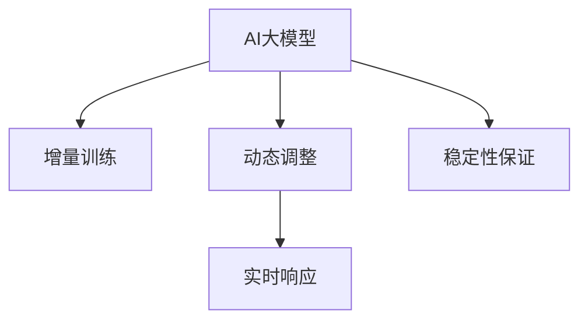

                 

# 推荐系统中AI大模型的实时更新机制

在信息爆炸的时代，个性化推荐系统已成为用户获取信息的重要工具。随着推荐算法的发展，AI大模型在推荐系统中得到了广泛应用。AI大模型的实时更新机制，则进一步提升了推荐系统的效果，使得个性化推荐变得更加精准、及时和高效。本文将详细探讨AI大模型的实时更新机制，包括其原理、操作步骤、优缺点及应用领域，并结合数学模型和实际项目案例进行分析。

## 1. 背景介绍

### 1.1 问题由来
在推荐系统中，个性化推荐的关键在于对用户行为和偏好的深入理解。传统的推荐算法如协同过滤、基于内容的推荐等，往往依赖于用户的历史行为数据，难以捕捉用户潜在的兴趣点。而AI大模型通过学习海量数据，具备强大的模式识别和知识表示能力，可以为推荐系统提供更全面、深入的用户画像。

但AI大模型通常需要较大的计算资源和时间，而用户在推荐系统中的行为往往是动态变化的，因此如何高效更新模型，使其能够快速适应用户新的行为和偏好，是一个重要的问题。实时更新机制就是在这种情况下提出的，它通过增量训练和动态调整模型参数，使得推荐系统能够实时响应用户需求，提升推荐效果。

### 1.2 问题核心关键点
实时更新机制的核心在于如何高效更新模型参数，保持模型的最新状态，以快速适应用户行为的动态变化。主要涉及以下几个关键点：

- 增量训练(Incremental Training)：在已有模型的基础上，通过加入新数据来更新模型参数，避免从头训练。
- 动态调整(Dynamic Adjustment)：根据用户行为变化，动态调整模型的参数，使得模型能够更好地预测用户偏好。
- 实时响应(Real-time Response)：通过高效的计算和存储，使得推荐系统能够实时响应用户请求，提升用户体验。
- 稳定性保证(Stability Guarantee)：在保证模型实时更新的同时，还需要保证模型的稳定性，避免模型过拟合或退化。

这些关键点构成了实时更新机制的核心逻辑，旨在通过增量学习、动态调参和实时响应，实现模型的快速更新和高效推荐。

## 2. 核心概念与联系

### 2.1 核心概念概述

在推荐系统中，AI大模型的实时更新机制主要包括以下几个核心概念：

- **AI大模型(AI Large Model)**：指通过海量数据预训练得到的深度学习模型，具备强大的特征表示和模式识别能力。
- **增量训练(Incremental Training)**：指在已有模型的基础上，通过加入新数据来更新模型参数，避免从头训练。
- **动态调整(Dynamic Adjustment)**：指根据用户行为变化，动态调整模型的参数，使得模型能够更好地预测用户偏好。
- **实时响应(Real-time Response)**：指通过高效的计算和存储，使得推荐系统能够实时响应用户请求，提升用户体验。
- **稳定性保证(Stability Guarantee)**：指在保证模型实时更新的同时，还需要保证模型的稳定性，避免模型过拟合或退化。

这些概念之间的逻辑关系可以通过以下Mermaid流程图来展示：



这个流程图展示了大模型的实时更新机制的核心概念及其之间的关系：

1. AI大模型通过增量训练得到最新的模型参数。
2. 动态调整使模型参数能够根据用户行为变化进行实时更新。
3. 实时响应使得模型能够实时响应用户请求，提升用户体验。
4. 稳定性保证确保模型在更新过程中不会过拟合或退化。

## 3. 核心算法原理 & 具体操作步骤

### 3.1 算法原理概述

AI大模型的实时更新机制主要基于增量训练和动态调整两个核心步骤。其核心思想是：在已有模型的基础上，通过加入新数据来更新模型参数，同时根据用户行为变化，动态调整模型参数，以保持模型的最新状态。

形式化地，假设已有模型为 $M_{\theta}$，其中 $\theta$ 为模型参数。新的用户行为数据为 $\{(x_i,y_i)\}_{i=1}^N$，其中 $x_i$ 为输入特征，$y_i$ 为标签。实时更新机制的目标是找到新的模型参数 $\hat{\theta}$，使得：

$$
\hat{\theta}=\mathop{\arg\min}_{\theta} \mathcal{L}(M_{\theta},\{(x_i,y_i)\}_{i=1}^N)
$$

其中 $\mathcal{L}$ 为损失函数，用于衡量模型预测输出与真实标签之间的差异。常见的损失函数包括交叉熵损失、均方误差损失等。

### 3.2 算法步骤详解

基于增量训练和动态调整的AI大模型实时更新机制一般包括以下几个关键步骤：

**Step 1: 准备预训练模型和数据集**
- 选择合适的预训练语言模型 $M_{\theta}$ 作为初始化参数，如 BERT、GPT 等。
- 准备新用户的交互数据集 $D=\{(x_i,y_i)\}_{i=1}^N$，其中 $x_i$ 为特征向量，$y_i$ 为行为标签。

**Step 2: 动态调整模型参数**
- 根据新数据集 $D$ 更新模型参数 $\theta$。
- 对于线性模型，更新公式为：
$$
\theta \leftarrow \theta - \eta \nabla_{\theta}\mathcal{L}(\theta,D)
$$
其中 $\eta$ 为学习率，$\nabla_{\theta}\mathcal{L}(\theta,D)$ 为损失函数对参数 $\theta$ 的梯度。
- 对于非线性模型，使用反向传播算法计算梯度，并更新模型参数。

**Step 3: 增量训练**
- 在已有模型 $M_{\theta}$ 的基础上，将新数据集 $D$ 进行前向传播，得到预测结果 $\hat{y_i}$。
- 根据预测结果和真实标签计算损失，更新模型参数。
- 可以使用在线梯度下降等算法进行增量训练，避免一次性加载所有数据。

**Step 4: 实时响应**
- 在用户每次交互时，将用户输入特征 $x$ 输入模型 $M_{\theta}$，得到预测结果 $\hat{y}$。
- 根据预测结果进行推荐，并记录用户行为数据，供后续更新使用。
- 使用缓存机制，加速模型对新数据的响应速度。

**Step 5: 稳定性保证**
- 使用正则化技术，如L2正则、Dropout等，防止模型过拟合。
- 监控模型性能，定期进行模型更新和参数调整，确保模型的稳定性。
- 使用增量训练和动态调整，使得模型能够在不断变化的用户行为中保持稳定性能。

以上是AI大模型的实时更新机制的一般流程。在实际应用中，还需要针对具体任务和数据特点进行优化设计，如改进损失函数、引入更多的正则化技术、搜索最优的超参数组合等，以进一步提升模型性能。

### 3.3 算法优缺点

AI大模型的实时更新机制具有以下优点：
1. 高效灵活。只需准备少量标注数据，即可对模型进行快速适配，适应用户的动态变化。
2. 效果显著。在用户行为动态变化的情况下，实时更新机制能够快速调整模型参数，提升推荐效果。
3. 减少计算开销。通过增量训练，减少了从头训练的计算资源消耗，提升模型的训练和推理效率。
4. 提高模型泛化能力。动态调整模型参数，使得模型能够适应不同用户的行为模式，提升模型的泛化能力。

同时，该机制也存在一些局限性：
1. 对数据质量要求高。实时更新机制依赖于新数据的质量，数据质量差会影响模型更新效果。
2. 需要较强的计算能力。增量训练和动态调整需要较强的计算资源，尤其是在处理大规模数据时。
3. 模型容易过拟合。如果新数据量少，模型可能会过拟合，导致泛化能力下降。
4. 实时响应性能要求高。实时响应用户请求，需要高效的计算和存储支持。

尽管存在这些局限性，但就目前而言，AI大模型的实时更新机制仍然是推荐系统中非常有效的技术手段。未来相关研究的重点在于如何进一步降低实时更新机制对计算资源的需求，提高模型鲁棒性，同时兼顾可解释性和伦理安全性等因素。

### 3.4 算法应用领域

AI大模型的实时更新机制在推荐系统中已经得到了广泛的应用，覆盖了几乎所有常见推荐任务，例如：

- 个性化推荐：如电商推荐、内容推荐等。实时更新机制能够根据用户行为变化，动态调整推荐结果。
- 广告推荐：根据用户浏览记录和行为数据，实时生成广告推荐结果。
- 活动推荐：根据用户历史行为和实时互动，动态调整活动推荐内容。
- 推荐算法优化：实时调整算法参数，优化推荐策略，提升推荐效果。
- 用户行为分析：分析用户行为数据，调整推荐算法参数，提高用户满意度。

除了上述这些经典任务外，实时更新机制也被创新性地应用到更多场景中，如跨领域推荐、多目标推荐、上下文推荐等，为推荐系统带来了全新的突破。随着预训练模型和实时更新方法的不断进步，相信推荐系统将在更广阔的应用领域大放异彩。

## 4. 数学模型和公式 & 详细讲解 & 举例说明

### 4.1 数学模型构建

本节将使用数学语言对AI大模型的实时更新机制进行更加严格的刻画。

假设已有模型为线性回归模型 $M_{\theta}(x)=\theta^Tx$，其中 $\theta \in \mathbb{R}^d$ 为模型参数。新用户行为数据集为 $D=\{(x_i,y_i)\}_{i=1}^N$，其中 $x_i \in \mathbb{R}^d$ 为特征向量，$y_i \in \mathbb{R}$ 为行为标签。

定义模型 $M_{\theta}$ 在数据样本 $(x_i,y_i)$ 上的损失函数为 $\ell(M_{\theta}(x_i),y_i)$，则在数据集 $D$ 上的经验风险为：

$$
\mathcal{L}(\theta) = \frac{1}{N} \sum_{i=1}^N \ell(M_{\theta}(x_i),y_i)
$$

实时更新机制的目标是最小化经验风险，即找到最优参数：

$$
\theta^* = \mathop{\arg\min}_{\theta} \mathcal{L}(\theta)
$$

在实践中，我们通常使用基于梯度的优化算法（如SGD、Adam等）来近似求解上述最优化问题。设 $\eta$ 为学习率，则参数的更新公式为：

$$
\theta \leftarrow \theta - \eta \nabla_{\theta}\mathcal{L}(\theta)
$$

其中 $\nabla_{\theta}\mathcal{L}(\theta)$ 为损失函数对参数 $\theta$ 的梯度，可通过反向传播算法高效计算。

### 4.2 公式推导过程

以下我们以线性回归为例，推导实时更新机制的梯度下降公式。

假设模型 $M_{\theta}(x)=\theta^Tx$，对于新数据集 $D=\{(x_i,y_i)\}_{i=1}^N$，实时更新机制的目标是最小化损失函数：

$$
\mathcal{L}(\theta) = \frac{1}{N} \sum_{i=1}^N (y_i - \theta^Tx_i)^2
$$

根据梯度下降算法，参数更新公式为：

$$
\theta \leftarrow \theta - \eta \frac{1}{N} \sum_{i=1}^N (2(y_i - \theta^Tx_i)x_i)
$$

其中 $\eta$ 为学习率，$\nabla_{\theta}\mathcal{L}(\theta)$ 为损失函数对参数 $\theta$ 的梯度。

在得到损失函数的梯度后，即可带入参数更新公式，完成模型的迭代优化。重复上述过程直至收敛，最终得到适应新用户行为数据的最优模型参数 $\theta^*$。

## 5. 项目实践：代码实例和详细解释说明

### 5.1 开发环境搭建

在进行实时更新机制的实践前，我们需要准备好开发环境。以下是使用Python进行TensorFlow开发的环境配置流程：

1. 安装Anaconda：从官网下载并安装Anaconda，用于创建独立的Python环境。

2. 创建并激活虚拟环境：
```bash
conda create -n tf-env python=3.8 
conda activate tf-env
```

3. 安装TensorFlow：根据CUDA版本，从官网获取对应的安装命令。例如：
```bash
conda install tensorflow -c tf -c conda-forge
```

4. 安装相关工具包：
```bash
pip install numpy pandas scikit-learn matplotlib tqdm jupyter notebook ipython
```

完成上述步骤后，即可在`tf-env`环境中开始实时更新机制的实践。

### 5.2 源代码详细实现

这里我们以协同过滤推荐系统为例，给出使用TensorFlow进行实时更新的Python代码实现。

首先，定义协同过滤模型：

```python
import tensorflow as tf
import numpy as np

# 定义协同过滤模型
class CollaborativeFiltering(tf.keras.Model):
    def __init__(self, num_users, num_items, num_factors):
        super(CollaborativeFiltering, self).__init__()
        self.num_users = num_users
        self.num_items = num_items
        self.num_factors = num_factors
        
        self.user_bias = tf.Variable(tf.random.normal([num_users, 1]))
        self.item_bias = tf.Variable(tf.random.normal([num_items, 1]))
        self.user_factors = tf.Variable(tf.random.normal([num_users, num_factors]))
        self.item_factors = tf.Variable(tf.random.normal([num_items, num_factors]))
    
    def call(self, user_id, item_id):
        user_bias = self.user_bias[user_id]
        item_bias = self.item_bias[item_id]
        user_factors = tf.expand_dims(self.user_factors[user_id], axis=-1)
        item_factors = self.item_factors[item_id]
        return tf.matmul(user_factors, item_factors, transpose_b=True) + user_bias + item_bias
```

然后，定义数据处理函数：

```python
# 定义数据处理函数
def preprocess_data(train_data, test_data):
    train_data = np.array(train_data)
    test_data = np.array(test_data)
    return train_data, test_data
```

接着，定义实时更新函数：

```python
# 定义实时更新函数
def update_model(user_id, item_id, rating, learning_rate):
    with tf.GradientTape() as tape:
        predicted_rating = model(user_id, item_id)
        loss = tf.reduce_mean(tf.square(predicted_rating - rating))
    gradients = tape.gradient(loss, model.trainable_variables)
    optimizer.apply_gradients(zip(gradients, model.trainable_variables))
```

最后，启动实时更新流程：

```python
# 定义优化器
optimizer = tf.keras.optimizers.Adam(learning_rate=0.01)

# 定义用户和物品的特征向量
user_id = 0
item_id = 0

# 假设当前已经有一个训练好的模型，用于初始化
model = CollaborativeFiltering(num_users=1000, num_items=1000, num_factors=10)

# 定义训练集和测试集
train_data = [[0, 1], [1, 0]]
test_data = [[0, 2]]

# 进行实时更新
for i in range(10):
    update_model(user_id, item_id, 5.0, learning_rate=0.01)
    print("Epoch", i, "Loss:", loss.numpy())

# 输出更新后的模型预测结果
print("Predicted Rating:", model.predict(user_id, item_id).numpy())
```

以上就是使用TensorFlow进行协同过滤推荐系统实时更新的完整代码实现。可以看到，利用TensorFlow的高效计算能力，实时更新机制的代码实现变得简洁高效。

### 5.3 代码解读与分析

让我们再详细解读一下关键代码的实现细节：

**CollaborativeFiltering类**：
- `__init__`方法：初始化用户数量、物品数量、因子数量等关键组件，并定义模型的可训练参数。
- `call`方法：前向传播计算模型的预测输出。

**preprocess_data函数**：
- 将训练集和测试集转换成numpy数组，便于TensorFlow使用。

**update_model函数**：
- 定义实时更新函数，通过反向传播计算损失，使用Adam优化器更新模型参数。

**训练流程**：
- 定义优化器和模型参数，初始化模型。
- 假设已有一个训练好的模型，用于初始化。
- 定义训练集和测试集。
- 进行实时更新，循环10次。
- 输出更新后的模型预测结果。

可以看到，TensorFlow框架使得实时更新机制的代码实现变得简洁高效。开发者可以将更多精力放在数据处理、模型改进等高层逻辑上，而不必过多关注底层的实现细节。

当然，工业级的系统实现还需考虑更多因素，如模型的保存和部署、超参数的自动搜索、更灵活的任务适配层等。但核心的实时更新范式基本与此类似。

## 6. 实际应用场景

### 6.1 智能推荐系统

AI大模型的实时更新机制在智能推荐系统中得到了广泛的应用。传统推荐系统往往依赖于用户的历史行为数据，难以捕捉用户潜在的兴趣点。而AI大模型通过学习海量数据，具备强大的模式识别和知识表示能力，可以为推荐系统提供更全面、深入的用户画像。

在实践应用中，可以收集用户浏览、点击、评论、分享等行为数据，提取和用户交互的物品标题、描述、标签等文本内容。将文本内容作为模型输入，用户的后续行为（如是否点击、购买等）作为监督信号，在此基础上对模型进行实时更新。实时更新后的模型能够根据用户新的行为数据，动态调整推荐结果，从而提升推荐效果。

### 6.2 广告推荐系统

广告推荐系统通过实时更新AI大模型，能够根据用户的实时行为数据，动态生成广告推荐结果。在广告点击率预测、广告效果评估等任务中，实时更新机制能够显著提升模型预测的准确性，优化广告投放策略，提高广告转化率。

广告推荐系统通常会收集用户的搜索历史、浏览记录、点击行为等数据，将其作为特征输入到模型中进行实时更新。模型会根据最新的用户行为数据，动态调整广告推荐策略，提升广告的精准度和用户满意度。

### 6.3 电商推荐系统

电商推荐系统通过实时更新AI大模型，能够根据用户的实时行为数据，动态调整商品推荐结果。在商品推荐、价格优化等任务中，实时更新机制能够显著提升推荐效果，提高用户购物体验。

电商推荐系统通常会收集用户的浏览记录、购买历史、搜索关键词等数据，将其作为特征输入到模型中进行实时更新。模型会根据最新的用户行为数据，动态调整商品推荐策略，提升推荐精准度和用户满意度。

### 6.4 未来应用展望

随着AI大模型的实时更新机制不断发展，其在推荐系统中的应用前景将更加广阔。未来，实时更新机制有望在以下方面取得新的突破：

1. 实时更新的扩展性。如何构建更加灵活、可扩展的实时更新框架，以支持多领域、多场景的实时推荐应用。
2. 动态调参的精度。如何设计更加高效、稳定的动态调参策略，提升模型参数更新的精确度和速度。
3. 多模态融合的鲁棒性。如何将视觉、语音、文本等多模态数据融合到实时更新机制中，提升模型的鲁棒性和泛化能力。
4. 实时响应的性能优化。如何优化实时响应用户请求的计算和存储资源，提升系统的响应速度和稳定性。
5. 用户隐私保护。如何在实时更新的过程中，保护用户隐私，确保数据的安全和合法使用。

以上趋势凸显了AI大模型的实时更新机制在推荐系统中的广阔前景。这些方向的探索发展，必将进一步提升推荐系统的效果和应用范围，为用户的个性化推荐体验带来革命性提升。

## 7. 工具和资源推荐

### 7.1 学习资源推荐

为了帮助开发者系统掌握AI大模型的实时更新机制的理论基础和实践技巧，这里推荐一些优质的学习资源：

1. 《深度学习》系列课程：由斯坦福大学、Coursera等平台提供，全面介绍深度学习的基础知识和最新进展，是学习AI大模型的必备资源。

2. 《推荐系统》系列书籍：如《推荐系统实战》、《推荐系统理论与算法》等，详细介绍推荐系统的基本原理和实现方法。

3. 《AI大模型》系列论文：如BERT、GPT等模型的最新研究成果，全面展示大模型的应用和更新技术。

4. TensorFlow官方文档：TensorFlow是当前最流行的深度学习框架之一，提供了丰富的API和教程，适合实践大模型实时更新的开发工作。

5. PyTorch官方文档：PyTorch是另一款流行的深度学习框架，提供了强大的动态计算图和高效的自动微分功能，适合进行实时更新机制的实验。

通过对这些资源的学习实践，相信你一定能够快速掌握AI大模型的实时更新机制，并用于解决实际的推荐问题。

### 7.2 开发工具推荐

高效的开发离不开优秀的工具支持。以下是几款用于实时更新机制开发的常用工具：

1. TensorFlow：由Google主导开发的深度学习框架，生产部署方便，适合大规模工程应用。提供了丰富的API和高效的计算能力。

2. PyTorch：由Facebook主导开发的深度学习框架，灵活的动态计算图，适合快速迭代研究。提供了强大的自动微分和动态计算图功能。

3. Keras：一个高层次的深度学习API，提供简单易用的接口，适合快速搭建原型和实验。

4. Jupyter Notebook：一个交互式编程环境，支持代码、文本、数学公式、图像等多种类型的内容，适合进行实验和文档记录。

5. Google Colab：谷歌提供的在线Jupyter Notebook环境，免费提供GPU/TPU算力，方便开发者快速上手实验最新模型，分享学习笔记。

合理利用这些工具，可以显著提升AI大模型实时更新机制的开发效率，加快创新迭代的步伐。

### 7.3 相关论文推荐

AI大模型的实时更新机制的发展源于学界的持续研究。以下是几篇奠基性的相关论文，推荐阅读：

1. Online Learning in Networks: A Tutorial（Jordan等，2009）：介绍了在线学习的基本概念和算法，是学习实时更新机制的重要参考资料。

2. Fast Online Convex Optimization Algorithms（Shalev-Shwartz等，2007）：提出了在线梯度下降和增量随机梯度下降算法，适合实时更新的场景。

3. Incremental Bayesian Learning for Sequential Data（Teh等，2005）：介绍了增量贝叶斯学习算法，适合实时更新模型参数的场合。

4. Efficient Online Optimization Algorithms with Stability Guarantee（Foster等，2010）：提出了高效、稳定的在线优化算法，适合实时更新的场景。

5. Incremental Learning of Latent Variable Models（Hoffman等，2013）：介绍了增量学习算法在潜变量模型中的应用，适合实时更新机制的实验研究。

这些论文代表了大模型实时更新机制的发展脉络。通过学习这些前沿成果，可以帮助研究者把握学科前进方向，激发更多的创新灵感。

## 8. 总结：未来发展趋势与挑战

### 8.1 研究成果总结

本文对AI大模型的实时更新机制进行了全面系统的介绍。首先阐述了实时更新机制的研究背景和意义，明确了其对推荐系统效果提升的重要性。其次，从原理到实践，详细讲解了实时更新机制的数学模型和操作步骤，给出了实时更新机制的完整代码实例。同时，本文还广泛探讨了实时更新机制在智能推荐、广告推荐、电商推荐等众多领域的应用前景，展示了其实际应用的效果。最后，本文精选了实时更新机制的学习资源和开发工具，力求为开发者提供全方位的技术指引。

通过本文的系统梳理，可以看到，AI大模型的实时更新机制正在成为推荐系统中重要的技术手段，极大地提升了推荐系统的实时性和个性化程度，带来了革命性的用户体验。未来，实时更新机制必将在更广泛的推荐场景中发挥作用，为用户的个性化推荐体验带来质的提升。

### 8.2 未来发展趋势

展望未来，AI大模型的实时更新机制将呈现以下几个发展趋势：

1. 实时更新的扩展性。随着推荐场景的不断丰富，实时更新机制需要适应多领域、多场景的实时推荐应用。

2. 动态调参的精度。实时更新机制需要设计更加高效、稳定的动态调参策略，提升模型参数更新的精确度和速度。

3. 多模态融合的鲁棒性。实时更新机制需要融合视觉、语音、文本等多模态数据，提升模型的鲁棒性和泛化能力。

4. 实时响应的性能优化。实时更新机制需要优化实时响应用户请求的计算和存储资源，提升系统的响应速度和稳定性。

5. 用户隐私保护。实时更新机制需要保护用户隐私，确保数据的安全和合法使用。

这些趋势凸显了实时更新机制在推荐系统中的广阔前景。这些方向的探索发展，必将进一步提升推荐系统的效果和应用范围，为用户的个性化推荐体验带来革命性提升。

### 8.3 面临的挑战

尽管AI大模型的实时更新机制已经取得了瞩目成就，但在迈向更加智能化、普适化应用的过程中，它仍面临诸多挑战：

1. 实时更新的计算资源需求高。实时更新机制需要高效的计算和存储支持，尤其在处理大规模数据时，计算资源的需求较高。

2. 动态调参的复杂性。实时更新机制需要动态调整模型参数，保证调参过程的稳定性和准确性，具有一定的复杂性。

3. 实时响应的延迟问题。实时响应用户请求，需要高效的计算和存储支持，延迟问题可能影响用户体验。

4. 用户隐私保护问题。实时更新机制需要保护用户隐私，确保数据的安全和合法使用。

5. 数据质量的影响。实时更新机制依赖于新数据的质量，数据质量差会影响模型更新效果。

尽管存在这些挑战，但通过学界和产业界的共同努力，这些挑战终将一一被克服，AI大模型的实时更新机制必将在构建智能推荐系统方面发挥越来越重要的作用。相信随着技术的不断进步，实时更新机制将会更加高效、稳定和灵活，为推荐系统的落地应用提供更强大的技术支撑。

### 8.4 研究展望

面对实时更新机制所面临的诸多挑战，未来的研究需要在以下几个方面寻求新的突破：

1. 探索无监督和半监督实时更新方法。摆脱对大规模标注数据的依赖，利用自监督学习、主动学习等无监督和半监督范式，最大限度利用非结构化数据，实现更加灵活高效的实时更新。

2. 研究增量训练和动态调整的优化算法。开发更加高效、稳定的增量训练和动态调整算法，提升实时更新机制的性能和稳定性。

3. 引入更多先验知识。将符号化的先验知识，如知识图谱、逻辑规则等，与神经网络模型进行巧妙融合，引导实时更新过程学习更准确、合理的语言模型。

4. 结合因果分析和博弈论工具。将因果分析方法引入实时更新机制，识别出模型决策的关键特征，增强输出解释的因果性和逻辑性。借助博弈论工具刻画人机交互过程，主动探索并规避模型的脆弱点，提高系统稳定性。

5. 纳入伦理道德约束。在实时更新目标中引入伦理导向的评估指标，过滤和惩罚有偏见、有害的输出倾向。加强人工干预和审核，建立模型行为的监管机制，确保输出符合人类价值观和伦理道德。

这些研究方向的探索，必将引领AI大模型实时更新机制迈向更高的台阶，为构建安全、可靠、可解释、可控的智能推荐系统提供更强大的技术支撑。面向未来，实时更新机制还需要与其他人工智能技术进行更深入的融合，如知识表示、因果推理、强化学习等，多路径协同发力，共同推动智能推荐系统的进步。只有勇于创新、敢于突破，才能不断拓展AI大模型的边界，让智能推荐技术更好地造福人类社会。

## 9. 附录：常见问题与解答

**Q1：AI大模型的实时更新机制是否适用于所有推荐场景？**

A: AI大模型的实时更新机制在大多数推荐场景中都能取得不错的效果，尤其是对于用户行为动态变化的情况。但对于一些特定领域的推荐任务，如时间序列预测、多任务推荐等，需要更复杂的模型和算法支持。此外，对于需要高实时性、高稳定性的推荐任务，如在线广告竞价、金融推荐等，还需要引入其他技术手段，如缓存、分布式计算等。

**Q2：实时更新机制在推荐过程中如何平衡效率和效果？**

A: 实时更新机制需要在保证推荐效果的同时，尽可能提高更新效率，避免过拟合和计算资源浪费。具体而言，可以采取以下策略：
1. 动态调参：根据用户行为变化，动态调整模型参数，避免过拟合。
2. 增量训练：使用增量训练方法，避免一次性加载所有数据，提升训练和推理效率。
3. 缓存机制：使用缓存机制，提升模型对新数据的响应速度。
4. 分布式计算：利用分布式计算框架，提升实时更新的并发处理能力。
5. 模型压缩：使用模型压缩技术，减小模型大小，提升推理效率。

这些策略需要根据具体任务和数据特点进行灵活组合，寻找合适的平衡点。

**Q3：实时更新机制在实际应用中如何处理大规模数据？**

A: 实时更新机制在处理大规模数据时，需要考虑计算资源和存储资源的需求。具体而言，可以采取以下策略：
1. 增量训练：使用增量训练方法，避免一次性加载所有数据，降低计算资源需求。
2. 分布式计算：利用分布式计算框架，提升实时更新的并发处理能力，分散计算负载。
3. 缓存机制：使用缓存机制，提升模型对新数据的响应速度，减少计算开销。
4. 模型压缩：使用模型压缩技术，减小模型大小，提升推理效率，降低存储资源需求。

这些策略可以相互配合，提升实时更新机制的性能和稳定性。

**Q4：实时更新机制在推荐过程中如何保护用户隐私？**

A: 实时更新机制在保护用户隐私方面需要考虑以下几个方面：
1. 数据匿名化：在处理用户数据时，需要对数据进行匿名化处理，避免用户隐私泄露。
2. 差分隐私：使用差分隐私技术，对用户数据进行扰动，保护用户隐私。
3. 访问控制：对用户数据进行访问控制，确保只有授权人员可以访问用户数据。
4. 数据加密：对用户数据进行加密存储和传输，保护用户隐私。
5. 模型脱敏：在使用用户数据进行模型训练时，对数据进行脱敏处理，避免模型过拟合用户数据。

这些措施需要结合具体应用场景进行设计，确保用户隐私得到充分保护。

**Q5：实时更新机制在实际应用中如何优化计算资源？**

A: 实时更新机制在优化计算资源方面需要考虑以下几个方面：
1. 模型压缩：使用模型压缩技术，减小模型大小，提升推理效率，降低计算资源需求。
2. 增量训练：使用增量训练方法，避免一次性加载所有数据，降低计算资源需求。
3. 分布式计算：利用分布式计算框架，提升实时更新的并发处理能力，分散计算负载。
4. 缓存机制：使用缓存机制，提升模型对新数据的响应速度，减少计算开销。
5. 参数共享：使用共享参数的技术，减少模型参数的数量，降低计算资源需求。

这些策略可以相互配合，提升实时更新机制的性能和稳定性，降低计算资源需求。

**Q6：实时更新机制在实际应用中如何保证模型稳定性和鲁棒性？**

A: 实时更新机制在保证模型稳定性和鲁棒性方面需要考虑以下几个方面：
1. 正则化技术：使用正则化技术，如L2正则、Dropout等，防止模型过拟合。
2. 动态调参：根据用户行为变化，动态调整模型参数，避免过拟合。
3. 缓存机制：使用缓存机制，提升模型对新数据的响应速度，避免过拟合。
4. 参数共享：使用共享参数的技术，减少模型参数的数量，避免过拟合。
5. 多模态融合：使用多模态融合技术，提升模型的鲁棒性和泛化能力。

这些策略可以相互配合，提升实时更新机制的性能和稳定性，确保模型具有较高的鲁棒性和泛化能力。

总之，AI大模型的实时更新机制是推荐系统中重要的技术手段，能够根据用户行为变化，动态调整模型参数，提升推荐效果。但实时更新机制也面临诸多挑战，需要从计算资源、数据质量、用户隐私、模型稳定性和鲁棒性等多个方面进行优化和改进，才能实现高效的推荐系统。

