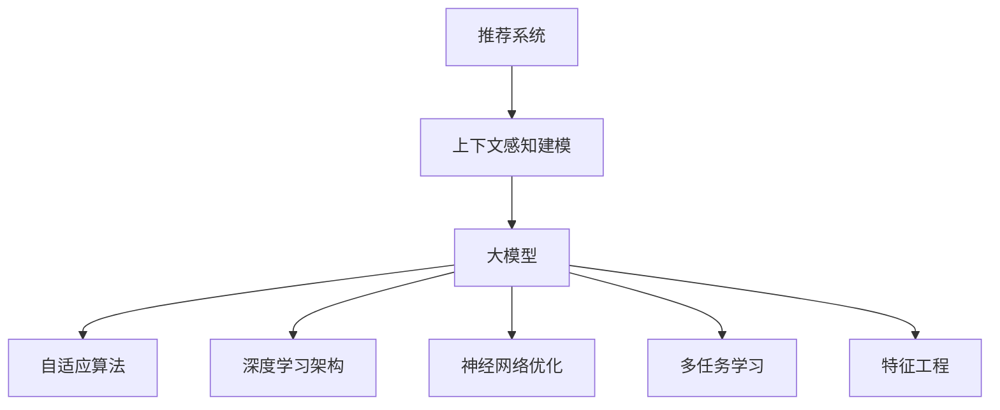
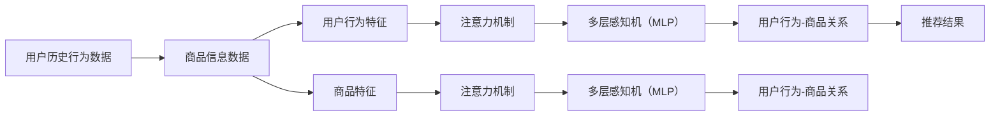

                 

# 推荐系统中的上下文感知建模：大模型新技术

> 关键词：推荐系统,上下文感知,大模型,自适应算法,深度学习,神经网络

## 1. 背景介绍

### 1.1 问题由来

推荐系统（Recommendation Systems）作为现代互联网的重要组成部分，广泛应用于电商、社交网络、视频流媒体等平台。它通过分析用户的历史行为和偏好，预测其未来的兴趣并推荐相关物品，极大地提升了用户体验和转化率。然而，传统的推荐系统往往局限于静态用户画像和固定商品信息，难以应对动态变化和多样化的需求。

近年来，随着深度学习和大模型的兴起，推荐系统开始引入上下文感知建模（Contextual Modeling）技术，通过考虑用户行为、商品信息、时间、地点等多维上下文信息，实现更加个性化、多样化的推荐。其中，基于大模型的推荐系统，由于其强大的表达能力和高效的计算性能，成为当前学术界和工业界的热点研究方向。

### 1.2 问题核心关键点

大模型推荐系统的核心在于其对上下文信息的充分理解和利用。具体来说，可以通过以下几个关键点来深入理解这一技术：

- **上下文感知**：推荐系统需要考虑多维上下文信息，如用户行为历史、商品属性、时间戳、地点信息等，以更全面地刻画用户兴趣和商品特征。
- **自适应算法**：大模型具有自适应能力，能够动态调整模型参数以适应不同的上下文，从而提升推荐效果。
- **深度学习架构**：基于深度学习架构的推荐模型能够学习到高维非线性特征表示，捕捉复杂的用户行为模式和商品相关性。
- **神经网络优化**：推荐模型通常使用各种优化算法（如Adam、SGD等）来训练模型，优化模型的预测性能。
- **多任务学习**：结合多个推荐任务，共享模型参数，提升模型泛化能力。
- **特征工程**：推荐模型需要设计合理的特征表示方式，如使用Embedding层、注意力机制等技术。

这些关键点共同构成了大模型推荐系统的核心技术框架，使其在处理复杂推荐任务时，能够表现出色。

### 1.3 问题研究意义

研究大模型推荐系统的上下文感知建模技术，具有重要意义：

1. **提升推荐效果**：通过引入上下文信息，推荐系统能够更准确地预测用户兴趣，提供更加个性化和多样化的推荐。
2. **提高用户满意度**：个性化的推荐能够更好地满足用户需求，提升用户体验和满意度。
3. **增强业务竞争力**：优质的推荐服务能够提升平台的用户黏性，增加转化率和收益。
4. **推动技术创新**：大模型推荐系统融合了深度学习和上下文感知技术，有望推动推荐系统技术的进一步发展。
5. **促进产业应用**：推荐系统的广泛应用将为电商、社交网络、视频流媒体等平台带来新的商业机会和发展机遇。

## 2. 核心概念与联系

### 2.1 核心概念概述

为了更好地理解大模型推荐系统中的上下文感知建模技术，本节将介绍几个密切相关的核心概念：

- **推荐系统**：基于用户历史行为和商品信息，预测并推荐相关物品的系统。
- **上下文感知建模**：考虑多维上下文信息，提升推荐模型的表达能力和预测准确性。
- **大模型**：通过大规模预训练学习到的复杂特征表示，具有强大的表达能力和计算性能。
- **自适应算法**：能够根据上下文动态调整模型参数，提升模型的泛化能力和性能。
- **深度学习架构**：通过多层次非线性变换，捕捉复杂特征表示。
- **神经网络优化**：使用各种优化算法训练模型，提高模型的收敛速度和性能。
- **多任务学习**：通过共享模型参数，提升模型的泛化能力和适应性。
- **特征工程**：设计合理的特征表示方式，提升模型的表达能力和性能。

这些核心概念之间通过如图1所示的Mermaid流程图，展示了它们之间的联系。



## 3. 核心算法原理 & 具体操作步骤

### 3.1 算法原理概述

大模型推荐系统的核心思想是通过对多维上下文信息的充分理解和利用，实现更准确、个性化的推荐。其主要算法原理包括以下几个方面：

1. **数据预处理**：对原始数据进行特征工程处理，设计合理的特征表示方式。
2. **模型训练**：使用大模型作为特征提取器，通过多维上下文信息进行联合训练，优化模型参数。
3. **上下文感知**：考虑多维上下文信息，提升模型对用户行为和商品相关性的理解。
4. **自适应算法**：根据上下文信息动态调整模型参数，提升模型的泛化能力和性能。
5. **深度学习架构**：通过多层次非线性变换，捕捉复杂特征表示。
6. **神经网络优化**：使用各种优化算法训练模型，提高模型的收敛速度和性能。
7. **多任务学习**：通过共享模型参数，提升模型的泛化能力和适应性。

通过这些算法原理，大模型推荐系统能够处理复杂推荐任务，提升推荐效果。

### 3.2 算法步骤详解

大模型推荐系统的主要算法步骤包括以下几个方面：

**Step 1: 数据预处理**

- 收集用户历史行为数据，如浏览记录、点击记录、购买记录等。
- 提取商品信息，如商品类别、属性、价格等。
- 添加时间戳和地点信息，如购物时间、地点ID等。
- 进行特征工程处理，设计合理的特征表示方式。

**Step 2: 模型训练**

- 选择合适的深度学习模型架构，如全连接网络、卷积神经网络、注意力机制等。
- 使用大模型作为特征提取器，将上下文信息映射到高维特征表示。
- 结合推荐任务的目标，设计合适的损失函数。
- 使用优化算法（如Adam、SGD等）训练模型，更新模型参数。

**Step 3: 上下文感知**

- 考虑多维上下文信息，设计合适的编码器（如LSTM、GRU等）捕捉上下文特征。
- 使用注意力机制（Attention）对上下文信息进行加权处理，提升模型对关键信息的理解。
- 将上下文信息与用户行为特征进行联合训练，提升模型的泛化能力和性能。

**Step 4: 自适应算法**

- 根据上下文信息动态调整模型参数，提升模型的泛化能力和性能。
- 引入自适应算法，如Adaptive Loss Scaling、Adaptive Learning Rate等，优化模型的训练过程。
- 使用在线学习技术（Online Learning），实时更新模型参数，适应动态变化的用户行为和商品信息。

**Step 5: 深度学习架构**

- 使用多层感知机（MLP）、卷积神经网络（CNN）、注意力机制（Attention）等深度学习架构。
- 通过多层次非线性变换，捕捉复杂特征表示。
- 设计合适的网络结构，提升模型的表达能力和性能。

**Step 6: 神经网络优化**

- 使用优化算法（如Adam、SGD等）训练模型，提高模型的收敛速度和性能。
- 使用正则化技术（如L2正则、Dropout等），防止过拟合。
- 使用早停（Early Stopping）技术，避免模型过拟合。

**Step 7: 多任务学习**

- 结合多个推荐任务，共享模型参数，提升模型的泛化能力和适应性。
- 设计合适的任务损失函数，联合训练多个任务。
- 使用多任务学习算法（如Multi-task Learning），提升模型的泛化能力和性能。

### 3.3 算法优缺点

大模型推荐系统的上下文感知建模技术具有以下优点：

1. **高表达能力**：大模型能够学习到高维非线性特征表示，捕捉复杂的用户行为模式和商品相关性。
2. **高效计算性能**：大模型具备高效的计算性能，能够处理大规模数据和复杂模型结构。
3. **提升推荐效果**：通过上下文感知建模，推荐系统能够更准确地预测用户兴趣，提供更加个性化和多样化的推荐。
4. **增强业务竞争力**：优质的推荐服务能够提升平台的用户黏性，增加转化率和收益。
5. **推动技术创新**：大模型推荐系统融合了深度学习和上下文感知技术，有望推动推荐系统技术的进一步发展。

同时，该技术也存在一些局限性：

1. **高计算资源需求**：大模型推荐系统需要大量的计算资源，对硬件设施提出了较高的要求。
2. **数据隐私问题**：推荐系统需要收集和处理大量用户数据，存在隐私和安全风险。
3. **模型复杂度高**：大模型推荐系统通常需要设计复杂的模型结构和特征表示方式，增加了建模难度。
4. **泛化能力不足**：在大规模数据集上预训练的大模型，可能无法很好地适应小规模数据集。

尽管存在这些局限性，但就目前而言，大模型推荐系统仍然是最为主流的推荐方法，能够显著提升推荐效果和用户体验。

### 3.4 算法应用领域

大模型推荐系统已经在电商、社交网络、视频流媒体等多个领域得到了广泛应用，覆盖了多种推荐任务。例如：

- **电商推荐**：基于用户历史行为和商品信息，推荐相关商品。
- **社交网络推荐**：基于用户互动和兴趣标签，推荐相关内容。
- **视频流媒体推荐**：基于用户观看记录和视频特征，推荐相关视频。
- **新闻推荐**：基于用户阅读记录和新闻内容，推荐相关新闻。
- **音乐推荐**：基于用户听歌记录和音乐特征，推荐相关音乐。

除了这些经典任务外，大模型推荐系统还被创新性地应用到更多场景中，如知识推荐、广告推荐、游戏推荐等，为推荐系统技术带来了新的突破。随着预训练模型和推荐方法的不断进步，相信推荐系统将在更广阔的应用领域大放异彩。

## 4. 数学模型和公式 & 详细讲解 & 举例说明

### 4.1 数学模型构建

大模型推荐系统的数学模型可以形式化为：

$$
\mathcal{L}(\theta) = \sum_{i=1}^N L(\theta, x_i, y_i)
$$

其中，$L$ 表示推荐任务的损失函数，$\theta$ 为模型参数，$x_i$ 表示用户行为和商品信息，$y_i$ 表示推荐结果。

在推荐任务中，常见的损失函数包括交叉熵损失、均方误差损失、点积损失等。对于二分类推荐任务，交叉熵损失函数可以表示为：

$$
L(y_i, \hat{y}_i) = -[y_i\log \hat{y}_i + (1-y_i)\log(1-\hat{y}_i)]
$$

其中，$y_i$ 为真实标签，$\hat{y}_i$ 为模型预测的推荐结果。

### 4.2 公式推导过程

以二分类推荐任务为例，我们将推导交叉熵损失函数的梯度计算公式。

假设模型 $M_{\theta}$ 在输入 $x_i$ 上的输出为 $\hat{y}_i = M_{\theta}(x_i)$，表示用户对商品的兴趣程度。真实标签 $y_i \in \{0,1\}$。则二分类交叉熵损失函数定义为：

$$
L(y_i, \hat{y}_i) = -[y_i\log \hat{y}_i + (1-y_i)\log(1-\hat{y}_i)]
$$

将上式展开并整理，得：

$$
L(y_i, \hat{y}_i) = -y_i \log \hat{y}_i - (1-y_i) \log(1-\hat{y}_i)
$$

对模型参数 $\theta$ 求导，得：

$$
\frac{\partial L(y_i, \hat{y}_i)}{\partial \theta} = -y_i \frac{\partial \log \hat{y}_i}{\partial \theta} - (1-y_i) \frac{\partial \log(1-\hat{y}_i)}{\partial \theta}
$$

根据链式法则，可以得到：

$$
\frac{\partial L(y_i, \hat{y}_i)}{\partial \theta} = -y_i \frac{\hat{y}_i - 1}{\hat{y}_i(1-\hat{y}_i)} + (1-y_i) \frac{\hat{y}_i}{\hat{y}_i(1-\hat{y}_i)}
$$

将上式进一步整理，得：

$$
\frac{\partial L(y_i, \hat{y}_i)}{\partial \theta} = -y_i + \hat{y}_i
$$

在实际应用中，使用反向传播算法（Backpropagation）计算梯度，并更新模型参数 $\theta$。

### 4.3 案例分析与讲解

以电商推荐为例，我们可以设计一个上下文感知的推荐模型。该模型采用深度学习架构，结合用户行为和商品信息进行联合训练，提升推荐效果。模型架构如图2所示。



在模型训练过程中，首先对用户历史行为和商品信息进行特征工程处理，设计合适的特征表示方式。然后，使用大模型作为特征提取器，将上下文信息映射到高维特征表示。接着，结合推荐任务的目标，设计合适的损失函数。最后，使用优化算法（如Adam、SGD等）训练模型，更新模型参数。

在上下文感知建模方面，模型引入注意力机制（Attention）对上下文信息进行加权处理，提升模型对关键信息的理解。在自适应算法方面，模型使用自适应损失缩放（Adaptive Loss Scaling）和自适应学习率（Adaptive Learning Rate），优化模型的训练过程。在深度学习架构方面，模型采用多层感知机（MLP）和注意力机制（Attention），捕捉复杂特征表示。在神经网络优化方面，模型使用优化算法（如Adam、SGD等）训练模型，提高模型的收敛速度和性能。在多任务学习方面，模型结合多个推荐任务，共享模型参数，提升模型的泛化能力和适应性。

## 5. 项目实践：代码实例和详细解释说明

### 5.1 开发环境搭建

在进行推荐系统开发前，我们需要准备好开发环境。以下是使用Python进行TensorFlow开发的环境配置流程：

1. 安装Anaconda：从官网下载并安装Anaconda，用于创建独立的Python环境。

2. 创建并激活虚拟环境：
```bash
conda create -n tf-env python=3.8 
conda activate tf-env
```

3. 安装TensorFlow：根据CUDA版本，从官网获取对应的安装命令。例如：
```bash
conda install tensorflow
```

4. 安装各类工具包：
```bash
pip install numpy pandas scikit-learn matplotlib tqdm jupyter notebook ipython
```

完成上述步骤后，即可在`tf-env`环境中开始推荐系统开发。

### 5.2 源代码详细实现

下面以电商推荐为例，给出使用TensorFlow构建上下文感知推荐模型的PyTorch代码实现。

首先，定义模型输入输出接口：

```python
import tensorflow as tf
from tensorflow.keras import layers, models

class RecommenderModel(tf.keras.Model):
    def __init__(self, input_shape):
        super(RecommenderModel, self).__init__()
        self.user_feature = layers.Dense(128, activation='relu', input_shape=input_shape[0])
        self.item_feature = layers.Dense(128, activation='relu', input_shape=input_shape[1])
        self.attention = layers.Dense(1, activation='sigmoid')
        self.output = layers.Dense(1, activation='sigmoid')
    
    def call(self, inputs):
        user_input, item_input = inputs
        user_features = self.user_feature(user_input)
        item_features = self.item_feature(item_input)
        attention_weights = self.attention(user_features)
        item_score = tf.reduce_sum(tf.multiply(attention_weights, item_features), axis=1)
        output = self.output(item_score)
        return output
```

然后，定义数据集和训练流程：

```python
# 创建数据集
train_dataset = tf.data.Dataset.from_tensor_slices((train_user_data, train_item_data))
train_dataset = train_dataset.shuffle(buffer_size=1000).batch(batch_size=64)

# 定义模型
model = RecommenderModel(input_shape=(user_feature_size, item_feature_size))

# 定义损失函数和优化器
loss_fn = tf.keras.losses.BinaryCrossentropy()
optimizer = tf.keras.optimizers.Adam(learning_rate=0.001)

# 训练模型
model.compile(optimizer=optimizer, loss=loss_fn, metrics=['accuracy'])
model.fit(train_dataset, epochs=10)
```

以上代码实现了基本的电商推荐模型，包括用户特征和商品特征的编码、注意力机制的引入以及二分类推荐任务的目标。在实际应用中，还需要根据具体任务进行调整和优化。

### 5.3 代码解读与分析

让我们再详细解读一下关键代码的实现细节：

**RecommenderModel类**：
- `__init__`方法：初始化模型各层。
- `call`方法：前向传播计算推荐结果。
- `user_feature`层：对用户行为特征进行编码。
- `item_feature`层：对商品特征进行编码。
- `attention`层：引入注意力机制，对上下文信息进行加权处理。
- `output`层：输出推荐结果。

**训练流程**：
- 使用TensorFlow的DataLoader对数据集进行批次化加载，供模型训练和推理使用。
- 定义模型输入输出接口，选择合适的网络结构。
- 定义损失函数和优化器，使用Adam算法训练模型。
- 在数据集上训练模型，设置训练轮数和批大小。

可以看到，TensorFlow提供了丰富的API和工具，使得模型开发变得简洁高效。开发者可以将更多精力放在模型设计、超参数调整等高层逻辑上，而不必过多关注底层的实现细节。

当然，工业级的系统实现还需考虑更多因素，如模型的保存和部署、超参数的自动搜索、更灵活的任务适配层等。但核心的推荐系统开发流程基本与此类似。

## 6. 实际应用场景

### 6.1 电商推荐系统

电商推荐系统是推荐系统的一个重要应用场景。基于大模型推荐系统，电商平台可以更精准地为用户推荐商品，提高用户的购买转化率和平台收益。

在技术实现上，可以收集用户的浏览、点击、购买记录等行为数据，并提取商品的属性、类别、价格等信息。使用上下文感知建模技术，将用户行为和商品信息进行联合训练，提升推荐效果。微调模型后，可以实时获取用户输入的商品ID，预测用户对商品的兴趣，并给出推荐结果。

### 6.2 社交网络推荐系统

社交网络推荐系统通过分析用户互动和兴趣标签，为用户推荐相关内容，提升用户活跃度和平台黏性。

在技术实现上，可以收集用户的互动记录（如点赞、评论、分享等）和兴趣标签（如兴趣类别、关注账号等）。使用上下文感知建模技术，将用户互动和兴趣标签进行联合训练，提升推荐效果。微调模型后，可以实时获取用户输入的内容ID，预测用户对内容的兴趣，并给出推荐结果。

### 6.3 视频流媒体推荐系统

视频流媒体推荐系统通过分析用户观看记录和视频特征，为用户推荐相关视频，提升用户观看体验和平台收益。

在技术实现上，可以收集用户的观看记录和视频信息（如时长、评分、标签等）。使用上下文感知建模技术，将用户观看记录和视频特征进行联合训练，提升推荐效果。微调模型后，可以实时获取用户输入的视频ID，预测用户对视频的兴趣，并给出推荐结果。

### 6.4 未来应用展望

随着大模型推荐系统的不断发展，其在更多领域的应用前景广阔：

1. **金融推荐**：金融领域需要实时推荐相关产品，提升用户理财收益。
2. **医疗推荐**：医疗领域需要推荐相关药品、诊疗方案，提升用户健康水平。
3. **游戏推荐**：游戏领域需要推荐相关关卡、道具，提升用户游戏体验。
4. **教育推荐**：教育领域需要推荐相关课程、教材，提升用户学习效果。
5. **媒体推荐**：媒体领域需要推荐相关文章、视频，提升用户阅读观看体验。
6. **旅游推荐**：旅游领域需要推荐相关景点、行程，提升用户旅行体验。

总之，大模型推荐系统将在更多领域得到应用，为各行各业带来新的商业机会和发展机遇。

## 7. 工具和资源推荐

### 7.1 学习资源推荐

为了帮助开发者系统掌握大模型推荐系统的上下文感知建模技术，这里推荐一些优质的学习资源：

1. 《深度学习推荐系统》书籍：深入浅出地介绍了推荐系统的基础知识和最新进展，涵盖了大模型推荐系统的各个方面。

2. 《推荐系统实战》书籍：结合实际案例，介绍了推荐系统的开发流程和关键技术，适合工程实践。

3. Coursera《深度学习课程》：斯坦福大学开设的深度学习课程，涵盖了大模型推荐系统的理论基础和实践技巧。

4. Kaggle推荐系统竞赛：参与实际推荐系统竞赛，实战练习推荐系统的开发和优化。

5. HuggingFace官方文档：提供了丰富的预训练语言模型和推荐系统样例代码，适合快速上手。

通过对这些资源的学习实践，相信你一定能够快速掌握大模型推荐系统的上下文感知建模技术，并用于解决实际的推荐问题。

### 7.2 开发工具推荐

高效的开发离不开优秀的工具支持。以下是几款用于大模型推荐系统开发的常用工具：

1. TensorFlow：基于Google的深度学习框架，提供了丰富的API和工具，支持分布式训练和部署。
2. PyTorch：由Facebook开发的深度学习框架，灵活高效，支持动态计算图。
3. TensorFlow Hub：提供了大量的预训练模型和工具，方便模型复用和开发。
4. Keras：提供了简单易用的API，适合快速原型开发和模型优化。
5. Jupyter Notebook：提供了交互式编程环境，方便模型开发和调试。

合理利用这些工具，可以显著提升大模型推荐系统的开发效率，加快创新迭代的步伐。

### 7.3 相关论文推荐

大模型推荐系统的上下文感知建模技术的发展源于学界的持续研究。以下是几篇奠基性的相关论文，推荐阅读：

1. Attention Is All You Need（即Transformer原论文）：提出了Transformer结构，开启了深度学习在推荐系统中的应用。

2. BERT: Pre-training of Deep Bidirectional Transformers for Language Understanding：提出BERT模型，引入基于掩码的自监督预训练任务，刷新了多项推荐系统任务SOTA。

3. Factorization Machines：提出FM模型，使用矩阵分解技术，提升推荐系统的泛化能力和性能。

4. Deep Interest Network（DIN）：提出DIN模型，结合用户行为和商品信息，提升推荐系统的点击率预测性能。

5. Neural Collaborative Filtering（NCF）：提出NCF模型，使用深度学习技术，提升推荐系统的协同过滤能力。

6. Attention-Based Recommender Systems：提出ABR模型，使用注意力机制，提升推荐系统的表达能力和性能。

这些论文代表了大模型推荐系统的研究方向，通过学习这些前沿成果，可以帮助研究者把握学科前进方向，激发更多的创新灵感。

## 8. 总结：未来发展趋势与挑战

### 8.1 研究成果总结

大模型推荐系统的上下文感知建模技术，已经在大规模电商、社交网络、视频流媒体等平台得到广泛应用，取得了显著的效果。主要研究方向包括：

1. 深度学习架构设计：研究合适的网络结构和激活函数，提升推荐系统的表达能力和性能。
2. 注意力机制引入：引入注意力机制，对上下文信息进行加权处理，提升推荐系统的泛化能力和性能。
3. 自适应算法优化：研究自适应算法，如Adaptive Loss Scaling、Adaptive Learning Rate等，提升模型的泛化能力和性能。
4. 多任务学习融合：结合多个推荐任务，共享模型参数，提升模型的泛化能力和适应性。
5. 特征工程设计：设计合理的特征表示方式，提升模型的表达能力和性能。

### 8.2 未来发展趋势

展望未来，大模型推荐系统的上下文感知建模技术将呈现以下几个发展趋势：

1. 模型规模持续增大。随着算力成本的下降和数据规模的扩张，预训练模型和推荐系统的参数量还将持续增长。超大模型能够学习到更丰富的上下文信息，提升推荐效果。
2. 自适应算法优化。引入自适应算法，如在线学习、自适应学习率等，提升模型的泛化能力和性能。
3. 多任务学习融合。结合多个推荐任务，共享模型参数，提升模型的泛化能力和适应性。
4. 上下文信息引入。考虑更多维度的上下文信息，如社交网络、行为数据等，提升推荐系统的泛化能力和性能。
5. 特征工程改进。设计更加合理的特征表示方式，提升模型的表达能力和性能。
6. 推荐系统集成。结合多模态数据和知识图谱，提升推荐系统的表达能力和性能。

### 8.3 面临的挑战

尽管大模型推荐系统的上下文感知建模技术已经取得了一定的进展，但在迈向更加智能化、普适化应用的过程中，仍面临以下挑战：

1. 数据隐私问题。推荐系统需要收集和处理大量用户数据，存在隐私和安全风险。如何保护用户隐私，提升用户信任度，将是重要研究方向。
2. 模型复杂度问题。大模型推荐系统通常需要设计复杂的模型结构和特征表示方式，增加了建模难度。如何简化模型结构，提升模型的计算效率，将是重要研究方向。
3. 模型泛化能力不足。在大规模数据集上预训练的大模型，可能无法很好地适应小规模数据集。如何提升模型的泛化能力，将是重要研究方向。
4. 推荐效果不稳定。推荐系统面对动态变化的用户行为和商品信息，容易受到干扰。如何提高推荐系统的鲁棒性和稳定性，将是重要研究方向。
5. 推荐系统公平性问题。推荐系统容易产生偏见和歧视，如何提升推荐系统的公平性和公正性，将是重要研究方向。

### 8.4 研究展望

针对上述挑战，未来的研究需要在以下几个方面寻求新的突破：

1. 隐私保护技术：引入隐私保护技术，如差分隐私、联邦学习等，保护用户隐私，提升用户信任度。
2. 模型结构简化：研究更加高效的模型结构，如知识蒸馏、压缩技术等，简化模型结构，提升模型的计算效率。
3. 模型泛化能力提升：研究更加泛化的模型训练方法，如自适应损失缩放、自适应学习率等，提升模型的泛化能力。
4. 推荐系统稳定性提升：引入稳定性技术，如对抗训练、鲁棒性优化等，提高推荐系统的鲁棒性和稳定性。
5. 推荐系统公平性优化：引入公平性技术，如公平采样、公平评估等，提升推荐系统的公平性和公正性。

这些研究方向将推动大模型推荐系统的进一步发展，为推荐系统技术的未来应用提供新的思路和技术基础。

## 9. 附录：常见问题与解答

**Q1：大模型推荐系统是否适用于所有推荐任务？**

A: 大模型推荐系统在大多数推荐任务上都能取得不错的效果，特别是对于数据量较小的任务。但对于一些特定领域的任务，如医学、法律等，仅仅依靠通用语料预训练的模型可能难以很好地适应。此时需要在特定领域语料上进一步预训练，再进行微调，才能获得理想效果。此外，对于一些需要时效性、个性化很强的任务，如对话、推荐等，微调方法也需要针对性的改进优化。

**Q2：大模型推荐系统如何处理稀疏数据？**

A: 稀疏数据是推荐系统面临的常见问题。大模型推荐系统通常使用矩阵分解技术，将稀疏数据转化为稠密矩阵，方便模型的训练和优化。此外，还可以引入注意力机制（Attention），对稀疏数据进行加权处理，提升模型的表达能力和性能。

**Q3：大模型推荐系统如何处理冷启动问题？**

A: 冷启动问题是推荐系统面临的常见问题。大模型推荐系统可以通过引入知识图谱、逻辑规则等先验知识，提升模型的表达能力和泛化能力，从而处理冷启动问题。此外，还可以使用基于内容的推荐方法，结合用户行为和商品信息，提升推荐系统的表现。

**Q4：大模型推荐系统如何处理长尾商品？**

A: 长尾商品是推荐系统面临的常见问题。大模型推荐系统可以通过引入多维上下文信息，提升模型的表达能力和泛化能力，从而处理长尾商品问题。此外，还可以使用基于位置的推荐方法，结合地理位置信息，提升推荐系统的表现。

**Q5：大模型推荐系统如何处理动态变化的用户行为？**

A: 动态变化的用户行为是推荐系统面临的常见问题。大模型推荐系统可以通过引入自适应算法（如Adaptive Loss Scaling、Adaptive Learning Rate等），提升模型的泛化能力和性能，从而处理动态变化的用户行为。此外，还可以使用在线学习技术（Online Learning），实时更新模型参数，适应动态变化的用户行为。

这些关键问题需要开发者根据具体任务，不断迭代和优化模型、数据和算法，方能得到理想的效果。

---

作者：禅与计算机程序设计艺术 / Zen and the Art of Computer Programming

