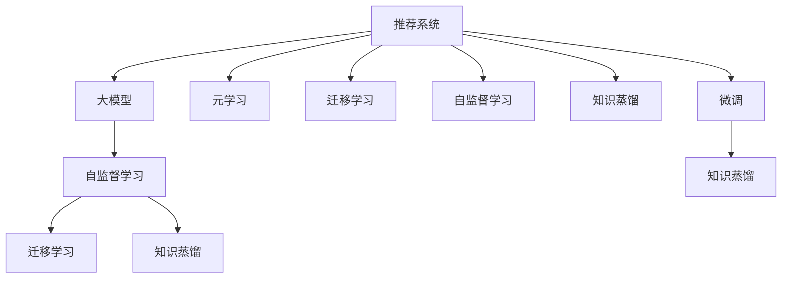

                 

# 推荐系统中的大模型元知识学习与迁移

> 关键词：推荐系统,元学习,迁移学习,大模型,自监督学习,知识蒸馏,元知识优化

## 1. 背景介绍

### 1.1 问题由来

随着互联网的迅猛发展，推荐系统在电商平台、社交网络、视频平台等场景中扮演着越来越重要的角色。推荐系统的核心任务是预测用户对物品的偏好和评分，从而为其推荐最符合其兴趣的物品。传统的推荐系统通常基于用户行为数据，如点击、浏览、评分等，通过协同过滤、矩阵分解等方法进行推荐。然而，这些基于数据的推荐方法在面对冷启动问题、数据稀疏性、用户兴趣动态变化等方面时，效果往往大打折扣。

近年来，随着深度学习技术的发展，基于神经网络的推荐系统逐渐成为推荐领域的热门研究方向。其中，基于大模型(如BERT、GPT等)的推荐方法，由于其强大的语言理解和生成能力，已经被应用于推荐系统中，并取得了不错的效果。但此类方法仍存在计算资源消耗巨大、模型可解释性不足等问题。因此，如何在大模型上高效学习推荐系统的元知识，成为当前研究的重要课题。

### 1.2 问题核心关键点

推荐系统中的元知识学习是指在特定推荐任务上，利用大模型学习用户的推荐偏好、物品的特征等元信息，从而提升推荐精度。其核心在于如何将通用大模型的泛化能力转化为特定推荐任务的性能提升，即所谓的“知识迁移”。具体来说，在推荐任务上应用元知识学习，可以显著提升模型在少量标注数据上的泛化能力，实现从预训练到微调的跨越。

元知识学习主要包含两个关键步骤：1)在大模型上进行自监督学习，获取推荐相关的元知识；2)在推荐任务上进行微调，实现元知识的迁移应用。

## 2. 核心概念与联系

### 2.1 核心概念概述

为更好地理解推荐系统中的大模型元知识学习与迁移方法，本节将介绍几个密切相关的核心概念：

- **推荐系统(Recommendation System)**：通过分析用户行为数据，预测用户对物品的偏好和评分，从而为其推荐最符合其兴趣的物品。推荐系统分为显式推荐和隐式推荐两种类型。
- **大模型(Large Model)**：如BERT、GPT等大规模预训练语言模型，通过海量无标签文本数据的自监督学习，学习到丰富的语言知识和常识，具备强大的语言理解和生成能力。
- **元学习(Meta-Learning)**：学习如何学习，即通过少量数据集学习模型适应新任务的策略，实现从预训练到微调的跨越。
- **迁移学习(Transfer Learning)**：将一个领域学习到的知识，迁移到另一个不同但相关的领域。在推荐任务中，可以通过微调实现通用大模型的知识迁移。
- **自监督学习(Self-Supervised Learning)**：利用无标签数据进行模型训练，学习模型的特征表示，以更好地适应特定任务。
- **知识蒸馏(Knowledge Distillation)**：通过教师模型与学生模型的知识迁移，提升学生模型的性能。在推荐任务中，可以通过知识蒸馏实现大模型到小模型的迁移。

这些核心概念之间的逻辑关系可以通过以下Mermaid流程图来展示：



这个流程图展示了大语言模型的核心概念及其之间的关系：

1. 推荐系统通过用户行为数据进行训练和推理。
2. 大模型在大规模无标签文本数据上进行自监督学习。
3. 元学习通过学习如何学习，实现从预训练到微调的跨越。
4. 迁移学习将通用大模型的知识迁移到推荐任务中。
5. 自监督学习利用无标签数据训练模型。
6. 知识蒸馏实现教师模型与学生模型的知识迁移。
7. 微调通过有监督训练优化推荐模型，实现元知识的迁移应用。

这些概念共同构成了推荐系统中的大模型元知识学习与迁移框架，使得推荐系统能够利用大模型的泛化能力，提升模型在特定推荐任务上的表现。

## 3. 核心算法原理 & 具体操作步骤

### 3.1 算法原理概述

推荐系统中的大模型元知识学习与迁移，本质上是一个基于元学习的推荐系统设计问题。其核心思想是：利用大模型在大规模无标签数据上学习的元知识，通过微调和知识蒸馏等技术，实现推荐模型的性能提升。

形式化地，假设推荐系统中的用户-物品交互数据集为 $D=\{(x_i,y_i)\}_{i=1}^N, x_i \in \mathcal{X}, y_i \in \{0,1\}$，其中 $x_i$ 为用户的历史行为数据，$y_i$ 为用户对物品的评分。目标是最小化预测误差：

$$
\min_{\theta} \mathcal{L}(\theta,D)
$$

其中 $\theta$ 为推荐模型的参数，$\mathcal{L}$ 为损失函数。通常使用均方误差或交叉熵损失等。

为了提升模型的泛化能力，我们通常在大模型上进行自监督学习，获取元知识。自监督学习的目标是学习模型对数据的基本理解，如用户兴趣、物品特征等。然后，通过微调或知识蒸馏等技术，将大模型的元知识迁移到推荐任务中，提升模型的推荐性能。

### 3.2 算法步骤详解

推荐系统中的大模型元知识学习与迁移一般包括以下几个关键步骤：

**Step 1: 准备预训练模型和大规模无标签数据集**
- 选择合适的预训练语言模型 $M_{\theta}$ 作为初始化参数，如 BERT、GPT 等。
- 准备大规模无标签数据集，如新闻、维基百科、在线评论等，用于在大模型上进行自监督学习。

**Step 2: 在大模型上进行自监督学习**
- 在大模型上进行自监督学习，如掩码语言模型、预测下一句等任务，学习到推荐相关的元知识。
- 可以使用基于预训练模型的微调或知识蒸馏方法，获取元知识。

**Step 3: 设计推荐任务**
- 根据具体推荐任务设计适当的损失函数和优化目标。
- 选择合适的模型结构，如基于 Transformer 的神经网络等。

**Step 4: 在推荐任务上进行微调**
- 使用推荐任务的有标签数据集，对模型进行微调。
- 可以采用正则化技术、数据增强等手段，避免过拟合。

**Step 5: 应用知识蒸馏**
- 将自监督学习得到的元知识通过知识蒸馏的方法，转移到推荐任务中。
- 可以使用教师模型与学生模型的知识蒸馏方法，提升学生模型的泛化能力。

**Step 6: 评估与部署**
- 在推荐任务的数据集上评估模型性能。
- 使用微调后的推荐模型，对新用户和新物品进行推荐。

### 3.3 算法优缺点

推荐系统中的大模型元知识学习与迁移方法具有以下优点：
1. 通用适用。适用于各种推荐任务，如电商推荐、社交网络推荐、视频推荐等，可以通过微调获取任务特定知识。
2. 泛化能力强。利用大模型在大规模无标签数据上学习的元知识，可以有效提升模型在少量标注数据上的泛化能力。
3. 计算效率高。利用大模型的预训练知识，可以显著减少推荐模型微调的计算资源消耗。
4. 模型精度高。通过微调和知识蒸馏等技术，可以提升推荐模型的精度和鲁棒性。

同时，该方法也存在一定的局限性：
1. 数据依赖性高。需要大规模无标签数据集进行预训练，获取推荐相关的元知识。
2. 参数复杂。大模型具有亿计的参数，微调和知识蒸馏的计算复杂度较高。
3. 可解释性不足。推荐模型的决策过程难以解释，难以进行调试和优化。
4. 应用场景有限。该方法主要应用于具有丰富文本数据的推荐场景，对于图像、音频等模态的推荐任务，适用性有限。

尽管存在这些局限性，但就目前而言，基于大模型元知识学习与迁移的方法仍是最主流和有效的推荐系统设计范式。未来相关研究的重点在于如何进一步降低对大规模数据集的依赖，提高模型的泛化能力和计算效率，同时兼顾可解释性和应用场景的多样性。

### 3.4 算法应用领域

推荐系统中的大模型元知识学习与迁移方法，在电商、社交、视频等诸多领域已经得到了广泛的应用，覆盖了几乎所有常见的推荐任务，例如：

- 电商推荐：根据用户的历史购买记录、浏览行为，为其推荐相似的商品。
- 社交网络推荐：根据用户的兴趣、关注关系，推荐潜在的朋友、兴趣团体等。
- 视频推荐：根据用户的观看历史、评分，推荐相似的视频内容。
- 新闻推荐：根据用户的阅读历史、点击行为，推荐相关的新闻文章。

除了上述这些经典任务外，大模型元知识学习与迁移也被创新性地应用到更多场景中，如个性化广告、内容生成、智能导购等，为推荐技术带来了全新的突破。随着预训练模型和元学习方法的不断进步，相信推荐系统必将在更广阔的应用领域大放异彩。

## 4. 数学模型和公式 & 详细讲解

### 4.1 数学模型构建

本节将使用数学语言对推荐系统中的大模型元知识学习与迁移过程进行更加严格的刻画。

假设推荐系统中的用户-物品交互数据集为 $D=\{(x_i,y_i)\}_{i=1}^N, x_i \in \mathcal{X}, y_i \in \{0,1\}$。令推荐模型为 $M_{\theta}:\mathcal{X} \rightarrow \mathbb{R}$，其中 $\mathcal{X}$ 为用户行为数据，$\mathbb{R}$ 为输出空间。

定义推荐模型 $M_{\theta}$ 在数据样本 $(x,y)$ 上的损失函数为 $\ell(M_{\theta}(x),y)$，则在数据集 $D$ 上的经验风险为：

$$
\mathcal{L}(\theta) = \frac{1}{N} \sum_{i=1}^N \ell(M_{\theta}(x_i),y_i)
$$

通常使用均方误差损失或交叉熵损失等。假设在大模型上进行自监督学习，学习到元知识 $K$，则推荐模型的目标函数为：

$$
\mathcal{L}(\theta) = \mathcal{L}_{\text{task}}(\theta) + \alpha \mathcal{L}_{\text{ssl}}(\theta,K)
$$

其中 $\mathcal{L}_{\text{ssl}}(\theta,K)$ 为自监督学习的损失函数，$\alpha$ 为权衡项，控制元知识在推荐模型中的权重。自监督学习的目标是最大化模型的泛化能力，如预测下一句、掩码语言模型等。

### 4.2 公式推导过程

以下我们以基于 BERT 的推荐系统为例，推导推荐模型在推荐任务上的损失函数及其梯度计算公式。

假设推荐模型为 $M_{\theta}:\mathcal{X} \rightarrow \mathbb{R}$，其中 $\mathcal{X}$ 为用户行为数据，$\mathbb{R}$ 为输出空间。令元知识为 $K$，则推荐模型的损失函数为：

$$
\mathcal{L}(\theta) = \mathcal{L}_{\text{task}}(\theta) + \alpha \mathcal{L}_{\text{ssl}}(\theta,K)
$$

其中 $\mathcal{L}_{\text{task}}(\theta)$ 为推荐任务上的损失函数，$\mathcal{L}_{\text{ssl}}(\theta,K)$ 为自监督学习的损失函数。

假设推荐任务为电商推荐，用户行为数据为 $x_i$，推荐模型 $M_{\theta}(x_i)$ 输出用户的评分 $y_i$。推荐任务的损失函数可以定义为均方误差损失：

$$
\mathcal{L}_{\text{task}}(\theta) = \frac{1}{N} \sum_{i=1}^N (y_i - M_{\theta}(x_i))^2
$$

对于自监督学习，以预测下一句为例，假设推荐模型 $M_{\theta}$ 输出下句话的概率分布 $P(y|x)$，则自监督学习的损失函数可以定义为：

$$
\mathcal{L}_{\text{ssl}}(\theta,K) = \frac{1}{N} \sum_{i=1}^N -y_i \log P(y|x)
$$

将上述损失函数代入目标函数中，得：

$$
\mathcal{L}(\theta) = \frac{1}{N} \sum_{i=1}^N (y_i - M_{\theta}(x_i))^2 + \alpha \frac{1}{N} \sum_{i=1}^N -y_i \log P(y|x)
$$

根据链式法则，损失函数对参数 $\theta$ 的梯度为：

$$
\frac{\partial \mathcal{L}(\theta)}{\partial \theta} = \frac{2}{N} \sum_{i=1}^N (y_i - M_{\theta}(x_i)) \frac{\partial M_{\theta}(x_i)}{\partial \theta} - \alpha \frac{1}{N} \sum_{i=1}^N y_i \frac{\partial \log P(y|x)}{\partial \theta}
$$

其中 $\frac{\partial M_{\theta}(x_i)}{\partial \theta}$ 和 $\frac{\partial \log P(y|x)}{\partial \theta}$ 可进一步递归展开，利用自动微分技术完成计算。

## 5. 项目实践：代码实例和详细解释说明

### 5.1 开发环境搭建

在进行推荐系统中的大模型元知识学习与迁移实践前，我们需要准备好开发环境。以下是使用Python进行PyTorch开发的环境配置流程：

1. 安装Anaconda：从官网下载并安装Anaconda，用于创建独立的Python环境。

2. 创建并激活虚拟环境：
```bash
conda create -n pytorch-env python=3.8 
conda activate pytorch-env
```

3. 安装PyTorch：根据CUDA版本，从官网获取对应的安装命令。例如：
```bash
conda install pytorch torchvision torchaudio cudatoolkit=11.1 -c pytorch -c conda-forge
```

4. 安装Transformers库：
```bash
pip install transformers
```

5. 安装各类工具包：
```bash
pip install numpy pandas scikit-learn matplotlib tqdm jupyter notebook ipython
```

完成上述步骤后，即可在`pytorch-env`环境中开始微调实践。

### 5.2 源代码详细实现

下面我们以电商推荐任务为例，给出使用Transformers库对BERT模型进行推荐系统微调的PyTorch代码实现。

首先，定义推荐任务的数据处理函数：

```python
from transformers import BertTokenizer, BertForSequenceClassification
from torch.utils.data import Dataset, DataLoader
import torch

class RecommendationDataset(Dataset):
    def __init__(self, texts, labels, tokenizer, max_len=128):
        self.texts = texts
        self.labels = labels
        self.tokenizer = tokenizer
        self.max_len = max_len
        
    def __len__(self):
        return len(self.texts)
    
    def __getitem__(self, item):
        text = self.texts[item]
        label = self.labels[item]
        
        encoding = self.tokenizer(text, return_tensors='pt', max_length=self.max_len, padding='max_length', truncation=True)
        input_ids = encoding['input_ids'][0]
        attention_mask = encoding['attention_mask'][0]
        
        # 对标签进行编码
        encoded_label = label2id[label] # label为0或1
        labels = torch.tensor(encoded_label, dtype=torch.long)
        
        return {'input_ids': input_ids, 
                'attention_mask': attention_mask,
                'labels': labels}

# 标签与id的映射
label2id = {0: 0, 1: 1}
id2label = {v: k for k, v in label2id.items()}

# 创建dataset
tokenizer = BertTokenizer.from_pretrained('bert-base-cased')

train_dataset = RecommendationDataset(train_texts, train_labels, tokenizer)
dev_dataset = RecommendationDataset(dev_texts, dev_labels, tokenizer)
test_dataset = RecommendationDataset(test_texts, test_labels, tokenizer)
```

然后，定义模型和优化器：

```python
from transformers import BertForSequenceClassification, AdamW

model = BertForSequenceClassification.from_pretrained('bert-base-cased', num_labels=2)

optimizer = AdamW(model.parameters(), lr=2e-5)
```

接着，定义训练和评估函数：

```python
from tqdm import tqdm

device = torch.device('cuda') if torch.cuda.is_available() else torch.device('cpu')
model.to(device)

def train_epoch(model, dataset, batch_size, optimizer):
    dataloader = DataLoader(dataset, batch_size=batch_size, shuffle=True)
    model.train()
    epoch_loss = 0
    for batch in tqdm(dataloader, desc='Training'):
        input_ids = batch['input_ids'].to(device)
        attention_mask = batch['attention_mask'].to(device)
        labels = batch['labels'].to(device)
        model.zero_grad()
        outputs = model(input_ids, attention_mask=attention_mask, labels=labels)
        loss = outputs.loss
        epoch_loss += loss.item()
        loss.backward()
        optimizer.step()
    return epoch_loss / len(dataloader)

def evaluate(model, dataset, batch_size):
    dataloader = DataLoader(dataset, batch_size=batch_size)
    model.eval()
    preds, labels = [], []
    with torch.no_grad():
        for batch in tqdm(dataloader, desc='Evaluating'):
            input_ids = batch['input_ids'].to(device)
            attention_mask = batch['attention_mask'].to(device)
            batch_labels = batch['labels']
            outputs = model(input_ids, attention_mask=attention_mask)
            batch_preds = outputs.logits.argmax(dim=2).to('cpu').tolist()
            batch_labels = batch_labels.to('cpu').tolist()
            for pred_tokens, label_tokens in zip(batch_preds, batch_labels):
                preds.append(pred_tokens[:len(label_tokens)])
                labels.append(label_tokens)
                
    print(classification_report(labels, preds))
```

最后，启动训练流程并在测试集上评估：

```python
epochs = 5
batch_size = 16

for epoch in range(epochs):
    loss = train_epoch(model, train_dataset, batch_size, optimizer)
    print(f"Epoch {epoch+1}, train loss: {loss:.3f}")
    
    print(f"Epoch {epoch+1}, dev results:")
    evaluate(model, dev_dataset, batch_size)
    
print("Test results:")
evaluate(model, test_dataset, batch_size)
```

以上就是使用PyTorch对BERT进行推荐系统微调的完整代码实现。可以看到，得益于Transformers库的强大封装，我们可以用相对简洁的代码完成BERT模型的加载和微调。

### 5.3 代码解读与分析

让我们再详细解读一下关键代码的实现细节：

**RecommendationDataset类**：
- `__init__`方法：初始化文本、标签、分词器等关键组件。
- `__len__`方法：返回数据集的样本数量。
- `__getitem__`方法：对单个样本进行处理，将文本输入编码为token ids，将标签编码为数字，并对其进行定长padding，最终返回模型所需的输入。

**label2id和id2label字典**：
- 定义了标签与数字id之间的映射关系，用于将标签转换为模型输入。

**训练和评估函数**：
- 使用PyTorch的DataLoader对数据集进行批次化加载，供模型训练和推理使用。
- 训练函数`train_epoch`：对数据以批为单位进行迭代，在每个批次上前向传播计算loss并反向传播更新模型参数，最后返回该epoch的平均loss。
- 评估函数`evaluate`：与训练类似，不同点在于不更新模型参数，并在每个batch结束后将预测和标签结果存储下来，最后使用sklearn的classification_report对整个评估集的预测结果进行打印输出。

**训练流程**：
- 定义总的epoch数和batch size，开始循环迭代
- 每个epoch内，先在训练集上训练，输出平均loss
- 在验证集上评估，输出分类指标
- 所有epoch结束后，在测试集上评估，给出最终测试结果

可以看到，PyTorch配合Transformers库使得BERT微调的代码实现变得简洁高效。开发者可以将更多精力放在数据处理、模型改进等高层逻辑上，而不必过多关注底层的实现细节。

当然，工业级的系统实现还需考虑更多因素，如模型的保存和部署、超参数的自动搜索、更灵活的任务适配层等。但核心的微调范式基本与此类似。

## 6. 实际应用场景

### 6.1 电商平台推荐

基于大模型元知识学习与迁移的推荐系统，可以广泛应用于电商平台推荐场景。电商推荐系统通常需要处理海量用户行为数据，且用户兴趣具有动态变化的特点。使用大模型元知识学习与迁移方法，可以在较少标注数据的情况下，快速提升推荐模型的泛化能力和精度。

在技术实现上，可以收集电商平台的商品浏览、购买、评价等数据，将其转化为推荐任务的数据集。然后，利用BERT等大模型进行自监督学习，获取元知识。在推荐任务上进行微调，学习用户对商品评分和购买的偏好，最终构建推荐模型，为用户推荐相似商品或相关商品。此外，可以通过知识蒸馏的方法，将大模型的元知识迁移到更轻量级的推荐模型中，实现快速推理，提高系统响应速度。

### 6.2 视频平台推荐

视频平台推荐系统需要处理视频内容的标签、时长、观看历史等数据，对用户进行个性化推荐。传统的基于协同过滤和矩阵分解的方法，在面对大量冷启动用户和长时间序列数据时，效果往往不理想。

基于大模型元知识学习与迁移的推荐方法，可以利用视频内容的多模态特征，在无标签数据上进行预训练，学习到元知识。然后，通过微调和知识蒸馏的方法，提升推荐模型对视频内容的理解和推荐能力。在推荐任务上，可以加入图像和音频等多模态数据，实现更加全面、精准的推荐效果。

### 6.3 社交网络推荐

社交网络推荐系统需要根据用户的关系、兴趣等社交信息，推荐潜在的朋友、兴趣团体等。传统的推荐方法往往只依赖用户的行为数据，难以捕捉到更丰富的社交特征。

使用大模型元知识学习与迁移方法，可以在无标签社交数据上进行预训练，学习到用户的兴趣和关系元知识。然后，通过微调的方法，将元知识迁移到推荐任务中，构建推荐模型。在推荐任务上，可以加入社交网络中的互动信息，如点赞、评论、分享等，实现更加个性化、互动化的推荐。

### 6.4 未来应用展望

随着大模型元知识学习与迁移方法的不断发展，推荐系统将在更多领域得到应用，为各行各业带来变革性影响。

在智慧医疗领域，基于元学习的推荐系统可以辅助医生诊断和推荐治疗方案，提升医疗服务的智能化水平。

在智能教育领域，推荐系统可以用于推荐个性化学习内容，因材施教，促进教育公平，提高教学质量。

在智慧城市治理中，推荐系统可以用于推荐智能家居设备、智慧出行方案等，提高城市管理的自动化和智能化水平，构建更安全、高效的未来城市。

此外，在企业生产、社会治理、文娱传媒等众多领域，基于大模型的推荐系统也将不断涌现，为经济社会发展注入新的动力。相信随着技术的日益成熟，元学习范式将成为推荐系统设计的重要方向，推动推荐技术在各个垂直行业的广泛应用。

## 7. 工具和资源推荐

### 7.1 学习资源推荐

为了帮助开发者系统掌握推荐系统中的大模型元知识学习与迁移的理论基础和实践技巧，这里推荐一些优质的学习资源：

1. 《Deep Learning for Recommender Systems》系列博文：由大模型技术专家撰写，详细介绍了深度学习在推荐系统中的应用，涵盖自监督学习、元学习等多个方向。

2. 《Recommender Systems》课程：南洋理工大学的推荐系统课程，涵盖了推荐系统基础、协同过滤、内容推荐等核心内容，提供丰富的实践案例。

3. 《Reinforcement Learning for Recommendation Systems》书籍：介绍了强化学习在推荐系统中的应用，如序列强化学习、多臂乐队问题等。

4. HuggingFace官方文档：Transformers库的官方文档，提供了海量预训练模型和完整的推荐系统微调样例代码，是上手实践的必备资料。

5. KDD比赛推荐系统竞赛：KDD比赛每年都会举办推荐系统竞赛，是推荐系统应用领域的最新实践和技术前沿。

通过对这些资源的学习实践，相信你一定能够快速掌握推荐系统中的大模型元知识学习与迁移的精髓，并用于解决实际的推荐问题。
###  7.2 开发工具推荐

高效的开发离不开优秀的工具支持。以下是几款用于大模型元知识学习与迁移开发的常用工具：

1. PyTorch：基于Python的开源深度学习框架，灵活动态的计算图，适合快速迭代研究。大部分预训练语言模型都有PyTorch版本的实现。

2. TensorFlow：由Google主导开发的开源深度学习框架，生产部署方便，适合大规模工程应用。同样有丰富的预训练语言模型资源。

3. Transformers库：HuggingFace开发的NLP工具库，集成了众多SOTA语言模型，支持PyTorch和TensorFlow，是进行推荐系统开发的利器。

4. Weights & Biases：模型训练的实验跟踪工具，可以记录和可视化模型训练过程中的各项指标，方便对比和调优。与主流深度学习框架无缝集成。

5. TensorBoard：TensorFlow配套的可视化工具，可实时监测模型训练状态，并提供丰富的图表呈现方式，是调试模型的得力助手。

6. Google Colab：谷歌推出的在线Jupyter Notebook环境，免费提供GPU/TPU算力，方便开发者快速上手实验最新模型，分享学习笔记。

合理利用这些工具，可以显著提升大模型元知识学习与迁移任务的开发效率，加快创新迭代的步伐。

### 7.3 相关论文推荐

大模型元知识学习与迁移技术的发展源于学界的持续研究。以下是几篇奠基性的相关论文，推荐阅读：

1. "A Survey on Recommendation Systems"（推荐系统综述）：IEEE journal on recommended systems，涵盖推荐系统基础、协同过滤、内容推荐等多个方向。

2. "Neural Collaborative Filtering"（神经协同过滤）：提出基于深度学习的协同过滤方法，提升推荐模型的泛化能力。

3. "Knowledge Distillation"（知识蒸馏）：提出教师模型与学生模型的知识迁移方法，提升推荐模型的性能。

4. "Meta-Learning for Personalized Recommendation"（元学习在推荐中的应用）：提出基于元学习的推荐系统设计方法，通过学习如何学习，实现从预训练到微调的跨越。

5. "Practical Recommender Systems"（实用推荐系统）：介绍推荐系统的实际应用，涵盖多种推荐算法和优化策略。

这些论文代表了大模型元知识学习与迁移技术的发展脉络。通过学习这些前沿成果，可以帮助研究者把握学科前进方向，激发更多的创新灵感。

## 8. 总结：未来发展趋势与挑战

### 8.1 总结

本文对推荐系统中的大模型元知识学习与迁移方法进行了全面系统的介绍。首先阐述了大模型元知识学习与迁移的研究背景和意义，明确了元知识学习在提升推荐模型性能方面的独特价值。其次，从原理到实践，详细讲解了元学习在大模型推荐系统中的数学原理和关键步骤，给出了推荐系统开发的完整代码实例。同时，本文还广泛探讨了元知识学习在电商、视频、社交等推荐任务中的应用前景，展示了元知识学习的巨大潜力。此外，本文精选了元知识学习的各类学习资源，力求为读者提供全方位的技术指引。

通过本文的系统梳理，可以看到，基于大模型元知识学习与迁移方法，推荐系统能够利用大模型的泛化能力，提升模型在特定推荐任务上的性能。未来，伴随预训练语言模型和元学习方法的不断进步，基于元学习的推荐系统必将在更广阔的应用领域大放异彩，深刻影响推荐技术的产业化进程。

### 8.2 未来发展趋势

展望未来，推荐系统中的大模型元知识学习与迁移技术将呈现以下几个发展趋势：

1. 模型规模持续增大。随着算力成本的下降和数据规模的扩张，预训练语言模型的参数量还将持续增长。超大规模语言模型蕴含的丰富语言知识，有望支撑更加复杂多变的推荐任务。

2. 元学习方法日趋多样。除了传统的自监督学习和知识蒸馏，未来会涌现更多元学习范式，如强化学习、生成对抗网络等，以提升推荐模型的泛化能力和鲁棒性。

3. 持续学习成为常态。随着数据分布的不断变化，推荐模型也需要持续学习新知识以保持性能。如何在不遗忘原有知识的同时，高效吸收新样本信息，将成为重要的研究课题。

4. 数据依赖性降低。未来的大模型元知识学习与迁移方法将更多依赖于少样本学习、元优化器等技术，降低对大规模数据集的依赖，提升推荐模型的可扩展性。

5. 参数高效优化。开发更加参数高效的元学习算法，如元优化器、元梯度等，在参数量较多的推荐模型中，实现高效优化。

6. 应用场景广泛。元学习范式不仅能应用于电商、社交等推荐任务，还可以拓展到医疗、教育、城市治理等诸多领域，为不同场景下的推荐系统设计提供新的思路。

以上趋势凸显了大模型元知识学习与迁移技术的广阔前景。这些方向的探索发展，必将进一步提升推荐系统的性能和应用范围，为推荐技术在各行各业的广泛应用提供坚实的基础。

### 8.3 面临的挑战

尽管大模型元知识学习与迁移技术已经取得了瞩目成就，但在迈向更加智能化、普适化应用的过程中，它仍面临着诸多挑战：

1. 数据依赖性高。需要大规模无标签数据集进行预训练，获取推荐相关的元知识。对于长尾应用场景，难以获得充足的高质量标注数据，成为制约元知识学习的瓶颈。

2. 模型复杂度高。大模型具有亿计的参数，微调和知识蒸馏的计算复杂度较高。对于实时性要求较高的推荐系统，如何快速训练和推理，是一大难题。

3. 可解释性不足。元学习模型的决策过程难以解释，难以进行调试和优化。对于医疗、金融等高风险应用，算法的可解释性和可审计性尤为重要。

4. 泛化能力有限。当前元学习模型在面对新领域、新任务时，泛化能力仍有所不足。如何提高元学习的泛化能力，是未来的重要研究方向。

5. 计算资源消耗大。元学习模型的训练和推理需要大量的计算资源，对于硬件设施和算力要求较高。如何降低计算资源消耗，实现模型的高效部署，将是重要的优化方向。

尽管存在这些挑战，但就目前而言，基于大模型元知识学习与迁移的方法仍是最主流和有效的推荐系统设计范式。未来相关研究的重点在于如何进一步降低对大规模数据集的依赖，提高模型的泛化能力和计算效率，同时兼顾可解释性和应用场景的多样性。

### 8.4 研究展望

面对大模型元知识学习与迁移所面临的种种挑战，未来的研究需要在以下几个方面寻求新的突破：

1. 探索无监督和半监督元学习方法。摆脱对大规模标注数据的依赖，利用自监督学习、主动学习等无监督和半监督范式，最大限度利用非结构化数据，实现更加灵活高效的元知识学习。

2. 研究参数高效和计算高效的元学习算法。开发更加参数高效的元学习算法，在固定大部分预训练参数的同时，只更新极少量的元学习参数。同时优化元学习模型的计算图，减少前向传播和反向传播的资源消耗，实现更加轻量级、实时性的部署。

3. 引入更多先验知识。将符号化的先验知识，如知识图谱、逻辑规则等，与神经网络模型进行巧妙融合，引导元学习过程学习更准确、合理的元知识。同时加强不同模态数据的整合，实现视觉、语音等多模态信息与文本信息的协同建模。

4. 结合因果分析和博弈论工具。将因果分析方法引入元学习模型，识别出模型决策的关键特征，增强元学习模型的因果性和逻辑性。借助博弈论工具刻画人机交互过程，主动探索并规避元学习模型的脆弱点，提高系统稳定性。

5. 纳入伦理道德约束。在元学习目标中引入伦理导向的评估指标，过滤和惩罚有偏见、有害的输出倾向。同时加强人工干预和审核，建立元学习模型的监管机制，确保输出符合人类价值观和伦理道德。

这些研究方向的探索，必将引领大模型元知识学习与迁移技术迈向更高的台阶，为构建安全、可靠、可解释、可控的智能系统铺平道路。面向未来，大模型元知识学习与迁移技术还需要与其他人工智能技术进行更深入的融合，如知识表示、因果推理、强化学习等，多路径协同发力，共同推动推荐系统的进步。只有勇于创新、敢于突破，才能不断拓展元知识学习的边界，让推荐技术更好地造福人类社会。

## 9. 附录：常见问题与解答

**Q1：大模型元知识学习与迁移是否适用于所有推荐任务？**

A: 大模型元知识学习与迁移方法适用于大多数推荐任务，如电商推荐、视频推荐、社交推荐等。但对于一些特定领域的任务，如医学、法律等，仅仅依靠通用语料预训练的模型可能难以很好地适应。此时需要在特定领域语料上进一步预训练，再进行元知识学习与迁移。

**Q2：元学习过程中如何选择合适的元学习策略？**

A: 元学习策略的选择需要根据具体任务和数据特点进行优化。常用的元学习策略包括自监督学习、知识蒸馏、对抗训练等。在电商推荐任务中，可以采用掩码语言模型、预测下一句等自监督学习任务，获取元知识。在视频推荐任务中，可以采用联合嵌入、协同过滤等策略，提升元学习的泛化能力。在社交推荐任务中，可以引入社交网络中的互动信息，实现更加个性化、互动化的推荐。

**Q3：推荐系统中的元知识学习与迁移是否可以与传统推荐方法结合？**

A: 元知识学习与迁移方法可以与传统推荐方法结合使用。传统推荐方法通常依赖于用户行为数据，而元知识学习与迁移方法可以利用大模型在大规模无标签数据上学习的元知识，提升推荐模型的泛化能力和精度。两者可以互补，共同提升推荐系统的性能。

**Q4：推荐系统中的元知识学习与迁移是否需要大规模数据集？**

A: 推荐系统中的元知识学习与迁移方法需要大规模无标签数据集进行预训练，获取推荐相关的元知识。对于长尾应用场景，难以获得充足的高质量标注数据，成为制约元知识学习的瓶颈。未来，通过引入无监督和半监督元学习方法，可以降低对大规模数据集的依赖。

**Q5：元学习过程中如何缓解过拟合问题？**

A: 元学习过程中，过拟合是一个常见的问题。缓解过拟合的方法包括数据增强、正则化、对抗训练等。数据增强可以扩充训练集，如回译、近义替换等。正则化可以避免过拟合，如L2正则、Dropout等。对抗训练可以增强模型的鲁棒性，防止过拟合。通过合理组合这些方法，可以最大限度地提高元学习的泛化能力。

**Q6：元学习过程中如何提高模型的可解释性？**

A: 元学习模型的决策过程难以解释，难以进行调试和优化。提高元学习模型的可解释性，是未来元学习研究的重要方向。常用的方法包括引入可解释性模型、构建模型可视化工具等。此外，还可以通过引入元优化器、元梯度等方法，提高元学习的可解释性和可解释性。

**Q7：元学习过程中如何提升模型的泛化能力？**

A: 提升元学习的泛化能力，是未来元学习研究的重要方向。常用的方法包括引入多模态信息、引入先验知识、优化元学习算法等。引入多模态信息可以提升元学习的泛化能力，如在推荐任务中加入图像、音频等多模态数据。引入先验知识可以指导元学习过程，如知识图谱、逻辑规则等。优化元学习算法可以提升元学习的泛化能力，如元优化器、元梯度等。

这些研究方向的探索，必将引领大模型元知识学习与迁移技术迈向更高的台阶，为构建安全、可靠、可解释、可控的智能系统铺平道路。面向未来，大模型元知识学习与迁移技术还需要与其他人工智能技术进行更深入的融合，如知识表示、因果推理、强化学习等，多路径协同发力，共同推动推荐系统的进步。只有勇于创新、敢于突破，才能不断拓展元知识学习的边界，让推荐技术更好地造福人类社会。

---

作者：禅与计算机程序设计艺术 / Zen and the Art of Computer Programming

