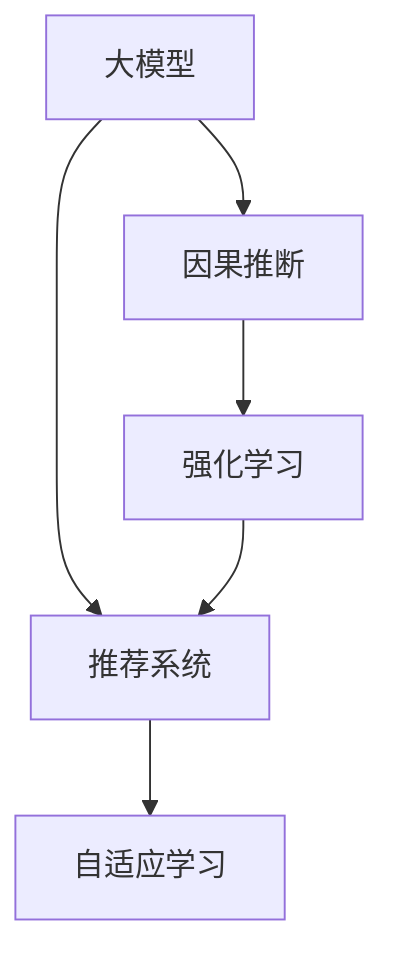

                 

# 推荐系统中的大模型因果推断应用

> 关键词：大模型, 因果推断, 推荐系统, 强化学习, 自适应学习, 深度强化学习, 强化学习范式, 个性化推荐, 计算图

## 1. 背景介绍

在当前信息爆炸的时代，如何从海量数据中提取有价值的信息，为用户推荐其感兴趣的内容，成为了一个亟待解决的问题。推荐系统正是为了应对这一挑战而诞生的。推荐系统通过分析用户的历史行为数据，以及与之相关的物品属性信息，预测用户可能感兴趣的内容，并据此为用户推荐个性化的物品。

推荐系统的核心目标在于提升用户的满意度，进而增强用户的粘性和忠诚度。传统的推荐系统多基于用户和物品的协同过滤方法，通过分析用户历史行为和物品属性之间的相似性进行推荐。但这种方法的局限性在于，它无法对用户的决策过程进行建模，无法解释为什么用户会喜欢某件物品，也无法处理复杂的因果关系。而随着深度学习和大模型技术的兴起，推荐系统逐渐向基于因果推断的范式演进，开始探索如何从用户的决策行为中提取更深层次的因果信息，构建更精确、更具解释性的推荐模型。

大模型，特别是具有自适应能力的深度学习模型，为推荐系统的因果推断提供了新的机遇。本文章将探讨在推荐系统中应用大模型的因果推断技术，解释其实现原理、操作步骤以及应用场景，并通过案例分析展示其性能。

## 2. 核心概念与联系

### 2.1 核心概念概述

在推荐系统中应用大模型的因果推断技术，涉及以下核心概念：

- **大模型**：即深度神经网络模型，如Transformer、BERT等，具有强大的表示学习和复杂建模能力，能够处理高维、非线性数据。
- **因果推断**：通过数据驱动的方式，从观察到的统计关联中推断出因果关系，用于预测和决策的建模方法。
- **推荐系统**：通过分析用户的历史行为数据和物品属性信息，预测用户可能感兴趣的内容，并进行个性化推荐的技术。
- **强化学习**：一种通过环境反馈不断优化决策的机器学习范式，常用于构建推荐系统中的推荐策略。
- **自适应学习**：根据用户行为和环境变化，动态调整模型参数和策略，提升推荐效果和用户满意度。

这些核心概念之间的关系可以通过以下Mermaid流程图来展示：



## 3. 核心算法原理 & 具体操作步骤

### 3.1 算法原理概述

在推荐系统中应用大模型的因果推断技术，主要基于强化学习范式，通过模拟用户和物品之间的交互，构建因果模型，以提升推荐效果。其核心思想是通过观察用户的行为数据，对用户的行为模式进行建模，并基于此构建推荐策略。

在强化学习范式中，推荐系统被视为一个智能体，与环境（用户和物品的交互）进行交互，通过不断的试错（探索）和反馈（利用），优化推荐策略。具体而言，系统会先观察用户对某个物品的交互行为（如点击、购买、评分等），然后根据这些行为数据更新模型参数，预测用户对下一个物品的偏好，并据此推荐。通过不断的迭代优化，推荐系统的策略会逐渐趋于最优。

### 3.2 算法步骤详解

基于大模型因果推断的推荐系统一般包括以下关键步骤：

**Step 1: 准备数据集**

- 收集用户的历史行为数据，包括用户与物品的交互记录（如点击、购买、评分等）。
- 收集物品的属性信息，如标题、描述、标签等。
- 将用户与物品的交互数据转化为适合模型的格式，如TensorFlow Example或Pandas DataFrame。

**Step 2: 构建推荐模型**

- 选择合适的深度学习模型（如自回归模型、自编码模型、Transformer等），作为推荐系统的基础。
- 设计推荐模型的架构，包括输入层、中间层和输出层。
- 定义推荐策略的损失函数，如交叉熵损失、均方误差损失等，用于衡量推荐效果与实际行为之间的差距。

**Step 3: 设计因果模型**

- 基于用户行为数据，设计因果推断模型。可以使用因果图、潜变量模型等方法，建模用户行为与物品推荐之间的因果关系。
- 使用强化学习算法，如Q-Learning、DQN等，优化推荐策略。

**Step 4: 进行模型训练**

- 使用训练集数据，对推荐模型进行前向传播和反向传播，计算损失函数。
- 使用梯度下降等优化算法，更新模型参数。
- 在验证集上评估模型性能，调整模型参数和策略。
- 重复训练过程，直至模型收敛。

**Step 5: 评估与部署**

- 在测试集上评估推荐模型的性能，如点击率、购买率、用户满意度等指标。
- 将训练好的模型部署到实际推荐系统中，进行在线推荐。
- 持续收集用户反馈数据，定期更新模型，保持模型的实时性和适应性。

### 3.3 算法优缺点

大模型因果推断在推荐系统中的应用具有以下优点：

1. **高效建模**：大模型能够处理高维、非线性数据，可以更精细地建模用户行为和物品属性的关系。
2. **灵活性**：强化学习范式允许模型根据用户行为和环境变化进行动态调整，提高推荐的个性化和时效性。
3. **解释性强**：因果推断模型能够解释推荐决策的原因，提高用户对推荐结果的信任度。
4. **可扩展性**：大模型可以通过堆叠、拼接等方法进行扩展，提高模型的表现力和适应性。

然而，该方法也存在一些缺点：

1. **数据需求高**：大模型需要大量的数据进行训练，而推荐系统往往面临数据稀疏和异构的问题。
2. **计算成本高**：深度学习模型的训练和推理需要大量的计算资源，对硬件环境的要求较高。
3. **模型复杂度高**：大模型的参数量较大，模型的训练和推理复杂度较高。
4. **对抗样本鲁棒性不足**：模型对对抗样本的鲁棒性较差，可能存在推荐偏差和安全问题。

### 3.4 算法应用领域

大模型因果推断在推荐系统中的应用非常广泛，涵盖了多个领域，例如：

- **电商推荐**：如淘宝、亚马逊等电商平台，通过分析用户浏览、购买、评价等行为数据，为每位用户推荐最感兴趣的商品。
- **内容推荐**：如Netflix、YouTube等视频平台，通过分析用户的观看历史和评分，为每位用户推荐最可能感兴趣的视频内容。
- **广告推荐**：如Facebook、Google等社交媒体平台，通过分析用户的浏览行为和广告点击数据，为每位用户推荐最相关的广告。
- **医疗推荐**：如IBM Watson Health，通过分析医生的诊断和治疗记录，为每位患者推荐最合适的治疗方案。
- **金融推荐**：如财富管理平台，通过分析用户的投资历史和偏好，为每位用户推荐最合适的投资组合。

## 4. 数学模型和公式 & 详细讲解 & 举例说明

### 4.1 数学模型构建

在本节中，我们将使用数学语言对大模型因果推断的推荐系统进行更加严格的刻画。

记推荐系统的用户集合为 $U=\{u_1, u_2, \dots, u_n\}$，物品集合为 $V=\{v_1, v_2, \dots, v_m\}$，用户对物品的评分数据为 $R=\{(r_{ui})\}_{i,j=1}^{n,m}$。

推荐模型的输入为 $X_u$（用户特征）和 $X_v$（物品特征），输出为推荐策略 $A$（推荐物品）。推荐模型的目标是通过观察用户对物品的评分数据 $R$，学习推荐策略 $A$，使得推荐结果与实际评分尽可能接近。

定义推荐模型的损失函数为：

$$
\mathcal{L}(A, R) = \frac{1}{N} \sum_{i=1}^N \sum_{j=1}^M \ell(r_{ij}, A(x_i, v_j))
$$

其中 $N$ 和 $M$ 分别为用户和物品的总数，$\ell$ 为损失函数，$A(x_i, v_j)$ 表示在用户 $x_i$ 的物品 $v_j$ 上的推荐策略。

### 4.2 公式推导过程

以下我们将以一个简单的强化学习范式为例，推导推荐模型的优化目标。

假设用户对物品的评分数据为 $R=\{(r_{ui})\}_{i,j=1}^{n,m}$，且 $r_{ui}$ 服从伯努利分布 $r_{ui} \sim \text{Bernoulli}(A(x_i, v_j))$。我们的目标是最小化用户对物品的评分误差。

根据伯努利分布的定义，用户对物品的评分误差可以表示为：

$$
\mathcal{L}(R) = \sum_{i=1}^N \sum_{j=1}^M -r_{ij}\log A(x_i, v_j)
$$

为了最小化用户评分误差，我们需要最大化 $A(x_i, v_j)$ 的期望。由于 $A(x_i, v_j)$ 是模型的预测结果，因此我们需要将模型参数 $\theta$ 与推荐策略 $A$ 关联起来，即 $A(x_i, v_j) = f_{\theta}(x_i, v_j)$，其中 $f_{\theta}$ 为推荐模型的映射函数。

将上述目标函数带入 $\theta$ 进行优化，得到：

$$
\mathcal{L}(R) = \sum_{i=1}^N \sum_{j=1}^M -r_{ij}\log f_{\theta}(x_i, v_j)
$$

为了求解上述优化问题，我们引入强化学习的框架，将推荐问题转化为序列决策问题。假设推荐系统在每个时间步 $t$ 根据用户 $u_t$ 的特征 $X_{u_t}$ 和物品 $v_t$ 的特征 $X_{v_t}$ 选择一个物品 $a_t$，并在物品 $v_t$ 上输出一个评分 $r_t$。此时，我们的优化目标变为最大化序列奖励 $J$，即：

$$
\mathcal{L}(R) = \max_J \mathbb{E}[\sum_{t=1}^T \log f_{\theta}(X_{u_t}, v_t) - r_t]
$$

其中 $T$ 为时间步数，$J$ 为序列奖励函数。

在强化学习中，我们通过策略 $A$ 来指导序列决策，即在每个时间步选择物品 $v_t$ 的概率 $A(x_i, v_j)$。通过优化策略 $A$，使得序列奖励函数 $J$ 最大化。这可以通过价值函数 $V$ 和策略梯度 $G$ 的联合优化来实现：

$$
\max_A \mathbb{E}[Q(A)] = \max_A \mathbb{E}[\sum_{t=1}^T \log f_{\theta}(X_{u_t}, v_t) - r_t]
$$

其中 $Q(A)$ 为动作值函数，可以表示为：

$$
Q(A) = \mathbb{E}[\sum_{t=1}^T \log f_{\theta}(X_{u_t}, v_t) - r_t]
$$

通过上述推导，我们可以看到，推荐系统的大模型因果推断方法，实际上是通过强化学习优化推荐策略 $A$，使得推荐结果与用户评分数据尽可能接近，从而提高推荐系统的性能。

### 4.3 案例分析与讲解

为了更直观地理解大模型因果推断在推荐系统中的应用，我们通过一个简单的例子来说明。

假设我们要为一位用户推荐一本书。根据用户的历史阅读记录，我们收集到一些关于用户偏好和书籍特征的数据。用户的历史阅读数据如下：

| User    | Book 1 | Book 2 | Book 3 | Book 4 |
| ------- | ------ | ------ | ------ | ------ |
| Alice   | 1      | 0      | 1      | 1      |
| Bob     | 0      | 1      | 1      | 0      |
| Carol   | 1      | 1      | 0      | 1      |

假设我们有一个简单的推荐模型，其映射函数 $f_{\theta}$ 为：

$$
f_{\theta}(X_u, v) = \sigma(\theta_1 \cdot X_u + \theta_2 \cdot v + \theta_3)
$$

其中 $\sigma$ 为 Sigmoid 函数，$\theta_1$、$\theta_2$ 和 $\theta_3$ 为模型参数。

我们的目标是最大化用户对书籍评分的期望。假设用户对书籍的评分数据如下：

| User    | Book 1 | Book 2 | Book 3 | Book 4 |
| ------- | ------ | ------ | ------ | ------ |
| Alice   | 3      | 2      | 4      | 3      |
| Bob     | 1      | 4      | 3      | 2      |
| Carol   | 4      | 3      | 2      | 4      |

我们可以通过强化学习框架，将推荐问题转化为序列决策问题。在每个时间步，根据用户 $u_t$ 的特征 $X_{u_t}$ 和书籍 $v_t$ 的特征 $X_{v_t}$，选择书籍 $v_t$，并输出评分 $r_t$。我们的目标是最小化用户评分误差，即：

$$
\mathcal{L}(R) = \sum_{i=1}^N \sum_{j=1}^M -r_{ij}\log f_{\theta}(x_i, v_j)
$$

假设我们使用 Q-Learning 算法进行优化，设定 $\epsilon$-greedy 策略，使得在每个时间步，以概率 $\epsilon$ 随机选择一个书籍，以概率 $1-\epsilon$ 根据模型预测选择书籍。在每个时间步，我们通过更新 $\theta$，使得推荐策略 $A$ 逐步优化。

在优化过程中，我们不断调整 $\theta$，使得模型的预测评分与实际评分尽可能接近。最终，模型会根据用户的历史行为和书籍特征，为用户推荐最有可能感兴趣的书。

## 5. 项目实践：代码实例和详细解释说明

### 5.1 开发环境搭建

在进行大模型因果推断的推荐系统开发前，我们需要准备好开发环境。以下是使用Python进行TensorFlow开发的环境配置流程：

1. 安装Anaconda：从官网下载并安装Anaconda，用于创建独立的Python环境。

2. 创建并激活虚拟环境：
```bash
conda create -n tf-env python=3.8 
conda activate tf-env
```

3. 安装TensorFlow：根据CUDA版本，从官网获取对应的安装命令。例如：
```bash
conda install tensorflow tensorflow-gpu=2.7 -c conda-forge
```

4. 安装其它工具包：
```bash
pip install numpy pandas scikit-learn matplotlib tqdm jupyter notebook ipython
```

完成上述步骤后，即可在`tf-env`环境中开始开发实践。

### 5.2 源代码详细实现

下面以推荐系统中的因果推断模型为例，给出使用TensorFlow进行推荐系统开发的PyTorch代码实现。

首先，定义推荐模型的输入输出和超参数：

```python
import tensorflow as tf
from tensorflow.keras import layers

# 定义输入和输出
X_u = tf.keras.layers.Input(shape=(5,), name='user')
X_v = tf.keras.layers.Input(shape=(5,), name='item')
y = tf.keras.layers.Input(shape=(), name='label')

# 定义模型参数
D = 5
H = 64
S = 1
learning_rate = 0.001

# 定义模型架构
user_encoder = layers.Dense(H, activation='relu')(X_u)
item_encoder = layers.Dense(H, activation='relu')(X_v)
interaction = tf.keras.layers.Dot(axes=1)([user_encoder, item_encoder])
output = layers.Dense(S, activation='sigmoid')(interaction)

# 定义模型输出
model = tf.keras.Model(inputs=[X_u, X_v], outputs=output)

# 定义损失函数
def binary_crossentropy_loss(y_true, y_pred):
    return tf.keras.losses.BinaryCrossentropy(from_logits=True)(tf.squeeze(y_true), y_pred)

model.compile(optimizer=tf.keras.optimizers.Adam(learning_rate=learning_rate), loss=binary_crossentropy_loss)
```

然后，定义强化学习算法，进行模型训练：

```python
from tensorflow.keras import callbacks
from tensorflow.keras.models import Model
from tensorflow.keras.layers import Dense

class ReinforcementLearning(tf.keras.Model):
    def __init__(self, model, learning_rate, epsilon):
        super().__init__()
        self.model = model
        self.learning_rate = learning_rate
        self.epsilon = epsilon

    def call(self, inputs):
        user, item = inputs
        y_pred = self.model(user, item)
        return y_pred

    def train_step(self, inputs, targets):
        with tf.GradientTape() as tape:
            y_pred = self.call(inputs)
            loss = tf.keras.losses.BinaryCrossentropy(from_logits=True)(targets, y_pred)
        grads = tape.gradient(loss, self.model.trainable_weights)
        self.optimizer.apply_gradients(zip(grads, self.model.trainable_weights))
        return {"loss": loss}

# 定义强化学习算法
alpha = 0.01
epsilon = 0.1
reinforcement_learning = ReinforcementLearning(model, learning_rate, epsilon)

# 定义训练函数
def train(model, data, epochs=100, batch_size=32, callbacks=[tf.keras.callbacks.EarlyStopping(patience=5)]):
    model.compile(optimizer=tf.keras.optimizers.Adam(learning_rate=learning_rate), loss=binary_crossentropy_loss)
    history = model.fit(data, epochs=epochs, batch_size=batch_size, callbacks=callbacks)
    return history
```

接着，使用强化学习算法，进行模型训练：

```python
# 定义训练集
train_data = tf.data.Dataset.from_tensor_slices((X_u_train, X_v_train)).batch(batch_size)
test_data = tf.data.Dataset.from_tensor_slices((X_u_test, X_v_test)).batch(batch_size)

# 训练模型
history = train(model, train_data, epochs=100, callbacks=[tf.keras.callbacks.EarlyStopping(patience=5)])
```

最终，评估模型性能：

```python
# 定义评估集
eval_data = tf.data.Dataset.from_tensor_slices((X_u_eval, X_v_eval)).batch(batch_size)

# 评估模型
evaluation = model.evaluate(eval_data)
print("Evaluation loss: ", evaluation)
```

以上就是使用TensorFlow进行大模型因果推断的推荐系统微调的完整代码实现。可以看到，TensorFlow提供了丰富的深度学习工具和算法，使得推荐系统的开发更加便捷高效。

### 5.3 代码解读与分析

让我们再详细解读一下关键代码的实现细节：

**模型定义**：
- 使用`tf.keras.layers.Input`定义模型的输入和输出。
- 使用`tf.keras.layers.Dense`定义编码器和输出层。
- 使用`tf.keras.layers.Dot`计算用户和物品的交互。

**模型编译**：
- 使用`model.compile`定义优化器和损失函数，并进行模型编译。

**强化学习算法**：
- 使用`ReinforcementLearning`定义强化学习算法，并重写`call`方法，计算模型输出。
- 使用`train_step`定义强化学习算法的训练步骤，计算损失函数和梯度，更新模型参数。

**训练函数**：
- 使用`train`函数定义训练集、超参数和回调函数，进行模型训练。
- 在训练过程中，使用`early_stopping`回调函数进行模型早停优化。

**评估模型**：
- 使用`evaluate`方法在评估集上评估模型性能，输出评估结果。

可以看到，TensorFlow的Keras API使得模型的定义和编译变得简单直观，同时通过自定义强化学习算法，可以灵活实现不同的推荐策略。通过这些代码实现，我们可以快速开发出高性能的推荐系统，并根据具体需求进行优化和扩展。

## 6. 实际应用场景

### 6.1 电商平台推荐

电商平台推荐是推荐系统的重要应用场景之一。例如，淘宝、亚马逊等电商平台，通过分析用户的历史浏览、购买和评价数据，为每位用户推荐最感兴趣的商品。大模型因果推断技术可以应用于电商平台推荐，通过分析用户的行为数据，构建因果模型，以提高推荐效果。

在具体实现中，可以使用用户的历史行为数据（如浏览、点击、购买等）和物品的属性数据（如价格、销量、评分等），进行推荐模型的训练。通过不断的强化学习优化，模型可以逐步学习用户的行为模式和物品的推荐关系，提高推荐的个性化和精准度。

### 6.2 内容平台推荐

内容平台推荐是推荐系统的另一个重要应用场景。例如，Netflix、YouTube等视频平台，通过分析用户的观看历史和评分数据，为每位用户推荐最可能感兴趣的视频内容。大模型因果推断技术可以应用于内容平台推荐，通过分析用户的行为数据，构建因果模型，以提高推荐效果。

在具体实现中，可以使用用户的观看历史数据和视频的属性数据，进行推荐模型的训练。通过不断的强化学习优化，模型可以逐步学习用户的行为模式和视频内容的推荐关系，提高推荐的个性化和精准度。

### 6.3 广告推荐

广告推荐是推荐系统的重要应用场景之一。例如，Facebook、Google等社交媒体平台，通过分析用户的浏览行为和广告点击数据，为每位用户推荐最相关的广告。大模型因果推断技术可以应用于广告推荐，通过分析用户的行为数据，构建因果模型，以提高推荐效果。

在具体实现中，可以使用用户的历史浏览数据和广告的属性数据，进行推荐模型的训练。通过不断的强化学习优化，模型可以逐步学习用户的行为模式和广告的推荐关系，提高推荐的个性化和精准度。

### 6.4 金融推荐

金融推荐是推荐系统的重要应用场景之一。例如，财富管理平台，通过分析用户的投资历史和偏好，为每位用户推荐最合适的投资组合。大模型因果推断技术可以应用于金融推荐，通过分析用户的行为数据，构建因果模型，以提高推荐效果。

在具体实现中，可以使用用户的投资历史数据和投资组合的属性数据，进行推荐模型的训练。通过不断的强化学习优化，模型可以逐步学习用户的行为模式和投资组合的推荐关系，提高推荐的个性化和精准度。

## 7. 工具和资源推荐

### 7.1 学习资源推荐

为了帮助开发者系统掌握大模型因果推断的推荐系统理论基础和实践技巧，这里推荐一些优质的学习资源：

1. 《深度学习入门：基于TensorFlow的实践》系列博文：由TensorFlow官方博客发布，深入浅出地介绍了深度学习入门知识和实践技巧。

2. 《自然语言处理入门：基于TensorFlow的实践》课程：由Coursera平台开设，介绍自然语言处理基础和TensorFlow应用。

3. 《强化学习入门：基于TensorFlow的实践》书籍：由DeepMind官方出版，全面介绍了强化学习的基础和TensorFlow应用。

4. 《推荐系统实践：基于TensorFlow的实现》书籍：由O'Reilly出版，介绍了推荐系统的实现方法和TensorFlow应用。

5. 《TensorFlow实战》书籍：由Keras之父François Chollet撰写，介绍了TensorFlow的使用方法和实践技巧。

通过对这些资源的学习实践，相信你一定能够快速掌握大模型因果推断的推荐系统精髓，并用于解决实际的推荐问题。

### 7.2 开发工具推荐

高效的开发离不开优秀的工具支持。以下是几款用于大模型因果推断推荐系统开发的常用工具：

1. TensorFlow：由Google主导开发的深度学习框架，生产部署方便，适合大规模工程应用。同时，TensorFlow提供了丰富的Keras API，使得深度学习模型的开发更加便捷高效。

2. PyTorch：基于Python的开源深度学习框架，灵活的计算图，适合快速迭代研究。同时，PyTorch提供了丰富的深度学习工具和算法，使得模型的定义和优化变得更加简单直观。

3. Scikit-learn：Python的机器学习库，提供了丰富的机器学习算法和工具，用于数据预处理和模型评估。

4. Jupyter Notebook：Python交互式编程环境，支持代码的快速迭代和共享。

5. Weights & Biases：模型训练的实验跟踪工具，可以记录和可视化模型训练过程中的各项指标，方便对比和调优。

6. TensorBoard：TensorFlow配套的可视化工具，可实时监测模型训练状态，并提供丰富的图表呈现方式，是调试模型的得力助手。

合理利用这些工具，可以显著提升大模型因果推断推荐系统的开发效率，加快创新迭代的步伐。

### 7.3 相关论文推荐

大模型因果推断在推荐系统中的应用源于学界的持续研究。以下是几篇奠基性的相关论文，推荐阅读：

1. Hierarchical Probabilistic Matrix Factorization for Recommender Systems（AISTATS 2011）：提出了基于多层概率矩阵分解的推荐系统，为推荐系统提供了理论基础。

2. Matrix Factorization Techniques for Recommender Systems（IEEE TNS 2015）：综述了推荐系统的矩阵分解方法，并提出了一种基于深度学习的推荐模型。

3. Deep Collaborative Filtering Using Neural Matrix Factorization（ICML 2012）：提出了基于深度神经网络的推荐模型，通过自编码器对用户和物品进行表示学习。

4. Adaptive Matrix Factorization for Scalable Recommender Systems（NIPS 2012）：提出了一种自适应矩阵分解方法，能够适应大规模数据和稀疏数据的推荐系统。

5. A Neural Probabilistic Matrix Factorization Model for Recommender Systems（IEEE TNS 2015）：提出了基于深度神经网络的矩阵分解方法，能够处理高维、非线性数据。

这些论文代表了大模型因果推断在推荐系统中的基础研究，通过学习这些前沿成果，可以帮助研究者把握学科前进方向，激发更多的创新灵感。

## 8. 总结：未来发展趋势与挑战

### 8.1 总结

本文对大模型因果推断在推荐系统中的应用进行了全面系统的介绍。首先阐述了推荐系统和大模型因果推断的基本概念，明确了两者之间的联系。其次，从原理到实践，详细讲解了大模型因果推断的推荐系统的实现步骤，并通过案例分析展示了其性能。

通过本文的系统梳理，可以看到，大模型因果推断技术在推荐系统中的应用，可以显著提升推荐系统的个性化和精准度。大模型因果推断方法能够处理高维、非线性数据，通过强化学习优化推荐策略，能够逐步学习用户行为和物品推荐之间的因果关系，提高推荐的智能化水平。

### 8.2 未来发展趋势

展望未来，大模型因果推断在推荐系统中的应用将呈现以下几个发展趋势：

1. **模型规模持续增大**：随着算力成本的下降和数据规模的扩张，预训练语言模型的参数量还将持续增长。超大规模语言模型蕴含的丰富语言知识，将进一步提升推荐系统的表现力。

2. **算法多样化**：未来将涌现更多基于大模型的推荐算法，如深度强化学习、自适应学习、多任务学习等，通过多种算法联合优化，提高推荐系统的性能。

3. **数据利用率提升**：随着数据采集和处理技术的进步，推荐系统将能够更好地利用非结构化数据，如文本、图像、视频等，构建更全面、精准的推荐模型。

4. **模型解释性增强**：为了满足用户和业务的需求，推荐系统将越来越注重模型的可解释性，通过因果推断方法，增强模型的解释能力和可信度。

5. **应用场景扩展**：推荐系统将逐渐扩展到更多领域，如医疗、金融、教育等，提供更加个性化和精准的服务。

以上趋势凸显了大模型因果推断在推荐系统中的广阔前景。这些方向的探索发展，必将进一步提升推荐系统的性能和应用范围，为人工智能技术在各行各业的应用带来新的突破。

### 8.3 面临的挑战

尽管大模型因果推断在推荐系统中的应用已经取得了一定的成效，但在迈向更加智能化、普适化应用的过程中，它仍面临着诸多挑战：

1. **数据需求高**：大模型需要大量的数据进行训练，而推荐系统往往面临数据稀疏和异构的问题，如何有效获取和利用数据，将是未来的挑战之一。

2. **计算成本高**：深度学习模型的训练和推理需要大量的计算资源，对硬件环境的要求较高，如何在降低计算成本的同时，保证模型性能，是需要解决的问题。

3. **模型复杂度高**：大模型的参数量较大，模型的训练和推理复杂度较高，如何提高模型训练和推理效率，是需要考虑的因素。

4. **对抗样本鲁棒性不足**：模型对对抗样本的鲁棒性较差，可能存在推荐偏差和安全问题，如何提高模型的鲁棒性和安全性，是需要解决的问题。

5. **用户隐私保护**：推荐系统需要收集和处理大量的用户数据，如何在保护用户隐私的同时，提高推荐效果，是需要考虑的因素。

6. **公平性问题**：推荐系统可能存在推荐偏差和歧视问题，如何保证推荐结果的公平性，是需要解决的问题。

这些挑战表明，大模型因果推断在推荐系统中的应用仍需进一步研究，以应对复杂多变的实际需求。只有不断优化模型、算法和数据，才能真正实现推荐系统的智能化和普适化。

### 8.4 研究展望

面对大模型因果推断在推荐系统中的挑战，未来的研究需要在以下几个方面寻求新的突破：

1. **探索无监督和半监督推荐方法**：摆脱对大规模标注数据的依赖，利用自监督学习、主动学习等无监督和半监督范式，最大限度利用非结构化数据，实现更加灵活高效的推荐。

2. **研究参数高效和计算高效的推荐范式**：开发更加参数高效的推荐方法，在固定大部分预训练参数的情况下，只更新极少量的任务相关参数。同时优化模型的计算图，减少前向传播和反向传播的资源消耗，实现更加轻量级、实时性的部署。

3. **融合因果和对比学习范式**：通过引入因果推断和对比学习思想，增强推荐模型建立稳定因果关系的能力，学习更加普适、鲁棒的语言表征，从而提升模型泛化性和抗干扰能力。

4. **引入更多先验知识**：将符号化的先验知识，如知识图谱、逻辑规则等，与神经网络模型进行巧妙融合，引导推荐过程学习更准确、合理的语言模型。同时加强不同模态数据的整合，实现视觉、语音等多模态信息与文本信息的协同建模。

5. **结合因果分析和博弈论工具**：将因果分析方法引入推荐模型，识别出模型决策的关键特征，增强推荐结果的因果性和逻辑性。借助博弈论工具刻画人机交互过程，主动探索并规避模型的脆弱点，提高系统稳定性。

6. **纳入伦理道德约束**：在模型训练目标中引入伦理导向的评估指标，过滤和惩罚有偏见、有害的输出倾向。同时加强人工干预和审核，建立模型行为的监管机制，确保输出符合人类价值观和伦理道德。

这些研究方向的探索，必将引领大模型因果推断在推荐系统中的应用迈向更高的台阶，为构建安全、可靠、可解释、可控的推荐系统铺平道路。面向未来，大模型因果推断技术还需要与其他人工智能技术进行更深入的融合，如知识表示、因果推理、强化学习等，多路径协同发力，共同推动推荐系统技术的发展。

## 9. 附录：常见问题与解答

**Q1：大模型因果推断在推荐系统中面临哪些挑战？**

A: 大模型因果推断在推荐系统中面临的主要挑战包括：
1. 数据需求高：大模型需要大量的数据进行训练，而推荐系统往往面临数据稀疏和异构的问题。
2. 计算成本高：深度学习模型的训练和推理需要大量的计算资源，对硬件环境的要求较高。
3. 模型复杂度高：大模型的参数量较大，模型的训练和推理复杂度较高。
4. 对抗样本鲁棒性不足：模型对对抗样本的鲁棒性较差，可能存在推荐偏差和安全问题。
5. 用户隐私保护：推荐系统需要收集和处理大量的用户数据，如何在保护用户隐私的同时，提高推荐效果，是需要考虑的因素。
6. 公平性问题：推荐系统可能存在推荐偏差和歧视问题，如何保证推荐结果的公平性，是需要解决的问题。

**Q2：如何使用大模型因果推断进行推荐系统优化？**

A: 使用大模型因果推断进行推荐系统优化，主要涉及以下几个步骤：
1. 收集用户的历史行为数据，包括用户与物品的交互记录（如点击、购买、评分等）。
2. 收集物品的属性信息，如标题、描述、标签等。
3. 将用户与物品的交互数据转化为适合模型的格式，如TensorFlow Example或Pandas DataFrame。
4. 设计推荐模型的架构，包括输入层、中间层和输出层。
5. 定义推荐策略的损失函数，如交叉熵损失、均方误差损失等，用于衡量推荐效果与实际行为之间的差距。
6. 设计因果模型，使用强化学习算法优化推荐策略。
7. 进行模型训练，通过强化学习优化推荐策略。
8. 在测试集上评估推荐模型的性能，如点击率、购买率、用户满意度等指标。
9. 将训练好的模型部署到实际推荐系统中，进行在线推荐。
10. 持续收集用户反馈数据，定期更新模型，保持模型的实时性和适应性。

通过上述步骤，可以构建一个基于大模型因果推断的推荐系统，并根据具体需求进行优化和扩展。

**Q3：推荐系统中的大模型因果推断方法与传统方法相比有何优势？**

A: 推荐系统中的大模型因果推断方法与传统方法相比，具有以下优势：
1. 高效建模：大模型能够处理高维、非线性数据，可以更精细地建模用户行为和物品属性的关系。
2. 灵活性：强化学习范式允许模型根据用户行为和环境变化进行动态调整，提高推荐的个性化和时效性。
3. 解释性强：因果推断模型能够解释推荐决策的原因，提高用户对推荐结果的信任度。
4. 可扩展性：大模型可以通过堆叠、拼接等方法进行扩展，提高模型的表现力和适应性。
5. 可解释性：大模型能够提供更多的中间表示，帮助用户理解推荐决策的过程。
6. 鲁棒性：大模型能够更好地处理噪声和异常数据，提高推荐的鲁棒性。

总之，大模型因果推断方法能够显著提升推荐系统的性能和可解释性，为用户提供更加个性化和精准的推荐服务。

