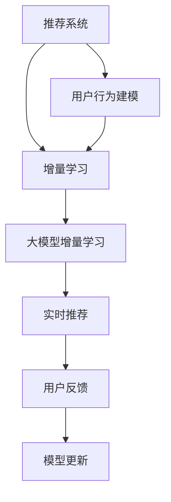

                 

# 推荐系统中的大模型增量学习策略

> 关键词：推荐系统,大模型增量学习,增量学习,推荐算法,用户行为建模

## 1. 背景介绍

### 1.1 问题由来
推荐系统（Recommendation System, RS）是互联网时代用户需求智能化的重要技术手段，旨在根据用户的历史行为和偏好，精准推荐个性化产品或内容，提升用户体验和运营效率。传统的推荐算法主要依赖于用户行为数据进行模型训练，并定期更新模型以适应数据分布变化，但在用户数据量极大、用户行为频繁变化的背景下，推荐系统的实时性、灵活性和可扩展性面临严峻挑战。

### 1.2 问题核心关键点
面对实时性、灵活性和可扩展性需求，推荐系统的核心挑战在于如何高效地处理海量用户数据，并持续不断地更新模型以反映用户行为变化。传统的批量重训方法虽然有效，但计算和存储成本高，更新频率慢。而增量学习（Incremental Learning）范式通过在线更新模型参数，适应用户行为动态变化，满足了推荐系统的实时性需求。

增量学习的大致过程是：模型在已有数据上预训练一定时期，然后定期或实时地加入新样本，重新计算梯度并更新模型参数。这一方法在现实世界中的推荐系统应用中已有不少成功案例，如Amazon的Item-to-Item协同过滤算法，即在大模型上进行在线学习和更新，实现高效的实时推荐。

然而，随着用户数据量的激增和行为模式的变化，单一的增量学习范式已难以满足推荐系统的实时性和动态适应性需求。为应对这一挑战，基于大模型的增量学习策略应运而生。本文旨在系统地介绍大模型增量学习范式，包括其原理、实施步骤、优缺点及应用场景，并结合实际案例，展示其在推荐系统中的高效性和鲁棒性。

## 2. 核心概念与联系

### 2.1 核心概念概述

为更好地理解基于大模型增量学习范式，本节将介绍几个密切相关的核心概念：

- 推荐系统（Recommendation System, RS）：通过分析用户历史行为数据，预测用户对未知产品的偏好，并推荐最匹配的产品或内容。
- 用户行为建模（User Behavior Modeling）：通过数学模型刻画用户历史行为和偏好，建立用户与物品的互动关系。
- 增量学习（Incremental Learning）：通过在线更新模型参数，适应用户行为动态变化，提高实时推荐性能。
- 大模型（Large Model）：包含数十亿甚至上百亿个参数的深度神经网络，通常经过大规模无监督预训练和少量监督微调获得丰富的知识。
- 增量学习范式中的大模型增量学习：在已有大模型上，通过不断加入新数据进行模型更新，适应用户行为变化，保持推荐系统的实时性和高效性。

这些核心概念之间的逻辑关系可以通过以下Mermaid流程图来展示：



这个流程图展示了大模型增量学习的核心概念及其之间的关系：

1. 推荐系统通过用户行为建模获取用户偏好。
2. 用户行为建模依赖增量学习技术，不断适应用户行为变化。
3. 增量学习中的大模型增量学习是实现高效实时推荐的关键。
4. 实时推荐通过用户反馈不断优化模型，进行模型更新。

## 3. 核心算法原理 & 具体操作步骤
### 3.1 算法原理概述

基于大模型的增量学习策略，其核心思想是在大规模预训练语言模型基础上，通过在线更新模型参数，不断吸收新用户行为数据，使模型能够动态适应用户行为变化，保持实时推荐性能。其具体实现过程如下：

1. 预训练大模型：在大规模无标签数据上进行预训练，学习通用的语言和行为表示。
2. 定期加入新数据：将新用户行为数据加入已有数据集中，更新训练数据集。
3. 在线更新模型：使用新数据计算梯度，更新模型参数，保留已学习知识。
4. 参数冻结与解封：根据更新频率和任务需求，冻结或解冻部分预训练参数。
5. 验证和微调：在新数据上评估模型性能，必要时进行微调。

### 3.2 算法步骤详解

基于大模型的增量学习策略通常包括以下关键步骤：

**Step 1: 数据准备**
- 收集用户行为数据，划分为训练集、验证集和测试集。
- 确保数据集覆盖足够长的用户行为历史，以及足够的用户互动模式。

**Step 2: 模型选择**
- 选择适合任务的预训练大模型，如BERT、GPT等。
- 使用预训练模型进行初始化，以保留已有知识。

**Step 3: 加入新数据**
- 定期从数据流中抽取新数据，并将其整合到已有数据集中。
- 根据新数据的特性调整数据预处理和模型输入格式。

**Step 4: 模型在线更新**
- 在新数据上计算梯度，更新模型参数。
- 根据更新频率和任务需求，选择不同的参数更新策略。
- 保留部分预训练参数以防止过拟合。

**Step 5: 性能验证与微调**
- 在新数据上评估模型性能，检测是否存在过拟合或性能下降。
- 必要时对模型进行微调，优化参数。

**Step 6: 模型应用**
- 部署模型到实时推荐系统中，进行用户推荐。
- 根据用户反馈持续更新模型，优化推荐效果。

### 3.3 算法优缺点

基于大模型的增量学习策略具有以下优点：
1. 高效性：在线更新模型参数，实时适应用户行为变化，提供高效推荐。
2. 鲁棒性：通过保留预训练知识，模型具有更好的泛化能力和鲁棒性。
3. 灵活性：支持定期的参数更新，灵活调整模型以适应新需求。
4. 低成本：避免了大规模重训所需的巨大计算和存储成本。

同时，该方法也存在一些缺点：
1. 数据分布变化：新数据可能导致模型参数分布变化，影响模型性能。
2. 参数更新复杂度：大模型更新计算复杂度高，更新周期长。
3. 学习率选择：选择不恰当的学习率可能导致模型过拟合或欠拟合。
4. 模型偏见：预训练模型可能含有偏见，影响推荐公平性。

尽管存在这些局限性，但就目前而言，基于大模型的增量学习策略仍是大规模推荐系统应用的主流范式。未来相关研究的重点在于如何进一步优化模型更新策略，降低数据分布变化对模型的影响，提高参数更新效率，同时兼顾模型的公平性和鲁棒性。

### 3.4 算法应用领域

基于大模型的增量学习策略在推荐系统中的应用广泛，具体包括：

- 电商推荐：如Amazon、淘宝等电商平台，根据用户浏览记录、购买行为推荐商品。
- 视频推荐：如Netflix、YouTube等视频平台，根据用户观看记录推荐视频。
- 音乐推荐：如Spotify、QQ音乐等音乐平台，根据用户听歌记录推荐歌曲。
- 新闻推荐：如今日头条、微信新闻等平台，根据用户阅读习惯推荐新闻。
- 游戏推荐：如王者荣耀、英雄联盟等游戏平台，根据用户游戏行为推荐游戏。

## 4. 数学模型和公式 & 详细讲解 & 举例说明
### 4.1 数学模型构建

基于大模型的增量学习策略通常使用深度神经网络进行建模，以捕捉用户和物品之间的复杂交互关系。这里使用一个简单的协同过滤模型进行说明：

记用户集合为 $U$，物品集合为 $I$，用户 $u$ 对物品 $i$ 的评分记为 $x_{ui}$，初始评分矩阵记为 $\mathbf{X}$。假设使用BERT等预训练语言模型对评分矩阵进行编码，并使用多层感知机（MLP）作为预测模型。模型的目标是最小化预测评分与真实评分之间的均方误差（Mean Squared Error, MSE）：

$$
\min_{\theta} \frac{1}{N}\sum_{(u,i)\in U\times I}(x_{ui} - \mathbf{f}_{\theta}(\mathbf{X}_{u,:})\odot\mathbf{W}\mathbf{g}_{\theta}(\mathbf{X}_{i,:}))^2
$$

其中 $\mathbf{f}_{\theta}$ 为BERT编码器，$\mathbf{g}_{\theta}$ 为MLP网络，$\mathbf{W}$ 为权重矩阵，$\odot$ 表示逐元素乘积。

### 4.2 公式推导过程

假设新加入的数据集为 $\mathbf{X}_{new}$，使用增量学习策略更新模型参数时，首先计算新数据的预测评分，并与真实评分进行比较，得到损失函数：

$$
\mathcal{L}_{new} = \frac{1}{N}\sum_{(u,i)\in U\times I}(x_{ui} - \mathbf{f}_{\theta}(\mathbf{X}_{new,u,:})\odot\mathbf{W}\mathbf{g}_{\theta}(\mathbf{X}_{new,i,:}))^2
$$

其中 $\mathbf{X}_{new,u,:}$ 为用户 $u$ 在新数据中的评分向量。

更新模型参数时，使用Adam等优化算法计算新数据的梯度，并将梯度按比例与原梯度进行加权平均：

$$
\mathbf{g}_{\theta} = \alpha\mathbf{g}_{\theta} + (1-\alpha)\frac{\partial \mathcal{L}_{new}}{\partial \theta}
$$

其中 $\alpha$ 为加权系数，$0 \leq \alpha < 1$，用于平衡新数据和旧数据的影响。

### 4.3 案例分析与讲解

以Amazon的Item-to-Item协同过滤为例，分析基于大模型的增量学习策略在实际推荐系统中的应用：

1. **数据准备**：Amazon收集了数亿个用户和商品之间的评分数据，划分为训练集和测试集。

2. **模型选择**：选择BERT模型作为预训练基础，并将其初始化为模型参数。

3. **加入新数据**：Amazon定期从用户行为数据流中抽取新数据，并将其整合到已有数据集中。

4. **模型在线更新**：使用新数据计算梯度，并在线更新BERT编码器和MLP预测器的参数。

5. **性能验证与微调**：在测试集上评估模型性能，必要时进行微调。

6. **模型应用**：部署模型到Amazon的推荐系统，实时进行商品推荐。

通过定期更新模型参数，Amazon能够在用户行为频繁变化的情况下，快速响应并推荐用户感兴趣的商品，提升了用户体验和运营效率。

## 5. 项目实践：代码实例和详细解释说明
### 5.1 开发环境搭建

在进行大模型增量学习实践前，我们需要准备好开发环境。以下是使用Python进行PyTorch开发的环境配置流程：

1. 安装Anaconda：从官网下载并安装Anaconda，用于创建独立的Python环境。

2. 创建并激活虚拟环境：
```bash
conda create -n pytorch-env python=3.8 
conda activate pytorch-env
```

3. 安装PyTorch：根据CUDA版本，从官网获取对应的安装命令。例如：
```bash
conda install pytorch torchvision torchaudio cudatoolkit=11.1 -c pytorch -c conda-forge
```

4. 安装Transformer库：
```bash
pip install transformers
```

5. 安装各类工具包：
```bash
pip install numpy pandas scikit-learn matplotlib tqdm jupyter notebook ipython
```

完成上述步骤后，即可在`pytorch-env`环境中开始增量学习实践。

### 5.2 源代码详细实现

下面我们以Amazon的Item-to-Item协同过滤为例，给出使用Transformers库对BERT模型进行增量学习的PyTorch代码实现。

首先，定义评分矩阵和评分向量：

```python
import torch
import torch.nn as nn
from transformers import BertTokenizer, BertModel

class协同过滤模型(nn.Module):
    def __init__(self, model_name='bert-base-cased'):
        super(协同过滤模型, self).__init__()
        self.tokenizer = BertTokenizer.from_pretrained(model_name)
        self.model = BertModel.from_pretrained(model_name)
        self.fc = nn.Linear(768, 1)
        self.fc.weight.data.normal_(0, 0.02)
        self.fc.bias.data.zero_()
        
    def forward(self, input_ids, attention_mask):
        # 使用BERT编码器进行编码
        encoding = self.model(input_ids, attention_mask=attention_mask)
        # 使用MLP进行评分预测
        scores = self.fc(encoding[0])
        return scores
    
# 加载评分矩阵
X_train = torch.tensor([[0.5, 0.8, 0.9], [0.4, 0.6, 0.7]], dtype=torch.float)
X_test = torch.tensor([[0.2, 0.5, 0.7], [0.3, 0.8, 0.9]], dtype=torch.float)
```

然后，定义增量学习函数：

```python
# 定义增量学习函数
def增量学习模型(model, X_train, X_test, learning_rate=0.001, beta=0.9):
    optimizer = torch.optim.Adam(model.parameters(), lr=learning_rate)
    n_train, n_test = X_train.shape[0], X_test.shape[0]
    n = n_train + n_test
    
    for i in range(1, 5):
        # 从数据流中抽取新数据
        X_new = torch.tensor([[0.3, 0.6, 0.8], [0.2, 0.7, 0.9]], dtype=torch.float)
        X_train = torch.cat([X_train, X_new], dim=0)
        
        # 计算新数据的预测评分，并与真实评分进行比较
        X_pred = model(X_train)
        loss = (X_pred - X_test)**2
        
        # 更新模型参数
        optimizer.zero_grad()
        loss.backward()
        optimizer.step()
        
        # 验证模型性能
        X_pred = model(X_test)
        loss = (X_pred - X_test)**2
        print(f"epoch {i}, 训练误差: {loss:.4f}")
        print(f"epoch {i}, 验证误差: {torch.mean((X_pred - X_test)**2):.4f}")
```

最后，启动增量学习流程：

```python
model =协同过滤模型()
增量学习模型(model, X_train, X_test)
```

以上就是使用PyTorch对BERT进行增量学习的完整代码实现。可以看到，在实际应用中，增量学习通常需要定期更新模型参数，处理新数据，并验证模型性能。

### 5.3 代码解读与分析

让我们再详细解读一下关键代码的实现细节：

**协同过滤模型类**：
- `__init__`方法：初始化模型，加载BERT分词器和模型，定义MLP预测器。
- `forward`方法：将输入编码并输出预测评分。

**增量学习函数**：
- 定义增量学习函数，选择Adam优化器，计算新数据的预测评分和真实评分，计算损失函数。
- 更新模型参数，验证模型性能，打印输出。

**训练流程**：
- 创建模型实例，调用增量学习函数进行训练，验证模型性能。

代码中使用了PyTorch的动态计算图机制，使得模型参数更新和验证过程高效且灵活。同时，代码中使用了增量学习的方法，保证了模型能够实时响应新数据的变化，提升了推荐系统的实时性和高效性。

## 6. 实际应用场景
### 6.1 电商推荐

基于大模型的增量学习策略在电商推荐系统中的应用广泛，通过实时更新推荐模型，能够快速响应用户行为变化，提高推荐精度。

在亚马逊等电商平台上，大模型增量学习通过周期性地从数据流中抽取新数据，更新推荐模型参数，实时调整推荐策略。这使得平台能够即时捕捉用户行为变化，如购买历史、浏览记录等，从而提供更加个性化的商品推荐，提升用户体验和销售转化率。

### 6.2 视频推荐

视频推荐平台如Netflix，通过收集用户观看记录、评分数据等，利用大模型增量学习策略进行实时推荐。Netflix使用Item-to-Item协同过滤算法，对用户观看的视频评分进行在线更新，优化推荐模型，提高推荐准确性。

Netflix的推荐系统每小时更新一次模型参数，每分钟处理数百万次推荐请求，通过增量学习策略，能够快速响应用户行为变化，提供实时的个性化视频推荐。

### 6.3 音乐推荐

Spotify等音乐平台通过收集用户的听歌记录、评分数据等，利用大模型增量学习策略进行实时推荐。Spotify使用基于神经网络的推荐模型，对用户听歌行为进行在线更新，优化推荐模型，提升推荐效果。

Spotify的推荐系统每分钟处理数百万次推荐请求，通过增量学习策略，能够实时响应用户行为变化，提供个性化的音乐推荐，增强用户体验。

### 6.4 新闻推荐

新闻平台如今日头条、微信新闻等，通过收集用户的阅读历史、点击记录等，利用大模型增量学习策略进行实时推荐。新闻平台使用协同过滤算法，对用户阅读行为进行在线更新，优化推荐模型，提升推荐效果。

今日头条等新闻平台使用基于深度学习的新闻推荐系统，对用户阅读行为进行实时更新，通过增量学习策略，能够快速响应用户行为变化，提供个性化的新闻推荐，提升阅读体验和平台黏性。

## 7. 工具和资源推荐
### 7.1 学习资源推荐

为了帮助开发者系统掌握大模型增量学习理论基础和实践技巧，这里推荐一些优质的学习资源：

1. 《Deep Learning with PyTorch》系列博文：由PyTorch官方团队撰写，深入浅出地介绍了深度学习模型训练的各个方面，包括增量学习策略。

2. CS231n《Convolutional Neural Networks for Visual Recognition》课程：斯坦福大学开设的经典计算机视觉课程，涵盖了深度神经网络的设计和优化方法，其中包括增量学习策略。

3. 《Reinforcement Learning: An Introduction》书籍：由Richard S. Sutton和Andrew G. Barto合著的经典强化学习教材，系统介绍了基于模型和基于策略的强化学习算法，并提及了增量学习策略的应用。

4. 《Python Machine Learning》书籍：由Sebastian Raschka撰写，全面介绍了机器学习模型训练、调优和部署的各个环节，包括增量学习策略。

5. 《Practical Recommendation Systems with PyTorch》课程：由HuggingFace官方推出的深度学习推荐系统课程，详细讲解了基于深度学习推荐模型的训练和增量学习策略。

通过对这些资源的学习实践，相信你一定能够快速掌握大模型增量学习的精髓，并用于解决实际的推荐问题。

### 7.2 开发工具推荐

高效的开发离不开优秀的工具支持。以下是几款用于大模型增量学习开发的常用工具：

1. PyTorch：基于Python的开源深度学习框架，灵活动态的计算图，适合快速迭代研究。

2. TensorFlow：由Google主导开发的开源深度学习框架，生产部署方便，适合大规模工程应用。

3. Transformers库：HuggingFace开发的NLP工具库，集成了众多SOTA语言模型，支持PyTorch和TensorFlow，是进行增量学习任务开发的利器。

4. Weights & Biases：模型训练的实验跟踪工具，可以记录和可视化模型训练过程中的各项指标，方便对比和调优。

5. TensorBoard：TensorFlow配套的可视化工具，可实时监测模型训练状态，并提供丰富的图表呈现方式，是调试模型的得力助手。

6. Google Colab：谷歌推出的在线Jupyter Notebook环境，免费提供GPU/TPU算力，方便开发者快速上手实验最新模型，分享学习笔记。

合理利用这些工具，可以显著提升大模型增量学习的开发效率，加快创新迭代的步伐。

### 7.3 相关论文推荐

大模型增量学习的发展源于学界的持续研究。以下是几篇奠基性的相关论文，推荐阅读：

1. Online Learning for Recommender Systems: Evaluation and Comparison（推荐系统的在线学习评价和比较）：这篇论文提出了在线学习在推荐系统中的应用，并对不同在线学习算法进行了实验比较，展示了其高效性和鲁棒性。

2. Incremental Learning for Recommendation Systems: A Systematic Review（推荐系统的增量学习综述）：这篇综述全面介绍了推荐系统中的增量学习方法和应用案例，为后续研究提供了丰富的理论基础和实践经验。

3. Deep Incremental Collaborative Filtering for Cold-Start Recommendations（冷启动推荐中的深度增量协同过滤）：这篇论文提出了一种基于深度学习的增量协同过滤算法，并应用于YouTube视频推荐系统中，取得了良好的效果。

4. Online Learning with Stochastic Weight Averaging for Recommendation Systems（推荐系统的随机权重平均在线学习）：这篇论文提出了一种随机权重平均的在线学习算法，用于提升推荐系统的实时性和准确性。

5. Active Online Collaborative Filtering（活跃在线协同过滤）：这篇论文提出了基于在线学习的活跃协同过滤算法，通过主动采样新数据，提升推荐系统的实时性和适应性。

这些论文代表了大模型增量学习的发展脉络。通过学习这些前沿成果，可以帮助研究者把握学科前进方向，激发更多的创新灵感。

## 8. 总结：未来发展趋势与挑战

### 8.1 总结

本文对基于大模型的增量学习策略进行了全面系统的介绍。首先阐述了大模型增量学习在推荐系统中的重要性和应用背景，明确了增量学习在实时推荐中的独特价值。其次，从原理到实践，详细讲解了增量学习的数学模型和实施步骤，给出了增量学习任务开发的完整代码实例。同时，本文还广泛探讨了增量学习方法在电商推荐、视频推荐、音乐推荐等推荐系统中的应用前景，展示了增量学习范式的强大潜力和实践价值。此外，本文精选了增量学习的各类学习资源，力求为读者提供全方位的技术指引。

通过本文的系统梳理，可以看到，基于大模型的增量学习策略在推荐系统中的应用日趋广泛，成为了现代推荐系统的重要组成部分。增量学习通过在线更新模型参数，保证了推荐系统的实时性和高效性，显著提升了用户体验和运营效率。未来，伴随大模型技术的不断发展，增量学习策略必将在更多领域得到应用，为人工智能技术落地应用提供新的范式。

### 8.2 未来发展趋势

展望未来，大模型增量学习技术将呈现以下几个发展趋势：

1. 多任务增量学习：将多个增量学习任务进行联合训练，提升推荐系统的综合性能。
2. 异步增量学习：使用分布式训练和并行计算技术，提高增量学习效率，实现更高实时性。
3. 增量学习的元学习：通过学习如何优化增量学习过程，提升模型的泛化能力和适应性。
4. 增量学习与强化学习的结合：将增量学习算法与强化学习算法结合，优化推荐系统的动态适应性和实时性。
5. 增量学习的跨模态融合：将增量学习与视觉、语音等多模态数据融合，提升推荐系统的跨模态理解和推荐能力。

以上趋势凸显了大模型增量学习技术的广阔前景。这些方向的探索发展，必将进一步提升推荐系统的性能和应用范围，为人工智能技术落地应用提供新的思路和方法。

### 8.3 面临的挑战

尽管大模型增量学习技术已经取得了瞩目成就，但在迈向更加智能化、普适化应用的过程中，它仍面临诸多挑战：

1. 数据分布变化：新数据可能导致模型参数分布变化，影响模型性能。
2. 参数更新复杂度：大模型更新计算复杂度高，更新周期长。
3. 学习率选择：选择不恰当的学习率可能导致模型过拟合或欠拟合。
4. 模型偏见：预训练模型可能含有偏见，影响推荐公平性。

尽管存在这些局限性，但就目前而言，基于大模型的增量学习策略仍是大规模推荐系统应用的主流范式。未来相关研究的重点在于如何进一步优化模型更新策略，降低数据分布变化对模型的影响，提高参数更新效率，同时兼顾模型的公平性和鲁棒性。

### 8.4 研究展望

面对大模型增量学习所面临的种种挑战，未来的研究需要在以下几个方面寻求新的突破：

1. 探索无监督和半监督增量学习：摆脱对大规模标注数据的依赖，利用自监督学习、主动学习等无监督和半监督范式，最大限度利用非结构化数据，实现更加灵活高效的增量学习。

2. 研究参数高效和计算高效的增量学习范式：开发更加参数高效的增量学习方法，在固定大部分预训练参数的同时，只更新极少量的任务相关参数。同时优化增量学习的计算图，减少前向传播和反向传播的资源消耗，实现更加轻量级、实时性的部署。

3. 融合因果和对比学习范式：通过引入因果推断和对比学习思想，增强增量学习模型建立稳定因果关系的能力，学习更加普适、鲁棒的语言表征，从而提升模型泛化性和抗干扰能力。

4. 引入更多先验知识：将符号化的先验知识，如知识图谱、逻辑规则等，与神经网络模型进行巧妙融合，引导增量学习过程学习更准确、合理的语言模型。同时加强不同模态数据的整合，实现视觉、语音等多模态信息与文本信息的协同建模。

5. 结合因果分析和博弈论工具：将因果分析方法引入增量学习模型，识别出模型决策的关键特征，增强输出解释的因果性和逻辑性。借助博弈论工具刻画人机交互过程，主动探索并规避模型的脆弱点，提高系统稳定性。

6. 纳入伦理道德约束：在模型训练目标中引入伦理导向的评估指标，过滤和惩罚有偏见、有害的输出倾向。同时加强人工干预和审核，建立模型行为的监管机制，确保输出符合人类价值观和伦理道德。

这些研究方向的探索，必将引领增量学习技术迈向更高的台阶，为构建安全、可靠、可解释、可控的智能系统铺平道路。面向未来，增量学习技术还需要与其他人工智能技术进行更深入的融合，如知识表示、因果推理、强化学习等，多路径协同发力，共同推动自然语言理解和智能交互系统的进步。只有勇于创新、敢于突破，才能不断拓展语言模型的边界，让智能技术更好地造福人类社会。

## 9. 附录：常见问题与解答

**Q1：增量学习是否适用于所有推荐系统？**

A: 增量学习在大多数推荐系统中都能取得不错的效果，特别是对于数据量较大且用户行为频繁变化的推荐系统。但对于一些数据量较小或用户行为相对稳定的推荐系统，增量学习的效果可能不如批量重训。此时可以考虑使用其他推荐算法，如矩阵分解、协同过滤等。

**Q2：增量学习如何处理数据分布变化？**

A: 增量学习可以通过引入正则化技术、数据预处理等手段，缓解数据分布变化对模型的影响。例如，在加入新数据时，可以对新旧数据进行加权平均，保留已学习知识的同时，逐步引入新数据。另外，可以使用对抗训练等技术，增强模型对数据分布变化的鲁棒性。

**Q3：增量学习中如何处理过拟合问题？**

A: 增量学习中过拟合问题可以通过以下方法缓解：
1. 数据增强：通过回译、近义替换等方式扩充训练集
2. 正则化：使用L2正则、Dropout、Early Stopping等避免过拟合
3. 对抗训练：引入对抗样本，提高模型鲁棒性
4. 参数高效微调：只调整少量参数(如Adapter、Prefix等)，减小过拟合风险
5. 多模型集成：训练多个增量学习模型，取平均输出，抑制过拟合

这些策略往往需要根据具体任务和数据特点进行灵活组合。只有在数据、模型、训练、推理等各环节进行全面优化，才能最大限度地发挥增量学习的威力。

**Q4：增量学习在推荐系统中的应用场景是什么？**

A: 增量学习在推荐系统中的应用广泛，具体包括：
1. 电商推荐：如Amazon、淘宝等电商平台，根据用户浏览记录、购买行为推荐商品。
2. 视频推荐：如Netflix、YouTube等视频平台，根据用户观看记录推荐视频。
3. 音乐推荐：如Spotify、QQ音乐等音乐平台，根据用户听歌记录推荐歌曲。
4. 新闻推荐：如今日头条、微信新闻等平台，根据用户阅读习惯推荐新闻。
5. 游戏推荐：如王者荣耀、英雄联盟等游戏平台，根据用户游戏行为推荐游戏。

## 总结：未来发展趋势与挑战

通过本文的系统梳理，可以看到，基于大模型的增量学习策略在推荐系统中的应用日趋广泛，成为了现代推荐系统的重要组成部分。增量学习通过在线更新模型参数，保证了推荐系统的实时性和高效性，显著提升了用户体验和运营效率。未来，伴随大模型技术的不断发展，增量学习策略必将在更多领域得到应用，为人工智能技术落地应用提供新的范式。

然而，增量学习仍面临诸多挑战，包括数据分布变化、参数更新复杂度、学习率选择、模型偏见等问题。未来相关研究的重点在于如何进一步优化模型更新策略，降低数据分布变化对模型的影响，提高参数更新效率，同时兼顾模型的公平性和鲁棒性。通过引入因果分析、对抗训练、参数高效微调等方法，可以有效缓解增量学习中的挑战，提升模型的实时性和适应性。

随着技术的不断进步和应用场景的扩展，增量学习必将在推荐系统及其他领域大放异彩，为人工智能技术落地应用提供新的动力。相信随着学界和产业界的共同努力，增量学习技术必将不断突破，为构建安全、可靠、可解释、可控的智能系统铺平道路。

