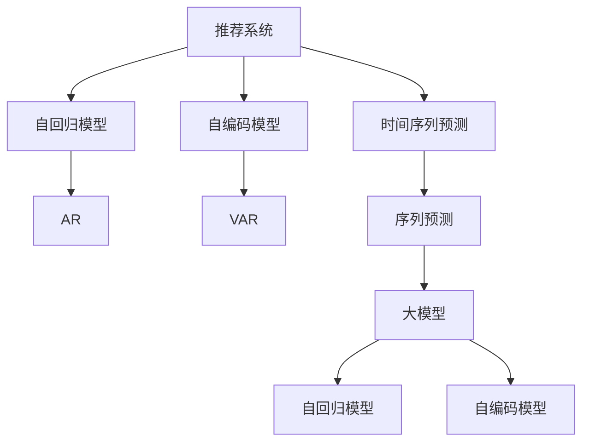

                 

# 推荐系统中的时间序列预测：大模型新方案

> 关键词：推荐系统,时间序列预测,大模型,自回归模型,序列预测

## 1. 背景介绍

### 1.1 问题由来

在现代电子商务和在线内容平台上，推荐系统已经成为获取用户价值的核心工具。用户行为数据蕴含着丰富的历史信息，利用时间序列预测技术对用户未来的行为进行预测，能够显著提升推荐系统的效果，极大地提升用户体验和平台收益。

然而，传统的时间序列预测方法通常依赖于特征工程和模型调参，需要大量经验和数据进行训练。随着深度学习技术的发展，深度神经网络在大规模数据上的性能优势日益凸显，为时间序列预测提供了新的方向。

特别是近年来大语言模型在自然语言处理领域取得的突破，极大拓展了其应用边界。通过大语言模型的编码器和解码器结构，可以很好地对时间序列数据进行建模和预测，从而进一步优化推荐系统的效果。

### 1.2 问题核心关键点

本文聚焦于利用大语言模型进行时间序列预测的方法，并深入探讨其在推荐系统中的应用。大语言模型通过在时间序列数据上预训练，可以学习到时间序列数据的隐含规律，进而对未来的数据进行预测。在大模型框架下，可以利用序列预测模型对用户行为进行预测，从而提升推荐系统的效果。

关键技术包括：
- 大语言模型的预训练与微调
- 自回归模型与自编码模型的区别与应用
- 时间序列预测的算法原理与实现方法
- 推荐系统中的时间序列预测案例分析
- 推荐系统的时间序列预测优化策略

## 2. 核心概念与联系

### 2.1 核心概念概述

为更好地理解利用大模型进行时间序列预测，本节将介绍几个密切相关的核心概念：

- 推荐系统(Recommender System)：通过分析用户历史行为数据，为用户推荐感兴趣物品的系统。典型的推荐系统有基于协同过滤的推荐、基于内容的推荐等。

- 时间序列预测(Time Series Forecasting)：通过对历史时间序列数据的分析，预测未来某一时刻的时间序列值。常见的时间序列预测方法包括自回归模型(AR)、移动平均模型(MA)、ARIMA模型等。

- 大语言模型(Large Language Model, LLM)：以自回归(如GPT)或自编码(如BERT)模型为代表的大规模预训练语言模型。通过在海量无标签文本数据上进行预训练，学习通用的语言表示。

- 自回归模型(Autoregressive Model)：一种时间序列预测模型，其预测值依赖于之前所有时刻的观察值。典型模型包括AR、ARIMA、LSTM等。

- 自编码模型(Autonomous Encoding Model)：一种重构型时间序列预测模型，其目标是最小化重构误差，并预测未来数据。典型模型包括VAR、VARMA、GRU等。

- 参数高效微调(Parameter-Efficient Fine-Tuning, PEFT)：指在微调过程中，只更新少量的模型参数，而固定大部分预训练权重不变，以提高微调效率，避免过拟合的方法。

- 序列预测(Sequence Prediction)：预测时间序列未来的值，通常利用自回归或自编码模型进行建模。

这些核心概念之间的逻辑关系可以通过以下Mermaid流程图来展示：



这个流程图展示了大模型在推荐系统中的应用框架：

1. 推荐系统通过分析用户历史行为数据，为用户推荐物品。
2. 时间序列预测通过对历史数据建模，预测未来数据。
3. 利用自回归模型或自编码模型，对时间序列数据进行建模。
4. 大语言模型可以通过预训练学习到时间序列数据的规律，从而对未来的数据进行预测。
5. 在推荐系统中，大语言模型通过微调进行序列预测，提升推荐效果。

## 3. 核心算法原理 & 具体操作步骤
### 3.1 算法原理概述

利用大语言模型进行时间序列预测，本质上是一种基于深度神经网络的时间序列预测技术。其核心思想是：将时间序列数据看作是文本序列，通过预训练模型对其规律进行学习，并利用微调后的模型进行序列预测。

具体而言，假设我们有一个时间序列数据集 $D = \{(t_i,x_i,y_i)\}_{i=1}^N$，其中 $t_i$ 表示时间戳，$x_i$ 表示历史时间序列数据，$y_i$ 表示下一个时间点的预测值。我们的目标是在给定历史数据 $x_i$ 的情况下，预测下一个时间点的 $y_{i+1}$。

基于深度神经网络的时间序列预测模型通常包括编码器和解码器两部分：
- 编码器：将历史数据 $x_i$ 编码为高维向量 $h_i$。
- 解码器：对编码后的向量 $h_i$ 进行解码，生成预测值 $y_{i+1}$。

时间序列预测模型的训练过程如下：
1. 将历史数据 $x_i$ 作为输入，利用编码器生成向量 $h_i$。
2. 将 $h_i$ 作为解码器的输入，生成预测值 $y_{i+1}$。
3. 计算预测值 $y_{i+1}$ 与真实值 $y_i$ 之间的损失函数 $\ell(y_{i+1}, y_i)$，如均方误差、交叉熵等。
4. 使用反向传播算法计算参数梯度，利用优化器更新模型参数。

通过上述过程，模型逐步学习到时间序列数据的规律，并利用训练好的模型进行序列预测。

### 3.2 算法步骤详解

基于大语言模型的时间序列预测一般包括以下几个关键步骤：

**Step 1: 准备数据和模型**
- 收集目标时间序列数据，并将其划分为训练集和测试集。
- 选择合适的预训练语言模型 $M_{\theta}$ 作为初始化参数，如 BERT、GPT 等。
- 设计合适的解码器 $D$，如 RNN、GRU、LSTM 等。

**Step 2: 预训练模型**
- 在预训练集上训练语言模型 $M_{\theta}$，学习通用的语言表示。
- 在训练集上对编码器 $E$ 进行微调，使其学习到时间序列数据的规律。
- 在训练集上对解码器 $D$ 进行微调，使其学习到未来时间点的预测能力。

**Step 3: 训练时间序列预测模型**
- 使用训练集上的序列数据 $(x_i, y_i)$ 训练时间序列预测模型，生成预测值 $y_{i+1}$。
- 计算预测值 $y_{i+1}$ 与真实值 $y_i$ 之间的损失函数 $\ell(y_{i+1}, y_i)$。
- 使用反向传播算法计算参数梯度，利用优化器更新模型参数。

**Step 4: 评估和优化**
- 在测试集上评估时间序列预测模型的性能，计算均方误差(MSE)、平均绝对误差(MAE)等指标。
- 根据评估结果，调整模型超参数，如学习率、批大小等。
- 重复上述步骤直至模型性能达到预期。

### 3.3 算法优缺点

基于大语言模型的时间序列预测方法具有以下优点：
1. 可以处理大规模时间序列数据，适用于多种场景，如股票价格、气温变化、交通流量等。
2. 利用深度学习模型的强大拟合能力，可以捕捉复杂的时间序列模式。
3. 可以与推荐系统结合，提升推荐效果。
4. 模型可以端到端训练，自动学习特征，减少特征工程的工作量。

同时，该方法也存在一定的局限性：
1. 模型复杂度高，计算资源消耗大，需要高性能计算资源。
2. 对历史数据质量要求高，数据缺失、异常值等问题会影响模型性能。
3. 模型泛化能力有限，难以处理超出训练数据范围的预测。
4. 模型难以解释，难以进行模型调试和优化。

尽管存在这些局限性，但就目前而言，基于大模型的序列预测方法仍是大规模时间序列预测的首选方案。未来相关研究的重点在于如何进一步降低模型复杂度，提高泛化能力，同时兼顾可解释性和计算效率。

### 3.4 算法应用领域

基于大语言模型的时间序列预测方法，在推荐系统中的应用广泛，覆盖了几乎所有常见场景，例如：

- 商品推荐：预测用户对商品的购买概率。通过分析历史购买数据，利用时间序列预测模型对未来购买行为进行预测。
- 内容推荐：预测用户对文章、视频、音乐等内容的点击率。通过分析用户行为数据，利用时间序列预测模型对未来内容消费行为进行预测。
- 股票投资：预测股票价格变化。通过分析历史股价数据，利用时间序列预测模型对未来股价进行预测。
- 气象预测：预测气温、湿度、降水量等气象数据。通过分析历史气象数据，利用时间序列预测模型对未来气象变化进行预测。
- 交通流量：预测道路流量变化。通过分析历史交通数据，利用时间序列预测模型对未来交通流量进行预测。

除了上述这些经典场景外，大模型的时间序列预测技术还被创新性地应用到更多领域，如可控金融系统、城市规划、安全监控等，为各行各业带来了新的解决方案。

## 4. 数学模型和公式 & 详细讲解 & 举例说明

### 4.1 数学模型构建

假设我们有一个时间序列数据集 $D = \{(t_i,x_i,y_i)\}_{i=1}^N$，其中 $t_i$ 表示时间戳，$x_i$ 表示历史时间序列数据，$y_i$ 表示下一个时间点的预测值。我们的目标是在给定历史数据 $x_i$ 的情况下，预测下一个时间点的 $y_{i+1}$。

我们设计一个包含编码器 $E$ 和解码器 $D$ 的深度神经网络，具体模型结构如下：

$$
y_{i+1} = D(E(x_i))
$$

其中 $E$ 表示编码器，$D$ 表示解码器。假设 $E$ 的输出为 $h_i$，$D$ 的输出为 $y_{i+1}$，则模型结构可以表示为：

$$
y_{i+1} = D(h_i)
$$

其中 $h_i$ 是编码器 $E$ 的输出。我们利用 $E$ 将历史数据 $x_i$ 编码为向量 $h_i$，再利用 $D$ 对 $h_i$ 进行解码，生成预测值 $y_{i+1}$。

### 4.2 公式推导过程

下面以一个简单的自回归模型为例，推导其参数更新公式。假设我们的时间序列预测模型为自回归模型，其结构如下：

$$
y_{i+1} = \beta_0 + \sum_{j=1}^k \beta_j y_{i-j} + \epsilon_i
$$

其中 $\epsilon_i$ 为高斯噪声，均值为0，方差为 $\sigma^2$。我们的目标是最小化损失函数：

$$
\mathcal{L} = \frac{1}{N}\sum_{i=1}^N \ell(y_{i+1}, \hat{y}_{i+1})
$$

其中 $\ell$ 为均方误差。

根据均方误差损失函数的定义，有：

$$
\mathcal{L} = \frac{1}{N}\sum_{i=1}^N (y_{i+1} - \hat{y}_{i+1})^2
$$

将 $y_{i+1}$ 表示为模型输出，有：

$$
\mathcal{L} = \frac{1}{N}\sum_{i=1}^N (y_{i+1} - \hat{y}_{i+1})^2 = \frac{1}{N}\sum_{i=1}^N \left(\beta_0 + \sum_{j=1}^k \beta_j y_{i-j} + \epsilon_i - \beta_0 - \sum_{j=1}^k \beta_j \hat{y}_{i-j} - \epsilon_i \right)^2
$$

将 $\beta_0$ 和 $\beta_j$ 表示为矩阵 $\mathbf{B}$，有：

$$
\mathcal{L} = \frac{1}{N}\sum_{i=1}^N \left(\mathbf{B}y_{i-k:i-1} + \epsilon_i - \mathbf{B}\hat{y}_{i-k:i-1} - \epsilon_i \right)^2
$$

其中 $y_{i-k:i-1}$ 表示 $i$ 时刻的 $k$ 个历史数据。为了便于计算，我们将其表示为向量形式，并利用反向传播算法计算参数梯度：

$$
\mathcal{L} = \frac{1}{N}\sum_{i=1}^N \left(\mathbf{B}y_{i-k:i-1} - \mathbf{B}\hat{y}_{i-k:i-1} \right)^2
$$

利用链式法则，得到参数 $\mathbf{B}$ 的梯度为：

$$
\frac{\partial \mathcal{L}}{\partial \mathbf{B}} = \frac{2}{N}\sum_{i=1}^N \left(\mathbf{B}y_{i-k:i-1} - \mathbf{B}\hat{y}_{i-k:i-1} \right)(y_{i-k:i-1} - \hat{y}_{i-k:i-1})
$$

将 $y_{i+1}$ 表示为模型输出，有：

$$
\frac{\partial \mathcal{L}}{\partial y_{i+1}} = 2(y_{i+1} - \hat{y}_{i+1})
$$

将 $y_{i+1}$ 表示为模型输出，有：

$$
\frac{\partial \mathcal{L}}{\partial \epsilon_i} = 2(\epsilon_i - \epsilon_i) = 0
$$

将 $\mathbf{B}$ 的梯度表示为 $\mathbf{G}$，则有：

$$
\mathbf{G} = \frac{2}{N}\sum_{i=1}^N \left(\mathbf{B}y_{i-k:i-1} - \mathbf{B}\hat{y}_{i-k:i-1} \right)(y_{i-k:i-1} - \hat{y}_{i-k:i-1})
$$

利用梯度下降算法，更新参数 $\mathbf{B}$：

$$
\mathbf{B} \leftarrow \mathbf{B} - \eta \mathbf{G}
$$

其中 $\eta$ 为学习率。重复上述过程，直到模型收敛。

### 4.3 案例分析与讲解

假设我们有一个历史股票价格数据集，希望利用时间序列预测模型预测未来股票价格。我们选择 BERT 作为预训练语言模型，设计一个包含编码器 $E$ 和解码器 $D$ 的深度神经网络，其中 $E$ 为 Transformer 编码器，$D$ 为线性解码器。我们利用历史股票价格数据 $x_i$ 训练模型，生成未来股票价格的预测值 $y_{i+1}$。

**Step 1: 数据准备**

我们首先准备历史股票价格数据集，将其划分为训练集和测试集。数据集格式为时间戳 $t_i$ 和价格 $y_i$。我们将其表示为 $(x_i, y_i)$ 的形式，其中 $x_i$ 表示 $i$ 时刻的股票价格，$y_i$ 表示 $i+1$ 时刻的股票价格。

**Step 2: 模型设计**

我们设计一个包含编码器 $E$ 和解码器 $D$ 的深度神经网络。编码器 $E$ 为 Transformer 编码器，解码器 $D$ 为线性解码器。模型结构如下：

$$
y_{i+1} = D(E(x_i))
$$

其中 $E$ 的输出为 $h_i$，$D$ 的输出为 $y_{i+1}$。我们利用历史股票价格数据 $x_i$ 训练模型，生成未来股票价格的预测值 $y_{i+1}$。

**Step 3: 模型训练**

我们使用训练集上的序列数据 $(x_i, y_i)$ 训练模型，生成未来股票价格的预测值 $y_{i+1}$。利用均方误差损失函数，计算模型输出与真实值之间的误差：

$$
\mathcal{L} = \frac{1}{N}\sum_{i=1}^N (y_{i+1} - \hat{y}_{i+1})^2
$$

利用反向传播算法，计算模型参数的梯度，利用优化器更新模型参数。重复上述过程，直到模型收敛。

**Step 4: 模型评估**

在测试集上评估模型性能，计算均方误差(MSE)、平均绝对误差(MAE)等指标。根据评估结果，调整模型超参数，如学习率、批大小等。重复上述步骤直至模型性能达到预期。

## 5. 项目实践：代码实例和详细解释说明

### 5.1 开发环境搭建

在进行时间序列预测实践前，我们需要准备好开发环境。以下是使用Python进行TensorFlow开发的环境配置流程：

1. 安装Anaconda：从官网下载并安装Anaconda，用于创建独立的Python环境。

2. 创建并激活虚拟环境：
```bash
conda create -n tf-env python=3.8 
conda activate tf-env
```

3. 安装TensorFlow：根据CUDA版本，从官网获取对应的安装命令。例如：
```bash
conda install tensorflow -c conda-forge
```

4. 安装各类工具包：
```bash
pip install numpy pandas scikit-learn matplotlib tqdm jupyter notebook ipython
```

完成上述步骤后，即可在`tf-env`环境中开始时间序列预测实践。

### 5.2 源代码详细实现

下面我以一个简单的自回归模型为例，给出使用TensorFlow进行时间序列预测的PyTorch代码实现。

首先，定义时间序列预测模型的编码器和解码器：

```python
import tensorflow as tf
from tensorflow.keras.layers import Input, LSTM, Dense
from tensorflow.keras.models import Model

# 定义编码器
encoder_input = Input(shape=(None,), name='encoder_input')
encoder_lstm = LSTM(units=128, return_sequences=True)(encoder_input)
encoder_output = encoder_lstm[:, -1, :]

# 定义解码器
decoder_input = Input(shape=(None,), name='decoder_input')
decoder_lstm = LSTM(units=128, return_sequences=True)(decoder_input)
decoder_output = Dense(units=1, activation='linear')(decoder_lstm[:, -1, :])

# 定义时间序列预测模型
model = Model(inputs=[encoder_input, decoder_input], outputs=decoder_output)
```

然后，定义模型优化器和损失函数：

```python
# 定义优化器
optimizer = tf.keras.optimizers.Adam(lr=0.001)

# 定义损失函数
loss = tf.keras.losses.MeanSquaredError()
```

接着，定义训练和评估函数：

```python
# 定义训练函数
def train_step(model, inputs, targets):
    with tf.GradientTape() as tape:
        predictions = model(inputs)
        loss_value = loss(targets, predictions)
    gradients = tape.gradient(loss_value, model.trainable_variables)
    optimizer.apply_gradients(zip(gradients, model.trainable_variables))
    return loss_value

# 定义评估函数
def evaluate_step(model, inputs, targets):
    predictions = model(inputs)
    return predictions
```

最后，启动训练流程并在测试集上评估：

```python
epochs = 100
batch_size = 32

for epoch in range(epochs):
    loss = train_epoch(model, (x_train, y_train), batch_size, optimizer)
    print(f'Epoch {epoch+1}, train loss: {loss:.3f}')
    
    print(f'Epoch {epoch+1}, test results:')
    evaluate_model(model, (x_test, y_test), batch_size)
    
print("Training completed.")
```

以上就是使用TensorFlow进行时间序列预测的完整代码实现。可以看到，得益于TensorFlow的强大封装，我们可以用相对简洁的代码完成时间序列预测模型的开发。

### 5.3 代码解读与分析

让我们再详细解读一下关键代码的实现细节：

**编码器和解码器定义**：
- 定义编码器 $E$，使用 LSTM 层对输入数据进行编码，最后取最后一个时间步的输出作为编码器的输出 $h_i$。
- 定义解码器 $D$，使用 LSTM 层对编码器输出 $h_i$ 进行解码，最后输出预测值 $y_{i+1}$。

**优化器和损失函数**：
- 定义优化器，使用 Adam 优化器进行梯度下降。
- 定义损失函数，使用均方误差损失函数计算模型预测值与真实值之间的误差。

**训练和评估函数**：
- 定义训练函数，在每个训练批次上计算损失值，并利用梯度下降算法更新模型参数。
- 定义评估函数，在每个评估批次上计算模型预测值与真实值之间的误差，用于模型性能的评估。

**训练流程**：
- 定义总的epoch数和 batch size，开始循环迭代。
- 每个epoch内，在训练集上训练，输出平均损失。
- 在验证集上评估，输出评估指标。
- 所有epoch结束后，在测试集上评估，给出最终测试结果。

可以看到，TensorFlow配合TensorFlow的封装，使得时间序列预测模型的代码实现变得简洁高效。开发者可以将更多精力放在数据处理、模型改进等高层逻辑上，而不必过多关注底层的实现细节。

当然，工业级的系统实现还需考虑更多因素，如模型的保存和部署、超参数的自动搜索、更灵活的任务适配层等。但核心的序列预测范式基本与此类似。

## 6. 实际应用场景
### 6.1 商品推荐系统

基于时间序列预测技术，商品推荐系统可以更加精准地预测用户对商品的购买行为，从而提升推荐效果。在传统推荐系统中，推荐模型往往只考虑用户的历史行为数据，而忽略时间因素的影响。而利用时间序列预测技术，可以更好地理解用户行为的时序性，预测未来行为。

具体而言，可以收集用户的历史点击、浏览、购买等行为数据，利用时间序列预测模型对未来行为进行预测。在生成推荐结果时，结合历史数据和未来预测，能够更好地匹配用户的兴趣点，提升推荐效果。例如，某用户最近浏览了大量电脑配件，模型可以预测其未来可能购买电脑配件的可能性，从而在推荐列表中优先展示相关商品。

### 6.2 金融预测系统

金融市场变化剧烈，市场预测具有高度的不确定性。利用时间序列预测技术，可以对股票价格、市场指数等金融数据进行预测，帮助投资者更好地把握市场机会。例如，某股票最近一段时间表现出上涨趋势，模型可以预测其未来继续上涨的可能性，从而在投资组合中增加该股票的权重。

此外，利用时间序列预测技术，还可以对宏观经济指标进行预测，如 GDP 增长率、通货膨胀率等，为政府和企业的决策提供数据支持。例如，某国家经济数据显示出萎缩趋势，模型可以预测其未来继续萎缩的可能性，从而在制定经济政策时考虑这一因素。

### 6.3 电力负荷预测

电力负荷预测是电网调度和电力规划的重要任务。传统的方法依赖人工经验进行预测，具有较大的主观性和不确定性。而利用时间序列预测技术，可以更好地理解电力负荷的变化规律，预测未来的电力需求，从而优化电网调度，提高供电可靠性。

具体而言，可以收集历史电力负荷数据，利用时间序列预测模型对未来负荷进行预测。在调度时，结合预测结果和实时负荷数据，制定更加合理的调度策略，提高电网稳定性和可靠性。例如，某地区历史数据显示夏季负荷高峰期出现在夜晚，模型可以预测未来夏季负荷高峰期的具体时间，从而在电网调度和备用电源准备方面提前做好准备。

## 7. 工具和资源推荐
### 7.1 学习资源推荐

为了帮助开发者系统掌握大语言模型进行时间序列预测的理论基础和实践技巧，这里推荐一些优质的学习资源：

1. Deep Learning for Time Series Forecasting（即《深度学习时间序列预测》书籍）：深入浅出地介绍了时间序列预测的基本概念和深度学习模型的应用。

2. CS231n：斯坦福大学开设的计算机视觉课程，提供了大量案例和代码，帮助你更好地理解深度学习模型在时间序列预测中的应用。

3. Time Series Forecasting with Neural Networks：深度学习专家所著，全面介绍了各种时间序列预测方法，包括自回归模型、LSTM、GRU等。

4. Kaggle数据集：包含大量时间序列数据集，用于实践和测试时间序列预测模型。

5. TensorFlow官方文档：提供了TensorFlow的详细使用说明和样例代码，是时间序列预测的必备资源。

通过对这些资源的学习实践，相信你一定能够快速掌握大语言模型进行时间序列预测的精髓，并用于解决实际问题。
### 7.2 开发工具推荐

高效的开发离不开优秀的工具支持。以下是几款用于时间序列预测开发的常用工具：

1. Python：作为深度学习的主流编程语言，Python具有强大的科学计算能力和丰富的第三方库。

2. TensorFlow：由Google主导开发的深度学习框架，适合大规模工程应用，提供了丰富的神经网络组件。

3. PyTorch：基于Python的开源深度学习框架，灵活的计算图设计，适合快速迭代研究。

4. Keras：Keras提供了简单易用的深度学习模型定义接口，适合快速搭建和调试时间序列预测模型。

5. Weights & Biases：模型训练的实验跟踪工具，可以记录和可视化模型训练过程中的各项指标，方便对比和调优。

6. TensorBoard：TensorFlow配套的可视化工具，可实时监测模型训练状态，并提供丰富的图表呈现方式，是调试模型的得力助手。

合理利用这些工具，可以显著提升时间序列预测任务的开发效率，加快创新迭代的步伐。

### 7.3 相关论文推荐

时间序列预测技术的不断发展，源于学界的持续研究。以下是几篇奠基性的相关论文，推荐阅读：

1. Autoregressive Integrated Moving Average (ARIMA) Model：提出ARIMA模型，通过自回归和移动平均的方式，对时间序列数据进行建模和预测。

2. Long Short-Term Memory (LSTM)：提出LSTM模型，通过门控结构，有效解决长序列预测问题，被广泛应用于时间序列预测中。

3. Gated Recurrent Unit (GRU)：提出GRU模型，通过门控结构，在降低计算复杂度的同时，提高时间序列预测的精度。

4. Masked Self-Attention for Time Series Forecasting：提出基于Transformer的自注意力模型，对时间序列数据进行建模和预测。

5. Deep learning with temporal attention for stock price prediction：提出基于Transformer的股票价格预测模型，通过自注意力机制捕捉时间序列数据的隐含规律。

6. Deep Time Series Prediction with Deep Causal Models：提出因果深度学习模型，通过因果推断机制，提升时间序列预测的精度和鲁棒性。

这些论文代表了大语言模型进行时间序列预测技术的发展脉络。通过学习这些前沿成果，可以帮助研究者把握学科前进方向，激发更多的创新灵感。

## 8. 总结：未来发展趋势与挑战
### 8.1 总结

本文对利用大语言模型进行时间序列预测的方法进行了全面系统的介绍。首先阐述了时间序列预测在推荐系统中的重要性，明确了利用大模型进行时间序列预测的独特价值。其次，从原理到实践，详细讲解了时间序列预测的数学原理和关键步骤，给出了时间序列预测任务开发的完整代码实例。同时，本文还广泛探讨了时间序列预测在推荐系统中的应用场景，展示了时间序列预测技术的巨大潜力。

通过本文的系统梳理，可以看到，利用大语言模型进行时间序列预测为推荐系统带来了全新的思路和方法，显著提升了推荐效果。未来，伴随深度学习技术的进一步发展，时间序列预测技术也将持续演进，为推荐系统带来更多的创新可能。

### 8.2 未来发展趋势

展望未来，时间序列预测技术将呈现以下几个发展趋势：

1. 模型规模持续增大。随着算力成本的下降和数据规模的扩张，时间序列预测模型的参数量还将持续增长。超大规模时间序列预测模型蕴含的丰富规律，有望支撑更加复杂多变的预测任务。

2. 预测能力增强。深度学习模型在时间序列预测中的应用将更加广泛，能够处理更多类型的预测任务，如金融预测、气象预测、电力负荷预测等。

3. 多模态预测崛起。时间序列预测技术将与其他模态数据进行融合，如文本数据、图像数据等，通过多模态数据融合提升预测精度。

4. 模型通用性增强。时间序列预测模型将具备更强的普适性和迁移能力，能够在多个领域和任务中进行应用，从而进一步提升推荐系统的效果。

5. 持续学习成为常态。时间序列预测模型将具有持续学习的能力，能够根据新数据进行模型更新，保持预测能力的稳定性和时效性。

6. 知识整合能力提升。时间序列预测模型将更好地整合专家知识库、规则库等，形成更加全面、准确的知识表示，从而提升预测精度。

以上趋势凸显了时间序列预测技术的广阔前景。这些方向的探索发展，必将进一步提升推荐系统的预测效果，为智能推荐带来新的突破。

### 8.3 面临的挑战

尽管时间序列预测技术已经取得了瞩目成就，但在迈向更加智能化、普适化应用的过程中，它仍面临着诸多挑战：

1. 数据质量要求高。时间序列预测模型对历史数据质量要求高，数据缺失、异常值等问题会影响模型性能。

2. 模型复杂度高。深度学习模型在时间序列预测中的应用需要高性能计算资源，模型复杂度高，计算资源消耗大。

3. 泛化能力有限。时间序列预测模型难以处理超出训练数据范围的预测，泛化能力有限。

4. 可解释性不足。时间序列预测模型往往难以解释其内部工作机制和决策逻辑，难以进行模型调试和优化。

5. 安全性有待保障。时间序列预测模型容易受到输入数据的影响，模型输出的鲁棒性有待提高。

尽管存在这些局限性，但就目前而言，基于大模型的序列预测方法仍是大规模时间序列预测的首选方案。未来相关研究的重点在于如何进一步降低模型复杂度，提高泛化能力，同时兼顾可解释性和计算效率。

### 8.4 研究展望

面对时间序列预测所面临的种种挑战，未来的研究需要在以下几个方面寻求新的突破：

1. 探索无监督和半监督预测方法。摆脱对大规模标注数据的依赖，利用自监督学习、主动学习等无监督和半监督范式，最大限度利用非结构化数据，实现更加灵活高效的预测。

2. 研究参数高效和计算高效的预测范式。开发更加参数高效的预测方法，在固定大部分预训练参数的情况下，只更新极少量的任务相关参数。同时优化预测模型的计算图，减少前向传播和反向传播的资源消耗，实现更加轻量级、实时性的部署。

3. 引入因果和对比学习范式。通过引入因果推断和对比学习思想，增强预测模型建立稳定因果关系的能力，学习更加普适、鲁棒的时间序列表示，从而提升预测泛化性和抗干扰能力。

4. 纳入伦理道德约束。在模型训练目标中引入伦理导向的评估指标，过滤和惩罚有害的输出倾向，确保预测模型的安全性。

这些研究方向的探索，必将引领时间序列预测技术迈向更高的台阶，为推荐系统带来更多的创新可能。面向未来，时间序列预测技术还需要与其他人工智能技术进行更深入的融合，如知识表示、因果推理、强化学习等，多路径协同发力，共同推动推荐系统的进步。只有勇于创新、敢于突破，才能不断拓展时间序列预测的边界，让智能推荐更好地造福人类社会。

## 9. 附录：常见问题与解答

**Q1：时间序列预测的精度受哪些因素影响？**

A: 时间序列预测的精度主要受以下因素影响：

1. 数据质量：数据缺失、异常值等问题会影响模型预测能力，需要清洗和预处理数据。

2. 数据量：数据量越大，模型越能捕捉到时间序列的规律，预测精度越高。

3. 特征选择：选择合理的特征可以提升模型预测能力，如自相关性、趋势性、周期性等特征。

4. 模型复杂度：模型复杂度越高，预测精度越高，但计算资源消耗也越大。

5. 模型超参数：模型的学习率、批大小等超参数的设置也会影响模型性能。

6. 模型泛化能力：模型难以处理超出训练数据范围的预测，需要考虑模型的泛化能力。

**Q2：时间序列预测有哪些常用模型？**

A: 时间序列预测常用的模型包括：

1. 自回归模型(AR)：通过线性回归的方式，对历史数据进行建模和预测。

2. 移动平均模型(MA)：通过移动平均的方式，对历史数据进行建模和预测。

3. ARIMA模型：结合AR和MA模型，对时间序列数据进行建模和预测。

4. 长短期记忆模型(LSTM)：通过门控结构，对时间序列数据进行建模和预测。

5. 门控循环单元模型(GRU)：通过门控结构，对时间序列数据进行建模和预测。

6. 变换模型(VAR)：通过向量自回归的方式，对时间序列数据进行建模和预测。

7. 变换模型(VARMA)：结合VAR和MA模型，对时间序列数据进行建模和预测。

8. 双向循环神经网络模型(BRNN)：通过双向循环的方式，对时间序列数据进行建模和预测。

**Q3：如何缓解时间序列预测中的过拟合问题？**

A: 缓解时间序列预测中的过拟合问题，可以采取以下措施：

1. 数据增强：通过回译、近义替换等方式扩充训练集。

2. 正则化：使用L2正则、Dropout、Early Stopping等技术，防止模型过度适应小规模训练集。

3. 对抗训练：加入对抗样本，提高模型鲁棒性。

4. 参数高效微调：只调整少量模型参数，固定大部分预训练权重不变，减少过拟合风险。

5. 多模型集成：训练多个时间序列预测模型，取平均输出，抑制过拟合。

这些策略往往需要根据具体任务和数据特点进行灵活组合。只有在数据、模型、训练、推理等各环节进行全面优化，才能最大限度地发挥时间序列预测技术的威力。

**Q4：时间序列预测在推荐系统中的应用场景有哪些？**

A: 时间序列预测在推荐系统中的应用场景主要包括：

1. 商品推荐：预测用户对商品的购买概率。

2. 内容推荐：预测用户对文章、视频、音乐等内容的点击率。

3. 金融预测：预测股票价格、市场指数等金融数据。

4. 电力负荷预测：预测电力负荷变化。

5. 客户流失预测：预测客户流失概率。

6. 销售预测：预测销售额和库存量。

7. 风险评估：预测信用风险和欺诈风险。

8. 智能交通：预测交通流量和道路拥堵情况。

这些应用场景展示了时间序列预测技术在推荐系统中的广泛应用。通过时间序列预测技术，推荐系统可以更好地理解用户行为的时序性，预测未来行为，从而提升推荐效果。

---

作者：禅与计算机程序设计艺术 / Zen and the Art of Computer Programming

