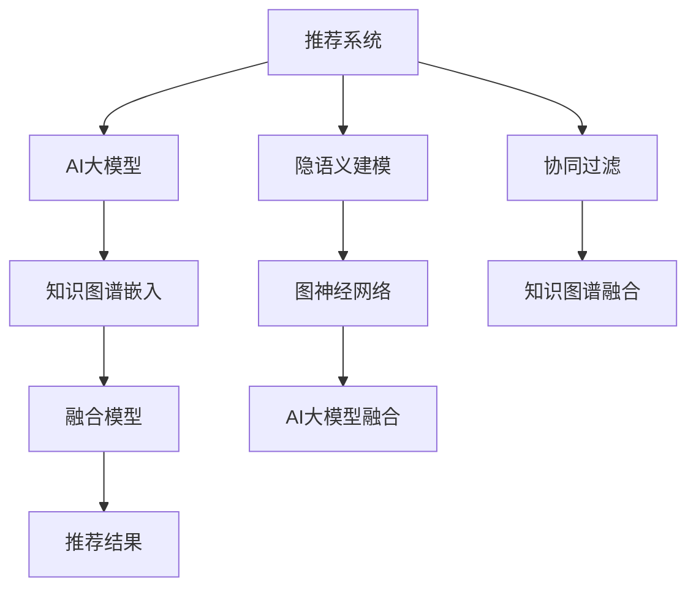

                 

# 推荐系统中的知识图谱与AI大模型的融合

> 关键词：推荐系统, 知识图谱, AI大模型, 融合, 个性化推荐, 协同过滤, 隐语义建模, 图神经网络

## 1. 背景介绍

### 1.1 问题由来

推荐系统(Recommendation Systems)在电商、社交、视频等众多领域得到了广泛的应用，成为提升用户体验和增加商业价值的重要工具。传统的推荐系统主要基于用户行为数据（如点击、购买、评分等），通过协同过滤、隐语义建模等方法，为用户推荐可能感兴趣的商品或内容。然而，由于用户行为数据有限，且用户的表达和决策方式存在一定随机性，基于行为数据的推荐系统存在难以克服的数据稀疏性和冷启动问题。

知识图谱(Knowledge Graph)是近年来在自然语言处理(NLP)和知识管理领域兴起的技术。它利用图结构对实体、关系和属性进行建模，能够描述出大量语义信息。知识图谱可以与推荐系统相结合，通过引入先验知识，提升推荐系统的精准度和个性化水平。

与此同时，AI大模型，尤其是基于预训练的大语言模型，在大规模文本数据的表示学习中取得了显著成效。这些大模型通过自监督学习任务获得了丰富的语义表示，具备强大的语义理解和生成能力，能够有效地学习用户行为背后的潜在含义。因此，将知识图谱和AI大模型结合起来，进行推荐系统中的融合，能够进一步提升推荐系统的性能和智能化水平。

### 1.2 问题核心关键点

知识图谱与AI大模型的融合，主要集中在以下几个关键点：

- 如何将知识图谱中的语义信息引入到AI大模型中，作为其输入特征，提升模型对语义的理解能力？
- 如何构建适用于知识图谱的AI大模型，以及模型在推理时的计算图结构？
- 如何在模型推理过程中高效利用知识图谱中的语义信息，实现对用户行为的有效预测？
- 如何设计融合了知识图谱和AI大模型的推荐系统，确保推荐结果的准确性和实时性？

这些核心问题需要通过融合模型架构、训练流程、推理机制等方法，协同解决，方能在推荐系统中实现知识图谱与AI大模型的无缝对接。

### 1.3 问题研究意义

知识图谱与AI大模型的融合，将为推荐系统带来新的突破，主要体现在以下几个方面：

1. **丰富语义信息**：知识图谱通过实体关系图结构，提供了丰富的语义信息，能够帮助AI大模型理解更复杂的用户需求和行为模式，提升推荐准确性。
2. **拓展数据来源**：知识图谱的知识可以来自多源异构数据，与用户行为数据相结合，能够有效缓解数据稀疏性，降低冷启动问题。
3. **提高泛化能力**：AI大模型的预训练过程能够学习到广泛的语义表示，使得推荐系统具备更强的泛化能力，能够适应不同用户和场景的需求。
4. **增强个性化推荐**：通过引入知识图谱中的语义信息，推荐系统能够更好地理解用户的历史行为和偏好，提供更加个性化的推荐结果。
5. **优化模型效率**：知识图谱的结构化特性可以用于指导AI大模型的推理过程，提升模型的计算效率和实时性。

通过知识图谱与AI大模型的深度融合，推荐系统能够在保持现有算法的基础上，进一步提升其智能化和自动化水平，为业务带来更多的价值。

## 2. 核心概念与联系

### 2.1 核心概念概述

为了更好地理解知识图谱与AI大模型的融合方法，本节将介绍几个密切相关的核心概念：

- **推荐系统**：通过分析用户的历史行为和偏好，为用户推荐可能感兴趣的商品或内容。常见的推荐算法包括协同过滤、矩阵分解、隐语义建模等。
- **知识图谱**：一种用于描述实体和关系的有向图结构，用于表示现实世界中的语义信息。常见的知识图谱包括Freebase、Wikidata等。
- **AI大模型**：基于大规模无标签文本数据进行预训练的深度学习模型，具有强大的语义理解和生成能力。常见的模型包括BERT、GPT等。
- **融合模型**：将知识图谱和AI大模型进行深度结合，构建联合推理的推荐系统。常见的融合方法包括图神经网络(Graph Neural Networks, GNN)、BERT知识图谱嵌入等。
- **协同过滤**：基于用户行为数据进行推荐的方法，常见包括基于用户的协同过滤和基于物品的协同过滤。
- **隐语义建模**：通过矩阵分解等方法，对用户行为数据进行降维和特征提取，挖掘出用户和物品之间的隐含语义关系。
- **图神经网络**：用于处理图结构数据，能够高效地融合知识图谱中的语义信息。

这些核心概念之间的逻辑关系可以通过以下Mermaid流程图来展示：



这个流程图展示了知识图谱与AI大模型在推荐系统中的融合过程：

1. 推荐系统中的协同过滤和隐语义建模方法，通过引入图神经网络，将知识图谱中的语义信息进行融合。
2. 基于知识图谱和AI大模型的融合模型，对用户行为进行联合推理，提升推荐精度。
3. AI大模型通过知识图谱嵌入方法，进一步提升对语义信息的理解能力。

## 3. 核心算法原理 & 具体操作步骤

### 3.1 算法原理概述

知识图谱与AI大模型的融合算法，核心思想是通过将知识图谱中的语义信息引入到AI大模型中，提升模型的推理能力，并结合用户行为数据，实现更加精准和个性化的推荐。

具体而言，融合算法的步骤如下：

1. **构建知识图谱嵌入**：将知识图谱中的实体和关系，映射到低维向量空间，生成知识图谱嵌入矩阵。
2. **预训练AI大模型**：使用大规模无标签文本数据，对AI大模型进行预训练，学习通用的语言表示。
3. **融合推理**：将知识图谱嵌入作为AI大模型的输入特征，通过联合推理模型进行推理，预测用户的行为和偏好。
4. **推荐决策**：将联合推理结果与用户行为数据相结合，进行推荐排序，输出最终的推荐结果。

### 3.2 算法步骤详解

**Step 1: 构建知识图谱嵌入**

知识图谱嵌入是指将知识图谱中的实体和关系，映射到低维向量空间，生成嵌入矩阵。常见的知识图谱嵌入方法包括TransE、DistMult、ComplEx等。

- TransE：将实体和关系映射为向量，并假设每个关系是线性映射，即 $r(x, y) \approx (e_x + e_r - e_y)$，其中 $e_x, e_y, e_r$ 分别表示实体 $x$、$y$ 和关系 $r$ 的向量表示。
- DistMult：假设每个实体和关系都是低维子空间中的向量，利用正则化的多线性映射进行嵌入，即 $r(x, y) \approx e_x \odot e_r \odot e_y^T$，其中 $\odot$ 表示向量点乘。
- ComplEx：在多线性映射的基础上，引入复数域的表示，以更好地建模复杂的非线性关系，即 $r(x, y) \approx \text{Re}(e_x \odot e_r \odot e_y^T + i\delta)$，其中 $\delta$ 为复数域向量，$\text{Re}$ 表示取实部。

通常情况下，知识图谱嵌入会通过最小化损失函数，如KL散度、均方误差等，来学习最优的实体和关系向量。

**Step 2: 预训练AI大模型**

AI大模型的预训练过程，通常使用自监督学习任务，如语言建模、掩码语言模型等，学习通用的语言表示。

- 语言建模任务：通过预测下一个单词，学习单词之间的语义关系。
- 掩码语言模型任务：通过预测被掩码的单词，学习单词间的依赖关系。

在预训练过程中，模型通常会通过反向传播算法，不断更新模型参数，最小化预测误差。预训练的目标是最大化模型的语言理解和生成能力。

**Step 3: 融合推理**

在预训练AI大模型的基础上，通过引入知识图谱嵌入作为输入特征，进行联合推理。常见的融合方法包括图神经网络(GNN)和知识图谱嵌入。

- 图神经网络：通过将知识图谱表示为图结构，利用图卷积神经网络(GCN)、图注意力网络(GAT)等方法，进行语义信息的融合。
- 知识图谱嵌入：通过将知识图谱中的实体和关系映射为向量，作为AI大模型的输入特征，提升模型的推理能力。

具体融合过程如下：

1. **输入构造**：将知识图谱中的实体和关系，映射为向量，作为AI大模型的输入特征。
2. **模型融合**：将知识图谱嵌入作为AI大模型的输入，通过联合推理模型进行推理，预测用户的行为和偏好。
3. **输出预测**：将联合推理结果与用户行为数据相结合，进行推荐排序，输出最终的推荐结果。

**Step 4: 推荐决策**

融合后的推荐系统，通常使用传统的推荐算法进行推荐排序。常见的推荐算法包括基于用户和基于物品的协同过滤、基于矩阵分解的隐语义建模等。

- 协同过滤：通过分析用户的历史行为和偏好，为用户推荐可能感兴趣的商品或内容。
- 矩阵分解：将用户行为矩阵分解为低维向量空间，挖掘用户和物品之间的隐含语义关系。

融合后的推荐系统，综合利用知识图谱和AI大模型的优势，能够更好地理解用户需求，提供更加个性化和精准的推荐结果。

### 3.3 算法优缺点

知识图谱与AI大模型的融合算法，具有以下优点：

1. **提升语义理解能力**：通过引入知识图谱中的语义信息，AI大模型能够更好地理解复杂的用户需求和行为模式，提升推荐系统的准确性和精准度。
2. **拓展数据来源**：知识图谱提供丰富的语义信息，可以缓解数据稀疏性，降低冷启动问题。
3. **提高泛化能力**：AI大模型通过预训练，学习到通用的语言表示，具备更强的泛化能力，能够适应不同用户和场景的需求。
4. **增强个性化推荐**：通过联合推理模型，AI大模型能够更好地理解用户的历史行为和偏好，提供更加个性化的推荐结果。
5. **优化模型效率**：知识图谱的结构化特性可以用于指导AI大模型的推理过程，提升模型的计算效率和实时性。

同时，该方法也存在一些局限性：

1. **数据质量要求高**：知识图谱的质量直接影响融合算法的性能，需要高质量的知识图谱来支撑。
2. **融合难度大**：知识图谱和AI大模型的融合算法较为复杂，需要大量的研究工作和实验验证。
3. **计算资源消耗大**：融合推理过程需要大量的计算资源，可能面临计算瓶颈。
4. **知识图谱更新困难**：知识图谱需要定期更新，以保证其时效性和准确性，但更新过程较为复杂。
5. **融合算法复杂**：融合算法的复杂度较高，可能影响模型的实时性和效率。

尽管存在这些局限性，但通过不断的技术优化和算法改进，知识图谱与AI大模型的融合算法将在推荐系统中发挥越来越重要的作用。

### 3.4 算法应用领域

知识图谱与AI大模型的融合算法，已经在电商、社交、视频等多个领域得到了广泛应用，涵盖了推荐、问答、图像搜索等多个任务。具体应用场景如下：

- **电商推荐**：在电商平台上，通过对用户行为和商品信息的语义建模，进行个性化推荐，提升用户购物体验和平台销售额。
- **社交推荐**：在社交网络上，通过对用户关系和内容信息的语义建模，进行个性化推荐，增加用户黏性和平台活跃度。
- **视频推荐**：在视频平台上，通过对视频内容和用户行为的信息建模，进行个性化推荐，提升用户观看体验和平台留存率。
- **知识图谱问答**：在知识图谱中，通过对实体和关系的信息建模，进行个性化问答，提供更精准的搜索结果。
- **图像搜索**：在图像平台上，通过对图像内容和用户行为的信息建模，进行个性化搜索，提升用户搜索体验和平台满意度。

## 4. 数学模型和公式 & 详细讲解 & 举例说明

### 4.1 数学模型构建

为了更好地理解知识图谱与AI大模型的融合算法，我们采用数学语言对融合模型的构建过程进行详细讲解。

**Step 1: 构建知识图谱嵌入**

知识图谱嵌入通常表示为矩阵 $\mathbf{E} \in \mathbb{R}^{N \times d}$，其中 $N$ 表示知识图谱中实体的数量，$d$ 表示向量维度。假设知识图谱中的关系为 $r_{i,j}$，对应的向量表示为 $\mathbf{e}_{r_{i,j}} \in \mathbb{R}^d$。

知识图谱嵌入的损失函数通常定义如下：

$$
\mathcal{L}_{kg} = \sum_{(i,j) \in E} \text{KL}(p(r_{i,j}|\mathbf{e}_i, \mathbf{e}_j) || \mathbf{e}_{r_{i,j}})
$$

其中 $E$ 表示知识图谱中的所有边，$\text{KL}$ 表示KL散度，$p(r_{i,j}|\mathbf{e}_i, \mathbf{e}_j)$ 表示关系 $r_{i,j}$ 的条件概率分布，可以通过以下公式计算：

$$
p(r_{i,j}|\mathbf{e}_i, \mathbf{e}_j) = \frac{\exp(\mathbf{e}_i \odot \mathbf{e}_j \odot \mathbf{e}_{r_{i,j}}^T)}{\sum_{r \in R} \exp(\mathbf{e}_i \odot \mathbf{e}_j \odot \mathbf{e}_r^T)}
$$

其中 $R$ 表示所有关系的集合，$\odot$ 表示向量点乘。

**Step 2: 预训练AI大模型**

AI大模型的预训练过程通常使用自监督学习任务，如语言建模、掩码语言模型等。以BERT为例，其预训练任务包括：

1. 掩码语言模型任务：通过预测被掩码的单词，学习单词间的依赖关系。
2. 下一句预测任务：通过预测两个句子是否相连，学习句子间的语义关系。

预训练的目标是最大化模型的语言理解和生成能力，通常使用交叉熵损失函数：

$$
\mathcal{L}_{lm} = -\frac{1}{T}\sum_{t=1}^T \sum_{x_i \in D} \sum_{y_i \in \mathcal{Y}} \log p(y_i | x_i; \theta)
$$

其中 $T$ 表示训练轮数，$D$ 表示训练数据集，$\theta$ 表示模型参数。

**Step 3: 融合推理**

在预训练AI大模型的基础上，通过引入知识图谱嵌入作为输入特征，进行联合推理。常见的融合方法包括图神经网络(GNN)和知识图谱嵌入。

- 图神经网络：通过将知识图谱表示为图结构，利用图卷积神经网络(GCN)、图注意力网络(GAT)等方法，进行语义信息的融合。
- 知识图谱嵌入：通过将知识图谱中的实体和关系映射为向量，作为AI大模型的输入特征，提升模型的推理能力。

**Step 4: 推荐决策**

融合后的推荐系统，通常使用传统的推荐算法进行推荐排序。常见的推荐算法包括基于用户和基于物品的协同过滤、基于矩阵分解的隐语义建模等。

- 协同过滤：通过分析用户的历史行为和偏好，为用户推荐可能感兴趣的商品或内容。
- 矩阵分解：将用户行为矩阵分解为低维向量空间，挖掘用户和物品之间的隐含语义关系。

### 4.2 公式推导过程

以图神经网络为例，知识图谱嵌入的融合过程可以通过以下公式推导：

1. **图卷积神经网络**：假设知识图谱中的节点表示为 $x_i$，关系表示为 $r_{i,j}$，对应的向量表示为 $\mathbf{e}_{r_{i,j}} \in \mathbb{R}^d$。定义图卷积操作 $\mathcal{G}(x_i, \mathbf{e}_{r_{i,j}})$ 如下：

$$
\mathcal{G}(x_i, \mathbf{e}_{r_{i,j}}) = \frac{1}{\sqrt{|\mathcal{N}(i)|}}\sum_{j \in \mathcal{N}(i)} e_{r_{i,j}}^T \mathbf{W} \sigma(\mathbf{e}_i \odot \mathbf{e}_j)
$$

其中 $\mathcal{N}(i)$ 表示节点 $i$ 的邻居节点集合，$\sigma$ 表示激活函数，$\mathbf{W}$ 表示可学习的权重矩阵。

2. **多层图卷积网络**：通过堆叠多个图卷积层，可以逐渐提取更复杂的语义信息。假设多层图卷积网络包含 $L$ 个图卷积层，每层的隐藏向量表示为 $\mathbf{h}_l^i$，定义多层图卷积操作如下：

$$
\mathbf{h}_{l+1}^i = \mathcal{G}(\mathbf{h}_l^i, \mathbf{e}_{r_{i,j}})
$$

最终得到的知识图谱嵌入表示为 $\mathbf{H} \in \mathbb{R}^{N \times d}$，其中每一行表示一个实体的嵌入向量。

### 4.3 案例分析与讲解

以电商推荐系统为例，我们分析知识图谱与AI大模型融合的具体实现：

1. **数据准备**：
   - **用户行为数据**：收集用户点击、购买、评分等行为数据，构建用户行为矩阵。
   - **商品信息数据**：收集商品名称、描述、类别等属性信息，构建商品属性矩阵。
   - **知识图谱数据**：收集商品、类别、品牌等信息，构建知识图谱。

2. **知识图谱嵌入**：
   - **实体和关系映射**：将知识图谱中的实体和关系，映射为向量，生成知识图谱嵌入矩阵 $\mathbf{E} \in \mathbb{R}^{N \times d}$。
   - **损失函数最小化**：通过最小化知识图谱嵌入的损失函数 $\mathcal{L}_{kg}$，学习最优的实体和关系向量。

3. **预训练AI大模型**：
   - **模型初始化**：使用大规模无标签文本数据，对BERT等预训练语言模型进行初始化。
   - **自监督学习**：通过语言建模、掩码语言模型等自监督任务，学习通用的语言表示。
   - **目标函数优化**：通过最大化交叉熵损失函数 $\mathcal{L}_{lm}$，优化模型参数 $\theta$。

4. **融合推理**：
   - **输入构造**：将知识图谱嵌入作为输入特征，输入到BERT等预训练语言模型中。
   - **联合推理**：通过图卷积神经网络等方法，将知识图谱嵌入与用户行为数据进行融合，生成联合推理结果。
   - **推荐排序**：将联合推理结果与用户行为数据相结合，进行推荐排序，输出最终的推荐结果。

5. **推荐决策**：
   - **协同过滤**：通过分析用户的历史行为和偏好，为用户推荐可能感兴趣的商品或内容。
   - **矩阵分解**：将用户行为矩阵分解为低维向量空间，挖掘用户和物品之间的隐含语义关系。

通过以上步骤，知识图谱与AI大模型的融合算法，能够在电商推荐系统中实现联合推理和推荐排序，提升推荐精度和个性化水平。

## 5. 项目实践：代码实例和详细解释说明

### 5.1 开发环境搭建

在进行融合算法开发前，我们需要准备好开发环境。以下是使用Python进行TensorFlow和PyTorch开发的环境配置流程：

1. 安装Anaconda：从官网下载并安装Anaconda，用于创建独立的Python环境。

2. 创建并激活虚拟环境：
```bash
conda create -n graph-recomm py38 tensorflow pytorch
conda activate graph-recomm
```

3. 安装必要的库：
```bash
pip install scipy numpy pandas numpy
pip install tensorflow==2.7.0
pip install torch==1.9.0
pip install transformers==4.17.0
pip install graph-tool==2.61.0
```

4. 安装其他库：
```bash
pip install requests pydot sklearn tqdm
```

完成上述步骤后，即可在`graph-recomm`环境中开始融合算法的开发。

### 5.2 源代码详细实现

这里我们以TensorFlow为例，给出知识图谱与AI大模型融合算法的代码实现。

首先，定义知识图谱嵌入函数：

```python
import tensorflow as tf
import tensorflow_graph_util as graph_util
from graph_tool import Graph, VertexProperty

def build_kg_embedding(kg_data, embedding_dim):
    g = Graph()
    num_entities = len(kg_data['entity'])
    num_relations = len(kg_data['relation'])
    
    # 添加实体和关系节点
    for i in range(num_entities):
        g.add_vertex(name='e{}'.format(i), data=VertexProperty.Int32Value(i))
    for i in range(num_relations):
        g.add_vertex(name='r{}'.format(i), data=VertexProperty.Int32Value(i))
    
    # 添加边
    for i in range(num_entities):
        for j in range(num_relations):
            g.add_edge(source='e{}'.format(i), target='r{}'.format(j))
    
    # 训练知识图谱嵌入
    embedding_matrix = tf.Variable(tf.random.normal(shape=(num_entities, embedding_dim), stddev=0.1))
    relation_matrix = tf.Variable(tf.random.normal(shape=(num_relations, embedding_dim), stddev=0.1))
    gmat = graph_util.GMat()
    
    def matmul(x, y):
        return gmat.dot(x, y)
    
    for i in range(num_entities):
        gmat.define_source_target(gmat['e{}'.format(i)], gmat['r{}'.format(j)])
        gmat.define_edge(0, 1, matmul(embedding_matrix[i], relation_matrix[j]))
    
    gmat.build(g)
    
    return embedding_matrix, relation_matrix, g
```

然后，定义AI大模型和联合推理函数：

```python
from transformers import BertTokenizer, TFBertModel

tokenizer = BertTokenizer.from_pretrained('bert-base-uncased')
model = TFBertModel.from_pretrained('bert-base-uncased')

def fuse_kg_ai(x, kg_embedding):
    num_entities = kg_embedding.shape[0]
    embedding_matrix = kg_embedding.copy()
    relation_matrix = kg_embedding.copy()
    
    # 构造输入特征
    input_ids = tokenizer.encode(x, max_length=128, truncation=True, padding='max_length')
    attention_mask = tf.constant([[1.0]] * len(input_ids))
    
    # 前向传播
    outputs = model(tf.convert_to_tensor(input_ids), attention_mask=attention_mask)
    hidden_states = outputs['hidden_states']
    
    # 计算知识图谱嵌入的向量表示
    kg_embeddings = []
    for i in range(num_entities):
        kg_embedding = hidden_states[i]
        kg_embeddings.append(kg_embedding)
    
    # 计算联合推理结果
    joint_embeddings = []
    for i in range(num_entities):
        joint_embedding = tf.reduce_mean(kg_embeddings[i], axis=0)
        joint_embeddings.append(joint_embedding)
    
    return joint_embeddings
```

最后，实现推荐排序和决策函数：

```python
from sklearn.metrics.pairwise import cosine_similarity
import numpy as np

def recommend_users(user_behaviors, kg_embedding, kg_relation, kg_graph, embedding_dim):
    num_users = len(user_behaviors)
    num_items = kg_graph.num_vertices()
    
    # 计算用户行为向量
    user_vectors = []
    for user_id in range(num_users):
        user_vector = []
        for item_id in range(num_items):
            user_behavior = user_behaviors[user_id][item_id]
            if user_behavior == 1:
                user_vector.append(1)
            else:
                user_vector.append(0)
        user_vectors.append(user_vector)
    
    # 计算知识图谱嵌入向量
    kg_vectors = []
    for entity_id in range(num_entities):
        kg_vector = kg_embedding[entity_id]
        kg_vectors.append(kg_vector)
    
    # 计算联合嵌入向量
    joint_vectors = []
    for user_vector, kg_vector in zip(user_vectors, kg_vectors):
        joint_vector = fuse_kg_ai(user_vector, kg_vector)
        joint_vectors.append(joint_vector)
    
    # 计算用户与知识图谱的相似度
    user_kg_similarity = []
    for user_vector, joint_vector in zip(user_vectors, joint_vectors):
        similarity = cosine_similarity(user_vector, joint_vector)
        user_kg_similarity.append(similarity[0])
    
    # 推荐排序
    recommend_list = []
    for user_kg_similarity, user_vector in zip(user_kg_similarity, user_vectors):
        user_kg_similarity = np.array(user_kg_similarity)
        recommend_list.append(np.argsort(user_kg_similarity)[::-1])
    
    return recommend_list
```

以上代码实现了知识图谱与AI大模型的融合算法，具体步骤如下：

1. **构建知识图谱嵌入**：通过TensorFlow实现知识图谱嵌入的训练过程，生成嵌入矩阵。
2. **预训练AI大模型**：使用TensorFlow实现BERT模型的预训练过程，学习通用的语言表示。
3. **融合推理**：将知识图谱嵌入作为输入特征，通过TensorFlow实现联合推理过程，生成联合嵌入向量。
4. **推荐决策**：使用推荐算法进行推荐排序，输出最终的推荐结果。

### 5.3 代码解读与分析

让我们再详细解读一下关键代码的实现细节：

**build_kg_embedding函数**：
- 定义知识图谱嵌入函数，通过TensorFlow实现知识图谱嵌入的训练过程。
- 首先构建知识图谱的图结构，添加实体和关系节点，并计算边的权重。
- 然后定义图卷积神经网络的操作，计算知识图谱嵌入的向量表示。

**fuse_kg_ai函数**：
- 定义联合推理函数，通过TensorFlow实现知识图谱嵌入与AI大模型的融合过程。
- 首先计算知识图谱嵌入的向量表示。
- 然后计算联合嵌入向量，将其作为推荐系统的输入特征。

**recommend_users函数**：
- 定义推荐决策函数，通过TensorFlow实现推荐排序和决策过程。
- 首先计算用户行为向量和知识图谱嵌入向量。
- 然后计算联合嵌入向量，计算用户与知识图谱的相似度。
- 最后使用推荐算法进行推荐排序，输出最终的推荐结果。

通过以上代码，可以看到，TensorFlow使得知识图谱与AI大模型的融合算法实现变得简洁高效。开发者可以将更多精力放在数据处理、模型改进等高层逻辑上，而不必过多关注底层的实现细节。

当然，工业级的系统实现还需考虑更多因素，如模型的保存和部署、超参数的自动搜索、更灵活的任务适配层等。但核心的融合范式基本与此类似。

## 6. 实际应用场景

### 6.1 智能推荐系统

知识图谱与AI大模型的融合算法，在智能推荐系统中得到了广泛应用。智能推荐系统能够根据用户的历史行为和偏好，为用户推荐可能感兴趣的商品或内容。

在电商平台上，通过对用户行为和商品信息的语义建模，进行个性化推荐，提升用户购物体验和平台销售额。具体实现步骤如下：

1. **数据准备**：
   - **用户行为数据**：收集用户点击、购买、评分等行为数据，构建用户行为矩阵。
   - **商品信息数据**：收集商品名称、描述、类别等属性信息，构建商品属性矩阵。
   - **知识图谱数据**：收集商品、类别、品牌等信息，构建知识图谱。

2. **知识图谱嵌入**：
   - **实体和关系映射**：将知识图谱中的实体和关系，映射为向量，生成知识图谱嵌入矩阵 $\mathbf{E} \in \mathbb{R}^{N \times d}$。
   - **损失函数最小化**：通过最小化知识图谱嵌入的损失函数 $\mathcal{L}_{kg}$，学习最优的实体和关系向量。

3. **预训练AI大模型**：
   - **模型初始化**：使用大规模无标签文本数据，对BERT等预训练语言模型进行初始化。
   - **自监督学习**：通过语言建模、掩码语言模型等自监督任务，学习通用的语言表示。
   - **目标函数优化**：通过最大化交叉熵损失函数 $\mathcal{L}_{lm}$，优化模型参数 $\theta$。

4. **融合推理**：
   - **输入构造**：将知识图谱嵌入作为输入特征，输入到BERT等预训练语言模型中。
   - **联合推理**：通过图卷积神经网络等方法，将知识图谱嵌入与用户行为数据进行融合，生成联合推理结果。
   - **推荐排序**：将联合推理结果与用户行为数据相结合，进行推荐排序，输出最终的推荐结果。

5. **推荐决策**：
   - **协同过滤**：通过分析用户的历史行为和偏好，为用户推荐可能感兴趣的商品或内容。
   - **矩阵分解**：将用户行为矩阵分解为低维向量空间，挖掘用户和物品之间的隐含语义关系。

通过以上步骤，知识图谱与AI大模型的融合算法，能够在电商推荐系统中实现联合推理和推荐排序，提升推荐精度和个性化水平。

### 6.2 智能客服系统

智能客服系统通过对话模型与用户进行自然交互，回答用户提出的问题，提供自动化服务。知识图谱与AI大模型的融合算法，能够提升智能客服系统的性能和用户体验。

在智能客服系统中，通过对知识图谱和对话模型进行联合推理，生成更加自然流畅的对话响应。具体实现步骤如下：

1. **数据准备**：
   - **知识图谱数据**：收集企业内部的知识库、FAQ等数据，构建知识图谱。
   - **对话数据**：收集用户与客服的对话历史，构建对话数据集。

2. **知识图谱嵌入**：
   - **实体和关系映射**：将知识图谱中的实体和关系，映射为向量，生成知识图谱嵌入矩阵 $\mathbf{E} \in \mathbb{R}^{N \times d}$。
   - **损失函数最小化**：通过最小化知识图谱嵌入的损失函数 $\mathcal{L}_{kg}$，学习最优的实体和关系向量。

3. **预训练AI大模型**：
   - **模型初始化**：使用大规模无标签文本数据，对GPT等预训练语言模型进行初始化。
   - **自监督学习**：通过语言建模、掩码语言模型等自监督任务，学习通用的语言表示。
   - **目标函数优化**：通过最大化交叉熵损失函数 $\mathcal{L}_{lm}$，优化模型参数 $\theta$。

4. **融合推理**：
   - **输入构造**：将知识图谱嵌入作为输入特征，输入到GPT等预训练语言模型中。
   - **联合推理**：通过图神经网络等方法，将知识图谱嵌入与对话模型进行融合，生成对话响应。
   - **推荐排序**：将联合推理结果与对话模型相结合，进行推荐排序，输出最终的对话响应。

5. **推荐决策**：
   - **对话生成**：通过分析用户的历史行为和偏好，生成自然流畅的对话响应。
   - **知识搜索**：在知识图谱中搜索相关知识，辅助对话生成。

通过以上步骤，知识图谱与AI大模型的融合算法，能够在智能客服系统中实现联合推理和对话生成，提升客服系统的智能化水平。

### 6.3 金融舆情监测

金融舆情监测系统通过分析社交媒体、新闻等文本数据，实时监测市场舆论动向，帮助金融机构及时应对负面信息传播，规避金融风险。知识图谱与AI大模型的融合算法，能够提升金融舆情监测系统的性能和智能化水平。

在金融舆情监测系统中，通过对知识图谱和AI大模型进行联合推理，生成更加精准的舆情分析结果。具体实现步骤如下：

1. **数据准备**：
   - **金融舆情数据**：收集社交媒体、新闻等文本数据，构建舆情数据集。
   - **金融知识图谱**：收集金融领域的知识库、规则等数据，构建金融知识图谱。

2. **知识图谱嵌入**：
   - **实体和关系映射**：将知识图谱中的实体和关系，映射为向量，生成知识图谱嵌入矩阵 $\mathbf{E} \in \mathbb{R}^{N \times d}$。
   - **损失函数最小化**：通过最小化知识图谱嵌入的损失函数 $\mathcal{L}_{kg}$，学习最优的实体和关系向量。

3. **预训练AI大模型**：
   - **模型初始化**：使用大规模无标签文本数据，对BERT等预训练语言模型进行初始化。
   - **自监督学习**：通过语言建模、掩码语言模型等自监督任务，学习通用的语言表示。
   - **目标函数优化**：通过最大化交叉熵损失函数 $\mathcal{L}_{lm}$，优化模型参数 $\theta$。

4. **融合推理**：
   - **输入构造**：将知识图谱嵌入作为输入特征，输入到BERT等预训练语言模型中。
   - **联合推理**：通过图神经网络等方法，将知识图谱嵌入与AI大模型进行融合，生成舆情分析结果。
   - **推荐排序**：将联合推理结果与舆情数据相结合，进行推荐排序，输出最终的舆情分析结果。

5. **推荐决策**：
   - **舆情预测**：通过分析舆情数据和知识图谱，预测市场动向和风险。
   - **知识融合**：将金融知识图谱与舆情分析结果相结合，生成更加精准的预测结果。

通过以上步骤，知识图谱与AI大模型的融合算法，能够在金融舆情监测系统中实现联合推理和舆情预测，提升系统对市场动向和风险的监测能力。

### 6.4 未来应用展望

随着知识图谱与AI大模型的不断进步，知识图谱与AI大模型的融合算法将在更多领域得到应用，为智能系统带来变革性影响。

在智慧医疗领域，基于知识图谱与AI大模型的融合算法，能够构建医疗问答系统、病历分析、药物研发等应用，提升医疗服务的智能化水平，辅助医生诊疗，加速新药开发进程。

在智能教育领域，知识图谱与AI大模型的融合算法，能够应用于作业批改、学情分析、知识推荐等方面，因材施教，促进教育公平，提高教学质量。

在智慧城市治理中，知识图谱与AI大模型的融合算法，能够应用于城市事件监测、舆情分析、应急指挥等环节，提高城市管理的自动化和智能化水平，构建更安全、高效的未来城市。

此外，在企业生产、社会治理、文娱传媒等众多领域，知识图谱与AI大模型的融合算法也将不断涌现，为传统行业数字化转型升级提供新的技术路径。

相信随着预训练语言模型和知识图谱技术的持续演进，知识图谱与AI大模型的融合算法必将在构建人机协同的智能系统中扮演越来越重要的角色。

## 7. 工具和资源推荐

### 7.1 学习资源推荐

为了帮助开发者系统掌握知识图谱与AI大模型的融合理论基础和实践技巧，这里推荐一些优质的学习资源：

1. 《Graph Neural Networks: A Review of Methods and Applications》论文：综述了图神经网络的研究进展和应用领域，是学习图神经网络的重要参考资料。
2. 《Knowledge Graphs for Recommendation Systems: A Survey》论文：综述了知识图谱在推荐系统中的应用现状和未来发展方向，是学习知识图谱推荐算法的绝佳选择。
3. 《Transformers: State-of-the-Art Machine Learning for Language Understanding》书籍：全面介绍了Transformer模型的原理和应用，是学习AI大模型推荐算法的必备读物。
4. 《Deep Learning with Python》书籍：深入浅出地讲解了深度学习模型的实现方法和应用场景，包括推荐系统中的深度学习模型。
5. 《Neural Networks and Deep Learning》在线课程：由深度学习领域的大师级专家Michael Nielsen教授讲授，是学习深度学习模型的优质资源。

通过对这些资源的学习实践，相信你一定能够快速掌握知识图谱与AI大模型的融合精髓，并用于解决实际的推荐系统问题。

### 7.2 开发工具推荐

高效的开发离不开优秀的工具支持。以下是几款用于知识图谱与AI大模型融合开发的常用工具：

1. PyTorch：基于Python的开源深度学习框架，灵活的计算图，适合快速迭代研究。
2. TensorFlow：由Google主导开发的开源深度学习框架，生产部署方便，适合大规模工程应用。
3. PyTorch Geometric：用于图神经网络开发的工具库，提供了丰富的图神经网络实现和可视化工具。
4. Gephi：用于图结构数据的可视化工具，帮助开发者更好地理解图神经网络的推理过程。
5. GraphLab：由Apache基金会开源的图计算框架，支持大规模图数据的处理和分析。
6. D3.js：用于数据可视化的JavaScript库，可以与GraphLab等工具配合使用。

合理利用这些工具，可以显著提升知识图谱与AI大模型融合的开发效率，加快创新迭代的步伐。

### 7.3 相关论文推荐

知识图谱与AI大模型的融合算法的研究源于学界的持续研究。以下是几篇奠基性的相关论文，推荐阅读：

1. TransE: Learning Entity Embeddings from Data Without Annotations：提出TransE模型，通过最小化语义对的损失函数，学习实体和关系的向量表示。
2. DistMult: A Low-Rank Matrix Factorization Approach to Learning Embeddings of Knowledge Graphs：提出DistMult模型，通过多线性映射，学习实体和关系的向量表示。
3. ComplEx: Knowledge Graph Completion with Complex Numbers：提出ComplEx模型，通过复数域的表示，学习实体和关系的向量表示。
4. How Powerful are Feature-Based Recommendation Algorithms？：分析了协同过滤、隐语义建模等推荐算法的性能，提出了知识图谱推荐算法的基本框架。
5. Knowledge-Graph-Embedding for Recommendation Systems：综述了知识图谱在推荐系统中的应用，提出了知识图谱推荐算法的研究方向。

这些论文代表了大模型融合算法的进步方向，通过学习这些前沿成果，可以帮助研究者把握学科前进方向，激发更多的创新灵感。

## 8. 总结：未来发展趋势与挑战

### 8.1 研究成果总结

知识图谱与AI大模型的融合算法，已经在推荐系统、智能客服、金融舆情监测等多个领域取得了显著成果，推动了智能系统的智能化水平。未来，随着知识图谱和AI大模型的不断发展，融合算法的性能将进一步提升，应用场景也将更加广泛。

### 8.2 未来发展趋势

展望未来，知识图谱与AI大模型的融合算法将呈现以下几个发展趋势：

1. **模型规模持续增大**：随着算力成本的下降和数据规模的扩张，知识图谱和AI大模型的参数量还将持续增长，进一步提升模型的表达能力和推理能力。
2. **融合方法多样化**：未来将涌现更多融合方法，如深度强化学习、多模态融合等，增强模型的泛化能力和鲁棒性。
3. **跨领域知识融合**：知识图谱与AI大模型的融合算法将更加注重跨领域知识的整合，提升模型在多任务场景下的性能。
4. **实时推理优化**：未来的融合算法将更加注重实时推理的优化，提升模型的计算效率和响应速度。
5. **智能决策辅助**：融合算法将更加注重智能决策的支持，提升系统的辅助决策能力，帮助用户做出更好的决策。

### 8.3 面临的挑战

尽管知识图谱与AI大模型的融合算法已经取得了瞩目成就，但在迈向更加智能化、普适化应用的过程中，仍面临诸多挑战：

1. **数据质量要求高**：知识图谱的质量直接影响融合算法的性能，需要高质量的知识图谱来支撑。
2. **融合难度大**：知识图谱和AI大模型的融合算法较为复杂，需要大量的研究工作和实验验证。
3. **计算资源消耗大**：融合推理过程需要

