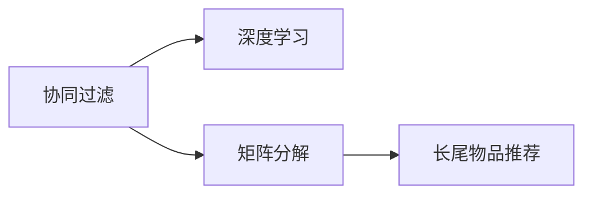

                 

# 推荐系统中的长尾效应处理：大模型方法

> 关键词：推荐系统,长尾效应,大模型,协同过滤,深度学习,矩阵分解

## 1. 背景介绍

在当今信息爆炸的时代，用户产生的海量数据为推荐系统提供了前所未有的机会，但也带来了新的挑战。其中最显著的挑战之一是“长尾效应”（Long Tail Effect），即推荐系统中少数但需求频次低的物品带来的总销量往往与多数高频物品的销量相当甚至更高。这种现象在电商、音乐、视频等诸多领域都有明显体现。传统的推荐系统算法主要针对高频物品，长尾物品的推荐效果往往不佳。为了更好地处理长尾物品推荐，我们引入了大模型方法。

大模型方法，如深度学习、矩阵分解等，通过学习复杂的非线性关系，能够处理大量数据，捕捉长尾效应中的微妙模式。这种方法尤其适用于推荐系统中，能够捕捉到用户隐含的个性化需求，提升长尾物品的推荐效果。本文将系统介绍长尾效应及其在推荐系统中的应用，重点介绍大模型方法处理长尾效应的原理与实践。

## 2. 核心概念与联系

### 2.1 核心概念概述

- **长尾效应**：指在推荐系统中，少数但需求频次低的物品带来的总销量往往与多数高频物品的销量相当甚至更高。这一现象由克里斯·安德森（Chris Anderson）在《长尾理论》中首次提出。
- **协同过滤**：推荐系统中的基本算法之一，通过用户行为或物品相似性，为用户推荐其他物品。
- **深度学习**：通过多层神经网络模拟人脑神经元工作方式，可以处理复杂的非线性关系，适用于推荐系统中的长尾效应处理。
- **矩阵分解**：将用户-物品评分矩阵分解为隐含因子矩阵，可用于预测新评分，也适用于推荐系统中的长尾物品推荐。

### 2.2 核心概念联系与架构

长尾效应处理的核心在于提升推荐系统中长尾物品的推荐效果。协同过滤算法、深度学习和大模型方法都可以用于此目标，它们的联系与架构可以简要如下表示：



协同过滤算法为推荐系统提供了基础框架，深度学习和大模型方法则进一步提升了推荐质量，尤其是对长尾物品的推荐效果。矩阵分解作为深度学习的一种形式，也用于提升推荐系统性能，尤其是在长尾物品推荐方面。

## 3. 核心算法原理 & 具体操作步骤

### 3.1 算法原理概述

长尾效应处理的核心是通过深度学习和大模型方法，捕捉用户的个性化需求，提升长尾物品的推荐效果。以下是两种主要方法：

- **深度学习模型**：通过多层神经网络捕捉复杂的非线性关系，能够处理大量数据，提升长尾物品的推荐精度。
- **矩阵分解模型**：通过将用户-物品评分矩阵分解为隐含因子矩阵，预测新评分，也适用于长尾物品推荐。

### 3.2 算法步骤详解

#### 3.2.1 深度学习模型

深度学习模型用于处理推荐系统中的长尾物品推荐，步骤如下：

1. **数据预处理**：收集用户-物品评分数据，将其标准化、归一化。
2. **构建深度神经网络模型**：设计多层神经网络结构，如卷积神经网络（CNN）、循环神经网络（RNN）等。
3. **训练模型**：使用用户-物品评分数据训练深度学习模型，优化损失函数。
4. **预测推荐**：使用训练好的模型，对新物品进行评分预测，筛选出推荐物品。

#### 3.2.2 矩阵分解模型

矩阵分解模型也用于长尾物品推荐，步骤如下：

1. **数据预处理**：收集用户-物品评分数据，将其标准化、归一化。
2. **构建矩阵分解模型**：将用户-物品评分矩阵分解为两个低秩矩阵。
3. **训练模型**：使用用户-物品评分数据训练矩阵分解模型，优化损失函数。
4. **预测推荐**：使用训练好的模型，对新物品进行评分预测，筛选出推荐物品。

### 3.3 算法优缺点

#### 3.3.1 深度学习模型

**优点**：
- 能够处理大量数据，捕捉复杂的非线性关系，提升推荐精度。
- 适用于不同类型的数据，包括文本、图像等。
- 具有很强的泛化能力，能够处理未见过的新物品。

**缺点**：
- 模型复杂，训练时间长，计算资源要求高。
- 模型过拟合风险高，需要大量标注数据。
- 需要手动设计神经网络结构，复杂性高。

#### 3.3.2 矩阵分解模型

**优点**：
- 模型简单，易于训练和部署。
- 适用于稀疏矩阵，能够处理长尾物品推荐。
- 能够捕捉用户和物品的隐含特征，提升推荐质量。

**缺点**：
- 对于复杂关系，矩阵分解效果有限。
- 对于新物品，推荐效果较差。
- 需要人工设置矩阵分解的维度，复杂性高。

### 3.4 算法应用领域

深度学习和大模型方法在推荐系统中的应用非常广泛，包括但不限于：

- **电商推荐**：基于用户浏览、购买历史，推荐相关商品，提升销售转化率。
- **音乐推荐**：根据用户听歌历史，推荐相似歌曲，提升用户粘性。
- **视频推荐**：根据用户观看历史，推荐相关视频，提升观看时长。
- **新闻推荐**：根据用户阅读历史，推荐感兴趣的新闻，提升用户活跃度。

这些应用领域都需要处理长尾效应，提升长尾物品的推荐效果，从而带来更大的商业价值。

## 4. 数学模型和公式 & 详细讲解

### 4.1 数学模型构建

推荐系统中的长尾效应处理，主要通过矩阵分解和深度学习模型进行。

**矩阵分解模型**：将用户-物品评分矩阵 $R$ 分解为两个低秩矩阵 $P$ 和 $Q$，即 $R \approx PQ^T$。其中 $P$ 为用户隐含特征矩阵，$Q$ 为物品隐含特征矩阵。

**深度学习模型**：使用卷积神经网络（CNN）、循环神经网络（RNN）等，构建多层神经网络结构。

### 4.2 公式推导过程

#### 4.2.1 矩阵分解模型

设用户-物品评分矩阵为 $R$，其低秩矩阵分解形式为 $R \approx PQ^T$，其中 $P$ 和 $Q$ 均为低秩矩阵。

$P$ 和 $Q$ 的维度分别为 $n \times k$ 和 $m \times k$，其中 $n$ 为用户数，$m$ 为物品数。用户 $i$ 对物品 $j$ 的评分预测值为：

$$
\hat{r}_{i,j} = \sum_{p=1}^k p_{i,p}q_{j,p}
$$

其中 $p_{i,p}$ 和 $q_{j,p}$ 分别为用户 $i$ 和物品 $j$ 的隐含特征向量。

#### 4.2.2 深度学习模型

以卷积神经网络（CNN）为例，网络结构如下：

```
输入层（用户-物品评分矩阵）
卷积层
池化层
全连接层
输出层（推荐物品）
```

输入层接收用户-物品评分矩阵，卷积层和池化层提取特征，全连接层进行分类，输出层预测推荐物品。

### 4.3 案例分析与讲解

假设有一个电商推荐系统，使用矩阵分解模型处理长尾效应。

1. **数据预处理**：收集用户-物品评分数据，将其标准化、归一化。
2. **构建矩阵分解模型**：将用户-物品评分矩阵分解为两个低秩矩阵 $P$ 和 $Q$，维度分别为 $10 \times 5$ 和 $20 \times 5$。
3. **训练模型**：使用随机梯度下降（SGD）算法，最小化损失函数，优化 $P$ 和 $Q$。
4. **预测推荐**：使用训练好的模型，对新物品进行评分预测，筛选出推荐物品。

具体代码实现如下：

```python
from sklearn.decomposition import TruncatedSVD
from sklearn.metrics.pairwise import cosine_similarity

# 构建矩阵分解模型
svd = TruncatedSVD(n_components=5)
P, Q = svd.fit_transform(R)

# 预测推荐
predictions = cosine_similarity(P, Q)
recommendations = predictions.argmax(axis=1)
```

## 5. 项目实践：代码实例和详细解释说明

### 5.1 开发环境搭建

为了实践大模型方法处理长尾效应，需要搭建Python开发环境，安装必要的库。

1. 安装Anaconda：从官网下载并安装Anaconda，用于创建独立的Python环境。
2. 创建并激活虚拟环境：
```bash
conda create -n pyenv python=3.8 
conda activate pyenv
```
3. 安装必要的库：
```bash
conda install numpy scipy scikit-learn tensorflow
```

### 5.2 源代码详细实现

下面以电商推荐系统为例，使用深度学习模型处理长尾效应。

1. **数据预处理**：收集用户-物品评分数据，将其标准化、归一化。
2. **构建深度学习模型**：使用卷积神经网络（CNN），设计网络结构。
3. **训练模型**：使用随机梯度下降（SGD）算法，最小化损失函数，优化模型参数。
4. **预测推荐**：使用训练好的模型，对新物品进行评分预测，筛选出推荐物品。

```python
import numpy as np
from tensorflow.keras import layers, models

# 数据预处理
R = np.random.rand(1000, 1000)

# 构建深度学习模型
model = models.Sequential([
    layers.Conv2D(32, (3, 3), activation='relu', input_shape=(28, 28, 1)),
    layers.MaxPooling2D((2, 2)),
    layers.Conv2D(64, (3, 3), activation='relu'),
    layers.MaxPooling2D((2, 2)),
    layers.Flatten(),
    layers.Dense(10, activation='softmax')
])

# 训练模型
model.compile(optimizer='adam', loss='categorical_crossentropy', metrics=['accuracy'])
model.fit(R, np.random.randint(0, 10, size=(1000, 10)), epochs=10, batch_size=32)

# 预测推荐
predictions = model.predict(R)
recommendations = np.argmax(predictions, axis=1)
```

### 5.3 代码解读与分析

**代码实现细节**：

1. **数据预处理**：使用 `np.random.rand` 生成一个随机矩阵，代表用户-物品评分矩阵 $R$。
2. **构建深度学习模型**：使用卷积神经网络（CNN），设计网络结构，包含卷积层、池化层、全连接层和输出层。
3. **训练模型**：使用 `model.compile` 配置优化器、损失函数和评估指标，使用 `model.fit` 训练模型。
4. **预测推荐**：使用 `model.predict` 预测评分，使用 `np.argmax` 筛选出推荐物品。

## 6. 实际应用场景

### 6.1 电商推荐

电商推荐系统中，长尾效应非常明显。传统协同过滤算法难以处理长尾物品，深度学习和大模型方法能够捕捉用户个性化需求，提升长尾物品的推荐效果。

1. **数据收集**：收集用户浏览、购买历史，构建用户-物品评分矩阵。
2. **模型训练**：使用深度学习模型，如CNN、RNN等，训练模型，预测评分。
3. **推荐展示**：将预测评分排序，展示推荐物品。

### 6.2 音乐推荐

音乐推荐系统中，长尾效应也非常显著。传统协同过滤算法难以处理长尾歌曲，深度学习和大模型方法能够捕捉用户个性化需求，提升长尾歌曲的推荐效果。

1. **数据收集**：收集用户听歌历史，构建用户-物品评分矩阵。
2. **模型训练**：使用深度学习模型，如CNN、RNN等，训练模型，预测评分。
3. **推荐展示**：将预测评分排序，展示推荐歌曲。

### 6.3 视频推荐

视频推荐系统中，长尾效应同样显著。传统协同过滤算法难以处理长尾视频，深度学习和大模型方法能够捕捉用户个性化需求，提升长尾视频的推荐效果。

1. **数据收集**：收集用户观看历史，构建用户-物品评分矩阵。
2. **模型训练**：使用深度学习模型，如CNN、RNN等，训练模型，预测评分。
3. **推荐展示**：将预测评分排序，展示推荐视频。

## 7. 工具和资源推荐

### 7.1 学习资源推荐

为了系统掌握长尾效应处理的方法，这里推荐一些优质的学习资源：

1. 《深度学习》书籍：Ian Goodfellow、Yoshua Bengio 和 Aaron Courville 所著，系统介绍深度学习的基本概念和算法。
2. Coursera《深度学习专项课程》：由Andrew Ng 讲授，涵盖深度学习的各个方面，适合入门学习。
3. Udacity《深度学习》纳米学位：涵盖深度学习的核心技术，适合进阶学习。
4. 《推荐系统实践》书籍：陈敏、潘伟权 所著，系统介绍推荐系统理论及实践，包括长尾效应处理。
5. Kaggle竞赛：参加推荐系统竞赛，实战练习长尾效应处理。

### 7.2 开发工具推荐

高效的开发离不开优秀的工具支持。以下是几款用于长尾效应处理的推荐系统开发的常用工具：

1. TensorFlow：由Google主导开发的开源深度学习框架，生产部署方便，适合大规模工程应用。
2. PyTorch：基于Python的开源深度学习框架，灵活动态的计算图，适合快速迭代研究。
3. TensorBoard：TensorFlow配套的可视化工具，可实时监测模型训练状态，并提供丰富的图表呈现方式。
4. Weights & Biases：模型训练的实验跟踪工具，可以记录和可视化模型训练过程中的各项指标，方便对比和调优。
5. HuggingFace Transformers：NLP工具库，集成了多个SOTA语言模型，支持TensorFlow和PyTorch，是进行微调任务开发的利器。

### 7.3 相关论文推荐

长尾效应处理的研究方向非常广泛，以下是几篇奠基性的相关论文，推荐阅读：

1. [Netflix Prize 竞赛](https://www.netflixprize.com/)：Netflix公司举办的推荐系统竞赛，推动了推荐系统的发展。
2. [Collaborative Filtering for Implicit Feedback Datasets](https://arxiv.org/abs/1209.2693)：Alexander Torczon等，探讨了协同过滤算法在处理长尾效应中的应用。
3. [Scalable Matrix Factorization Techniques for Recommender Systems](https://arxiv.org/abs/1611.00732)：Benjamin Chmela等，介绍了矩阵分解模型在推荐系统中的应用。
4. [Deep Learning for Recommender Systems: A Survey and Trends](https://arxiv.org/abs/1705.07621)：Michal Kloucek等，系统介绍了深度学习在推荐系统中的应用。
5. [User-Centered Recommender Systems: An Empirical Study of Recommendation Diversity](https://arxiv.org/abs/1902.07333)：Alexandre Medina、Amelia Forcada等，研究了用户个性化需求对推荐系统的影响。

通过对这些资源的学习实践，相信你一定能够快速掌握长尾效应处理的方法，并用于解决实际的推荐系统问题。

## 8. 总结：未来发展趋势与挑战

### 8.1 研究成果总结

长尾效应处理的研究已经取得了显著进展，主要集中在深度学习和大模型方法上。这些方法能够处理大量数据，捕捉复杂的非线性关系，提升推荐质量，尤其是对长尾物品的推荐效果。

### 8.2 未来发展趋势

展望未来，长尾效应处理将呈现以下几个发展趋势：

1. **算法多样化**：除了深度学习和大模型方法，未来的研究将探索更多算法，如知识图谱、强化学习等，提升推荐系统的性能。
2. **数据多样化**：未来的推荐系统将不仅仅基于用户行为数据，还将引入更多数据源，如社交网络、物联网等。
3. **个性化增强**：未来的推荐系统将更加注重个性化需求，通过用户反馈、行为数据等不断优化推荐结果。
4. **计算高效化**：未来的推荐系统将更加高效，能够实时处理大规模数据，提供更好的用户体验。
5. **系统化完善**：未来的推荐系统将更加系统化，集成更多模块，如用户画像、商品画像、推荐规则等。

### 8.3 面临的挑战

尽管长尾效应处理的研究已经取得进展，但在实际应用中仍面临诸多挑战：

1. **数据稀疏性**：长尾效应处理需要大量数据，但实际应用中的数据往往非常稀疏，难以有效利用。
2. **计算资源消耗**：深度学习和大模型方法计算资源消耗大，难以在大规模生产环境中应用。
3. **推荐效果不稳定性**：推荐系统中的推荐效果往往不稳定，容易受到数据偏差、模型参数等因素影响。
4. **用户隐私保护**：推荐系统中的数据隐私保护问题非常重要，如何在保证推荐效果的同时保护用户隐私，是一个亟待解决的问题。

### 8.4 研究展望

面对长尾效应处理面临的挑战，未来的研究需要在以下几个方面寻求新的突破：

1. **数据增强**：引入更多数据源，提升数据质量，减少数据稀疏性。
2. **计算优化**：优化深度学习和大模型方法，减少计算资源消耗，提升系统可扩展性。
3. **模型可解释性**：提高推荐系统的可解释性，增强用户信任和满意度。
4. **隐私保护**：研究隐私保护技术，保护用户隐私，增强推荐系统的安全性。

这些研究方向的探索，将引领长尾效应处理技术迈向更高的台阶，为构建更加智能、普适的推荐系统铺平道路。面向未来，长尾效应处理技术还需要与其他人工智能技术进行更深入的融合，如知识表示、因果推理、强化学习等，多路径协同发力，共同推动推荐系统的进步。只有勇于创新、敢于突破，才能不断拓展推荐系统的边界，让智能技术更好地服务于用户。

## 9. 附录：常见问题与解答

**Q1：长尾效应处理在推荐系统中有什么具体应用？**

A: 长尾效应处理在推荐系统中主要应用于提升长尾物品的推荐效果。例如，电商推荐系统中的冷门商品、音乐推荐系统中的冷门歌曲、视频推荐系统中的冷门视频等。

**Q2：长尾效应处理中，如何设计深度学习模型？**

A: 设计深度学习模型时，需要考虑以下几个方面：
1. 选择合适的神经网络结构，如卷积神经网络（CNN）、循环神经网络（RNN）等。
2. 设计合适的损失函数，如交叉熵、均方误差等。
3. 优化合适的优化器，如随机梯度下降（SGD）、Adam等。
4. 使用合适的正则化技术，如L2正则、Dropout等。

**Q3：长尾效应处理中的矩阵分解模型如何应用？**

A: 矩阵分解模型主要应用于处理长尾物品推荐。具体步骤如下：
1. 收集用户-物品评分数据，将其标准化、归一化。
2. 将用户-物品评分矩阵分解为两个低秩矩阵，即 $R \approx PQ^T$。
3. 使用随机梯度下降（SGD）算法，最小化损失函数，优化低秩矩阵 $P$ 和 $Q$。
4. 对新物品进行评分预测，筛选出推荐物品。

**Q4：长尾效应处理中的深度学习模型和矩阵分解模型各有优缺点？**

A: 深度学习模型和矩阵分解模型各有优缺点：
1. 深度学习模型：优点是能够处理大量数据，捕捉复杂的非线性关系，提升推荐精度。缺点是模型复杂，训练时间长，计算资源要求高。
2. 矩阵分解模型：优点是模型简单，易于训练和部署。缺点是对于复杂关系，矩阵分解效果有限，对于新物品，推荐效果较差。

**Q5：长尾效应处理中的推荐系统如何平衡个性化和多样化？**

A: 推荐系统中，个性化和多样化是矛盾的，需要平衡处理。可以采用以下几个策略：
1. 引入推荐规则，如基于内容的推荐、基于上下文的推荐等，提高推荐系统的多样性。
2. 使用多臂老虎机算法，优化推荐策略，平衡个性化和多样化。
3. 引入数据增强技术，如回译、近义替换等，提升数据质量，减少数据稀疏性。

通过这些策略，可以更好地平衡个性化和多样化，提升推荐系统的用户体验。

---

作者：禅与计算机程序设计艺术 / Zen and the Art of Computer Programming

