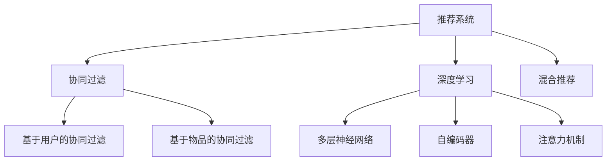

                 

# 推荐系统多样性与惊喜性

> 关键词：推荐系统,多样性,惊喜性,用户行为,协同过滤,深度学习,推荐算法,用户体验

## 1. 背景介绍

### 1.1 问题由来

随着互联网技术的不断发展和普及，在线推荐系统已经成为现代信息时代的重要组成部分。无论是电子商务网站如亚马逊、京东，还是内容平台如Netflix、YouTube，都依赖推荐系统为用户定制个性化内容，从而提升用户体验，增加用户粘性，驱动业务增长。

推荐系统本质上是一种信息检索系统，通过对用户历史行为数据的分析和建模，预测用户对未交互内容的可能兴趣，进而为用户推荐最符合其喜好的物品。然而，推荐系统面临的最大挑战之一是如何保证推荐结果的多样性和惊喜性，即不仅推荐用户已经喜欢的内容，还要推荐出其意料之外的优质内容，以丰富用户发现新物品的体验。

### 1.2 问题核心关键点

为了应对推荐系统多样性和惊喜性的挑战，研究者提出了多种策略。这些策略可以分为两大类：协同过滤和深度学习。协同过滤基于用户和物品的交互数据进行推荐，而深度学习则通过用户历史数据和物品属性进行预测。协同过滤和深度学习各有优劣，在实际应用中往往需要结合使用。

本文档将详细探讨推荐系统的多样性和惊喜性问题，重点介绍协同过滤和深度学习在推荐系统中的应用，并对比其优缺点和适用场景。

## 2. 核心概念与联系

### 2.1 核心概念概述

推荐系统：利用用户历史行为数据和物品属性数据，为用户推荐感兴趣物品的系统。

协同过滤：一种基于用户和物品历史交互数据的推荐算法，利用相似性度量计算用户和物品之间的相似性，从而推荐新物品。

深度学习：一类通过多层神经网络对数据进行表示学习的算法，可以自动提取数据特征，实现更准确的预测和推荐。

多样性：推荐结果应包含不同种类的物品，避免用户陷入单一的兴趣领域。

惊喜性：推荐结果应包含用户没有预料到的好物品，提升用户探索新物品的体验。

### 2.2 核心概念原理和架构的 Mermaid 流程图



这个流程图展示了推荐系统的基本架构，包括协同过滤和深度学习两大核心算法，以及混合推荐和多样性、惊喜性提升的具体技术。

## 3. 核心算法原理 & 具体操作步骤

### 3.1 算法原理概述

推荐系统的核心目标是通过对用户历史行为数据的分析，预测用户对新物品的兴趣，从而为用户推荐个性化物品。协同过滤和深度学习是实现这一目标的两种主要算法。

协同过滤算法基于用户和物品之间的相似性度量，计算用户对新物品的兴趣预测值。常见的协同过滤算法包括基于用户的协同过滤和基于物品的协同过滤，分别根据用户历史行为数据和物品历史行为数据进行推荐。

深度学习算法通过多层神经网络对用户和物品的数据进行表示学习，自动提取特征，提高推荐精度。常用的深度学习算法包括基于内容的推荐、矩阵分解等。

推荐系统的多样性和惊喜性主要通过以下几种方法实现：

1. 基于阈值的筛选：通过设定一个阈值，筛选掉相似性评分低于该阈值的物品，从而保证推荐结果的多样性。

2. 基于新颖性的推荐：根据物品的新颖度进行推荐，优先推荐用户未交互的新物品，提升惊喜性。

3. 多维度的协同过滤：结合基于用户和基于物品的协同过滤，利用多种相似性度量方法，提升推荐结果的覆盖率和多样性。

4. 多任务学习：将推荐任务与多样性和惊喜性提升任务联合训练，优化推荐系统性能。

### 3.2 算法步骤详解

#### 3.2.1 协同过滤算法步骤

1. 收集用户和物品的历史交互数据。
2. 计算用户和物品之间的相似性度量，包括余弦相似度、皮尔逊相关系数等。
3. 根据相似性度量计算用户对新物品的兴趣预测值。
4. 筛选出评分高于阈值的新物品，进行推荐。

#### 3.2.2 深度学习算法步骤

1. 收集用户和物品的历史数据，包括用户ID、物品ID、评分等。
2. 对用户和物品进行特征工程，提取特征。
3. 构建多层神经网络或自编码器模型，进行数据表示学习。
4. 利用训练数据对模型进行训练，得到用户和物品的表示。
5. 使用模型预测用户对新物品的评分，进行推荐。

### 3.3 算法优缺点

#### 3.3.1 协同过滤算法优缺点

优点：
- 基于用户和物品的实际交互数据，具有较好的泛化能力和可靠性。
- 算法简单易实现，计算复杂度较低。

缺点：
- 对新物品和未交互用户推荐效果较差。
- 需要大量用户和物品的历史数据，数据稀疏性问题严重。

#### 3.3.2 深度学习算法优缺点

优点：
- 可以自动提取数据特征，提高推荐精度。
- 具有较强的泛化能力，对新物品和未交互用户推荐效果较好。

缺点：
- 需要大量标注数据进行预训练，训练复杂度较高。
- 模型较大，对计算资源和存储空间要求较高。

### 3.4 算法应用领域

协同过滤算法和深度学习算法在推荐系统中的应用非常广泛，具体应用领域包括：

1. 电子商务推荐：如亚马逊、京东等电商平台，推荐用户购买商品。
2. 内容平台推荐：如Netflix、YouTube等，推荐用户观看视频、电影。
3. 广告推荐：如Facebook、Google等，推荐用户广告。
4. 智能音箱推荐：如Amazon Alexa、Google Assistant等，推荐用户音乐、播客。

## 4. 数学模型和公式 & 详细讲解 & 举例说明

### 4.1 数学模型构建

推荐系统一般基于以下数学模型进行建模：

$$
\hat{y} = f(x; \theta)
$$

其中，$x$ 表示用户和物品的历史交互数据，$\theta$ 表示模型参数。$\hat{y}$ 表示模型预测的用户对新物品的评分。

协同过滤算法一般基于余弦相似度进行建模，公式如下：

$$
\text{similarity}(u_i, i_j) = \frac{\vec{u_i} \cdot \vec{i_j}}{||\vec{u_i}|| ||\vec{i_j}||}
$$

其中，$\vec{u_i}$ 和 $\vec{i_j}$ 分别表示用户 $u_i$ 和物品 $i_j$ 的历史评分向量。

深度学习算法一般基于多层神经网络进行建模，公式如下：

$$
\hat{y} = \text{sigmoid}(W \vec{x} + b)
$$

其中，$W$ 和 $b$ 表示神经网络的权重和偏置，$\vec{x}$ 表示用户和物品的特征向量。

### 4.2 公式推导过程

#### 4.2.1 协同过滤算法推导

协同过滤算法的核心是计算用户和物品之间的相似性度量，公式如下：

$$
\text{similarity}(u_i, i_j) = \frac{\sum_{k=1}^N u_{ik} \cdot i_{jk}}{\sqrt{\sum_{k=1}^N u_{ik}^2} \sqrt{\sum_{k=1}^N i_{jk}^2}}
$$

其中，$u_{ik}$ 和 $i_{jk}$ 分别表示用户 $u_i$ 和物品 $i_j$ 对物品 $k$ 的评分。

根据相似性度量，计算用户 $u_i$ 对物品 $i_j$ 的评分预测值，公式如下：

$$
\hat{y}_{ij} = \sum_{k=1}^N \text{similarity}(u_i, i_k) \cdot i_{kj}
$$

其中，$y_{ij}$ 表示用户 $u_i$ 对物品 $i_j$ 的实际评分。

#### 4.2.2 深度学习算法推导

深度学习算法一般使用多层神经网络进行建模，公式如下：

$$
\hat{y} = \sigma \left( \text{fc} \left( \text{relu} \left( \text{fc} \left( \vec{x}; W_1, b_1 \right) \right); W_2, b_2 \right) \right)
$$

其中，$\text{fc}(\cdot)$ 表示全连接层，$\sigma$ 表示激活函数，$\vec{x}$ 表示用户和物品的特征向量。

### 4.3 案例分析与讲解

#### 4.3.1 协同过滤算法案例

假设有一个电商平台，收集了用户 $u_i$ 和物品 $i_j$ 的历史评分数据 $x$。利用协同过滤算法计算用户 $u_i$ 和物品 $i_j$ 之间的相似性度量，得到 $\text{similarity}(u_i, i_j)$。根据相似性度量，计算用户 $u_i$ 对物品 $i_j$ 的评分预测值 $\hat{y}_{ij}$，进行推荐。

#### 4.3.2 深度学习算法案例

假设有一个内容平台，收集了用户 $u_i$ 和物品 $i_j$ 的历史评分数据 $x$。利用深度学习算法构建多层神经网络，对用户和物品进行特征工程，提取特征向量 $\vec{x}$。使用训练数据对模型进行训练，得到用户和物品的表示。根据用户和物品的表示，计算用户 $u_i$ 对物品 $i_j$ 的评分预测值 $\hat{y}_{ij}$，进行推荐。

## 5. 项目实践：代码实例和详细解释说明

### 5.1 开发环境搭建

在进行推荐系统项目实践前，我们需要准备好开发环境。以下是使用Python进行PyTorch开发的环境配置流程：

1. 安装Anaconda：从官网下载并安装Anaconda，用于创建独立的Python环境。

2. 创建并激活虚拟环境：
```bash
conda create -n pytorch-env python=3.8 
conda activate pytorch-env
```

3. 安装PyTorch：根据CUDA版本，从官网获取对应的安装命令。例如：
```bash
conda install pytorch torchvision torchaudio cudatoolkit=11.1 -c pytorch -c conda-forge
```

4. 安装TensorFlow：
```bash
pip install tensorflow==2.8
```

5. 安装TensorBoard：
```bash
pip install tensorboard
```

6. 安装nltk：
```bash
pip install nltk
```

完成上述步骤后，即可在`pytorch-env`环境中开始项目实践。

### 5.2 源代码详细实现

这里我们以一个简单的协同过滤算法为例，展示如何使用Python和PyTorch进行实现。

```python
import torch
import torch.nn as nn
import torch.nn.functional as F
import numpy as np

# 假设用户和物品的历史评分数据
users = [1, 2, 3, 4, 5]
items = [1, 2, 3, 4, 5, 6, 7, 8, 9]
ratings = np.random.rand(len(users), len(items))

# 定义评分矩阵
rating_matrix = np.zeros((len(items), len(users)))
for i, user in enumerate(users):
    for j, item in enumerate(items):
        rating_matrix[item-1, user-1] = ratings[i, j]

# 定义模型
class协同过滤(nn.Module):
    def __init__(self, rating_matrix):
        super().__init__()
        self.rating_matrix = rating_matrix
        self.emb_user = nn.Embedding(len(items), 10)
        self.emb_item = nn.Embedding(len(items), 10)
        self.emb_user_item = nn.Embedding(len(items), 10)
        self.sigmoid = nn.Sigmoid()

    def forward(self, u, i):
        user_e = self.emb_user(i)
        item_e = self.emb_item(u)
        user_item_e = self.emb_user_item(u)
        similarity = torch.dot(user_e, item_e) / (torch.sqrt(torch.sum(user_e ** 2)) * torch.sqrt(torch.sum(item_e ** 2)))
        prediction = torch.dot(similarity, user_item_e)
        return self.sigmoid(prediction)

# 训练模型
model =协同过滤(rating_matrix)
optimizer = torch.optim.Adam(model.parameters(), lr=0.01)

for epoch in range(100):
    for i in range(len(items)):
        for j in range(len(users)):
            prediction = model(i+1, j+1)
            loss = F.binary_cross_entropy(prediction, rating_matrix[i, j])
            optimizer.zero_grad()
            loss.backward()
            optimizer.step()
```

### 5.3 代码解读与分析

让我们再详细解读一下关键代码的实现细节：

**协同过滤模型**：
- `__init__`方法：初始化评分矩阵、用户嵌入、物品嵌入、用户物品嵌入和激活函数。
- `forward`方法：计算用户和物品的嵌入向量，计算相似性度量，计算预测评分，并进行激活函数处理。

**训练过程**：
- 使用Adam优化器更新模型参数。
- 对于每个用户和物品对，计算预测评分和损失，反向传播更新模型参数。

**推荐过程**：
- 根据用户和物品的嵌入向量，计算相似性度量，计算预测评分。
- 利用Sigmoid函数将预测评分转化为概率，进行推荐。

## 6. 实际应用场景

### 6.1 推荐系统在电商平台中的应用

电商平台通过推荐系统为用户推荐商品，提升用户体验和转化率。推荐系统可以根据用户的历史浏览、购买记录，结合商品属性、价格等信息，推荐用户可能感兴趣的商品。协同过滤和深度学习算法都可以在电商推荐中发挥作用，协同过滤算法可以推荐用户未交互的商品，而深度学习算法可以推荐个性化商品，提升推荐效果。

### 6.2 推荐系统在内容平台中的应用

内容平台通过推荐系统为用户推荐视频、文章等内容，提升用户体验和粘性。推荐系统可以根据用户的历史观看、阅读记录，结合视频、文章的属性、评分等信息，推荐用户可能感兴趣的内容。协同过滤算法和深度学习算法都可以用于内容推荐，协同过滤算法可以推荐用户未观看过的视频，而深度学习算法可以推荐个性化视频，提升推荐效果。

### 6.3 推荐系统在广告推荐中的应用

广告推荐系统通过推荐系统为用户推荐广告，提升广告效果和用户转化率。推荐系统可以根据用户的历史点击、浏览记录，结合广告属性、点击率等信息，推荐用户可能感兴趣的广告。协同过滤算法和深度学习算法都可以在广告推荐中发挥作用，协同过滤算法可以推荐用户未点击过的广告，而深度学习算法可以推荐个性化广告，提升推荐效果。

## 7. 工具和资源推荐

### 7.1 学习资源推荐

为了帮助开发者系统掌握推荐系统的设计和实现，这里推荐一些优质的学习资源：

1. 《推荐系统实战》：详细介绍了推荐系统的设计与实现方法，包括协同过滤、深度学习等算法。

2. Coursera《推荐系统》课程：斯坦福大学的推荐系统课程，涵盖协同过滤、深度学习等推荐算法。

3. 《Python推荐系统》：介绍了推荐系统的基本原理和实现方法，包括协同过滤、矩阵分解等算法。

4. Kaggle推荐系统竞赛：Kaggle组织的推荐系统竞赛，可以通过实践竞赛，了解推荐系统在实际应用中的方法和技巧。

### 7.2 开发工具推荐

推荐的开发工具包括：

1. PyTorch：基于Python的开源深度学习框架，适合快速迭代研究。

2. TensorFlow：由Google主导开发的开源深度学习框架，生产部署方便，适合大规模工程应用。

3. Scikit-learn：Python的机器学习库，适合数据预处理和模型评估。

4. Jupyter Notebook：交互式编程环境，适合数据探索和模型调试。

5. Weights & Biases：模型训练的实验跟踪工具，可以记录和可视化模型训练过程中的各项指标。

6. TensorBoard：TensorFlow配套的可视化工具，可实时监测模型训练状态，并提供丰富的图表呈现方式。

合理利用这些工具，可以显著提升推荐系统的开发效率，加快创新迭代的步伐。

### 7.3 相关论文推荐

推荐系统的研究和应用已经积累了大量经典论文，以下是几篇奠基性的相关论文，推荐阅读：

1. BPR: Bayesian Personalized Ranking from Implicit Feedback（BPR算法）：提出了基于隐式反馈的协同过滤算法，是推荐系统研究的重要基础。

2. Matrix Factorization Techniques for Recommender Systems（矩阵分解算法）：介绍了矩阵分解算法，通过低秩矩阵分解，提高推荐效果。

3. Deep Associative Recommendations with Neural Collaborative Filtering（深度神经协同过滤算法）：提出了基于深度神经网络的协同过滤算法，提高推荐精度。

4. Collective Prediction: A Statistical Theory of Collaborative Filtering（协同过滤的统计理论）：从统计学的角度研究协同过滤算法，提升推荐系统的可解释性。

5. Trustworthiness and Reputation in Recommendation Systems（推荐系统的可信性和声誉）：研究推荐系统的可信性和声誉，提高推荐系统的透明度和可信度。

这些论文代表了大规模推荐系统的发展脉络，通过对这些经典论文的学习实践，可以帮助研究者掌握推荐系统的基本原理和实现方法，提升实际应用能力。

## 8. 总结：未来发展趋势与挑战

### 8.1 总结

本文对推荐系统的多样性和惊喜性问题进行了全面系统的介绍。首先，阐述了推荐系统的背景和重要意义，明确了推荐系统多样性和惊喜性提升的必要性。其次，从原理到实践，详细讲解了协同过滤和深度学习在推荐系统中的应用，并对比了其优缺点和适用场景。最后，本文还介绍了推荐系统的实际应用场景，以及未来的发展趋势和面临的挑战。

通过本文的系统梳理，可以看到，推荐系统多样性和惊喜性的提升是实现个性化推荐的关键。协同过滤和深度学习算法在推荐系统中的应用，可以极大提高推荐效果，提升用户体验。未来，随着推荐系统的持续发展和优化，相信推荐技术将在更多领域得到应用，为各行各业带来变革性影响。

### 8.2 未来发展趋势

展望未来，推荐系统的多样性和惊喜性将呈现以下几个发展趋势：

1. 个性化推荐精度提升：随着深度学习算法的不断进步，推荐系统的推荐精度将进一步提升，用户将获得更优质的推荐体验。

2. 实时推荐技术发展：推荐系统将更加注重实时性，实时响应用户需求，提升用户体验。

3. 多模态推荐技术崛起：推荐系统将引入多模态信息融合技术，提高推荐系统的覆盖率和多样性。

4. 推荐系统透明度提升：推荐系统将更加注重可解释性和透明度，使用户了解推荐系统的推荐依据，提升用户信任度。

5. 推荐系统公平性保障：推荐系统将更加注重公平性，避免对某些用户群体的歧视，确保推荐系统的公平性和普适性。

以上趋势凸显了推荐系统多样性和惊喜性提升的广阔前景。这些方向的探索发展，必将进一步提升推荐系统的性能和应用范围，为各行各业带来新的变革。

### 8.3 面临的挑战

尽管推荐系统取得了显著的进展，但在迈向更加智能化、普适化应用的过程中，仍面临诸多挑战：

1. 数据隐私和安全：推荐系统需要收集大量用户数据，如何保护用户隐私，防止数据泄露，是推荐系统面临的重要挑战。

2. 推荐系统的公平性：推荐系统可能会对某些用户群体产生偏见，如何确保推荐系统的公平性和普适性，是推荐系统面临的另一大挑战。

3. 推荐系统的透明性：推荐系统需要提供可解释的推荐依据，提高用户信任度，是推荐系统面临的又一重要挑战。

4. 推荐系统的实时性：推荐系统需要快速响应用户需求，提高实时性，是推荐系统面临的另一大挑战。

5. 推荐系统的可扩展性：推荐系统需要处理海量用户数据和物品数据，如何提高系统的可扩展性，是推荐系统面临的又一重要挑战。

正视推荐系统面临的这些挑战，积极应对并寻求突破，将使推荐系统更加智能化、普适化，为各行各业带来更大的价值。

### 8.4 研究展望

面对推荐系统多样性和惊喜性提升所面临的挑战，未来的研究需要在以下几个方面寻求新的突破：

1. 多任务学习和联合训练：将推荐系统与其他任务联合训练，如多样性、惊喜性提升等，优化推荐系统性能。

2. 多模态信息融合：引入视觉、语音等多模态信息，提高推荐系统的多样性和惊喜性。

3. 推荐系统的可解释性：利用因果分析和博弈论工具，提高推荐系统的可解释性，增强用户信任度。

4. 推荐系统的公平性：结合专家知识库和规则库，优化推荐系统的公平性，确保推荐系统的公平性和普适性。

5. 推荐系统的实时性：利用流计算和分布式计算技术，提高推荐系统的实时性，提升用户体验。

6. 推荐系统的可扩展性：利用模型压缩和稀疏化存储技术，提高推荐系统的可扩展性，适应海量数据处理需求。

这些研究方向的探索，必将引领推荐系统多样性和惊喜性提升技术迈向更高的台阶，为推荐系统的未来发展奠定坚实基础。

