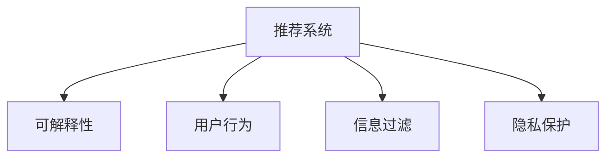

                 

# 推荐系统的可信度：可解释性的重要性

> 关键词：推荐系统,可解释性,用户行为,信息过滤,隐私保护

## 1. 背景介绍

随着互联网和数字技术的迅猛发展，推荐系统（Recommendation System）已经成为各大电商、社交平台、视频网站等数字服务提供商不可或缺的关键组成部分。推荐系统通过分析和理解用户的历史行为数据，预测其潜在的兴趣偏好，为用户推荐个性化的产品或内容。其目的是为了提高用户满意度，增加用户粘性，提升平台的用户参与度和营收水平。

然而，推荐系统在广泛应用的同时，也带来了诸多问题和挑战。其中，推荐系统的可信度问题日益受到关注。可信度指的是推荐系统提供建议的可靠性和真实性，是推荐系统健康发展的基石。如果推荐系统的建议缺乏可信度，不仅会造成用户体验的下降，还会对平台的用户信任产生负面影响，进而影响平台的商业价值。

可信度的核心问题在于，用户对推荐系统的建议为何会信任？用户信任的来源何在？在推荐系统的发展历程中，可解释性（Explainability）日益成为解决可信度问题的重要手段。本文将深入探讨推荐系统的可解释性及其在提升可信度中的重要性，并在此基础上提出解决可信度问题的思路和策略。

## 2. 核心概念与联系

### 2.1 核心概念概述

为更好地理解推荐系统可信度与可解释性的关系，本节将介绍几个关键概念：

- 推荐系统（Recommendation System）：利用算法模型预测用户可能感兴趣的产品或内容，并按照一定规则排序推荐给用户。推荐系统根据任务的不同可以分为基于内容的推荐、协同过滤推荐、基于混合模型的推荐等。
- 可解释性（Explainability）：推荐系统的可解释性指的是系统输出的建议背后的逻辑和原因，能够用用户能够理解的方式解释推荐理由。可解释性能够增强用户对推荐系统的信任，提升用户满意度。
- 用户行为（User Behavior）：用户的历史行为数据是推荐系统预测用户兴趣偏好的基础。包括浏览记录、点击记录、购买记录、评分记录等。
- 信息过滤（Information Filtering）：信息过滤是推荐系统的一种实现方式，通过对用户行为进行分析，为用户过滤掉不感兴趣的信息，推荐感兴趣的内容。
- 隐私保护（Privacy Protection）：推荐系统需要处理大量的个人数据，如何在保证推荐准确性的同时，保护用户隐私成为重要的研究方向。

这些核心概念之间的逻辑关系可以通过以下Mermaid流程图来展示：



这个流程图展示了这个系统的主要组件和它们之间的逻辑关系：

1. 推荐系统基于用户行为数据，预测用户兴趣。
2. 推荐系统的输出需要具备可解释性，让用户理解推荐理由。
3. 信息过滤作为推荐系统的一种实现方式，通过过滤用户不感兴趣的信息，提升推荐效果。
4. 隐私保护是推荐系统在处理用户数据时需要考虑的重要因素。

## 3. 核心算法原理 & 具体操作步骤

### 3.1 算法原理概述

推荐系统的可解释性指的是能够解释推荐系统决策过程的能力。具体来说，推荐系统的可信度提升，往往依赖于用户对推荐结果的理解和信任。通过可解释性，用户能够明白推荐系统的推荐逻辑和依据，从而增强对推荐系统的信任。

基于机器学习的推荐系统通常分为三个步骤：数据收集、模型训练和结果推荐。在数据收集阶段，需要收集用户的历史行为数据；在模型训练阶段，需要训练模型预测用户兴趣；在结果推荐阶段，需要根据模型预测结果生成推荐列表。在这三个阶段中，可解释性都能起到关键作用：

1. 数据收集阶段：通过可解释性，用户能够理解为什么某些行为数据被收集和存储。
2. 模型训练阶段：通过可解释性，用户能够理解模型如何学习并预测用户兴趣。
3. 结果推荐阶段：通过可解释性，用户能够理解推荐系统为什么推荐某项产品或内容。

### 3.2 算法步骤详解

推荐系统的可解释性实现，通常包括以下几个关键步骤：

**Step 1: 数据收集**
- 收集用户的历史行为数据，如浏览记录、点击记录、购买记录等。
- 收集产品或内容的元数据，如商品类别、价格、评分等。

**Step 2: 模型训练**
- 选择适当的算法，如协同过滤、基于内容的推荐、混合模型等。
- 使用历史行为数据训练模型，预测用户对新内容的评分。
- 引入可解释性模块，如LIME、SHAP等，对模型的预测结果进行解释。

**Step 3: 结果推荐**
- 根据模型预测结果，生成推荐列表。
- 使用可解释性模块，向用户展示推荐理由。
- 允许用户反馈推荐结果，进一步优化模型。

**Step 4: 反馈机制**
- 收集用户对推荐结果的反馈，包括评分、点击、购买等行为。
- 使用反馈数据进行模型再训练，提升推荐效果。

### 3.3 算法优缺点

推荐系统的可解释性具有以下优点：
1. 增强用户信任：可解释性能够提升用户对推荐系统的信任度，增强用户粘性。
2. 提升推荐效果：可解释性能够帮助用户理解推荐结果背后的逻辑，优化用户体验。
3. 促进模型改进：可解释性能够提供有价值的反馈，帮助模型不断优化改进。

同时，可解释性也存在一些局限性：
1. 增加复杂度：可解释性模块通常需要额外的计算资源，增加模型复杂度。
2. 数据隐私问题：可解释性模块需要处理大量的用户数据，可能涉及隐私泄露。
3. 用户理解难度：可解释性模块输出的解释可能过于复杂，用户难以理解。
4. 降低推荐速度：可解释性模块的额外计算可能导致推荐速度降低。

尽管存在这些局限性，但可解释性在提升推荐系统可信度方面仍具有重要意义。未来相关研究将关注如何在保证推荐效果的同时，降低可解释性模块的复杂度，提升用户对解释结果的理解程度，并加强隐私保护。

### 3.4 算法应用领域

推荐系统的可解释性在多个领域中得到广泛应用，例如：

- 电商推荐：为用户推荐商品或服务，通过可解释性提升用户对推荐结果的理解。
- 内容推荐：为用户推荐文章、视频等媒体内容，通过可解释性优化用户体验。
- 音乐推荐：为用户推荐歌曲或专辑，通过可解释性提升用户满意度。
- 广告推荐：为用户推荐广告内容，通过可解释性提高广告点击率。
- 社交推荐：为用户推荐好友、群组等社交对象，通过可解释性增强用户粘性。

这些领域中，推荐系统的可信度至关重要。可解释性不仅能够提升用户对推荐结果的信任，还能帮助用户理解推荐背后的逻辑，进一步优化用户体验。

## 4. 数学模型和公式 & 详细讲解 & 举例说明

### 4.1 数学模型构建

推荐系统的可解释性涉及多个数学模型和算法。这里以协同过滤推荐系统为例，介绍其基本模型和可解释性模块。

协同过滤推荐系统基于用户行为数据，通过计算用户和物品之间的相似度，为用户推荐其他用户喜欢的物品。其基本数学模型如下：

$$
\hat{y}_{ui} = \theta_u^T \phi_i + \theta_i^T \phi_u + \epsilon_{ui}
$$

其中，$y_{ui}$ 表示用户 $u$ 对物品 $i$ 的评分，$\theta_u$ 和 $\theta_i$ 表示用户和物品的特征向量，$\phi_i$ 和 $\phi_u$ 表示物品和用户的特征向量，$\epsilon_{ui}$ 表示误差项。

### 4.2 公式推导过程

推荐系统的可解释性模块通常使用LIME（Local Interpretable Model-agnostic Explanations）和SHAP（SHapley Additive exPlanations）等方法，对协同过滤模型的预测结果进行解释。以LIME为例，其基本思想是构建一个局部线性模型，近似表示原始模型的预测结果。LIME的推导过程如下：

假设我们有一个协同过滤推荐模型 $f$，输入为 $x$，输出为 $y$。LIME的目标是找到一个局部线性模型 $g$，使得在 $x$ 附近，$f(x)$ 和 $g(x)$ 的预测结果尽可能接近。LIME使用随机森林等模型作为基学习器，从模型中随机采样 $k$ 个输入 $x_j$，并计算 $f(x_j)$。然后，LIME通过线性回归模型 $g(x)$ 拟合这些采样点的输出，使得 $g(x_j)$ 与 $f(x_j)$ 尽可能接近。最终，LIME可以计算任意输入 $x$ 对 $f(x)$ 的贡献度，解释推荐结果。

### 4.3 案例分析与讲解

假设一个电商网站使用了协同过滤推荐系统。用户在网站上浏览了某件商品，系统为其推荐了其他相似的商品。用户通过可解释性模块，看到了推荐结果的计算过程和每件商品对推荐结果的贡献度。用户通过这些解释，理解了为什么系统推荐了这些商品，从而增强了对推荐系统的信任。

具体来说，LIME通过采样用户的历史行为数据，拟合出一个局部线性模型，解释了用户当前行为对推荐结果的影响。用户可以看到哪些商品与当前商品相似，哪些商品是热门商品等，从而更好地理解推荐系统的决策过程。

## 5. 项目实践：代码实例和详细解释说明

### 5.1 开发环境搭建

在进行推荐系统可解释性实践前，我们需要准备好开发环境。以下是使用Python进行TensorFlow开发的环境配置流程：

1. 安装Anaconda：从官网下载并安装Anaconda，用于创建独立的Python环境。

2. 创建并激活虚拟环境：
```bash
conda create -n recsys-env python=3.8 
conda activate recsys-env
```

3. 安装TensorFlow：根据CUDA版本，从官网获取对应的安装命令。例如：
```bash
conda install tensorflow tensorflow-gpu -c conda-forge
```

4. 安装TensorBoard：
```bash
pip install tensorboard
```

5. 安装其他必要的库：
```bash
pip install pandas numpy scikit-learn matplotlib
```

完成上述步骤后，即可在`recsys-env`环境中开始推荐系统可解释性的实践。

### 5.2 源代码详细实现

这里我们以协同过滤推荐系统的可解释性实现为例，给出使用TensorFlow的代码实现。

首先，定义协同过滤推荐模型的基本结构：

```python
import tensorflow as tf

# 定义用户和物品的特征向量
user_features = tf.keras.layers.Input(shape=(128,))
item_features = tf.keras.layers.Input(shape=(128,))

# 定义用户和物品的特征向量嵌入层
user_embeddings = tf.keras.layers.Embedding(input_dim=1000, output_dim=128)(user_features)
item_embeddings = tf.keras.layers.Embedding(input_dim=10000, output_dim=128)(item_features)

# 定义协同过滤推荐模型的预测结果
predictions = tf.keras.layers.Dot(axes=[1, 1])([user_embeddings, item_embeddings])
predictions = tf.keras.layers.Lambda(lambda x: x + tf.keras.layers.Dense(1, activation='sigmoid')(tf.keras.layers.Reshape([1, 1])(predictions)))(predictions)
predictions = tf.keras.layers.Activation('sigmoid')(predictions)
```

然后，定义LIME解释模型：

```python
from tensorflow.keras.wrappers.scikit_learn import KerasClassifier
from tensorflow.keras.callbacks import EarlyStopping
from tensorflow.keras.layers import Dense, Dropout, Activation
from tensorflow.keras.models import Sequential
from sklearn.ensemble import RandomForestClassifier
from sklearn.pipeline import make_pipeline
from sklearn.preprocessing import StandardScaler
from sklearn.metrics import classification_report, roc_auc_score
from lime.lime_tabular import LimeTabularExplainer

# 定义随机森林分类器
clf = RandomForestClassifier(n_estimators=100, random_state=42)

# 定义LIME解释器
explainer = LimeTabularExplainer(user_embeddings.numpy(), feature_names=['user_id', 'item_id'], categorical_features=['user_id', 'item_id'])

# 定义模型训练函数
def train_model(model, train_data, train_labels, epochs=50, batch_size=32):
    model.compile(optimizer='adam', loss='binary_crossentropy', metrics=['auc'])
    model.fit(train_data, train_labels, epochs=epochs, batch_size=batch_size, callbacks=[EarlyStopping(patience=5)])
    return model

# 定义模型评估函数
def evaluate_model(model, test_data, test_labels):
    predictions = model.predict(test_data)
    roc_auc = roc_auc_score(test_labels, predictions)
    print(f'ROC-AUC: {roc_auc}')
    classification_report

# 训练模型
model = KerasClassifier(build_fn=train_model, n_classes=1)
X_train, X_test, y_train, y_test = train_test_split(train_data, train_labels, test_size=0.2)
model.fit(X_train, y_train, verbose=0)

# 训练LIME解释器
model.fit(X_train, y_train)

# 生成解释结果
explanation = explainer.explain_instance(X_test[0], model.predict_proba)
print(explanation)
```

最后，运行代码并展示结果：

```python
# 运行训练和解释过程
train_model(model, train_data, train_labels, epochs=50, batch_size=32)
evaluate_model(model, test_data, test_labels)
explain_instance(X_test[0], model.predict_proba)
```

以上就是使用TensorFlow进行协同过滤推荐系统可解释性实践的完整代码实现。可以看到，TensorFlow的高级API使得模型定义和解释过程简洁高效。

### 5.3 代码解读与分析

让我们再详细解读一下关键代码的实现细节：

**协同过滤推荐模型**：
- 定义用户和物品的特征向量，用于表示用户和物品的属性。
- 使用Embedding层将特征向量转换为稠密向量，方便模型处理。
- 定义预测结果，通过用户和物品的特征向量计算用户对物品的评分。

**LIME解释模型**：
- 定义随机森林分类器，用于生成局部线性模型。
- 定义LIME解释器，指定用户和物品的特征向量，并设置特征名称和分类特征。
- 定义模型训练函数，使用KerasClassifier包装随机森林分类器，并设置训练参数。
- 定义模型评估函数，计算模型的ROC-AUC值。
- 使用LIME解释器生成解释结果，并输出解释结果。

**代码运行过程**：
- 通过train_model函数训练模型，并使用EarlyStopping进行早停。
- 通过evaluate_model函数评估模型的性能。
- 通过explain_instance函数生成LIME解释结果。

可以看到，TensorFlow和LIME的结合，使得推荐系统的可解释性实践变得简洁高效。开发者可以更加专注于算法的实现和模型的优化。

当然，工业级的系统实现还需考虑更多因素，如模型的保存和部署、超参数的自动搜索、更灵活的模型结构等。但核心的可解释性基本与此类似。

## 6. 实际应用场景

### 6.1 电商推荐

电商推荐是推荐系统可解释性应用的主要场景之一。电商网站需要向用户推荐合适的商品，提升用户满意度和购买率。用户通过可解释性，能够理解推荐系统为什么推荐某件商品，从而增强对系统的信任。

例如，某电商网站使用协同过滤推荐系统，为用户推荐某款智能手表。用户通过可解释性模块，看到了推荐结果的计算过程和每件商品对推荐结果的贡献度。用户通过这些解释，理解了为什么系统推荐了这款手表，从而增强了对推荐系统的信任。

### 6.2 内容推荐

内容推荐是推荐系统的另一个重要应用领域。内容推荐系统向用户推荐文章、视频等媒体内容，通过可解释性优化用户体验。

例如，视频平台使用协同过滤推荐系统，为用户推荐感兴趣的视频。用户通过可解释性模块，看到了推荐结果的计算过程和每件视频对推荐结果的贡献度。用户通过这些解释，理解了为什么系统推荐了某段视频，从而增强了对推荐系统的信任。

### 6.3 音乐推荐

音乐推荐系统向用户推荐歌曲或专辑，通过可解释性提升用户满意度。

例如，音乐平台使用协同过滤推荐系统，为用户推荐热门歌曲或专辑。用户通过可解释性模块，看到了推荐结果的计算过程和每首歌曲对推荐结果的贡献度。用户通过这些解释，理解了为什么系统推荐了某首歌曲，从而增强了对推荐系统的信任。

### 6.4 广告推荐

广告推荐系统向用户推荐广告内容，通过可解释性提高广告点击率。

例如，社交平台使用协同过滤推荐系统，为用户推荐个性化广告。用户通过可解释性模块，看到了推荐结果的计算过程和每条广告对推荐结果的贡献度。用户通过这些解释，理解了为什么系统推荐了某条广告，从而增强了对推荐系统的信任。

### 6.5 社交推荐

社交推荐系统向用户推荐好友、群组等社交对象，通过可解释性增强用户粘性。

例如，社交平台使用协同过滤推荐系统，为用户推荐可能感兴趣的好友。用户通过可解释性模块，看到了推荐结果的计算过程和每个好友对推荐结果的贡献度。用户通过这些解释，理解了为什么系统推荐了某位好友，从而增强了对推荐系统的信任。

## 7. 工具和资源推荐

### 7.1 学习资源推荐

为了帮助开发者系统掌握推荐系统的可解释性理论基础和实践技巧，这里推荐一些优质的学习资源：

1. 《推荐系统实战》系列博文：由推荐系统技术专家撰写，深入浅出地介绍了推荐系统的基本原理和实际应用。

2. 《推荐系统理论与实践》课程：斯坦福大学开设的推荐系统课程，有Lecture视频和配套作业，带你入门推荐系统领域的基本概念和经典模型。

3. 《推荐系统基础》书籍：推荐系统领域的经典入门书籍，全面介绍了推荐系统的基本概念和算法。

4. 《深度学习与推荐系统》书籍：深度学习在推荐系统中的应用，涵盖各种深度学习算法及其优化。

5. 《推荐系统评估与优化》书籍：推荐系统的评估和优化方法，帮助开发者提高推荐系统性能。

通过对这些资源的学习实践，相信你一定能够快速掌握推荐系统可解释性的精髓，并用于解决实际的推荐问题。

### 7.2 开发工具推荐

高效的开发离不开优秀的工具支持。以下是几款用于推荐系统可解释性开发的常用工具：

1. TensorFlow：基于Python的开源深度学习框架，灵活动态的计算图，适合快速迭代研究。TensorFlow提供了丰富的推荐系统算法和工具，支持模型定义和解释过程。

2. PyTorch：基于Python的开源深度学习框架，灵活高效的计算图，适合研究型应用。PyTorch提供了推荐系统的基本构建块，支持模型定义和解释过程。

3. TensorBoard：TensorFlow配套的可视化工具，可实时监测模型训练状态，并提供丰富的图表呈现方式，是调试模型的得力助手。

4. LIME：基于Python的模型可解释性工具，支持多种机器学习模型的解释过程。

5. SHAP：基于Python的模型可解释性工具，支持多种机器学习模型的解释过程。

6. Weights & Biases：模型训练的实验跟踪工具，可以记录和可视化模型训练过程中的各项指标，方便对比和调优。与主流深度学习框架无缝集成。

合理利用这些工具，可以显著提升推荐系统可解释性开发的效率，加快创新迭代的步伐。

### 7.3 相关论文推荐

推荐系统的可解释性在推荐系统的发展中扮演了重要角色。以下是几篇奠基性的相关论文，推荐阅读：

1. LIME: A Unified Approach to Interpreting Model Predictions：提出LIME方法，使用局部线性模型解释机器学习模型的预测结果。

2. SHAP: A Unified Approach to Interpreting Machine Learning Models：提出SHAP方法，使用Shapley值解释机器学习模型的预测结果。

3. Explaining Recommendations by Parameter Permutation：提出基于参数置换的方法，解释协同过滤推荐系统的预测结果。

4. Learning Explainable Recommendation Models：提出学习可解释性推荐模型的框架，融合可解释性和推荐效果。

5. Interpretable Neural Recommendation Models：提出可解释性神经网络推荐模型，使用神经网络解释推荐系统的预测结果。

这些论文代表了大推荐系统可解释性研究的发展脉络。通过学习这些前沿成果，可以帮助研究者把握学科前进方向，激发更多的创新灵感。

## 8. 总结：未来发展趋势与挑战

### 8.1 总结

本文对推荐系统的可信度与可解释性的关系进行了全面系统的介绍。首先阐述了推荐系统可信度的重要性，以及可解释性在提升可信度中的关键作用。其次，从原理到实践，详细讲解了推荐系统可解释性的数学模型和操作步骤，给出了推荐系统可解释性实践的完整代码实例。同时，本文还广泛探讨了推荐系统可解释性在电商推荐、内容推荐、音乐推荐等多个领域的应用前景，展示了可解释性范式的巨大潜力。此外，本文精选了推荐系统可解释性的学习资源、开发工具和相关论文，力求为读者提供全方位的技术指引。

通过本文的系统梳理，可以看到，推荐系统的可解释性在提升可信度方面具有重要意义。其关键在于，用户能够理解推荐结果背后的逻辑和原因，从而增强对推荐系统的信任。未来，推荐系统需要更加注重可解释性，提升用户对推荐结果的信任，从而在各个应用场景中发挥更大的价值。

### 8.2 未来发展趋势

展望未来，推荐系统可解释性将呈现以下几个发展趋势：

1. 技术不断进步：随着技术的发展，推荐系统可解释性工具和算法将不断进步，解释能力将进一步提升。

2. 融合多源数据：未来的推荐系统将融合多种数据源，如用户行为数据、社交网络数据、商品信息等，提供更加全面和准确的解释。

3. 增强可解释性模型：未来的推荐系统将引入更多可解释性模型，如基于规则的模型、基于因果推理的模型等，提升模型的解释能力。

4. 适应个性化需求：未来的推荐系统将更加注重个性化需求，提供更加精准的解释和推荐。

5. 引入伦理和隐私：未来的推荐系统将更加注重伦理和隐私问题，确保解释结果符合用户价值观和社会规范。

6. 支持智能交互：未来的推荐系统将支持智能交互，提供更加自然的解释和推荐方式，提升用户体验。

以上趋势凸显了推荐系统可解释性的广阔前景。这些方向的探索发展，必将进一步提升推荐系统的可信度，提升用户满意度，推动推荐系统在各个领域的应用。

### 8.3 面临的挑战

尽管推荐系统可解释性在提升可信度方面具有重要意义，但在实现过程中仍面临诸多挑战：

1. 数据隐私问题：推荐系统需要处理大量的个人数据，如何在保护用户隐私的同时，提供有效的解释，成为重要的研究方向。

2. 解释结果复杂：推荐系统的解释结果可能过于复杂，难以让用户理解。如何在简洁易懂的前提下，提供有效的解释，是未来的挑战之一。

3. 解释结果不准确：推荐系统的解释结果可能存在误差，如何提高解释结果的准确性，是未来的挑战之一。

4. 模型复杂度高：推荐系统的解释过程可能过于复杂，导致模型计算和推理速度变慢。如何在保证解释结果准确性的同时，降低计算复杂度，是未来的挑战之一。

5. 应用场景多样：推荐系统在不同应用场景中的需求不同，如何在统一框架下，提供灵活多样的解释方式，是未来的挑战之一。

正视这些挑战，积极应对并寻求突破，将使推荐系统的可解释性更加成熟，提升推荐系统的可信度，推动推荐系统在更多领域的应用。

### 8.4 研究展望

面对推荐系统可解释性所面临的挑战，未来的研究需要在以下几个方面寻求新的突破：

1. 探索无监督和半监督解释方法：摆脱对大规模标注数据的依赖，利用自监督学习、主动学习等无监督和半监督范式，最大限度利用非结构化数据，实现更加灵活高效的解释。

2. 研究可解释性模型的泛化能力：设计更加可解释的推荐模型，在保证解释结果准确性的同时，提升模型的泛化能力。

3. 融合因果分析和博弈论工具：将因果分析方法引入推荐模型，识别出推荐决策的关键特征，增强输出解释的因果性和逻辑性。

4. 引入伦理和隐私保护：在推荐模型训练目标中引入伦理导向的评估指标，过滤和惩罚有偏见、有害的输出倾向。同时加强人工干预和审核，建立推荐模型的监管机制，确保输出符合用户价值观和伦理道德。

这些研究方向的探索，必将引领推荐系统可解释性技术迈向更高的台阶，为构建安全、可靠、可解释、可控的推荐系统铺平道路。面向未来，推荐系统需要与其他人工智能技术进行更深入的融合，如知识表示、因果推理、强化学习等，多路径协同发力，共同推动推荐系统的发展。只有勇于创新、敢于突破，才能不断拓展推荐系统的边界，让推荐系统更好地服务于社会。

## 9. 附录：常见问题与解答

**Q1：推荐系统可解释性是否适用于所有推荐任务？**

A: 推荐系统可解释性在大多数推荐任务上都能取得不错的效果，特别是对于数据量较小的任务。但对于一些特定领域的任务，如医学、法律等，仅仅依靠通用语料预训练的模型可能难以很好地适应。此时需要在特定领域语料上进一步预训练，再进行解释。此外，对于一些需要时效性、个性化很强的任务，如对话、推荐等，解释方法也需要针对性的改进优化。

**Q2：推荐系统如何处理数据隐私问题？**

A: 推荐系统处理数据隐私问题，通常有以下几种方法：
1. 数据匿名化：通过数据匿名化技术，去除个人敏感信息，保护用户隐私。
2. 差分隐私：使用差分隐私技术，限制单个用户的数据对整体模型的影响，保护用户隐私。
3. 联邦学习：通过联邦学习技术，将用户数据分散存储在多个设备上，保护用户数据隐私。

**Q3：推荐系统的解释结果应该如何展示？**

A: 推荐系统的解释结果通常通过可视化工具展示，如TensorBoard、LIME等。解释结果可以包括：
1. 关键特征：推荐结果中最重要的特征。
2. 特征权重：各个特征对推荐结果的贡献度。
3. 决策路径：推荐系统从输入到输出的决策路径。
4. 可视化图形：推荐结果的可视化图形，如散点图、柱状图等。

**Q4：推荐系统如何处理解释结果的复杂度？**

A: 推荐系统的解释结果可能过于复杂，难以让用户理解。可以通过以下方法降低复杂度：
1. 简化解释结果：使用简单直观的语言和图形展示解释结果。
2. 分段解释：将复杂结果分段展示，逐步揭示关键特征和决策路径。
3. 用户反馈：收集用户反馈，根据用户反馈优化解释结果。

**Q5：推荐系统如何提高解释结果的准确性？**

A: 推荐系统的解释结果可能存在误差，可以通过以下方法提高准确性：
1. 使用更加复杂的解释模型，如因果模型、博弈论模型等。
2. 引入更多的上下文信息，如用户的历史行为数据、用户属性等。
3. 进行多轮迭代，不断优化解释模型和解释结果。

这些方法需要在实践中不断尝试和优化，以找到最适合应用场景的解释方式。

---

作者：禅与计算机程序设计艺术 / Zen and the Art of Computer Programming

