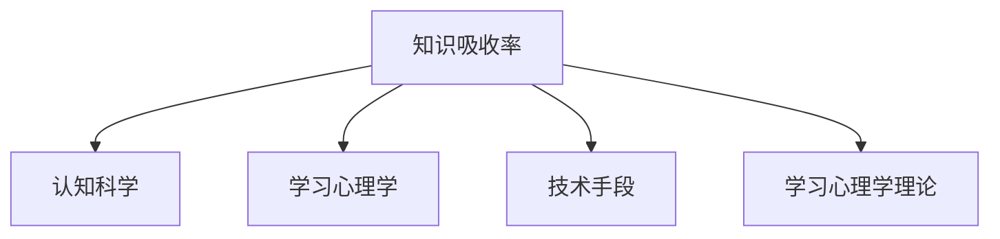

                 

# 提升知识吸收率的有效策略

> 关键词：知识吸收率, 有效策略, 学习效率, 认知科学, 技术手段, 学习心理学

## 1. 背景介绍

在当今信息爆炸的时代，知识吸收率成为了衡量个体学习能力和适应能力的重要指标。无论是学生、职场人士还是自学者，如何高效吸收知识，成为了提升个人竞争力的关键。尤其是在快速变化的工作和生活环境中，能够迅速掌握新技能、理解新概念，将对个人成长和职业发展产生深远影响。

### 1.1 问题由来

随着数字化和网络化技术的飞速发展，人们可以获取信息的渠道越来越多，但信息质量参差不齐，且难以筛选。如何在海量信息中筛选出真正有用的知识，并将其高效转化为个人能力，成为一项重要挑战。特别是在职业发展和终身学习过程中，如何提升知识吸收率，成为提升个人竞争力的关键。

### 1.2 问题核心关键点
提升知识吸收率的有效策略涉及到多个关键点，包括认知科学原理、学习心理学理论、技术手段应用、以及实践经验总结。其核心在于理解知识的本质，把握学习规律，并结合高效的技术手段，优化学习流程，提升学习效果。

## 2. 核心概念与联系

### 2.1 核心概念概述

为更好地理解提升知识吸收率的有效策略，本节将介绍几个密切相关的核心概念：

- 知识吸收率(Knowledge Acquisition Rate)：指个体在一定时间内，通过学习、阅读、研究等方式获取并理解知识的能力。通常通过学习效率、理解深度、知识应用能力等多个指标来衡量。

- 认知科学(Cognitive Science)：研究人类思维、知识获取、记忆、推理等认知过程的科学，为提升知识吸收率提供了理论基础。

- 学习心理学(Learning Psychology)：研究学习动机、学习策略、学习效果等因素对知识吸收率的影响，是优化学习流程的重要依据。

- 技术手段(Technology Tools)：指通过软硬件工具、平台、应用等方式提升知识吸收率的实践技术，如电子书、在线课程、智能笔记系统等。

- 学习心理学理论(Learning Theories)：包括行为主义、认知主义、建构主义等，指导学习者采用科学的学习策略和方法。

这些核心概念之间的逻辑关系可以通过以下Mermaid流程图来展示：



这个流程图展示了我們提升知识吸收率的几个关键点，包括认知科学基础、学习心理学理论指导、技术手段应用，以及理论在实践中的结合。

## 3. 核心算法原理 & 具体操作步骤
### 3.1 算法原理概述

提升知识吸收率的有效策略，本质上是利用认知科学和学习心理学理论，结合高效的技术手段，优化学习流程，最大化个体知识吸收率的过程。其核心思想在于：通过科学的方法，引导个体在特定情境下，高效获取、理解和应用知识。

### 3.2 算法步骤详解

提升知识吸收率的具体操作步骤包括以下几个关键步骤：

**Step 1: 确定学习目标**
- 明确学习目标和需求，制定清晰的学习计划和时间表。目标应具体、可测量、可实现、相关且有时间限制。

**Step 2: 分析学习内容**
- 对学习内容进行分类和分析，确定其难度、复杂度和结构。选择适合的学习材料和资源。

**Step 3: 选择合适的学习方式**
- 根据学习内容和学习目标，选择合适的学习方式，如课堂学习、在线课程、自学、导师指导等。

**Step 4: 应用技术手段**
- 使用智能笔记系统、在线协作工具、知识管理系统等技术手段，辅助学习过程。如笔记归纳、思维导图制作、自动化复习等。

**Step 5: 优化学习环境**
- 创建适合的学习环境，减少干扰，提高专注度。包括合理的时间管理、学习环境布置、健康饮食和充足的睡眠等。

**Step 6: 评估和反馈**
- 定期评估学习效果，分析学习过程，及时调整学习策略。收集反馈信息，优化学习路径。

**Step 7: 持续迭代**
- 根据学习效果和反馈，不断优化学习策略和方法，持续迭代提升学习效率和知识吸收率。

### 3.3 算法优缺点

提升知识吸收率的有效策略具有以下优点：
1. 系统性：通过科学规划，系统性地优化学习流程，提高学习效率。
2. 个性化：根据个体需求和特点，制定个性化的学习计划，提升学习适应性。
3. 技术支持：结合先进技术手段，提供智能化的学习支持，减轻学习负担。
4. 持续改进：通过不断评估和反馈，不断优化学习策略，实现持续改进。

同时，该策略也存在一定的局限性：
1. 学习动力：个体的主动性和动机对学习效果有重要影响，需要不断激发。
2. 时间管理：时间管理不当可能影响学习效率，需要合理规划。
3. 技术依赖：过度依赖技术手段，可能忽视了基本的学习原则。
4. 个体差异：个体认知和学习风格差异较大，需要灵活调整。

尽管存在这些局限性，但就目前而言，系统化的学习和高效技术手段的应用，仍是提升知识吸收率的有效方式。

### 3.4 算法应用领域

提升知识吸收率的有效策略在多个领域都有广泛的应用：

- 教育：通过科学的学习方法和高效的技术手段，提升学生的学习效率和成绩。
- 职场学习：帮助职场人士快速掌握新技能，提高工作效率和职业竞争力。
- 自学者：为自学者提供科学的学习指导，促进自我提升和个人发展。
- 终身学习：为终身学习者提供系统化的学习路径和支持，实现持续成长。

## 4. 数学模型和公式 & 详细讲解 & 举例说明

### 4.1 数学模型构建

知识吸收率的提升涉及到多个因素，包括学习时间、学习效率、理解深度等。通过构建数学模型，可以更系统地分析这些因素之间的关系，指导具体的学习策略。

定义知识吸收率 $KAR$ 为个体在单位时间内获取并理解知识的效率，其公式为：

$$KAR = \frac{U}{T}$$

其中，$U$ 表示在单位时间内获取并理解的知识量，$T$ 表示单位时间长度。

### 4.2 公式推导过程

将知识吸收率的公式进一步分解，可以将其表示为：

$$KAR = \frac{I}{T} \cdot E$$

其中，$I$ 表示单位时间内进行的学习活动（如阅读、听讲、练习等），$E$ 表示学习活动的效率（即学习效果的转换率）。

通过分解公式，可以更清晰地理解提升知识吸收率的关键在于增加学习活动的时间和提高学习活动的效率。

### 4.3 案例分析与讲解

以阅读学习为例，分析影响知识吸收率的关键因素：

- 阅读速度：个体阅读速度的快慢直接影响单位时间内获取的知识量。
- 理解深度：理解文章的深度和广度，决定了知识吸收的质量。
- 阅读策略：采用不同的阅读策略，如精读、略读、速读等，会影响知识吸收率。
- 笔记整理：通过归纳、总结、记录等方式，帮助理解和记忆知识。
- 复习巩固：定期复习和巩固，加深对知识的理解和记忆。

通过结合以上因素，可以构建更科学的学习流程，提升知识吸收率。

## 5. 项目实践：代码实例和详细解释说明

### 5.1 开发环境搭建

在进行知识吸收率提升的实践前，我们需要准备好开发环境。以下是使用Python进行数据分析和机器学习实践的环境配置流程：

1. 安装Anaconda：从官网下载并安装Anaconda，用于创建独立的Python环境。

2. 创建并激活虚拟环境：
```bash
conda create -n pydata-env python=3.8 
conda activate pydata-env
```

3. 安装必要的包：
```bash
pip install pandas numpy matplotlib scikit-learn jupyter notebook
```

完成上述步骤后，即可在`pydata-env`环境中开始实践。

### 5.2 源代码详细实现

下面是使用Python进行知识吸收率分析的代码实现，重点在于如何通过数据分析和机器学习方法，评估不同学习策略的效果。

首先，定义一个简单的数据集，包含不同学习策略下，单位时间内的知识获取量和理解深度：

```python
import pandas as pd
import numpy as np

# 定义数据集
data = {
    'Learning_Strategy': ['Speed Reading', 'Deep Reading', 'Summary Reading'],
    'Knowledge_Acquisition': [100, 120, 110],
    'Understanding_Depth': [80, 95, 85]
}

df = pd.DataFrame(data)

# 展示数据集
print(df)
```

接着，使用Python的DataFrame进行数据分析，计算知识吸收率：

```python
# 计算知识吸收率
df['Knowledge_Absorption_Rate'] = df['Knowledge_Acquisition'] / df['Understanding_Depth']
print(df)
```

最后，使用Matplotlib进行可视化，分析不同学习策略下知识吸收率的变化趋势：

```python
import matplotlib.pyplot as plt

# 绘制柱状图
plt.bar(df['Learning_Strategy'], df['Knowledge_Absorption_Rate'])

# 添加标签和标题
plt.xlabel('Learning Strategy')
plt.ylabel('Knowledge Absorption Rate')
plt.title('Effect of Different Learning Strategies on Knowledge Absorption')

# 显示图形
plt.show()
```

以上就是使用Python进行知识吸收率分析的完整代码实现。可以看到，通过简单的数据分析和可视化，可以清晰地理解不同学习策略对知识吸收率的影响，从而指导优化学习流程。

### 5.3 代码解读与分析

让我们再详细解读一下关键代码的实现细节：

**定义数据集**：
- 使用pandas的DataFrame创建数据集，包含不同学习策略、知识获取量和理解深度。

**计算知识吸收率**：
- 通过简单的除法运算，计算每个学习策略的知识吸收率，即单位时间内获取并理解的知识量除以理解深度。

**可视化分析**：
- 使用Matplotlib绘制柱状图，展示不同学习策略的知识吸收率变化趋势。
- 添加坐标轴标签和标题，增强可读性。

可以看到，通过数据分析和可视化，可以直观地展示不同学习策略对知识吸收率的影响，为优化学习策略提供数据支持。

## 6. 实际应用场景

### 6.1 提升学习效率

在教育领域，提升知识吸收率的有效策略可以显著提高学生的学习效率。例如，通过科学的学习规划和技术手段的支持，学生在单位时间内可以掌握更多的知识，提高考试成绩和学习体验。

在职场学习中，通过定制化的学习路径和高效的技术工具，职场人士可以快速掌握新技能，提高工作效率和职业竞争力。例如，通过智能笔记系统和在线协作工具，帮助员工高效组织和管理学习资源，提升学习效果。

### 6.2 个性化学习路径

每个个体的学习风格和需求不同，提升知识吸收率的有效策略应根据个体特点进行定制化设计。例如，对于视觉型学习者，可以使用图表和视频等直观的学习材料；对于听觉型学习者，则可以使用音频讲解和讨论小组等方式。

通过个性化的学习路径和支持，可以最大化个体学习效果，提升知识吸收率。

### 6.3 提升自我管理能力

知识吸收率不仅取决于学习方法和材料，还与个体的自我管理能力密切相关。提升自我管理能力，如时间管理、目标设定、情绪调节等，也是提高知识吸收率的重要途径。

例如，通过使用时间管理工具和应用程序，帮助个体制定合理的学习计划和时间表，避免拖延和分心。同时，通过情绪调节和心理支持，帮助个体应对学习过程中的压力和挑战，保持高效的学习状态。

### 6.4 未来应用展望

随着技术的发展，提升知识吸收率的有效策略将不断拓展应用领域，带来更多创新和可能性。例如，结合人工智能和大数据分析，可以提供更加个性化和精准的学习推荐和指导，帮助个体高效获取知识。

在虚拟现实和增强现实技术的支持下，通过沉浸式学习和模拟环境，可以提供更加真实和互动的学习体验，增强学习效果。同时，通过区块链和分布式技术，可以构建更加开放和协作的学习社区，促进知识共享和交流。

## 7. 工具和资源推荐

### 7.1 学习资源推荐

为帮助开发者系统掌握提升知识吸收率的有效策略的理论基础和实践技巧，这里推荐一些优质的学习资源：

1. 《认知科学导论》：介绍认知科学的理论框架和方法，为提升知识吸收率提供理论支持。
2. 《学习心理学》：详细分析学习动机、学习策略、学习效果等因素，指导科学的学习方法。
3. 《深度学习与神经网络》：介绍深度学习理论和应用，结合认知科学原理，探索提升知识吸收率的技术手段。
4. Coursera和edX等在线学习平台：提供系统化的课程和视频，涵盖从认知科学到实践应用的多方面内容。
5. 《高效学习法》：由高效学习专家撰写，介绍实用的学习技巧和方法，提升学习效果。

通过对这些资源的学习实践，相信你一定能够全面掌握提升知识吸收率的有效策略，并应用于实际学习过程。

### 7.2 开发工具推荐

高效的开发离不开优秀的工具支持。以下是几款用于提升知识吸收率开发和实践的工具：

1. Anki和Quizlet：智能记忆卡片工具，通过重复学习和记忆，帮助巩固知识，提高理解深度。
2. Evernote和OneNote：智能笔记系统，帮助整理和归纳知识，提升学习效率。
3. Forest：时间管理应用，通过种树机制，帮助个体集中注意力，避免分心。
4. MindMeister：思维导图工具，帮助可视化学习路径和知识结构，促进理解和记忆。
5. Google Scholar和Microsoft Academic：学术搜索平台，帮助查找和引用最新研究，拓展知识视野。

合理利用这些工具，可以显著提升学习效率和知识吸收率，帮助个体实现自我提升。

### 7.3 相关论文推荐

提升知识吸收率的有效策略涉及多个领域的研究，以下是几篇具有代表性的相关论文，推荐阅读：

1. "The Psychology of Learning and Motivation: Cognition and Transfer"：探讨认知和转移学习原理，为提升知识吸收率提供理论支持。
2. "Effective Learning Strategies and Techniques"：介绍有效的学习策略和方法，如分阶段学习、自我测验等，提高学习效果。
3. "Applying Technology in Education: A Review of Literature"：结合教育技术和认知科学，探讨提升知识吸收率的技术手段。
4. "Cognitive Load Theory and Its Application in E-Learning"：介绍认知负荷理论，指导合理设计学习任务和材料。
5. "Artificial Intelligence and Adaptive Learning Environments"：探讨人工智能技术在个性化学习和自适应学习环境中的应用，提升知识吸收率。

这些论文代表了大规模知识吸收率提升策略的研究脉络，通过学习这些前沿成果，可以帮助研究者把握学科前进方向，激发更多的创新灵感。

## 8. 总结：未来发展趋势与挑战

### 8.1 总结

本文对提升知识吸收率的有效策略进行了全面系统的介绍。首先阐述了提升知识吸收率的重要性和背景，明确了不同学习策略和环境对知识吸收率的影响。其次，从原理到实践，详细讲解了提升知识吸收率的数学模型和操作步骤，给出了具体实现方法。同时，本文还探讨了提升知识吸收率在多个领域的应用前景，展示了其在教育、职场、自我管理等方面的潜力。此外，本文精选了提升知识吸收率的各类学习资源，力求为读者提供全方位的指导。

通过本文的系统梳理，可以看到，提升知识吸收率的有效策略在教育、职场和个人发展中具有重要价值，可以通过科学规划和技术手段，显著提升学习效率和知识吸收率。未来，伴随技术的发展和教育的创新，提升知识吸收率将有更多可能性，为个人成长和知识分享带来新的机遇。

### 8.2 未来发展趋势

展望未来，提升知识吸收率的有效策略将呈现以下几个发展趋势：

1. 智能化学习路径：结合人工智能和大数据分析，提供更加个性化和精准的学习推荐和指导，帮助个体高效获取知识。
2. 沉浸式学习体验：通过虚拟现实和增强现实技术，提供沉浸式学习环境，增强学习效果和体验。
3. 协作学习社区：构建开放和协作的学习平台，促进知识共享和交流，加速知识传播和应用。
4. 多模态学习手段：结合视觉、听觉、触觉等多种感官输入，提供更加丰富和全面的学习体验。
5. 情感智能支持：结合情感识别和情感调节技术，提供心理支持和学习辅导，提升学习动机和效率。

这些趋势凸显了提升知识吸收率在技术应用和教育创新方面的广阔前景，为构建人机协同的智能学习系统铺平道路。

### 8.3 面临的挑战

尽管提升知识吸收率的有效策略已经取得了瞩目成就，但在迈向更加智能化、普适化应用的过程中，它仍面临着诸多挑战：

1. 技术普及：提升知识吸收率的技术和工具尚未普及，仍有大量个体尚未掌握。
2. 个体差异：个体的认知和学习风格差异较大，需要灵活调整学习策略。
3. 时间管理：时间管理不当可能影响学习效率，需要合理规划。
4. 数据隐私：学习数据和隐私保护问题需要充分考虑，确保数据安全。
5. 认知负荷：过度学习可能导致认知负荷，需要合理安排学习任务。

尽管存在这些挑战，但通过持续的技术创新和教育实践，相信提升知识吸收率可以逐步克服这些障碍，真正实现高效学习的目标。

### 8.4 研究展望

面对提升知识吸收率所面临的种种挑战，未来的研究需要在以下几个方面寻求新的突破：

1. 深度学习与神经网络的融合：结合深度学习理论，探索更加智能和自适应的学习路径。
2. 认知负荷理论的应用：通过优化学习任务和材料，减轻认知负荷，提高学习效果。
3. 多学科交叉研究：结合心理学、教育学、认知科学等多学科理论，提供更加全面和系统的学习指导。
4. 技术手段的创新：开发新的技术工具和平台，提升学习效率和用户体验。
5. 个性化学习模型：建立基于个体认知和学习风格的个性化学习模型，实现定制化学习路径。

这些研究方向的探索，必将引领提升知识吸收率技术迈向更高的台阶，为构建安全、可靠、可解释、可控的智能学习系统铺平道路。

## 9. 附录：常见问题与解答

**Q1：提升知识吸收率的关键是什么？**

A: 提升知识吸收率的关键在于科学的学习策略和技术手段的结合。具体而言，包括以下几个方面：

1. 明确学习目标：制定清晰的学习计划和时间表，确保学习目标明确且可实现。
2. 分析学习内容：对学习内容进行分类和分析，选择适合的学习材料和资源。
3. 选择合适的学习方式：根据学习内容和目标，选择合适的学习方式，如在线课程、自学、导师指导等。
4. 应用技术手段：使用智能笔记系统、在线协作工具、知识管理系统等技术手段，辅助学习过程。
5. 优化学习环境：创建适合的学习环境，减少干扰，提高专注度。
6. 评估和反馈：定期评估学习效果，分析学习过程，及时调整学习策略。

这些关键点共同构成提升知识吸收率的有效策略，需要系统地进行设计和实施。

**Q2：如何评估提升知识吸收率的效果？**

A: 评估提升知识吸收率的效果，可以从以下几个方面进行：

1. 知识掌握度：通过测试和考试，评估学习者对知识的掌握情况。
2. 理解深度：通过开放性问题或应用案例，评估学习者对知识的理解深度。
3. 应用能力：通过实践和项目，评估学习者对知识的应用能力。
4. 学习动机：通过问卷和访谈，评估学习者的学习动机和兴趣。
5. 学习效率：通过时间记录和学习进度，评估学习者的学习效率和投入度。

综合以上指标，可以全面评估提升知识吸收率的效果，发现学习过程中的问题和不足，进行及时调整和改进。

**Q3：如何提高学习效率？**

A: 提高学习效率的关键在于科学的学习策略和时间管理：

1. 制定计划：制定详细的学习计划和时间表，明确学习目标和任务。
2. 分阶段学习：将学习任务分解为多个阶段，逐步推进。
3. 集中时间：利用高效的时间段进行集中学习，如早上和下午。
4. 主动学习：主动思考和总结，避免被动接受。
5. 及时反馈：及时了解学习效果，调整学习策略。
6. 避免干扰：减少干扰，创造良好的学习环境。

通过科学的学习策略和时间管理，可以有效提高学习效率，提升知识吸收率。

**Q4：如何克服学习过程中的分心和拖延？**

A: 克服学习过程中的分心和拖延，需要综合运用多种策略：

1. 时间管理：使用时间管理工具，如番茄工作法、四象限法，合理安排学习时间。
2. 目标设定：设定明确的学习目标，增强学习的动力和方向感。
3. 奖励机制：设立奖励机制，如完成学习任务后给予自己奖励。
4. 自我监控：使用学习应用，如Forest、Todoist，进行自我监控和管理。
5. 情绪调节：通过情绪调节和心理支持，减轻学习压力，保持积极心态。

这些策略可以帮助个体克服分心和拖延，提高学习效率和知识吸收率。

---

作者：禅与计算机程序设计艺术 / Zen and the Art of Computer Programming

