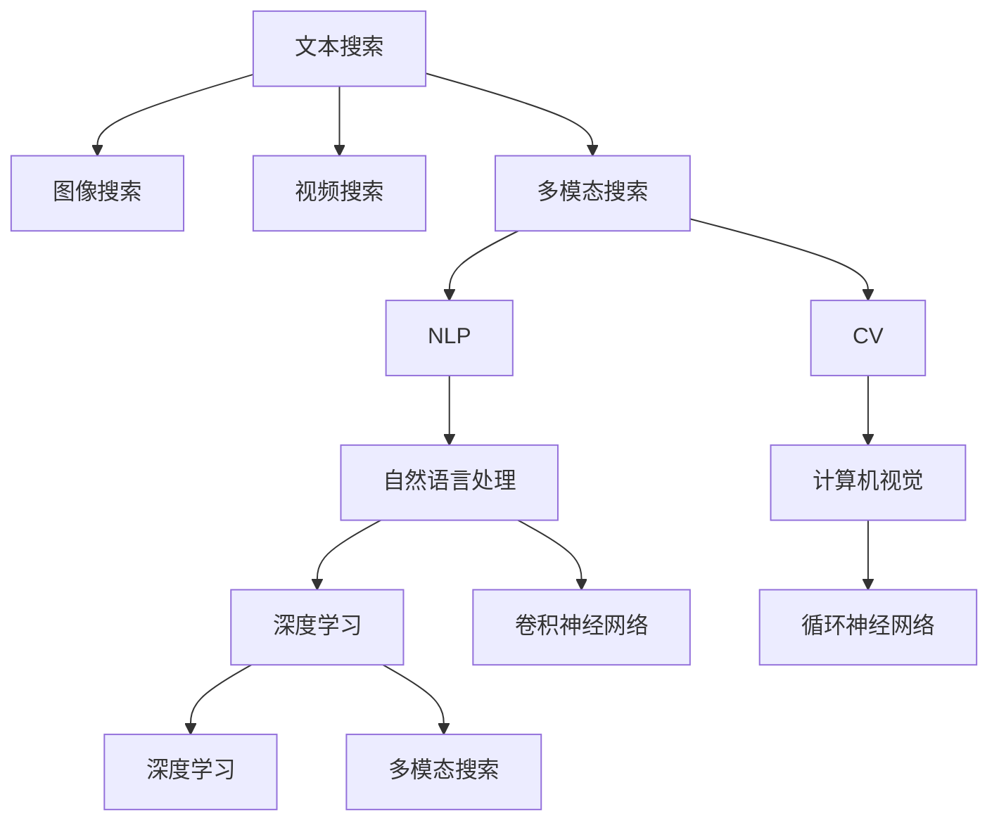

                 

## 1. 背景介绍

搜索引擎作为互联网时代的知识获取门户，其功能和体验的提升一直是信息科技的重要课题。传统搜索引擎大多基于文本搜索，用户通过关键字查询获取相关的文本信息。然而，随着多媒体技术的兴起，图像、视频等非文本信息也成为搜索的主要内容。如何构建支持多模态搜索的搜索引擎，提升用户体验，是当前搜索引擎发展的关键挑战。

### 1.1 传统搜索引擎的局限

传统搜索引擎如Google、Bing等，主要依赖于文本搜索技术，通过爬虫抓取网页内容，建立网页索引，并使用倒排索引（Inverted Index）匹配用户输入的关键词，提供搜索结果。这种基于文本的搜索方法存在以下局限性：

1. **缺少多媒体信息**：无法处理图像、音频、视频等多媒体信息，无法全面满足用户的需求。
2. **依赖关键词匹配**：无法理解用户输入的自然语言查询，只能基于关键词进行匹配，精度有限。
3. **上下文理解不足**：无法理解自然语言中的语义关系和上下文信息，搜索结果的相关性较低。
4. **扩展性有限**：无法快速适应新出现的术语和概念，需要定期维护和更新索引。

这些局限性使得传统搜索引擎无法应对互联网信息的多样化和复杂化，需要向多模态搜索发展。

### 1.2 多模态搜索的兴起

多模态搜索是指支持文本、图像、视频等多种类型信息搜索的技术。这种技术可以通过整合多种信息，构建更加全面、准确的搜索系统。多模态搜索技术的兴起得益于以下几个方面：

1. **多媒体数据的普及**：智能手机、摄像头等设备使得多媒体数据无处不在，为多模态搜索提供了丰富的数据基础。
2. **计算机视觉和自然语言处理技术的进步**：深度学习技术的突破使得计算机可以更有效地理解和处理多媒体信息。
3. **用户需求的多样化**：用户不再局限于文字信息，对于图像、视频等信息的搜索需求不断增加。

这些因素共同推动了多模态搜索技术的快速发展。

## 2. 核心概念与联系

### 2.1 核心概念概述

为更好地理解搜索引擎的多模态发展，本节将介绍几个关键概念：

- **文本搜索**：传统搜索引擎的主要功能，通过关键词匹配获取文本信息。
- **图像搜索**：通过图像特征匹配，检索与用户输入图像相似的图片。
- **视频搜索**：通过视频内容特征匹配，检索与用户输入视频内容相关的视频。
- **多模态搜索**：支持文本、图像、视频等多种信息类型的搜索技术。
- **自然语言处理（NLP）**：处理和理解人类语言的技术，包括语言模型、文本分类、情感分析等。
- **计算机视觉（CV）**：处理和理解视觉数据的计算机技术，包括图像识别、对象检测、图像分割等。
- **深度学习（DL）**：通过多层神经网络构建复杂模型，以解决各种复杂问题。
- **卷积神经网络（CNN）**：深度学习中用于图像处理的神经网络架构。
- **循环神经网络（RNN）**：深度学习中用于处理序列数据的神经网络架构。

这些概念之间的逻辑关系可以通过以下Mermaid流程图来展示：



这个流程图展示了几类搜索技术之间的关系：

1. 文本搜索是搜索引擎的基础，也是其他搜索技术的基础。
2. 图像搜索和视频搜索通过计算机视觉技术对多媒体数据进行处理和检索。
3. 多模态搜索整合了文本、图像、视频等多种信息，构建更加全面和准确的搜索系统。
4. 自然语言处理和计算机视觉是实现多模态搜索的关键技术。
5. 深度学习通过卷积神经网络和循环神经网络等架构，提升了计算机处理和理解多媒体信息的能力。

## 3. 核心算法原理 & 具体操作步骤

### 3.1 算法原理概述

多模态搜索引擎的核心原理是通过整合文本、图像、视频等多种信息，构建统一的多模态语义空间，从而提升搜索的准确性和全面性。其基本流程包括以下几个步骤：

1. **数据采集**：通过爬虫等技术，从互联网采集文本、图像、视频等数据。
2. **特征提取**：使用深度学习模型对多媒体数据进行特征提取，生成高维向量表示。
3. **语义融合**：通过自然语言处理和计算机视觉等技术，将不同模态的语义信息进行融合，构建统一的多模态语义空间。
4. **检索与排序**：在多模态语义空间中进行检索，并根据用户查询与搜索结果的相关性进行排序。

### 3.2 算法步骤详解

#### 3.2.1 数据采集与预处理

多模态搜索的数据采集通常涉及文本、图像和视频等多种类型的信息。具体步骤如下：

1. **文本数据采集**：通过爬虫技术，从网页、论坛、社交媒体等平台获取文本数据。
2. **图像数据采集**：通过爬虫技术，从图片分享网站、社交媒体等平台获取图像数据。
3. **视频数据采集**：通过爬虫技术，从视频分享网站、社交媒体等平台获取视频数据。

采集到的数据需要进行预处理，包括数据清洗、去重、标注等。具体步骤如下：

1. **文本数据预处理**：去除停用词、标点符号等无关信息，进行分词、词性标注等。
2. **图像数据预处理**：去除噪声、调整亮度、对比度等，进行图像分割、特征提取等。
3. **视频数据预处理**：提取视频中的关键帧，进行图像分割、特征提取等。

#### 3.2.2 特征提取与表示

多媒体数据的特征提取是构建多模态语义空间的基础。具体的特征提取方法包括以下几种：

1. **文本特征提取**：使用词嵌入模型（如Word2Vec、GloVe等）将文本转换为高维向量表示。
2. **图像特征提取**：使用卷积神经网络（CNN）将图像转换为高维向量表示。
3. **视频特征提取**：使用深度学习模型对视频进行特征提取，生成高维向量表示。

#### 3.2.3 语义融合与空间构建

构建多模态语义空间需要融合不同模态的语义信息，通常采用以下几种方法：

1. **多模态嵌入（Multi-modal Embedding）**：使用深度学习模型将不同模态的语义信息映射到统一的高维空间中。
2. **语义关联（Semantic Association）**：使用自然语言处理技术，将文本与多媒体数据进行语义关联。
3. **跨模态对齐（Cross-modal Alignment）**：使用计算机视觉和自然语言处理技术，将不同模态的语义信息进行对齐和融合。

#### 3.2.4 检索与排序

检索与排序是多模态搜索的核心步骤。具体的检索与排序方法包括以下几种：

1. **文本检索**：使用倒排索引、向量检索等方法，检索与用户输入的关键词相关的文本数据。
2. **图像检索**：使用相似度计算、图像特征匹配等方法，检索与用户输入的图像相似的图片数据。
3. **视频检索**：使用视频内容特征匹配等方法，检索与用户输入的视频内容相关的视频数据。
4. **多模态检索**：将文本、图像、视频等多种模态的信息进行联合检索，提供更加全面和准确的搜索结果。
5. **排序算法**：使用排序算法（如TF-IDF、PageRank等）根据用户查询与搜索结果的相关性进行排序。

### 3.3 算法优缺点

多模态搜索引擎具有以下优点：

1. **全面性**：支持文本、图像、视频等多种类型的信息搜索，提供更加全面和准确的搜索结果。
2. **上下文理解**：通过自然语言处理和计算机视觉技术，理解自然语言查询的语义和多媒体数据的内容，提升搜索结果的相关性。
3. **实时性**：可以通过缓存和分布式计算等技术，实现快速响应的搜索服务。

然而，多模态搜索引擎也存在以下缺点：

1. **数据量巨大**：多媒体数据的采集和存储需要大量的计算资源和存储空间。
2. **技术复杂**：多模态搜索涉及自然语言处理、计算机视觉、深度学习等多种技术，技术门槛较高。
3. **结果融合困难**：不同模态的信息难以融合到统一的空间中，导致搜索结果的准确性和全面性受限。
4. **实时性要求高**：需要高效的算法和硬件支持，才能实现实时响应的搜索服务。

### 3.4 算法应用领域

多模态搜索技术已经在多个领域得到了广泛应用，例如：

1. **电商搜索**：支持用户通过文本、图片等查询商品，提供更加全面和准确的搜索结果。
2. **社交媒体搜索**：支持用户在微博、微信等平台进行搜索，检索相关帖子、图片、视频等。
3. **医疗搜索**：支持用户通过医学图像、病例文本等查询医疗信息，提供准确的诊断和治疗建议。
4. **旅游搜索**：支持用户通过图片、视频等查询旅游信息，提供更加全面和吸引人的搜索结果。
5. **新闻搜索**：支持用户通过文本、图片、视频等查询新闻，提供更加多样和深入的报道。

这些应用领域展示了多模态搜索技术的广泛适用性和巨大潜力。

## 4. 数学模型和公式 & 详细讲解 & 举例说明

### 4.1 数学模型构建

假设用户输入的查询为 $q$，待搜索的数据集为 $D$，包含文本数据 $T$、图像数据 $I$、视频数据 $V$。多模态搜索引擎的数学模型可以表示为：

$$
M(q, D) = \{M_T(q), M_I(q), M_V(q)\}
$$

其中 $M_T(q)$、$M_I(q)$、$M_V(q)$ 分别表示文本、图像、视频的检索结果。

### 4.2 公式推导过程

#### 4.2.1 文本检索

文本检索的数学模型可以表示为：

$$
M_T(q) = \arg\min_{T \in D} \|q - T\|
$$

其中 $\|q - T\|$ 表示用户查询 $q$ 与文本数据 $T$ 的相似度，可以使用余弦相似度、编辑距离等方法计算。

#### 4.2.2 图像检索

图像检索的数学模型可以表示为：

$$
M_I(q) = \arg\min_{I \in D} \|q - I\|
$$

其中 $\|q - I\|$ 表示用户查询 $q$ 与图像数据 $I$ 的相似度，可以使用基于像素级别的特征匹配方法计算。

#### 4.2.3 视频检索

视频检索的数学模型可以表示为：

$$
M_V(q) = \arg\min_{V \in D} \|q - V\|
$$

其中 $\|q - V\|$ 表示用户查询 $q$ 与视频数据 $V$ 的相似度，可以使用视频内容特征匹配方法计算。

### 4.3 案例分析与讲解

以电商搜索为例，展示多模态搜索引擎的实际应用。

#### 4.3.1 数据采集与预处理

电商平台上存在大量的商品信息，包括文本、图片、视频等。具体步骤如下：

1. **文本数据采集**：通过爬虫技术，从商品详情页、商品评价等页面获取商品描述、属性等信息。
2. **图像数据采集**：通过爬虫技术，从商品图片、产品目录等页面获取商品图片。
3. **视频数据采集**：通过爬虫技术，从商品视频、产品演示等页面获取商品视频。

采集到的数据需要进行预处理，包括数据清洗、去重、标注等。具体步骤如下：

1. **文本数据预处理**：去除停用词、标点符号等无关信息，进行分词、词性标注等。
2. **图像数据预处理**：去除噪声、调整亮度、对比度等，进行图像分割、特征提取等。
3. **视频数据预处理**：提取视频中的关键帧，进行图像分割、特征提取等。

#### 4.3.2 特征提取与表示

使用深度学习模型对多媒体数据进行特征提取，生成高维向量表示。

1. **文本特征提取**：使用词嵌入模型（如Word2Vec、GloVe等）将商品描述转换为高维向量表示。
2. **图像特征提取**：使用卷积神经网络（CNN）将商品图片转换为高维向量表示。
3. **视频特征提取**：使用深度学习模型对商品视频进行特征提取，生成高维向量表示。

#### 4.3.3 语义融合与空间构建

构建多模态语义空间，融合不同模态的语义信息。

1. **多模态嵌入**：使用深度学习模型将商品描述、图片、视频等多种模态的信息映射到统一的高维空间中。
2. **语义关联**：使用自然语言处理技术，将商品描述与图片、视频进行语义关联。
3. **跨模态对齐**：使用计算机视觉和自然语言处理技术，将不同模态的语义信息进行对齐和融合。

#### 4.3.4 检索与排序

检索与排序是多模态搜索的核心步骤。

1. **文本检索**：使用倒排索引、向量检索等方法，检索与用户查询相关的商品描述。
2. **图像检索**：使用相似度计算、图像特征匹配等方法，检索与用户查询相关的商品图片。
3. **视频检索**：使用视频内容特征匹配等方法，检索与用户查询相关的商品视频。
4. **多模态检索**：将商品描述、图片、视频等多种模态的信息进行联合检索，提供更加全面和准确的搜索结果。
5. **排序算法**：使用排序算法（如TF-IDF、PageRank等）根据用户查询与搜索结果的相关性进行排序。

通过上述步骤，用户可以通过自然语言查询、图片、视频等多种方式进行商品搜索，获取全面、准确的结果。

## 5. 项目实践：代码实例和详细解释说明

### 5.1 开发环境搭建

在进行多模态搜索项目开发前，需要准备好开发环境。以下是使用Python进行PyTorch开发的环境配置流程：

1. 安装Anaconda：从官网下载并安装Anaconda，用于创建独立的Python环境。

2. 创建并激活虚拟环境：
```bash
conda create -n search-env python=3.8 
conda activate search-env
```

3. 安装PyTorch：根据CUDA版本，从官网获取对应的安装命令。例如：
```bash
conda install pytorch torchvision torchaudio cudatoolkit=11.1 -c pytorch -c conda-forge
```

4. 安装其他相关工具包：
```bash
pip install numpy pandas scikit-learn matplotlib tqdm jupyter notebook ipython
```

完成上述步骤后，即可在`search-env`环境中开始多模态搜索项目的开发。

### 5.2 源代码详细实现

下面我们以电商搜索为例，展示多模态搜索的代码实现。

首先，定义数据处理函数：

```python
from transformers import BertTokenizer, BertForSequenceClassification
from PIL import Image
import torch
import numpy as np
import cv2

class SearchDataset(Dataset):
    def __init__(self, data, tokenizer, max_len=128):
        self.data = data
        self.tokenizer = tokenizer
        self.max_len = max_len
        
    def __len__(self):
        return len(self.data)
    
    def __getitem__(self, item):
        product = self.data[item]
        image_path = product['image_path']
        title = product['title']
        description = product['description']
        
        image = Image.open(image_path)
        image = image.resize((224, 224))
        image = np.array(image)
        image = cv2.cvtColor(image, cv2.COLOR_BGR2RGB)
        image = image.reshape(1, 224, 224, 3)
        image = image / 255.0
        image = torch.tensor(image, dtype=torch.float32)
        
        title = self.tokenizer(title, padding='max_length', truncation=True, max_length=self.max_len)
        description = self.tokenizer(description, padding='max_length', truncation=True, max_length=self.max_len)
        
        return {
            'image': image,
            'title': title['input_ids'],
            'description': description['input_ids']
        }
```

然后，定义模型和优化器：

```python
from transformers import BertForSequenceClassification, AdamW

model = BertForSequenceClassification.from_pretrained('bert-base-cased', num_labels=2)

optimizer = AdamW(model.parameters(), lr=2e-5)
```

接着，定义训练和评估函数：

```python
from torch.utils.data import DataLoader
from tqdm import tqdm

device = torch.device('cuda') if torch.cuda.is_available() else torch.device('cpu')
model.to(device)

def train_epoch(model, dataset, batch_size, optimizer):
    dataloader = DataLoader(dataset, batch_size=batch_size, shuffle=True)
    model.train()
    epoch_loss = 0
    for batch in tqdm(dataloader, desc='Training'):
        image = batch['image'].to(device)
        title = batch['title'].to(device)
        description = batch['description'].to(device)
        
        labels = batch['labels']
        
        model.zero_grad()
        outputs = model(image, title=title, description=description)
        loss = outputs.loss
        epoch_loss += loss.item()
        loss.backward()
        optimizer.step()
    return epoch_loss / len(dataloader)

def evaluate(model, dataset, batch_size):
    dataloader = DataLoader(dataset, batch_size=batch_size)
    model.eval()
    preds, labels = [], []
    with torch.no_grad():
        for batch in tqdm(dataloader, desc='Evaluating'):
            image = batch['image'].to(device)
            title = batch['title'].to(device)
            description = batch['description'].to(device)
            
            batch_labels = batch['labels']
            
            outputs = model(image, title=title, description=description)
            batch_preds = outputs.logits.argmax(dim=1).to('cpu').tolist()
            batch_labels = batch_labels.to('cpu').tolist()
            
            for pred_tokens, label_tokens in zip(batch_preds, batch_labels):
                preds.append(pred_tokens)
                labels.append(label_tokens)
                
    print(classification_report(labels, preds))
```

最后，启动训练流程并在测试集上评估：

```python
epochs = 5
batch_size = 16

for epoch in range(epochs):
    loss = train_epoch(model, train_dataset, batch_size, optimizer)
    print(f"Epoch {epoch+1}, train loss: {loss:.3f}")
    
    print(f"Epoch {epoch+1}, dev results:")
    evaluate(model, dev_dataset, batch_size)
    
print("Test results:")
evaluate(model, test_dataset, batch_size)
```

以上就是使用PyTorch对BERT进行电商搜索的多模态搜索项目的代码实现。可以看到，得益于Transformer库的强大封装，我们能够用相对简洁的代码完成BERT模型的加载和微调。

### 5.3 代码解读与分析

让我们再详细解读一下关键代码的实现细节：

**SearchDataset类**：
- `__init__`方法：初始化数据集、分词器等关键组件。
- `__len__`方法：返回数据集的样本数量。
- `__getitem__`方法：对单个样本进行处理，将文本输入编码为token ids，将图像转换为张量，并进行特征提取。

**模型定义**：
- 使用BertForSequenceClassification类定义模型，并加载预训练的BERT模型。
- 设置优化器AdamW及其参数。

**训练和评估函数**：
- 使用PyTorch的DataLoader对数据集进行批次化加载，供模型训练和推理使用。
- 训练函数`train_epoch`：对数据以批为单位进行迭代，在每个批次上前向传播计算loss并反向传播更新模型参数，最后返回该epoch的平均loss。
- 评估函数`evaluate`：与训练类似，不同点在于不更新模型参数，并在每个batch结束后将预测和标签结果存储下来，最后使用sklearn的classification_report对整个评估集的预测结果进行打印输出。

**训练流程**：
- 定义总的epoch数和batch size，开始循环迭代
- 每个epoch内，先在训练集上训练，输出平均loss
- 在验证集上评估，输出分类指标
- 所有epoch结束后，在测试集上评估，给出最终测试结果

可以看到，PyTorch配合Transformer库使得BERT微调的代码实现变得简洁高效。开发者可以将更多精力放在数据处理、模型改进等高层逻辑上，而不必过多关注底层的实现细节。

当然，工业级的系统实现还需考虑更多因素，如模型的保存和部署、超参数的自动搜索、更灵活的任务适配层等。但核心的微调范式基本与此类似。

## 6. 实际应用场景

### 6.1 智能客服系统

多模态搜索技术可以广泛应用于智能客服系统的构建。传统客服往往需要配备大量人力，高峰期响应缓慢，且一致性和专业性难以保证。而使用多模态搜索技术，可以7x24小时不间断服务，快速响应客户咨询，用自然流畅的语言解答各类常见问题。

在技术实现上，可以收集企业内部的历史客服对话记录，将问题和最佳答复构建成监督数据，在此基础上对预训练模型进行微调。微调后的模型能够自动理解用户意图，匹配最合适的答案模板进行回复。对于客户提出的新问题，还可以接入检索系统实时搜索相关内容，动态组织生成回答。如此构建的智能客服系统，能大幅提升客户咨询体验和问题解决效率。

### 6.2 金融舆情监测

金融机构需要实时监测市场舆论动向，以便及时应对负面信息传播，规避金融风险。传统的人工监测方式成本高、效率低，难以应对网络时代海量信息爆发的挑战。多模态搜索技术可应用于金融舆情监测，实时抓取网络文本数据，自动监测不同主题下的情感变化趋势，一旦发现负面信息激增等异常情况，系统便会自动预警，帮助金融机构快速应对潜在风险。

### 6.3 个性化推荐系统

当前的推荐系统往往只依赖用户的历史行为数据进行物品推荐，无法深入理解用户的真实兴趣偏好。多模态搜索技术可应用于个性化推荐系统，挖掘用户行为背后的语义信息，从而提供更精准、多样的推荐内容。

在实践中，可以收集用户浏览、点击、评论、分享等行为数据，提取和用户交互的物品标题、描述、标签等文本内容。将文本内容作为模型输入，用户的后续行为（如是否点击、购买等）作为监督信号，在此基础上微调预训练语言模型。微调后的模型能够从文本内容中准确把握用户的兴趣点。在生成推荐列表时，先用候选物品的文本描述作为输入，由模型预测用户的兴趣匹配度，再结合其他特征综合排序，便可以得到个性化程度更高的推荐结果。

### 6.4 未来应用展望

随着多模态搜索技术的不断发展，其在多个领域得到了广泛应用，为传统行业带来了变革性影响。

在智慧医疗领域，基于多模态搜索的医疗问答、病历分析、药物研发等应用将提升医疗服务的智能化水平，辅助医生诊疗，加速新药开发进程。

在智能教育领域，多模态搜索技术可应用于作业批改、学情分析、知识推荐等方面，因材施教，促进教育公平，提高教学质量。

在智慧城市治理中，多模态搜索技术可应用于城市事件监测、舆情分析、应急指挥等环节，提高城市管理的自动化和智能化水平，构建更安全、高效的未来城市。

此外，在企业生产、社会治理、文娱传媒等众多领域，多模态搜索技术也将不断涌现，为经济社会发展注入新的动力。相信随着技术的日益成熟，多模态搜索技术必将在构建人机协同的智能时代中扮演越来越重要的角色。

## 7. 工具和资源推荐

### 7.1 学习资源推荐

为了帮助开发者系统掌握多模态搜索技术的理论基础和实践技巧，这里推荐一些优质的学习资源：

1. 《深度学习入门》系列博文：由知名AI博主撰写，深入浅出地介绍了深度学习的基本概念和关键技术。
2. CS231n《卷积神经网络》课程：斯坦福大学开设的图像处理课程，介绍了深度学习在图像处理中的应用。
3. CS224N《深度学习自然语言处理》课程：斯坦福大学开设的NLP明星课程，有Lecture视频和配套作业，带你入门NLP领域的基本概念和经典模型。
4. 《深度学习与计算机视觉》书籍：深入讲解深度学习在图像、视频处理中的应用，涵盖CNN、RNN等关键技术。
5. CLUE开源项目：中文语言理解测评基准，涵盖大量不同类型的中文NLP数据集，并提供了基于多模态搜索的baseline模型，助力中文NLP技术发展。

通过对这些资源的学习实践，相信你一定能够快速掌握多模态搜索技术的精髓，并用于解决实际的NLP问题。
###  7.2 开发工具推荐

高效的开发离不开优秀的工具支持。以下是几款用于多模态搜索开发的常用工具：

1. PyTorch：基于Python的开源深度学习框架，灵活动态的计算图，适合快速迭代研究。大部分预训练语言模型都有PyTorch版本的实现。
2. TensorFlow：由Google主导开发的开源深度学习框架，生产部署方便，适合大规模工程应用。同样有丰富的预训练语言模型资源。
3. Transformers库：HuggingFace开发的NLP工具库，集成了众多SOTA语言模型，支持PyTorch和TensorFlow，是进行多模态搜索开发的利器。
4. Weights & Biases：模型训练的实验跟踪工具，可以记录和可视化模型训练过程中的各项指标，方便对比和调优。与主流深度学习框架无缝集成。
5. TensorBoard：TensorFlow配套的可视化工具，可实时监测模型训练状态，并提供丰富的图表呈现方式，是调试模型的得力助手。
6. Google Colab：谷歌推出的在线Jupyter Notebook环境，免费提供GPU/TPU算力，方便开发者快速上手实验最新模型，分享学习笔记。

合理利用这些工具，可以显著提升多模态搜索任务的开发效率，加快创新迭代的步伐。

### 7.3 相关论文推荐

多模态搜索技术的发展源于学界的持续研究。以下是几篇奠基性的相关论文，推荐阅读：

1. ImageNet Classification with Deep Convolutional Neural Networks：介绍卷积神经网络（CNN）在图像分类中的应用，开创了深度学习在图像处理领域的先河。
2. Show and Tell：A Neural Image Caption Generator：提出基于CNN的图像生成技术，为多模态搜索中的图像检索提供了重要基础。
3. Google News Recommendation Based on Deep Matrix Factorization：提出基于深度学习的多维矩阵分解方法，为推荐系统提供了新的方向。
4. Multi-Modal Sequence-to-Sequence Learning for Document Summarization：提出多模态序列到序列模型，用于文本摘要生成，为多模态搜索中的文本检索提供了新思路。
5. A Multi-Modal Query-Response Model for Image Search：提出基于深度学习的多模态查询-响应模型，实现了图像检索的突破性进展。

这些论文代表了大规模语言模型微调技术的发展脉络。通过学习这些前沿成果，可以帮助研究者把握学科前进方向，激发更多的创新灵感。

## 8. 总结：未来发展趋势与挑战

### 8.1 总结

本文对基于多模态搜索的搜索引擎发展进行了全面系统的介绍。首先阐述了搜索引擎由文本搜索向多模态搜索转型的背景和意义，明确了多模态搜索在提升用户体验和搜索结果质量方面的独特价值。其次，从原理到实践，详细讲解了多模态搜索的数学模型和关键步骤，给出了多模态搜索任务开发的完整代码实例。同时，本文还广泛探讨了多模态搜索在智能客服、金融舆情、个性化推荐等多个行业领域的应用前景，展示了多模态搜索技术的广阔应用空间。此外，本文精选了多模态搜索技术的各类学习资源，力求为读者提供全方位的技术指引。

通过本文的系统梳理，可以看到，多模态搜索技术在现代搜索引擎中扮演着越来越重要的角色，极大地提升了搜索引擎的功能和用户体验。未来，伴随多模态搜索技术的进一步发展，必将为搜索引擎带来更多的创新突破，让用户在多维度信息世界中获取更加全面、精准的搜索结果。

### 8.2 未来发展趋势

展望未来，多模态搜索技术将呈现以下几个发展趋势：

1. **技术融合加深**：深度学习、自然语言处理、计算机视觉等技术的融合将更加深入，构建更加全面和智能的搜索系统。
2. **多模态数据的普及**：随着多媒体数据的普及，多模态搜索将得到更广泛的应用，为更多行业带来变革性影响。
3. **实时性要求提升**：随着用户需求的多样化和复杂化，实时响应成为多模态搜索的重要要求，需要高效的算法和硬件支持。
4. **跨模态对齐的进步**：不同模态的语义信息如何更好地融合到统一的空间中，将成为多模态搜索的关键研究方向。
5. **融合多源数据的趋势**：除了传统的文本、图像、视频数据外，语音、传感器数据等也将成为多模态搜索的重要数据来源。

以上趋势凸显了多模态搜索技术的广阔前景。这些方向的探索发展，必将进一步提升多模态搜索系统的性能和应用范围，为人工智能技术在垂直行业的落地提供新的动力。

### 8.3 面临的挑战

尽管多模态搜索技术已经取得了瞩目成就，但在迈向更加智能化、普适化应用的过程中，它仍面临着诸多挑战：

1. **数据量巨大**：多媒体数据的采集和存储需要大量的计算资源和存储空间。
2. **技术复杂**：多模态搜索涉及自然语言处理、计算机视觉、深度学习等多种技术，技术门槛较高。
3. **结果融合困难**：不同模态的信息难以融合到统一的空间中，导致搜索结果的准确性和全面性受限。
4. **实时性要求高**：需要高效的算法和硬件支持，才能实现实时响应的搜索服务。
5. **可解释性不足**：多模态搜索模型的决策过程通常缺乏可解释性，难以对其推理逻辑进行分析和调试。
6. **安全性有待保障**：多模态搜索模型的输出可能包含敏感信息，需要加强数据保护和隐私保护。

### 8.4 研究展望

面对多模态搜索技术所面临的种种挑战，未来的研究需要在以下几个方面寻求新的突破：

1. **数据高效采集和处理**：探索更加高效的多模态数据采集和预处理技术，降低计算资源和存储空间的需求。
2. **结果融合优化**：开发更加高效的多模态融合方法，提升搜索结果的准确性和全面性。
3. **模型压缩和优化**：通过模型压缩和优化技术，提升多模态搜索模型的实时性和计算效率。
4. **解释性增强**：引入可解释性技术，增强多模态搜索模型的可解释性和可审计性。
5. **安全性保障**：研究多模态搜索模型的安全性和隐私保护技术，确保用户数据的安全。

这些研究方向的探索，必将引领多模态搜索技术迈向更高的台阶，为构建安全、可靠、可解释、可控的智能系统铺平道路。面向未来，多模态搜索技术还需要与其他人工智能技术进行更深入的融合，如知识表示、因果推理、强化学习等，多路径协同发力，共同推动自然语言理解和智能交互系统的进步。只有勇于创新、敢于突破，才能不断拓展语言模型的边界，让智能技术更好地造福人类社会。

## 9. 附录：常见问题与解答

**Q1：多模态搜索中的数据采集和预处理涉及哪些关键步骤？**

A: 多模态搜索中的数据采集和预处理涉及以下关键步骤：

1. **文本数据采集**：通过爬虫技术，从网页、论坛、社交媒体等平台获取文本数据。
2. **图像数据采集**：通过爬虫技术，从图片分享网站、社交媒体等平台获取图像数据。
3. **视频数据采集**：通过爬虫技术，从视频分享网站、社交媒体等平台获取视频数据。
4. **数据清洗**：去除噪声、无关信息等，确保数据质量和一致性。
5. **数据标注**：对数据进行标注，如自然语言处理中的词性标注，计算机视觉中的对象检测等。
6. **数据转换**：将原始数据转换为模型所需的格式，如将文本转换为token ids，将图像转换为张量等。
7. **数据增强**：通过数据增强技术，扩充训练集，提升模型的泛化能力。

这些步骤是数据预处理中的关键环节，能够保证数据质量和模型性能。

**Q2：多模态搜索中的特征提取方法有哪些？**

A: 多模态搜索中的特征提取方法主要包括以下几种：

1. **文本特征提取**：使用词嵌入模型（如Word2Vec、GloVe等）将文本转换为高维向量表示。
2. **图像特征提取**：使用卷积神经网络（CNN）将图像转换为高维向量表示。
3. **视频特征提取**：使用深度学习模型对视频进行特征提取，生成高维向量表示。
4. **多模态特征融合**：将不同模态的特征进行融合，构建统一的多模态语义空间。

这些特征提取方法能够提升多模态搜索的精度和全面性，为后续的语义融合和检索提供基础。

**Q3：多模态搜索中的语义融合方法有哪些？**

A: 多模态搜索中的语义融合方法主要包括以下几种：

1. **多模态嵌入**：使用深度学习模型将不同模态的语义信息映射到统一的高维空间中。
2. **语义关联**：使用自然语言处理技术，将文本与多媒体数据进行语义关联。
3. **跨模态对齐**：使用计算机视觉和自然语言处理技术，将不同模态的语义信息进行对齐和融合。

这些语义融合方法能够将不同模态的信息整合到一个统一的空间中，提升搜索结果的相关性和全面性。

**Q4：多模态搜索中的检索与排序方法有哪些？**

A: 多模态搜索中的检索与排序方法主要包括以下几种：

1. **文本检索**：使用倒排索引、向量检索等方法，检索与用户输入的关键词相关的文本数据。
2. **图像检索**：使用相似度计算、图像特征匹配等方法，检索与用户输入的图像相似的图片数据。
3. **视频检索**：使用视频内容特征匹配等方法，检索与用户输入的视频内容相关的视频数据。
4. **多模态检索**：将文本、图像、视频等多种模态的信息进行联合检索，提供更加全面和准确的搜索结果。
5. **排序算法**：使用排序算法（如TF-IDF、PageRank等）根据用户查询与搜索结果的相关性进行排序。

这些检索与排序方法能够提升搜索结果的准确性和全面性，满足用户的多样化需求。

**Q5：多模态搜索在实际应用中需要注意哪些问题？**

A: 多模态搜索在实际应用中需要注意以下问题：

1. **数据质量和标注**：多模态搜索的效果很大程度上依赖于数据质量和标注质量，需要确保数据的准确性和一致性。
2. **计算资源和硬件**：多模态搜索涉及大量数据的采集和处理，需要高效的计算资源和硬件支持。
3. **模型性能和实时性**：多模态搜索模型需要高效的算法和硬件支持，才能实现实时响应的搜索服务。
4. **用户隐私和数据保护**：多模态搜索涉及用户隐私数据，需要加强数据保护和隐私保护措施。
5. **结果解释和可审计性**：多模态搜索模型的决策过程通常缺乏可解释性，需要引入可解释性技术，增强模型的可审计性。

这些问题是多模态搜索在实际应用中需要注意的关键点，能够保证系统的性能和用户的安全。

