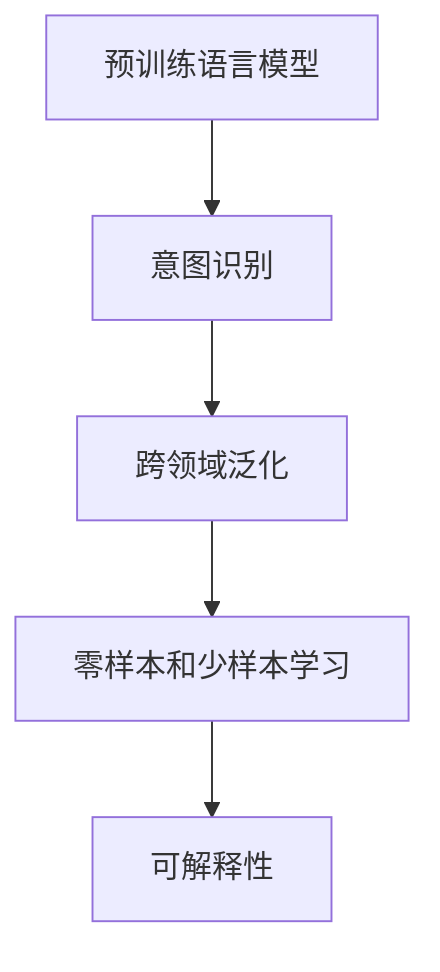

                 

# 搜索意图识别：大模型带来的突破

## 1. 背景介绍

### 1.1 问题由来
在信息爆炸的互联网时代，搜索引擎已成为我们获取信息的主要工具。然而，传统的搜索引擎仅通过关键词匹配技术进行查询匹配，难以理解用户的真实需求，导致搜索结果的相关性、准确性不高。为了提升搜索引擎的用户体验，意图识别技术应运而生。意图识别旨在理解用户输入的查询背后的真实意图，从而更精准地返回与意图相关的搜索结果。

近年来，随着深度学习和大规模语言模型的崛起，意图识别技术取得了显著进展。特别是利用预训练语言模型进行意图识别，显著提升了意图识别的准确性和泛化能力。本文将详细探讨大模型在意图识别中的突破性应用，并总结相关理论、技术实现和未来趋势。

### 1.2 问题核心关键点
大模型在意图识别中的核心应用在于通过预训练学习到丰富的语言表示，并在此基础上进行微调，使得模型能够理解和表达用户输入文本背后的真实意图。核心关键点包括：

1. **预训练语言模型**：以自回归或自编码方式预训练的通用语言模型，通过在海量文本数据上进行训练，学习到通用的语言知识和表示。
2. **意图识别**：通过微调预训练模型，使其能够理解和分类用户查询中的意图。
3. **跨领域泛化**：大模型通常具备跨领域的泛化能力，可以在不同领域和场景中进行意图识别。
4. **零样本和少样本学习**：利用大模型的强大语言理解能力，实现在少量标注数据甚至无标注数据上进行高效意图识别。
5. **鲁棒性和可解释性**：在实际应用中，大模型需要具备鲁棒性，以应对各种噪音和变化，同时需具备一定的可解释性，便于调试和维护。

### 1.3 问题研究意义
意图识别技术对提升搜索引擎的用户体验、优化搜索结果的质量具有重要意义。利用大模型进行意图识别，可以有效降低对标注数据的依赖，减少人工标注成本，提升意图识别的准确性和泛化能力。同时，大模型的跨领域泛化能力使其能够适用于多个领域的意图识别任务，如电商、金融、医疗等，具有广泛的应用前景。此外，大模型在零样本和少样本学习方面的突破，使得意图识别技术可以应用于更多场景，如个性化推荐、智能客服等，进一步推动人工智能技术的落地应用。

## 2. 核心概念与联系

### 2.1 核心概念概述

为了更好地理解大模型在意图识别中的应用，本节将介绍几个核心概念：

- **预训练语言模型**：如BERT、GPT等，通过在大规模无标签文本语料上进行预训练，学习到通用的语言表示。
- **意图识别**：旨在理解用户查询背后的真实意图，通常表示为特定的意图类别，如查询位置、购买商品、获取信息等。
- **跨领域泛化**：预训练模型通常具备跨领域的泛化能力，能够在不同领域的意图识别任务上取得良好的效果。
- **零样本和少样本学习**：利用大模型的语言理解能力，实现在少量标注数据甚至无标注数据上的高效意图识别。
- **可解释性**：大模型在实际应用中需要具备一定的可解释性，便于理解模型的决策逻辑，进行调试和优化。

这些核心概念之间的逻辑关系可以通过以下Mermaid流程图来展示：



这个流程图展示了预训练语言模型在意图识别中的关键步骤：

1. 预训练语言模型通过在大规模无标签文本语料上进行训练，学习到通用的语言表示。
2. 通过微调预训练模型，使其能够理解和分类用户查询中的意图。
3. 大模型通常具备跨领域的泛化能力，能够在不同领域的意图识别任务上取得良好的效果。
4. 利用大模型的强大语言理解能力，实现在少量标注数据甚至无标注数据上的高效意图识别。
5. 大模型在实际应用中需要具备一定的可解释性，便于理解模型的决策逻辑，进行调试和优化。

这些概念共同构成了大模型在意图识别中的应用框架，使其能够有效地理解和表达用户查询背后的真实意图。

## 3. 核心算法原理 & 具体操作步骤
### 3.1 算法原理概述

大模型在意图识别中的应用，本质上是一个有监督的迁移学习过程。其核心思想是：将预训练的大语言模型作为通用的语言表示器，通过下游任务的少量标注数据进行微调，使得模型能够理解和分类用户查询中的意图。

形式化地，假设预训练语言模型为 $M_{\theta}$，其中 $\theta$ 为预训练得到的模型参数。给定意图识别任务 $T$ 的标注数据集 $D=\{(x_i,y_i)\}_{i=1}^N$，其中 $x_i$ 表示查询文本，$y_i$ 表示查询背后的意图类别。微调的目标是找到新的模型参数 $\hat{\theta}$，使得：

$$
\hat{\theta}=\mathop{\arg\min}_{\theta} \mathcal{L}(M_{\theta},D)
$$

其中 $\mathcal{L}$ 为针对意图识别任务设计的损失函数，用于衡量模型预测意图与真实意图之间的差异。常见的损失函数包括交叉熵损失、均方误差损失等。

通过梯度下降等优化算法，微调过程不断更新模型参数 $\theta$，最小化损失函数 $\mathcal{L}$，使得模型预测的意图逼近真实意图。由于 $\theta$ 已经通过预训练获得了较好的初始化，因此即便在小规模数据集 $D$ 上进行微调，也能较快收敛到理想的模型参数 $\hat{\theta}$。

### 3.2 算法步骤详解

大模型在意图识别中的应用，通常包括以下几个关键步骤：

**Step 1: 准备预训练模型和数据集**
- 选择合适的预训练语言模型 $M_{\theta}$ 作为初始化参数，如 BERT、GPT 等。
- 准备意图识别任务的标注数据集 $D$，划分为训练集、验证集和测试集。一般要求标注数据与预训练数据的分布不要差异过大。

**Step 2: 添加任务适配层**
- 根据意图识别任务，在预训练模型的顶部添加分类器或回归器。
- 对于分类任务，通常在顶层添加线性分类器或Transformer头部，使用交叉熵损失函数。
- 对于回归任务，通常使用线性回归器，以均方误差损失函数。

**Step 3: 设置微调超参数**
- 选择合适的优化算法及其参数，如 AdamW、SGD 等，设置学习率、批大小、迭代轮数等。
- 设置正则化技术及强度，包括权重衰减、Dropout、Early Stopping 等。
- 确定冻结预训练参数的策略，如仅微调顶层，或全部参数都参与微调。

**Step 4: 执行梯度训练**
- 将训练集数据分批次输入模型，前向传播计算损失函数。
- 反向传播计算参数梯度，根据设定的优化算法和学习率更新模型参数。
- 周期性在验证集上评估模型性能，根据性能指标决定是否触发 Early Stopping。
- 重复上述步骤直到满足预设的迭代轮数或 Early Stopping 条件。

**Step 5: 测试和部署**
- 在测试集上评估微调后模型 $M_{\hat{\theta}}$ 的性能，对比微调前后的精度提升。
- 使用微调后的模型对新查询进行推理预测，集成到实际的应用系统中。
- 持续收集新的数据，定期重新微调模型，以适应数据分布的变化。

以上是使用大模型进行意图识别的通用流程。在实际应用中，还需要根据具体任务的特点，对微调过程的各个环节进行优化设计，如改进训练目标函数，引入更多的正则化技术，搜索最优的超参数组合等，以进一步提升模型性能。

### 3.3 算法优缺点

利用大模型进行意图识别，具有以下优点：

1. **高效泛化**：大模型通常具备跨领域的泛化能力，能够适应不同领域的意图识别任务。
2. **数据利用率高**：微调过程中，仅需要少量标注数据即可取得较好的效果，降低对标注数据的依赖。
3. **准确性高**：基于大模型的意图识别模型通常具有较高的准确性，能够精准理解用户查询背后的真实意图。
4. **技术实现简单**：利用大模型进行意图识别，技术实现相对简单，开发周期短。

同时，也存在一些局限性：

1. **成本高**：预训练模型的训练成本较高，需要大量的计算资源和时间。
2. **可解释性不足**：大模型的决策过程往往缺乏可解释性，难以对其推理逻辑进行分析和调试。
3. **依赖标注数据**：尽管利用小样本学习可以在一定程度上降低对标注数据的依赖，但在特定领域仍需标注数据进行微调。

尽管存在这些局限性，但大模型在意图识别中的应用，已经展示了其在提升用户查询理解和优化搜索结果质量方面的巨大潜力。未来，随着技术的不断进步和算力资源的丰富，大模型在意图识别中的应用将更加广泛和深入。

### 3.4 算法应用领域

大模型在意图识别中的应用，已经在多个领域取得了显著成果：

- **搜索引擎**：利用意图识别技术，优化搜索结果的展示，提升用户查询体验。
- **智能客服**：通过对用户查询进行意图识别，实现智能回答和问题解答。
- **电商推荐**：利用用户查询意图，推荐相关商品或服务。
- **金融风控**：识别用户的查询意图，分析潜在的金融风险。
- **医疗健康**：识别用户查询的健康问题，提供相应的健康建议。

除了这些经典应用外，大模型在意图识别领域还有更多创新性的应用，如可控文本生成、知识图谱构建、自然语言推理等，为NLP技术带来了新的突破。

## 4. 数学模型和公式 & 详细讲解 & 举例说明

### 4.1 数学模型构建

本节将使用数学语言对大模型在意图识别中的应用进行更加严格的刻画。

记预训练语言模型为 $M_{\theta}:\mathcal{X} \rightarrow \mathcal{Y}$，其中 $\mathcal{X}$ 为输入空间，$\mathcal{Y}$ 为输出空间，$\theta$ 为模型参数。假设意图识别任务的训练集为 $D=\{(x_i,y_i)\}_{i=1}^N, x_i \in \mathcal{X}, y_i \in \mathcal{Y}$。

定义模型 $M_{\theta}$ 在输入 $x_i$ 上的输出为 $\hat{y}_i=M_{\theta}(x_i)$，表示模型预测的意图类别。在训练集 $D$ 上的经验风险为：

$$
\mathcal{L}(\theta) = \frac{1}{N} \sum_{i=1}^N \ell(M_{\theta}(x_i),y_i)
$$

其中 $\ell$ 为针对意图识别任务设计的损失函数，用于衡量模型预测意图与真实意图之间的差异。常见的损失函数包括交叉熵损失、均方误差损失等。

微调的优化目标是最小化经验风险，即找到最优参数：

$$
\theta^* = \mathop{\arg\min}_{\theta} \mathcal{L}(\theta)
$$

在实践中，我们通常使用基于梯度的优化算法（如SGD、AdamW等）来近似求解上述最优化问题。设 $\eta$ 为学习率，$\lambda$ 为正则化系数，则参数的更新公式为：

$$
\theta \leftarrow \theta - \eta \nabla_{\theta}\mathcal{L}(\theta) - \eta\lambda\theta
$$

其中 $\nabla_{\theta}\mathcal{L}(\theta)$ 为损失函数对参数 $\theta$ 的梯度，可通过反向传播算法高效计算。

### 4.2 公式推导过程

以下我们以二分类任务为例，推导交叉熵损失函数及其梯度的计算公式。

假设模型 $M_{\theta}$ 在输入 $x_i$ 上的输出为 $\hat{y}_i=M_{\theta}(x_i) \in [0,1]$，表示模型预测意图为正类的概率。真实标签 $y_i \in \{0,1\}$。则二分类交叉熵损失函数定义为：

$$
\ell(M_{\theta}(x_i),y_i) = -[y_i\log \hat{y}_i + (1-y_i)\log (1-\hat{y}_i)]
$$

将其代入经验风险公式，得：

$$
\mathcal{L}(\theta) = -\frac{1}{N}\sum_{i=1}^N [y_i\log M_{\theta}(x_i)+(1-y_i)\log(1-M_{\theta}(x_i))]
$$

根据链式法则，损失函数对参数 $\theta_k$ 的梯度为：

$$
\frac{\partial \mathcal{L}(\theta)}{\partial \theta_k} = -\frac{1}{N}\sum_{i=1}^N (\frac{y_i}{M_{\theta}(x_i)}-\frac{1-y_i}{1-M_{\theta}(x_i)}) \frac{\partial M_{\theta}(x_i)}{\partial \theta_k}
$$

其中 $\frac{\partial M_{\theta}(x_i)}{\partial \theta_k}$ 可进一步递归展开，利用自动微分技术完成计算。

在得到损失函数的梯度后，即可带入参数更新公式，完成模型的迭代优化。重复上述过程直至收敛，最终得到适应下游任务的最优模型参数 $\theta^*$。

### 4.3 案例分析与讲解

以电商推荐系统为例，利用大模型进行意图识别。电商推荐系统通常需要根据用户查询理解其需求，推荐相应的商品。使用大模型进行意图识别，可以大大提高推荐系统的准确性和个性化程度。

具体而言，可以将用户的查询作为输入，利用大模型进行意图识别，得到用户对商品的不同需求意图。然后，根据这些意图，从商品库中筛选出最匹配的商品进行推荐。

例如，用户查询 "我想买一款轻便的笔记本电脑"，通过大模型进行意图识别，可以得到用户的意图包括"轻便"和"笔记本电脑"。然后，从商品库中筛选出满足这两个条件的商品，进行推荐。

## 5. 项目实践：代码实例和详细解释说明

### 5.1 开发环境搭建

在进行意图识别实践前，我们需要准备好开发环境。以下是使用Python进行PyTorch开发的环境配置流程：

1. 安装Anaconda：从官网下载并安装Anaconda，用于创建独立的Python环境。

2. 创建并激活虚拟环境：
```bash
conda create -n pytorch-env python=3.8 
conda activate pytorch-env
```

3. 安装PyTorch：根据CUDA版本，从官网获取对应的安装命令。例如：
```bash
conda install pytorch torchvision torchaudio cudatoolkit=11.1 -c pytorch -c conda-forge
```

4. 安装Transformers库：
```bash
pip install transformers
```

5. 安装各类工具包：
```bash
pip install numpy pandas scikit-learn matplotlib tqdm jupyter notebook ipython
```

完成上述步骤后，即可在`pytorch-env`环境中开始意图识别实践。

### 5.2 源代码详细实现

下面我们以意图识别任务为例，给出使用Transformers库对BERT模型进行意图识别的PyTorch代码实现。

首先，定义意图识别任务的数据处理函数：

```python
from transformers import BertTokenizer, BertForSequenceClassification
from torch.utils.data import Dataset
import torch

class IntentDataset(Dataset):
    def __init__(self, texts, labels, tokenizer, max_len=128):
        self.texts = texts
        self.labels = labels
        self.tokenizer = tokenizer
        self.max_len = max_len
        
    def __len__(self):
        return len(self.texts)
    
    def __getitem__(self, item):
        text = self.texts[item]
        label = self.labels[item]
        
        encoding = self.tokenizer(text, return_tensors='pt', max_length=self.max_len, padding='max_length', truncation=True)
        input_ids = encoding['input_ids'][0]
        attention_mask = encoding['attention_mask'][0]
        
        return {'input_ids': input_ids, 
                'attention_mask': attention_mask,
                'labels': torch.tensor(label, dtype=torch.long)}
```

然后，定义模型和优化器：

```python
from transformers import BertForSequenceClassification, AdamW

model = BertForSequenceClassification.from_pretrained('bert-base-cased', num_labels=5)

optimizer = AdamW(model.parameters(), lr=2e-5)
```

接着，定义训练和评估函数：

```python
from torch.utils.data import DataLoader
from tqdm import tqdm
from sklearn.metrics import classification_report

device = torch.device('cuda') if torch.cuda.is_available() else torch.device('cpu')
model.to(device)

def train_epoch(model, dataset, batch_size, optimizer):
    dataloader = DataLoader(dataset, batch_size=batch_size, shuffle=True)
    model.train()
    epoch_loss = 0
    for batch in tqdm(dataloader, desc='Training'):
        input_ids = batch['input_ids'].to(device)
        attention_mask = batch['attention_mask'].to(device)
        labels = batch['labels'].to(device)
        model.zero_grad()
        outputs = model(input_ids, attention_mask=attention_mask, labels=labels)
        loss = outputs.loss
        epoch_loss += loss.item()
        loss.backward()
        optimizer.step()
    return epoch_loss / len(dataloader)

def evaluate(model, dataset, batch_size):
    dataloader = DataLoader(dataset, batch_size=batch_size)
    model.eval()
    preds, labels = [], []
    with torch.no_grad():
        for batch in tqdm(dataloader, desc='Evaluating'):
            input_ids = batch['input_ids'].to(device)
            attention_mask = batch['attention_mask'].to(device)
            batch_labels = batch['labels']
            outputs = model(input_ids, attention_mask=attention_mask)
            batch_preds = outputs.logits.argmax(dim=1).to('cpu').tolist()
            batch_labels = batch_labels.to('cpu').tolist()
            for pred, label in zip(batch_preds, batch_labels):
                preds.append(pred)
                labels.append(label)
                
    print(classification_report(labels, preds))
```

最后，启动训练流程并在测试集上评估：

```python
epochs = 5
batch_size = 16

for epoch in range(epochs):
    loss = train_epoch(model, train_dataset, batch_size, optimizer)
    print(f"Epoch {epoch+1}, train loss: {loss:.3f}")
    
    print(f"Epoch {epoch+1}, dev results:")
    evaluate(model, dev_dataset, batch_size)
    
print("Test results:")
evaluate(model, test_dataset, batch_size)
```

以上就是使用PyTorch对BERT进行意图识别任务微调的完整代码实现。可以看到，得益于Transformers库的强大封装，我们可以用相对简洁的代码完成BERT模型的加载和微调。

### 5.3 代码解读与分析

让我们再详细解读一下关键代码的实现细节：

**IntentDataset类**：
- `__init__`方法：初始化文本、标签、分词器等关键组件。
- `__len__`方法：返回数据集的样本数量。
- `__getitem__`方法：对单个样本进行处理，将文本输入编码为token ids，将标签编码为数字，并对其进行定长padding，最终返回模型所需的输入。

**BertForSequenceClassification模型**：
- `from_pretrained`方法：使用预训练的BERT模型作为初始化参数，加载模型和分词器。
- `num_labels`参数：指定模型输出层需要分类的标签数量。

**训练和评估函数**：
- 使用PyTorch的DataLoader对数据集进行批次化加载，供模型训练和推理使用。
- 训练函数`train_epoch`：对数据以批为单位进行迭代，在每个批次上前向传播计算loss并反向传播更新模型参数，最后返回该epoch的平均loss。
- 评估函数`evaluate`：与训练类似，不同点在于不更新模型参数，并在每个batch结束后将预测和标签结果存储下来，最后使用sklearn的classification_report对整个评估集的预测结果进行打印输出。

**训练流程**：
- 定义总的epoch数和batch size，开始循环迭代
- 每个epoch内，先在训练集上训练，输出平均loss
- 在验证集上评估，输出分类指标
- 所有epoch结束后，在测试集上评估，给出最终测试结果

可以看到，PyTorch配合Transformers库使得BERT微调的代码实现变得简洁高效。开发者可以将更多精力放在数据处理、模型改进等高层逻辑上，而不必过多关注底层的实现细节。

当然，工业级的系统实现还需考虑更多因素，如模型的保存和部署、超参数的自动搜索、更灵活的任务适配层等。但核心的微调范式基本与此类似。

## 6. 实际应用场景

### 6.1 智能客服系统

智能客服系统利用大模型的意图识别能力，可以自动理解用户咨询的意图，并给出相应的回答。通过收集企业内部的客服对话记录，将问题和最佳答复构建成监督数据，在此基础上对预训练模型进行微调，可以实现智能客服的自动化。

例如，当用户咨询"如何退货"时，智能客服系统能够理解其意图为退货操作，并自动给出相关的退货指导。这样，可以显著提高客服系统的响应速度和准确性，降低人力成本。

### 6.2 金融舆情监测

金融舆情监测系统通过大模型的意图识别能力，可以实时监测市场舆论动向，及时发现潜在的金融风险。通过收集金融领域相关的新闻、报道、评论等文本数据，进行意图分类，可以预测市场情绪的变化趋势，并及时预警。

例如，当市场出现负面新闻时，系统能够自动识别并分析新闻内容，预测可能带来的风险，并发出预警信号，帮助金融机构及时应对。

### 6.3 个性化推荐系统

个性化推荐系统利用大模型的意图识别能力，可以更好地理解用户的兴趣和需求，从而提供个性化的推荐内容。通过收集用户浏览、点击、评论、分享等行为数据，提取和用户交互的物品标题、描述、标签等文本内容，进行意图识别，可以推荐用户可能感兴趣的商品或服务。

例如，当用户浏览某件商品时，系统能够理解其兴趣点，并推荐相关的商品，提升用户的购物体验。

### 6.4 未来应用展望

随着大模型在意图识别中的广泛应用，未来的智能系统将更加智能化、自动化。大模型具备跨领域的泛化能力，可以在不同领域和场景中进行意图识别，进一步推动人工智能技术的落地应用。

例如，在医疗领域，利用大模型的意图识别能力，可以实现智能诊疗，提升医疗服务的智能化水平。在智能交通领域，通过意图识别技术，可以实现智能导航和智能调度，提升交通系统的效率和安全性。

## 7. 工具和资源推荐

### 7.1 学习资源推荐

为了帮助开发者系统掌握大模型在意图识别中的应用，这里推荐一些优质的学习资源：

1. 《Transformer from Scratch》系列博文：由大模型技术专家撰写，深入浅出地介绍了Transformer原理、BERT模型、意图识别等前沿话题。

2. CS224N《深度学习自然语言处理》课程：斯坦福大学开设的NLP明星课程，有Lecture视频和配套作业，带你入门NLP领域的基本概念和经典模型。

3. 《Natural Language Processing with Transformers》书籍：Transformers库的作者所著，全面介绍了如何使用Transformers库进行NLP任务开发，包括意图识别在内的诸多范式。

4. HuggingFace官方文档：Transformers库的官方文档，提供了海量预训练模型和完整的意图识别样例代码，是上手实践的必备资料。

5. Kaggle智能客服竞赛数据集：提供包含用户咨询、问题和答案的丰富数据，用于训练意图识别模型，是数据获取和模型评估的重要资源。

通过对这些资源的学习实践，相信你一定能够快速掌握大模型在意图识别中的应用，并用于解决实际的NLP问题。

### 7.2 开发工具推荐

高效的开发离不开优秀的工具支持。以下是几款用于大模型意图识别开发的常用工具：

1. PyTorch：基于Python的开源深度学习框架，灵活动态的计算图，适合快速迭代研究。大部分预训练语言模型都有PyTorch版本的实现。

2. TensorFlow：由Google主导开发的开源深度学习框架，生产部署方便，适合大规模工程应用。同样有丰富的预训练语言模型资源。

3. Transformers库：HuggingFace开发的NLP工具库，集成了众多SOTA语言模型，支持PyTorch和TensorFlow，是进行意图识别开发的利器。

4. Weights & Biases：模型训练的实验跟踪工具，可以记录和可视化模型训练过程中的各项指标，方便对比和调优。与主流深度学习框架无缝集成。

5. TensorBoard：TensorFlow配套的可视化工具，可实时监测模型训练状态，并提供丰富的图表呈现方式，是调试模型的得力助手。

6. Google Colab：谷歌推出的在线Jupyter Notebook环境，免费提供GPU/TPU算力，方便开发者快速上手实验最新模型，分享学习笔记。

合理利用这些工具，可以显著提升大模型意图识别的开发效率，加快创新迭代的步伐。

### 7.3 相关论文推荐

大模型在意图识别中的应用源于学界的持续研究。以下是几篇奠基性的相关论文，推荐阅读：

1. Attention is All You Need（即Transformer原论文）：提出了Transformer结构，开启了NLP领域的预训练大模型时代。

2. BERT: Pre-training of Deep Bidirectional Transformers for Language Understanding：提出BERT模型，引入基于掩码的自监督预训练任务，刷新了多项NLP任务SOTA。

3. Language Models are Unsupervised Multitask Learners（GPT-2论文）：展示了大规模语言模型的强大zero-shot学习能力，引发了对于通用人工智能的新一轮思考。

4. Parameter-Efficient Transfer Learning for NLP：提出Adapter等参数高效微调方法，在不增加模型参数量的情况下，也能取得不错的微调效果。

5. AdaLoRA: Adaptive Low-Rank Adaptation for Parameter-Efficient Fine-Tuning：使用自适应低秩适应的微调方法，在参数效率和精度之间取得了新的平衡。

6. CLIP: A Simple yet Powerful Method for Natural Language Image Retrieval：提出CLIP模型，通过零样本图像和文本的联合训练，实现了高效的图像和文本联合检索，为意图识别提供了新的思路。

这些论文代表了大模型在意图识别中的应用研究进展，通过学习这些前沿成果，可以帮助研究者把握学科前进方向，激发更多的创新灵感。

## 8. 总结：未来发展趋势与挑战

### 8.1 总结

本文对大模型在意图识别中的应用进行了全面系统的介绍。首先阐述了意图识别技术在提升搜索引擎用户体验、优化推荐系统等方面的重要性，明确了大模型在意图识别中的独特价值。其次，从原理到实践，详细讲解了基于大模型的意图识别方法，并给出了意图识别任务开发的完整代码实例。同时，本文还广泛探讨了意图识别技术在智能客服、金融舆情、个性化推荐等多个行业领域的应用前景，展示了意图识别技术的广泛应用。

通过本文的系统梳理，可以看到，大模型在意图识别中的应用已经在多个领域取得显著成果，极大地提升了搜索系统的用户体验、推荐系统的个性化程度和金融舆情的监控能力。未来，随着预训练语言模型和意图识别方法的持续演进，意图识别技术将在更多场景下发挥其重要作用，进一步推动人工智能技术的落地应用。

### 8.2 未来发展趋势

展望未来，大模型在意图识别中的应用将呈现以下几个发展趋势：

1. **跨领域泛化能力增强**：未来的大模型将具备更强的跨领域泛化能力，能够在不同领域和场景中进行高效意图识别。
2. **零样本和少样本学习突破**：利用大模型的语言理解能力，实现零样本和少样本下的高效意图识别，降低对标注数据的依赖。
3. **可解释性提升**：随着技术的发展，大模型在意图识别中的应用将更加可解释，便于理解模型的决策逻辑，进行调试和优化。
4. **多模态融合**：结合视觉、语音等多模态数据，提升意图识别的准确性和泛化能力。
5. **实时性提升**：优化模型结构和计算图，提升意图识别的实时性，满足实时应用的需求。
6. **隐私保护增强**：在数据收集和处理过程中，引入隐私保护技术，确保用户数据的安全和隐私。

以上趋势凸显了大模型在意图识别中的广阔前景。这些方向的探索发展，必将进一步提升意图识别的准确性和泛化能力，为构建智能搜索系统、推荐系统、金融舆情监测系统等提供更加高效和可解释的技术手段。

### 8.3 面临的挑战

尽管大模型在意图识别中的应用已经取得了显著成果，但在迈向更加智能化、普适化应用的过程中，仍面临诸多挑战：

1. **数据依赖**：意图识别依赖高质量标注数据，数据获取成本较高，特别是在小众领域和垂直场景中。如何降低对标注数据的依赖，成为未来研究的重要方向。
2. **模型复杂性**：大规模语言模型结构复杂，计算资源消耗大，难以在资源受限的环境中应用。如何简化模型结构，降低计算成本，是未来技术突破的关键。
3. **偏见和歧视**：预训练模型可能学习到有偏见和歧视的表示，影响意图识别的公平性。如何消除模型偏见，提高模型的鲁棒性，是未来研究的重点。
4. **可解释性不足**：大模型在意图识别中的应用缺乏可解释性，难以理解其内部工作机制和决策逻辑。如何增强模型的可解释性，是提升用户体验和信任度的重要途径。
5. **隐私和伦理问题**：在处理用户数据时，如何保障数据隐私和安全，避免数据滥用，是未来应用落地必须解决的问题。

尽管存在这些挑战，但大模型在意图识别中的应用已经展示了其在提升搜索体验、优化推荐系统等方面的巨大潜力。未来，随着技术的不断进步和应用的深入，这些挑战终将逐一克服，大模型在意图识别中的应用将更加广泛和深入。

### 8.4 研究展望

面对大模型在意图识别中的挑战，未来的研究需要在以下几个方面寻求新的突破：

1. **无监督和半监督学习**：摆脱对大规模标注数据的依赖，利用自监督学习、主动学习等无监督和半监督范式，最大限度利用非结构化数据，实现更加灵活高效的意图识别。
2. **参数高效微调**：开发更加参数高效的微调方法，在固定大部分预训练参数的同时，只更新极少量的任务相关参数。同时优化微调模型的计算图，减少前向传播和反向传播的资源消耗，实现更加轻量级、实时性的部署。
3. **因果和对比学习**：引入因果推断和对比学习思想，增强意图识别模型建立稳定因果关系的能力，学习更加普适、鲁棒的语言表征。
4. **多模态融合**：结合视觉、语音等多模态数据，提升意图识别的准确性和泛化能力。
5. **隐私保护技术**：引入隐私保护技术，确保用户数据的安全和隐私，构建可信的智能系统。
6. **伦理和公平性研究**：研究模型的公平性和伦理问题，消除模型偏见，提高模型的鲁棒性和公平性。

这些研究方向的探索，必将引领大模型在意图识别中的技术进步，为构建安全、可靠、可解释、可控的智能系统铺平道路。面向未来，大模型在意图识别中的应用还需要与其他人工智能技术进行更深入的融合，如知识表示、因果推理、强化学习等，多路径协同发力，共同推动自然语言理解和智能交互系统的进步。只有勇于创新、敢于突破，才能不断拓展语言模型的边界，让智能技术更好地造福人类社会。

## 9. 附录：常见问题与解答

**Q1：大模型在意图识别中的效果如何？**

A: 大模型在意图识别中的应用已经展示了其强大的泛化能力和准确性。通过微调大模型，可以显著提升意图识别的准确性和泛化能力，特别是在跨领域泛化、少样本学习和零样本学习方面，大模型具有显著优势。例如，在智能客服、金融舆情监测、个性化推荐等场景中，大模型的意图识别能力已经得到广泛应用。

**Q2：微调大模型需要哪些标注数据？**

A: 微调大模型需要高质量的标注数据，标注数据的质量和数量对模型效果有着重要影响。标注数据的获取成本较高，但在小样本学习的情况下，可以利用预训练模型进行迁移学习，进一步提升模型的效果。例如，在电商推荐系统中，只需要少量用户查询和行为数据，就可以通过微调大模型，实现高效的用户意图识别。

**Q3：大模型在意图识别中的计算成本如何？**

A: 大模型的计算成本较高，主要由于其庞大的参数量和复杂的结构。在实际应用中，可以通过参数高效微调等技术，降低计算成本。例如，利用 Adapter等技术，仅微调顶层参数，可以在不增加计算资源的情况下，显著提升模型的性能。同时，随着算力资源的丰富，大模型的应用场景将更加广泛。

**Q4：意图识别模型的可解释性如何？**

A: 大模型在意图识别中的应用缺乏可解释性，难以理解其内部工作机制和决策逻辑。如何增强模型的可解释性，是提升用户体验和信任度的重要途径。目前，一些方法如Prompt Engineering、可解释性技术等，已经在一定程度上提升了意图识别模型的可解释性。未来，随着技术的发展，模型的可解释性将得到进一步提升。

**Q5：意图识别模型的隐私和伦理问题如何解决？**

A: 在处理用户数据时，如何保障数据隐私和安全，避免数据滥用，是未来应用落地必须解决的问题。一些隐私保护技术如差分隐私、联邦学习等，已经在一定程度上解决了数据隐私问题。同时，在模型的训练和应用过程中，也需要引入伦理导向的评估指标，确保模型的公平性和伦理安全性。

通过对这些问题的回答，相信你能够更好地理解大模型在意图识别中的实际应用，以及未来技术发展方向。

