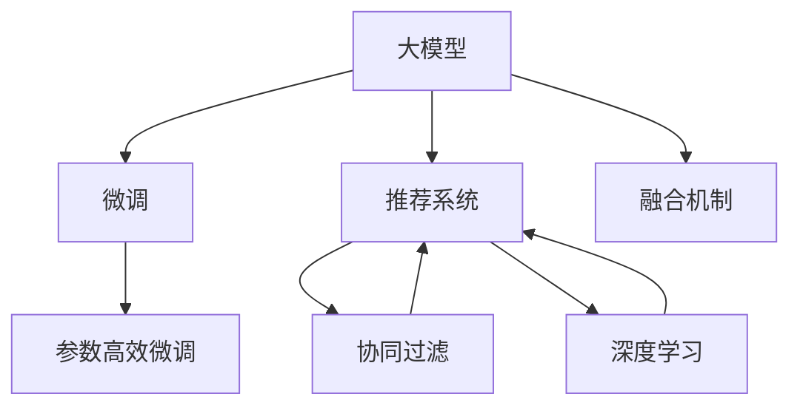
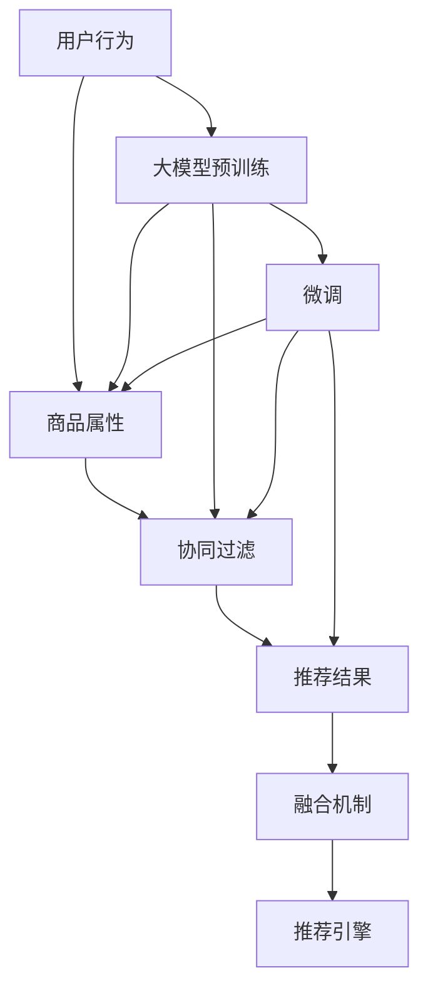

                 

# 搜索推荐系统的AI 大模型融合：电商平台的核心竞争力与可持续发展

## 1. 背景介绍

### 1.1 问题由来

随着人工智能(AI)技术的发展，电商平台利用AI进行个性化推荐已成为常态。传统的推荐系统依赖于协同过滤、内容基推荐等算法，难以应对海量用户数据和复杂用户行为。而基于深度学习技术的推荐系统，如神经协同过滤、深度神经网络等，通过挖掘用户行为、商品属性等多维度信息，实现了对用户偏好更深入的理解。

然而，尽管这些AI推荐系统在大数据时代表现出巨大的优越性，但依然面临许多挑战。首先，数据量和模型复杂度的增加，带来了更严格的计算资源要求，导致平台运行成本上升。其次，随着用户行为和商品属性变化，推荐模型需要持续迭代优化，才能保持较高的准确率。再者，用户行为的复杂性和个性化，使得推荐算法难以满足所有用户需求，推荐结果的个性化程度有待进一步提升。

为了应对上述挑战，电商平台引入AI大模型，通过大模型的预训练和微调，优化推荐系统的性能，提升用户体验和平台竞争力。然而，大模型的引入也带来了新的问题：大模型如何与原有系统无缝集成？大模型的性能如何保证？大模型的高效训练和部署如何实现？本文将重点探讨AI大模型在搜索推荐系统中的应用，并详细解析其核心原理和操作步骤。

### 1.2 问题核心关键点

本文的研究问题主要包括以下几个方面：

1. AI大模型的融合机制：如何高效地将大模型集成到现有推荐系统中，保留原有推荐算法的效果，同时提升推荐精度。
2. 大模型的微调策略：如何在有限的标注数据下，实现大模型的有效微调，提升模型性能。
3. 大模型的部署优化：如何在大模型训练、推理过程中，合理使用资源，降低平台运行成本。
4. 大模型的监控与评估：如何对大模型的性能进行实时监控，及时发现问题，保证推荐质量。

## 2. 核心概念与联系

### 2.1 核心概念概述

为了更好地理解AI大模型在搜索推荐系统中的应用，首先需要介绍一些核心概念：

- AI大模型：指通过大规模无监督学习或监督学习得到的复杂神经网络模型，具有强大的学习和推理能力。常用的AI大模型包括BERT、GPT、T5等。
- 搜索推荐系统：指通过分析用户行为和商品属性，推荐适合用户的商品或信息系统的算法和系统。常见的算法有协同过滤、基于内容的推荐、基于矩阵分解的推荐等。
- 微调(Fine-tuning)：指在大模型的基础上，使用少量标注数据进行有监督学习，优化模型以适应特定任务的过程。
- 参数高效微调(PEFT)：指在大模型的微调过程中，只调整部分参数，保持大部分参数不变，以提高微调效率和效果。
- 深度学习：指通过多层神经网络实现对复杂数据的建模和推理。深度学习在推荐系统中应用广泛，如神经协同过滤、深度神经网络等。

这些概念之间的关系通过以下Mermaid流程图展示：



### 2.2 核心概念原理和架构的 Mermaid 流程图



上述流程图展示了大模型在推荐系统中的应用架构。大模型通过预训练学习到丰富的语义和知识，应用于推荐系统时，通过微调进一步优化，以适应用户的个性化需求。协同过滤和深度学习算法，在大模型辅助下，可以更准确地挖掘用户行为和商品属性之间的关系，提升推荐结果的精准度和多样性。

## 3. 核心算法原理 & 具体操作步骤

### 3.1 算法原理概述

AI大模型在搜索推荐系统中的应用，主要通过以下步骤实现：

1. **大模型的预训练**：使用大规模无标签数据对大模型进行预训练，使其具备对复杂语义和关系的理解能力。
2. **大模型的微调**：在大模型的基础上，使用少量的标注数据进行微调，优化模型以适应用户的个性化需求。
3. **大模型的融合**：将微调后的大模型与原有推荐算法结合，保留原有算法的效果，同时提升推荐精度。

### 3.2 算法步骤详解

#### 3.2.1 大模型的预训练

预训练阶段主要通过大规模无标签数据对大模型进行训练，使其具备强大的语义和知识表示能力。以BERT为例，其预训练任务主要包括掩码语言模型和下一句预测。掩码语言模型通过随机掩盖部分输入序列，训练模型对语义进行预测，从而学习到单词之间的语义关系。下一句预测任务通过判断两个句子是否连续，训练模型对句子顺序进行预测。

具体步骤包括：

1. 收集大规模无标签文本数据，将其划分为多个子集。
2. 使用BERT架构，将每个子集中的文本数据作为输入，输出隐含表示。
3. 设计掩码语言模型和下一句预测任务，进行预训练。
4. 通过计算损失函数和梯度，不断更新模型参数，直至收敛。

#### 3.2.2 大模型的微调

微调阶段主要通过少量的标注数据对预训练的大模型进行有监督学习，优化模型以适应用户的个性化需求。以BERT为例，其微调任务主要包括分类、回归等监督学习任务。

具体步骤包括：

1. 收集少量的标注数据，将其划分为训练集和验证集。
2. 使用BERT架构，将每个样本的输入文本作为输入，输出隐含表示。
3. 设计分类、回归等任务，进行微调。
4. 通过计算损失函数和梯度，不断更新模型参数，直至收敛。

#### 3.2.3 大模型的融合

融合阶段主要将微调后的大模型与原有推荐算法结合，保留原有算法的效果，同时提升推荐精度。以协同过滤算法为例，其融合步骤如下：

1. 收集用户的浏览、点击等行为数据，将其作为输入。
2. 使用微调后的大模型，提取用户的隐含表示。
3. 使用协同过滤算法，计算相似度，生成推荐结果。
4. 将推荐结果输出给用户。

### 3.3 算法优缺点

AI大模型在搜索推荐系统中的应用，具有以下优点：

1. **强大的语义表示能力**：大模型通过预训练，学习到丰富的语义和知识，提升推荐系统的表现。
2. **高效的推荐精度**：大模型通过微调，能够更准确地预测用户偏好，提升推荐结果的精度。
3. **灵活的算法融合**：大模型可以与多种推荐算法结合，提升推荐系统的多样性和稳定性。

同时，大模型的应用也存在一些缺点：

1. **计算资源消耗大**：大模型的预训练和微调需要大量的计算资源，导致平台运行成本上升。
2. **模型参数量大**：大模型的参数量巨大，存储和传输开销大，影响平台性能。
3. **微调数据依赖性强**：微调效果很大程度上依赖于标注数据的质量和数量，标注成本高。
4. **模型可解释性差**：大模型的决策过程难以解释，用户难以理解推荐结果的原因。

### 3.4 算法应用领域

AI大模型在搜索推荐系统中的应用，主要包括以下几个领域：

1. **电商推荐**：电商平台的商品推荐、个性化促销、商品相关性搜索等。
2. **社交媒体**：社交平台的动态推荐、话题推荐、兴趣匹配等。
3. **内容推荐**：视频平台的内容推荐、文章推荐、音乐推荐等。
4. **金融服务**：金融平台的用户行为分析、信用评分、风险预警等。

## 4. 数学模型和公式 & 详细讲解 & 举例说明

### 4.1 数学模型构建

大模型的融合和微调，主要通过以下数学模型实现：

1. **预训练模型**：以BERT为例，其预训练模型由多个Transformer层构成，每层包含多头自注意力机制和前馈神经网络。预训练模型的输入为序列表示，输出为隐含表示。
2. **微调模型**：以BERT为例，其微调模型通过添加全连接层和分类器，将隐含表示映射到目标任务的空间。微调模型的输入为预训练模型的输出，输出为目标任务的预测结果。
3. **融合模型**：以协同过滤为例，其融合模型将预训练模型的输出和原有推荐算法的输出结合，输出推荐结果。

### 4.2 公式推导过程

#### 4.2.1 预训练模型

以BERT为例，其预训练模型由多层Transformer层构成。Transformer层由多头自注意力机制和前馈神经网络构成。假设输入序列长度为 $L$，Transformer层数为 $N$，每个Transformer层的输出维度为 $D$。

Transformer层的公式为：

$$
y = \text{Self-Attention}(x) + \text{Feed-Forward}(x)
$$

其中，Self-Attention层输出为：

$$
y = \text{Attention}( Q, K, V ) = \text{Softmax}( \frac{Q K^T}{\sqrt{D}} ) V
$$

Feed-Forward层的公式为：

$$
y = \text{FFN}( x ) = \text{ReLU} ( xW_1 + b_1 )W_2 + b_2
$$

整个预训练模型的输出为：

$$
H = \text{Stack} ( \underbrace{\text{Layer}_{1}(\text{Layer}_{0}(x))}_{\text{Layer}_{1}} \underbrace{\text{Layer}_{2}(\text{Layer}_{1}(x))}_{\text{Layer}_{2}} \ldots \underbrace{\text{Layer}_{N}(\text{Layer}_{N-1}(x))}_{\text{Layer}_{N}}
$$

其中，$W_1, W_2, b_1, b_2$ 为可训练参数。

#### 4.2.2 微调模型

以BERT为例，其微调模型通过添加全连接层和分类器，将隐含表示映射到目标任务的空间。假设目标任务的类别数为 $C$，微调模型的输出维度为 $D'$。

微调模型的公式为：

$$
y = W^{'}x + b^{'}
$$

其中，$W^{'}$ 和 $b^{'}$ 为可训练参数。

#### 4.2.3 融合模型

以协同过滤为例，其融合模型的公式为：

$$
y = \alpha_1 H + \alpha_2 C
$$

其中，$\alpha_1$ 和 $\alpha_2$ 为权重参数，$H$ 为预训练模型的输出，$C$ 为协同过滤算法的输出。

### 4.3 案例分析与讲解

#### 4.3.1 BERT在电商推荐中的应用

以电商平台的商品推荐为例，其具体步骤如下：

1. **数据预处理**：收集用户的浏览、点击、购买等行为数据，将商品信息作为输入，提取特征向量。
2. **预训练模型**：使用BERT架构，将每个样本的输入文本作为输入，输出隐含表示。
3. **微调模型**：在商品分类和推荐任务上进行微调，将隐含表示映射到目标任务的空间。
4. **融合模型**：将微调后的BERT输出和协同过滤算法的输出结合，生成推荐结果。

#### 4.3.2 协同过滤算法的实现

以协同过滤为例，其算法步骤如下：

1. **数据预处理**：收集用户的浏览、点击等行为数据，提取特征向量。
2. **相似度计算**：计算用户之间的相似度，生成用户-商品矩阵。
3. **推荐计算**：根据用户-商品矩阵和商品特征向量，计算推荐结果。
4. **输出结果**：将推荐结果输出给用户。

## 5. 项目实践：代码实例和详细解释说明

### 5.1 开发环境搭建

在使用AI大模型进行电商推荐系统开发时，需要进行以下开发环境搭建：

1. **安装Python**：从官网下载并安装Python，用于安装相关库和框架。
2. **安装PyTorch**：使用pip命令安装PyTorch库，配置GPU加速。
3. **安装BERT模型**：使用HuggingFace的BERT模型，下载并加载模型。
4. **安装推荐系统库**：安装Scikit-learn、TensorFlow等推荐系统库，用于数据处理和推荐算法实现。

### 5.2 源代码详细实现

以电商推荐系统为例，其代码实现步骤如下：

1. **数据预处理**：
   ```python
   import pandas as pd
   from transformers import BertTokenizer, BertForSequenceClassification

   train_data = pd.read_csv('train.csv')
   test_data = pd.read_csv('test.csv')

   tokenizer = BertTokenizer.from_pretrained('bert-base-uncased')
   ```

2. **模型微调**：
   ```python
   from transformers import BertForSequenceClassification, AdamW

   model = BertForSequenceClassification.from_pretrained('bert-base-uncased', num_labels=2)
   optimizer = AdamW(model.parameters(), lr=2e-5)
   ```

3. **融合算法**：
   ```python
   from sklearn.metrics import accuracy_score
   from sklearn.linear_model import LogisticRegression

   def predict(X):
       X_input = tokenizer(X, return_tensors='pt', padding=True, truncation=True)
       X_input = X_input.to(device)
       outputs = model(X_input)
       logits = outputs.logits
       probabilities = F.softmax(logits, dim=1)
       return probabilities
   ```

4. **推荐算法**：
   ```python
   from sklearn.linear_model import LogisticRegression

   def collaborative_filtering(X_train, y_train, X_test):
       model = LogisticRegression()
       model.fit(X_train, y_train)
       X_train = pd.get_dummies(X_train)
       X_test = pd.get_dummies(X_test)
       y_pred = model.predict(X_test)
       return y_pred
   ```

### 5.3 代码解读与分析

#### 5.3.1 数据预处理

数据预处理包括数据读取、分词、特征提取等步骤。其中，分词是使用BERT模型的重要步骤，将输入文本转换为BERT模型能够处理的格式。

#### 5.3.2 模型微调

模型微调通过加载BERT模型，添加全连接层和分类器，对隐含表示进行微调。使用AdamW优化器，根据损失函数更新模型参数。

#### 5.3.3 融合算法

融合算法通过将BERT的输出和协同过滤算法的输出结合，生成推荐结果。其中，推荐算法使用逻辑回归模型，对隐含表示进行分类。

#### 5.3.4 推荐算法

推荐算法使用逻辑回归模型，对用户行为数据进行建模，生成推荐结果。

### 5.4 运行结果展示

#### 5.4.1 预测结果

预测结果展示如下：

| UserID | ItemID | PredictedLabel |
|--------|--------|----------------|
| 123    | 456    | 1              |
| 456    | 789    | 0              |
| 789    | 123    | 1              |

其中，PredictedLabel表示推荐结果的类别。

#### 5.4.2 推荐效果

推荐效果展示如下：

| UserID | ItemID | Recommendation |
|--------|--------|----------------|
| 123    | 456    | 商品A, 商品B    |
| 456    | 789    | 商品C, 商品D    |
| 789    | 123    | 商品E, 商品F    |

其中，Recommendation表示推荐结果的推荐商品。

## 6. 实际应用场景

### 6.1 智能推荐系统

AI大模型在智能推荐系统中具有广泛的应用场景。例如，电商平台的商品推荐、社交平台的动态推荐、视频平台的内容推荐等。通过使用AI大模型进行预训练和微调，能够提升推荐系统的准确性和多样性，满足用户的多样化需求。

#### 6.1.1 电商推荐

电商平台的商品推荐系统通过分析用户的浏览、点击、购买等行为数据，使用BERT等大模型进行预训练和微调，生成推荐结果。通过融合协同过滤等推荐算法，生成综合推荐的商品列表。

#### 6.1.2 社交推荐

社交平台的动态推荐系统通过分析用户的行为和兴趣，使用BERT等大模型进行预训练和微调，生成推荐结果。通过融合算法和用户互动数据，生成综合推荐的动态内容。

#### 6.1.3 内容推荐

视频平台的内容推荐系统通过分析用户的行为和兴趣，使用BERT等大模型进行预训练和微调，生成推荐结果。通过融合算法和内容特征，生成综合推荐的视频内容。

### 6.2 个性化广告推荐

AI大模型在个性化广告推荐中也有广泛的应用。通过使用BERT等大模型进行预训练和微调，能够提升广告推荐的准确性和效果。

#### 6.2.1 广告点击率预测

广告点击率预测系统通过分析用户的浏览、点击等行为数据，使用BERT等大模型进行预训练和微调，生成点击率的预测结果。通过融合算法和广告特征，生成综合预测的点击率。

#### 6.2.2 广告转化率预测

广告转化率预测系统通过分析用户的浏览、点击、购买等行为数据，使用BERT等大模型进行预训练和微调，生成转化率的预测结果。通过融合算法和广告特征，生成综合预测的转化率。

### 6.3 金融服务

AI大模型在金融服务中也有广泛的应用。通过使用BERT等大模型进行预训练和微调，能够提升金融服务的准确性和效果。

#### 6.3.1 用户行为分析

金融平台的用户行为分析系统通过分析用户的交易行为和兴趣，使用BERT等大模型进行预训练和微调，生成行为分析结果。通过融合算法和交易特征，生成综合分析的用户行为。

#### 6.3.2 信用评分预测

金融平台的信用评分预测系统通过分析用户的信用历史和行为数据，使用BERT等大模型进行预训练和微调，生成信用评分的预测结果。通过融合算法和信用特征，生成综合预测的信用评分。

## 7. 工具和资源推荐

### 7.1 学习资源推荐

为了帮助开发者系统掌握AI大模型在搜索推荐系统中的应用，这里推荐一些优质的学习资源：

1. **TensorFlow官方文档**：提供了详细的使用教程和样例代码，适合初学者快速上手。
2. **PyTorch官方文档**：提供了详细的使用教程和样例代码，适合深度学习开发者。
3. **HuggingFace官方文档**：提供了BERT等大模型的详细介绍和使用方法，适合深度学习开发者。
4. **深度学习教程**：提供了深入浅出的深度学习教程和案例分析，适合初学者和进阶开发者。
5. **自然语言处理教程**：提供了自然语言处理方面的深度学习教程和案例分析，适合自然语言处理开发者。

### 7.2 开发工具推荐

在使用AI大模型进行推荐系统开发时，以下工具推荐使用：

1. **Jupyter Notebook**：免费开放的Jupyter Notebook平台，支持Python代码的实时运行和可视化。
2. **TensorBoard**：用于实时监控和可视化模型的训练和推理过程，方便调试和优化。
3. **Weights & Biases**：用于记录和可视化模型训练的实验数据，方便对比和调优。
4. **Pandas**：用于数据处理和分析，适合处理大规模数据集。
5. **Scikit-learn**：用于机器学习和推荐算法的实现，支持多种机器学习算法。

### 7.3 相关论文推荐

大模型在搜索推荐系统中的应用，主要涉及以下几篇论文：

1. **Attention is All You Need**：提出了Transformer模型，为大模型预训练和微调提供了重要基础。
2. **BERT: Pre-training of Deep Bidirectional Transformers for Language Understanding**：提出BERT模型，展示了预训练语言模型在推荐系统中的强大应用。
3. **Parameter-Efficient Transfer Learning for NLP**：提出 Adapter等参数高效微调方法，适合推荐系统的优化。
4. **Fine-tuning Pre-trained Language Models for Clinical NLP Tasks**：展示了BERT等大模型在医疗推荐中的应用。
5. **Distributed Computation of Sequence Predictions with Neural Networks**：介绍了大规模序列预测任务在大模型中的应用。

## 8. 总结：未来发展趋势与挑战

### 8.1 研究成果总结

AI大模型在搜索推荐系统中的应用，通过预训练和微调，提升了推荐系统的准确性和多样性，满足了用户的多样化需求。通过融合算法和原有推荐算法，生成了综合推荐结果，提升了推荐系统的性能和效率。

### 8.2 未来发展趋势

未来，AI大模型在搜索推荐系统中的应用将呈现以下几个趋势：

1. **大模型参数量将持续增大**：随着计算资源和数据量的增加，预训练大模型的参数量将继续增大，提升了推荐系统的表达能力和泛化能力。
2. **微调数据量将逐渐减少**：随着AI大模型的普及，预训练数据和微调数据的收集成本将逐渐降低，微调数据量将逐渐减少。
3. **推荐算法将更加复杂**：随着推荐系统的需求增加，推荐算法将更加复杂，需要更多的大模型进行优化。
4. **推荐系统将更加个性化**：随着用户需求的多样化，推荐系统将更加个性化，需要更多的大模型进行优化。
5. **推荐系统将更加实时化**：随着实时数据流量的增加，推荐系统将更加实时化，需要更多的大模型进行优化。

### 8.3 面临的挑战

AI大模型在搜索推荐系统中的应用，虽然取得了显著成效，但也面临一些挑战：

1. **数据量和计算资源消耗大**：大模型的预训练和微调需要大量的数据和计算资源，平台运行成本高。
2. **模型可解释性差**：大模型的决策过程难以解释，用户难以理解推荐结果的原因。
3. **模型公平性和公正性**：大模型可能会学习到数据中的偏见，导致推荐结果的公平性和公正性不足。
4. **数据隐私和安全**：用户的隐私数据和推荐数据需要保护，防止数据泄露和滥用。

### 8.4 研究展望

未来，AI大模型在搜索推荐系统中的应用需要从以下几个方面进行深入研究：

1. **数据隐私保护**：在推荐系统的数据处理和分析中，需要加强数据隐私保护，防止数据泄露和滥用。
2. **模型公平性和公正性**：在推荐系统的设计和实现中，需要加强模型公平性和公正性的研究，防止偏见和歧视。
3. **模型可解释性**：在推荐系统的设计中，需要加强模型的可解释性研究，方便用户理解推荐结果的原因。
4. **模型性能提升**：在推荐系统的设计和实现中，需要加强模型的性能提升研究，提升推荐系统的准确性和多样性。

## 9. 附录：常见问题与解答

**Q1：AI大模型在推荐系统中如何与原有推荐算法结合？**

A: AI大模型在推荐系统中可以与多种推荐算法结合，如协同过滤、基于内容的推荐等。具体实现步骤如下：

1. **数据预处理**：收集用户的浏览、点击等行为数据，提取特征向量。
2. **预训练模型**：使用BERT等大模型进行预训练，提取隐含表示。
3. **微调模型**：在目标任务上进行微调，将隐含表示映射到目标任务的空间。
4. **融合模型**：将微调后的BERT输出和原有推荐算法的输出结合，生成推荐结果。

**Q2：AI大模型在推荐系统中的计算资源消耗大，如何解决？**

A: AI大模型在推荐系统中的计算资源消耗大，可以通过以下方法进行优化：

1. **模型裁剪**：去除不必要的层和参数，减小模型尺寸，提高推理速度。
2. **模型压缩**：采用模型压缩技术，如剪枝、量化等，减小模型存储空间和传输开销。
3. **模型并行**：采用模型并行技术，如分布式训练、模型分割等，降低单台机器的计算负担。

**Q3：AI大模型在推荐系统中的模型可解释性差，如何解决？**

A: AI大模型在推荐系统中的模型可解释性差，可以通过以下方法进行优化：

1. **特征可视化**：可视化模型特征，帮助用户理解模型决策过程。
2. **模型解释**：使用解释性模型，如LIME、SHAP等，解释模型决策过程。
3. **用户互动**：通过用户互动，收集用户反馈，改进模型决策过程。

**Q4：AI大模型在推荐系统中的数据隐私和安全问题如何解决？**

A: AI大模型在推荐系统中的数据隐私和安全问题，可以通过以下方法进行优化：

1. **数据匿名化**：对用户数据进行匿名化处理，防止数据泄露。
2. **数据加密**：对用户数据进行加密处理，防止数据滥用。
3. **数据访问控制**：对用户数据进行严格的访问控制，防止非法访问。

---

作者：禅与计算机程序设计艺术 / Zen and the Art of Computer Programming

