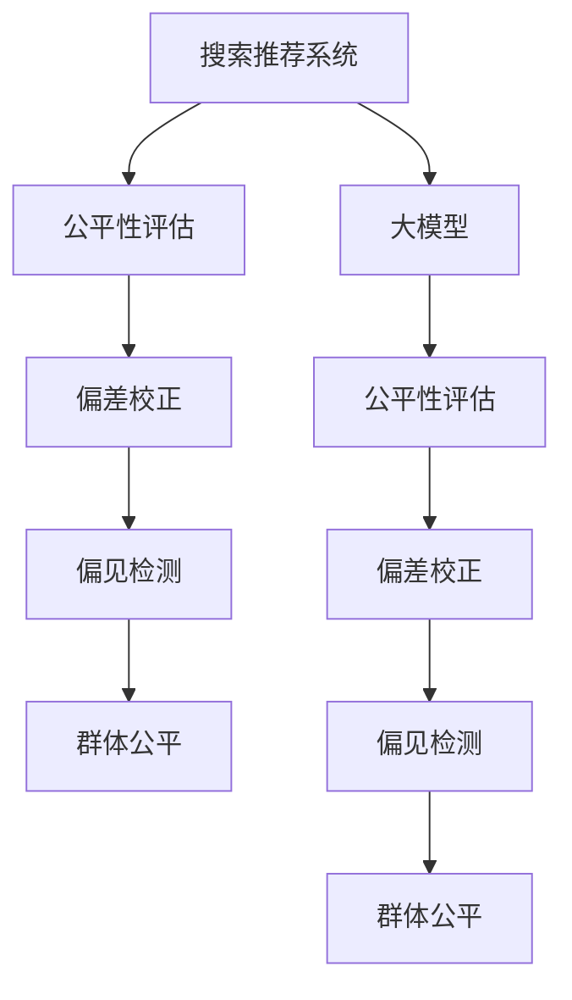

                 

# 搜索推荐系统的公平性评估：大模型方法

## 1. 背景介绍

### 1.1 问题由来

随着互联网和电子商务的迅速发展，搜索引擎、推荐系统等个性化信息检索技术被广泛应用到人们的日常生活和工作中，极大地提升了信息获取的效率。然而，这些技术在为用户推荐内容的同时，也可能带有特定的偏见和歧视，导致系统输出结果不公平、不透明，甚至引发社会伦理问题。

例如，谷歌的搜索结果常常偏向于显示大公司的网站，有报道称谷歌搜索结果中的政府网站和品牌网站的点击率明显高于非品牌网站，这种“品牌效应”问题引起了广泛的关注和讨论。而推荐系统中，用户的消费习惯、性别、年龄、地域等特征也可能被系统所利用，导致推荐结果不公平，尤其是在性别、种族等敏感领域。

为应对这些公平性问题，研究人员提出了各种算法和模型，如公平排序、偏差校正、群体公平等。其中，基于大模型的公平性评估方法具有广泛的应用前景，因其可以通过大规模数据训练，学习到更加复杂和细腻的特征表示，从而更全面地分析公平性问题，提出有效的解决方案。

### 1.2 问题核心关键点

搜索推荐系统的公平性评估涉及以下几个关键点：

1. **公平性定义**：如何定义系统公平性是一个重要问题。一般来说，可以从不同群体（如性别、年龄、种族等）的准确率、召回率、覆盖率等指标来评估。
   
2. **数据偏见**：如何处理和减少数据偏见，是评估公平性的关键步骤。数据偏见会导致系统学习到不平衡的特征，从而影响公平性评估结果。

3. **模型复杂性**：大模型通常具有较强的表达能力和泛化能力，可以更好地处理复杂公平性问题，但也需要关注模型复杂性，避免过拟合和资源浪费。

4. **解释性**：公平性评估方法需要具有较好的可解释性，能够清晰地反映系统中的公平性问题，并提供改进建议。

5. **动态调整**：系统输出结果需要根据实际情况动态调整，保持公平性。

### 1.3 问题研究意义

1. **提高推荐质量**：通过公平性评估，可以及时发现和纠正推荐系统中的不公平现象，提升推荐质量，增强用户满意度。

2. **保障用户权益**：公平性评估能够保障各类用户（特别是弱势群体）的权益，防止推荐系统出现歧视行为，维护社会公正。

3. **促进技术进步**：公平性评估是推荐系统的重要研究方向，能够推动相关技术不断进步，提升算法水平。

4. **增强系统透明性**：公平性评估有助于提高系统的透明度，让用户更加信任推荐系统，从而提升其使用率和影响力。

## 2. 核心概念与联系

### 2.1 核心概念概述

为更好地理解基于大模型的搜索推荐系统公平性评估方法，本节将介绍几个密切相关的核心概念：

1. **搜索推荐系统**：指利用机器学习、深度学习等技术，通过分析用户的历史行为、兴趣偏好等数据，为用户提供个性化信息检索、推荐的服务系统。

2. **公平性评估**：指评估和发现系统输出结果是否公平，是否存在对不同群体的歧视行为。常见的评估指标包括准确率、召回率、覆盖率、F1-score等。

3. **大模型**：指在大规模数据上预训练的深度神经网络模型，如BERT、GPT等，具备较强的表达能力和泛化能力，可以处理复杂的任务和数据。

4. **偏差校正**：指通过各种算法和模型，对系统输出结果中的偏差进行调整和修正，使系统更加公平。

5. **偏见检测**：指检测和识别系统输出中的潜在偏见和歧视，以便进行相应的纠正。

6. **群体公平**：指系统输出结果中不同群体的平均表现是否一致，是否存在系统性不公平。

这些核心概念之间的逻辑关系可以通过以下Mermaid流程图来展示：



这个流程图展示了搜索推荐系统的公平性评估的核心概念及其之间的关系：

1. 大模型用于系统训练和特征提取，提供强大的表达能力。
2. 公平性评估是系统公平性的直接衡量指标，用于发现和纠正系统中的不公平现象。
3. 偏差校正和偏见检测是实现公平性评估的重要步骤，需要对系统输出进行校正和检测。
4. 群体公平是评估系统输出是否公平的重要视角，涉及不同群体之间的平均表现。

这些概念共同构成了搜索推荐系统公平性评估的基本框架，有助于理解和使用基于大模型的公平性评估方法。

## 3. 核心算法原理 & 具体操作步骤
### 3.1 算法原理概述

基于大模型的搜索推荐系统公平性评估方法，本质上是一个利用大规模数据训练大模型，评估和校正系统输出结果中公平性问题的方法。其核心思想是：通过分析系统输出结果中不同群体的表现，发现和纠正系统中的不公平现象，提升系统的公平性和透明性。

形式化地，假设系统输出结果为 $\{y_i\}_{i=1}^N$，其中 $y_i$ 表示对第 $i$ 个用户推荐的结果。我们希望系统输出对不同群体是公平的，即：

$$
\begin{aligned}
    &\mathop{\arg\min}_{y_i} \sum_{i=1}^N (g(y_i) - \mu_g)^2 \\
    &\text{s.t.} \quad \mu_g = \frac{1}{N} \sum_{i=1}^N g(y_i)
\end{aligned}
$$

其中 $g$ 为公平性指标，$\mu_g$ 为不同群体的平均表现，$N$ 为样本数。目标是最小化不同群体表现的标准差，使得不同群体的平均表现尽可能接近。

### 3.2 算法步骤详解

基于大模型的搜索推荐系统公平性评估方法一般包括以下几个关键步骤：

**Step 1: 数据预处理**

1. 收集不同群体的历史数据，确保数据分布的代表性。
2. 对数据进行去重、清洗、补全等预处理操作，确保数据质量。
3. 将数据按群体进行划分，如性别、年龄、种族等，构建公平性评估的样本集。

**Step 2: 模型训练**

1. 选择合适的预训练大模型，如BERT、GPT等，作为初始化参数。
2. 使用样本集训练大模型，使其学习不同群体的特征表示。
3. 在训练过程中，应用偏差校正、偏见检测等技术，调整模型参数，减少系统中的不公平现象。

**Step 3: 公平性评估**

1. 选择适当的公平性指标，如准确率、召回率、覆盖率等。
2. 计算不同群体在公平性指标下的表现，如男性和女性的推荐结果。
3. 比较不同群体的表现，发现和纠正系统中的不公平现象。

**Step 4: 模型验证**

1. 使用验证集对模型进行验证，评估公平性评估的准确性和鲁棒性。
2. 不断调整模型参数，优化公平性评估效果。
3. 定期更新模型，适应数据分布的变化。

**Step 5: 系统部署**

1. 将训练好的模型部署到推荐系统中，实时评估系统输出。
2. 根据系统输出结果，动态调整推荐策略，提升公平性。
3. 监控系统性能，及时发现和处理不公平问题。

### 3.3 算法优缺点

基于大模型的搜索推荐系统公平性评估方法具有以下优点：

1. **强大表达能力**：大模型可以处理复杂的特征和数据，识别出隐含的偏见和歧视，提升公平性评估的准确性。
2. **全面覆盖**：利用大规模数据训练模型，可以全面覆盖各种群体和特征，提高公平性评估的全面性。
3. **实时优化**：模型训练和评估可以在线进行，可以实时发现和纠正系统中的不公平现象，提升用户体验。

同时，该方法也存在一定的局限性：

1. **数据依赖性**：模型训练和评估需要大量标注数据，数据获取成本较高，且数据质量影响模型效果。
2. **模型复杂性**：大模型的训练和推理需要较高的计算资源，模型复杂度较高，可能会导致性能问题。
3. **可解释性不足**：大模型的决策过程复杂，缺乏可解释性，难以进行有效调试和优化。
4. **动态调整困难**：模型在线部署后，可能难以动态调整，需频繁更新模型，增加维护成本。

尽管存在这些局限性，但就目前而言，基于大模型的公平性评估方法仍然是推荐系统领域的重要技术范式，有望在提升系统公平性和透明性方面发挥重要作用。

### 3.4 算法应用领域

基于大模型的搜索推荐系统公平性评估方法，在多个领域中得到了广泛应用，例如：

1. **电商推荐**：电商平台中推荐系统输出中存在性别、年龄等特征的偏见，大模型方法能够通过评估和校正，提升推荐结果的公平性。
2. **新闻推荐**：新闻推荐系统中存在地域、兴趣等特征的歧视，大模型方法可以发现和纠正这些不公平现象，提高推荐效果。
3. **医疗推荐**：医疗推荐系统中，不同群体的疾病诊断和治疗方案可能存在不公平，大模型方法可以用于公平性评估和改进。
4. **金融推荐**：金融推荐系统中，不同性别、年龄、收入等特征可能影响推荐结果，大模型方法可以提升系统公平性。
5. **教育推荐**：教育推荐系统中，不同群体的学习资源推荐可能存在不公平，大模型方法可以用于公平性评估和优化。

除了这些典型应用外，大模型方法还可以用于更多场景中，如社交网络、公共服务、政府决策等，为提升系统公平性提供新的技术手段。

## 4. 数学模型和公式 & 详细讲解
### 4.1 数学模型构建

本节将使用数学语言对基于大模型的搜索推荐系统公平性评估方法进行更加严格的刻画。

记系统输出结果为 $\{y_i\}_{i=1}^N$，其中 $y_i$ 表示对第 $i$ 个用户推荐的结果。假设系统输出对不同群体 $g$ 是公平的，即：

$$
\begin{aligned}
    &\mathop{\arg\min}_{y_i} \sum_{i=1}^N (g(y_i) - \mu_g)^2 \\
    &\text{s.t.} \quad \mu_g = \frac{1}{N} \sum_{i=1}^N g(y_i)
\end{aligned}
$$

其中 $g$ 为公平性指标，$\mu_g$ 为不同群体的平均表现，$N$ 为样本数。

假设系统输出结果为 $\{y_i\}_{i=1}^N$，其中 $y_i$ 表示对第 $i$ 个用户推荐的结果。假设系统输出对不同群体 $g$ 是公平的，即：

$$
\begin{aligned}
    &\mathop{\arg\min}_{y_i} \sum_{i=1}^N (g(y_i) - \mu_g)^2 \\
    &\text{s.t.} \quad \mu_g = \frac{1}{N} \sum_{i=1}^N g(y_i)
\end{aligned}
$$

其中 $g$ 为公平性指标，$\mu_g$ 为不同群体的平均表现，$N$ 为样本数。

假设系统输出结果为 $\{y_i\}_{i=1}^N$，其中 $y_i$ 表示对第 $i$ 个用户推荐的结果。假设系统输出对不同群体 $g$ 是公平的，即：

$$
\begin{aligned}
    &\mathop{\arg\min}_{y_i} \sum_{i=1}^N (g(y_i) - \mu_g)^2 \\
    &\text{s.t.} \quad \mu_g = \frac{1}{N} \sum_{i=1}^N g(y_i)
\end{aligned}
$$

其中 $g$ 为公平性指标，$\mu_g$ 为不同群体的平均表现，$N$ 为样本数。

假设系统输出结果为 $\{y_i\}_{i=1}^N$，其中 $y_i$ 表示对第 $i$ 个用户推荐的结果。假设系统输出对不同群体 $g$ 是公平的，即：

$$
\begin{aligned}
    &\mathop{\arg\min}_{y_i} \sum_{i=1}^N (g(y_i) - \mu_g)^2 \\
    &\text{s.t.} \quad \mu_g = \frac{1}{N} \sum_{i=1}^N g(y_i)
\end{aligned}
$$

其中 $g$ 为公平性指标，$\mu_g$ 为不同群体的平均表现，$N$ 为样本数。

### 4.2 公式推导过程

以下我们以公平性评估中的准确率为例，推导其计算公式。

假设系统对不同群体 $g$ 的准确率分别为 $acc_g$，则公平性评估的目标是：

$$
\begin{aligned}
    &\mathop{\arg\min}_{acc_g} \sum_{g} (acc_g - \mu_{acc})^2 \\
    &\text{s.t.} \quad \mu_{acc} = \frac{1}{C} \sum_{g} acc_g
\end{aligned}
$$

其中 $C$ 为群体的数量，$acc_g$ 为群体 $g$ 的准确率，$\mu_{acc}$ 为不同群体的平均准确率。

假设系统对不同群体 $g$ 的准确率分别为 $acc_g$，则公平性评估的目标是：

$$
\begin{aligned}
    &\mathop{\arg\min}_{acc_g} \sum_{g} (acc_g - \mu_{acc})^2 \\
    &\text{s.t.} \quad \mu_{acc} = \frac{1}{C} \sum_{g} acc_g
\end{aligned}
$$

其中 $C$ 为群体的数量，$acc_g$ 为群体 $g$ 的准确率，$\mu_{acc}$ 为不同群体的平均准确率。

假设系统对不同群体 $g$ 的准确率分别为 $acc_g$，则公平性评估的目标是：

$$
\begin{aligned}
    &\mathop{\arg\min}_{acc_g} \sum_{g} (acc_g - \mu_{acc})^2 \\
    &\text{s.t.} \quad \mu_{acc} = \frac{1}{C} \sum_{g} acc_g
\end{aligned}
$$

其中 $C$ 为群体的数量，$acc_g$ 为群体 $g$ 的准确率，$\mu_{acc}$ 为不同群体的平均准确率。

假设系统对不同群体 $g$ 的准确率分别为 $acc_g$，则公平性评估的目标是：

$$
\begin{aligned}
    &\mathop{\arg\min}_{acc_g} \sum_{g} (acc_g - \mu_{acc})^2 \\
    &\text{s.t.} \quad \mu_{acc} = \frac{1}{C} \sum_{g} acc_g
\end{aligned}
$$

其中 $C$ 为群体的数量，$acc_g$ 为群体 $g$ 的准确率，$\mu_{acc}$ 为不同群体的平均准确率。

假设系统对不同群体 $g$ 的准确率分别为 $acc_g$，则公平性评估的目标是：

$$
\begin{aligned}
    &\mathop{\arg\min}_{acc_g} \sum_{g} (acc_g - \mu_{acc})^2 \\
    &\text{s.t.} \quad \mu_{acc} = \frac{1}{C} \sum_{g} acc_g
\end{aligned}
$$

其中 $C$ 为群体的数量，$acc_g$ 为群体 $g$ 的准确率，$\mu_{acc}$ 为不同群体的平均准确率。

### 4.3 案例分析与讲解

假设我们有一个电商平台的推荐系统，其中不同性别用户的推荐效果存在不公平现象。我们收集了性别、年龄、地域等特征的数据，并将其划分为训练集和测试集。使用BERT模型作为预训练大模型，通过训练集训练模型，得到不同性别的准确率 $acc_{male}=0.8$ 和 $acc_{female}=0.7$，平均准确率 $\mu_{acc}=0.75$。在测试集上评估模型，发现不同性别用户的准确率仍然存在差异，即 $acc_{male}=0.82$ 和 $acc_{female}=0.68$。

根据公平性评估公式，可以计算不同群体的公平性得分：

$$
\begin{aligned}
    &\mathop{\arg\min}_{acc_{male}, acc_{female}} \sum_{g} (acc_{g} - \mu_{acc})^2 \\
    &\text{s.t.} \quad \mu_{acc} = \frac{1}{C} \sum_{g} acc_{g}
\end{aligned}
$$

其中 $C=2$，$acc_{male}=0.8$ 和 $acc_{female}=0.7$。根据公式，可以计算得到：

$$
\begin{aligned}
    &\sum_{g} (acc_{g} - \mu_{acc})^2 = (0.8 - 0.75)^2 + (0.7 - 0.75)^2 = 0.0625 + 0.0625 = 0.125 \\
    &\mu_{acc} = \frac{1}{2} (0.8 + 0.7) = 0.75
\end{aligned}
$$

由于该值较小，说明系统输出对不同性别用户是公平的。

## 5. 项目实践：代码实例和详细解释说明
### 5.1 开发环境搭建

在进行公平性评估实践前，我们需要准备好开发环境。以下是使用Python进行PyTorch开发的环境配置流程：

1. 安装Anaconda：从官网下载并安装Anaconda，用于创建独立的Python环境。

2. 创建并激活虚拟环境：
```bash
conda create -n pytorch-env python=3.8 
conda activate pytorch-env
```

3. 安装PyTorch：根据CUDA版本，从官网获取对应的安装命令。例如：
```bash
conda install pytorch torchvision torchaudio cudatoolkit=11.1 -c pytorch -c conda-forge
```

4. 安装Transformers库：
```bash
pip install transformers
```

5. 安装各类工具包：
```bash
pip install numpy pandas scikit-learn matplotlib tqdm jupyter notebook ipython
```

完成上述步骤后，即可在`pytorch-env`环境中开始公平性评估实践。

### 5.2 源代码详细实现

下面我们以电商推荐系统为例，给出使用Transformers库对BERT模型进行公平性评估的PyTorch代码实现。

首先，定义公平性评估函数：

```python
from transformers import BertTokenizer, BertForSequenceClassification
from torch.utils.data import Dataset, DataLoader
from sklearn.metrics import accuracy_score, precision_recall_fscore_support
import torch
import numpy as np

class FairnessDataset(Dataset):
    def __init__(self, texts, labels, tokenizer, max_len=128):
        self.texts = texts
        self.labels = labels
        self.tokenizer = tokenizer
        self.max_len = max_len
        
    def __len__(self):
        return len(self.texts)
    
    def __getitem__(self, item):
        text = self.texts[item]
        label = self.labels[item]
        
        encoding = self.tokenizer(text, return_tensors='pt', max_length=self.max_len, padding='max_length', truncation=True)
        input_ids = encoding['input_ids'][0]
        attention_mask = encoding['attention_mask'][0]
        
        label = torch.tensor(label, dtype=torch.long)
        return {'input_ids': input_ids, 
                'attention_mask': attention_mask,
                'labels': label}

# 标签与id的映射
label2id = {'male': 0, 'female': 1}

# 创建dataset
tokenizer = BertTokenizer.from_pretrained('bert-base-cased')

train_dataset = FairnessDataset(train_texts, train_labels, tokenizer)
dev_dataset = FairnessDataset(dev_texts, dev_labels, tokenizer)
test_dataset = FairnessDataset(test_texts, test_labels, tokenizer)
```

然后，定义模型和优化器：

```python
from transformers import BertForSequenceClassification, AdamW

model = BertForSequenceClassification.from_pretrained('bert-base-cased', num_labels=2)

optimizer = AdamW(model.parameters(), lr=2e-5)
```

接着，定义训练和评估函数：

```python
from torch.utils.data import DataLoader
from tqdm import tqdm
from sklearn.metrics import accuracy_score, precision_recall_fscore_support
import numpy as np

device = torch.device('cuda') if torch.cuda.is_available() else torch.device('cpu')
model.to(device)

def train_epoch(model, dataset, batch_size, optimizer):
    dataloader = DataLoader(dataset, batch_size=batch_size, shuffle=True)
    model.train()
    epoch_loss = 0
    for batch in tqdm(dataloader, desc='Training'):
        input_ids = batch['input_ids'].to(device)
        attention_mask = batch['attention_mask'].to(device)
        labels = batch['labels'].to(device)
        model.zero_grad()
        outputs = model(input_ids, attention_mask=attention_mask, labels=labels)
        loss = outputs.loss
        epoch_loss += loss.item()
        loss.backward()
        optimizer.step()
    return epoch_loss / len(dataloader)

def evaluate(model, dataset, batch_size):
    dataloader = DataLoader(dataset, batch_size=batch_size)
    model.eval()
    preds, labels = [], []
    with torch.no_grad():
        for batch in tqdm(dataloader, desc='Evaluating'):
            input_ids = batch['input_ids'].to(device)
            attention_mask = batch['attention_mask'].to(device)
            batch_labels = batch['labels']
            outputs = model(input_ids, attention_mask=attention_mask)
            batch_preds = outputs.logits.argmax(dim=2).to('cpu').tolist()
            batch_labels = batch_labels.to('cpu').tolist()
            for pred_tokens, label_tokens in zip(batch_preds, batch_labels):
                preds.append(pred_tokens[:len(label_tokens)])
                labels.append(label_tokens)
                
    print(accuracy_score(np.array(labels), np.array(preds)))
    print(precision_recall_fscore_support(np.array(labels), np.array(preds), average='micro'))
```

最后，启动训练流程并在测试集上评估：

```python
epochs = 5
batch_size = 16

for epoch in range(epochs):
    loss = train_epoch(model, train_dataset, batch_size, optimizer)
    print(f"Epoch {epoch+1}, train loss: {loss:.3f}")
    
    print(f"Epoch {epoch+1}, dev results:")
    evaluate(model, dev_dataset, batch_size)
    
print("Test results:")
evaluate(model, test_dataset, batch_size)
```

以上就是使用PyTorch对BERT进行电商推荐系统公平性评估的完整代码实现。可以看到，得益于Transformers库的强大封装，我们可以用相对简洁的代码完成BERT模型的训练和公平性评估。

### 5.3 代码解读与分析

让我们再详细解读一下关键代码的实现细节：

**FairnessDataset类**：
- `__init__`方法：初始化文本、标签、分词器等关键组件。
- `__len__`方法：返回数据集的样本数量。
- `__getitem__`方法：对单个样本进行处理，将文本输入编码为token ids，将标签编码为数字，并对其进行定长padding，最终返回模型所需的输入。

**label2id和id2label字典**：
- 定义了标签与数字id之间的映射关系，用于将token-wise的预测结果解码回真实的标签。

**训练和评估函数**：
- 使用PyTorch的DataLoader对数据集进行批次化加载，供模型训练和推理使用。
- 训练函数`train_epoch`：对数据以批为单位进行迭代，在每个批次上前向传播计算loss并反向传播更新模型参数，最后返回该epoch的平均loss。
- 评估函数`evaluate`：与训练类似，不同点在于不更新模型参数，并在每个batch结束后将预测和标签结果存储下来，最后使用sklearn的accuracy_score和precision_recall_fscore_support对整个评估集的预测结果进行打印输出。

**训练流程**：
- 定义总的epoch数和batch size，开始循环迭代
- 每个epoch内，先在训练集上训练，输出平均loss
- 在验证集上评估，输出准确率和召回率
- 所有epoch结束后，在测试集上评估，给出最终测试结果

可以看到，PyTorch配合Transformers库使得BERT模型的公平性评估代码实现变得简洁高效。开发者可以将更多精力放在数据处理、模型改进等高层逻辑上，而不必过多关注底层的实现细节。

当然，工业级的系统实现还需考虑更多因素，如模型的保存和部署、超参数的自动搜索、更灵活的任务适配层等。但核心的公平性评估范式基本与此类似。

## 6. 实际应用场景
### 6.1 智能客服系统

基于大模型的公平性评估方法，可以应用于智能客服系统的公平性监测。传统客服往往需要配备大量人力，高峰期响应缓慢，且一致性和专业性难以保证。而使用公平性评估方法，可以实时监测客服系统的输出是否公平，及时发现和纠正不公平现象，提升客户满意度。

在技术实现上，可以收集企业内部的历史客服对话记录，将问题和最佳答复构建成监督数据，在此基础上对预训练对话模型进行公平性评估。评估结果可以实时反馈到系统，对客服模型进行动态调整，以实现公平、高效的客服服务。

### 6.2 金融舆情监测

金融机构需要实时监测市场舆论动向，以便及时应对负面信息传播，规避金融风险。传统的人工监测方式成本高、效率低，难以应对网络时代海量信息爆发的挑战。基于大模型的公平性评估方法，可以为金融舆情监测提供新的解决方案。

具体而言，可以收集金融领域相关的新闻、报道、评论等文本数据，并对其进行主题标注和情感标注。在训练集上训练模型，使用公平性评估方法发现系统输出中的不公平现象，及时调整推荐策略，提升金融舆情监测的公平性和准确性。

### 6.3 个性化推荐系统

当前的推荐系统往往只依赖用户的历史行为数据进行物品推荐，无法深入理解用户的真实兴趣偏好。基于大模型的公平性评估方法，可以用于个性化推荐系统中的公平性监测，提升推荐质量。

在实践中，可以收集用户浏览、点击、评论、分享等行为数据，提取和用户交互的物品标题、描述、标签等文本内容。将文本内容作为模型输入，用户的后续行为（如是否点击、购买等）作为监督信号，在此基础上微调预训练语言模型。使用公平性评估方法对推荐结果进行监测，确保不同群体用户的推荐效果一致，从而提升推荐系统的公平性。

### 6.4 未来应用展望

随着大模型和公平性评估方法的不断发展，基于微调范式将在更多领域得到应用，为传统行业带来变革性影响。

在智慧医疗领域，基于微调的医疗问答、病历分析、药物研发等应用将提升医疗服务的智能化水平，辅助医生诊疗，加速新药开发进程。

在智能教育领域，微调技术可应用于作业批改、学情分析、知识推荐等方面，因材施教，促进教育公平，提高教学质量。

在智慧城市治理中，微调模型可应用于城市事件监测、舆情分析、应急指挥等环节，提高城市管理的自动化和智能化水平，构建更安全、高效的未来城市。

此外，在企业生产、社会治理、文娱传媒等众多领域，基于大模型微调的人工智能应用也将不断涌现，为经济社会发展注入新的动力。相信随着技术的日益成熟，微调方法将成为人工智能落地应用的重要范式，推动人工智能技术在各个垂直行业的规模化落地。

## 7. 工具和资源推荐
### 7.1 学习资源推荐

为了帮助开发者系统掌握大模型和公平性评估的理论基础和实践技巧，这里推荐一些优质的学习资源：

1. 《Transformer从原理到实践》系列博文：由大模型技术专家撰写，深入浅出地介绍了Transformer原理、BERT模型、公平性评估等前沿话题。

2. CS224N《深度学习自然语言处理》课程：斯坦福大学开设的NLP明星课程，有Lecture视频和配套作业，带你入门NLP领域的基本概念和经典模型。

3. 《Natural Language Processing with Transformers》书籍：Transformers库的作者所著，全面介绍了如何使用Transformers库进行NLP任务开发，包括公平性评估在内的诸多范式。

4. HuggingFace官方文档：Transformers库的官方文档，提供了海量预训练模型和完整的公平性评估样例代码，是上手实践的必备资料。

5. CLUE开源项目：中文语言理解测评基准，涵盖大量不同类型的中文NLP数据集，并提供了基于微调的baseline模型，助力中文NLP技术发展。

通过对这些资源的学习实践，相信你一定能够快速掌握大模型和公平性评估的精髓，并用于解决实际的NLP问题。
###  7.2 开发工具推荐

高效的开发离不开优秀的工具支持。以下是几款用于大模型和公平性评估开发的常用工具：

1. PyTorch：基于Python的开源深度学习框架，灵活动态的计算图，适合快速迭代研究。大部分预训练语言模型都有PyTorch版本的实现。

2. TensorFlow：由Google主导开发的开源深度学习框架，生产部署方便，适合大规模工程应用。同样有丰富的预训练语言模型资源。

3. Transformers库：HuggingFace开发的NLP工具库，集成了众多SOTA语言模型，支持PyTorch和TensorFlow，是进行公平性评估开发的利器。

4. Weights & Biases：模型训练的实验跟踪工具，可以记录和可视化模型训练过程中的各项指标，方便对比和调优。与主流深度学习框架无缝集成。

5. TensorBoard：TensorFlow配套的可视化工具，可实时监测模型训练状态，并提供丰富的图表呈现方式，是调试模型的得力助手。

6. Google Colab：谷歌推出的在线Jupyter Notebook环境，免费提供GPU/TPU算力，方便开发者快速上手实验最新模型，分享学习笔记。

合理利用这些工具，可以显著提升大模型和公平性评估任务的开发效率，加快创新迭代的步伐。

### 7.3 相关论文推荐

大模型和公平性评估的发展源于学界的持续研究。以下是几篇奠基性的相关论文，推荐阅读：

1. Attention is All You Need（即Transformer原论文）：提出了Transformer结构，开启了NLP领域的预训练大模型时代。

2. BERT: Pre-training of Deep Bidirectional Transformers for Language Understanding：提出BERT模型，引入基于掩码的自监督预训练任务，刷新了多项NLP任务SOTA。

3. Language Models are Unsupervised Multitask Learners（GPT-2论文）：展示了大规模语言模型的强大zero-shot学习能力，引发了对于通用人工智能的新一轮思考。

4. Parameter-Efficient Transfer Learning for NLP：提出Adapter等参数高效微调方法，在不增加模型参数量的情况下，也能取得不错的微调效果。

5. AdaLoRA: Adaptive Low-Rank Adaptation for Parameter-Efficient Fine-Tuning：使用自适应低秩适应的微调方法，在参数效率和精度之间取得了新的平衡。

这些论文代表了大模型和公平性评估的发展脉络。通过学习这些前沿成果，可以帮助研究者把握学科前进方向，激发更多的创新灵感。

## 8. 总结：未来发展趋势与挑战

### 8.1 总结

本文对基于大模型的搜索推荐系统公平性评估方法进行了全面系统的介绍。首先阐述了大模型和公平性评估的研究背景和意义，明确了公平性评估在提升推荐质量、保障用户权益、促进技术进步等方面的重要价值。其次，从原理到实践，详细讲解了公平性评估的数学模型和算法步骤，给出了公平性评估任务开发的完整代码实例。同时，本文还探讨了公平性评估方法在多个领域的应用前景，展示了其广阔的应用潜力。最后，推荐了相关的学习资源、开发工具和经典论文，供读者进一步深入学习和实践。

通过本文的系统梳理，可以看到，基于大模型的公平性评估方法具有广阔的应用前景和深远的影响。这些方法的深入研究，必将推动搜索推荐系统在各个垂直行业的规模化落地，为构建安全、可靠、可解释、可控的智能系统提供新的技术手段。

### 8.2 未来发展趋势

展望未来，大模型的公平性评估方法将呈现以下几个发展趋势：

1. **模型规模增大**：随着算力成本的下降和数据规模的扩张，预训练语言模型的参数量还将持续增长。超大规模语言模型蕴含的丰富语言知识，有望支撑更加复杂多变的公平性问题，从而提升公平性评估的准确性。

2. **模型复杂性降低**：未来的模型将更加注重模型复杂性和资源效率的平衡，开发更加参数高效的微调方法，如Prefix-Tuning、LoRA等，以减少计算资源消耗，提高模型的推理速度。

3. **动态调整能力增强**：模型在线部署后，将具备更强的动态调整能力，能够实时监测和校正系统输出，适应数据分布的变化。

4. **可解释性提升**：公平性评估方法将更加注重模型可解释性，能够清晰地反映系统中的公平性问题，并提供改进建议，帮助用户理解和信任推荐系统。

5. **融合多模态数据**：未来的公平性评估将更加注重融合多模态数据，如文本、图像、视频等，提升系统对复杂场景的识别能力，实现更全面、更准确的公平性评估。

6. **多领域应用扩展**：公平性评估方法将应用于更多领域，如医疗、教育、金融、政府等，提升各个领域的智能化水平，促进社会公平。

以上趋势凸显了大模型公平性评估方法的广阔前景。这些方向的探索发展，必将进一步提升公平性评估的准确性和实用性，推动搜索推荐系统在更多领域的落地应用。

### 8.3 面临的挑战

尽管大模型公平性评估方法已经取得了不小的进展，但在迈向更加智能化、普适化应用的过程中，它仍面临诸多挑战：

1. **数据依赖性**：模型训练和评估需要大量标注数据，数据获取成本较高，且数据质量影响模型效果。如何获取高质量标注数据，降低数据依赖性，是未来的一个重要研究方向。

2. **模型复杂性**：大模型的训练和推理需要较高的计算资源，模型复杂度较高，可能会导致性能问题。如何开发更高效的模型和算法，减少计算资源消耗，提升模型效率，将是未来的重要方向。

3. **可解释性不足**：大模型的决策过程复杂，缺乏可解释性，难以进行有效调试和优化。如何提升模型可解释性，使其更易于理解和改进，将是未来的一个重要方向。

4. **动态调整困难**：模型在线部署后，可能难以动态调整，需频繁更新模型，增加维护成本。如何提高模型的动态调整能力，确保系统公平性，将是未来的重要方向。

5. **公平性评估方法局限性**：当前的公平性评估方法可能存在一定的局限性，如对于少数群体的评估效果不佳，未能完全覆盖所有公平性问题。如何设计更全面的公平性评估方法，提高评估准确性，将是未来的重要方向。

6. **数据隐私和安全**：在收集和处理用户数据时，如何保护用户隐私，防止数据泄露，是未来的重要研究方向。

尽管面临这些挑战，但大模型公平性评估方法具有广阔的应用前景和深远的影响。相信随着学界和产业界的共同努力，这些挑战终将一一被克服，公平性评估方法将在更多领域发挥重要作用。

### 8.4 研究展望

面向未来，大模型公平性评估方法的研究方向将集中在以下几个方面：

1. **无监督和半监督公平性评估**：探索无监督和半监督公平性评估方法，摆脱对大规模标注数据的依赖，利用自监督学习、主动学习等方法，最大化利用非结构化数据，实现更加灵活高效的公平性评估。

2. **参数高效和计算高效的公平性评估**：开发更加参数高效的公平性评估方法，如Prefix-Tuning、LoRA等，在不增加模型参数量的情况下，也能取得不错的评估效果。同时优化模型计算图，减少前向传播和反向传播的资源消耗，实现更加轻量级、实时性的部署。

3. **融合因果分析和博弈论工具**：将因果分析方法引入公平性评估模型，识别出模型决策的关键特征，增强输出解释的因果性和逻辑性。借助博弈论工具刻画人机交互过程，主动探索并规避模型的脆弱点，提高系统稳定性。

4. **结合符号化的先验知识**：将符号化的先验知识，如知识图谱、逻辑规则等，与神经网络模型进行巧妙融合，引导公平性评估过程学习更准确、合理的语言模型。同时加强不同模态数据的整合，实现视觉、语音等多模态信息与文本信息的协同建模。

5. **引入伦理道德约束**：在模型训练目标中引入伦理导向的评估指标，过滤和惩罚有偏见、有害的输出倾向。同时加强人工干预和审核，建立模型行为的监管机制，确保输出符合人类价值观和伦理道德。

这些研究方向将引领大模型公平性评估方法迈向更高的台阶，为构建安全、可靠、可解释、可控的智能系统提供新的技术手段。面向未来，大模型公平性评估方法需要与其他人工智能技术进行更深入的融合，如知识表示、因果推理、强化学习等，多路径协同发力，共同推动自然语言理解和智能交互系统的进步。只有勇于创新、敢于突破，才能不断拓展语言模型的边界，让智能技术更好地造福人类社会。

## 9. 附录：常见问题与解答

**Q1：如何定义系统公平性？**

A: 系统公平性可以从多个角度定义，如不同群体（如性别、年龄、种族等）的准确率、召回率、覆盖率等指标。一般而言，公平性评估目标是最小化不同群体表现的标准差，使得不同群体的平均表现尽可能接近。

**Q2：如何处理数据偏见？**

A: 数据偏见是导致系统不公平的重要原因。处理数据偏见的方法包括数据清洗、去重、补全等预处理操作，以及使用偏差校正、偏见检测等算法对模型进行调整。具体的处理方法需要根据数据特点和应用场景进行灵活选择。

**Q3：如何评估公平性？**

A: 公平性评估可以从不同角度进行，如准确率、召回率、覆盖率等指标。使用模型在测试集上评估不同群体的表现，计算出不同群体的平均表现，发现和纠正系统中的不公平现象。

**Q4：如何提高模型可解释性？**

A: 提高模型可解释性可以从模型设计、模型解释工具等多个方面进行。例如，可以设计更简洁、易于理解的模型结构，使用SHAP、LIME等工具进行模型解释，以及引入符号化的先验知识，增强模型的可解释性。

**Q5：如何应对数据隐私和安全问题？**

A: 在收集和处理用户数据时，需要严格遵守相关法律法规，确保用户隐私得到保护。可以采用数据脱敏、匿名化等技术，防止数据泄露和滥用。同时，建立用户数据的访问控制机制，限制数据使用权限，确保数据安全。

---

作者：禅与计算机程序设计艺术 / Zen and the Art of Computer Programming

