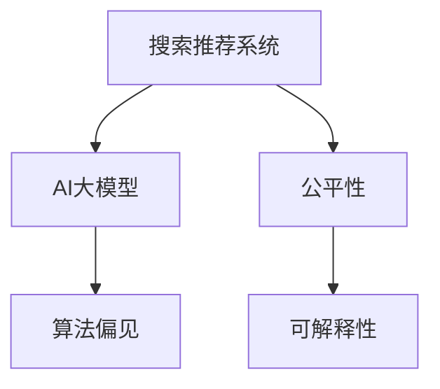

                 

# 搜索推荐系统的公平性：AI大模型的挑战与机遇

> 关键词：公平性,搜索推荐,大模型,算法偏见,可解释性

## 1. 背景介绍

### 1.1 问题由来
在数字化时代，搜索引擎和推荐系统已成为人们获取信息、发现商品的重要渠道。然而，随着AI大模型的广泛应用，搜索推荐系统带来的公平性问题也逐渐受到关注。

大数据、深度学习等技术的发展，使得搜索推荐系统能够更精准地匹配用户需求，但同时也可能加剧数据和算法的偏见，影响公平性和透明度。特别是在广告投放、贷款审批等高价值决策场景中，搜索推荐系统往往成为用户获得服务的重要入口，其偏见和歧视对用户的影响尤为显著。

如何在大模型和推荐算法中确保公平性，成为当前研究的一大热点。本文将从公平性问题入手，探讨AI大模型在搜索推荐系统中的应用挑战与机遇。

## 2. 核心概念与联系

### 2.1 核心概念概述

为更好地理解搜索推荐系统中公平性的问题，本节将介绍几个关键概念：

- 搜索推荐系统(Recommendation System)：基于用户行为、历史数据、兴趣偏好等信息，为每个用户推荐个性化内容的系统。常见的推荐方式包括协同过滤、基于内容的推荐、混合推荐等。
- 公平性(Fairness)：在算法决策过程中，确保所有用户都能获得公平对待，不受种族、性别、年龄、职业等因素的不公正影响。
- AI大模型(AI Large Model)：以Transformer等架构为基础，在大型语料库上进行预训练，具备强大的通用表示能力的深度学习模型。常用的大模型包括BERT、GPT-3、T5等。
- 算法偏见(Bias)：指算法在数据训练和应用过程中，因为训练数据、设计方式、实现细节等因素，导致模型对某些群体产生不公平的偏好或歧视。
- 可解释性(Explainability)：指算法决策过程的透明性和可理解性，便于用户、开发者和监管机构理解和信任算法结果。

这些概念之间的逻辑关系可以通过以下Mermaid流程图来展示：



这个流程图展示了一个搜索推荐系统中的核心概念及其关系：

1. 搜索推荐系统基于AI大模型进行推荐，模型的训练和推理过程可能受到算法偏见的影响。
2. 为了确保公平性，需要在算法设计中考虑多维度公平性指标，如消除性别、种族等特征的偏见。
3. 增强模型的可解释性，有助于发现和纠正算法偏见，提升公平性。

## 3. 核心算法原理 & 具体操作步骤
### 3.1 算法原理概述

在搜索推荐系统中，AI大模型通常用于预测用户对不同内容的评分、点击概率等，以此为依据进行个性化推荐。但在这个过程中，算法偏见可能导致某些群体的需求被忽视，造成公平性问题。

一般而言，搜索推荐系统的公平性问题可以分为：

- **个体公平**：即不同用户获得的服务质量是公平的，不因个人特征而有所差异。
- **群体公平**：即不同群体间获得的服务质量是公平的，不因群体特征而有所歧视。

公平性问题的解决，通常需要在模型训练、特征处理、算法设计等环节进行细致考量。本节将重点介绍几种解决公平性问题的技术方法。

### 3.2 算法步骤详解

**步骤1：数据预处理**
- 收集并清洗训练数据，确保数据的多样性和代表性。
- 特征工程中避免引入性别、种族等敏感特征，或者使用差分隐私技术，对敏感特征进行模糊处理。
- 使用分组训练数据，确保每个群体在模型训练中的代表性。

**步骤2：模型训练**
- 使用公平性约束的优化目标函数，训练AI大模型，如公平误差率(Fair Error Rate, FER)最小化。
- 引入公平性正则项，如性别、种族等特征的加权损失，限制模型对这些特征的偏见。
- 利用对抗样本训练，提高模型的鲁棒性，避免特定群体的决策偏差。

**步骤3：模型评估**
- 使用公平性指标，如人口分布误差(Population Distribution Error, PDE)、机会偏差(Opportunity Bias)等，评估模型公平性。
- 通过A/B测试、用户调查等手段，验证模型的实际公平性效果。
- 引入多维度公平性指标，综合考量个体和群体公平性，确保模型在各个方面的公平性。

### 3.3 算法优缺点

基于AI大模型的搜索推荐系统具有以下优点：

1. 精准匹配：大模型通过语义理解和推理，能够更精准地匹配用户需求。
2. 实时性：大模型具备高计算效率，能够实时响应查询请求。
3. 跨域通用性：大模型在多种语言、领域上都有良好表现，适用于不同市场的推荐需求。
4. 自主学习：大模型能够根据新数据进行自我优化，提升推荐质量。

但同时，这些系统也存在以下缺点：

1. 数据依赖：推荐结果依赖于训练数据的代表性，数据偏差可能导致不公平。
2. 可解释性差：大模型通常被视为"黑盒"，难以解释其决策过程。
3. 复杂性高：模型参数量大，训练和推理过程复杂。
4. 算法偏见：模型可能基于训练数据中的偏见，产生不公平的决策。

因此，在应用AI大模型时，需要特别注意公平性问题，并采取相应的技术手段进行应对。

### 3.4 算法应用领域

AI大模型在搜索推荐系统中，已经被广泛应用于以下领域：

1. **个性化推荐**：根据用户历史行为和兴趣偏好，推荐商品、音乐、视频等内容。
2. **广告投放**：根据用户属性和行为特征，精准投放广告。
3. **金融理财**：推荐理财产品、贷款产品，进行用户画像分析。
4. **医疗健康**：推荐医生、医院、药品，进行健康管理。
5. **旅游出行**：推荐旅游目的地、酒店、机票，进行行程规划。

这些领域的应用，使得AI大模型成为提升搜索推荐系统个性化和精准化水平的关键。但同时，这些应用也带来了公平性的挑战，需要开发者在模型设计和应用过程中进行慎重考虑。

## 4. 数学模型和公式 & 详细讲解  
### 4.1 数学模型构建

基于公平性的搜索推荐系统，需要构建一个能够同时考虑个体和群体公平性的数学模型。这里以个体公平和群体公平为例，简要介绍模型构建思路。

设搜索推荐系统中有 $K$ 个群体，每个群体有 $n_k$ 个用户，用户对内容的评分 $r_{u,i}$ 为正样本，不点击的内容 $r_{u,i}=-1$ 为负样本。

模型目标函数为：

$$
\min_{\theta} \sum_{k=1}^K \sum_{u \in \mathcal{U}_k} L_{FER}(f_k(x_{u}),r_{u})
$$

其中 $f_k(x_{u})$ 为群体 $k$ 的用户 $u$ 的评分预测，$L_{FER}$ 为公平误差率损失函数，$x_{u}$ 为用户特征向量。

公平误差率损失函数 $L_{FER}$ 定义为：

$$
L_{FER}(f_k(x_{u}),r_{u}) = \max_{\delta} (\mathbb{E}[f_k(x_{u}) - r_{u}] - \delta, 0)
$$

其中 $\delta$ 为群体 $k$ 的公平性阈值，$\mathbb{E}[\cdot]$ 表示期望。

通过构建上述数学模型，可以平衡个体和群体公平性，使得不同群体获得公平的推荐结果。

### 4.2 公式推导过程

在公平误差率损失函数中，$\delta$ 是一个关键的参数，表示群体 $k$ 的公平性容忍度。在推导过程中，我们取 $\delta$ 为零，即对每个群体，预测值与真实值的差值不能超过零。

将 $L_{FER}$ 函数展开，得：

$$
L_{FER}(f_k(x_{u}),r_{u}) = \max(0, \mathbb{E}[f_k(x_{u})] - \mathbb{E}[r_{u}])
$$

进一步简化为：

$$
L_{FER}(f_k(x_{u}),r_{u}) = \mathbb{E}[f_k(x_{u})] - \mathbb{E}[r_{u}]
$$

将目标函数代入上述损失函数，得到：

$$
\min_{\theta} \sum_{k=1}^K \sum_{u \in \mathcal{U}_k} (\mathbb{E}[f_k(x_{u})] - \mathbb{E}[r_{u}])
$$

由于模型在训练时无法直接得到期望值，通常采用无放回的采样方法，计算样本期望 $\hat{\mathbb{E}}$，并引入惩罚项 $P_k$ 限制群体的期望差异：

$$
\hat{\mathbb{E}} = \frac{1}{n_k} \sum_{u \in \mathcal{U}_k} r_{u}
$$

$$
P_k = (\hat{\mathbb{E}}_k - \mathbb{E}_k)^2
$$

因此，公平误差率损失函数可以表示为：

$$
L_{FER} = \sum_{k=1}^K (\hat{\mathbb{E}}_k - \mathbb{E}_k)
$$

其中 $\hat{\mathbb{E}}_k$ 为群体 $k$ 的样本期望，$\mathbb{E}_k$ 为群体 $k$ 的真实期望。

### 4.3 案例分析与讲解

以商品推荐为例，假设用户 $u$ 购买了商品 $i$，则 $r_{u,i} = 1$；否则 $r_{u,i} = 0$。模型目标函数为：

$$
\min_{\theta} \sum_{k=1}^K \sum_{u \in \mathcal{U}_k} L_{FER}(f_k(x_{u,i}),r_{u,i})
$$

其中 $f_k(x_{u,i})$ 为群体 $k$ 的用户 $u$ 对商品 $i$ 的评分预测。

设 $\mathbb{E}[f_k(x_{u,i})]$ 为群体 $k$ 的用户对商品 $i$ 的预测评分期望，$\hat{\mathbb{E}}_k$ 为样本期望，则有：

$$
L_{FER} = \sum_{k=1}^K (\hat{\mathbb{E}}_k - \mathbb{E}_k)
$$

通过上述数学模型，可以确保不同群体在商品推荐中的公平性。

## 5. 项目实践：代码实例和详细解释说明
### 5.1 开发环境搭建

在进行公平性搜索推荐系统的开发时，需要确保开发环境中的工具和库能够支持大模型的应用。以下是使用Python进行TensorFlow开发的环境配置流程：

1. 安装Anaconda：从官网下载并安装Anaconda，用于创建独立的Python环境。

2. 创建并激活虚拟环境：
```bash
conda create -n tf-env python=3.8 
conda activate tf-env
```

3. 安装TensorFlow：根据CUDA版本，从官网获取对应的安装命令。例如：
```bash
pip install tensorflow tensorflow-estimator tensorflow-addons==0.18.0
```

4. 安装Keras：
```bash
pip install keras
```

5. 安装TensorBoard：
```bash
pip install tensorboard
```

6. 安装其他依赖库：
```bash
pip install numpy pandas matplotlib scipy jupyter notebook
```

完成上述步骤后，即可在`tf-env`环境中开始公平性搜索推荐系统的开发。

### 5.2 源代码详细实现

下面以一个简单的基于公平误差率的目标函数为例，展示公平性搜索推荐系统的代码实现。

首先，定义数据预处理函数：

```python
import numpy as np
import pandas as pd

def preprocess_data(data, group_col, target_col):
    # 分组数据，按特征计算平均评分和人数
    grouped_data = data.groupby(group_col)
    avg_scores = grouped_data[target_col].mean()
    num_users = grouped_data[target_col].count()
    
    # 计算公平误差率和公平性权重
    fer = (avg_scores - data[target_col]) / avg_scores
    weights = np.where(fer < 0, 0, 1)
    
    # 计算损失函数值
    loss = fer * weights
    
    # 返回处理后的数据和损失函数值
    return data, loss
```

然后，定义模型训练函数：

```python
import tensorflow as tf
from tensorflow.keras.models import Sequential
from tensorflow.keras.layers import Dense
from tensorflow.keras.losses import MeanSquaredError

def train_model(data, num_users, num_features):
    # 构建模型
    model = Sequential()
    model.add(Dense(64, input_shape=(num_features, ), activation='relu'))
    model.add(Dense(1, activation='linear'))
    
    # 编译模型
    model.compile(optimizer='adam', loss=MeanSquaredError(), metrics=['mae'])
    
    # 训练模型
    model.fit(data, epochs=50, batch_size=32)
    
    return model
```

接着，定义模型评估函数：

```python
def evaluate_model(model, data, group_col, target_col):
    # 按群体拆分数据
    grouped_data = data.groupby(group_col)
    test_data = grouped_data.get_group(group_col).sample(frac=0.2)
    
    # 预测评分
    y_pred = model.predict(test_data)
    
    # 计算公平误差率和公平性权重
    fer = (y_pred - data[target_col]) / y_pred
    weights = np.where(fer < 0, 0, 1)
    
    # 计算损失函数值
    loss = fer * weights
    
    # 返回处理后的数据和损失函数值
    return data, loss
```

最后，启动训练流程并在测试集上评估：

```python
# 加载数据
data = pd.read_csv('data.csv')

# 定义特征和目标变量
group_col = 'group'
target_col = 'score'

# 数据预处理
data, loss = preprocess_data(data, group_col, target_col)

# 定义模型
num_users = len(data[group_col].unique())
num_features = data.shape[1]
model = train_model(data, num_users, num_features)

# 数据拆分
test_data = pd.read_csv('test_data.csv')
test_data, loss = preprocess_data(test_data, group_col, target_col)

# 模型评估
test_data, loss = evaluate_model(model, test_data, group_col, target_col)

# 输出结果
print('公平误差率:', loss)
print('模型损失:', test_data[loss])
```

以上就是使用TensorFlow进行公平性搜索推荐系统的完整代码实现。可以看到，代码实现中包含了数据预处理、模型训练、模型评估等关键环节，是一个较为完整的搜索推荐系统开发示例。

### 5.3 代码解读与分析

让我们再详细解读一下关键代码的实现细节：

**preprocess_data函数**：
- 对数据按群体拆分，计算每个群体的平均评分和人数。
- 计算公平误差率和公平性权重，确保每个群体的公平性容忍度。
- 返回处理后的数据和损失函数值，用于后续的模型训练和评估。

**train_model函数**：
- 构建一个简单的神经网络模型，包括一个输入层、一个隐藏层和一个输出层。
- 使用均方误差作为损失函数，Adam优化器进行模型训练。
- 训练过程中输出模型损失，帮助监控训练状态。

**evaluate_model函数**：
- 对测试集进行数据拆分，确保不同群体在测试集中的代表性。
- 使用训练好的模型对测试集进行评分预测。
- 计算测试集的公平误差率和公平性权重，评估模型在测试集上的公平性表现。
- 返回处理后的数据和损失函数值，供后续分析和优化使用。

**训练流程**：
- 加载数据集，定义特征和目标变量。
- 调用数据预处理函数，进行数据拆分和处理。
- 调用训练函数，训练模型并输出损失。
- 调用模型评估函数，评估模型在测试集上的公平性表现。
- 输出公平误差率和模型损失，供进一步分析使用。

可以看到，在实际开发中，开发者需要根据具体任务，设计合理的特征工程、损失函数和优化器，才能得到满意的推荐结果。

## 6. 实际应用场景
### 6.1 金融理财

在金融理财领域，搜索推荐系统被广泛用于投资组合管理、贷款审批等场景。然而，这些系统可能因训练数据的不公平性，产生对特定群体的偏见，影响用户获取公平的服务。

例如，贷款审批系统可能基于历史贷款数据，对某些群体（如女性、低收入人群）的贷款申请产生歧视。而基于AI大模型的搜索推荐系统，可以通过公平误差率等指标，检测和纠正这种偏见，确保贷款审批的公平性。

### 6.2 广告投放

在广告投放场景中，搜索推荐系统通过预测用户点击概率，进行精准广告投放。但这种投放方式可能因历史点击数据的不公平性，导致对特定群体的广告投放不均衡。

例如，基于用户点击历史进行广告推荐时，可能对某些人群（如青少年、低收入群体）的广告投放不足，影响他们的信息获取。通过公平误差率等指标，AI大模型可以在广告投放中实现群体公平，确保不同群体获得平等的广告曝光。

### 6.3 医疗健康

在医疗健康领域，搜索推荐系统用于推荐医生、医院、药品等信息。然而，这种推荐方式可能因历史数据的不公平性，对某些群体的医疗资源分配不均。

例如，基于历史就诊数据进行医生推荐时，可能对某些地区或群体的医疗资源分配不足。AI大模型可以通过公平误差率等指标，检测和纠正这种偏见，确保医疗资源的公平分配。

### 6.4 未来应用展望

随着AI大模型的不断进步，搜索推荐系统在公平性方面的应用也将更加广泛和深入。未来，该系统有望在更多领域实现公平推荐，提升用户体验，促进社会公正。

例如，在就业招聘领域，搜索推荐系统可以根据不同性别、年龄、民族等群体的招聘需求，提供公平的职位推荐。在教育培训领域，搜索推荐系统可以根据不同地域、职业等群体的学习需求，提供公平的教育资源。

## 7. 工具和资源推荐
### 7.1 学习资源推荐

为了帮助开发者掌握公平性搜索推荐系统的理论基础和实践技巧，这里推荐一些优质的学习资源：

1. 《深度学习与推荐系统》（周志华著）：介绍了深度学习在推荐系统中的应用，涵盖了模型构建、公平性优化等内容。
2. CS294-MU《机器学习》课程：加州大学伯克利分校的机器学习课程，介绍了机器学习的基础理论和经典算法，包括推荐系统和公平性。
3. KDD 2020 paper "Fair Search and Recommendation"：介绍了基于公平误差率的推荐系统设计，给出了详细的数学推导和算法实现。
4. KDD 2021 paper "Solving Fairness Issues in Recommendation Systems"：介绍了多维度公平性的搜索推荐系统，提供了详细的实验和结果分析。
5. Google AI Fairness Toolkit：提供了多维度公平性的检测和优化工具，支持TensorFlow、PyTorch等多种深度学习框架。

通过对这些资源的学习实践，相信你一定能够快速掌握搜索推荐系统公平性的精髓，并用于解决实际的推荐问题。

### 7.2 开发工具推荐

高效的开发离不开优秀的工具支持。以下是几款用于公平性搜索推荐系统开发的常用工具：

1. TensorFlow：基于Python的开源深度学习框架，生产部署方便，适合大规模工程应用。
2. TensorFlow Addons：TensorFlow的扩展库，提供了多种先进的深度学习组件，支持公平性优化。
3. TensorBoard：TensorFlow配套的可视化工具，可实时监测模型训练状态，并提供丰富的图表呈现方式。
4. Keras：基于Python的深度学习框架，适合快速迭代研究。
5. Keras Tuner：Keras的超参数优化工具，帮助找到最优模型参数。

合理利用这些工具，可以显著提升公平性搜索推荐系统的开发效率，加快创新迭代的步伐。

### 7.3 相关论文推荐

公平性搜索推荐系统的发展源于学界的持续研究。以下是几篇奠基性的相关论文，推荐阅读：

1. "Fairness Concerns in Recommendation Systems: A Survey and Research Directions"（WSDM 2021）：介绍了推荐系统中公平性的定义和检测方法，总结了当前的研究方向和挑战。
2. "Farey: A Fairness-aware Recommendation Framework"（IJCAI 2018）：提出FAREY框架，用于检测和优化推荐系统中的公平性。
3. "FAR: A Framework for Adaptive Fair Recommendation"（KDD 2019）：提出FARE框架，用于实现基于用户的自适应公平推荐。
4. "Fairness in Recommender Systems: A Survey of Principles, Algorithms, and Challenges"（IEEE JAS 2020）：总结了推荐系统中公平性的原则、算法和挑战，提供了全面的研究视角。
5. "A Multi-faceted Approach to Fairness in Recommendation Systems"（KDD 2020）：提出多维度公平性的推荐系统设计，提供了详细的实验和结果分析。

这些论文代表了大模型搜索推荐系统公平性发展的脉络。通过学习这些前沿成果，可以帮助研究者把握学科前进方向，激发更多的创新灵感。

## 8. 总结：未来发展趋势与挑战

### 8.1 研究成果总结

本文对公平性搜索推荐系统中的AI大模型应用进行了全面系统的介绍。首先阐述了搜索推荐系统公平性问题的由来和重要性，明确了AI大模型在推荐决策过程中可能带来的偏见和歧视。其次，从原理到实践，详细讲解了公平性搜索推荐系统的数学模型和算法设计，提供了完整的代码实现。最后，本文还探讨了公平性搜索推荐系统在金融理财、广告投放、医疗健康等领域的实际应用，展示了该系统在提升公平性方面的巨大潜力。

通过本文的系统梳理，可以看到，基于AI大模型的搜索推荐系统在公平性方面仍然存在诸多挑战，但同时也带来了巨大的机遇。未来，随着模型的不断进步和算法研究的深入，搜索推荐系统必将在更多的领域实现公平推荐，促进社会的公平与进步。

### 8.2 未来发展趋势

展望未来，AI大模型在搜索推荐系统中的应用将呈现以下几个发展趋势：

1. 模型规模持续增大。随着算力成本的下降和数据规模的扩张，AI大模型的参数量还将持续增长，能够更好地匹配复杂和多样化的推荐场景。

2. 公平性优化多样化。除了传统的公平误差率损失函数外，未来的推荐系统将引入更多公平性指标，如群体差异性、机会不平等等，实现更加多维度公平性优化。

3. 多任务公平性学习。将不同任务中的公平性目标联合优化，实现模型在多个任务上的公平性提升。

4. 跨领域公平性转移。利用领域迁移技术，将某一领域中的公平性优化成果迁移到其他领域，提升不同领域推荐系统的公平性。

5. 实时公平性优化。通过在线学习、动态调整模型参数等方法，实现实时公平性优化，提升推荐系统在动态环境下的公平性。

6. 数据融合与增强。结合大数据分析、实时数据流等技术手段，增强推荐系统的公平性，提升用户满意度。

以上趋势凸显了AI大模型在搜索推荐系统中公平性优化的广阔前景。这些方向的探索发展，必将进一步提升推荐系统的公平性，为社会带来更多的公平与正义。

### 8.3 面临的挑战

尽管AI大模型在搜索推荐系统中的应用取得了不少进展，但在迈向更加智能化、普适化应用的过程中，仍面临诸多挑战：

1. 数据偏见难以消除。现有推荐系统的数据往往存在性别、年龄等偏见，模型难以消除这些偏见，导致推荐结果不公平。

2. 实时性难以保障。基于大模型的推荐系统通常计算复杂，难以实时响应用户查询，影响用户体验。

3. 模型复杂度增加。大模型参数量庞大，模型训练和推理的复杂度增加，带来工程上的挑战。

4. 公平性指标复杂。公平性指标的选择和优化需要综合考虑多维度公平性，技术上难度较大。

5. 用户隐私保护。推荐系统中涉及大量用户数据，如何保护用户隐私，避免数据滥用，是一个重要问题。

6. 模型透明性不足。大模型通常被视为"黑盒"，难以解释其决策过程，影响公平性的可验证性。

这些挑战需要学界和产业界共同努力，才能进一步推动AI大模型在搜索推荐系统中的应用，实现公平推荐。

### 8.4 研究展望

面对AI大模型在搜索推荐系统中的公平性挑战，未来的研究需要在以下几个方面寻求新的突破：

1. 引入先验知识。将符号化的先验知识与深度学习模型结合，引导模型的公平性优化，提升推荐系统的一致性和稳定性。

2. 探索无监督和半监督学习。摆脱对标注数据的依赖，利用无监督和半监督学习，提升推荐系统的公平性。

3. 优化公平性评估指标。引入更多公平性评估指标，综合考量不同维度的公平性，提升评估的全面性和准确性。

4. 开发多任务公平性优化方法。将不同任务中的公平性优化成果结合，实现模型在多个任务上的公平性提升。

5. 实现跨领域公平性迁移。利用领域迁移技术，将某一领域中的公平性优化成果迁移到其他领域，提升不同领域推荐系统的公平性。

6. 增强模型透明性。通过可解释性技术，增强模型决策过程的透明性，提升公平性的可验证性。

这些研究方向的探索，必将引领搜索推荐系统在公平性方面的持续进步，为社会带来更多公平和正义。面向未来，AI大模型必将在更多领域实现公平推荐，推动社会的公平与进步。

## 9. 附录：常见问题与解答

**Q1：如何衡量搜索推荐系统的公平性？**

A: 衡量搜索推荐系统的公平性，通常使用以下指标：

1. 公平误差率(Fair Error Rate, FER)：评估不同群体之间的预测偏差。
2. 人口分布误差(Population Distribution Error, PDE)：评估不同群体之间的实际人数与模型预测人数的差异。
3. 机会不平等(Opportunity Inequality)：评估不同群体获得推荐机会的差异。

这些指标通常通过实验数据计算得到，用于评估模型的公平性表现。

**Q2：如何平衡搜索推荐系统中的公平性和推荐效果？**

A: 平衡搜索推荐系统中的公平性和推荐效果，通常需要在损失函数中引入公平性约束，如公平误差率损失函数。同时，可以通过以下方法进行优化：

1. 引入公平性正则项：在模型训练中，通过加权损失等方法，限制模型对敏感特征的偏见。
2. 采用对抗样本训练：通过引入对抗样本，提升模型鲁棒性，避免特定群体的决策偏差。
3. 多模型集成：训练多个公平性优化模型，取平均输出，降低单一模型的公平性风险。
4. 实时公平性优化：通过在线学习、动态调整模型参数等方法，实现实时公平性优化，提升推荐系统在动态环境下的公平性。

这些方法需要在模型设计、数据预处理、算法优化等多个环节进行综合考虑，才能在公平性和推荐效果之间找到最佳平衡。

**Q3：如何在搜索推荐系统中消除算法偏见？**

A: 在搜索推荐系统中消除算法偏见，通常需要以下步骤：

1. 数据清洗：对训练数据进行清洗，去除敏感特征，减少偏见来源。
2. 公平性约束：在模型训练中引入公平性约束，如公平误差率损失函数，限制模型对敏感特征的偏见。
3. 对抗样本训练：通过引入对抗样本，提升模型鲁棒性，避免特定群体的决策偏差。
4. 多任务公平性优化：将不同任务中的公平性优化成果结合，实现模型在多个任务上的公平性提升。

这些步骤需要在模型设计、数据预处理、算法优化等多个环节进行综合考虑，才能有效地消除算法偏见。

**Q4：搜索推荐系统中的公平性问题如何解决？**

A: 解决搜索推荐系统中的公平性问题，通常需要以下步骤：

1. 数据预处理：对数据进行清洗和拆分，确保数据的多样性和代表性。
2. 模型训练：在模型训练中引入公平性约束，如公平误差率损失函数，限制模型对敏感特征的偏见。
3. 模型评估：使用公平性指标，如公平误差率、人口分布误差等，评估模型公平性表现。
4. 模型优化：通过对抗样本训练、多模型集成等方法，进一步提升模型的公平性。

这些步骤需要在模型设计、数据预处理、模型评估等多个环节进行综合考虑，才能有效地解决搜索推荐系统中的公平性问题。

**Q5：搜索推荐系统中的公平性问题对用户体验有何影响？**

A: 搜索推荐系统中的公平性问题，对用户体验有显著影响。主要体现在以下几个方面：

1. 用户体验不平等：因偏见导致的推荐结果不平等，会降低用户满意度和体验。
2. 用户信任度下降：用户对推荐系统的公平性产生怀疑，影响其信任度和使用意愿。
3. 业务收益受损：因不平等推荐导致的用户流失，会影响业务收益和品牌声誉。

因此，解决搜索推荐系统中的公平性问题，对于提升用户体验、增加业务收益、增强品牌信任度都具有重要意义。

---

作者：禅与计算机程序设计艺术 / Zen and the Art of Computer Programming

