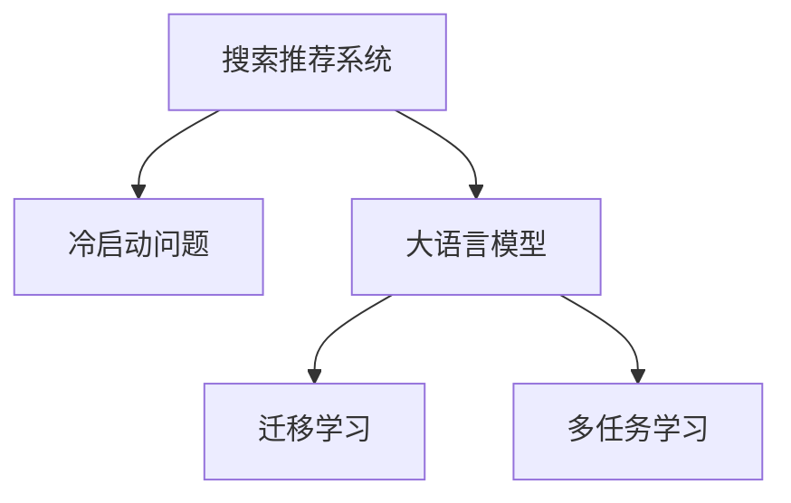

                 

# 搜索推荐系统的冷启动：大模型新思路

## 1. 背景介绍

在现代电商平台上，用户每天会产生大量的搜索和点击行为，而如何借助这些数据为用户推荐感兴趣的物品，是提升用户体验、提高转化率的关键。推荐系统通过分析用户的历史行为数据，为用户进行个性化推荐，但面对新用户，即所谓的"冷启动"问题，推荐系统面临重大的挑战。传统的冷启动策略通常依赖于用户的历史行为数据，但对于新用户而言，这些数据是缺失的。而大语言模型的应用，为解决冷启动问题带来了新的思路。

## 2. 核心概念与联系

### 2.1 核心概念概述

为更好地理解大模型在搜索推荐系统中的应用，本节将介绍几个密切相关的核心概念：

- 搜索推荐系统（Search & Recommendation System, SRS）：根据用户行为数据或历史偏好，为用户推荐相关物品的系统，广泛应用在电商、视频、音乐、新闻等领域。

- 冷启动问题（Cold Start Problem）：新用户或新物品在系统中的数据缺失，无法通过常规的用户行为分析方法进行推荐。

- 大语言模型（Large Language Model, LLM）：通过大规模无标签数据预训练的通用语言模型，具备强大的语言理解和生成能力，可以用于检索、生成、匹配等多种NLP任务。

- 迁移学习（Transfer Learning）：将在一个任务上学习到的知识，迁移到另一个相关任务上的学习范式，通过预训练-微调的方式，提升模型在特定任务上的性能。

- 多任务学习（Multi-task Learning, MTL）：在同一模型上同时训练多个相关任务，通过共享知识提升模型整体的泛化能力。

这些核心概念之间的逻辑关系可以通过以下Mermaid流程图来展示：



这个流程图展示了大语言模型在搜索推荐系统中的应用框架：

1. 搜索推荐系统通常面临冷启动问题，无法通过用户历史行为进行分析。
2. 大语言模型通过大规模预训练获得丰富的语言知识，具备对新物品和用户的理解能力。
3. 通过迁移学习和多任务学习，大模型可以将预训练的知识迁移到搜索推荐系统中，解决冷启动问题。

### 2.2 核心概念原理和架构的 Mermaid 流程图


## 3. 核心算法原理 & 具体操作步骤

### 3.1 算法原理概述

大语言模型在搜索推荐系统中的应用，主要通过迁移学习实现。迁移学习利用预训练模型的知识，迁移到新任务上进行微调，以提升模型在新场景下的性能。对于冷启动问题，具体而言，可以采用以下步骤：

1. **预训练模型选择**：选择大语言模型作为初始化参数，如BERT、GPT、T5等。
2. **任务适配层设计**：根据搜索推荐系统的具体需求，设计并加载任务适配层。
3. **数据准备**：收集相关数据，包括用户行为数据、物品特征数据等。
4. **微调训练**：在预训练模型的基础上，对模型进行有监督微调，学习推荐任务的特定知识。
5. **推荐实现**：将微调后的模型应用于推荐系统，为用户生成个性化推荐。

### 3.2 算法步骤详解

以下是详细的算法步骤：

**Step 1: 预训练模型选择和任务适配层设计**
- 选择合适的大语言模型，如BERT或GPT系列。
- 根据具体任务需求设计任务适配层。如对于推荐系统，可以设计一个包含物品特征的嵌入层，输出物品的相关性得分。

**Step 2: 数据准备**
- 收集用户历史行为数据，如浏览记录、点击记录等。
- 收集物品特征数据，如标题、描述、类别等。
- 清洗和标准化数据，去除噪音和重复项。

**Step 3: 微调训练**
- 将收集的数据划分为训练集、验证集和测试集。
- 设计适当的损失函数，如交叉熵损失、均方误差损失等。
- 选择合适的优化器及其参数，如Adam、SGD等，设置学习率、批大小、迭代轮数等。
- 对模型进行有监督微调，最小化损失函数。
- 周期性在验证集上评估模型性能，根据性能指标决定是否触发Early Stopping。
- 重复上述步骤直至满足预设的迭代轮数或Early Stopping条件。

**Step 4: 推荐实现**
- 将微调后的模型应用于推荐系统，根据用户行为数据和物品特征生成推荐。
- 可以采用协同过滤、矩阵分解等经典推荐算法，结合大模型的输出进行推荐。
- 在推荐系统中加入增量学习机制，持续更新模型参数，以适应新的用户和物品数据。

### 3.3 算法优缺点

大模型在搜索推荐系统中的应用有以下优点：
1. 预训练模型具有强大的语言理解能力，可以学习到丰富的语言知识，适用于多模态数据的处理。
2. 通过迁移学习，可以有效地解决冷启动问题，提升新用户的推荐效果。
3. 多任务学习可以进一步提升模型的泛化能力，处理多个相关任务，如分类、匹配、生成等。

同时，大模型在推荐系统中也存在一些缺点：
1. 预训练模型往往需要较大的计算资源和时间，模型的存储和推理资源消耗大。
2. 微调过程中可能出现过拟合，需要谨慎选择学习率、正则化等参数。
3. 推荐模型的解释性差，用户难以理解推荐结果的具体依据。
4. 模型参数量大，实际应用中需要考虑计算效率和资源利用率。

### 3.4 算法应用领域

大语言模型在搜索推荐系统中的应用已经得到了广泛的应用，覆盖了如下几个方面：

- 电商推荐：根据用户浏览和购买历史，推荐相关商品。
- 内容推荐：根据用户阅读和观看行为，推荐相关文章、视频等。
- 广告推荐：根据用户行为数据，推荐个性化的广告。
- 旅游推荐：根据用户搜索和预订历史，推荐旅行目的地和行程。
- 金融推荐：根据用户投资行为，推荐相关金融产品。

除了上述这些经典应用外，大语言模型还被创新性地应用到更多场景中，如可控推荐、产品召回、动态广告等，为推荐系统带来了新的突破。随着预训练模型和微调方法的不断进步，相信推荐系统必将在大规模数据和复杂任务中发挥更大的作用，进一步提升用户体验。

## 4. 数学模型和公式 & 详细讲解 & 举例说明

### 4.1 数学模型构建

假设推荐系统的数据集为 $D=\{(x_i,y_i)\}_{i=1}^N$，其中 $x_i$ 为物品特征向量，$y_i$ 为是否被用户点击的标签。模型的目标是通过学习物品与用户之间的交互，预测物品的点击概率。

定义模型的预测概率为 $p(y|x; \theta)$，其中 $\theta$ 为模型参数。则推荐模型的目标函数可以定义为：

$$
\mathcal{L}(\theta) = -\frac{1}{N}\sum_{i=1}^N y_i \log p(y_i|x_i; \theta) + (1-y_i) \log (1-p(y_i|x_i; \theta))
$$

在微调过程中，我们希望最小化上述损失函数，即：

$$
\hat{\theta} = \mathop{\arg\min}_{\theta} \mathcal{L}(\theta)
$$

其中 $\hat{\theta}$ 为微调后的模型参数。

### 4.2 公式推导过程

以下我们以推荐系统的二分类问题为例，推导模型参数的更新公式。

假设模型 $M_{\theta}$ 在输入 $x_i$ 上的预测概率为 $p(y_i=1|x_i; \theta)$，则二分类交叉熵损失函数定义为：

$$
\ell(M_{\theta}(x_i),y_i) = -[y_i\log p(y_i=1|x_i; \theta) + (1-y_i)\log (1-p(y_i=1|x_i; \theta))]
$$

将其代入经验风险公式，得：

$$
\mathcal{L}(\theta) = -\frac{1}{N}\sum_{i=1}^N [y_i\log p(y_i=1|x_i; \theta) + (1-y_i)\log (1-p(y_i=1|x_i; \theta))]
$$

根据链式法则，损失函数对参数 $\theta_k$ 的梯度为：

$$
\frac{\partial \mathcal{L}(\theta)}{\partial \theta_k} = -\frac{1}{N}\sum_{i=1}^N \left( y_i \frac{\partial p(y_i=1|x_i; \theta)}{\partial \theta_k} - p(y_i=1|x_i; \theta) \frac{\partial \log (1-p(y_i=1|x_i; \theta))}{\partial \theta_k} \right)
$$

其中 $\frac{\partial p(y_i=1|x_i; \theta)}{\partial \theta_k}$ 和 $\frac{\partial \log (1-p(y_i=1|x_i; \theta))}{\partial \theta_k}$ 的计算可以通过自动微分技术完成。

在得到损失函数的梯度后，即可带入参数更新公式，完成模型的迭代优化。重复上述过程直至收敛，最终得到适应推荐任务的最优模型参数 $\hat{\theta}$。

## 5. 项目实践：代码实例和详细解释说明

### 5.1 开发环境搭建

在进行推荐系统开发前，我们需要准备好开发环境。以下是使用Python进行TensorFlow开发的环境配置流程：

1. 安装Anaconda：从官网下载并安装Anaconda，用于创建独立的Python环境。

2. 创建并激活虚拟环境：
```bash
conda create -n tf-env python=3.8 
conda activate tf-env
```

3. 安装TensorFlow：根据CUDA版本，从官网获取对应的安装命令。例如：
```bash
conda install tensorflow -c tf -c conda-forge
```

4. 安装各类工具包：
```bash
pip install numpy pandas scikit-learn matplotlib tqdm jupyter notebook ipython
```

完成上述步骤后，即可在`tf-env`环境中开始推荐系统开发。

### 5.2 源代码详细实现

这里我们以电商推荐系统为例，给出使用TensorFlow对BERT模型进行微调的Python代码实现。

首先，定义推荐系统的数据处理函数：

```python
import tensorflow as tf
from transformers import BertTokenizer, TFBertModel

class RecommendationDataset(tf.keras.utils.Sequence):
    def __init__(self, texts, labels, tokenizer, max_len=128):
        self.texts = texts
        self.labels = labels
        self.tokenizer = tokenizer
        self.max_len = max_len
        
    def __len__(self):
        return len(self.texts)
    
    def __getitem__(self, item):
        text = self.texts[item]
        label = self.labels[item]
        
        encoding = self.tokenizer(text, return_tensors='tf', max_length=self.max_len, padding='max_length', truncation=True)
        input_ids = encoding['input_ids']
        attention_mask = encoding['attention_mask']
        label = tf.convert_to_tensor(label, dtype=tf.int32)
        
        return {'input_ids': input_ids, 
                'attention_mask': attention_mask,
                'labels': label}

# 标签与id的映射
tag2id = {'0': 0, '1': 1}
id2tag = {v: k for k, v in tag2id.items()}

# 创建dataset
tokenizer = BertTokenizer.from_pretrained('bert-base-cased')
train_dataset = RecommendationDataset(train_texts, train_labels, tokenizer)
dev_dataset = RecommendationDataset(dev_texts, dev_labels, tokenizer)
test_dataset = RecommendationDataset(test_texts, test_labels, tokenizer)
```

然后，定义模型和优化器：

```python
from transformers import BertForSequenceClassification

model = BertForSequenceClassification.from_pretrained('bert-base-cased', num_labels=len(tag2id))

optimizer = tf.keras.optimizers.AdamW(model.parameters(), lr=2e-5)
```

接着，定义训练和评估函数：

```python
@tf.function
def train_step(batch):
    with tf.GradientTape() as tape:
        features = {'input_ids': batch['input_ids'], 
                    'attention_mask': batch['attention_mask']}
        logits = model(features, training=True)
        loss = tf.keras.losses.BinaryCrossentropy()(labels=batch['labels'], logits=logits)
    gradients = tape.gradient(loss, model.trainable_variables)
    optimizer.apply_gradients(zip(gradients, model.trainable_variables))
    return loss

@tf.function
def evaluate_step(batch):
    features = {'input_ids': batch['input_ids'], 
                'attention_mask': batch['attention_mask']}
    logits = model(features, training=False)
    predictions = tf.sigmoid(logits)
    labels = batch['labels']
    loss = tf.keras.losses.BinaryCrossentropy()(labels=labels, logits=predictions)
    return loss
```

最后，启动训练流程并在测试集上评估：

```python
epochs = 5
batch_size = 16

for epoch in range(epochs):
    total_loss = 0
    for batch in train_dataset:
        loss = train_step(batch)
        total_loss += loss
    print(f"Epoch {epoch+1}, train loss: {total_loss/len(train_dataset):.3f}")
    
    total_loss = 0
    for batch in dev_dataset:
        loss = evaluate_step(batch)
        total_loss += loss
    print(f"Epoch {epoch+1}, dev loss: {total_loss/len(dev_dataset):.3f}")
    
print("Test results:")
total_loss = 0
for batch in test_dataset:
    loss = evaluate_step(batch)
    total_loss += loss
print(f"Test loss: {total_loss/len(test_dataset):.3f}")
```

以上就是使用TensorFlow对BERT进行电商推荐系统微调的完整代码实现。可以看到，TensorFlow的高级API使得模型定义和训练过程变得更加简洁高效。

### 5.3 代码解读与分析

让我们再详细解读一下关键代码的实现细节：

**RecommendationDataset类**：
- `__init__`方法：初始化文本、标签、分词器等关键组件。
- `__len__`方法：返回数据集的样本数量。
- `__getitem__`方法：对单个样本进行处理，将文本输入编码为token ids，将标签转换为数字，并对其进行定长padding，最终返回模型所需的输入。

**tag2id和id2tag字典**：
- 定义了标签与数字id之间的映射关系，用于将token-wise的预测结果解码回真实的标签。

**train_step和evaluate_step函数**：
- 使用TensorFlow定义训练和评估函数。
- 在训练函数中，使用GradientTape记录梯度，通过AdamW优化器更新模型参数。
- 在评估函数中，使用Sigmoid激活函数输出概率，并计算损失函数。

**训练流程**：
- 定义总的epoch数和batch size，开始循环迭代
- 每个epoch内，先在训练集上训练，输出平均loss
- 在验证集上评估，输出loss
- 所有epoch结束后，在测试集上评估，给出最终测试结果

可以看到，TensorFlow使得BERT微调的代码实现变得简洁高效。开发者可以将更多精力放在数据处理、模型改进等高层逻辑上，而不必过多关注底层的实现细节。

当然，工业级的系统实现还需考虑更多因素，如模型的保存和部署、超参数的自动搜索、更灵活的任务适配层等。但核心的微调范式基本与此类似。

## 6. 实际应用场景

### 6.1 电商推荐

基于大语言模型的推荐系统在电商推荐领域得到了广泛的应用。传统推荐系统通常依赖于用户的历史行为数据，而大语言模型通过预训练学习到了丰富的语言知识，可以在用户没有历史行为数据的情况下，对新物品进行推荐。

在技术实现上，可以收集用户浏览和购买的历史数据，将物品的标题、描述、价格等信息作为输入，通过微调后的BERT模型预测用户对每个物品的兴趣程度，根据排序算法生成推荐列表。对于新用户，可以通过提供物品的标题和价格等相关信息，由模型预测其可能感兴趣的商品，实现冷启动推荐。

### 6.2 内容推荐

内容推荐系统通常需要处理海量的文本数据，如文章、视频、音乐等。传统的基于规则或统计的推荐系统往往难以理解复杂的文本内容。而大语言模型通过预训练获得了对自然语言的深入理解，能够对不同内容的关联性进行建模，生成更加精确的推荐结果。

具体而言，可以收集用户的阅读和观看历史，将文本内容作为模型输入，通过微调后的BERT模型预测用户对每个内容的兴趣程度，生成推荐列表。对于新用户，可以提供一篇文章的摘要、一个视频的缩略图等相关信息，由模型预测其可能感兴趣的内容，实现冷启动推荐。

### 6.3 广告推荐

广告推荐系统需要根据用户的兴趣和行为特征，为其推荐最相关的广告。传统的推荐系统通常依赖于用户的历史行为数据，而对于新用户或广告库中的新广告，缺乏足够的数据进行训练。大语言模型通过预训练学习到了对不同广告语义的理解能力，可以在缺少历史数据的情况下，对新广告进行推荐。

在技术实现上，可以收集用户的搜索和点击历史，将广告的标题、描述、创意等信息作为输入，通过微调后的BERT模型预测用户对每个广告的兴趣程度，生成推荐列表。对于新用户，可以通过提供广告的标题和创意等相关信息，由模型预测其可能感兴趣的广告，实现冷启动推荐。

### 6.4 未来应用展望

随着大语言模型和微调方法的不断发展，基于微调范式将在更多领域得到应用，为传统行业带来变革性影响。

在智慧医疗领域，基于微调的推荐系统可以推荐相关医学知识和治疗方法，辅助医生诊疗，提升医疗服务的智能化水平。

在智能教育领域，推荐系统可以推荐个性化学习资源，如课程、教材、习题等，帮助学生制定学习计划，提高学习效果。

在智慧城市治理中，推荐系统可以推荐城市事件、公共设施等相关信息，提高市民的幸福感和满意度。

此外，在企业生产、社会治理、文娱传媒等众多领域，基于大语言模型微调的人工智能应用也将不断涌现，为传统行业带来新的机遇和挑战。相信随着技术的日益成熟，微调方法将成为人工智能落地应用的重要范式，推动人工智能技术在各个领域的发展。

## 7. 工具和资源推荐

### 7.1 学习资源推荐

为了帮助开发者系统掌握大语言模型在推荐系统中的应用，这里推荐一些优质的学习资源：

1. 《深度学习》书籍：由Ian Goodfellow等著，全面介绍了深度学习的基本概念和经典模型，包括推荐系统在内的多种应用。

2. 《Recommender Systems》课程：由斯坦福大学开设的推荐系统经典课程，涵盖了推荐系统的基本原理、算法和实践。

3. 《Hands-On Recommender Systems》书籍：详细介绍了推荐系统的技术实现，包括TensorFlow等深度学习框架的使用方法。

4. 《Deep Learning for Recommender Systems》论文：综述了大语言模型在推荐系统中的应用，提供了多篇文章的链接。

5. 《Advances in Neural Information Processing Systems》会议：NIPS年度顶级会议，每年都会发表大量的深度学习应用论文，包括推荐系统。

通过对这些资源的学习实践，相信你一定能够快速掌握大语言模型在推荐系统中的应用精髓，并用于解决实际的推荐问题。

### 7.2 开发工具推荐

高效的开发离不开优秀的工具支持。以下是几款用于推荐系统开发的常用工具：

1. TensorFlow：由Google主导开发的开源深度学习框架，生产部署方便，适合大规模工程应用。同样有丰富的推荐系统资源。

2. PyTorch：基于Python的开源深度学习框架，灵活动态的计算图，适合快速迭代研究。大部分预训练语言模型都有PyTorch版本的实现。

3. Weights & Biases：模型训练的实验跟踪工具，可以记录和可视化模型训练过程中的各项指标，方便对比和调优。与主流深度学习框架无缝集成。

4. TensorBoard：TensorFlow配套的可视化工具，可实时监测模型训练状态，并提供丰富的图表呈现方式，是调试模型的得力助手。

5. Apache Spark：开源的大数据处理框架，可以处理大规模推荐数据集，实现分布式训练和推理。

6. Apache Flink：开源的大数据流处理框架，适用于实时推荐系统，支持流数据的实时处理和分析。

合理利用这些工具，可以显著提升推荐系统的开发效率，加快创新迭代的步伐。

### 7.3 相关论文推荐

大语言模型在推荐系统中的应用源于学界的持续研究。以下是几篇奠基性的相关论文，推荐阅读：

1. Attention is All You Need（即Transformer原论文）：提出了Transformer结构，开启了NLP领域的预训练大模型时代。

2. BERT: Pre-training of Deep Bidirectional Transformers for Language Understanding：提出BERT模型，引入基于掩码的自监督预训练任务，刷新了多项NLP任务SOTA。

3. Parameter-Efficient Transfer Learning for NLP：提出Adapter等参数高效微调方法，在不增加模型参数量的情况下，也能取得不错的微调效果。

4. SEO-Query-Based Recommendation System: A Practical Framework for Search Engine Personalization：提出了基于搜索引擎查询的推荐系统框架，利用用户搜索行为数据进行推荐。

5. Deep Music Recommendation Model: A Collaborative Filtering Approach with Attention Mechanism：提出了一种基于深度学习的推荐模型，利用Transformer结构进行推荐。

这些论文代表了大语言模型在推荐系统中的应用进展。通过学习这些前沿成果，可以帮助研究者把握学科前进方向，激发更多的创新灵感。

## 8. 总结：未来发展趋势与挑战

### 8.1 总结

本文对基于大语言模型的推荐系统进行了全面系统的介绍。首先阐述了推荐系统面临的冷启动问题，以及大语言模型通过迁移学习解决冷启动问题的思想。其次，从原理到实践，详细讲解了大语言模型在推荐系统中的应用，给出了微调任务开发的完整代码实例。同时，本文还探讨了大语言模型在电商、内容、广告等推荐场景中的应用前景，展示了微调范式的巨大潜力。此外，本文精选了微调技术的各类学习资源，力求为读者提供全方位的技术指引。

通过本文的系统梳理，可以看到，基于大语言模型的推荐系统正成为推荐系统的重要范式，极大地拓展了推荐系统的应用边界，催生了更多的落地场景。受益于大规模语料的预训练，推荐系统在缺少历史行为数据的情况下，也能准确预测用户兴趣，实现了冷启动推荐。大语言模型在推荐系统中的应用，也为传统推荐系统带来了新的技术突破，未来必将在推荐领域发挥更大的作用。

### 8.2 未来发展趋势

展望未来，大语言模型在推荐系统中的应用将呈现以下几个发展趋势：

1. 模型规模持续增大。随着算力成本的下降和数据规模的扩张，预训练语言模型的参数量还将持续增长。超大规模语言模型蕴含的丰富语言知识，有望支撑更加复杂多变的推荐任务。

2. 推荐算法多样化。未来的推荐系统不仅包括基于深度学习的模型，还将融合传统的协同过滤、矩阵分解等算法，形成更加全面、高效的推荐策略。

3. 多模态推荐兴起。未来的推荐系统将进一步融合视觉、音频等多模态数据，提升推荐精度和个性化水平。

4. 实时推荐系统发展。实时推荐系统需要快速响应用户行为，预训练模型和微调技术将进一步优化计算图和推理流程，实现更加轻量级、实时性的部署。

5. 用户隐私保护加强。随着用户隐私保护意识的增强，推荐系统需要采取隐私保护技术，如差分隐私、联邦学习等，以保障用户数据安全。

6. 推荐模型的可解释性提升。推荐模型的决策过程需要更强的可解释性，帮助用户理解推荐结果，增强系统信任度。

7. 跨领域推荐应用拓展。推荐系统将应用于更多领域，如医疗、金融、教育等，为各行各业提供智能化的服务支持。

以上趋势凸显了大语言模型在推荐系统中的应用前景。这些方向的探索发展，必将进一步提升推荐系统的性能和应用范围，为经济社会发展注入新的动力。

### 8.3 面临的挑战

尽管大语言模型在推荐系统中的应用已经取得了显著成果，但在迈向更加智能化、普适化应用的过程中，它仍面临诸多挑战：

1. 冷启动问题难以解决。尽管微调可以解决部分冷启动问题，但对于完全未知的新物品和用户，推荐系统的准确性仍然难以保证。如何更好地处理冷启动问题，是一个重要的研究方向。

2. 推荐结果的可解释性差。传统的推荐系统可以通过用户行为数据进行解释，而基于大模型的推荐系统缺乏透明的决策过程，难以进行理解和解释。如何提升推荐结果的可解释性，是未来的重要课题。

3. 模型存储和推理资源消耗大。大语言模型通常参数量较大，存储和推理资源的消耗大，实际应用中需要考虑资源优化和效率提升。

4. 隐私和安全问题突出。推荐系统需要处理大量用户数据，如何保护用户隐私，防止数据泄露和滥用，是一个重要的问题。

5. 跨领域推荐效果差。不同领域的推荐任务，如电商、医疗、金融等，具有不同的用户行为模式和需求特点，如何构建跨领域的推荐系统，实现统一而高效的推荐，仍然是一个挑战。

6. 实时推荐系统难以实现。实时推荐系统需要快速响应用户行为，而大语言模型的推理速度较慢，如何提升推荐模型的推理效率，是实现实时推荐的关键。

7. 模型参数更新困难。大语言模型的参数量大，如何在不破坏已有知识的情况下，高效更新推荐模型，是一个需要深入研究的课题。

这些挑战凸显了大语言模型在推荐系统中的实际应用难度，但随着技术的不断进步，这些问题有望得到逐步解决。

### 8.4 研究展望

面对大语言模型在推荐系统中的挑战，未来的研究需要在以下几个方面寻求新的突破：

1. 探索更加高效的推荐算法。结合深度学习和传统推荐算法，设计出更加高效、泛化能力强的推荐策略。

2. 研究冷启动推荐技术。利用用户行为数据、社会网络等非结构化数据，提升推荐系统的冷启动能力。

3. 加强推荐结果的可解释性。引入因果推断、对抗性学习等技术，增强推荐模型的决策过程的可解释性。

4. 优化推荐模型的存储和推理。采用模型压缩、量化加速等技术，优化大语言模型在推荐系统中的应用。

5. 强化用户隐私保护。采用差分隐私、联邦学习等技术，保护用户数据隐私。

6. 构建跨领域推荐系统。利用多任务学习和迁移学习，构建能够适应不同领域推荐需求的通用推荐框架。

7. 提升实时推荐系统的性能。优化计算图和推理流程，实现更加轻量级、实时性的推荐部署。

这些研究方向的探索，必将引领大语言模型在推荐系统中的应用走向成熟，为推荐系统带来新的技术突破，提升推荐系统的智能化水平和应用范围。

## 9. 附录：常见问题与解答

**Q1：大语言模型在推荐系统中如何实现冷启动推荐？**

A: 大语言模型可以通过迁移学习实现冷启动推荐。具体而言，可以将用户的行为数据和物品的特征数据作为模型输入，通过微调后的BERT模型预测用户对每个物品的兴趣程度，生成推荐列表。对于新用户，可以提供物品的标题和价格等相关信息，由模型预测其可能感兴趣的商品，实现冷启动推荐。

**Q2：推荐系统在实际应用中如何处理用户隐私问题？**

A: 推荐系统在实际应用中需要采取隐私保护技术，如差分隐私、联邦学习等，以保障用户数据安全。具体而言，可以采用差分隐私技术对用户行为数据进行扰动，防止数据泄露和滥用。同时，可以采用联邦学习技术，将推荐模型的训练数据分布式存储在多个节点上，只共享模型参数和计算过程，而不会暴露用户数据。

**Q3：推荐系统中的多模态数据融合有何优势？**

A: 多模态数据的融合可以显著提升推荐系统的精度和个性化水平。传统的推荐系统通常只考虑文本数据，而多模态数据融合可以综合考虑视觉、音频等多维度的信息，提升对用户兴趣的理解。例如，可以通过图像识别技术识别物品的特征，结合物品的标题和描述，提升推荐模型的泛化能力。

**Q4：推荐系统中的用户行为数据如何处理？**

A: 推荐系统中的用户行为数据通常包括浏览记录、点击记录、购买记录等。这些数据需要经过清洗、标准化等预处理步骤，去除噪音和重复项。同时，还需要进行特征工程，提取和组合有用的特征，如物品的类别、属性、价格等。通过这些处理步骤，可以提高推荐模型的精度和泛化能力。

**Q5：推荐系统中的推荐结果如何解释？**

A: 推荐系统的推荐结果通常需要解释，以帮助用户理解推荐依据。大语言模型可以通过生成解释文本的方式，对推荐结果进行解释。例如，可以为每个物品生成一个简短的描述，解释其被推荐的原因。同时，还可以通过引入因果推断、对抗性学习等技术，增强推荐模型的决策过程的可解释性。

通过这些常见问题的解答，可以看到大语言模型在推荐系统中的实际应用场景和挑战，相信你对大语言模型在推荐系统中的应用有了更深入的了解。

