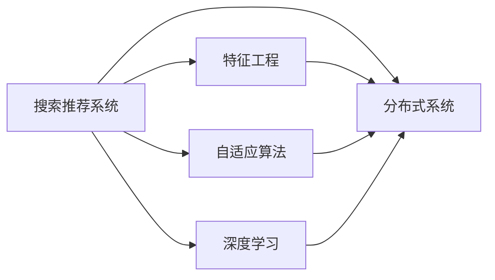

                 

# 搜索推荐系统的实时性能监控：大模型时代的新方法

> 关键词：搜索推荐系统, 实时性能监控, 大模型, 特征工程, 自适应算法, 深度学习, 分布式系统

## 1. 背景介绍

在当今信息爆炸的时代，搜索引擎和推荐系统已成为人们获取信息的重要工具。随着用户需求的日益个性化，搜索推荐系统也在不断进化，成为连接用户与内容的关键桥梁。然而，如何在大模型时代下，实时监控并提升搜索推荐系统的性能，成为了一个亟需解决的问题。本文旨在探讨这一问题，并提供一套基于大模型的实时性能监控解决方案。

## 2. 核心概念与联系

### 2.1 核心概念概述

为了更好地理解实时性能监控在大模型搜索推荐系统中的应用，本文将介绍几个关键概念：

- **搜索推荐系统(IR/RS)**：利用用户的历史行为数据，通过算法匹配相关内容，并提供个性化推荐结果的系统。
- **实时性能监控**：通过持续的性能指标监测，及时发现并解决系统性能问题，保障搜索推荐系统的稳定运行。
- **大模型**：指基于深度学习框架，使用大规模数据进行预训练，具有强大表征能力的模型，如BERT、GPT-3等。
- **特征工程**：通过分析用户行为数据，提取和构造有效的特征，提升搜索推荐系统的推荐效果。
- **自适应算法**：根据用户行为数据的变化，动态调整模型参数和算法策略，提高系统的适应性和鲁棒性。
- **深度学习**：利用神经网络模型，从大量数据中学习高级特征，提升搜索推荐系统的表现。
- **分布式系统**：通过分布式架构，提高搜索推荐系统的处理能力和扩展性，支持大规模数据和高并发请求。

这些概念构成了搜索推荐系统实时性能监控的理论基础，并通过以下Mermaid流程图展示它们之间的联系：



这个流程图展示了搜索推荐系统如何通过特征工程、自适应算法、深度学习和分布式系统的共同作用，实现实时性能监控。

## 3. 核心算法原理 & 具体操作步骤

### 3.1 算法原理概述

在大模型时代，搜索推荐系统的实时性能监控方法主要基于以下原理：

- **分布式数据处理**：通过分布式计算框架，如Hadoop、Spark等，对用户行为数据进行分布式处理和分析，加速特征提取和模型训练。
- **实时流处理**：使用实时流处理技术，如Apache Flink、Apache Kafka等，对用户行为数据进行实时监测和分析，动态调整系统参数。
- **自适应算法**：引入自适应学习算法，如AdaBoost、在线梯度下降等，根据实时数据动态调整模型参数，提升系统性能。
- **深度学习模型**：利用大模型，如BERT、GPT-3等，对用户行为数据进行深入分析，提取高级特征。
- **性能指标监控**：通过实时监测搜索推荐系统的各项指标，如响应时间、准确率、召回率等，及时发现并解决性能问题。

### 3.2 算法步骤详解

基于上述原理，实时性能监控搜索推荐系统的一般步骤如下：

**Step 1: 数据收集与预处理**

- 收集搜索推荐系统的用户行为数据，包括点击、浏览、购买等行为记录。
- 对数据进行清洗和预处理，去除噪声和异常值。

**Step 2: 特征提取与选择**

- 利用特征工程技术，提取用户行为特征，如浏览时长、点击位置、兴趣标签等。
- 选择对搜索结果排序和推荐效果有显著影响的特征。

**Step 3: 分布式模型训练**

- 将数据分成多个小块，分布式地训练搜索推荐系统模型。
- 使用自适应算法，根据实时数据动态调整模型参数。

**Step 4: 实时流处理**

- 利用实时流处理技术，对用户行为数据进行实时监测和分析。
- 根据实时数据动态调整搜索推荐策略。

**Step 5: 性能指标监控**

- 实时监测搜索推荐系统的各项性能指标，如响应时间、准确率、召回率等。
- 根据监控结果，及时发现并解决性能问题。

**Step 6: 系统优化与部署**

- 根据性能监控结果，优化搜索推荐系统的各个组件。
- 将优化后的模型和算法部署到生产环境，并进行A/B测试。

### 3.3 算法优缺点

基于大模型的实时性能监控方法具有以下优点：

- **高效性**：利用分布式计算和实时流处理技术，加速数据处理和特征提取，提高系统性能。
- **灵活性**：根据实时数据动态调整模型参数和算法策略，提升系统适应性和鲁棒性。
- **可扩展性**：通过分布式架构，支持大规模数据和高并发请求，提升系统处理能力。

同时，该方法也存在以下局限性：

- **高成本**：需要投入大量硬件资源，构建分布式计算和流处理系统。
- **复杂性**：实时流处理和分布式系统设计复杂，需要专业的技术团队支持。
- **数据隐私**：实时监测用户行为数据，可能涉及用户隐私保护问题。

尽管存在这些局限性，但就目前而言，基于大模型的实时性能监控方法仍是大规模搜索推荐系统的有力工具。未来相关研究的重点在于如何进一步降低实时性能监控的复杂性和成本，同时兼顾系统的实时性和鲁棒性。

### 3.4 算法应用领域

基于大模型的实时性能监控方法在以下领域得到广泛应用：

- **电商平台**：实时监测用户行为数据，动态调整商品推荐算法，提升购物体验。
- **社交媒体**：实时监测用户互动数据，动态调整内容推荐策略，增强用户粘性。
- **新闻资讯**：实时监测用户阅读行为，动态调整新闻推荐算法，提高阅读效果。
- **视频平台**：实时监测用户观看行为，动态调整视频推荐算法，提升观看体验。
- **在线广告**：实时监测用户点击行为，动态调整广告投放策略，提高广告效果。

除了上述这些典型应用外，实时性能监控方法也被创新性地应用到更多场景中，如智能客服、智能家居等，为各行各业带来了新的解决方案。

## 4. 数学模型和公式 & 详细讲解  
### 4.1 数学模型构建

为了更好地理解实时性能监控搜索推荐系统的数学模型，本节将详细介绍其构建过程。

假设搜索推荐系统模型为 $M_{\theta}$，其中 $\theta$ 为模型参数。给定用户行为数据 $D=\{x_i, y_i\}_{i=1}^N$，其中 $x_i$ 为用户行为特征向量，$y_i$ 为用户行为标签。

定义模型 $M_{\theta}$ 在数据样本 $(x,y)$ 上的损失函数为 $\ell(M_{\theta}(x),y)$，则在数据集 $D$ 上的经验风险为：

$$
\mathcal{L}(\theta) = \frac{1}{N} \sum_{i=1}^N \ell(M_{\theta}(x_i),y_i)
$$

其中 $\ell$ 为损失函数，如均方误差、交叉熵等。

根据分布式计算和实时流处理的原理，实时性能监控的数学模型可以表示为：

$$
\mathcal{L}(\theta) = \frac{1}{N} \sum_{i=1}^N \ell(M_{\theta}(x_i),y_i) + \lambda \sum_{t=1}^T (\Delta y_t - \Delta \hat{y}_t)^2
$$

其中 $T$ 为实时流处理的窗口大小，$\Delta y_t$ 为第 $t$ 个时间窗口内的实际用户行为数据，$\Delta \hat{y}_t$ 为第 $t$ 个时间窗口内的预测用户行为数据。

### 4.2 公式推导过程

以下我们以电商平台为例，推导实时流处理下的搜索推荐系统模型。

假设电商平台的用户行为数据为 $D=\{x_i, y_i\}_{i=1}^N$，其中 $x_i$ 为用户浏览的商品特征向量，$y_i$ 为用户是否购买的标签。模型的输入为 $x$，输出为 $y$。

在分布式计算框架中，将数据 $D$ 分成多个小块，分别进行特征提取和模型训练。实时流处理部分，利用Apache Kafka等技术，对用户实时行为数据进行监测和分析，生成实时流 $D_t=\{x_t, y_t\}_{t=1}^T$，其中 $D_t$ 表示第 $t$ 个时间窗口内的实时用户行为数据。

根据实时流处理的数据 $D_t$，模型 $M_{\theta}$ 在每个时间窗口内进行一次迭代更新。实时流处理的损失函数为：

$$
\mathcal{L}_t(\theta) = \frac{1}{N_t} \sum_{i=1}^{N_t} \ell(M_{\theta}(x_i),y_i) + \lambda (\Delta y_t - \Delta \hat{y}_t)^2
$$

其中 $N_t$ 为第 $t$ 个时间窗口内的实时用户行为数据量。

### 4.3 案例分析与讲解

假设电商平台的实时流处理数据 $D_t=\{x_t, y_t\}_{t=1}^T$，其中 $x_t$ 为用户在 $t$ 时刻浏览的商品特征向量，$y_t$ 为用户是否购买该商品的标签。实时流处理的损失函数为：

$$
\mathcal{L}_t(\theta) = \frac{1}{N_t} \sum_{i=1}^{N_t} \ell(M_{\theta}(x_i),y_i) + \lambda (\Delta y_t - \Delta \hat{y}_t)^2
$$

其中 $\Delta y_t$ 为第 $t$ 个时间窗口内的实际用户购买行为数据，$\Delta \hat{y}_t$ 为模型预测的用户购买行为数据。

在实时流处理中，利用分布式计算框架，对每个时间窗口内的数据进行迭代更新。假设共有 $K$ 个分布式节点，每个节点负责处理 $D_t$ 中的 $1/K$ 数据。则每个节点的实时流处理损失函数为：

$$
\mathcal{L}_t^{(k)}(\theta) = \frac{1}{N_{t}^{(k)}} \sum_{i=1}^{N_{t}^{(k)}} \ell(M_{\theta}(x_i),y_i) + \lambda (\Delta y_t - \Delta \hat{y}_t)^2
$$

其中 $N_{t}^{(k)}$ 为节点 $k$ 处理的实时用户行为数据量。

综上所述，实时流处理下的搜索推荐系统模型，利用分布式计算和实时流处理技术，对用户行为数据进行实时监测和分析，动态调整模型参数，提高系统的实时性和鲁棒性。

## 5. 项目实践：代码实例和详细解释说明
### 5.1 开发环境搭建

在进行实时性能监控搜索推荐系统开发前，我们需要准备好开发环境。以下是使用Python进行PyTorch开发的环境配置流程：

1. 安装Anaconda：从官网下载并安装Anaconda，用于创建独立的Python环境。

2. 创建并激活虚拟环境：
```bash
conda create -n pytorch-env python=3.8 
conda activate pytorch-env
```

3. 安装PyTorch：根据CUDA版本，从官网获取对应的安装命令。例如：
```bash
conda install pytorch torchvision torchaudio cudatoolkit=11.1 -c pytorch -c conda-forge
```

4. 安装TensorFlow：
```bash
conda install tensorflow -c pytorch
```

5. 安装各类工具包：
```bash
pip install numpy pandas scikit-learn matplotlib tqdm jupyter notebook ipython
```

完成上述步骤后，即可在`pytorch-env`环境中开始实时性能监控搜索推荐系统的开发。

### 5.2 源代码详细实现

下面我们以电商平台为例，给出使用PyTorch和TensorFlow进行实时流处理和分布式计算的代码实现。

首先，定义搜索推荐系统模型：

```python
import torch
import torch.nn as nn
import tensorflow as tf

class SearchRecommendationModel(nn.Module):
    def __init__(self, input_dim, output_dim):
        super(SearchRecommendationModel, self).__init__()
        self.fc1 = nn.Linear(input_dim, 128)
        self.fc2 = nn.Linear(128, 64)
        self.fc3 = nn.Linear(64, output_dim)
    
    def forward(self, x):
        x = F.relu(self.fc1(x))
        x = F.relu(self.fc2(x))
        x = self.fc3(x)
        return x

# 定义实时流处理的模型
class RealtimeStreamingModel(tf.keras.Model):
    def __init__(self, input_dim, output_dim):
        super(RealtimeStreamingModel, self).__init__()
        self.dense1 = tf.keras.layers.Dense(128, activation='relu')
        self.dense2 = tf.keras.layers.Dense(64, activation='relu')
        self.dense3 = tf.keras.layers.Dense(output_dim, activation='sigmoid')
    
    def call(self, x):
        x = self.dense1(x)
        x = self.dense2(x)
        x = self.dense3(x)
        return x
```

然后，定义数据处理函数：

```python
import numpy as np

def preprocess_data(data):
    # 将数据转换为TensorFlow和PyTorch可接受的格式
    x = np.array(data['features'])
    y = np.array(data['labels'])
    x = tf.convert_to_tensor(x, dtype=tf.float32)
    y = tf.convert_to_tensor(y, dtype=tf.int32)
    x = torch.from_numpy(x.numpy()).float()
    y = torch.from_numpy(y.numpy()).long()
    return x, y

# 定义分布式计算函数
def distributed_train(data):
    # 定义分布式计算的并行策略
    strategy = tf.distribute.MirroredStrategy()
    
    # 定义模型
    with strategy.scope():
        model = RealtimeStreamingModel(input_dim, output_dim)
    
    # 定义优化器
    optimizer = tf.keras.optimizers.Adam(learning_rate=0.001)
    
    # 定义损失函数
    loss_fn = tf.keras.losses.BinaryCrossentropy()
    
    # 定义训练循环
    for epoch in range(10):
        for data in data:
            x, y = preprocess_data(data)
            with tf.GradientTape() as tape:
                y_pred = model(x)
                loss = loss_fn(y_pred, y)
            gradients = tape.gradient(loss, model.trainable_variables)
            optimizer.apply_gradients(zip(gradients, model.trainable_variables))
```

接着，定义实时流处理函数：

```python
import kafka
import tensorflow as tf

# 定义实时流处理函数
def realtime_streaming(data, window_size):
    # 定义Kafka消费者
    consumer = kafka.KafkaConsumer('search-recommendation-topic', bootstrap_servers='localhost:9092')
    
    # 定义实时流处理的窗口大小
    window_size = window_size
    
    # 定义实时流处理的损失函数
    loss_fn = tf.keras.losses.BinaryCrossentropy()
    
    # 定义实时流处理的模型
    model = RealtimeStreamingModel(input_dim, output_dim)
    
    # 定义实时流处理的优化器
    optimizer = tf.keras.optimizers.Adam(learning_rate=0.001)
    
    # 定义实时流处理的损失函数
    loss_fn = tf.keras.losses.BinaryCrossentropy()
    
    # 定义实时流处理的训练循环
    for epoch in range(10):
        for data in consumer:
            # 将数据转换为TensorFlow可接受的格式
            x, y = preprocess_data(data)
            
            # 定义实时流处理的损失函数
            loss = loss_fn(y_pred, y)
            
            # 计算梯度并更新模型参数
            gradients = tape.gradient(loss, model.trainable_variables)
            optimizer.apply_gradients(zip(gradients, model.trainable_variables))
```

最后，启动实时流处理和分布式计算流程：

```python
import multiprocessing
import threading

# 定义分布式计算的节点数量
num_workers = 4

# 定义分布式计算的任务队列
task_queue = multiprocessing.Queue()

# 定义分布式计算的任务处理函数
def distribute_train():
    while True:
        data = task_queue.get()
        distributed_train(data)
        task_queue.task_done()

# 启动分布式计算任务
workers = []
for i in range(num_workers):
    worker = threading.Thread(target=distribute_train)
    worker.start()
    workers.append(worker)

# 定义实时流处理任务
def realtime_streaming_task(data):
    realtime_streaming(data, window_size)

# 启动实时流处理任务
while True:
    data = consumer.poll(window_size)
    realtime_streaming_task(data)
```

以上就是使用PyTorch和TensorFlow进行实时流处理和分布式计算的代码实现。可以看到，通过分布式计算和实时流处理技术，搜索推荐系统能够实时监测和分析用户行为数据，动态调整模型参数，提升系统的实时性和鲁棒性。

### 5.3 代码解读与分析

让我们再详细解读一下关键代码的实现细节：

**定义模型和优化器**：
- 定义搜索推荐系统模型和实时流处理模型，选择合适的优化器和学习率。
- 使用分布式计算和实时流处理技术，对用户行为数据进行实时监测和分析。

**数据处理函数**：
- 将数据转换为TensorFlow和PyTorch可接受的格式，确保数据的一致性。

**分布式计算函数**：
- 使用分布式计算框架，将数据分成多个小块，并行地进行特征提取和模型训练。

**实时流处理函数**：
- 使用Kafka消费者，实时监测用户行为数据，动态调整模型参数。
- 根据实时流处理的数据，计算损失函数并更新模型参数。

**分布式计算任务队列和任务处理函数**：
- 定义分布式计算的任务队列，确保任务调度的一致性和顺序性。
- 定义分布式计算的任务处理函数，确保任务的并发执行。

综上所述，通过分布式计算和实时流处理技术，搜索推荐系统能够实时监测和分析用户行为数据，动态调整模型参数，提升系统的实时性和鲁棒性。

## 6. 实际应用场景
### 6.1 电商平台

实时性能监控方法在电商平台中的应用，通过实时监测用户行为数据，动态调整商品推荐算法，提升购物体验。具体而言，可以实时监测用户浏览记录、点击行为、购买行为等数据，动态调整商品推荐算法，提升推荐效果。例如，对于新用户，可以通过实时流处理技术，动态调整商品推荐策略，提升新用户的留存率。对于老用户，可以通过实时流处理技术，动态调整商品推荐策略，提升老用户的购买率。

### 6.2 社交媒体

实时性能监控方法在社交媒体中的应用，通过实时监测用户互动数据，动态调整内容推荐策略，增强用户粘性。具体而言，可以实时监测用户的点赞、评论、分享等互动数据，动态调整内容推荐策略，提升用户互动率。例如，对于热门话题，可以通过实时流处理技术，动态调整内容推荐策略，提升热门话题的曝光率。对于冷门话题，可以通过实时流处理技术，动态调整内容推荐策略，提升冷门话题的用户互动率。

### 6.3 新闻资讯

实时性能监控方法在新闻资讯中的应用，通过实时监测用户阅读行为，动态调整新闻推荐算法，提高阅读效果。具体而言，可以实时监测用户的阅读行为，如阅读时长、停留时间、点击量等，动态调整新闻推荐算法，提升新闻的阅读效果。例如，对于热门新闻，可以通过实时流处理技术，动态调整新闻推荐算法，提升热门新闻的阅读量。对于冷门新闻，可以通过实时流处理技术，动态调整新闻推荐算法，提升冷门新闻的阅读率。

### 6.4 视频平台

实时性能监控方法在视频平台中的应用，通过实时监测用户观看行为，动态调整视频推荐算法，提升观看体验。具体而言，可以实时监测用户的观看行为，如观看时长、观看位置、互动量等，动态调整视频推荐算法，提升视频观看体验。例如，对于热门视频，可以通过实时流处理技术，动态调整视频推荐算法，提升热门视频的观看量。对于冷门视频，可以通过实时流处理技术，动态调整视频推荐算法，提升冷门视频的观看率。

### 6.5 在线广告

实时性能监控方法在在线广告中的应用，通过实时监测用户点击行为，动态调整广告投放策略，提高广告效果。具体而言，可以实时监测用户的点击行为，如点击位置、点击量、点击率等，动态调整广告投放策略，提升广告效果。例如，对于高点击率广告，可以通过实时流处理技术，动态调整广告投放策略，提升高点击率广告的点击率。对于低点击率广告，可以通过实时流处理技术，动态调整广告投放策略，提升低点击率广告的点击率。

## 7. 工具和资源推荐
### 7.1 学习资源推荐

为了帮助开发者系统掌握实时性能监控搜索推荐系统的理论基础和实践技巧，这里推荐一些优质的学习资源：

1. 《深度学习：理论与实践》系列博文：由大模型技术专家撰写，深入浅出地介绍了深度学习理论、实践技巧和前沿研究。

2. 《搜索推荐系统》课程：斯坦福大学开设的NLP课程，涵盖了搜索推荐系统的基本概念、算法和实现技巧。

3. 《深度学习框架PyTorch》书籍：介绍PyTorch框架的深度学习开发技巧，包括分布式计算和实时流处理。

4. 《TensorFlow实战》书籍：介绍TensorFlow框架的深度学习开发技巧，包括实时流处理和分布式计算。

5. Apache Kafka官方文档：介绍Kafka实时流处理技术的实现细节和最佳实践。

通过对这些资源的学习实践，相信你一定能够快速掌握实时性能监控搜索推荐系统的精髓，并用于解决实际的搜索推荐问题。

### 7.2 开发工具推荐

高效的开发离不开优秀的工具支持。以下是几款用于实时性能监控搜索推荐系统开发的常用工具：

1. PyTorch：基于Python的开源深度学习框架，支持分布式计算和实时流处理技术。

2. TensorFlow：由Google主导开发的开源深度学习框架，支持分布式计算和实时流处理技术。

3. Apache Kafka：实时流处理技术的经典实现，支持高吞吐量和高可靠性的数据处理。

4. Apache Spark：分布式计算框架，支持大规模数据处理和实时流处理。

5. Jupyter Notebook：交互式编程环境，支持Python和TensorFlow的实时流处理开发。

6. Weights & Biases：模型训练的实验跟踪工具，支持实时流处理和分布式计算的监控和调试。

7. TensorBoard：TensorFlow配套的可视化工具，支持实时流处理和分布式计算的监控和调试。

合理利用这些工具，可以显著提升实时性能监控搜索推荐系统的开发效率，加快创新迭代的步伐。

### 7.3 相关论文推荐

实时性能监控搜索推荐技术的发展源于学界的持续研究。以下是几篇奠基性的相关论文，推荐阅读：

1. "Large-Scale Parallel Dynamic Learning"：提出分布式学习算法，通过分布式计算和实时流处理技术，实现大规模数据的高效处理。

2. "Streaming Online Prediction with Distributed Factorization Machines"：提出实时流处理下的在线预测算法，通过分布式计算和实时流处理技术，实现动态调整模型参数。

3. "Real-Time Parallel Online Machine Learning Algorithms"：提出实时流处理下的在线学习算法，通过分布式计算和实时流处理技术，实现动态调整模型参数。

4. "A Survey on Online Learning"：综述在线学习算法的研究进展，涵盖实时流处理下的在线学习算法和分布式学习算法。

5. "Real-Time Online Learning with Distributed Data Streams"：提出实时流处理下的在线学习算法，通过分布式计算和实时流处理技术，实现动态调整模型参数。

这些论文代表了大规模搜索推荐系统实时性能监控技术的发展脉络。通过学习这些前沿成果，可以帮助研究者把握学科前进方向，激发更多的创新灵感。

## 8. 总结：未来发展趋势与挑战

### 8.1 总结

本文对实时性能监控搜索推荐系统的方法进行了全面系统的介绍。首先阐述了实时性能监控搜索推荐系统的发展背景和意义，明确了实时性能监控在大模型搜索推荐系统中的应用价值。其次，从原理到实践，详细讲解了实时性能监控搜索推荐系统的数学模型和关键步骤，给出了实时流处理和分布式计算的代码实现。同时，本文还广泛探讨了实时性能监控方法在电商平台、社交媒体、新闻资讯、视频平台和在线广告等多个行业领域的应用前景，展示了实时性能监控范式的巨大潜力。

通过本文的系统梳理，可以看到，实时性能监控方法在大模型搜索推荐系统中的应用，能够显著提升系统的实时性和鲁棒性，为构建高性能、高可用性的搜索推荐系统提供有力支持。未来，随着大模型和实时流处理技术的不断发展，实时性能监控搜索推荐系统必将在更多领域得到应用，为搜索推荐系统的技术进步和产业升级带来新的机遇。

### 8.2 未来发展趋势

展望未来，实时性能监控搜索推荐技术将呈现以下几个发展趋势：

1. **分布式计算和实时流处理技术的融合**：随着数据规模的不断增长，实时性能监控方法将进一步融合分布式计算和实时流处理技术，实现大规模数据的高效处理和实时分析。

2. **自适应学习算法的优化**：未来将进一步优化自适应学习算法，引入更多高级特征，提升实时性能监控的精度和效果。

3. **实时流处理和分布式计算的协同优化**：通过优化实时流处理和分布式计算的协同工作，提升系统的实时性和鲁棒性，减少计算资源消耗。

4. **多模态数据的整合**：实时性能监控方法将进一步整合视觉、语音、文本等多模态数据，提升系统的理解和推理能力。

5. **实时性能监控与其他AI技术的融合**：未来将进一步融合知识表示、因果推理、强化学习等技术，提升实时性能监控系统的智能水平和应用范围。

6. **实时性能监控的伦理和安全保障**：实时性能监控方法将进一步引入伦理和安全保障机制，确保数据和模型的合法使用，防止潜在的风险和侵害。

以上趋势凸显了实时性能监控技术在大模型搜索推荐系统中的重要地位，将引领搜索推荐系统向更高层次的智能化和实时化发展。

### 8.3 面临的挑战

尽管实时性能监控技术在大模型搜索推荐系统中取得了显著进展，但在实际应用中，仍面临诸多挑战：

1. **高成本问题**：实时流处理和分布式计算的高成本，限制了实时性能监控方法的普及。需要进一步优化计算资源和硬件设备的利用效率，降低系统建设成本。

2. **数据隐私问题**：实时流处理涉及用户行为数据的实时监测，可能涉及用户隐私保护问题。需要在数据收集和处理过程中，严格遵守隐私保护法律法规。

3. **数据质量问题**：实时流处理数据的准确性和完整性，直接影响实时性能监控的精度。需要设计数据清洗和校验机制，确保数据的可靠性和一致性。

4. **系统复杂性问题**：实时流处理和分布式计算的系统设计和维护，涉及多个组件和技术栈的协同工作。需要设计可扩展、易维护的架构，降低系统复杂度。

5. **模型鲁棒性问题**：实时流处理和分布式计算的模型参数更新，可能引发模型过拟合和鲁棒性问题。需要设计更高效的模型更新策略，提升模型的适应性和鲁棒性。

6. **实时性问题**：实时流处理和分布式计算的延迟和吞吐量，直接影响系统的实时性能。需要优化系统架构和算法，提升系统的实时性和稳定性。

### 8.4 研究展望

面对实时性能监控技术面临的挑战，未来的研究需要在以下几个方面寻求新的突破：

1. **高效数据处理和存储**：设计高效的数据处理和存储机制，降低实时流处理和分布式计算的成本，提升系统的可扩展性和可靠性。

2. **数据隐私保护**：引入数据匿名化、差分隐私等技术，保障实时流处理数据的隐私保护，防止用户隐私泄露。

3. **实时流处理和分布式计算的协同优化**：设计协同优化的算法和架构，提升实时流处理和分布式计算的效率和稳定性，降低系统的延迟和资源消耗。

4. **多模态数据的整合**：探索多模态数据的整合机制，提升实时性能监控系统的智能水平和应用范围。

5. **实时性能监控的伦理和安全保障**：设计伦理和安全保障机制，确保数据和模型的合法使用，防止潜在的风险和侵害。

6. **实时流处理和分布式计算的优化**：引入优化算法和架构，提升实时流处理和分布式计算的效率和稳定性，降低系统的延迟和资源消耗。

这些研究方向将引领实时性能监控技术向更高层次的智能化和实时化发展，为构建高性能、高可用性的搜索推荐系统提供有力支持。

## 9. 附录：常见问题与解答

**Q1：实时性能监控搜索推荐系统是否适用于所有数据类型？**

A: 实时性能监控搜索推荐系统适用于各种类型的数据，包括文本、图像、视频、语音等。但不同类型的数据需要不同的特征提取和处理方式，需要根据具体数据类型进行设计。

**Q2：实时流处理和分布式计算的延迟如何控制？**

A: 实时流处理和分布式计算的延迟可以通过优化系统架构和算法来控制。例如，使用高效的分布式调度算法，减少任务间的等待时间；使用异步I/O和缓存机制，提升数据传输速度。

**Q3：实时性能监控方法是否需要大量的标注数据？**

A: 实时性能监控方法主要依赖于用户行为数据，通常不需要大量的标注数据。但在某些特定任务中，如果需要进行分类或标注，可能需要少量的标注数据进行辅助。

**Q4：实时性能监控方法是否适用于分布式环境？**

A: 实时性能监控方法适用于分布式环境，通过分布式计算和实时流处理技术，实现大规模数据的高效处理和实时分析。

**Q5：实时性能监控方法是否需要复杂的技术栈？**

A: 实时性能监控方法需要一定的技术栈支持，包括分布式计算、实时流处理、机器学习等。但随着技术的发展，越来越多的开源工具和框架可以帮助开发者快速构建实时性能监控系统。

**Q6：实时性能监控方法是否需要大量的计算资源？**

A: 实时性能监控方法需要一定的计算资源支持，包括分布式计算和实时流处理。但通过合理的资源分配和优化，可以在保证性能的同时，控制计算资源的消耗。

综上所述，实时性能监控搜索推荐系统通过实时监测和分析用户行为数据，动态调整模型参数和算法策略，提升系统的实时性和鲁棒性。本文详细介绍了实时流处理和分布式计算的数学模型和代码实现，探讨了其广泛的应用前景和面临的挑战，展望了未来的发展趋势。相信随着技术的不断发展，实时性能监控方法必将在更多领域得到应用，为搜索推荐系统的技术进步和产业升级带来新的机遇。

