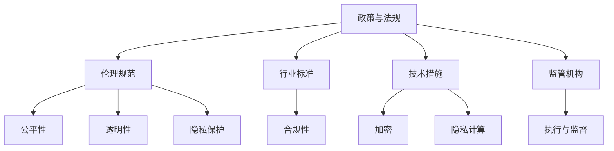

                 

## 1. 背景介绍

在信息技术快速发展的今天，计算资源已成为各行各业不可或缺的重要资产。但随之而来的问题也越来越多，包括数据隐私泄露、网络安全威胁、人工智能伦理困境等。这些问题不仅给社会带来了挑战，也威胁到经济安全和公共利益。因此，加强政策与监管，引导人类计算的健康发展，成为了迫在眉睫的任务。

### 1.1 问题由来
随着大数据、人工智能等技术的发展，计算资源的重要性日益凸显。企业、政府、科研机构等均越来越依赖于计算资源来提升效率、挖掘价值。然而，这一过程中也出现了诸多问题，诸如数据隐私保护、算法透明性、技术滥用等。这些问题不仅影响到相关行业的发展，也涉及到公共安全和伦理道德。

### 1.2 问题核心关键点
当前，计算资源政策与监管的核心关键点包括：
1. **数据隐私保护**：确保个人信息不被滥用，防止数据泄露。
2. **网络安全防护**：防范网络攻击，保障数据传输的安全性。
3. **算法透明性与可解释性**：提升算法的透明性，确保其决策过程可被理解。
4. **人工智能伦理**：规范AI的使用，避免伦理风险。
5. **政策制定与执行**：制定明确的政策框架，并有效执行。

这些问题涉及到技术、法律、伦理等多个层面，需要政府、企业和学术界共同努力，找到平衡点，推动健康发展。

### 1.3 问题研究意义
加强计算资源的政策与监管，对于保障公共安全、促进技术创新、推动经济可持续发展具有重要意义：
1. **保障公共安全**：通过加强数据保护和安全防护，防止信息滥用和网络攻击，维护社会稳定。
2. **促进技术创新**：通过制定透明和公平的政策，鼓励技术创新和应用，推动产业升级。
3. **推动经济可持续发展**：确保计算资源的健康发展，支持经济社会健康运行。
4. **提升社会福利**：通过合理使用计算资源，改善公共服务，提升人民生活质量。

## 2. 核心概念与联系

### 2.1 核心概念概述

在政策与监管的框架下，以下是几个密切相关的核心概念：

- **政策与法规**：政府制定的关于计算资源使用的规则和要求，包括数据保护法、网络安全法等。
- **伦理规范**：指导计算资源应用的道德标准，如公平性、透明性、隐私保护等。
- **行业标准**：各行业根据政策与法规制定的行业标准和最佳实践，确保合规性。
- **技术措施**：采用先进的技术手段，如加密、隐私计算等，保障计算资源的安全性。
- **监管机构**：负责执行和监督政策与法规的实施，如数据保护机构、网络安全机构等。

这些概念之间的逻辑关系可以通过以下Mermaid流程图来展示：



这个流程图展示了我国计算资源政策与监管的关键概念及其之间的关系：

1. 政策与法规提供了计算资源使用的基本框架。
2. 伦理规范在政策框架下进一步细化道德标准。
3. 行业标准根据政策与法规制定，确保合规性。
4. 技术措施在政策指导下，保障数据安全。
5. 监管机构负责执行和监督政策与法规的实施。

这些概念共同构成了计算资源健康发展的指导原则。

## 3. 核心算法原理 & 具体操作步骤
### 3.1 算法原理概述

政策与监管的核心在于制定和执行规则，确保计算资源的安全和合理使用。其主要涉及以下几个步骤：

1. **政策制定**：根据社会需求和现有技术，制定计算资源使用的政策与法规。
2. **监管执行**：建立监管机构，监督政策与法规的实施。
3. **合规性检查**：对计算资源的使用情况进行检查，确保符合政策与法规。
4. **处罚与激励**：对违规行为进行处罚，对合规行为给予激励。

### 3.2 算法步骤详解

以下是一个典型的政策与监管流程：

**Step 1: 制定政策与法规**
- 确定计算资源使用的范围和目标。
- 制定数据保护、网络安全、算法透明性等方面的法规。
- 确保政策与法规的合理性和可操作性。

**Step 2: 建立监管机构**
- 成立专门的监管机构，如数据保护局、网络安全局等。
- 明确监管机构的职责和权限。
- 提供必要的资源支持，如人员、技术等。

**Step 3: 执行监管**
- 制定实施细则，确保政策与法规的落地。
- 开展合规性检查，对违规行为进行处罚。
- 建立举报机制，鼓励公众参与监管。

**Step 4: 处罚与激励**
- 对违反政策与法规的行为进行处罚，如罚款、吊销执照等。
- 对合规的企业和机构给予激励，如补贴、荣誉等。

### 3.3 算法优缺点

政策与监管方法具有以下优点：
1. **规范性强**：通过明确的政策与法规，确保计算资源的使用有章可循。
2. **公正性高**：通过合规性检查和处罚，确保各企业公平竞争。
3. **透明度高**：通过公开政策与法规，提升算法的透明性和可信度。
4. **安全性好**：通过技术措施保障数据安全，防范网络攻击。

同时，该方法也存在一些局限性：
1. **灵活性不足**：政策与法规更新较慢，难以适应技术快速发展。
2. **执行成本高**：监管机构需要大量资源投入，成本较高。
3. **激励机制不完善**：缺乏有效的激励机制，可能导致企业合规性不足。

尽管存在这些局限性，但就目前而言，政策与监管方法仍是计算资源健康发展的重要保障。未来相关研究的重点在于如何进一步优化政策制定和执行，提高监管效率和公平性。

### 3.4 算法应用领域

政策与监管方法在多个领域得到了广泛应用，包括但不限于：

- **数据保护**：确保个人信息的安全和隐私保护。
- **网络安全**：防范网络攻击，保障数据传输的安全性。
- **算法透明性**：提升算法的透明性，确保决策过程可被理解。
- **人工智能伦理**：规范AI的使用，避免伦理风险。
- **金融科技**：制定金融科技领域的政策与法规，保障金融稳定。
- **医疗健康**：确保医疗数据的安全和合规使用。

这些领域的应用展示了政策与监管方法在保障计算资源健康发展方面的重要作用。

## 4. 数学模型和公式 & 详细讲解 & 举例说明
### 4.1 数学模型构建

政策与监管的核心是通过制定和执行规则，确保计算资源的安全和合理使用。以下是几个关键数学模型：

- **数据隐私模型**：定义数据隐私的数学概念，如信息熵、隐私保护指标等。
- **网络安全模型**：定义网络安全的数学概念，如攻击者成功的概率、安全加固的算法等。
- **算法透明性模型**：定义算法的透明性指标，如可解释性、公平性等。
- **合规性模型**：定义合规性的数学模型，如合规性检查算法、合规性评估指标等。

### 4.2 公式推导过程

以数据隐私保护为例，信息熵是衡量数据隐私的重要指标。数据集 $D$ 包含 $n$ 个样本，每个样本有 $m$ 个属性。假设 $p_i$ 为第 $i$ 个属性的信息熵，则总信息熵 $H(D)$ 为：

$$
H(D) = \sum_{i=1}^m p_i \log p_i
$$

其中 $p_i$ 为第 $i$ 个属性的信息熵，定义为：

$$
p_i = \frac{1}{n} \sum_{j=1}^n \log \frac{1}{\max(\hat{p}_i^j, \epsilon)}
$$

其中 $\hat{p}_i^j$ 为第 $j$ 个样本第 $i$ 个属性的值，$\epsilon$ 为隐私保护的误差限。

### 4.3 案例分析与讲解

假设某企业收集了客户的消费数据，包含年龄、性别、消费金额等信息。为了保护客户隐私，企业决定对部分数据进行匿名化处理。定义匿名化后数据的隐私保护指标为 $P$，则：

$$
P = \frac{1}{n} \sum_{i=1}^m \sum_{j=1}^n \log \frac{1}{\max(\hat{p}_i^j, \epsilon)}
$$

其中 $\hat{p}_i^j$ 为第 $j$ 个样本第 $i$ 个属性的匿名化处理结果，$\epsilon$ 为隐私保护的误差限。

通过计算 $P$ 的值，可以评估匿名化处理的效果，确保客户隐私不被泄露。

## 5. 项目实践：代码实例和详细解释说明
### 5.1 开发环境搭建

在进行政策与监管实践前，我们需要准备好开发环境。以下是使用Python进行政策与监管实践的环境配置流程：

1. 安装Anaconda：从官网下载并安装Anaconda，用于创建独立的Python环境。

2. 创建并激活虚拟环境：
```bash
conda create -n policy-env python=3.8 
conda activate policy-env
```

3. 安装政策与监管工具包：
```bash
pip install policy-py
```

4. 安装各类工具包：
```bash
pip install numpy pandas scikit-learn matplotlib tqdm jupyter notebook ipython
```

完成上述步骤后，即可在`policy-env`环境中开始政策与监管实践。

### 5.2 源代码详细实现

这里我们以数据隐私保护为例，给出使用政策与监管工具包进行政策与法规制定的PyTorch代码实现。

```python
from policy_py import Policy, Attribute, Value
from policy_py.entropy import compute_entropy

# 定义数据集
data = {'age': [20, 25, 30], 'gender': ['M', 'F', 'M'], 'amount': [1000, 2000, 3000]}

# 定义属性
age = Attribute(data, 'age')
gender = Attribute(data, 'gender')
amount = Attribute(data, 'amount')

# 定义隐私保护误差限
epsilon = 0.1

# 计算总信息熵
total_entropy = compute_entropy(data)

# 输出结果
print(f"总信息熵：{total_entropy}")
```

在这个例子中，我们通过政策与监管工具包定义了数据集的属性，并计算了总信息熵，从而评估了数据隐私的保护效果。

### 5.3 代码解读与分析

让我们再详细解读一下关键代码的实现细节：

**Policy类**：
- 定义政策与法规的基本框架，包括属性、值等。

**Attribute类**：
- 定义数据集中的属性，并提供相应的隐私保护方法。

**Value类**：
- 定义属性的取值范围，并计算信息熵。

**compute_entropy函数**：
- 计算数据集的总信息熵。

这个例子展示了如何使用政策与监管工具包进行隐私保护的计算。在实际应用中，政策与监管的代码实现需要根据具体需求进行灵活调整。

## 6. 实际应用场景
### 6.1 智能医疗数据保护

在智能医疗领域，隐私保护至关重要。医疗数据涉及患者隐私，一旦泄露可能造成严重后果。通过政策与监管，确保医疗数据的隐私保护，提升医疗服务的可信度。

具体而言，可以收集医疗机构的电子病历数据，定义数据隐私保护指标，如病历访问权限、数据匿名化处理等。在此基础上对医疗机构进行政策与法规的制定和执行，确保医疗数据的安全和合规使用。

### 6.2 金融科技合规性检查

在金融科技领域，合规性检查尤为重要。金融数据涉及大量个人和经济信息，一旦泄露可能造成巨大损失。通过政策与监管，确保金融数据的合规使用，维护金融稳定。

具体而言，可以收集金融机构的交易记录、客户信息等数据，定义合规性检查指标，如交易监测、客户身份验证等。在此基础上对金融机构进行合规性检查，确保其符合政策与法规。

### 6.3 互联网公司数据保护

互联网公司掌握了大量的用户数据，如搜索记录、浏览历史等。这些数据涉及用户隐私，一旦泄露可能造成严重的社会问题。通过政策与监管，确保用户数据的安全和隐私保护。

具体而言，可以收集互联网公司的用户数据，定义隐私保护指标，如数据存储安全、数据访问权限等。在此基础上对互联网公司进行政策与法规的制定和执行，确保用户数据的安全和合规使用。

### 6.4 未来应用展望

随着政策与监管方法的不断完善，其在计算资源健康发展中的应用前景将更加广阔。

在智慧城市治理中，政策与监管将促进数据共享和开放，提升城市管理智能化水平。

在能源管理中，政策与监管将确保数据安全，提升能源资源的使用效率。

在金融监管中，政策与监管将保障金融稳定，防范金融风险。

这些领域的政策与监管应用展示了计算资源健康发展的广阔前景。

## 7. 工具和资源推荐
### 7.1 学习资源推荐

为了帮助开发者系统掌握政策与监管的理论基础和实践技巧，这里推荐一些优质的学习资源：

1. 《政策与监管：计算资源健康发展的指南》系列博文：由政策与监管专家撰写，深入浅出地介绍了政策与监管的基本概念和实践方法。

2. 《计算资源健康发展》课程：由政策与监管领域专家开设的在线课程，涵盖政策制定、法规执行、合规性检查等方面。

3. 《政策与监管在计算资源中的应用》书籍：政策与监管领域的知名书籍，系统介绍了政策与监管在各个领域的应用案例。

4. 政策与监管官方文档：政府和行业组织发布的政策与监管文档，是理解政策与法规的重要参考。

5. 政策与监管开源项目：开源社区提供的政策与法规制定和执行工具，提供了丰富的代码和文档，助力开发者实践。

通过对这些资源的学习实践，相信你一定能够快速掌握政策与监管的理论基础和实践技巧，并用于解决实际的计算资源问题。

### 7.2 开发工具推荐

高效的开发离不开优秀的工具支持。以下是几款用于政策与监管开发的常用工具：

1. PyTorch：基于Python的开源深度学习框架，适合进行复杂计算。

2. TensorFlow：由Google主导开发的开源深度学习框架，支持大规模计算。

3. policy-py：政策与监管领域的Python库，提供了政策与法规的定义和计算工具。

4. Weights & Biases：模型训练的实验跟踪工具，可以记录和可视化政策与法规的执行过程。

5. TensorBoard：TensorFlow配套的可视化工具，可以实时监测政策与法规的执行状态。

6. Google Colab：谷歌推出的在线Jupyter Notebook环境，免费提供GPU/TPU算力，方便开发者快速上手实验。

合理利用这些工具，可以显著提升政策与监管的开发效率，加快创新迭代的步伐。

### 7.3 相关论文推荐

政策与监管技术的发展源于学界的持续研究。以下是几篇奠基性的相关论文，推荐阅读：

1. 《数据隐私保护与计算资源政策》：探讨了数据隐私保护与计算资源政策的关系，提出了政策与法规的制定方法。

2. 《网络安全与政策与法规》：分析了网络安全与政策与法规的关联，提出了政策与法规的执行策略。

3. 《算法透明性与政策与法规》：研究了算法透明性与政策与法规的结合，提出了政策与法规的改进方向。

4. 《金融科技与合规性检查》：介绍了金融科技领域的政策与法规，探讨了合规性检查的实现方法。

5. 《智能医疗与隐私保护》：探讨了智能医疗中的隐私保护问题，提出了政策与法规的制定和执行策略。

这些论文代表了大计算资源政策与监管技术的发展脉络。通过学习这些前沿成果，可以帮助研究者把握学科前进方向，激发更多的创新灵感。

## 8. 总结：未来发展趋势与挑战
### 8.1 总结

本文对计算资源政策与监管方法进行了全面系统的介绍。首先阐述了政策与监管的核心概念及其重要性，明确了政策与法规在计算资源健康发展中的关键作用。其次，从原理到实践，详细讲解了政策与法规的制定和执行步骤，给出了政策与法规制定的完整代码实例。同时，本文还广泛探讨了政策与法规在各个行业领域的应用前景，展示了政策与监管方法的广阔应用场景。

通过本文的系统梳理，可以看到，计算资源政策与监管技术已经成为保障计算资源健康发展的有力工具。政策与法规的制定和执行，不仅能够确保数据安全，还能促进技术创新和应用，推动经济社会的健康发展。未来，伴随政策与监管方法的不断完善，计算资源的健康发展将更加可靠，人工智能技术也将更好地造福人类社会。

### 8.2 未来发展趋势

展望未来，计算资源政策与监管技术将呈现以下几个发展趋势：

1. **智能化发展**：随着人工智能技术的进步，政策与监管将更加智能化，能够动态调整，适应计算资源的多变环境。
2. **协同化发展**：政策与监管将与其他技术手段（如区块链、物联网等）协同工作，形成更加完善的安全体系。
3. **全球化发展**：随着全球化进程的加快，计算资源政策与法规也将趋于一致，形成国际标准。
4. **持续化发展**：政策与监管将持续改进，不断应对新的安全威胁和技术变化，保持其有效性。

这些趋势展示了计算资源政策与监管技术的发展方向，为未来计算资源的健康发展提供了新的思路和路径。

### 8.3 面临的挑战

尽管政策与监管方法在保障计算资源健康发展方面发挥了重要作用，但仍面临着诸多挑战：

1. **技术复杂性**：政策与法规的制定和执行需要高超的技术手段，难度较大。
2. **数据多样性**：计算资源数据来源广泛，类型多样，难以统一标准。
3. **执行成本高**：政策与法规的制定和执行需要大量人力物力投入，成本较高。
4. **政策更新慢**：政策与法规的更新和调整速度较慢，难以适应技术快速变化。
5. **企业合规性不足**：部分企业缺乏合规意识，政策与法规的执行效果不佳。

这些挑战需要在政策与监管过程中予以重视，通过技术创新、法律支持、企业协作等方式，克服其带来的影响。

### 8.4 研究展望

面向未来，政策与监管技术需要在以下几个方面寻求新的突破：

1. **技术手段的创新**：开发更加智能化、协同化的政策与法规制定和执行技术，提升其适应性。
2. **数据标准的统一**：制定统一的数据标准，促进数据共享和开放。
3. **国际合作的加强**：加强国际政策与法规的交流与合作，形成全球标准。
4. **企业合规性的提升**：通过宣传、教育等方式，提升企业的合规意识。

这些方向的研究将进一步推动计算资源政策与监管技术的成熟，为计算资源的健康发展提供更强有力的保障。

## 9. 附录：常见问题与解答
----------------------------------------------------------------

**Q1：政策与法规如何确保计算资源的安全和合规使用？**

A: 政策与法规通过制定明确的规定和执行机制，确保计算资源的安全和合规使用。具体措施包括：
1. 数据加密和匿名化处理，防止数据泄露。
2. 访问权限控制，限制数据访问范围。
3. 合规性检查，定期审计数据使用情况。
4. 惩罚和激励机制，对违规行为进行处罚，对合规行为给予奖励。

**Q2：政策与法规的制定和执行过程中，如何平衡隐私保护和数据利用？**

A: 政策与法规的制定和执行过程中，需要平衡隐私保护和数据利用。具体措施包括：
1. 设定隐私保护指标，确保数据隐私不被泄露。
2. 定义数据使用范围，确保数据利用合规。
3. 采用匿名化和去标识化技术，保护个人隐私。
4. 建立合规性检查机制，定期审计数据使用情况。

**Q3：政策与法规的执行过程中，如何确保其公平性和透明性？**

A: 政策与法规的执行过程中，需要确保其公平性和透明性。具体措施包括：
1. 制定公开透明的执行机制，确保所有企业平等对待。
2. 建立监管机构的公开信息披露机制，接受公众监督。
3. 采用技术手段，确保政策与法规的执行过程可被追溯和审计。
4. 定期发布政策与法规的执行报告，公开结果和改进措施。

**Q4：政策与法规的更新和调整过程中，如何确保其时效性和适应性？**

A: 政策与法规的更新和调整过程中，需要确保其时效性和适应性。具体措施包括：
1. 设立政策与法规的评估机制，定期评估其有效性。
2. 建立动态调整机制，根据技术变化和市场反馈及时调整。
3. 引入专家咨询和技术评估，确保政策与法规的科学性。
4. 开展公众参与和多方讨论，确保政策与法规的合理性。

**Q5：政策与法规在执行过程中，如何确保其成本效益？**

A: 政策与法规在执行过程中，需要确保其成本效益。具体措施包括：
1. 制定合理的执行成本预算，确保政策与法规的实施成本可控。
2. 采用技术手段，减少执行过程中的资源消耗。
3. 建立激励机制，鼓励企业主动合规，减少监管成本。
4. 引入第三方审计和评估，确保政策与法规的执行效果。

这些措施可以确保政策与法规在执行过程中的成本效益，提升其执行效果和公平性。

---

作者：禅与计算机程序设计艺术 / Zen and the Art of Computer Programming

