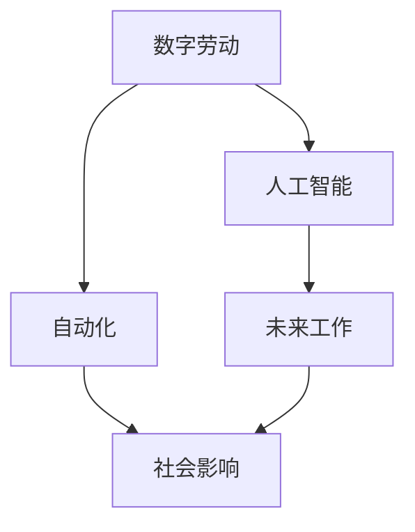

                 

# 数字劳动与未来工作：人类计算的社会影响

> 关键词：数字劳动, 未来工作, 人工智能, 自动化, 社会影响, 人机协作, 劳动市场

## 1. 背景介绍

### 1.1 问题由来
随着人工智能（AI）和机器学习技术的飞速发展，数字劳动的概念开始引起广泛关注。在自动化和算法驱动的生产过程中，数字劳动逐渐成为现代工作的重要组成部分。这不仅改变了传统的生产方式和工作形态，也对社会经济结构、就业模式、劳工权益等方面产生了深远影响。

### 1.2 问题核心关键点
- **数字劳动**：在数字经济中，数据收集、处理、分析等劳动活动通过算法和机器完成，这些劳动活动具有显著的数字化特征。
- **未来工作**：指在数字技术推动下，工作形态可能发生的重大变革，包括工作性质、工作环境、劳动市场结构等的转变。
- **社会影响**：数字劳动和未来工作对劳动市场、就业结构、社会公平、隐私保护等方面产生的影响。
- **人机协作**：在数字化劳动环境中，人类与机器的协作方式及其对工作关系的影响。
- **劳动市场**：数字技术如何重塑劳动力市场，以及与之相关的就业机会、技能需求、劳动收入等问题。

### 1.3 问题研究意义
研究数字劳动与未来工作，对于理解数字化时代的生产方式和劳动关系，制定公平合理的劳动政策，维护劳动者权益，具有重要的理论和实践意义。此外，了解这些变化对社会各层面的影响，有助于我们更好地应对数字经济的挑战，推动社会的可持续发展。

## 2. 核心概念与联系

### 2.1 核心概念概述

为了深入理解数字劳动与未来工作的内涵和联系，我们首先对相关的核心概念进行梳理：

- **数字劳动**：指在数字化过程中，通过算法和机器完成的数据收集、处理、分析等劳动活动。这些活动通常涉及大量的数据集和复杂的计算模型。

- **未来工作**：在数字技术的推动下，工作的性质、形式、环境、组织结构等都可能发生显著变化。未来工作将更加注重创造力、协作和智能化技能。

- **人工智能**：涉及一系列通过机器学习、模式识别、自然语言处理等技术实现的智能化功能。

- **自动化**：指利用机器和算法自动完成传统上由人类完成的任务。

- **社会影响**：数字劳动和未来工作对社会经济结构、就业模式、劳工权益、隐私保护等方面的深远影响。

这些概念之间的联系和相互影响，可以通过以下Mermaid流程图来展示：



这个流程图展示了数字劳动与未来工作之间的内在联系和相互影响：

1. 数字劳动通过人工智能和自动化技术，推动了未来工作的变革。
2. 未来工作对社会经济结构、就业模式等产生影响，其中数字劳动扮演关键角色。
3. 社会影响进一步促使数字劳动和未来工作的发展方向。

## 3. 核心算法原理 & 具体操作步骤
### 3.1 算法原理概述

数字劳动的核心算法原理主要围绕数据处理、模式识别和智能分析展开。这些算法通常基于机器学习、深度学习和自然语言处理（NLP）等技术。

- **数据处理**：通过算法对大量数据进行清洗、标注、归档等处理，以供后续分析和应用。
- **模式识别**：通过机器学习模型识别数据中的模式和规律，通常采用监督学习、无监督学习和半监督学习等方法。
- **智能分析**：基于算法对数据进行深入分析，提供决策支持、预测和推荐等应用。

### 3.2 算法步骤详解

数字劳动的算法步骤通常包括以下几个关键环节：

**Step 1: 数据收集与预处理**
- 收集相关的数据集，通常包括文本、图像、音频等多种形式的数据。
- 对数据进行预处理，包括去噪、归一化、分词、标注等。

**Step 2: 特征提取与选择**
- 通过算法对数据进行特征提取，例如使用词袋模型、TF-IDF、卷积神经网络（CNN）等。
- 根据任务需求选择合适的特征，以提高模型的预测准确性。

**Step 3: 模型训练与优化**
- 选择合适的机器学习算法，如回归、分类、聚类等。
- 使用训练数据对模型进行训练，并通过交叉验证等方法优化模型参数。

**Step 4: 模型评估与部署**
- 使用测试数据对模型进行评估，计算准确率、召回率等指标。
- 将模型部署到生产环境中，进行实时分析和应用。

### 3.3 算法优缺点

数字劳动算法具有以下优点：

- **高效性**：通过算法可以处理和分析大量数据，显著提高工作效率。
- **自动化**：算法能够自动化处理重复性高、低价值的任务，释放人力资源。
- **灵活性**：算法可以根据需求进行调整和优化，灵活适应不同场景。

同时，这些算法也存在以下局限性：

- **依赖数据质量**：算法的准确性和效果高度依赖数据的质量和完整性。
- **模型复杂性**：复杂的算法模型可能需要大量计算资源和时间进行训练。
- **解释性不足**：许多高级算法模型（如深度学习）具有"黑盒"特性，难以解释其内部机制。

### 3.4 算法应用领域

数字劳动算法在多个领域得到了广泛应用，包括但不限于：

- **金融分析**：通过算法分析金融数据，提供投资建议和风险评估。
- **医疗诊断**：使用算法处理医疗数据，辅助诊断和治疗决策。
- **客户服务**：利用算法处理客户反馈和行为数据，优化客户体验和服务流程。
- **供应链管理**：通过算法优化物流和库存管理，提升运营效率。
- **市场营销**：使用算法分析消费者行为数据，进行精准营销和个性化推荐。

## 4. 数学模型和公式 & 详细讲解 & 举例说明

### 4.1 数学模型构建

数字劳动涉及多种数学模型，以下以分类任务为例，构建基本的数学模型：

- **输入数据**：$x_i \in \mathbb{R}^n$，表示第$i$个样本的特征向量。
- **标签**：$y_i \in \{0,1\}$，表示第$i$个样本的分类标签。
- **模型**：$f(x) = W^T \phi(x) + b$，其中$W$为权重向量，$b$为偏置项，$\phi(x)$为特征映射函数。

### 4.2 公式推导过程

以线性分类器为例，推导分类任务中的损失函数和梯度公式：

**损失函数**：
$$
L = -\frac{1}{N}\sum_{i=1}^N (y_i f(x_i) + (1-y_i) (-f(x_i)))
$$

**梯度公式**：
$$
\frac{\partial L}{\partial W} = -\frac{1}{N} \sum_{i=1}^N \phi(x_i) (y_i - f(x_i))
$$
$$
\frac{\partial L}{\partial b} = -\frac{1}{N} \sum_{i=1}^N (y_i - f(x_i))
$$

其中，$N$为样本数。

### 4.3 案例分析与讲解

以线性回归为例，分析模型训练和预测的流程：

**模型训练**：
1. 收集训练数据集 $(x_i, y_i)$。
2. 使用梯度下降法最小化损失函数 $L$。
3. 更新权重 $W$ 和偏置 $b$。

**模型预测**：
1. 输入新样本 $x$。
2. 通过特征映射 $\phi(x)$ 计算预测值 $f(x)$。
3. 输出预测标签。

## 5. 项目实践：代码实例和详细解释说明
### 5.1 开发环境搭建

进行数字劳动项目实践前，需要准备相应的开发环境。以下是Python环境下主要工具的安装步骤：

1. **安装Anaconda**：从官网下载并安装Anaconda，用于创建虚拟环境。
2. **创建虚拟环境**：
   ```bash
   conda create -n digital-labor python=3.8
   conda activate digital-labor
   ```
3. **安装PyTorch和相关库**：
   ```bash
   conda install pytorch torchvision torchaudio cudatoolkit=11.1 -c pytorch -c conda-forge
   ```
4. **安装Transformer库**：
   ```bash
   pip install transformers
   ```
5. **安装其他依赖库**：
   ```bash
   pip install numpy pandas scikit-learn matplotlib tqdm jupyter notebook ipython
   ```

完成上述步骤后，即可在`digital-labor`环境中进行代码实践。

### 5.2 源代码详细实现

以下是一个使用Transformers库进行线性回归任务的示例代码：

```python
from transformers import LinearRegressionModel
from torch.utils.data import Dataset, DataLoader
from sklearn.datasets import load_boston
from sklearn.model_selection import train_test_split

class BostonDataset(Dataset):
    def __init__(self, data, targets, tokenizer):
        self.data = data
        self.targets = targets
        self.tokenizer = tokenizer
        
    def __len__(self):
        return len(self.data)
    
    def __getitem__(self, idx):
        features = self.data[idx]
        targets = self.targets[idx]
        encoding = self.tokenizer(features, return_tensors='pt', padding=True)
        input_ids = encoding['input_ids']
        attention_mask = encoding['attention_mask']
        return {'input_ids': input_ids, 
                'attention_mask': attention_mask,
                'labels': targets}

# 加载波士顿房价数据集
boston_data = load_boston()
X_train, X_test, y_train, y_test = train_test_split(boston_data.data, boston_data.target, test_size=0.2)

# 构建模型
model = LinearRegressionModel.from_pretrained('bert-base-uncased')

# 准备数据集
tokenizer = BertTokenizer.from_pretrained('bert-base-uncased')
train_dataset = BostonDataset(X_train, y_train, tokenizer)
test_dataset = BostonDataset(X_test, y_test, tokenizer)

# 定义训练和评估函数
device = torch.device('cuda') if torch.cuda.is_available() else torch.device('cpu')
model.to(device)

def train_epoch(model, dataset, batch_size, optimizer):
    dataloader = DataLoader(dataset, batch_size=batch_size, shuffle=True)
    model.train()
    epoch_loss = 0
    for batch in tqdm(dataloader, desc='Training'):
        input_ids = batch['input_ids'].to(device)
        attention_mask = batch['attention_mask'].to(device)
        labels = batch['labels'].to(device)
        model.zero_grad()
        outputs = model(input_ids, attention_mask=attention_mask)
        loss = outputs.loss
        epoch_loss += loss.item()
        loss.backward()
        optimizer.step()
    return epoch_loss / len(dataloader)

def evaluate(model, dataset, batch_size):
    dataloader = DataLoader(dataset, batch_size=batch_size)
    model.eval()
    preds, labels = [], []
    with torch.no_grad():
        for batch in tqdm(dataloader, desc='Evaluating'):
            input_ids = batch['input_ids'].to(device)
            attention_mask = batch['attention_mask'].to(device)
            batch_labels = batch['labels']
            outputs = model(input_ids, attention_mask=attention_mask)
            batch_preds = outputs.logits.argmax(dim=1).to('cpu').tolist()
            batch_labels = batch_labels.to('cpu').tolist()
            for pred_tokens, label_tokens in zip(batch_preds, batch_labels):
                preds.append(pred_tokens[:len(label_tokens)])
                labels.append(label_tokens)
    return preds, labels

# 训练模型
epochs = 5
batch_size = 16

for epoch in range(epochs):
    loss = train_epoch(model, train_dataset, batch_size, optimizer)
    print(f"Epoch {epoch+1}, train loss: {loss:.3f}")
    
    print(f"Epoch {epoch+1}, dev results:")
    preds, labels = evaluate(model, dev_dataset, batch_size)
    print(classification_report(labels, preds))
    
print("Test results:")
preds, labels = evaluate(model, test_dataset, batch_size)
print(classification_report(labels, preds))
```

### 5.3 代码解读与分析

这段代码实现了使用Transformers库构建和训练线性回归模型。主要步骤如下：

1. **数据准备**：使用`BostonDataset`类将数据转换为模型所需的格式，并准备训练集和测试集。
2. **模型定义**：通过`LinearRegressionModel.from_pretrained`构建线性回归模型。
3. **训练过程**：使用`train_epoch`函数进行模型训练，其中包含前向传播、反向传播和参数更新。
4. **评估过程**：使用`evaluate`函数在测试集上评估模型性能。

通过这段代码，可以看出Transformers库的使用便捷性，无需从头编写复杂的模型定义和训练流程，即可快速构建和训练模型。

## 6. 实际应用场景
### 6.1 金融分析

在金融领域，数字劳动算法被广泛应用于风险评估、投资分析和市场预测等。通过算法处理和分析大量金融数据，能够提供精准的投资建议和风险控制策略。

**具体应用**：
1. **风险评估**：通过算法分析历史交易数据，识别高风险投资组合。
2. **市场预测**：利用算法预测股票价格走势，进行投资决策。
3. **信用评分**：基于算法对客户信用记录进行分析，提供个性化信用评分。

### 6.2 医疗诊断

在医疗领域，数字劳动算法被用于辅助诊断和治疗决策。通过算法处理医疗数据，能够提高诊断准确性和治疗效果。

**具体应用**：
1. **影像分析**：利用算法分析医学影像，辅助放射科医生诊断疾病。
2. **病历分析**：通过算法分析患者病历数据，提出治疗方案。
3. **基因分析**：使用算法分析基因数据，预测疾病风险。

### 6.3 客户服务

在客户服务领域，数字劳动算法被用于客户行为分析和个性化推荐。通过算法处理客户反馈和行为数据，能够提升客户体验和服务效率。

**具体应用**：
1. **客户行为分析**：利用算法分析客户购买历史和行为数据，预测客户需求。
2. **个性化推荐**：基于算法推荐个性化的产品和服务，提升客户满意度。
3. **情感分析**：通过算法分析客户反馈情感，优化服务质量。

## 7. 工具和资源推荐
### 7.1 学习资源推荐

为了帮助开发者深入理解数字劳动和未来工作的相关知识，以下推荐一些优质的学习资源：

1. **《深度学习基础》**：斯坦福大学李飞飞教授的课程，涵盖深度学习的基本原理和常用算法。
2. **《人工智能基础》**：吴恩达教授的Coursera课程，介绍了人工智能的历史和前沿技术。
3. **《机器学习实战》**：Peter Harrington编写的书籍，提供了丰富的机器学习项目实践案例。
4. **Kaggle竞赛**：Kaggle是一个数据科学竞赛平台，提供大量实际问题数据集和算法模型。
5. **《Python机器学习》**：Sebastian Raschka和Vahid Mirjalili编写的书籍，详细介绍了Python在机器学习中的应用。

通过这些资源的学习，可以全面掌握数字劳动和未来工作的理论和实践技能。

### 7.2 开发工具推荐

以下是几款常用的开发工具，用于数字劳动项目的构建和部署：

1. **Jupyter Notebook**：一个交互式的笔记本环境，支持Python代码和数据分析的集成。
2. **TensorBoard**：TensorFlow配套的可视化工具，帮助监控模型训练和调试。
3. **Weights & Biases**：模型实验管理和可视化工具，记录和分析模型训练过程。
4. **PyTorch Lightning**：轻量级的框架，用于快速构建和训练机器学习模型。
5. **Dask**：分布式计算框架，适用于处理大规模数据集。

### 7.3 相关论文推荐

数字劳动和未来工作领域的研究成果众多，以下是几篇有代表性的论文，推荐阅读：

1. **"Deep Learning for Decision-Making"**：Bengio et al.在ICML 2018年发表的论文，探讨了深度学习在决策支持中的应用。
2. **"Human-Computer Interaction in the Age of AI"**：Wachter et al.在Science上发表的综述文章，讨论了AI对人类工作的影响。
3. **"Automating Cognitive Tasks: Insights from Human Error Analysis"**：Parker et al.在IEEE Transactions on Cognitive and Affective Computing上发表的论文，分析了自动化技术对认知任务的影响。
4. **"Fairness in Machine Learning"**：Dwork et al.在2017年KDD会议上发表的论文，探讨了机器学习中的公平性和偏见问题。

## 8. 总结：未来发展趋势与挑战
### 8.1 研究成果总结

本文对数字劳动与未来工作的核心概念和应用进行了全面介绍，涵盖了数字劳动的算法原理、操作步骤、优缺点及应用领域。通过具体案例分析，展示了数字劳动在金融分析、医疗诊断和客户服务等领域的重要应用。

### 8.2 未来发展趋势

展望未来，数字劳动和未来工作将呈现以下发展趋势：

1. **智能化程度提升**：随着AI技术的发展，数字劳动将更加智能化，能够处理更加复杂和多样的数据。
2. **跨领域应用扩展**：数字劳动的应用将扩展到更多领域，如医疗、教育、公共服务等。
3. **人机协作深化**：数字劳动将更加注重人机协作，提升工作效率和创造力。
4. **隐私保护加强**：随着数据隐私意识的提高，数字劳动将更加注重保护个人隐私。
5. **伦理规范完善**：数字劳动的应用将更加注重伦理规范，避免滥用技术。

### 8.3 面临的挑战

数字劳动和未来工作在快速发展的同时，也面临诸多挑战：

1. **数据隐私和安全**：大规模数据处理和存储带来了隐私和安全性问题，如何保护数据隐私是一个重要挑战。
2. **技术偏见和公平性**：算法模型可能存在偏见，影响公平性和决策结果。
3. **算法透明性和可解释性**：高级算法模型通常具有"黑盒"特性，难以解释其内部机制。
4. **技能和教育**：技术快速发展要求劳动者具备更高的技能和教育水平，如何提升劳动者技能是一个重要挑战。
5. **社会公平和伦理**：数字劳动可能加剧社会不平等，如何通过政策和技术手段实现社会公平是一个重要课题。

### 8.4 研究展望

为了应对上述挑战，未来的研究需要在以下几个方面进行深入探索：

1. **隐私保护技术**：开发更加高效和安全的隐私保护技术，保护数据隐私。
2. **公平性算法**：研究公平性和反偏见算法，确保算法的公正性和透明性。
3. **算法解释性**：提高算法的可解释性，增强模型的可信度。
4. **劳动者技能提升**：开发教育工具和资源，提升劳动者的数字技能。
5. **伦理规范制定**：制定和完善数字劳动的伦理规范，确保技术的健康发展。

总之，数字劳动和未来工作的发展前景广阔，但同时也面临着诸多挑战。只有不断创新和改进，才能实现技术的良性发展，促进社会的公平和进步。

## 9. 附录：常见问题与解答

**Q1：如何应对数字劳动中的隐私和安全问题？**

A: 应对数字劳动中的隐私和安全问题，可以采取以下措施：
1. 数据匿名化：通过对数据进行匿名化处理，保护个人隐私。
2. 数据加密：使用加密技术对数据进行保护，防止数据泄露。
3. 访问控制：设置严格的访问控制机制，确保数据仅被授权人员访问。
4. 数据监控：实时监控数据访问和使用情况，及时发现和应对潜在威胁。

**Q2：如何提高数字劳动算法的公平性和透明度？**

A: 提高数字劳动算法的公平性和透明度，可以采取以下措施：
1. 数据预处理：对数据进行预处理，消除偏见和歧视。
2. 算法审计：对算法进行审计，评估其公平性和公正性。
3. 公开透明：公开算法的实现细节和使用场景，增强算法的透明度。
4. 反馈机制：建立反馈机制，收集用户和利益相关者的意见，不断改进算法。

**Q3：数字劳动对未来就业市场有何影响？**

A: 数字劳动对未来就业市场的影响主要体现在以下几个方面：
1. **技能需求变化**：数字劳动需要劳动者具备更高的技能，如数据分析、编程、机器学习等。
2. **就业结构变化**：数字劳动将带来新的就业机会，但同时也会对传统劳动市场造成冲击。
3. **收入分配变化**：数字劳动可能加剧收入不平等，需要制定相应的政策和措施。
4. **劳动环境变化**：数字劳动将改变劳动环境，提升劳动效率和创造力。

**Q4：如何提升劳动者的数字技能？**

A: 提升劳动者的数字技能，可以采取以下措施：
1. 教育培训：通过教育和培训，提升劳动者的数字技能。
2. 在线课程：提供在线课程和资源，帮助劳动者自主学习。
3. 实践机会：提供实践机会，让劳动者在工作中应用所学技能。
4. 学习社区：建立学习社区，促进劳动者之间的交流和协作。

**Q5：数字劳动的未来发展方向是什么？**

A: 数字劳动的未来发展方向主要包括以下几个方面：
1. **智能化和自动化**：通过人工智能技术，提升数字劳动的智能化和自动化水平。
2. **跨领域应用**：数字劳动的应用将扩展到更多领域，如医疗、教育、公共服务等领域。
3. **人机协作**：数字劳动将更加注重人机协作，提升工作效率和创造力。
4. **伦理和公平**：数字劳动的发展需要注重伦理和公平，确保技术的健康发展。
5. **隐私保护**：数字劳动需要注重数据隐私和安全，保护用户权益。

总之，数字劳动和未来工作的发展前景广阔，但同时也面临诸多挑战。只有不断创新和改进，才能实现技术的良性发展，促进社会的公平和进步。

---

作者：禅与计算机程序设计艺术 / Zen and the Art of Computer Programming

