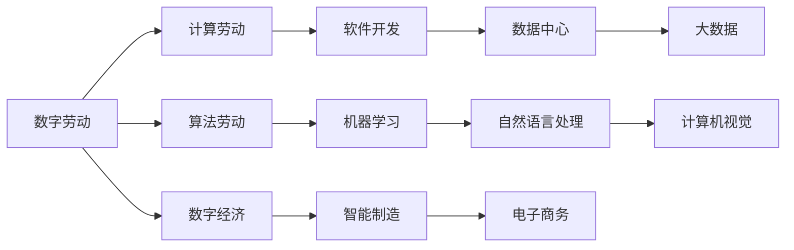

                 

## 1. 背景介绍

### 1.1 问题由来
随着计算机技术的飞速发展，数字劳动的概念逐渐进入公众视野。在数字化时代，人类劳动的形态已经发生了深刻变化。传统意义上的劳动，大多以体力和经验为主，但随着算法和计算资源的广泛应用，越来越多的任务被机器所替代，从而形成了一种新的“数字劳动”模式。这种模式不仅改变了工作的性质，也重塑了社会的经济结构和人类生活的方方面面。

### 1.2 问题核心关键点
数字劳动是指在数字化生产过程中，通过计算和算法进行任务处理和价值创造的劳动方式。其核心关键点包括：
- 数字劳动的主体：传统以人为主导的劳动，逐渐转变为以机器和算法为主导的劳动。
- 数字劳动的对象：从物理世界转向了数字世界，数据成为新的生产要素。
- 数字劳动的形式：从重复性、机械性的劳动，转向更加智能化、自动化的劳动。

这种劳动方式的转变，对人类社会产生了深远影响，不仅改变了经济的结构和发展模式，也带来了伦理、隐私、公平等一系列问题。因此，本文将从数字劳动的概念出发，深入探讨其社会和经济影响，并提出相应的应对策略。

### 1.3 问题研究意义
研究数字劳动的概念和影响，对于理解当前数字化生产方式、预测未来趋势、制定相关政策具有重要意义：
- 深入理解数字劳动：揭示数字劳动的本质和特点，为制定相关政策提供理论基础。
- 预测未来发展趋势：分析数字劳动对经济、社会、文化等各方面的影响，为未来发展方向提供参考。
- 制定应对策略：基于数字劳动的影响，提出相关政策和措施，保障劳动者的权益，促进社会公平和可持续发展。

## 2. 核心概念与联系

### 2.1 核心概念概述

数字劳动的概念涉及多个领域，包括计算机科学、社会学、经济学等。本节将介绍几个核心概念，并说明它们之间的联系。

#### 2.1.1 数字劳动
数字劳动是指通过计算和算法进行任务处理和价值创造的劳动方式。这种劳动方式主要发生在数字化生产中，利用计算机技术和数据资源，实现自动化、智能化处理。

#### 2.1.2 计算劳动
计算劳动是指利用计算机进行信息处理和价值创造的劳动方式。这种劳动方式主要发生在知识密集型行业中，如软件开发、数据分析、人工智能等领域。

#### 2.1.3 算法劳动
算法劳动是指通过编写和优化算法程序，实现自动化任务处理的劳动方式。这种劳动方式主要发生在算法研究和应用中，如机器学习、自然语言处理、计算机视觉等领域。

#### 2.1.4 数字经济
数字经济是指以数字劳动为核心的经济模式，利用数字技术和信息资源，创造和传递经济价值。这种经济模式正在改变传统的生产、分配、消费方式，推动经济的数字化转型。

### 2.2 核心概念原理和架构的 Mermaid 流程图



此图展示了数字劳动、计算劳动、算法劳动和数字经济之间的联系。数字劳动涵盖了计算劳动和算法劳动，而数字经济则是基于数字劳动的经济模式。这些概念在计算机科学、社会学和经济学的交叉领域中，共同构成了数字劳动的社会经济影响框架。

## 3. 核心算法原理 & 具体操作步骤
### 3.1 算法原理概述

数字劳动的实现离不开算法和技术支撑。本节将介绍数字劳动中常用的算法原理，并说明具体操作步骤。

#### 3.1.1 机器学习
机器学习是数字劳动中的核心算法之一。通过训练模型，机器学习可以自动从数据中学习规律，进行预测、分类、聚类等任务。在数字劳动中，机器学习广泛应用于数据分析、模式识别、自然语言处理等领域。

#### 3.1.2 深度学习
深度学习是机器学习的一种特殊形式，通过多层神经网络进行特征提取和决策。深度学习在大规模数据处理和复杂任务中表现出优越性能，广泛应用于计算机视觉、语音识别、自然语言处理等领域。

#### 3.1.3 自然语言处理
自然语言处理是指利用计算机技术，处理和理解人类语言的算法。数字劳动中，自然语言处理主要应用于文本分析、情感分析、机器翻译等领域，使得机器能够理解人类语言并进行自动处理。

#### 3.1.4 计算机视觉
计算机视觉是指通过计算机技术，处理和理解图像和视频信息的算法。在数字劳动中，计算机视觉主要应用于图像识别、目标检测、视频分析等领域，使得机器能够自动理解和处理视觉信息。

### 3.2 算法步骤详解

数字劳动的实现一般分为以下几个步骤：

#### 3.2.1 数据收集
数据收集是数字劳动的第一步，也是最重要的一步。通过传感器、互联网、社交媒体等渠道，收集大量的数据，如文本、图像、语音等。

#### 3.2.2 数据清洗
数据清洗是对收集的数据进行预处理，去除噪音、缺失值和不一致性，确保数据的准确性和可用性。

#### 3.2.3 特征提取
特征提取是从数据中提取有用的信息，转化为算法能够处理的格式。常用的方法包括词向量、图像特征提取、时间序列分析等。

#### 3.2.4 模型训练
模型训练是数字劳动的核心步骤，通过训练机器学习模型，实现对数据的自动处理和分析。

#### 3.2.5 模型部署
模型部署是将训练好的模型应用到实际场景中，实现自动化任务处理和价值创造。

### 3.3 算法优缺点

数字劳动中的算法具有以下优点：
- 自动化程度高：可以处理大量数据，提高工作效率。
- 精准度高：通过深度学习等技术，可以实现高精度的预测和分类。
- 成本低：算法处理不需要大量人力，降低生产成本。

同时，算法也存在以下缺点：
- 依赖数据：算法的性能依赖于数据质量，数据噪音和偏见可能导致算法失效。
- 解释性差：算法通常是“黑盒”系统，难以解释其内部决策过程。
- 技术门槛高：算法开发需要高水平的知识和技能，普通劳动者难以掌握。

### 3.4 算法应用领域

数字劳动广泛应用于以下领域：

#### 3.4.1 智能制造
智能制造通过自动化、智能化技术，提高生产效率和产品质量。数字劳动在此过程中起到关键作用，如通过数据分析优化生产流程、通过机器学习预测设备故障等。

#### 3.4.2 金融科技
金融科技通过算法和大数据，优化金融服务的流程和效率。数字劳动在此过程中起到关键作用，如通过自然语言处理处理客户投诉、通过机器学习进行信用评估等。

#### 3.4.3 电子商务
电子商务通过算法和大数据，优化供应链管理和客户体验。数字劳动在此过程中起到关键作用，如通过计算机视觉进行商品识别、通过自然语言处理进行客户服务等。

#### 3.4.4 医疗健康
医疗健康通过算法和大数据，提高医疗服务的效率和精准度。数字劳动在此过程中起到关键作用，如通过图像识别诊断疾病、通过自然语言处理处理医疗记录等。

## 4. 数学模型和公式 & 详细讲解 & 举例说明

### 4.1 数学模型构建

数字劳动中常用的数学模型包括机器学习模型、深度学习模型、自然语言处理模型等。本节将介绍这些模型的数学构建。

#### 4.1.1 机器学习模型
机器学习模型常用的数学模型包括线性回归、逻辑回归、支持向量机等。这里以线性回归模型为例，介绍其数学构建。

线性回归模型的数学模型为：
$$
y = \theta_0 + \theta_1 x_1 + \theta_2 x_2 + \cdots + \theta_n x_n
$$
其中，$y$ 为输出，$\theta$ 为模型参数，$x$ 为输入特征。

#### 4.1.2 深度学习模型
深度学习模型常用的数学模型包括卷积神经网络(CNN)、循环神经网络(RNN)、长短期记忆网络(LSTM)等。这里以卷积神经网络为例，介绍其数学构建。

卷积神经网络由多个卷积层、池化层和全连接层组成，其数学模型较为复杂。以简单的卷积层为例，其数学模型为：
$$
y = \sum_{i=1}^n \sum_{j=1}^m w_{ij}x_{ij} + b
$$
其中，$y$ 为输出，$x$ 为输入特征，$w$ 为卷积核权重，$b$ 为偏置项。

#### 4.1.3 自然语言处理模型
自然语言处理模型常用的数学模型包括词向量模型、语言模型、注意力机制等。这里以词向量模型为例，介绍其数学构建。

词向量模型常用的数学模型包括TF-IDF、word2vec、GloVe等。这里以word2vec为例，介绍其数学构建。

word2vec的数学模型为：
$$
v(w) = \sum_{i=1}^n \sum_{j=1}^m w_{ij}x_{ij}
$$
其中，$v(w)$ 为词向量，$x$ 为输入特征，$w$ 为权重。

### 4.2 公式推导过程

数字劳动中的数学模型推导较为复杂，涉及线性代数、概率论、统计学等知识。本节以线性回归模型为例，介绍其推导过程。

#### 4.2.1 线性回归模型的推导
线性回归模型的推导过程如下：

1. 假设输入特征 $x$ 和输出 $y$ 之间存在线性关系：
$$
y = \theta_0 + \theta_1 x_1 + \theta_2 x_2 + \cdots + \theta_n x_n
$$
2. 假设输入特征 $x$ 服从高斯分布：
$$
x \sim N(\mu, \Sigma)
$$
3. 假设输出 $y$ 服从线性分布：
$$
y \sim N(\theta_0 + \theta_1 x_1 + \theta_2 x_2 + \cdots + \theta_n x_n, \sigma^2)
$$
4. 根据贝叶斯公式，对模型参数 $\theta$ 进行最大似然估计：
$$
\theta = \arg\max_{\theta} P(y|x, \theta) = \arg\max_{\theta} \frac{1}{\sqrt{2\pi}\sigma} \exp\left(-\frac{(y-\theta_0 - \theta_1 x_1 - \theta_2 x_2 - \cdots - \theta_n x_n)^2}{2\sigma^2}\right)
$$
5. 对上式进行求导，得到参数 $\theta$ 的最优解：
$$
\theta = \left(\frac{1}{N}\sum_{i=1}^N x_i y_i - \frac{1}{N}\sum_{i=1}^N x_i^2 \right)^{-1}\left(\frac{1}{N}\sum_{i=1}^N y_i - \frac{1}{N}\sum_{i=1}^N x_i^2 \right)
$$

### 4.3 案例分析与讲解

#### 4.3.1 案例一：电商平台推荐系统
电商平台通过推荐系统，提高用户购买转化率和满意度。推荐系统利用机器学习模型，分析用户行为数据和商品特征，推荐用户可能感兴趣的商品。

推荐系统的数学模型为：
$$
P(y|x, \theta) = \sigma\left(\sum_{i=1}^n \theta_i x_i + \theta_0\right)
$$
其中，$y$ 为推荐结果，$x$ 为用户行为数据和商品特征，$\theta$ 为模型参数，$\sigma$ 为激活函数。

#### 4.3.2 案例二：医疗影像诊断系统
医疗影像诊断系统通过图像识别技术，帮助医生进行疾病诊断。系统利用深度学习模型，分析医学影像特征，识别出异常情况。

医疗影像诊断系统的数学模型为：
$$
y = \sum_{i=1}^n \sum_{j=1}^m w_{ij}x_{ij} + b
$$
其中，$y$ 为诊断结果，$x$ 为医学影像特征，$w$ 为卷积核权重，$b$ 为偏置项。

## 5. 项目实践：代码实例和详细解释说明

### 5.1 开发环境搭建

为了实现数字劳动相关的算法和模型，需要搭建合适的开发环境。本节将介绍常见的开发环境搭建流程。

#### 5.1.1 Python环境搭建
Python是数字劳动中的主要编程语言之一。搭建Python环境需要安装Python解释器和必要的库。

1. 安装Python：从官网下载最新版本的Python解释器，进行安装。
2. 安装库：使用pip安装必要的Python库，如NumPy、Pandas、Scikit-learn等。

#### 5.1.2 深度学习框架安装
深度学习框架是数字劳动中的重要工具，包括TensorFlow、PyTorch等。安装深度学习框架可以使用conda或pip命令进行安装。

1. 使用conda安装：
```
conda install tensorflow pytorch
```
2. 使用pip安装：
```
pip install tensorflow pytorch
```

#### 5.1.3 工具安装
工具安装包括IDE、版本控制、数据库等。数字劳动中常用的工具包括Jupyter Notebook、Git、SQL等。

1. 安装Jupyter Notebook：使用conda或pip命令进行安装。
2. 安装Git：从官网下载并安装Git。
3. 安装数据库：使用conda或pip命令安装数据库，如MySQL、PostgreSQL等。

### 5.2 源代码详细实现

#### 5.2.1 数据预处理
数据预处理是数字劳动中的重要步骤，涉及数据清洗、特征提取等。以下是一个简单的数据预处理代码示例：

```python
import pandas as pd
import numpy as np
from sklearn.preprocessing import StandardScaler

# 读取数据
data = pd.read_csv('data.csv')

# 数据清洗
data = data.dropna()
data = data.drop_duplicates()

# 特征提取
X = data[['x1', 'x2', 'x3']]
y = data['y']

# 标准化
scaler = StandardScaler()
X = scaler.fit_transform(X)

# 划分训练集和测试集
from sklearn.model_selection import train_test_split
X_train, X_test, y_train, y_test = train_test_split(X, y, test_size=0.2, random_state=42)
```

#### 5.2.2 模型训练
模型训练是数字劳动中的核心步骤，涉及模型选择、模型训练、模型评估等。以下是一个简单的模型训练代码示例：

```python
from sklearn.linear_model import LinearRegression

# 创建模型
model = LinearRegression()

# 训练模型
model.fit(X_train, y_train)

# 评估模型
from sklearn.metrics import mean_squared_error
y_pred = model.predict(X_test)
mse = mean_squared_error(y_test, y_pred)
print('MSE:', mse)
```

#### 5.2.3 模型部署
模型部署是将训练好的模型应用到实际场景中，实现自动化任务处理和价值创造。以下是一个简单的模型部署代码示例：

```python
# 保存模型
import pickle
with open('model.pkl', 'wb') as f:
    pickle.dump(model, f)

# 加载模型
with open('model.pkl', 'rb') as f:
    model = pickle.load(f)

# 使用模型进行预测
result = model.predict([[x1, x2, x3]])
```

### 5.3 代码解读与分析

#### 5.3.1 数据预处理代码解读
数据预处理代码主要涉及数据读取、清洗、特征提取和标准化等步骤。具体解读如下：

1. 数据读取：使用pandas库的read_csv函数读取数据文件。
2. 数据清洗：使用dropna和drop_duplicates函数去除缺失值和重复数据。
3. 特征提取：将数据文件中的特征列提取出来，存储在X变量中，将目标列存储在y变量中。
4. 标准化：使用sklearn库的StandardScaler函数对特征进行标准化处理。

#### 5.3.2 模型训练代码解读
模型训练代码主要涉及模型选择、模型训练和模型评估等步骤。具体解读如下：

1. 创建模型：使用sklearn库的LinearRegression函数创建线性回归模型。
2. 训练模型：使用fit函数对模型进行训练，训练数据为X_train和y_train。
3. 评估模型：使用mean_squared_error函数计算模型在测试集上的均方误差，评估模型性能。

#### 5.3.3 模型部署代码解读
模型部署代码主要涉及模型保存和加载、使用模型进行预测等步骤。具体解读如下：

1. 模型保存：使用pickle库的dump函数将模型保存为模型文件model.pkl。
2. 模型加载：使用pickle库的load函数从模型文件model.pkl中加载模型。
3. 使用模型进行预测：使用模型predict函数对新的输入数据进行预测，得到结果。

### 5.4 运行结果展示

#### 5.4.1 数据预处理结果展示
数据预处理结果主要包括数据读取、清洗、特征提取和标准化等步骤。以下是一个简单的数据预处理结果示例：

```python
# 数据读取
data = pd.read_csv('data.csv')
print(data.head())

# 数据清洗
data = data.dropna()
data = data.drop_duplicates()
print(data.head())

# 特征提取
X = data[['x1', 'x2', 'x3']]
y = data['y']
print(X.head())

# 标准化
scaler = StandardScaler()
X = scaler.fit_transform(X)
print(X.head())
```

#### 5.4.2 模型训练结果展示
模型训练结果主要包括模型选择、模型训练和模型评估等步骤。以下是一个简单的模型训练结果示例：

```python
# 创建模型
model = LinearRegression()

# 训练模型
model.fit(X_train, y_train)
print(model.coef_)
print(model.intercept_)

# 评估模型
y_pred = model.predict(X_test)
mse = mean_squared_error(y_test, y_pred)
print('MSE:', mse)
```

#### 5.4.3 模型部署结果展示
模型部署结果主要包括模型保存、加载和使用模型进行预测等步骤。以下是一个简单的模型部署结果示例：

```python
# 保存模型
import pickle
with open('model.pkl', 'wb') as f:
    pickle.dump(model, f)

# 加载模型
with open('model.pkl', 'rb') as f:
    model = pickle.load(f)

# 使用模型进行预测
result = model.predict([[x1, x2, x3]])
print(result)
```

## 6. 实际应用场景

### 6.1 电商平台推荐系统
电商平台通过推荐系统，提高用户购买转化率和满意度。推荐系统利用机器学习模型，分析用户行为数据和商品特征，推荐用户可能感兴趣的商品。

推荐系统的应用场景包括：
- 个性化推荐：根据用户历史行为数据，推荐个性化商品。
- 实时推荐：根据用户实时浏览行为，动态更新推荐结果。
- 多样化推荐：根据用户偏好，推荐多样化的商品。

### 6.2 金融科技
金融科技通过算法和大数据，优化金融服务的流程和效率。数字劳动在此过程中起到关键作用，如通过自然语言处理处理客户投诉、通过机器学习进行信用评估等。

金融科技的应用场景包括：
- 智能投顾：通过算法和数据，提供智能化的投资建议。
- 信用评估：通过机器学习模型，评估客户的信用风险。
- 反欺诈检测：通过深度学习模型，检测金融欺诈行为。

### 6.3 医疗影像诊断系统
医疗影像诊断系统通过图像识别技术，帮助医生进行疾病诊断。系统利用深度学习模型，分析医学影像特征，识别出异常情况。

医疗影像诊断系统的应用场景包括：
- 疾病诊断：通过图像识别技术，诊断疾病。
- 手术辅助：通过图像识别技术，辅助医生进行手术。
- 健康管理：通过数据分析，提供健康管理建议。

### 6.4 未来应用展望

#### 6.4.1 智能城市
智能城市通过数字劳动，实现城市管理的智能化和高效化。数字劳动在此过程中起到关键作用，如通过数据分析优化交通流量、通过图像识别检测城市基础设施异常等。

智能城市的应用场景包括：
- 智慧交通：通过数据分析，优化交通流量。
- 智慧环保：通过数据分析，监测环境污染。
- 智慧安防：通过图像识别，检测异常情况。

#### 6.4.2 个性化教育
个性化教育通过数字劳动，实现因材施教，提高教育效果。数字劳动在此过程中起到关键作用，如通过自然语言处理分析学生作业、通过机器学习评估学生学习情况等。

个性化教育的应用场景包括：
- 智能辅导：通过自然语言处理，提供智能辅导。
- 学习分析：通过机器学习，评估学生学习情况。
- 个性化教学：根据学生特点，提供个性化教学内容。

#### 6.4.3 智能制造
智能制造通过数字劳动，提高生产效率和产品质量。数字劳动在此过程中起到关键作用，如通过数据分析优化生产流程、通过机器学习预测设备故障等。

智能制造的应用场景包括：
- 预测性维护：通过机器学习，预测设备故障。
- 智能调度：通过数据分析，优化生产调度。
- 质量控制：通过图像识别，检测产品质量。

## 7. 工具和资源推荐

### 7.1 学习资源推荐

为了帮助开发者系统掌握数字劳动的理论基础和实践技巧，这里推荐一些优质的学习资源：

1. 《深度学习》课程：斯坦福大学开设的深度学习课程，讲解深度学习的基本概念和常用算法。
2. 《自然语言处理》课程：麻省理工学院开设的自然语言处理课程，讲解自然语言处理的基本概念和常用算法。
3. 《数据科学导论》书籍：清华大学出版社出版的数据科学导论，讲解数据科学的基本概念和常用方法。
4. 《机器学习实战》书籍：清华出版社出版的机器学习实战，讲解机器学习的基本概念和常用算法。
5. Kaggle平台：数据科学竞赛平台，提供大量数据集和竞赛任务，锻炼实践能力。

通过对这些资源的学习实践，相信你一定能够快速掌握数字劳动的技术基础，并用于解决实际的数字劳动问题。

### 7.2 开发工具推荐

高效的开发离不开优秀的工具支持。以下是几款用于数字劳动开发的常用工具：

1. PyTorch：基于Python的开源深度学习框架，灵活动态的计算图，适合快速迭代研究。
2. TensorFlow：由Google主导开发的开源深度学习框架，生产部署方便，适合大规模工程应用。
3. Jupyter Notebook：交互式编程环境，方便编写和调试代码。
4. Git：版本控制系统，方便代码管理和协同开发。
5. SQL：数据库查询语言，方便数据管理和存储。

合理利用这些工具，可以显著提升数字劳动的开发效率，加快创新迭代的步伐。

### 7.3 相关论文推荐

数字劳动的研究源于学界的持续研究。以下是几篇奠基性的相关论文，推荐阅读：

1. 《深度学习》论文：Hinton等人发表的深度学习论文，介绍深度学习的核心思想和算法。
2. 《自然语言处理综述》论文：Richard S. Sutton等人发表的自然语言处理综述，讲解自然语言处理的基本概念和常用算法。
3. 《数据科学导论》论文：Tan等人发表的数据科学导论，讲解数据科学的基本概念和常用方法。
4. 《机器学习实战》论文：Peter J. Devlin等人发表的机器学习实战，讲解机器学习的基本概念和常用算法。
5. 《智能制造》论文：Lucas Vargas等人发表的智能制造论文，介绍智能制造的基本概念和常用方法。

这些论文代表了大劳动劳动的研究发展脉络，为进一步探索数字劳动提供了理论基础和实践指导。

## 8. 总结：未来发展趋势与挑战

### 8.1 研究成果总结
本节将对数字劳动的研究成果进行总结，梳理其核心概念和影响。

#### 8.1.1 数字劳动的核心概念
数字劳动的核心概念包括数字劳动、计算劳动、算法劳动、数字经济等，这些概念相互联系，共同构成了数字劳动的社会经济影响框架。

#### 8.1.2 数字劳动的影响
数字劳动对经济、社会、文化等各方面产生了深远影响，主要体现在以下几个方面：
- 经济：提高生产效率，降低生产成本。
- 社会：改变就业结构，影响社会公平。
- 文化：改变生产方式，影响社会价值观。

### 8.2 未来发展趋势

展望未来，数字劳动的发展趋势将呈现以下几个方向：

#### 8.2.1 自动化程度提升
随着算法和技术的进步，数字劳动的自动化程度将进一步提升。更多重复性、机械性的任务将被机器替代，提高生产效率。

#### 8.2.2 智能化水平提高
数字劳动将更加智能化，通过深度学习、自然语言处理等技术，实现更高水平的自动化。

#### 8.2.3 多模态融合
数字劳动将突破单一模态的限制，实现视觉、语音、文本等多模态数据的融合，提升信息的完整性和准确性。

#### 8.2.4 个性化和定制化
数字劳动将更加个性化和定制化，根据不同用户的需求和偏好，提供量身定做的服务和产品。

#### 8.2.5 全球化协作
数字劳动将推动全球化协作，通过互联网和算法，实现跨国界、跨文化的合作。

### 8.3 面临的挑战

尽管数字劳动带来了诸多好处，但也面临诸多挑战：

#### 8.3.1 数据隐私和安全
数字劳动依赖大量数据，数据隐私和安全问题尤为突出。如何保护用户隐私，防止数据泄露，是一个亟待解决的问题。

#### 8.3.2 公平性和伦理
数字劳动可能导致就业结构变化，带来社会公平问题。如何保障劳动者权益，防止算法偏见，是一个亟待解决的问题。

#### 8.3.3 技术门槛高
数字劳动涉及高水平的技术知识，普通劳动者难以掌握。如何降低技术门槛，普及数字劳动，是一个亟待解决的问题。

#### 8.3.4 伦理道德风险
数字劳动可能带来伦理道德问题，如算法偏见、有害信息的传播等。如何规避伦理道德风险，是一个亟待解决的问题。

### 8.4 研究展望

未来的研究将从以下几个方向进行：

#### 8.4.1 数据隐私和安全
研究数据隐私和安全保护技术，如数据加密、差分隐私等，保障用户隐私。

#### 8.4.2 公平性和伦理
研究公平性算法，如公平分类算法、对抗训练等，保障算法公平。研究伦理道德约束，如因果分析、博弈论等，规避伦理道德风险。

#### 8.4.3 技术普及
研究技术普及策略，如技术培训、知识传播等，降低技术门槛，普及数字劳动。

#### 8.4.4 伦理道德保障
研究伦理道德保障机制，如伦理评估、监管机制等，保障数字劳动的伦理道德。

总之，数字劳动的发展前景广阔，但同时也面临诸多挑战。未来的研究将从数据隐私和安全、公平性和伦理、技术普及、伦理道德保障等多个方向进行，推动数字劳动的健康发展。

## 9. 附录：常见问题与解答

**Q1：数字劳动的优缺点有哪些？**

A: 数字劳动的优点包括：
- 自动化程度高：可以处理大量数据，提高工作效率。
- 精准度高：通过深度学习等技术，可以实现高精度的预测和分类。
- 成本低：算法处理不需要大量人力，降低生产成本。

数字劳动的缺点包括：
- 依赖数据：算法的性能依赖于数据质量，数据噪音和偏见可能导致算法失效。
- 解释性差：算法通常是“黑盒”系统，难以解释其内部决策过程。
- 技术门槛高：算法开发需要高水平的知识和技能，普通劳动者难以掌握。

**Q2：数字劳动对社会经济的影响有哪些？**

A: 数字劳动对社会经济的影响主要体现在以下几个方面：
- 提高生产效率：数字劳动通过算法和技术，实现自动化和智能化处理，提高生产效率。
- 降低生产成本：数字劳动通过自动化和智能化处理，减少人力成本，降低生产成本。
- 改变就业结构：数字劳动导致一些传统岗位消失，同时产生新的岗位，改变就业结构。
- 影响社会公平：数字劳动可能导致就业结构变化，带来社会公平问题。
- 改变文化价值观：数字劳动改变了人们的生活方式和思维方式，带来文化价值观的改变。

**Q3：数字劳动的实现流程有哪些？**

A: 数字劳动的实现流程主要包括以下几个步骤：
1. 数据收集：通过传感器、互联网、社交媒体等渠道，收集大量的数据，如文本、图像、语音等。
2. 数据清洗：对收集的数据进行预处理，去除噪音、缺失值和不一致性，确保数据的准确性和可用性。
3. 特征提取：将数据转化为算法能够处理的格式，如词向量、图像特征等。
4. 模型训练：使用机器学习模型，对特征进行训练，学习数据中的规律。
5. 模型评估：使用评估指标，如均方误差、准确率等，评估模型性能。
6. 模型部署：将训练好的模型应用到实际场景中，实现自动化任务处理和价值创造。

总之，数字劳动的实现流程涉及数据预处理、模型训练、模型评估和模型部署等多个步骤，需要在数据、算法、模型等多个环节进行全面优化，才能得到理想的效果。

