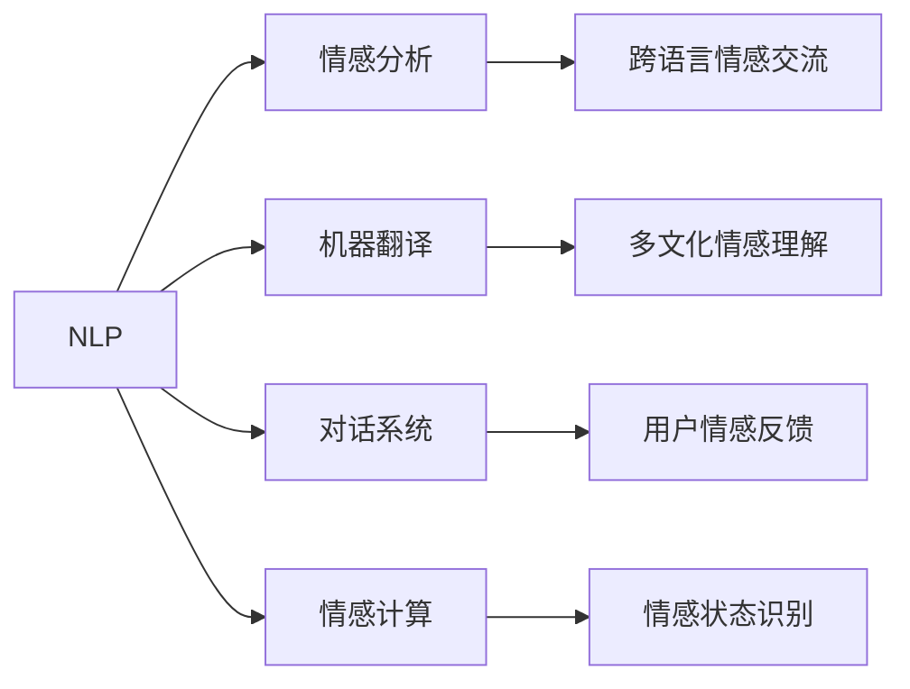

                 

# 数字化同理心：AI增强的情感连接

在数字化转型的浪潮下，情感连接变得比以往任何时候都更加重要。AI技术，尤其是自然语言处理(NLP)和深度学习模型，为增强人类情感连接提供了新的工具和方法。本文将探讨数字化同理心的概念，AI增强情感连接的核心技术，以及未来的发展趋势与挑战。

## 1. 背景介绍

### 1.1 问题由来
数字化同理心（Digital Empathy）是近年来随着数字化技术的进步，特别是人工智能（AI）技术的发展而提出的一个新概念。数字化同理心是指利用数字化手段增强人与人之间的情感连接，提升人类共情能力的实践。

数字化同理心的提出，源于两个重要的背景：
1. 数字化时代信息传递的快捷性和普惠性：互联网和移动设备的普及使得信息传递更加高效，人与人之间的连接更加紧密。
2. AI技术的进步：自然语言处理（NLP）、语音识别、计算机视觉等技术的快速发展，使得AI能够理解和生成丰富的情感表达，从而帮助人类在数字世界中实现更深入的情感交流。

### 1.2 问题核心关键点
数字化同理心的关键在于如何利用AI技术，特别是自然语言处理和情感分析技术，增强人类共情能力，实现更深层次的情感交流。关键问题包括：
- AI如何理解和生成情感表达？
- 如何在数字世界中建立真实、有效的情感连接？
- 如何应对数字化同理心的伦理挑战，保障数据隐私和用户安全？

## 2. 核心概念与联系

### 2.1 核心概念概述

为了更好地理解数字化同理心的概念，我们需要了解几个核心概念：

- **自然语言处理（NLP）**：涉及计算机理解和生成自然语言的能力，是数字化同理心中实现情感交流的基础。
- **情感分析（Sentiment Analysis）**：利用NLP技术识别和提取文本中的情感倾向和情绪强度。
- **机器翻译（Machine Translation）**：实现跨语言情感表达的理解和生成，促进不同文化背景的人之间的情感交流。
- **对话系统（Dialogue Systems）**：通过模拟人类对话，实现人与机器之间的情感交流，提升用户体验。
- **情感计算（Affective Computing）**：研究如何利用AI技术，尤其是NLP和计算机视觉，识别和理解人类情感状态，从而实现更深层次的情感交流。

这些概念之间的联系可以通过以下Mermaid流程图来展示：



这个流程图展示了大语言模型和数字化同理心的核心概念及其之间的关系：

1. NLP是数字化同理心的基础，通过理解自然语言，实现情感分析、机器翻译等功能。
2. 情感分析利用NLP技术识别情感倾向和强度，是情感计算的重要组成部分。
3. 机器翻译促进跨语言情感交流，实现多文化背景下的情感理解。
4. 对话系统通过模拟人类对话，提升情感交流的互动性。
5. 情感计算利用AI技术识别和理解人类情感状态，为更深层次的情感交流提供支持。

## 3. 核心算法原理 & 具体操作步骤

### 3.1 算法原理概述

数字化同理心的核心算法原理基于自然语言处理和情感分析技术，其核心思想是通过计算机理解和生成自然语言中的情感表达，增强人与人之间的情感连接。

### 3.2 算法步骤详解

数字化同理心通常包括以下几个关键步骤：

**Step 1: 数据收集和预处理**
- 收集包含情感表达的文本数据，如社交媒体帖子、用户评论、聊天日志等。
- 对数据进行清洗和标注，确保数据的准确性和一致性。

**Step 2: 情感分析模型训练**
- 使用情感分析算法（如LSTM、BERT等）训练情感分类模型，识别文本中的情感倾向和情绪强度。
- 使用大量标注数据进行训练，确保模型能够准确识别不同情感类别。

**Step 3: 对话系统构建**
- 利用对话生成模型（如Seq2Seq、Transformers等）构建对话系统，模拟人类对话。
- 训练对话系统，使其能够理解用户情感状态，并生成适当回应的文本。

**Step 4: 情感计算实现**
- 利用情感计算算法（如面部表情识别、语音情感分析等）识别用户情感状态。
- 结合自然语言和情感计算结果，实现更加全面和准确的情感状态理解。

**Step 5: 应用场景部署**
- 将训练好的情感分析、对话系统和情感计算模型部署到实际应用场景中。
- 集成到智能客服、社交媒体分析、情感识别等系统中，提升用户体验和情感交流效果。

### 3.3 算法优缺点

数字化同理心具有以下优点：
1. 提升情感交流效率：通过自动化情感分析和对话生成，缩短情感交流时间，提升用户体验。
2. 降低情感交流成本：减少人工介入，降低情感交流成本。
3. 增强情感理解深度：通过情感计算，深入理解人类情感状态，提升情感交流的层次。

同时，该方法也存在一定的局限性：
1. 依赖标注数据：情感分析模型的训练需要大量标注数据，获取高质量标注数据的成本较高。
2. 泛化能力不足：模型在不同文化背景和情感表达方式下的泛化能力有待提升。
3. 隐私和安全问题：情感数据的收集和处理涉及用户隐私，需要严格的隐私保护措施。
4. 伦理挑战：如何平衡AI对人类情感的模拟与人类自身的情感表达，避免过度依赖AI。

尽管存在这些局限性，但数字化同理心仍是大数据和AI技术的重要应用方向，具有广阔的发展前景。未来相关研究的重点在于如何进一步降低数据标注成本，提升模型泛化能力，同时兼顾隐私保护和伦理规范。

### 3.4 算法应用领域

数字化同理心已经在多个领域得到应用，例如：

- 智能客服：利用情感分析技术，提升客服系统对用户情感的识别和响应能力。
- 社交媒体分析：通过情感分析识别用户情感，进行情感趋势分析和用户情感引导。
- 心理健康支持：利用对话系统模拟心理医生，进行情感引导和治疗。
- 情感识别：结合自然语言和情感计算，识别用户情感状态，提供个性化推荐和服务。

除了上述这些经典应用外，数字化同理心还被创新性地应用到更多场景中，如智慧城市管理、在线教育、智能家居等，为人类社会的数字化进程提供了新的方向。

## 4. 数学模型和公式 & 详细讲解 & 举例说明

### 4.1 数学模型构建

数字化同理心的数学模型通常基于情感分析模型和对话生成模型。下面以情感分析模型为例，详细讲解其数学模型构建和公式推导。

假设输入文本为 $x$，情感分类器的输出为 $y$，情感分析模型的目标是最小化损失函数：

$$
\mathcal{L}(y, x) = -\sum_{i=1}^n (y_i \log P(y_i|x) + (1-y_i) \log (1-P(y_i|x)))
$$

其中 $P(y_i|x)$ 表示在输入文本 $x$ 下，情感类别 $y_i$ 的概率。

### 4.2 公式推导过程

情感分析模型的训练通常使用交叉熵损失函数。对于二分类问题，其损失函数为：

$$
\mathcal{L}(y, x) = -\sum_{i=1}^n (y_i \log P(y_i|x) + (1-y_i) \log (1-P(y_i|x)))
$$

其中 $y_i$ 为情感标签，$P(y_i|x)$ 为情感分类器的输出概率。

### 4.3 案例分析与讲解

以BERT模型为例，其情感分析模型的训练过程如下：
1. 收集标注数据，将文本 $x$ 和对应的情感标签 $y$ 构建成训练集。
2. 使用BERT模型对文本 $x$ 进行编码，得到文本的表示 $h_x$。
3. 将 $h_x$ 输入到全连接层，得到情感分类器的输出 $y$。
4. 使用交叉熵损失函数计算损失，反向传播更新模型参数。
5. 重复上述过程，直至模型收敛。

## 5. 项目实践：代码实例和详细解释说明

### 5.1 开发环境搭建

在进行数字化同理心开发前，我们需要准备好开发环境。以下是使用Python进行TensorFlow开发的环境配置流程：

1. 安装Anaconda：从官网下载并安装Anaconda，用于创建独立的Python环境。

2. 创建并激活虚拟环境：
```bash
conda create -n tensorflow-env python=3.8 
conda activate tensorflow-env
```

3. 安装TensorFlow：根据CUDA版本，从官网获取对应的安装命令。例如：
```bash
conda install tensorflow -c conda-forge
```

4. 安装各类工具包：
```bash
pip install numpy pandas scikit-learn matplotlib tqdm jupyter notebook ipython
```

完成上述步骤后，即可在`tensorflow-env`环境中开始数字化同理心的开发。

### 5.2 源代码详细实现

下面我们以情感分析任务为例，给出使用TensorFlow进行BERT模型训练的Python代码实现。

```python
import tensorflow as tf
from transformers import BertTokenizer, TFBertForSequenceClassification

# 初始化模型和分词器
tokenizer = BertTokenizer.from_pretrained('bert-base-cased')
model = TFBertForSequenceClassification.from_pretrained('bert-base-cased', num_labels=2)

# 定义训练数据
train_texts = ["I am happy.", "I am sad.", "I am angry.", "I am confused."]
train_labels = [1, 0, 1, 0]

# 数据预处理
tokenized_texts = [tokenizer.encode(text) for text in train_texts]
labels = tf.convert_to_tensor(train_labels)

# 模型训练
optimizer = tf.keras.optimizers.Adam(learning_rate=2e-5)
loss_fn = tf.keras.losses.SparseCategoricalCrossentropy(from_logits=True)
model.compile(optimizer=optimizer, loss=loss_fn, metrics=['accuracy'])

model.fit(tokenized_texts, labels, epochs=5)
```

以上是使用TensorFlow对BERT进行情感分析任务训练的完整代码实现。可以看到，使用TensorFlow和Transformer库可以很方便地实现情感分析模型的训练。

### 5.3 代码解读与分析

让我们再详细解读一下关键代码的实现细节：

**BERT模型的初始化**：
- 从HuggingFace官网下载预训练的BERT模型，并使用BertTokenizer初始化分词器。
- 使用TFBertForSequenceClassification将预训练的BERT模型转化为情感分析模型。

**数据预处理**：
- 将文本转换为分词器可以处理的token序列。
- 将标签转换为TensorFlow支持的格式。

**模型训练**：
- 定义优化器和学习率。
- 使用SparseCategoricalCrossentropy作为损失函数。
- 使用compile方法将模型编译为TensorFlow模型，并设置优化器和损失函数。
- 使用fit方法进行模型训练，设置训练轮数。

**代码解读与分析**：
- 数据预处理步骤中，tokenized_texts变量为每个文本的token序列，labels变量为对应的情感标签。
- 模型训练步骤中，使用Adam优化器进行模型参数更新，loss_fn为稀疏分类的交叉熵损失函数。

## 6. 实际应用场景

### 6.1 智能客服系统

数字化同理心在智能客服系统中具有广泛应用。传统的客服系统依赖人工处理，无法快速响应用户情感需求。通过使用情感分析技术，智能客服系统可以识别用户情感，并提供适当的情感回应，提升用户满意度。

在技术实现上，可以收集历史客服对话记录，训练情感分析模型，对新用户情感进行识别和分类。结合对话生成模型，生成适当的回复文本，从而实现情感导向的智能客服。

### 6.2 心理健康支持

心理健康支持是数字化同理心的一个重要应用领域。通过情感计算和对话生成技术，可以构建虚拟心理医生，帮助用户进行情感引导和治疗。

在实际应用中，用户可以通过聊天界面进行情感表达，系统通过情感计算识别用户情感状态，并使用对话生成模型提供适当的情感引导和支持。对于需要进一步干预的用户，系统可以提供专业的心理医生咨询。

### 6.3 社交媒体分析

社交媒体分析是数字化同理心在数据分析领域的重要应用。通过情感分析技术，可以实时监测社交媒体用户的情感状态，进行情感趋势分析和用户情感引导。

在实际应用中，系统可以实时抓取社交媒体上的用户评论和帖子，进行情感分析，识别用户情感状态和情感趋势。系统可以基于情感分析结果，提供情感引导策略，帮助用户改善情感状态。

### 6.4 未来应用展望

随着数字化同理心的不断发展，未来在更多领域将得到应用：

- 智慧城市管理：通过情感分析技术，实时监测城市居民情感状态，提供公共服务优化建议。
- 在线教育：通过情感计算技术，识别学生情感状态，提供个性化学习建议和心理辅导。
- 智能家居：通过情感识别技术，识别家庭成员情感状态，提供智能家居控制和情感支持。

此外，在企业生产、社会治理、文娱传媒等众多领域，数字化同理心也将不断涌现，为人类社会的数字化进程提供新的方向。

## 7. 工具和资源推荐

### 7.1 学习资源推荐

为了帮助开发者系统掌握数字化同理心的理论基础和实践技巧，这里推荐一些优质的学习资源：

1. 《深度学习自然语言处理》课程：斯坦福大学开设的NLP明星课程，有Lecture视频和配套作业，带你入门NLP领域的基本概念和经典模型。
2. 《自然语言处理实践》书籍：作者提供的实践指南，介绍了NLP技术的实际应用案例，包括情感分析和对话生成等。
3. 《情感计算》书籍：专注于情感计算领域的理论研究和应用实践，提供大量案例和算法。
4. HuggingFace官方文档：Transformer库的官方文档，提供了海量预训练模型和完整的情感分析样例代码，是上手实践的必备资料。
5. CLUE开源项目：中文语言理解测评基准，涵盖大量不同类型的中文NLP数据集，并提供了基于情感分析的baseline模型，助力中文NLP技术发展。

通过对这些资源的学习实践，相信你一定能够快速掌握数字化同理心的精髓，并用于解决实际的NLP问题。

### 7.2 开发工具推荐

高效的开发离不开优秀的工具支持。以下是几款用于数字化同理心开发的常用工具：

1. TensorFlow：基于Python的开源深度学习框架，灵活动态的计算图，适合快速迭代研究。大部分预训练语言模型都有TensorFlow版本的实现。
2. PyTorch：基于Python的开源深度学习框架，动态计算图，适合科研和生产。
3. Transformers库：HuggingFace开发的NLP工具库，集成了众多SOTA语言模型，支持TensorFlow和PyTorch，是进行情感分析任务的开发利器。
4. Weights & Biases：模型训练的实验跟踪工具，可以记录和可视化模型训练过程中的各项指标，方便对比和调优。与主流深度学习框架无缝集成。
5. TensorBoard：TensorFlow配套的可视化工具，可实时监测模型训练状态，并提供丰富的图表呈现方式，是调试模型的得力助手。

合理利用这些工具，可以显著提升数字化同理心任务的开发效率，加快创新迭代的步伐。

### 7.3 相关论文推荐

数字化同理心技术的发展源于学界的持续研究。以下是几篇奠基性的相关论文，推荐阅读：

1. Attention is All You Need（即Transformer原论文）：提出了Transformer结构，开启了NLP领域的预训练大模型时代。
2. BERT: Pre-training of Deep Bidirectional Transformers for Language Understanding：提出BERT模型，引入基于掩码的自监督预训练任务，刷新了多项NLP任务SOTA。
3. Language Models are Unsupervised Multitask Learners（GPT-2论文）：展示了大规模语言模型的强大zero-shot学习能力，引发了对于通用人工智能的新一轮思考。
4. Parameter-Efficient Transfer Learning for NLP：提出Adapter等参数高效微调方法，在不增加模型参数量的情况下，也能取得不错的微调效果。
5. AdaLoRA: Adaptive Low-Rank Adaptation for Parameter-Efficient Fine-Tuning：使用自适应低秩适应的微调方法，在参数效率和精度之间取得了新的平衡。

这些论文代表了大语言模型微调技术的发展脉络。通过学习这些前沿成果，可以帮助研究者把握学科前进方向，激发更多的创新灵感。

## 8. 总结：未来发展趋势与挑战

### 8.1 总结

本文对数字化同理心的概念、核心技术及其应用进行了全面系统的介绍。首先阐述了数字化同理心的背景和意义，明确了数字化同理心的核心技术和应用场景。其次，从原理到实践，详细讲解了情感分析模型的训练和应用，给出了完整的代码实现。同时，本文还探讨了数字化同理心的未来发展方向和面临的挑战，强调了技术创新的重要性和面临的伦理挑战。

通过本文的系统梳理，可以看到，数字化同理心技术在NLP领域的应用前景广阔，有望在多个领域带来变革性影响。但如何将强大的性能转化为稳定、高效、安全的业务价值，还需要工程实践的不断打磨。相信随着技术的不断进步，数字化同理心必将在构建人机协同的智能时代中扮演越来越重要的角色。

### 8.2 未来发展趋势

展望未来，数字化同理心技术将呈现以下几个发展趋势：

1. 情感计算和对话系统技术进一步提升：通过引入更多先验知识，如知识图谱、逻辑规则等，实现更加全面和准确的情感状态理解。同时加强不同模态数据的整合，实现视觉、语音等多模态信息与文本信息的协同建模。
2. 用户情感引导策略的优化：通过深度学习模型，实时分析用户情感状态，提供个性化、动态的情感引导策略，提升用户情感体验。
3. 情感分析模型的泛化能力增强：通过引入无监督和半监督学习范式，最大程度利用非结构化数据，降低标注成本，提升模型泛化能力。
4. 隐私保护和伦理规范的加强：在情感数据的收集和处理过程中，严格保护用户隐私，制定明确的伦理规范，确保情感计算技术的安全和可信。

以上趋势凸显了数字化同理心技术的广阔前景。这些方向的探索发展，必将进一步提升NLP系统的性能和应用范围，为人类认知智能的进化带来深远影响。

### 8.3 面临的挑战

尽管数字化同理心技术已经取得了瞩目成就，但在迈向更加智能化、普适化应用的过程中，它仍面临诸多挑战：

1. 标注成本瓶颈：虽然情感分析模型的训练需要大量标注数据，获取高质量标注数据的成本较高。如何进一步降低标注成本，降低用户情感数据的收集门槛，将是重要研究方向。
2. 情感计算模型的泛化能力不足：模型在不同文化背景和情感表达方式下的泛化能力有待提升。如何构建更加普适、鲁棒的情感计算模型，提升模型的跨文化适应性，将是未来研究的重点。
3. 隐私和安全问题：情感数据的收集和处理涉及用户隐私，需要严格的隐私保护措施。如何保障数据安全，防止数据泄露，将是未来研究的重要课题。
4. 伦理挑战：如何平衡AI对人类情感的模拟与人类自身的情感表达，避免过度依赖AI。如何在情感引导过程中，确保用户自主性和隐私权，将是未来研究的难点。

### 8.4 研究展望

面对数字化同理心所面临的种种挑战，未来的研究需要在以下几个方面寻求新的突破：

1. 探索无监督和半监督学习范式：摆脱对大规模标注数据的依赖，利用自监督学习、主动学习等无监督和半监督范式，最大限度利用非结构化数据，实现更加灵活高效的情感分析。
2. 研究参数高效和计算高效的情感分析方法：开发更加参数高效的情感分析方法，在固定大部分预训练参数的情况下，只更新极少量的任务相关参数。同时优化情感计算模型的计算图，减少前向传播和反向传播的资源消耗，实现更加轻量级、实时性的部署。
3. 引入因果分析和博弈论工具：将因果分析方法引入情感分析模型，识别出情感状态的关键特征，增强情感计算模型的可解释性和逻辑性。借助博弈论工具刻画人机交互过程，主动探索并规避情感计算模型的脆弱点，提高系统稳定性。
4. 纳入伦理道德约束：在情感分析模型的训练目标中引入伦理导向的评估指标，过滤和惩罚有偏见、有害的情感输出倾向。加强人工干预和审核，建立情感计算模型的监管机制，确保输出符合人类价值观和伦理道德。

这些研究方向的探索，必将引领数字化同理心技术迈向更高的台阶，为构建安全、可靠、可解释、可控的智能系统铺平道路。面向未来，数字化同理心技术还需要与其他人工智能技术进行更深入的融合，如知识表示、因果推理、强化学习等，多路径协同发力，共同推动自然语言理解和智能交互系统的进步。只有勇于创新、敢于突破，才能不断拓展数字化同理心的边界，让智能技术更好地造福人类社会。

## 9. 附录：常见问题与解答

**Q1: 如何理解数字化同理心的概念？**

A: 数字化同理心是指利用数字化手段增强人与人之间的情感连接，提升人类共情能力。其核心在于通过计算机理解和生成自然语言中的情感表达，实现更深层次的情感交流。

**Q2: 情感分析模型训练需要哪些步骤？**

A: 情感分析模型的训练通常包括以下步骤：数据收集和预处理、模型初始化、损失函数定义、优化器选择、训练过程、模型评估。具体实现时，需要选择合适的预训练模型，如BERT，并进行微调，以适应特定的情感分类任务。

**Q3: 情感计算技术在实际应用中有哪些难点？**

A: 情感计算技术在实际应用中面临以下难点：
1. 情感表达方式多样：不同文化背景和个体差异使得情感表达方式复杂多样，如何构建普适的情感计算模型，是个重要挑战。
2. 数据标注成本高：情感计算模型的训练需要大量标注数据，标注成本高昂。
3. 隐私和安全问题：情感数据的收集和处理涉及用户隐私，需要严格的隐私保护措施。

**Q4: 数字化同理心在未来有哪些潜在应用？**

A: 数字化同理心在未来有很多潜在应用，包括：
1. 智能客服：通过情感分析技术，提升客服系统对用户情感的识别和响应能力。
2. 心理健康支持：通过情感计算技术，构建虚拟心理医生，提供情感引导和治疗。
3. 社交媒体分析：通过情感分析技术，实时监测社交媒体用户的情感状态，进行情感趋势分析和用户情感引导。

---

作者：禅与计算机程序设计艺术 / Zen and the Art of Computer Programming

