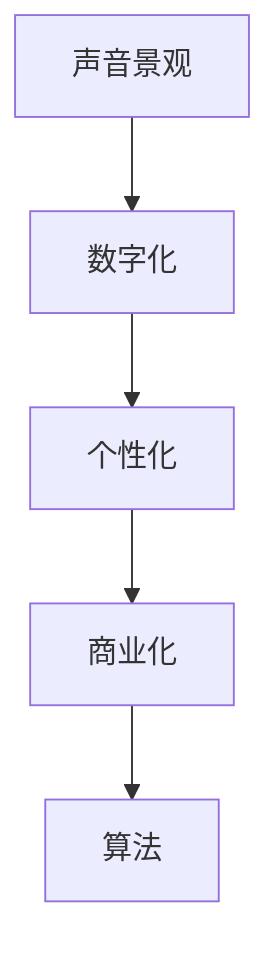

                 

# 数字化声音景观创业：定制化的听觉环境

在数字时代，声音不再仅仅是人们沟通的介质，而是可以成为一种独特的艺术形式和商业产品。数字化声音景观创业，即为消费者提供定制化的听觉环境，满足他们对声音的多样化需求，同时提升品牌体验和营销效果。本文将探讨这一创业领域，从核心概念、算法原理、实践操作、实际应用场景等多个角度进行深入分析。

## 1. 背景介绍

### 1.1 问题由来

随着数字技术的进步和消费者需求的多样化，人们对声音的追求已从基本的通话和播放音乐，扩展到更加个性化和定制化的听觉体验。传统的声音内容生产方式往往满足不了这一需求，因此数字化声音景观创业应运而生。它通过利用先进的数字技术和声学算法，为用户提供量身定制的声音环境，从而在市场上脱颖而出。

### 1.2 问题核心关键点

数字化声音景观创业的核心关键点包括：
- 个性化：根据用户需求提供定制化的声音体验。
- 数字化：利用数字技术和算法处理声音数据。
- 商业化：将声音景观转化为商业产品，满足市场需求。
- 体验提升：通过声音景观提升用户的整体体验。

### 1.3 问题研究意义

数字化声音景观创业对于声音产业的创新和消费者体验的提升具有重要意义：
- 提升用户粘性：通过个性化的声音环境，提升用户对品牌的忠诚度和粘性。
- 增强营销效果：通过创新的声音体验，吸引用户注意，提升品牌曝光率。
- 推动声音产业创新：将传统声音内容生产方式向个性化和定制化转变，开拓新的市场需求。

## 2. 核心概念与联系

### 2.1 核心概念概述

数字化声音景观创业涉及多个核心概念：

- **声音景观(Soundscape)**：指环境中声音的总体和细节，包括自然声音、人造声音、音乐、语言等多种声音类型。
- **数字化**：指将声音信息转换为数字形式，便于处理和存储。
- **个性化**：根据用户需求定制化声音景观。
- **商业化**：将声音景观产品化，推向市场。
- **算法**：包括声学算法、机器学习算法等，用于处理和生成声音数据。

这些概念相互联系，共同构成了数字化声音景观创业的基础。

### 2.2 核心概念原理和架构的 Mermaid 流程图



## 3. 核心算法原理 & 具体操作步骤

### 3.1 算法原理概述

数字化声音景观创业的算法原理主要基于声音信号的数字化处理和个性化的声学算法。通过数字化处理，将声音信息转换为数字形式，便于存储和传输。然后，利用声学算法对声音数据进行处理，实现个性化的声音景观。

### 3.2 算法步骤详解

#### 3.2.1 声音采集与预处理

1. **声音采集**：使用麦克风或音频采集设备获取声音信号。
2. **预处理**：包括降噪、音量调节、滤波等预处理操作，提升声音质量。

#### 3.2.2 声音数字化

1. **采样**：将连续时间的声音信号采样为离散时间信号。
2. **量化**：将采样后的声音信号转换为数字形式。
3. **编码**：使用压缩算法对数字化后的声音进行编码压缩，便于存储和传输。

#### 3.2.3 声音特征提取

1. **频谱分析**：通过快速傅里叶变换(FFT)等算法，将时间域的声音信号转换为频域的频谱图。
2. **能量分布**：计算声音信号在不同频率上的能量分布，提取声音的基本特征。

#### 3.2.4 个性化声学算法

1. **聚类算法**：通过聚类算法对用户声音偏好进行分类，如K-means、DBSCAN等。
2. **生成对抗网络(GAN)**：利用GAN生成与用户偏好相匹配的声音样本。
3. **自回归模型(AR)**：通过AR模型对声音信号进行预测和生成。

#### 3.2.5 声音景观合成

1. **多源混音**：将多种声音源混合，生成个性化的声音景观。
2. **音色合成**：利用声音合成技术，如Wavetable合成器、FM合成器等，生成符合用户偏好的声音。

### 3.3 算法优缺点

**优点**：
- **高度个性化**：通过声学算法实现高度个性化的声音景观。
- **技术先进**：利用数字化和机器学习技术，提升声音处理的精度和效率。
- **市场潜力**：满足用户多样化的声音需求，市场需求大。

**缺点**：
- **技术复杂**：需要掌握多种声学和数字处理算法。
- **成本较高**：设备和算法的投入较高，初期成本较大。
- **市场教育**：需要市场教育和用户培养，推广难度大。

### 3.4 算法应用领域

数字化声音景观创业的应用领域包括：
- 商业广告：通过个性化的声音景观提升广告效果。
- 游戏娱乐：在虚拟环境中提供定制化的声音体验。
- 家居环境：根据用户偏好定制家居环境中的声音。
- 交通出行：为驾驶者提供个性化的车载声音景观。

## 4. 数学模型和公式 & 详细讲解

### 4.1 数学模型构建

数字化声音景观创业的数学模型主要涉及声音信号的数字化处理和个性化的声学算法。具体数学模型如下：

#### 4.1.1 声音信号的数字化

声音信号的数字化处理包括采样、量化和编码三个步骤。其数学模型如下：

$$
y[n] = \{x[n] \in \mathbb{R}\} \rightarrow x[n] \rightarrow x[n] \times \Delta t \rightarrow x[n] \rightarrow x[n] \rightarrow Q \rightarrow E
$$

其中，$y[n]$ 表示数字化后的声音信号，$\Delta t$ 表示采样间隔，$x[n]$ 表示采样后的声音信号，$Q$ 表示量化后的声音信号，$E$ 表示编码后的声音信号。

#### 4.1.2 声音特征提取

声音特征提取的主要方法包括频谱分析和能量分布。其数学模型如下：

$$
X(f) = \sum_{n=-\infty}^{\infty} x[n] e^{-j 2 \pi f n \Delta t}
$$

其中，$X(f)$ 表示声音信号的频谱图，$f$ 表示频率，$j$ 表示虚数单位。

### 4.2 公式推导过程

#### 4.2.1 声音信号的数字化

声音信号的数字化公式推导如下：

$$
x[n] = \sum_{k=-\infty}^{\infty} y[k] h[n-k]
$$

其中，$x[n]$ 表示采样后的声音信号，$y[k]$ 表示数字化后的声音信号，$h[n]$ 表示采样窗口。

#### 4.2.2 声音特征提取

声音特征提取的公式推导如下：

$$
X(f) = \mathcal{F}\{x[n]\}
$$

其中，$\mathcal{F}$ 表示傅里叶变换。

### 4.3 案例分析与讲解

以一个简单的音频编辑为例，介绍声音信号的数字化和特征提取过程。

**案例背景**：
- 输入声音信号：一段时长为1秒的音乐片段。
- 采样频率：44.1kHz。
- 采样间隔：1/44100秒。

**步骤1：声音信号的数字化**

1. **采样**：对输入的声音信号进行采样，生成离散时间信号。
2. **量化**：将采样后的声音信号进行量化，转换为数字形式。
3. **编码**：使用压缩算法对量化后的声音信号进行编码压缩。

**步骤2：声音特征提取**

1. **频谱分析**：使用快速傅里叶变换(FFT)将时间域的声音信号转换为频域的频谱图。
2. **能量分布**：计算声音信号在不同频率上的能量分布。

## 5. 项目实践：代码实例和详细解释说明

### 5.1 开发环境搭建

在搭建开发环境前，需要准备以下工具和资源：

1. **编程语言**：Python。
2. **音频处理库**：PyAudio、librosa、scipy等。
3. **数据处理库**：NumPy、Pandas等。
4. **机器学习库**：Scikit-learn、TensorFlow等。

### 5.2 源代码详细实现

以下是利用Python和librosa库实现声音信号数字化和特征提取的示例代码：

```python
import librosa
import numpy as np

# 加载音频文件
audio_file = 'example.mp3'
audio, sr = librosa.load(audio_file, sr=44100)

# 声音信号的数字化
samples = np.int16(audio)
audio_data = librosa.resample(samples, sr, 8000)

# 声音特征提取
X = librosa.stft(audio_data)
magnitude, phase = librosa.magnitude_to_db(X, ref=np.max)

# 显示频谱图
import matplotlib.pyplot as plt
plt.figure(figsize=(8, 4))
plt.subplot(1, 2, 1)
plt.imshow(magnitude, aspect='auto', origin='lower')
plt.title('Spectrogram')
plt.colorbar()
plt.subplot(1, 2, 2)
plt.imshow(np.angle(X), aspect='auto', origin='lower')
plt.title('Phase Spectrum')
plt.colorbar()
plt.show()
```

### 5.3 代码解读与分析

在上述代码中，我们首先使用librosa库加载音频文件，并将采样频率调整为8000Hz。然后，将采样后的声音信号进行量化，转换为16位整数形式。接着，使用librosa库的STFT函数计算频谱图，最后使用Matplotlib库绘制频谱图和相位图。

## 6. 实际应用场景

### 6.1 商业广告

在商业广告中，利用数字化声音景观创业，可以通过个性化的声音景观提升广告效果。例如，一家饮料品牌可以根据消费者的声音偏好，定制化广告中的背景音乐和广告语，增加广告的吸引力和记忆度。

### 6.2 游戏娱乐

在游戏娱乐中，数字化声音景观创业可以为玩家提供个性化的游戏背景音乐和音效。例如，一个音乐游戏可以根据玩家的选择，生成符合其口味的音乐和节奏，提升游戏的沉浸感和乐趣。

### 6.3 家居环境

在家居环境中，数字化声音景观创业可以根据用户偏好定制化家居环境中的声音。例如，一个智能音箱可以根据用户的日常习惯，自动播放喜欢的背景音乐或新闻广播，提升用户的生活体验。

### 6.4 未来应用展望

未来，数字化声音景观创业将面临更多应用场景和技术挑战：

1. **智能家居**：通过与智能家居设备的融合，为家居环境提供个性化的声音景观。
2. **虚拟现实**：在虚拟现实应用中，利用数字化声音景观提升用户的沉浸感和交互体验。
3. **个性化推荐**：根据用户的音乐偏好和行为数据，推荐个性化的音乐和声音景观。
4. **健康应用**：利用声音信号处理技术，提供个性化的心理健康支持，如放松音乐、白噪音等。

## 7. 工具和资源推荐

### 7.1 学习资源推荐

为了帮助开发者深入理解数字化声音景观创业，以下是一些推荐的学习资源：

1. **《数字信号处理》**：介绍数字信号处理的理论和方法，适合初学者和进阶者。
2. **《Python Audio Library: Getting Started with PyAudio》**：介绍PyAudio库的使用，适合音频处理的入门学习者。
3. **《Hands-On Machine Learning with Scikit-Learn, Keras, and TensorFlow》**：介绍机器学习库的使用，适合对机器学习感兴趣的学习者。
4. **《Machine Learning for Neuroscientists》**：介绍机器学习在神经科学中的应用，适合跨领域学习者。
5. **《Deep Learning with Python》**：介绍深度学习的应用，适合对深度学习感兴趣的学习者。

### 7.2 开发工具推荐

以下是一些用于数字化声音景观创业的开发工具：

1. **PyAudio**：Python库，用于音频处理和录制。
2. **librosa**：Python库，用于音频特征提取和处理。
3. **Scikit-learn**：Python库，用于机器学习算法实现。
4. **TensorFlow**：开源深度学习框架，适合大规模数据处理和模型训练。
5. **Keras**：高层次深度学习框架，适合快速原型设计和模型验证。

### 7.3 相关论文推荐

以下是几篇与数字化声音景观创业相关的研究论文，推荐阅读：

1. **Audio Spectrograms in the Study of Music and Cognition**：研究音频频谱图在音乐认知中的应用。
2. **Speech Enhancement in Noisy Environments Using Deep Learning**：研究深度学习在噪声环境下的语音增强技术。
3. **Personalized Audio Recommendation System Using Deep Learning**：研究基于深度学习的个性化音频推荐系统。
4. **Generative Adversarial Networks for Music Generation**：研究GAN在音乐生成中的应用。

## 8. 总结：未来发展趋势与挑战

### 8.1 研究成果总结

数字化声音景观创业在近年来取得了一些重要研究成果：

1. **个性化声音景观**：通过声学算法和机器学习技术，实现高度个性化的声音景观。
2. **声音特征提取**：利用频谱分析和能量分布等方法，提取声音的基本特征。
3. **声音信号处理**：开发高效的音频处理算法，提升声音信号的处理精度和效率。

### 8.2 未来发展趋势

未来，数字化声音景观创业将面临以下发展趋势：

1. **技术融合**：与物联网、人工智能等技术融合，提升声音景观的智能化水平。
2. **用户体验**：提升用户的使用体验，如声音调节、环境控制等。
3. **市场拓展**：拓展更多的应用场景，如健康应用、智能家居等。

### 8.3 面临的挑战

数字化声音景观创业也面临一些挑战：

1. **技术复杂性**：需要掌握多种声学和数字处理技术。
2. **数据隐私**：需要保护用户的声音隐私，防止数据泄露。
3. **市场教育**：需要向市场和用户普及数字化声音景观的概念和技术。

### 8.4 研究展望

未来，数字化声音景观创业需要在以下几个方面进行研究：

1. **声音信号压缩**：开发更高效的音频压缩算法，减小数据存储和传输的资源消耗。
2. **用户行为分析**：研究用户对声音景观的反应，优化声音景观设计。
3. **跨模态交互**：实现声音与视觉、触觉等多模态交互，提升用户体验。

## 9. 附录：常见问题与解答

**Q1：如何实现个性化声音景观？**

A: 实现个性化声音景观主要通过声学算法和机器学习算法。首先，通过聚类算法对用户声音偏好进行分类，然后利用生成对抗网络(GAN)生成符合用户偏好的声音样本，最后通过多源混音和音色合成等技术，生成个性化的声音景观。

**Q2：在数字化声音景观创业中，如何处理噪声干扰？**

A: 在数字化声音景观创业中，可以通过降噪算法处理噪声干扰。常用的降噪算法包括Wiener滤波、谱减法等。同时，可以通过降噪前后声音信号的对比，评估降噪效果。

**Q3：如何降低数字化声音景观创业的成本？**

A: 降低数字化声音景观创业的成本主要从以下几个方面入手：
1. **优化算法**：开发更高效的音频处理算法，减小计算资源消耗。
2. **压缩技术**：利用音频压缩技术，减小声音数据的存储和传输资源消耗。
3. **开源工具**：使用开源工具和库，降低技术实现成本。

**Q4：数字化声音景观创业在实际应用中面临哪些挑战？**

A: 数字化声音景观创业在实际应用中面临以下挑战：
1. **技术复杂性**：需要掌握多种声学和数字处理技术。
2. **数据隐私**：需要保护用户的声音隐私，防止数据泄露。
3. **市场教育**：需要向市场和用户普及数字化声音景观的概念和技术。

**Q5：如何提高数字化声音景观创业的市场竞争力？**

A: 提高数字化声音景观创业的市场竞争力主要从以下几个方面入手：
1. **技术创新**：不断研发新的声学算法和音频处理技术，保持技术领先。
2. **用户体验**：提升用户的使用体验，如声音调节、环境控制等。
3. **市场推广**：通过多种渠道进行市场推广，提高品牌知名度。

---

作者：禅与计算机程序设计艺术 / Zen and the Art of Computer Programming

