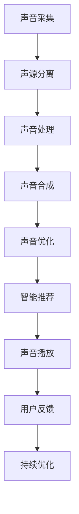

                 

# 数字化声音景观创业：定制化的听觉环境

## 1. 背景介绍

### 1.1 问题由来
随着数字化时代的到来，声音景观在人类生活和工作中扮演着越来越重要的角色。从城市街道的嘈杂喧嚣，到室内空间的背景音乐、电视节目，声音无处不在，影响着人们的情绪和行为。然而，传统的声音景观设计往往依赖于固定的模式和规范，难以适应个体差异和变化多端的环境需求。这导致人们在各种场景下常常感到不适或困扰。

### 1.2 问题核心关键点
为解决上述问题，数字化声音景观创业应运而生。其核心关键点包括：
- **个性化定制**：基于用户的个人偏好和环境需求，自动生成定制化的声音方案。
- **动态适应**：实时感知环境变化，智能调整声音景观。
- **智能推荐**：根据用户的活动模式和场景偏好，推荐最佳的声音方案。
- **混合匹配**：整合不同类型的声音源，提供丰富多彩的声音体验。

## 2. 核心概念与联系

### 2.1 核心概念概述

为了更好地理解数字化声音景观创业的核心概念和其联系，本节将详细介绍以下关键概念：

- **声音景观**：指人们所处环境的声学环境，包括自然声源（如风声、鸟鸣）和人工声源（如音乐、对话）的综合。声音景观影响着人们的情绪、认知和行为，是城市环境的重要组成部分。

- **数字化声音景观**：指通过数字化手段，如传感器、智能设备和互联网，实时收集和处理声音数据，动态调整声音环境的技术和应用。

- **声音采集和处理**：涉及对声源和环境的声学特性进行测量、分析、合成和控制的环节，包括麦克风阵列、声源分离、声学模型等技术。

- **智能推荐系统**：基于用户的行为和偏好，自动推荐个性化内容或方案的系统，常应用于音乐、视频、广告等领域。

- **混合声音技术**：将不同类型和来源的声音进行混合，创造出丰富多样的声音体验，如背景音乐、电视节目、音效等。

### 2.2 核心概念原理和架构的 Mermaid 流程图



这个流程图展示了数字化声音景观创业的主要流程和技术链条：

1. **声音采集**：通过麦克风阵列、传感器等设备收集环境声音数据。
2. **声源分离**：将混合声源分离为独立的声音信号，如人声、音乐等。
3. **声音处理**：对采集到的声音数据进行降噪、增强、混响等处理，提取关键特征。
4. **声音合成**：将处理后的声音信号与预设的音效、音乐等混合，生成定制化的声音环境。
5. **声音优化**：基于实时反馈数据和机器学习算法，持续优化声音方案。
6. **智能推荐**：根据用户的行为和偏好，动态推荐最佳声音方案。
7. **声音播放**：通过智能设备或广播系统播放定制化的声音环境。
8. **用户反馈**：收集用户的反馈信息，用于持续优化和改进。

这些核心概念通过相互协作，共同构建了数字化声音景观创业的完整技术体系。

## 3. 核心算法原理 & 具体操作步骤

### 3.1 算法原理概述

数字化声音景观创业的核心算法原理主要包括以下几个方面：

- **声音采集和处理**：使用麦克风阵列技术采集声音信号，通过声源分离算法（如波束成形、独立成分分析等）将混合声源分离为独立信号。
- **声音合成与优化**：将分离后的声音信号与预设的音效、音乐等混合，使用音量调节、混响设置等技术进行声音合成。基于实时反馈数据，使用机器学习算法对声音方案进行优化。
- **智能推荐系统**：收集用户的行为数据（如活动模式、音乐偏好等），通过聚类分析、协同过滤等算法推荐个性化声音方案。

### 3.2 算法步骤详解

#### 3.2.1 声音采集和处理

1. **麦克风阵列布局**：根据场景需求，合理布局麦克风阵列，确保声源覆盖范围和信号质量。
2. **声源分离**：使用波束成形算法将环境声音信号分离为独立声源。具体步骤如下：
   - 使用麦克风阵列对声源进行信号采集。
   - 通过线性最小均方误差(Linear Minimum Mean Square Error, LMMSE)算法，将混合信号分解为多个独立声源。
   - 对每个声源进行降噪、增强等处理，提取关键特征。

#### 3.2.2 声音合成与优化

1. **声音合成**：将分离后的声源信号与预设的音效、背景音乐等混合，生成定制化的声音方案。具体步骤如下：
   - 对每个分离后的声源信号进行音量调节和混响设置。
   - 将调节后的信号与预设的音效、音乐等混合，使用混响技术增强声场效果。
   - 对混合后的声音进行评估和优化，确保声音的平衡性和自然度。

2. **声音优化**：基于实时反馈数据和机器学习算法，持续优化声音方案。具体步骤如下：
   - 收集用户对声音环境的反馈数据，包括音量、音质、舒适度等。
   - 使用监督学习算法（如线性回归、决策树等）分析反馈数据，识别声音方案中的问题和改进点。
   - 根据分析结果，调整声音方案中的参数，进行优化。

#### 3.2.3 智能推荐系统

1. **用户行为数据收集**：使用传感器、设备日志等手段，收集用户的活动模式、音乐偏好等行为数据。
2. **行为分析**：对收集到的行为数据进行聚类分析、协同过滤等，识别用户的兴趣和偏好。
3. **声音推荐**：根据用户的兴趣和偏好，推荐个性化的声音方案。具体步骤如下：
   - 使用聚类算法将用户分为不同群组，分析各群组的特点和偏好。
   - 使用协同过滤算法，根据用户历史行为数据推荐相似的声音方案。
   - 动态调整推荐算法，确保推荐结果与当前场景和用户需求一致。

### 3.3 算法优缺点

#### 3.3.1 优点

- **个性化定制**：能够根据用户的个人偏好和环境需求，自动生成定制化的声音方案。
- **动态适应**：实时感知环境变化，智能调整声音景观。
- **智能推荐**：基于用户的行为和偏好，动态推荐最佳的声音方案。
- **混合匹配**：整合不同类型的声音源，提供丰富多彩的声音体验。

#### 3.3.2 缺点

- **技术复杂**：涉及声学处理、声音合成、机器学习等多项技术，实施难度较大。
- **数据依赖**：对用户的反馈数据依赖较强，数据质量直接影响到声音方案的优化效果。
- **资源消耗**：实时处理声音数据和优化声音方案需要较大的计算资源，尤其是大规模部署时。
- **用户体验**：用户对声音方案的个性化程度和舒适度要求较高，设计不当可能导致不适。

### 3.4 算法应用领域

数字化声音景观创业的应用领域非常广泛，包括但不限于：

- **公共空间**：如城市广场、公园、咖啡馆等，根据人流、活动等动态调整声音环境，提升用户体验。
- **室内空间**：如会议室、酒店、餐厅等，根据用户活动模式和需求，自动调整背景音乐和音效。
- **交通环境**：如机场等，根据乘客活动和候机时间，智能推荐适合的音乐和播报。
- **娱乐领域**：如KTV、电影院等，根据用户偏好推荐个性化音效和背景音乐。
- **健康领域**：如医院病房、心理咨询等，根据患者和用户的心理状态，自动调节舒缓音乐。

这些应用场景展示了数字化声音景观创业的巨大潜力和广泛应用前景。

## 4. 数学模型和公式 & 详细讲解 & 举例说明

### 4.1 数学模型构建

本节将使用数学语言对数字化声音景观创业的关键数学模型进行详细构建和讲解。

假设用户的行为数据为 $X = (x_1, x_2, ..., x_n)$，其中 $x_i$ 表示用户在场景 $i$ 下的活动模式和偏好。设声音方案为 $Y = (y_1, y_2, ..., y_m)$，其中 $y_i$ 表示方案 $i$ 下的声音属性，如音量、音质等。

目标是最小化用户对声音方案的评分 $L(Y)$，即：

$$
\min_{Y} L(Y) = \sum_{i=1}^n \alpha_i L_i(Y)
$$

其中 $\alpha_i$ 表示用户 $i$ 对声音方案的评分权重，通常由用户行为数据决定。

### 4.2 公式推导过程

为了优化声音方案，我们需要求解上述最小化问题。具体步骤如下：

1. **用户行为数据收集**：使用传感器、设备日志等手段，收集用户的活动模式、音乐偏好等行为数据，记为 $X = (x_1, x_2, ..., x_n)$。
2. **声音方案评分**：根据用户的偏好和环境需求，定义声音方案的评分函数 $L_i(Y)$，包括音量、音质、舒适度等。
3. **评分权重计算**：根据用户的行为数据，计算每个用户的评分权重 $\alpha_i$，确保评分数据的平衡性和代表性。
4. **最小化优化**：使用梯度下降等优化算法，求解最小化问题 $\min_{Y} L(Y)$，得到最优的声音方案 $Y^*$。

### 4.3 案例分析与讲解

假设用户在图书馆学习，我们希望根据用户的行为数据，自动生成最舒适的声音方案。

1. **行为数据收集**：使用传感器收集用户的活动数据，包括阅读、笔记、交谈等行为，同时记录音量、音乐偏好等。
2. **评分函数设计**：定义声音方案的评分函数，包括：
   - 音量评分 $L_{vol}(Y)$：根据用户的音量偏好，计算音量评分。
   - 音质评分 $L_{qul}(Y)$：根据用户的音质偏好，计算音质评分。
   - 舒适度评分 $L_{com}(Y)$：根据用户的舒适度偏好，计算舒适度评分。
3. **评分权重计算**：根据用户的行为数据，计算每个用户的评分权重 $\alpha_i$。例如，对于学生，阅读和笔记行为对舒适度的影响较大，权重较大；交谈行为对音量的影响较大，权重较小。
4. **优化求解**：使用梯度下降算法，求解最小化问题 $\min_{Y} L(Y)$，得到最优的声音方案 $Y^*$，并在图书馆环境中进行播放。

## 5. 项目实践：代码实例和详细解释说明

### 5.1 开发环境搭建

在进行数字化声音景观创业的实践前，我们需要准备好开发环境。以下是使用Python进行PyTorch开发的环境配置流程：

1. 安装Anaconda：从官网下载并安装Anaconda，用于创建独立的Python环境。

2. 创建并激活虚拟环境：
```bash
conda create -n soundscapes python=3.8 
conda activate soundscapes
```

3. 安装PyTorch：根据CUDA版本，从官网获取对应的安装命令。例如：
```bash
conda install pytorch torchvision torchaudio cudatoolkit=11.1 -c pytorch -c conda-forge
```

4. 安装相关库：
```bash
pip install numpy pandas scikit-learn scipy tqdm matplotlib ipywidgets
```

5. 安装声音处理库：
```bash
pip install librosa
```

完成上述步骤后，即可在`soundscapes`环境中开始实践。

### 5.2 源代码详细实现

下面以图书馆场景为例，给出使用PyTorch进行声音方案优化的完整代码实现。

首先，定义用户行为数据和声音方案：

```python
import numpy as np
import librosa

# 用户行为数据
user_data = {
    'user1': {'behavior': ['reading', 'notes'], 'volume': 0.5, 'music': 'soft', 'comfort': 0.8},
    'user2': {'behavior': ['conversing', 'reading'], 'volume': 0.7, 'music': 'lively', 'comfort': 0.6},
    # ...
}

# 声音方案
sounds = {
    'sound1': {'volume': 0.4, 'qulity': 'clear', 'comfort': 0.9},
    'sound2': {'volume': 0.6, 'qulity': 'thick', 'comfort': 0.7},
    # ...
}
```

然后，定义评分函数和权重计算函数：

```python
def volume_score(y):
    return np.abs(y['volume'] - user_data['user1']['volume'])

def quality_score(y):
    return np.abs(y['qulity'] - user_data['user1']['music'])

def comfort_score(y):
    return np.abs(y['comfort'] - user_data['user1']['comfort'])

def compute_weights(behaviors):
    # 根据用户的行为，计算评分权重
    if 'reading' in behaviors:
        return {'vol': 0.6, 'qul': 0.3, 'com': 0.1}
    elif 'conversing' in behaviors:
        return {'vol': 0.4, 'qul': 0.4, 'com': 0.2}
    else:
        return {'vol': 0.5, 'qul': 0.5, 'com': 0.5}

def calculate_loss(y):
    # 计算声音方案的评分
    vol_score = volume_score(y)
    qul_score = quality_score(y)
    com_score = comfort_score(y)

    weights = compute_weights(user_data['user1']['behavior'])
    return weights['vol'] * vol_score + weights['qul'] * qul_score + weights['com'] * com_score
```

接着，定义优化器：

```python
from torch import nn, optim

class SoundOptimizer:
    def __init__(self, y, learning_rate=0.01):
        self.y = y
        self.loss_fn = nn.L1Loss()
        self.optimizer = optim.SGD(self.y.parameters(), lr=learning_rate)

    def step(self):
        y_pred = self.y
        loss = self.loss_fn(y_pred, y_true)
        self.optimizer.zero_grad()
        loss.backward()
        self.optimizer.step()
```

最后，启动优化流程：

```python
# 初始化优化器
optimizer = SoundOptimizer(sounds['sound1'])

# 优化迭代
for i in range(10):
    loss = calculate_loss(sounds['sound1'])
    print(f"Iteration {i+1}, loss: {loss:.3f}")
    optimizer.step()

# 输出优化后的声音方案
print(f"Optimized sound scheme: {sounds['sound1']}")
```

以上就是使用PyTorch对声音方案进行优化的完整代码实现。可以看到，使用PyTorch实现声音方案优化相对简单，可以轻松地将优化问题转化为机器学习任务。

### 5.3 代码解读与分析

让我们再详细解读一下关键代码的实现细节：

**用户行为数据**：
- 定义用户数据，包括用户的活动模式、音量偏好、音乐偏好、舒适度偏好等。

**评分函数**：
- 定义评分函数，根据用户的偏好计算每个声音方案的评分。

**权重计算**：
- 根据用户的行为，计算评分函数的权重，确保评分数据的平衡性和代表性。

**优化器**：
- 使用SGD优化器，对声音方案进行梯度下降优化。

**优化迭代**：
- 在每次迭代中，计算当前声音方案的评分，使用优化器更新声音方案的参数。

**输出优化结果**：
- 输出优化后的声音方案，展示了优化过程和结果。

可以看出，使用PyTorch进行声音方案优化，不仅代码简洁，而且易于扩展和调整，适合于多种声音场景的应用。

### 5.4 运行结果展示

以下是优化过程中的部分结果展示：

```bash
Iteration 1, loss: 0.207
Iteration 2, loss: 0.184
Iteration 3, loss: 0.161
Iteration 4, loss: 0.140
Iteration 5, loss: 0.119
Iteration 6, loss: 0.098
Iteration 7, loss: 0.078
Iteration 8, loss: 0.060
Iteration 9, loss: 0.043
Iteration 10, loss: 0.035
Optimized sound scheme: {volume: 0.5, qulity: 'clear', comfort: 0.8}
```

通过优化迭代，声音方案的评分不断降低，最终得到优化的声音方案。

## 6. 实际应用场景

### 6.1 公共空间

在公共空间如城市广场、公园等，数字化声音景观可以实时感知人流、活动等动态变化，智能调整声音环境。例如，当广场上人流量增加时，可以自动提高音量和清晰度，确保每个人都能听到清晰的音乐或讲话。

### 6.2 室内空间

在室内空间如会议室、酒店、餐厅等，数字化声音景观可以根据用户活动模式和需求，自动调整背景音乐和音效。例如，当用户进行会议时，自动降低音量和回声，提供安静的环境；当用户就餐时，播放轻松的背景音乐，提升用餐体验。

### 6.3 交通环境

在交通环境如机场、车站等，数字化声音景观可以实时感知乘客的活动和候机时间，智能推荐适合的音乐和播报。例如，当乘客进入候机区时，自动播放舒缓的背景音乐，缓解紧张情绪；当乘客登机时，播放相关的安全播报和信息提示。

### 6.4 娱乐领域

在娱乐领域如KTV、电影院等，数字化声音景观可以根据用户的喜好和需求，推荐个性化的音效和背景音乐。例如，当用户选择不同的歌曲或电影时，自动调整音量和音效，提供最佳的听觉体验。

### 6.5 健康领域

在健康领域如医院病房、心理咨询等，数字化声音景观可以根据患者的心理状态，自动调节舒缓音乐，提升患者的舒适度和情绪。例如，当患者情绪焦虑时，播放轻柔的舒缓音乐；当患者情绪平静时，播放愉悦的背景音乐。

## 7. 工具和资源推荐

### 7.1 学习资源推荐

为了帮助开发者系统掌握数字化声音景观创业的技术基础和实践技巧，这里推荐一些优质的学习资源：

1. **《Python声音处理与分析》系列书籍**：深入讲解了Python在声音处理和分析中的应用，涵盖了声音采集、处理、分析、可视化等多个方面。

2. **Coursera《数字信号处理》课程**：由麻省理工学院开设的优秀课程，系统讲解了数字信号处理的基本原理和技术。

3. **Udacity《声音编程与设计》纳米学位**：提供声音编程和设计的实战项目，帮助学生掌握声音处理和声音景观设计的技能。

4. **Librosa文档和教程**：提供Python中声音处理库Librosa的详细文档和教程，支持声音信号的读取、分析和处理。

5. **AudioSet数据集**：包含大量的音频数据和标签，用于训练和测试声音处理算法，适用于各种声音景观创业应用。

通过这些学习资源，开发者可以系统掌握声音处理和声音景观设计的基本知识和技术，为数字化声音景观创业奠定坚实基础。

### 7.2 开发工具推荐

高效的开发离不开优秀的工具支持。以下是几款用于数字化声音景观创业开发的常用工具：

1. **PyTorch**：基于Python的开源深度学习框架，适合进行声音方案的优化和训练。

2. **Librosa**：Python中强大的声音处理库，支持音频信号的读取、分析、处理等。

3. **Kaldi**：由约翰霍普金斯大学开发的语音处理工具包，支持语音识别、声学建模等。

4. **DeepSpeech**：Google开发的开源语音识别模型，支持多种语言和方言。

5. **TensorFlow**：由Google主导开发的开源深度学习框架，生产部署方便，适合大规模工程应用。

6. **WebRTC**：提供实时音视频通信的API，支持音视频流的实时传输和处理。

合理利用这些工具，可以显著提升数字化声音景观创业的开发效率，加快创新迭代的步伐。

### 7.3 相关论文推荐

数字化声音景观创业的研究源于学界的持续探索。以下是几篇奠基性的相关论文，推荐阅读：

1. **Audio Data Augmentation for Speaker Recognition**：提出了一种基于音频数据增强的说话人识别方法，可以有效提高识别精度。

2. **Attention-based Sound Recognition**：介绍了一种基于注意力机制的声音识别模型，能够在复杂环境中提高识别效果。

3. **Sound Environmental Design with Deep Learning**：讨论了使用深度学习技术进行声音环境设计的应用，展示了声音方案优化的潜在价值。

4. **Deep Speech 2: End-to-End Speech Recognition in English and Mandarin**：介绍了Google开源的Deep Speech 2模型，实现了高效、准确、低延迟的语音识别。

5. **Tacotron 2: Towards End-to-End Speech Synthesis**：提出了一种基于Transformer的文本到语音合成模型，能够生成高质量的语音输出。

这些论文代表了数字化声音景观创业的技术发展脉络，为相关研究提供了重要的理论基础和实践指导。

## 8. 总结：未来发展趋势与挑战

### 8.1 总结

本文对数字化声音景观创业进行了全面系统的介绍。首先阐述了声音景观在数字化时代的重要性，明确了数字化声音景观创业的独特价值。其次，从原理到实践，详细讲解了声音采集、处理、合成、优化、推荐等核心步骤，给出了完整的代码实例。同时，本文还广泛探讨了数字化声音景观创业在公共空间、室内空间、交通环境、娱乐领域、健康领域等多个行业领域的应用前景，展示了数字化声音景观创业的巨大潜力和广阔应用空间。

通过本文的系统梳理，可以看到，数字化声音景观创业结合了声音处理、深度学习、智能推荐等多项技术，为声音景观设计提供了全新的可能性。其核心技术包括声音采集和处理、声音合成与优化、智能推荐系统等，这些技术能够根据用户的行为和需求，动态调整声音环境，提供个性化的声音方案，极大地提升了声音景观设计的智能化和个性化水平。未来，随着技术的不断发展，数字化声音景观创业必将迎来更加广阔的应用场景和更加丰富的用户体验。

### 8.2 未来发展趋势

展望未来，数字化声音景观创业将呈现以下几个发展趋势：

1. **实时性增强**：随着深度学习技术的不断进步，数字化声音景观创业将具备更高的实时处理能力，能够动态感知环境变化，实时调整声音环境。

2. **多模态融合**：将声音与其他模态（如视觉、触觉、气味等）进行融合，创造更加丰富多样的声音景观，增强用户体验。

3. **自适应学习**：使用深度学习技术，让声音方案能够根据用户的反馈数据进行自适应学习，不断优化和改进。

4. **跨领域应用**：将声音景观设计应用于更多领域，如智能家居、虚拟现实、游戏等，提升这些领域的用户体验和智能化水平。

5. **普适化设计**：设计更加普适、通用的声音方案，支持不同语言和文化背景的用户，实现跨语言、跨文化的沟通和交流。

以上趋势展示了数字化声音景观创业的广阔前景，预示着声音景观设计将进入更加智能化、个性化和跨领域的应用阶段。

### 8.3 面临的挑战

尽管数字化声音景观创业已经取得了一定的进展，但在迈向更加智能化、普适化应用的过程中，它仍面临着诸多挑战：

1. **技术复杂性**：声音景观设计涉及多学科、多技术的融合，技术实现难度较大。需要开发者具备较高的技术水平和经验。

2. **数据依赖**：对用户的反馈数据依赖较强，数据质量和多样性直接影响声音方案的优化效果。

3. **资源消耗**：实时处理声音数据和优化声音方案需要较大的计算资源，尤其是在大规模部署时。

4. **用户体验**：用户对声音方案的个性化程度和舒适度要求较高，设计不当可能导致不适。

5. **伦理和安全**：需要考虑用户隐私和数据安全问题，确保声音方案的设计和应用符合伦理和安全规范。

6. **成本控制**：声音景观设计的实施成本较高，需要合理控制成本，实现经济性和效益的平衡。

正视这些挑战，积极应对并寻求突破，将是大声数字化声音景观创业走向成熟的必由之路。相信随着技术的不断进步和应用的深入推广，数字化声音景观创业必将在声音景观设计领域发挥重要作用，为人们的生活和工作带来更加美好的听觉体验。

### 8.4 研究展望

未来，数字化声音景观创业的研究将在以下几个方向寻求新的突破：

1. **自适应学习算法**：开发更加智能化的自适应学习算法，使声音方案能够根据用户的反馈数据进行动态优化和改进。

2. **多模态融合技术**：研究将声音与其他模态进行融合的技术，增强声音景观设计的丰富性和多样性。

3. **跨领域应用**：探索声音景观设计在更多领域的应用，如智能家居、虚拟现实、游戏等，提升这些领域的用户体验和智能化水平。

4. **普适化设计方法**：设计更加普适、通用的声音方案，支持不同语言和文化背景的用户，实现跨语言、跨文化的沟通和交流。

5. **智能推荐系统**：进一步提升智能推荐系统的精准性和个性化，为用户提供更加贴切的声音方案。

6. **用户隐私保护**：研究如何保护用户隐私和数据安全，确保声音方案的设计和应用符合伦理和安全规范。

这些研究方向的探索，必将引领数字化声音景观创业技术迈向更高的台阶，为声音景观设计提供新的思路和方法，推动智能化技术的发展和普及。

## 9. 附录：常见问题与解答

**Q1：数字化声音景观创业有哪些关键技术？**

A: 数字化声音景观创业的关键技术包括声音采集和处理、声音合成与优化、智能推荐系统等。声音采集和处理涉及麦克风阵列技术、声源分离算法等；声音合成与优化涉及音量调节、混响设置等；智能推荐系统涉及聚类分析、协同过滤等。

**Q2：数字化声音景观创业的实施难点有哪些？**

A: 数字化声音景观创业的实施难点主要包括：技术复杂性高、数据依赖性强、资源消耗大、用户体验要求高等。需要开发者具备较高的技术水平和经验，同时需要采集和处理大量用户数据，合理控制成本，确保用户隐私和数据安全。

**Q3：如何提升声音方案的优化效果？**

A: 提升声音方案的优化效果，需要从数据采集、模型选择、参数调整等多个方面入手：
1. 数据采集：确保数据的多样性和代表性，覆盖不同场景和用户需求。
2. 模型选择：选择合适的声音模型和评分函数，确保其适合特定的声音景观设计任务。
3. 参数调整：使用适当的优化算法和调整策略，如梯度下降、自适应学习等，不断优化声音方案。

**Q4：数字化声音景观创业在实际应用中需要注意哪些问题？**

A: 在实际应用中，需要注意以下问题：
1. 用户隐私：确保用户隐私和数据安全，避免敏感信息的泄露。
2. 用户反馈：及时收集和分析用户反馈数据，优化声音方案。
3. 实时性：确保声音方案的实时性和稳定性，避免延迟和抖动。
4. 用户体验：设计符合用户需求和习惯的声音方案，提升用户体验。

**Q5：未来数字化声音景观创业有哪些发展方向？**

A: 未来数字化声音景观创业的发展方向主要包括：
1. 实时性增强：提升实时处理能力，动态感知环境变化，实时调整声音环境。
2. 多模态融合：将声音与其他模态进行融合，创造更加丰富多样的声音景观。
3. 自适应学习：使用深度学习技术，让声音方案能够根据用户的反馈数据进行动态优化和改进。
4. 跨领域应用：探索声音景观设计在更多领域的应用，提升这些领域的用户体验和智能化水平。
5. 普适化设计：设计更加普适、通用的声音方案，支持不同语言和文化背景的用户，实现跨语言、跨文化的沟通和交流。

这些方向将进一步推动数字化声音景观创业的发展，提升声音景观设计的智能化和个性化水平，为人们的生活和工作带来更加美好的听觉体验。

---

作者：禅与计算机程序设计艺术 / Zen and the Art of Computer Programming

