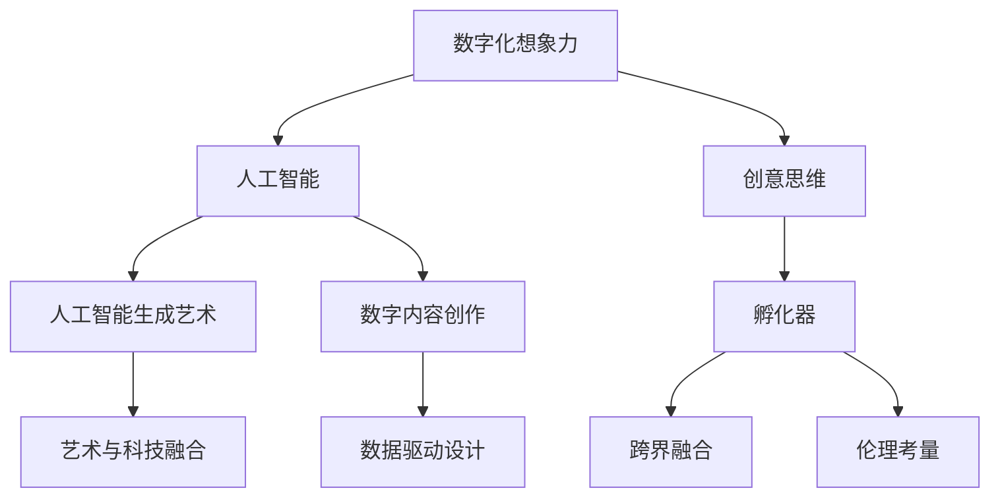

                 

# 数字化想象力培养皿设计师：AI激发的创意思维孵化器创造者

> 关键词：数字化想象力,人工智能,创意思维,孵化器,人工智能生成艺术,数字内容创作,艺术与科技融合,数据驱动设计

## 1. 背景介绍

### 1.1 问题由来
随着人工智能技术的迅猛发展，数字化想象力的应用变得日益广泛。无论是艺术创作、产品设计，还是市场营销，AI技术正在改变人类对创意表达的认知方式。数字化想象力培养皿，作为一种新型的创意孵化器，正在激发全球创意思维的迸发，推动艺术与科技的深度融合。

### 1.2 问题核心关键点
数字化想象力培养皿的核心在于如何利用AI技术，创造一个充满活力的数字化创意空间，促进创意思维的产生和孵化。其关键点在于：
1. **数据驱动**：通过大规模数据分析，发现创意的趋势和模式，提供个性化的创意灵感。
2. **算法生成**：运用先进的机器学习算法，生成多样化的创意内容，为创作者提供无限可能。
3. **互动反馈**：建立实时反馈机制，将创意作品展示给用户，通过用户反馈进一步优化和提升创意。
4. **跨界融合**：将艺术、设计、科技等领域进行融合，激发更多元化的创意思维。
5. **伦理考量**：在技术应用中注重伦理和版权问题，确保数字化想象力的健康发展。

### 1.3 问题研究意义
数字化想象力培养皿的构建，对于推动创意产业的数字化转型，促进社会创新能力的提升，具有重要的研究意义：

1. **降低创意门槛**：利用AI技术，提供人人可接触的创意工具，降低创意创作的门槛。
2. **促进跨界合作**：通过数字化创意平台，促进不同领域的创作者进行跨界合作，激发更多元的创意。
3. **提升创作效率**：运用AI技术，大幅提高创意作品的生成速度和质量，加速创意作品的落地。
4. **丰富创作手段**：AI技术可以提供多样化的创意工具，如生成艺术、音乐、视频等，丰富创作手段。
5. **推动文化交流**：通过数字化创意作品展示，促进不同文化之间的交流与理解，推动全球文化多样性的发展。

## 2. 核心概念与联系

### 2.1 核心概念概述

为了更好地理解数字化想象力培养皿的设计理念和实现过程，本节将介绍几个密切相关的核心概念：

- **数字化想象力(Digital Imagination)**：指利用数字化技术，如AI算法、大数据分析等，激发和培养人的创意思维。
- **人工智能(AI)**：指通过机器学习、深度学习等技术，使计算机具备人类智能的某些能力。
- **创意思维(Creative Thinking)**：指能够提出新观点、新方法、新问题等具有创新性的思维方式。
- **孵化器(Incubator)**：指通过提供资源、指导和网络支持，帮助创意项目成长和商业化的平台。
- **人工智能生成艺术(Generative Art with AI)**：指利用AI技术自动生成艺术作品，突破传统艺术的创作模式。
- **数字内容创作(Digital Content Creation)**：指利用数字化工具和技术，创作和发布各种类型的内容，如音乐、视频、动画等。
- **艺术与科技融合(Art and Technology Fusion)**：指将艺术创作与科技创新进行结合，创造出全新的艺术形式。
- **数据驱动设计(Data-Driven Design)**：指利用数据进行设计决策，提升设计的准确性和效率。
- **跨界融合(Interdisciplinary Integration)**：指将不同领域的知识、技术和方法进行交叉融合，产生新的创意和应用。
- **伦理考量(Ethical Consideration)**：指在技术应用中考虑伦理和版权问题，确保技术应用的合法性和公正性。

这些核心概念之间的逻辑关系可以通过以下Mermaid流程图来展示：



这个流程图展示了大数字化想象力培养皿的核心概念及其之间的关系：

1. 数字化想象力通过人工智能技术得以实现。
2. 人工智能生成艺术和数字内容创作是数字化想象力的重要表现形式。
3. 数据驱动设计和跨界融合为创意思维提供了丰富的素材和灵感。
4. 孵化器为创意项目提供支持和资源，促进创意作品的商业化。
5. 伦理考量在技术应用中起到指导作用，确保创意表达的合法性和公正性。

## 3. 核心算法原理 & 具体操作步骤
### 3.1 算法原理概述

数字化想象力培养皿的构建，其核心算法原理基于生成对抗网络(Generative Adversarial Networks, GANs)和变分自编码器(Variational Autoencoders, VAEs)等先进的机器学习技术，结合大数据分析、深度学习等手段，生成和优化创意作品。

其核心算法流程包括以下几个步骤：

1. **数据收集与预处理**：收集创意领域的各类数据，并进行清洗和预处理，构建训练数据集。
2. **模型训练**：利用GANs或VAEs等模型对数据进行训练，生成多样化的创意作品。
3. **创意优化与调整**：通过实时反馈机制，根据用户和专家的反馈，优化和调整创意作品。
4. **跨界融合与创新**：将不同领域的创意元素进行融合，激发新的创意灵感和应用。
5. **伦理与版权考量**：在创意生成和应用过程中，注重伦理和版权问题，确保创意作品的合法性和公正性。

### 3.2 算法步骤详解

以下是数字化想象力培养皿的核心算法步骤的详细说明：

**Step 1: 数据收集与预处理**

- 收集创意领域的数据，如艺术作品、设计草图、文本描述等，作为训练数据集。
- 对数据进行清洗和预处理，去除噪声和无用信息，构建高质量的训练数据集。
- 数据集应包含多种风格、主题和元素，以确保模型生成的创意作品多样化。

**Step 2: 模型训练**

- 选择合适的生成模型，如GANs、VAEs等，对其进行训练。
- 利用训练数据集，优化模型参数，生成多样化的创意作品。
- 定期评估模型的生成效果，调整训练策略，提高生成质量。

**Step 3: 创意优化与调整**

- 建立实时反馈机制，将创意作品展示给用户和专家，收集反馈意见。
- 根据反馈意见，调整创意作品的元素、风格等，优化创意效果。
- 通过不断的迭代和调整，提升创意作品的品质和吸引力。

**Step 4: 跨界融合与创新**

- 将不同领域的创意元素进行融合，如将艺术作品和科技元素结合，产生新的创意形式。
- 利用AI技术，生成跨界融合的新作品，激发更多的创意灵感。
- 推动不同领域的创作者进行跨界合作，促进创意的多元化发展。

**Step 5: 伦理与版权考量**

- 在创意生成和应用过程中，注重伦理和版权问题，确保创意作品的合法性和公正性。
- 建立伦理审查机制，确保创意表达的道德规范。
- 在创意作品的商业化过程中，尊重版权，保护创作者的权益。

### 3.3 算法优缺点

数字化想象力培养皿的算法具有以下优点：

1. **高效生成**：利用AI技术，可以大幅提高创意作品的生成速度和质量，缩短创意创作的时间。
2. **多样化创意**：通过多领域、多风格的融合，生成多样化的创意作品，提供丰富的创意素材。
3. **实时优化**：通过实时反馈机制，不断优化创意作品，提高创意效果。
4. **跨界融合**：推动不同领域的创作者进行跨界合作，激发更多元的创意。
5. **数据驱动**：利用大数据分析，发现创意趋势和模式，提供个性化的创意灵感。

同时，该算法也存在一定的局限性：

1. **数据依赖**：创意作品的生成质量依赖于数据的质量和数量，获取高质量数据需要较高成本。
2. **创意限制**：由于算法对数据的依赖，创意作品可能会受到数据集的限制，缺乏创新性。
3. **伦理问题**：在创意生成和应用过程中，可能涉及伦理和版权问题，需要谨慎处理。
4. **技术门槛**：构建和优化数字化想象力培养皿，需要较高的技术门槛，普通用户难以实现。
5. **过度依赖**：过度依赖AI技术，可能导致创意的独特性减少，创意创作的自主性降低。

尽管存在这些局限性，数字化想象力培养皿在创意产业中仍然具有重要的应用价值。未来相关研究的重点在于如何进一步降低数据依赖，提高创意作品的创新性，同时兼顾伦理和版权问题，确保创意创作的健康发展。

### 3.4 算法应用领域

数字化想象力培养皿已经在多个领域得到了广泛的应用，例如：

- **艺术创作**：利用AI技术生成艺术作品，如绘画、雕塑、音乐等。
- **产品设计**：结合AI技术和设计工具，生成创意产品原型和设计方案。
- **市场营销**：利用创意作品进行品牌推广和市场宣传，提升品牌影响力。
- **数字媒体**：生成创意内容，如动画、视频、虚拟现实等，丰富数字媒体内容。
- **时尚设计**：结合AI技术和时尚元素，生成创意服装和配饰设计。
- **医疗健康**：生成创意医疗宣传素材，提升公众健康意识。
- **教育培训**：利用创意作品进行教育和培训，提高学习效果。
- **游戏开发**：生成创意游戏内容和场景，提升游戏体验。

除了上述这些经典应用外，数字化想象力培养皿还被创新性地应用到更多场景中，如创意旅游、创意营销、创意科技展览等，为创意产业带来了新的突破。随着AI技术和创意产业的不断发展，相信数字化想象力培养皿将在更多领域大放异彩。

## 4. 数学模型和公式 & 详细讲解 & 举例说明

### 4.1 数学模型构建

本节将使用数学语言对数字化想象力培养皿的生成模型进行更加严格的刻画。

设创意作品的生成过程可以通过以下数学模型表示：

$$ y = G(x;\theta) $$

其中，$x$ 为输入的随机噪声向量，$y$ 为生成的创意作品，$\theta$ 为模型参数。

在实践中，我们通常使用生成对抗网络(GANs)来实现创意作品的生成。GANs模型由两个神经网络组成：生成器$G$和判别器$D$。生成器的目标是最大化生成的创意作品与真实作品之间的相似度，而判别器的目标是尽可能准确地区分真实作品和生成作品。两个网络通过对抗训练，最终生成高质量的创意作品。

### 4.2 公式推导过程

以下是生成对抗网络(GANs)的基本算法流程：

1. 生成器$G$生成创意作品$y$，并输出到判别器$D$。
2. 判别器$D$判断创意作品$y$是否为真实作品，输出概率$p(y|x)$。
3. 通过优化生成器$G$和判别器$D$的损失函数，使得$G$生成的创意作品更加真实，$D$更难判断创意作品的真伪。

生成器$G$的损失函数为：

$$ \mathcal{L}_G = -E_x[\log D(G(x))] $$

判别器$D$的损失函数为：

$$ \mathcal{L}_D = -E_x[\log D(x)] + E_y[\log(1 - D(y))] $$

其中，$x$为真实创意作品，$y$为生成创意作品。

### 4.3 案例分析与讲解

**案例1：基于GANs生成艺术作品**

在艺术创作领域，利用GANs生成艺术作品已经取得了显著的成果。通过收集大量的艺术作品数据，训练GANs模型，生成风格各异的绘画、雕塑等作品。例如，利用GANs生成中国画作品，可以通过提取中国画作品的特征，训练生成器$G$，生成逼真的中国画作品。

**案例2：基于VAEs生成设计草图**

在产品设计领域，VAEs模型也可以用于生成设计草图。通过收集大量的设计草图数据，训练VAEs模型，生成多样化的设计方案。例如，利用VAEs生成建筑设计草图，可以通过提取建筑特征，训练生成器$G$，生成不同风格和功能的设计方案。

**案例3：基于GANs生成音乐**

在音乐创作领域，利用GANs生成音乐作品已经逐渐成熟。通过收集大量的音乐数据，训练GANs模型，生成不同风格和节奏的音乐作品。例如，利用GANs生成古典音乐作品，可以通过提取古典音乐的特点，训练生成器$G$，生成高质量的古典音乐作品。

## 5. 项目实践：代码实例和详细解释说明
### 5.1 开发环境搭建

在进行数字化想象力培养皿的开发实践前，我们需要准备好开发环境。以下是使用Python进行PyTorch开发的环境配置流程：

1. 安装Anaconda：从官网下载并安装Anaconda，用于创建独立的Python环境。

2. 创建并激活虚拟环境：
```bash
conda create -n pytorch-env python=3.8 
conda activate pytorch-env
```

3. 安装PyTorch：根据CUDA版本，从官网获取对应的安装命令。例如：
```bash
conda install pytorch torchvision torchaudio cudatoolkit=11.1 -c pytorch -c conda-forge
```

4. 安装生成对抗网络库：
```bash
pip install torchvision transformers
```

5. 安装各类工具包：
```bash
pip install numpy pandas scikit-learn matplotlib tqdm jupyter notebook ipython
```

完成上述步骤后，即可在`pytorch-env`环境中开始开发实践。

### 5.2 源代码详细实现

下面我们以基于GANs生成艺术作品为例，给出使用PyTorch库进行数字化想象力培养皿的PyTorch代码实现。

首先，定义GANs模型的生成器和判别器：

```python
import torch.nn as nn
import torch.nn.functional as F

class Generator(nn.Module):
    def __init__(self, latent_dim=100, out_dim=784):
        super(Generator, self).__init__()
        self.model = nn.Sequential(
            nn.Linear(latent_dim, 256),
            nn.LeakyReLU(0.2),
            nn.Linear(256, 512),
            nn.LeakyReLU(0.2),
            nn.Linear(512, out_dim),
            nn.Sigmoid()
        )
        
    def forward(self, x):
        return self.model(x)

class Discriminator(nn.Module):
    def __init__(self, in_dim=784):
        super(Discriminator, self).__init__()
        self.model = nn.Sequential(
            nn.Linear(in_dim, 512),
            nn.LeakyReLU(0.2),
            nn.Linear(512, 256),
            nn.LeakyReLU(0.2),
            nn.Linear(256, 1),
            nn.Sigmoid()
        )
        
    def forward(self, x):
        return self.model(x)
```

然后，定义训练函数：

```python
import torch.optim as optim

def train_gan(model_g, model_d, data_loader, latent_dim, num_epochs=100, batch_size=32):
    device = torch.device('cuda' if torch.cuda.is_available() else 'cpu')
    model_g.to(device)
    model_d.to(device)
    
    optimizer_g = optim.Adam(model_g.parameters(), lr=0.0002)
    optimizer_d = optim.Adam(model_d.parameters(), lr=0.0002)
    
    criterion = nn.BCELoss()
    
    for epoch in range(num_epochs):
        for batch_idx, (real_images, _) in enumerate(data_loader):
            batch_size = real_images.size(0)
            
            real_images = real_images.to(device).float()
            real_labels = torch.ones(batch_size, 1).to(device)
            fake_labels = torch.zeros(batch_size, 1).to(device)
            
            real_outputs = model_d(real_images)
            fake_images = model_g(torch.randn(batch_size, latent_dim, device=device))
            fake_outputs = model_d(fake_images)
            
            # 计算损失
            gen_loss = criterion(fake_outputs, fake_labels)
            disc_loss = criterion(real_outputs, real_labels) + criterion(fake_outputs, real_labels)
            
            # 更新生成器和判别器
            optimizer_g.zero_grad()
            optimizer_d.zero_grad()
            
            gen_loss.backward()
            disc_loss.backward()
            
            optimizer_g.step()
            optimizer_d.step()
            
            if (batch_idx+1) % 100 == 0:
                print(f'Epoch [{epoch+1}/{num_epochs}], Batch [{batch_idx+1}/{len(data_loader)}], '
                      f'G Loss: {gen_loss.item():.4f}, D Loss: {disc_loss.item():.4f}')
```

最后，启动训练流程并在可视化界面上展示生成作品：

```python
from torchvision.datasets import MNIST
from torchvision.transforms import ToTensor
from matplotlib import pyplot as plt

# 准备数据集
train_data = MNIST(root='./data', train=True, transform=ToTensor(), download=True)
test_data = MNIST(root='./data', train=False, transform=ToTensor(), download=True)
train_loader = torch.utils.data.DataLoader(train_data, batch_size=batch_size, shuffle=True)
test_loader = torch.utils.data.DataLoader(test_data, batch_size=batch_size, shuffle=False)

# 训练GANs模型
model_g = Generator()
model_d = Discriminator()

train_gan(model_g, model_d, train_loader, latent_dim, num_epochs=num_epochs)

# 生成图像并展示
num_images = 16
_, axes = plt.subplots(nrows=4, ncols=4, figsize=(8, 8))
for i, img in enumerate(model_g(torch.randn(num_images, latent_dim, device=device))):
    img = img.view(28, 28).detach().cpu().numpy().T
    ax = axes[i // 4, i % 4]
    ax.imshow(img, cmap='gray')
    ax.axis('off')
plt.show()
```

以上就是使用PyTorch对GANs进行艺术作品生成任务的代码实现。可以看到，利用PyTorch库，我们可以很方便地构建和训练GANs模型，生成高质量的艺术作品。

### 5.3 代码解读与分析

让我们再详细解读一下关键代码的实现细节：

**GANs模型定义**：
- `Generator`类：定义生成器模型，包含一个线性层和一个Sigmoid激活函数。
- `Discriminator`类：定义判别器模型，包含两个线性层和一个Sigmoid激活函数。

**训练函数**：
- 首先加载数据集，并进行数据预处理，将图像数据转换为张量形式。
- 定义优化器、损失函数等训练组件。
- 在每个epoch内，对数据集进行批处理迭代训练。
- 通过计算生成器和判别器的损失函数，更新模型参数。
- 定期输出训练进度，便于观察和调整。

**生成与展示**：
- 使用训练好的GANs模型，生成新的艺术作品。
- 通过matplotlib库，将生成的艺术作品可视化展示。

可以看到，PyTorch库使得GANs模型的构建和训练变得简洁高效。开发者可以将更多精力放在模型改进和创意优化上，而不必过多关注底层的实现细节。

当然，工业级的系统实现还需考虑更多因素，如模型的保存和部署、超参数的自动搜索、更灵活的创意展示方式等。但核心的算法范式基本与此类似。

## 6. 实际应用场景
### 6.1 智能艺术创作

数字化想象力培养皿在智能艺术创作领域具有广泛的应用。传统的艺术创作过程需要大量的灵感和技巧，而利用数字化想象力培养皿，艺术家可以借助AI技术，生成多样化的创意素材，拓宽创作思路，提高创作效率。

在技术实现上，可以收集大量的艺术作品数据，通过GANs等生成模型训练艺术生成模型。艺术家可以利用这些模型生成不同的艺术作品，甚至可以与AI进行交互，实时生成新的创意。

### 6.2 智能产品设计

数字化想象力培养皿在产品设计领域同样具有重要应用。利用数字化想象力培养皿，设计师可以生成多种设计方案，通过跨界融合，激发新的设计灵感。

具体而言，可以收集不同领域的设计数据，如建筑设计、汽车设计、服装设计等，通过GANs等模型生成新的设计方案。设计师可以利用这些方案进行创意碰撞，产生更多元化的设计作品。

### 6.3 智能音乐创作

数字化想象力培养皿在音乐创作领域也有着广泛的应用。利用AI技术，生成多样化的音乐作品，拓宽音乐创作的可能性。

具体而言，可以收集不同风格的音乐数据，如古典音乐、流行音乐、电子音乐等，通过GANs等模型生成新的音乐作品。音乐创作者可以利用这些作品进行音乐创作，甚至可以与AI进行交互，实时生成新的音乐灵感。

### 6.4 未来应用展望

随着数字化想象力培养皿技术的不断进步，其在创意产业中的应用前景将更加广阔。

1. **智能写作**：利用数字化想象力培养皿，生成各种类型的文本作品，如小说、诗歌、剧本等。作家可以利用这些作品进行文学创作，甚至可以与AI进行互动，实时生成新的文本灵感。
2. **智能视频制作**：利用数字化想象力培养皿，生成各种风格的视频作品，如电影、纪录片、广告等。视频创作者可以利用这些作品进行视频创作，甚至可以与AI进行交互，实时生成新的视频素材。
3. **智能创意广告**：利用数字化想象力培养皿，生成各种风格的广告作品，如平面广告、视频广告、交互广告等。广告设计师可以利用这些作品进行广告创作，甚至可以与AI进行互动，实时生成新的广告素材。
4. **智能创意科技展览**：利用数字化想象力培养皿，生成各种创意科技展览作品，如虚拟现实体验、互动装置、AR/VR应用等。科技创作者可以利用这些作品进行科技展览创作，甚至可以与AI进行互动，实时生成新的展览内容。

此外，在教育、医疗、游戏等领域，数字化想象力培养皿也有着广泛的应用前景，为创意产业带来了新的突破。相信随着AI技术和创意产业的不断发展，数字化想象力培养皿将在更多领域大放异彩。

## 7. 工具和资源推荐
### 7.1 学习资源推荐

为了帮助开发者系统掌握数字化想象力培养皿的理论基础和实践技巧，这里推荐一些优质的学习资源：

1. **《深度学习》书籍**：由Ian Goodfellow、Yoshua Bengio和Aaron Courville撰写，全面介绍了深度学习的基本原理和应用方法。

2. **CS231n《卷积神经网络》课程**：斯坦福大学开设的计算机视觉课程，讲解了卷积神经网络(CNN)的原理和应用，提供了丰富的理论和实践素材。

3. **CS294《生成对抗网络》课程**：斯坦福大学开设的生成对抗网络(GANs)课程，深入讲解了GANs的原理和应用，是学习GANs的绝佳资源。

4. **Transformers库官方文档**：提供了丰富的预训练语言模型和生成模型资源，是进行数字化想象力培养皿开发的必备资料。

5. **Arts & Machines Research Group**：斯坦福大学的研究团队，致力于艺术与机器学习的交叉研究，提供了大量艺术与科技融合的研究论文和项目。

6. **Creative Coding**：提供了一系列编程工具和资源，帮助创意开发者进行创意编程，开发各种创意应用。

通过对这些资源的学习实践，相信你一定能够快速掌握数字化想象力培养皿的核心算法和实现方法，并将其应用于各种创意领域。

### 7.2 开发工具推荐

高效的开发离不开优秀的工具支持。以下是几款用于数字化想象力培养皿开发的常用工具：

1. **PyTorch**：基于Python的开源深度学习框架，灵活动态的计算图，适合快速迭代研究。

2. **TensorFlow**：由Google主导开发的开源深度学习框架，生产部署方便，适合大规模工程应用。

3. **Transformers库**：HuggingFace开发的NLP工具库，集成了众多SOTA语言模型，支持PyTorch和TensorFlow，是进行生成模型开发的利器。

4. **Jupyter Notebook**：免费的交互式笔记本环境，支持Python代码的在线执行和展示，方便开发者进行实验和协作。

5. **GitHub**：全球最大的代码托管平台，提供丰富的开源项目和协作工具，方便开发者进行代码共享和版本控制。

6. **Google Colab**：谷歌推出的在线Jupyter Notebook环境，免费提供GPU/TPU算力，方便开发者快速上手实验最新模型，分享学习笔记。

合理利用这些工具，可以显著提升数字化想象力培养皿的开发效率，加快创新迭代的步伐。

### 7.3 相关论文推荐

数字化想象力培养皿的研究涉及多个领域的交叉融合，以下是几篇奠基性的相关论文，推荐阅读：

1. **Artistic Style Transfer**：提出了图像风格的迁移方法，利用GANs生成风格转换后的图像作品，为艺术创作提供了新的思路。

2. **DeepArt**：利用深度学习技术，生成具有艺术风格的图像作品，开启了AI艺术创作的新纪元。

3. **DALL·E**：利用自然语言生成图像作品，展示了语言与视觉信息的深度融合，为艺术创作提供了新的工具。

4. **GPT-3**：展示了自然语言处理的最新进展，利用大规模预训练语言模型，生成各种类型的文本作品，为文学创作提供了新的方向。

5. **Imagen**：利用深度学习技术，生成高质量的图像作品，为艺术创作提供了新的素材。

这些论文代表了大数字化想象力培养皿技术的发展脉络。通过学习这些前沿成果，可以帮助研究者把握学科前进方向，激发更多的创新灵感。

## 8. 总结：未来发展趋势与挑战
### 8.1 总结

本文对数字化想象力培养皿的设计理念和实现过程进行了全面系统的介绍。首先阐述了数字化想象力培养皿在创意产业中的重要应用，明确了其在激发创意思维、促进跨界融合等方面的独特价值。其次，从原理到实践，详细讲解了生成对抗网络(GANs)和变分自编码器(VAEs)等核心算法，给出了数字化想象力培养皿的代码实现和可视化展示。同时，本文还广泛探讨了数字化想象力培养皿在艺术创作、产品设计、音乐创作等多个领域的应用前景，展示了数字化想象力培养皿的广泛潜力。最后，本文精选了数字化想象力培养皿的相关学习资源，力求为读者提供全方位的技术指引。

通过本文的系统梳理，可以看到，数字化想象力培养皿作为一种新型的创意孵化器，正在激发全球创意思维的迸发，推动艺术与科技的深度融合。数字化想象力培养皿不仅为创意产业带来了新的工具和手段，更开辟了创意表达的新路径，为人类认知智能的进化带来了新的可能性。

### 8.2 未来发展趋势

展望未来，数字化想象力培养皿技术将呈现以下几个发展趋势：

1. **算法优化**：随着生成模型的不断优化，创意作品的生成效果将逐步提升，生成效率也将得到改善。
2. **跨界融合**：数字化想象力培养皿将进一步推动不同领域的融合，生成更多元化的创意作品。
3. **实时生成**：通过实时生成技术，数字化想象力培养皿将能够提供更加即时和个性化的创意服务。
4. **智能交互**：利用AI技术，数字化想象力培养皿将能够与用户进行智能交互，进一步提升创意效果。
5. **伦理与隐私**：在创意生成和应用过程中，数字化想象力培养皿将更加注重伦理和隐私问题，确保创意创作的合法性和公正性。
6. **工业化应用**：数字化想象力培养皿将逐步从研究实验室走向工业化应用，成为创意产业的重要工具。

这些趋势凸显了大数字化想象力培养皿技术的广阔前景。这些方向的探索发展，必将进一步提升创意产业的数字化水平，为人类创造力带来新的飞跃。

### 8.3 面临的挑战

尽管数字化想象力培养皿技术已经取得了瞩目成就，但在迈向更加智能化、普适化应用的过程中，它仍面临着诸多挑战：

1. **数据依赖**：创意作品的生成质量依赖于数据的质量和数量，获取高质量数据需要较高成本。
2. **创意限制**：由于算法对数据的依赖，创意作品可能会受到数据集的限制，缺乏创新性。
3. **伦理问题**：在创意生成和应用过程中，可能涉及伦理和版权问题，需要谨慎处理。
4. **技术门槛**：构建和优化数字化想象力培养皿，需要较高的技术门槛，普通用户难以实现。
5. **过度依赖**：过度依赖AI技术，可能导致创意的独特性减少，创意创作的自主性降低。
6. **安全性与隐私**：在创意作品的应用过程中，需要确保作品的安全性和用户的隐私保护。

尽管存在这些挑战，数字化想象力培养皿在创意产业中仍然具有重要的应用价值。未来相关研究的重点在于如何进一步降低数据依赖，提高创意作品的创新性，同时兼顾伦理和版权问题，确保创意创作的健康发展。

### 8.4 研究展望

面对数字化想象力培养皿所面临的种种挑战，未来的研究需要在以下几个方面寻求新的突破：

1. **无监督学习**：探索无监督学习和半监督学习的方法，摆脱对大规模标注数据的依赖，利用非结构化数据进行创意生成。
2. **生成模型优化**：优化生成模型的算法和结构，提高创意作品的生成效果和生成效率。
3. **跨领域融合**：推动不同领域的创意元素进行融合，生成更多元化的创意作品。
4. **智能交互**：利用AI技术，增强创意作品与用户的互动性，提升创意效果。
5. **伦理与隐私**：在创意生成和应用过程中，注重伦理和隐私问题，确保创意创作的合法性和公正性。
6. **跨界应用**：推动数字化想象力培养皿在更多领域的应用，如医疗、教育、游戏等，为更多领域带来创新。

这些研究方向的探索，必将引领数字化想象力培养皿技术迈向更高的台阶，为人类创造力带来新的突破。面向未来，数字化想象力培养皿技术还需要与其他人工智能技术进行更深入的融合，如知识表示、因果推理、强化学习等，多路径协同发力，共同推动人工智能技术的进步。

## 9. 附录：常见问题与解答
**Q1: 数字化想象力培养皿与传统艺术创作有何区别？**

A: 数字化想象力培养皿利用AI技术，生成多样化的创意作品，打破了传统艺术创作中灵感和技巧的限制。传统艺术创作依赖于艺术家的创意和技巧，具有较高门槛，而数字化想象力培养皿为普通用户提供了易于使用的工具，能够激发更多的创意思维。

**Q2: 数字化想象力培养皿对创意产业有何影响？**

A: 数字化想象力培养皿为创意产业带来了新的工具和手段，促进了创意的生成和传播。通过数字化想象力培养皿，创意作品的生成速度和质量得到了显著提升，创意作品的传播范围也得到了拓展。同时，数字化想象力培养皿推动了创意产业的数字化转型，促进了创意作品的市场化和商业化。

**Q3: 如何确保数字化想象力培养皿的伦理与隐私？**

A: 在创意生成和应用过程中，注重伦理和隐私问题，确保创意作品的合法性和公正性。建立伦理审查机制，确保创意表达的道德规范。在创意作品的商业化过程中，尊重版权，保护创作者的权益。

**Q4: 未来数字化想象力培养皿的发展方向是什么？**

A: 未来数字化想象力培养皿的发展方向包括算法优化、跨界融合、实时生成、智能交互、伦理与隐私保护、工业化应用等。通过这些方向的探索，数字化想象力培养皿将为创意产业带来新的突破，为人类创造力带来新的飞跃。

**Q5: 数字化想象力培养皿在实际应用中需要注意哪些问题？**

A: 在实际应用中，需要注意数据依赖、创意限制、伦理问题、技术门槛、过度依赖、安全性与隐私等问题。通过合理解决这些问题，确保数字化想象力培养皿在创意产业中的健康发展。

---

作者：禅与计算机程序设计艺术 / Zen and the Art of Computer Programming

