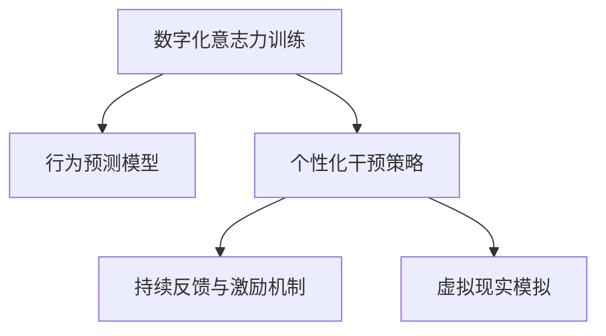

                 

# 数字化意志力锻炼场：AI增强的自我控制训练

> 关键词：数字化，意志力，锻炼场，AI增强，自我控制，训练

## 1. 背景介绍

### 1.1 问题由来
在数字化时代，我们的注意力被纷繁复杂的信息所吸引，注意力分散、拖延、焦虑等意志力问题日益凸显。这些问题不仅影响我们的工作效率，还对身心健康造成威胁。传统的意志力提升方法，如设定目标、制定计划等，往往难以坚持，效果有限。数字化工具在提升效率、时间管理等方面有着独特优势，如何利用AI技术增强意志力训练，成为当前研究的热点。

### 1.2 问题核心关键点
当前AI在增强自我控制训练中的应用，主要集中在以下几个关键点：

1. **数据驱动的行为预测**：利用AI对用户的行为模式进行预测，提前发现拖延、注意力分散等意志力问题。
2. **个性化干预策略**：根据用户行为特点和偏好，提供个性化的意志力训练方案。
3. **持续反馈和激励**：使用AI进行实时反馈和激励，帮助用户持续进行意志力训练。
4. **模拟现实环境**：构建逼真的虚拟环境，让用户在高压力情境中锻炼意志力。

这些关键点相互关联，共同构成了AI增强自我控制训练的基础框架。本文将详细介绍这些核心概念和关键技术。

### 1.3 问题研究意义
通过AI技术增强意志力训练，不仅能提升个体的自我控制能力，还能帮助企业提升员工的生产效率和创新力，进一步推动社会进步。具体而言：

1. **提升个人绩效**：通过意志力训练，用户能够更高效地完成工作，减少拖延和焦虑。
2. **改善心理健康**：AI工具能够实时监控用户的心理状态，提供心理支持。
3. **优化企业管理**：通过AI分析员工的工作行为，优化团队管理和员工激励策略。
4. **支持终身学习**：AI辅助下的学习平台能够帮助用户坚持学习计划，提升学习效率。
5. **促进社会进步**：通过提升个体的自我控制能力，增强社会成员的自律性，推动社会向更高层次发展。

## 2. 核心概念与联系

### 2.1 核心概念概述

为了更好地理解AI增强的自我控制训练方法，本节将介绍几个密切相关的核心概念：

- **数字化意志力训练**：利用数字化工具和AI技术，对用户的意志力进行训练和提升。
- **行为预测模型**：基于用户的历史行为数据，构建预测模型，提前发现意志力问题。
- **个性化干预策略**：根据用户的行为和偏好，定制个性化的意志力训练方案。
- **持续反馈与激励机制**：使用AI进行实时反馈和激励，帮助用户坚持训练。
- **虚拟现实模拟**：构建虚拟环境，模拟现实情境中的意志力挑战。

这些概念之间的逻辑关系可以通过以下Mermaid流程图来展示：



这个流程图展示了大语言模型的核心概念及其之间的关系：

1. 数字化意志力训练是对用户意志力的整体提升过程。
2. 行为预测模型和个性化干预策略是提升训练效果的关键步骤。
3. 持续反馈与激励机制保证用户持续训练。
4. 虚拟现实模拟提供更逼真的训练环境。

## 3. 核心算法原理 & 具体操作步骤
### 3.1 算法原理概述

AI增强的自我控制训练，本质上是一个数据驱动的智能训练过程。其核心思想是：利用AI技术对用户的意志力进行实时监测和干预，通过数据驱动的方式，帮助用户逐步提升自我控制能力。

具体来说，算法通过以下步骤实现这一目标：

1. **行为数据采集**：收集用户的行为数据，如工作时间、休息时间、任务完成情况等。
2. **行为模式分析**：使用机器学习模型分析用户的行为模式，识别出意志力薄弱的时段和场景。
3. **行为预测**：构建预测模型，预测用户未来的行为趋势，及时发现可能出现的意志力问题。
4. **个性化干预**：根据行为预测结果，提供个性化的意志力训练方案。
5. **实时反馈与激励**：通过AI进行实时反馈和激励，帮助用户持续进行意志力训练。

### 3.2 算法步骤详解

**Step 1: 准备训练数据和模型**

- **数据采集**：使用传感器、应用、网站等工具，收集用户的各类行为数据。
- **数据清洗**：对收集到的数据进行清洗和预处理，去除噪声和异常值。
- **特征工程**：提取关键特征，如工作时长、休息间隔、任务类型等。
- **模型训练**：选择合适的机器学习模型（如随机森林、梯度提升树等），训练预测行为模式和个性化干预策略的模型。

**Step 2: 设计个性化干预策略**

- **行为模式识别**：分析用户的行为数据，识别出拖延、注意力分散等意志力薄弱的时段和场景。
- **干预策略定制**：根据行为模式，设计个性化的干预策略，如提醒、任务分解、时间管理等。
- **策略执行**：将个性化干预策略嵌入用户的工作流中，帮助其提升意志力。

**Step 3: 实时反馈与激励**

- **行为监控**：使用AI实时监控用户的当前行为，及时发现意志力问题。
- **实时反馈**：根据用户的行为情况，提供实时的反馈和建议。
- **激励机制**：设计多种激励机制，如奖励、表彰等，鼓励用户坚持意志力训练。

**Step 4: 模拟现实环境**

- **虚拟现实模拟**：构建虚拟环境，模拟现实生活中的意志力挑战，如高压力工作场景、时间紧迫任务等。
- **情境训练**：在虚拟环境中进行意志力训练，提升用户在现实环境中的表现。

**Step 5: 训练效果评估**

- **效果评估**：定期评估用户的行为数据，分析意志力训练的效果。
- **调整策略**：根据评估结果，调整个性化干预策略，优化训练效果。

### 3.3 算法优缺点

AI增强的自我控制训练方法具有以下优点：

1. **高效精准**：基于数据驱动，实时监测和预测用户的意志力状态，提升训练的精准度。
2. **个性化定制**：根据用户的行为特点和偏好，提供个性化的干预策略，提升用户体验。
3. **实时反馈**：通过实时反馈和激励，帮助用户持续进行意志力训练，提升训练效果。
4. **模拟现实**：使用虚拟现实模拟真实情境中的意志力挑战，提升用户的适应能力和应对能力。

同时，该方法也存在一些局限性：

1. **隐私风险**：行为数据和个人隐私密切相关，数据泄露和滥用可能带来隐私风险。
2. **数据依赖**：训练效果依赖于数据质量和数量，数据不足可能影响训练效果。
3. **模型复杂**：训练模型需要较高的计算资源和数据处理能力，实施成本较高。
4. **算法偏见**：训练模型可能存在算法偏见，影响干预策略的公平性。

尽管存在这些局限性，但就目前而言，基于AI的自我控制训练方法已经展现出了巨大的潜力，正逐步成为意志力提升的重要手段。未来相关研究的重点在于如何进一步降低训练成本，提升算法公平性和隐私保护。

### 3.4 算法应用领域

AI增强的自我控制训练方法已经在多个领域得到了应用，具体如下：

1. **企业人力资源管理**：帮助企业识别员工意志力薄弱的时段，优化工作安排和激励策略，提升员工绩效和满意度。
2. **学习平台**：结合个性化干预策略和实时反馈，帮助用户制定学习计划，提升学习效率和效果。
3. **心理咨询**：通过实时监控和反馈，提供心理支持，帮助用户缓解焦虑和压力。
4. **健康管理**：结合行为预测和个性化干预，帮助用户养成健康的生活习惯，提升身体健康。
5. **游戏与娱乐**：通过虚拟现实模拟和个性化干预，增强游戏的趣味性和挑战性。

## 4. 数学模型和公式 & 详细讲解  
### 4.1 数学模型构建

本节将使用数学语言对AI增强自我控制训练过程进行更加严格的刻画。

记用户的行为数据为 $D=\{x_i\}_{i=1}^N, x_i=(x_{i1},x_{i2},\dots,x_{im})$，其中 $x_{ij}$ 为第 $i$ 次行为的第 $j$ 个特征值。定义用户的行为模式为 $f(x)=(p_1,p_2,\dots,p_m)$，其中 $p_j$ 表示用户行为的第 $j$ 个特征值在各个时间段内出现的概率分布。

用户的行为预测模型为 $g(x)=\hat{f}(x)$，其中 $\hat{f}(x)$ 为训练得到的预测模型。则用户的意志力预测结果为：

$$
\hat{w}=\hat{f}(x)
$$

其中 $\hat{w}$ 表示用户当前的意志力水平。意志力水平越高，代表用户越自律，能够更好地控制自己的行为。

### 4.2 公式推导过程

以下我们以行为预测模型为例，推导机器学习模型在自我控制训练中的应用。

假设我们使用的是梯度提升树（GBDT）作为行为预测模型，模型的训练过程如下：

1. **数据划分**：将数据 $D$ 划分为训练集 $D_{train}$ 和验证集 $D_{val}$。
2. **特征工程**：对数据进行特征工程，提取关键特征。
3. **模型训练**：使用梯度提升树算法，在训练集 $D_{train}$ 上训练预测模型 $g(x)$。
4. **模型评估**：在验证集 $D_{val}$ 上评估模型性能，选择合适的模型参数。
5. **模型应用**：将训练好的模型 $g(x)$ 应用于新数据 $x$，进行行为预测。

具体的训练过程如下：

$$
\hat{f}(x) = \sum_{k=1}^K g_k(x)
$$

其中 $g_k(x)$ 表示第 $k$ 颗决策树模型，$K$ 表示决策树的数量。

在得到行为预测模型后，可以将其应用于用户的行为数据，进行实时监测和预测。例如，在用户进行某项任务时，实时计算其意志力水平 $\hat{w}$，并根据预测结果，提供个性化的干预策略。

### 4.3 案例分析与讲解

**案例分析：**

某企业使用AI增强的自我控制训练系统，帮助员工提升工作效率。该系统通过以下步骤实现：

1. **数据采集**：使用企业内部应用和工作日志，收集员工的工作行为数据。
2. **数据预处理**：对数据进行清洗和预处理，提取关键特征，如工作时长、休息间隔、任务完成情况等。
3. **模型训练**：使用随机森林算法，训练行为预测模型，识别出员工意志力薄弱的时段和场景。
4. **个性化干预**：根据行为预测结果，设计个性化的干预策略，如提醒、任务分解、时间管理等。
5. **实时反馈**：使用AI实时监控员工的行为，提供实时的反馈和建议。
6. **模拟现实环境**：在虚拟环境中进行意志力训练，提升员工在现实环境中的表现。

通过该系统，企业能够实时监控员工的工作状态，及时发现意志力薄弱的时段和场景，并提供个性化的干预策略，帮助员工提升工作效率和满意度。

## 5. 项目实践：代码实例和详细解释说明
### 5.1 开发环境搭建

在进行自我控制训练实践前，我们需要准备好开发环境。以下是使用Python进行机器学习和深度学习开发的环境配置流程：

1. 安装Anaconda：从官网下载并安装Anaconda，用于创建独立的Python环境。

2. 创建并激活虚拟环境：
```bash
conda create -n ml-env python=3.8 
conda activate ml-env
```

3. 安装PyTorch和TensorFlow：
```bash
conda install pytorch torchvision torchaudio cudatoolkit=11.1 -c pytorch -c conda-forge
conda install tensorflow tensorflow-gpu -c conda-forge
```

4. 安装各类工具包：
```bash
pip install numpy pandas scikit-learn matplotlib tqdm jupyter notebook ipython
```

完成上述步骤后，即可在`ml-env`环境中开始训练实践。

### 5.2 源代码详细实现

这里我们以一个简单的行为预测模型为例，给出使用Scikit-Learn库进行用户行为预测的Python代码实现。

首先，定义行为预测模型的数据处理函数：

```python
import pandas as pd
from sklearn.model_selection import train_test_split
from sklearn.ensemble import RandomForestRegressor

def preprocess_data(data_path):
    # 读取数据
    df = pd.read_csv(data_path)
    
    # 数据清洗
    df.dropna(inplace=True)
    
    # 特征工程
    df['work_hour'] = (df['start_time'] + df['end_time']) / 60
    df['task_type'] = df['task_type'].fillna('other')
    df['rest_interval'] = (df['next_start_time'] - df['end_time']) / 60
    
    # 数据划分
    X = df.drop(['start_time', 'end_time', 'task_name', 'is_completed'], axis=1)
    y = df['work_hour']
    X_train, X_val, y_train, y_val = train_test_split(X, y, test_size=0.2, random_state=42)
    
    return X_train, X_val, y_train, y_val
```

然后，定义行为预测模型：

```python
from sklearn.ensemble import RandomForestRegressor

def train_model(X_train, X_val, y_train, y_val):
    # 初始化模型
    model = RandomForestRegressor(n_estimators=100, random_state=42)
    
    # 训练模型
    model.fit(X_train, y_train)
    
    # 评估模型
    y_pred = model.predict(X_val)
    mse = ((y_val - y_pred) ** 2).mean()
    print(f"Validation MSE: {mse:.4f}")
    
    return model
```

接着，调用函数进行训练：

```python
# 准备数据
X_train, X_val, y_train, y_val = preprocess_data('user_data.csv')

# 训练模型
model = train_model(X_train, X_val, y_train, y_val)
```

最后，使用训练好的模型进行行为预测：

```python
# 使用模型进行预测
user_data = {'work_hour': [8.5, 10.0, 12.0], 'task_type': ['code', 'meeting', 'document'], 'rest_interval': [1.0, 2.0, 3.0]}
user_data = pd.DataFrame(user_data)

# 进行预测
user_data['predicted_work_hour'] = model.predict(user_data)
print(user_data)
```

以上就是使用Scikit-Learn库进行用户行为预测的完整代码实现。可以看到，Scikit-Learn库提供了简单易用的接口，使得行为预测模型的构建和评估变得高效便捷。

### 5.3 代码解读与分析

让我们再详细解读一下关键代码的实现细节：

**preprocess_data函数**：
- `pd.read_csv`：读取CSV格式的数据文件。
- `dropna`：删除含有缺失值的数据行。
- `fillna`：对缺失值进行填充，保证数据的完整性。
- `train_test_split`：将数据集划分为训练集和验证集，进行模型训练和评估。

**train_model函数**：
- `RandomForestRegressor`：使用随机森林回归模型。
- `fit`：在训练集上训练模型。
- `predict`：对验证集进行预测，计算均方误差。

**代码实现总结**：
- **数据处理**：对数据进行清洗、特征工程和划分。
- **模型训练**：使用随机森林回归模型进行训练，并评估模型性能。
- **行为预测**：使用训练好的模型对用户的行为进行预测，并输出预测结果。

这些步骤展示了从数据预处理到模型训练和预测的全流程，为实现AI增强的自我控制训练提供了必要的技术基础。

## 6. 实际应用场景
### 6.1 智能人力资源管理系统

智能人力资源管理系统可以通过AI增强的自我控制训练，帮助企业识别员工意志力薄弱的时段和场景，优化工作安排和激励策略，提升员工绩效和满意度。具体应用场景如下：

1. **工作行为监测**：使用AI实时监控员工的工作行为，识别出意志力薄弱的时段和场景。
2. **个性化干预策略**：根据意志力预测结果，提供个性化的干预策略，如提醒、任务分解、时间管理等。
3. **实时反馈与激励**：通过AI进行实时反馈和激励，帮助员工持续进行意志力训练，提升工作效率。
4. **虚拟现实模拟**：在虚拟环境中进行意志力训练，提升员工在现实环境中的表现。

### 6.2 智能学习平台

智能学习平台可以通过AI增强的自我控制训练，帮助用户制定学习计划，提升学习效率和效果。具体应用场景如下：

1. **学习行为监测**：使用AI实时监控用户的学习行为，识别出意志力薄弱的时段和场景。
2. **个性化学习方案**：根据意志力预测结果，提供个性化的学习方案，如推荐学习资源、调整学习节奏等。
3. **实时反馈与激励**：通过AI进行实时反馈和激励，帮助用户持续进行学习训练，提升学习效果。
4. **虚拟现实模拟**：在虚拟环境中进行学习训练，增强学习的趣味性和挑战性。

### 6.3 心理咨询应用

心理咨询应用可以通过AI增强的自我控制训练，提供心理支持，帮助用户缓解焦虑和压力。具体应用场景如下：

1. **心理状态监测**：使用AI实时监测用户的心理状态，识别出意志力薄弱的时段和场景。
2. **个性化干预策略**：根据心理状态预测结果，提供个性化的干预策略，如放松训练、情绪调节等。
3. **实时反馈与激励**：通过AI进行实时反馈和激励，帮助用户持续进行心理训练，提升心理韧性。
4. **虚拟现实模拟**：在虚拟环境中进行心理训练，增强用户的适应能力和应对能力。

## 7. 工具和资源推荐
### 7.1 学习资源推荐

为了帮助开发者系统掌握AI增强自我控制训练的理论基础和实践技巧，这里推荐一些优质的学习资源：

1. **《人工智能：一种现代方法》**：经典教材，全面介绍了AI的基本概念和应用场景，适合入门学习。
2. **Coursera《机器学习》课程**：由斯坦福大学开设的机器学习课程，系统讲解了机器学习的基本原理和算法。
3. **Scikit-Learn官方文档**：Scikit-Learn库的官方文档，提供了丰富的案例和教程，适合实战练习。
4. **TensorFlow官方文档**：TensorFlow框架的官方文档，包含大量的实践指南和代码示例。
5. **Kaggle竞赛平台**：数据科学竞赛平台，提供丰富的数据集和模型挑战，适合实战练习。

通过对这些资源的学习实践，相信你一定能够快速掌握AI增强自我控制训练的精髓，并用于解决实际的意志力问题。

### 7.2 开发工具推荐

高效的开发离不开优秀的工具支持。以下是几款用于AI增强自我控制训练开发的常用工具：

1. **Jupyter Notebook**：Python开发的交互式开发环境，支持代码、文档、数据等多种格式，方便调试和分享。
2. **TensorFlow和PyTorch**：广泛使用的深度学习框架，支持高效的模型构建和训练。
3. **Scikit-Learn**：Python的机器学习库，提供了简单易用的接口，适合快速开发和实验。
4. **Anaconda**：Python环境的打包工具，支持创建和管理虚拟环境，方便环境管理。
5. **Visual Studio Code**：轻量级代码编辑器，支持丰富的插件和扩展，提升开发效率。

合理利用这些工具，可以显著提升AI增强自我控制训练的开发效率，加快创新迭代的步伐。

### 7.3 相关论文推荐

AI增强自我控制训练的发展源于学界的持续研究。以下是几篇奠基性的相关论文，推荐阅读：

1. **《行为科学的理论与实践》**：经典教材，介绍了行为科学的理论基础和应用方法，适合深入学习。
2. **《机器学习：算法、模型和算法》**：介绍了机器学习的基本概念、算法和应用场景，适合入门学习。
3. **《深度学习：案例与实践》**：介绍深度学习的基本原理和实践方法，适合实战练习。
4. **《增强学习与智能系统》**：介绍了增强学习的理论基础和应用方法，适合深入学习。
5. **《个性化推荐系统：原理与实践》**：介绍了推荐系统的基础理论和应用方法，适合应用实践。

这些论文代表了大语言模型微调技术的发展脉络。通过学习这些前沿成果，可以帮助研究者把握学科前进方向，激发更多的创新灵感。

## 8. 总结：未来发展趋势与挑战

### 8.1 总结

本文对AI增强的自我控制训练方法进行了全面系统的介绍。首先阐述了数字化时代意志力提升的重要性，明确了AI增强自我控制训练的独特价值。其次，从原理到实践，详细讲解了自我控制训练的数学原理和关键步骤，给出了模型构建和训练的完整代码实例。同时，本文还广泛探讨了AI增强自我控制训练在多个领域的应用前景，展示了其巨大的潜力。

通过本文的系统梳理，可以看到，AI增强自我控制训练通过数据驱动，实时监测和干预，能够有效提升用户的意志力，增强其自律性和抗干扰能力。数字化技术在提升效率、时间管理等方面有着独特优势，通过AI技术增强训练，将大幅提升训练效果，推动意志力提升技术的产业化进程。未来，伴随技术进步和算法创新，AI增强自我控制训练必将在更多领域得到应用，为数字化时代的社会进步贡献力量。

### 8.2 未来发展趋势

展望未来，AI增强自我控制训练技术将呈现以下几个发展趋势：

1. **算法复杂度提升**：随着数据量的增加和算力的提升，机器学习模型将变得越来越复杂，预测精度也将不断提高。
2. **数据质量优化**：通过数据清洗和特征工程，提高数据质量和完整性，进一步提升模型效果。
3. **个性化定制**：结合用户的个性化特点和偏好，提供更加精准的干预策略，提升用户体验。
4. **实时反馈与激励**：使用更加智能和人性化的激励机制，帮助用户持续进行训练，提升训练效果。
5. **多模态融合**：结合图像、语音等多模态数据，增强行为预测模型的鲁棒性和准确性。
6. **跨领域应用**：将自我控制训练技术应用于更多领域，如金融、医疗、教育等，提升相关领域的效率和质量。

以上趋势凸显了AI增强自我控制训练技术的广阔前景。这些方向的探索发展，将进一步提升训练效果和应用范围，为数字化时代的技术创新和社会进步贡献力量。

### 8.3 面临的挑战

尽管AI增强自我控制训练技术已经取得了一定的进展，但在迈向更加智能化、普适化应用的过程中，仍面临诸多挑战：

1. **隐私保护**：行为数据和个人隐私密切相关，数据泄露和滥用可能带来隐私风险。如何保护用户隐私，增强数据安全性，将是未来的重要研究方向。
2. **数据依赖**：训练效果依赖于数据质量和数量，数据不足可能影响训练效果。如何从无标注数据中提取有用信息，提升模型泛化能力，将是重要的技术难题。
3. **模型复杂性**：训练模型需要较高的计算资源和数据处理能力，实施成本较高。如何简化模型结构，提升训练效率，将是重要的优化方向。
4. **算法偏见**：训练模型可能存在算法偏见，影响干预策略的公平性。如何减少算法偏见，提升模型公平性，将是未来的重要研究方向。
5. **实时性要求**：实时反馈和干预对算法的实时性要求较高，如何优化算法，提高实时响应速度，将是未来的重要研究方向。

这些挑战需要跨学科的共同努力，才能克服技术瓶颈，实现AI增强自我控制训练技术的广泛应用。

### 8.4 研究展望

面对AI增强自我控制训练所面临的种种挑战，未来的研究需要在以下几个方面寻求新的突破：

1. **数据增强技术**：通过数据增强技术，提升模型的泛化能力，减少对标注数据的依赖。
2. **轻量级模型设计**：设计轻量级的模型结构，降低计算资源和数据处理成本。
3. **跨模态融合**：结合图像、语音等多模态数据，增强行为预测模型的鲁棒性和准确性。
4. **隐私保护技术**：引入隐私保护技术，保护用户隐私，增强数据安全性。
5. **增强算法公平性**：设计更加公平的算法，减少算法偏见，提升干预策略的公平性。
6. **实时性优化**：优化算法实现，提高实时响应速度，满足实时反馈和干预的需求。

这些研究方向的探索，将引领AI增强自我控制训练技术迈向更高的台阶，为数字化时代的社会进步贡献力量。面向未来，AI增强自我控制训练技术还需要与其他人工智能技术进行更深入的融合，如知识表示、因果推理、强化学习等，多路径协同发力，共同推动自然语言理解和智能交互系统的进步。只有勇于创新、敢于突破，才能不断拓展自我控制训练技术的边界，让数字化时代的技术创新更加深入人心。

## 9. 附录：常见问题与解答

**Q1：AI增强的自我控制训练是否适用于所有用户？**

A: AI增强的自我控制训练方法，适用于绝大多数用户，尤其是那些具有一定数字化基础和接受度的用户。对于那些不愿意接受数字化技术的用户，可能需要通过传统的手段进行意志力提升。此外，对于一些需要高精度和复杂度的意志力提升需求，AI增强的方法可能需要结合其他技术手段，才能达到更好的效果。

**Q2：如何选择合适的数据集进行训练？**

A: 选择合适的数据集是训练成功的关键。一般需要考虑以下因素：

1. **数据质量**：选择高质量、完整的数据集，确保数据代表性。
2. **数据多样性**：选择多样化的数据集，覆盖各种行为场景，提升模型的泛化能力。
3. **数据获取难度**：选择易获取、成本低的数据集，降低实施成本。
4. **数据隐私**：选择隐私保护较好的数据集，确保用户数据安全。

**Q3：如何评估AI增强的自我控制训练效果？**

A: 评估AI增强的自我控制训练效果，可以从以下几个方面进行：

1. **行为预测准确率**：使用测试集对模型进行评估，计算预测准确率。
2. **用户满意度**：通过用户反馈，评估个性化干预策略的效果。
3. **实际效果提升**：对比用户行为前后的变化，评估训练效果。
4. **持续改进**：定期收集数据，重新训练模型，优化干预策略。

这些评估指标可以帮助我们全面了解模型的效果和用户满意度，及时发现问题并进行改进。

---

作者：禅与计算机程序设计艺术 / Zen and the Art of Computer Programming

