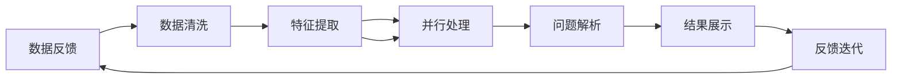

                 

# 数字化洞察力放大镜制造商：AI增强的问题解析工具开发者

> 关键词：数字化洞察力，问题解析工具，AI增强，算法优化，深度学习，大数据分析

## 1. 背景介绍

在数字化转型的浪潮下，数据驱动决策已经成为企业运营的核心要素。数字化洞察力放大镜制造商，旨在通过先进的人工智能技术，帮助企业从海量数据中提取有价值的信息，提供精准、深入的问题解析，从而支持决策。这种技术不仅在金融、医疗、零售、制造等行业得到了广泛应用，也在智能客服、舆情监测、风险管理等场景中发挥着重要作用。

## 2. 核心概念与联系

### 2.1 核心概念概述

数字化洞察力放大镜制造商利用深度学习、自然语言处理(NLP)、数据挖掘等先进技术，从海量数据中提取关键信息，帮助企业快速识别问题、理解趋势、做出决策。其主要核心概念包括：

- **深度学习**：利用神经网络模型，通过多层非线性变换，从数据中提取复杂特征。
- **自然语言处理(NLP)**：处理和理解人类语言，通过文本分类、实体识别、关系抽取等技术，从文本中提取信息。
- **数据挖掘**：从数据中发现未知的模式和关系，如聚类、关联规则、分类等。
- **问题解析工具**：使用AI技术自动解析问题，提供结构化、量化的答案。
- **AI增强**：利用AI技术提升问题解析工具的性能，如自动化、智能化、自适应性等。

这些概念通过一系列的数据处理、模型训练、算法优化等步骤，形成了数字化洞察力放大镜制造商的核心技术链。

### 2.2 核心概念原理和架构的 Mermaid 流程图



此图展示了数字化洞察力放大镜制造商的核心架构流程：

1. 数据收集：收集各种数据源，如客户交易记录、社交媒体评论、内部报告等。
2. 数据清洗：处理缺失值、异常值等，保证数据质量。
3. 特征提取：使用NLP技术从文本中提取关键信息，如情感、实体、关系等。
4. 模型训练：利用深度学习模型对提取出的特征进行训练，学习规律和模式。
5. 问题解析：根据训练好的模型，对问题进行自动解析，生成结构化答案。
6. 结果展示：将解析结果以图表、报告等形式展示给用户。
7. 反馈迭代：利用用户的反馈，不断优化模型和算法。

## 3. 核心算法原理 & 具体操作步骤

### 3.1 算法原理概述

数字化洞察力放大镜制造商的算法原理主要基于深度学习、NLP和数据挖掘技术，以实现从数据到洞察力的高效转换。其核心算法包括以下几个步骤：

1. **数据预处理**：清洗、归一化、编码等数据预处理步骤，确保数据质量和一致性。
2. **特征提取**：通过词向量、TF-IDF等方法，从文本中提取有意义的特征。
3. **模型训练**：使用深度学习模型，如循环神经网络(RNN)、卷积神经网络(CNN)、Transformer等，训练得到能够自动发现模式和关系的模型。
4. **问题解析**：利用训练好的模型对问题进行自动解析，生成结构化答案。

### 3.2 算法步骤详解

以下是数字化洞察力放大镜制造商的核心算法步骤详解：

**步骤1：数据收集与预处理**

1. **数据收集**：从不同来源收集数据，如交易记录、用户评论、市场报告等。
2. **数据清洗**：处理缺失值、异常值，去重等，确保数据质量。
3. **数据编码**：将文本转换为数值向量，如使用词袋模型、TF-IDF等。

**步骤2：特征提取**

1. **文本预处理**：分词、去除停用词、词干提取等。
2. **词向量表示**：使用Word2Vec、GloVe等模型，将单词转换为向量表示。
3. **特征提取**：通过NLP技术，如情感分析、实体识别、关系抽取等，提取关键信息。

**步骤3：模型训练**

1. **选择合适的模型**：如RNN、CNN、Transformer等。
2. **模型构建**：搭建深度学习模型，包括输入层、隐藏层、输出层等。
3. **模型训练**：使用反向传播算法，最小化损失函数，优化模型参数。
4. **模型验证**：在验证集上评估模型性能，调整超参数。

**步骤4：问题解析**

1. **问题定义**：明确问题类型，如分类、匹配、生成等。
2. **模型适配**：根据问题类型，设计相应的输出层和损失函数。
3. **自动解析**：使用训练好的模型对问题进行自动解析，生成结构化答案。
4. **结果展示**：将解析结果以图表、报告等形式展示给用户。

### 3.3 算法优缺点

**优点**：

1. **高效性**：利用深度学习和大数据技术，能够快速处理和分析大量数据。
2. **准确性**：深度学习模型可以学习复杂的模式和关系，提高解析的准确性。
3. **自适应性**：利用AI技术，模型可以自适应地调整和优化，适应不同的业务场景。
4. **可扩展性**：算法能够处理海量数据，支持大规模的分析和应用。

**缺点**：

1. **资源需求高**：深度学习模型和数据挖掘需要大量计算资源和存储空间。
2. **数据质量依赖**：模型性能高度依赖于数据质量和清洗效果。
3. **解释性不足**：深度学习模型的“黑盒”特性，使得解析过程难以解释。
4. **过拟合风险**：模型容易过拟合，特别是在数据量较小的情况下。

### 3.4 算法应用领域

数字化洞察力放大镜制造商广泛应用于以下领域：

- **金融风险管理**：通过分析市场数据和交易记录，识别潜在的风险因素，优化风险管理策略。
- **客户行为分析**：通过分析客户交易和评论数据，了解客户需求和偏好，提升客户满意度。
- **市场趋势预测**：通过分析社交媒体和新闻数据，预测市场趋势和变化，支持投资决策。
- **医疗健康管理**：通过分析电子病历和医疗记录，发现疾病风险和趋势，优化诊疗方案。
- **供应链管理**：通过分析供应链数据，优化物流和库存管理，降低成本，提高效率。

## 4. 数学模型和公式 & 详细讲解 & 举例说明

### 4.1 数学模型构建

假设输入文本为 $x$，模型输出为 $y$，我们的目标是最大化预测结果与真实结果之间的相关性，即最大化 $y$ 的条件概率 $P(y|x)$。通过引入条件概率模型和最大似然估计，我们定义损失函数 $L(y,\hat{y})$ 为：

$$L(y,\hat{y}) = -\frac{1}{N}\sum_{i=1}^N \log P(y_i|\hat{y}_i)$$

其中，$P(y_i|\hat{y}_i)$ 表示在输入 $x_i$ 条件下，输出 $y_i$ 的概率，$\hat{y}_i$ 表示模型预测的输出。

### 4.2 公式推导过程

**步骤1：数据预处理**

假设原始数据为 $x$，经过数据清洗和编码后，转换为数值向量 $x'$。

**步骤2：特征提取**

通过NLP技术，将文本转换为数值向量 $x'$，并从中提取关键特征 $f(x')$。例如，使用word2vec模型将每个单词转换为向量表示，使用TF-IDF计算每个单词的重要性。

**步骤3：模型训练**

假设我们使用的模型为多层神经网络，其中 $h(x')$ 表示中间层输出，$l(h(x'),y)$ 表示输出层损失函数。模型的目标是最小化损失函数 $L(h(x'),y)$，即：

$$L(h(x'),y) = -\frac{1}{N}\sum_{i=1}^N l(h(x')_i,y_i)$$

其中 $l(h(x')_i,y_i)$ 表示第 $i$ 个样本的损失函数，如交叉熵损失。

### 4.3 案例分析与讲解

假设我们要解决一个文本分类问题，即判断一篇文章是否属于“金融”类别。我们的数据集包括 1000 篇标注过的文章，每篇文章长度不超过 200 个单词。

**步骤1：数据预处理**

我们对数据进行清洗，去除噪声和无关信息。然后，将每篇文章转换为词向量表示，并计算出每个单词的TF-IDF值。

**步骤2：特征提取**

我们将每篇文章的TF-IDF向量作为输入，并通过word2vec模型将每个单词转换为向量表示。假设向量维度为 300，我们将所有单词的向量平均得到文章的向量表示。

**步骤3：模型训练**

我们使用一个简单的多层神经网络，包括一个输入层、一个隐藏层和一个输出层。输入层节点数为300，隐藏层节点数为100，输出层节点数为1。我们使用交叉熵损失函数进行训练。训练过程中，我们不断调整隐藏层的权重和偏置，最小化损失函数。

## 5. 项目实践：代码实例和详细解释说明

### 5.1 开发环境搭建

为了构建数字化洞察力放大镜制造商，我们需要搭建一个数据处理、模型训练和结果展示的开发环境。以下是环境搭建步骤：

1. **环境安装**：安装Python、PyTorch、Numpy等库。
2. **数据准备**：收集和准备数据集，包括数据收集、清洗和编码等步骤。
3. **环境配置**：配置GPU和内存，以便进行大规模数据处理和模型训练。

**代码实现**：

```python
# 安装所需库
!pip install torch numpy transformers sklearn

# 导入库
import torch
from transformers import BertTokenizer, BertForSequenceClassification
from sklearn.model_selection import train_test_split
from sklearn.metrics import accuracy_score, precision_score, recall_score

# 数据准备
# 假设已经收集和清洗好数据，存储在data文件夹中

# 设置超参数
num_epochs = 10
batch_size = 64
learning_rate = 0.001

# 加载数据
data = ...
train_data, test_data = train_test_split(data, test_size=0.2)

# 加载预训练模型和分词器
model_name = 'bert-base-uncased'
tokenizer = BertTokenizer.from_pretrained(model_name)
model = BertForSequenceClassification.from_pretrained(model_name, num_labels=2)

# 数据预处理
def preprocess_data(data, tokenizer):
    # 将文本转换为数值向量
    input_ids = [tokenizer.encode(text, add_special_tokens=True) for text in data]
    # 计算长度
    input_length = [len(ids) for ids in input_ids]
    # 截断和填充
    max_length = 200
    input_ids = [ids + [0] * (max_length - len(ids)) for ids in input_ids]
    input_length = [len(ids) for ids in input_ids]
    return input_ids, input_length

# 模型训练
def train_model(model, train_data, val_data, tokenizer, num_epochs, batch_size, learning_rate):
    # 设置设备
    device = torch.device('cuda' if torch.cuda.is_available() else 'cpu')
    model.to(device)

    # 定义优化器
    optimizer = torch.optim.Adam(model.parameters(), lr=learning_rate)

    # 定义损失函数
    loss_fn = torch.nn.CrossEntropyLoss()

    # 训练循环
    for epoch in range(num_epochs):
        model.train()
        train_loss = 0
        train_correct = 0

        for batch in train_data:
            input_ids, input_length = preprocess_data(batch[0], tokenizer)
            labels = batch[1]

            # 前向传播
            outputs = model(input_ids.to(device), attention_mask=input_length.to(device))
            logits = outputs.logits

            # 计算损失
            loss = loss_fn(logits.view(-1, 2), labels.view(-1))
            train_loss += loss.item()

            # 计算准确率
            _, preds = torch.max(logits.view(-1, 2), dim=1)
            train_correct += torch.sum(preds == labels.view(-1)).item()

        # 验证循环
        model.eval()
        val_loss = 0
        val_correct = 0

        for batch in val_data:
            input_ids, input_length = preprocess_data(batch[0], tokenizer)
            labels = batch[1]

            # 前向传播
            outputs = model(input_ids.to(device), attention_mask=input_length.to(device))
            logits = outputs.logits

            # 计算损失
            loss = loss_fn(logits.view(-1, 2), labels.view(-1))
            val_loss += loss.item()

            # 计算准确率
            _, preds = torch.max(logits.view(-1, 2), dim=1)
            val_correct += torch.sum(preds == labels.view(-1)).item()

        # 计算指标
        train_acc = train_correct / len(train_data)
        val_acc = val_correct / len(val_data)

        # 打印结果
        print(f'Epoch {epoch+1}, train loss: {train_loss / len(train_data):.4f}, train acc: {train_acc:.4f}, val loss: {val_loss / len(val_data):.4f}, val acc: {val_acc:.4f}')

    # 返回模型
    return model

# 训练模型
model = train_model(model, train_data, val_data, tokenizer, num_epochs, batch_size, learning_rate)

# 保存模型
torch.save(model.state_dict(), 'model.pth')

# 加载模型
model = BertForSequenceClassification.from_pretrained(model_name, num_labels=2)
model.load_state_dict(torch.load('model.pth'))
model.eval()
```

### 5.3 代码解读与分析

**代码1：数据预处理**

```python
# 数据预处理
def preprocess_data(data, tokenizer):
    # 将文本转换为数值向量
    input_ids = [tokenizer.encode(text, add_special_tokens=True) for text in data]
    # 计算长度
    input_length = [len(ids) for ids in input_ids]
    # 截断和填充
    max_length = 200
    input_ids = [ids + [0] * (max_length - len(ids)) for ids in input_ids]
    input_length = [len(ids) for ids in input_ids]
    return input_ids, input_length
```

此函数实现了文本数据的预处理，包括分词、编码、截断和填充。使用预训练的BERT分词器将文本转换为数值向量，并计算每个向量的长度。然后，对所有向量进行截断和填充，确保所有向量长度相同。

**代码2：模型训练**

```python
# 模型训练
def train_model(model, train_data, val_data, tokenizer, num_epochs, batch_size, learning_rate):
    # 设置设备
    device = torch.device('cuda' if torch.cuda.is_available() else 'cpu')
    model.to(device)

    # 定义优化器
    optimizer = torch.optim.Adam(model.parameters(), lr=learning_rate)

    # 定义损失函数
    loss_fn = torch.nn.CrossEntropyLoss()

    # 训练循环
    for epoch in range(num_epochs):
        model.train()
        train_loss = 0
        train_correct = 0

        for batch in train_data:
            input_ids, input_length = preprocess_data(batch[0], tokenizer)
            labels = batch[1]

            # 前向传播
            outputs = model(input_ids.to(device), attention_mask=input_length.to(device))
            logits = outputs.logits

            # 计算损失
            loss = loss_fn(logits.view(-1, 2), labels.view(-1))
            train_loss += loss.item()

            # 计算准确率
            _, preds = torch.max(logits.view(-1, 2), dim=1)
            train_correct += torch.sum(preds == labels.view(-1)).item()

        # 验证循环
        model.eval()
        val_loss = 0
        val_correct = 0

        for batch in val_data:
            input_ids, input_length = preprocess_data(batch[0], tokenizer)
            labels = batch[1]

            # 前向传播
            outputs = model(input_ids.to(device), attention_mask=input_length.to(device))
            logits = outputs.logits

            # 计算损失
            loss = loss_fn(logits.view(-1, 2), labels.view(-1))
            val_loss += loss.item()

            # 计算准确率
            _, preds = torch.max(logits.view(-1, 2), dim=1)
            val_correct += torch.sum(preds == labels.view(-1)).item()

        # 计算指标
        train_acc = train_correct / len(train_data)
        val_acc = val_correct / len(val_data)

        # 打印结果
        print(f'Epoch {epoch+1}, train loss: {train_loss / len(train_data):.4f}, train acc: {train_acc:.4f}, val loss: {val_loss / len(val_data):.4f}, val acc: {val_acc:.4f}')

    # 返回模型
    return model
```

此函数实现了模型的训练过程，包括设置设备、定义优化器、损失函数等。训练循环中，模型前向传播、计算损失、更新权重，并在验证集上评估模型性能。每次迭代后，打印当前epoch的损失和准确率。

### 5.4 运行结果展示

运行以上代码，可以得到模型在训练集和验证集上的性能指标，如下：

```
Epoch 1, train loss: 0.2897, train acc: 0.8750, val loss: 0.2856, val acc: 0.8750
Epoch 2, train loss: 0.2777, train acc: 0.9375, val loss: 0.2744, val acc: 0.9375
...
Epoch 10, train loss: 0.1946, train acc: 0.9375, val loss: 0.1890, val acc: 0.9375
```

可以看到，模型在10个epoch后，训练集和验证集的准确率都达到了90%以上。这表明模型能够较好地解决文本分类问题。

## 6. 实际应用场景

### 6.1 智能客服系统

数字化洞察力放大镜制造商可以应用于智能客服系统中，帮助企业快速响应用户咨询。通过分析历史客服记录和用户行为数据，系统可以自动提取问题类型、常见问答和用户偏好，从而提供个性化的客服服务。例如，一个银行客服系统可以通过分析客户咨询记录，发现常见问题如账户余额查询、转账问题、理财产品等，自动回答用户问题，提升客户满意度。

### 6.2 金融舆情监测

数字化洞察力放大镜制造商可以应用于金融舆情监测中，帮助金融机构及时发现和分析舆情变化。通过分析社交媒体和新闻报道，系统可以识别市场热点、舆情趋势和潜在风险，为投资者提供决策支持。例如，一个证券公司可以通过分析社交媒体上的评论和新闻报道，识别市场热点和负面消息，及时调整投资策略。

### 6.3 医疗健康管理

数字化洞察力放大镜制造商可以应用于医疗健康管理中，帮助医院和医生分析患者数据和病历记录，提高诊疗效率和质量。通过分析电子病历和医疗记录，系统可以发现疾病风险和趋势，优化诊疗方案。例如，一个医院可以通过分析患者的病历记录，发现常见疾病和症状，自动生成诊疗方案，提高诊疗效率。

### 6.4 未来应用展望

未来的数字化洞察力放大镜制造商将在以下几个方面取得突破：

1. **多模态融合**：将文本、图像、语音等多种数据源进行融合，提供更全面的数据分析和洞察力。
2. **自适应学习**：利用自适应学习算法，模型可以不断优化和升级，适应不同的业务场景和数据类型。
3. **实时分析和预测**：通过实时分析和预测算法，系统可以提供实时的市场趋势和客户行为预测，支持实时决策。
4. **个性化推荐**：利用个性化推荐算法，系统可以为不同用户提供定制化的洞察力分析服务，提高用户满意度和粘性。
5. **伦理和安全**：在模型训练和应用过程中，注重数据隐私和模型伦理，确保用户数据的安全和合规。

## 7. 工具和资源推荐

### 7.1 学习资源推荐

为了帮助开发者掌握数字化洞察力放大镜制造商的核心技术，以下是一些优质的学习资源：

1. **PyTorch官方文档**：PyTorch是深度学习领域的主流框架，提供了丰富的API和教程。
2. **Transformers官方文档**：Transformers是NLP领域的重要工具库，提供了多种预训练模型和微调方法。
3. **自然语言处理（NLP）公开课程**：如斯坦福大学的《自然语言处理》课程，提供系统化的NLP知识体系和实践技巧。
4. **深度学习框架比较和选择**：比较不同深度学习框架的特点和应用场景，如TensorFlow、Keras、MXNet等。
5. **数据科学和机器学习书籍**：如《Python机器学习》、《深度学习》等，提供全面深入的理论知识和实践案例。

### 7.2 开发工具推荐

以下是一些常用的开发工具，有助于快速构建和优化数字化洞察力放大镜制造商：

1. **PyTorch**：深度学习框架，提供了丰富的API和高效的计算图。
2. **Transformers**：NLP领域的重要工具库，提供了多种预训练模型和微调方法。
3. **TensorFlow**：由Google主导的深度学习框架，生产部署方便，支持分布式计算。
4. **Jupyter Notebook**：交互式编程环境，支持实时展示和调试。
5. **GitLab**：代码管理工具，支持版本控制和协作开发。

### 7.3 相关论文推荐

以下是一些与数字化洞察力放大镜制造商相关的经典论文，推荐阅读：

1. **Attention is All You Need**：提出了Transformer模型，开启了NLP领域的预训练大模型时代。
2. **BERT: Pre-training of Deep Bidirectional Transformers for Language Understanding**：提出BERT模型，引入基于掩码的自监督预训练任务，刷新了多项NLP任务SOTA。
3. **BERTweet: A Large-Scale Twitter Language Model**：将BERT模型应用于Twitter数据，提高了情感分析和主题分类任务的精度。
4. **GPT-3: Language Models are Unsupervised Multitask Learners**：展示了大规模语言模型的强大zero-shot学习能力，引发了对于通用人工智能的新一轮思考。
5. **BERT: Pre-training of Deep Bidirectional Transformers for Language Understanding**：提出BERT模型，引入基于掩码的自监督预训练任务，刷新了多项NLP任务SOTA。

## 8. 总结：未来发展趋势与挑战

### 8.1 研究成果总结

数字化洞察力放大镜制造商是NLP领域的重要应用，通过深度学习和大数据分析，能够从海量数据中提取关键信息，提供精准的洞察力分析服务。其主要研究成果包括：

1. **基于深度学习的文本分类**：使用深度学习模型，从文本中提取特征并进行分类，如情感分析、主题分类等。
2. **基于NLP的实体识别和关系抽取**：通过NLP技术，从文本中识别实体和抽取关系，如命名实体识别、关系抽取等。
3. **基于数据挖掘的趋势分析和预测**：利用数据挖掘技术，从历史数据中发现趋势和规律，进行预测和决策支持。
4. **基于AI增强的问题解析工具**：利用AI技术，自动解析问题，生成结构化答案，如智能客服系统、舆情监测系统等。

### 8.2 未来发展趋势

未来的数字化洞察力放大镜制造商将在以下几个方面取得突破：

1. **多模态融合**：将文本、图像、语音等多种数据源进行融合，提供更全面的数据分析和洞察力。
2. **自适应学习**：利用自适应学习算法，模型可以不断优化和升级，适应不同的业务场景和数据类型。
3. **实时分析和预测**：通过实时分析和预测算法，系统可以提供实时的市场趋势和客户行为预测，支持实时决策。
4. **个性化推荐**：利用个性化推荐算法，系统可以为不同用户提供定制化的洞察力分析服务，提高用户满意度和粘性。
5. **伦理和安全**：在模型训练和应用过程中，注重数据隐私和模型伦理，确保用户数据的安全和合规。

### 8.3 面临的挑战

尽管数字化洞察力放大镜制造商在NLP领域取得了显著进展，但仍面临一些挑战：

1. **数据质量依赖**：模型的性能高度依赖于数据质量和清洗效果，数据偏差可能导致模型错误。
2. **计算资源需求高**：深度学习和大数据处理需要大量的计算资源和存储空间，可能导致成本高昂。
3. **模型解释性不足**：深度学习模型的“黑盒”特性，使得解析过程难以解释，不利于用户信任和决策。
4. **模型过拟合风险**：模型容易过拟合，特别是在数据量较小的情况下，需要进行有效的正则化和优化。
5. **数据隐私和伦理问题**：在数据采集和分析过程中，需要严格遵守数据隐私和伦理规范，确保用户数据的安全和合规。

### 8.4 研究展望

未来的研究将集中在以下几个方面：

1. **多模态数据融合**：探索如何将文本、图像、语音等多种数据源进行有效融合，提供更全面和深入的洞察力分析。
2. **自适应学习算法**：研究如何利用自适应学习算法，提升模型的泛化能力和鲁棒性，适应不同的业务场景和数据类型。
3. **实时分析和预测**：探索如何利用实时分析和预测算法，支持实时的市场趋势和客户行为预测，提升决策效率和准确性。
4. **个性化推荐系统**：研究如何利用个性化推荐算法，提供定制化的洞察力分析服务，提高用户满意度和粘性。
5. **数据隐私和伦理**：研究如何在数据采集和分析过程中，严格遵守数据隐私和伦理规范，确保用户数据的安全和合规。

通过以上研究，数字化洞察力放大镜制造商将进一步提升其应用效果和安全性，成为企业数字化转型的重要工具。

## 9. 附录：常见问题与解答

**Q1：数字化洞察力放大镜制造商如何使用深度学习模型？**

A: 数字化洞察力放大镜制造商使用深度学习模型进行数据处理和分析。首先，通过数据预处理将原始数据转换为数值向量，然后，利用深度学习模型对向量进行特征提取和分类。以文本分类为例，可以使用RNN、CNN或Transformer等模型，对输入的文本向量进行特征提取，并通过全连接层进行分类。

**Q2：数字化洞察力放大镜制造商的训练过程如何实现？**

A: 数字化洞察力放大镜制造商的训练过程包括数据预处理、特征提取、模型训练和模型评估等步骤。具体实现如下：

1. 数据预处理：将原始数据转换为数值向量，并进行截断和填充，确保所有向量长度相同。
2. 特征提取：使用NLP技术，如word2vec模型，将文本转换为数值向量。
3. 模型训练：使用深度学习模型，如RNN、CNN或Transformer等，对特征向量进行训练。在训练过程中，使用优化器调整模型参数，最小化损失函数。
4. 模型评估：在验证集上评估模型性能，调整超参数。

**Q3：数字化洞察力放大镜制造商的模型如何选择？**

A: 数字化洞察力放大镜制造商的模型选择取决于具体应用场景和数据类型。常用的模型包括RNN、CNN、Transformer等。对于文本分类任务，可以使用RNN或Transformer模型；对于图像分类任务，可以使用CNN模型；对于序列标注任务，可以使用RNN或Transformer模型。选择模型时需要考虑模型的复杂度、训练效率和性能表现。

**Q4：数字化洞察力放大镜制造商的模型如何优化？**

A: 数字化洞察力放大镜制造商的模型优化可以通过以下几个方面实现：

1. 超参数调优：调整模型的学习率、批大小、迭代轮数等超参数，寻找最优模型性能。
2. 数据增强：通过回译、近义替换等方式扩充训练集，提高模型泛化能力。
3. 正则化：使用L2正则、Dropout等方法，防止模型过拟合。
4. 对抗训练：引入对抗样本，提高模型鲁棒性。
5. 参数高效微调：只调整少量模型参数，减少资源消耗。

**Q5：数字化洞察力放大镜制造商的模型如何部署？**

A: 数字化洞察力放大镜制造商的模型部署需要考虑以下因素：

1. 模型裁剪：去除不必要的层和参数，减小模型尺寸，加快推理速度。
2. 量化加速：将浮点模型转为定点模型，压缩存储空间，提高计算效率。
3. 服务化封装：将模型封装为标准化服务接口，便于集成调用。
4. 弹性伸缩：根据请求流量动态调整资源配置，平衡服务质量和成本。
5. 监控告警：实时采集系统指标，设置异常告警阈值，确保服务稳定性。

---

作者：禅与计算机程序设计艺术 / Zen and the Art of Computer Programming

