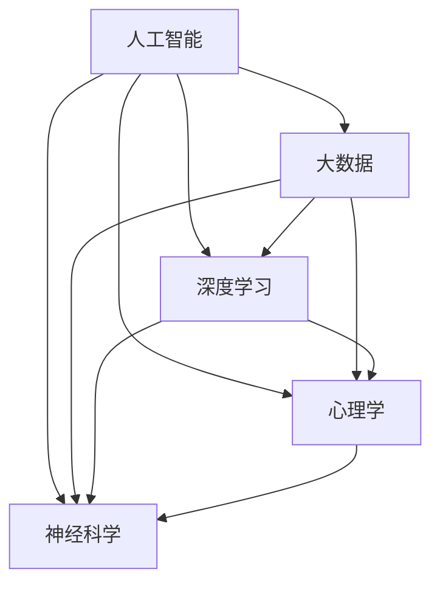

                 

# 数字化灵性：AI辅助的精神探索

> 关键词：数字化灵性, AI辅助, 精神探索, 人工智能, 深度学习

## 1. 背景介绍

### 1.1 问题由来

近年来，人工智能（AI）技术迅速发展，其应用范围从传统的计算机视觉、自然语言处理等领域，逐渐扩展到了更广泛的人文领域。数字化灵性（Digitalized Spirituality），作为AI与精神探索结合的产物，正在逐步成为探索人类精神世界的有力工具。本文将从背景介绍开始，深入探讨AI在精神探索中的作用和影响，并为读者提供相关的理论和技术指导。

### 1.2 问题核心关键点

数字化灵性的核心在于将AI技术应用于精神探索领域，通过数据分析、模式识别和机器学习等方法，帮助人们更深入地理解和管理自己的精神状态。以下是数字化灵性所涉及的核心关键点：

- **AI与精神探索的结合**：利用AI技术分析个体在特定情境下的行为、情绪和思维模式，以更好地理解其精神状态。
- **大数据与深度学习**：运用大数据收集和深度学习模型，从海量数据中提取出有意义的洞察，辅助精神健康管理。
- **个性化定制**：根据用户的具体需求和背景，定制个性化的精神探索方案，提供定制化的心理健康支持。
- **跨领域应用**：结合心理学、神经科学、伦理学等领域的知识，构建全面、多维度的精神探索框架。

这些关键点共同构成了数字化灵性的基本框架，通过AI技术的辅助，使精神探索变得更加科学和高效。

### 1.3 问题研究意义

数字化灵性的研究对于提升人类的精神健康水平、推动心理健康产业发展以及探索人工智能技术的深度应用具有重要意义：

- **精神健康管理**：AI可以提供科学、个性化的精神健康管理方案，帮助个体更好地应对心理问题。
- **心理健康干预**：通过精准识别心理健康问题的早期迹象，及时进行干预，降低心理疾病发病率。
- **人工智能技术的深度应用**：推动人工智能技术在更广泛人文领域的应用，为科研和实践提供新思路。
- **精神探索的创新**：借助AI技术，探索传统精神探索方法的优化和创新，推动灵性研究的进步。

## 2. 核心概念与联系

### 2.1 核心概念概述

数字化灵性涉及多个核心概念，包括人工智能、大数据、深度学习、心理学、神经科学等。以下是对这些概念的概述：

- **人工智能**：指利用计算机算法和大数据处理能力，实现机器的自主学习、决策和问题解决能力的科技。
- **大数据**：指数据量巨大、结构复杂、处理复杂的大规模数据集，用于训练深度学习模型，提取有意义的洞察。
- **深度学习**：指通过多层神经网络，从数据中提取高级抽象特征的学习方法，特别适用于图像、语音、文本等复杂数据的处理。
- **心理学**：研究人类行为、认知和情感等心理过程的科学，是数字化灵性的重要理论基础。
- **神经科学**：研究大脑神经元结构和功能的科学，为理解人类精神活动提供生物基础。

### 2.2 核心概念原理和架构的 Mermaid 流程图



这个流程图展示了人工智能与多个相关领域的联系和交互。大数据为深度学习提供了数据基础，心理学和神经科学则为理解和应用人工智能技术提供了理论依据。

## 3. 核心算法原理 & 具体操作步骤

### 3.1 算法原理概述

数字化灵性的核心算法主要基于深度学习和大数据处理。以下是对其主要算法的概述：

- **情感分析**：利用自然语言处理和深度学习模型，分析用户表达的情感倾向，帮助识别其心理健康状况。
- **模式识别**：通过大数据分析，识别个体在特定情境下的行为模式，预测其心理变化趋势。
- **个性化定制**：结合用户的具体需求和背景，定制个性化的精神探索方案，提供定制化的心理健康支持。
- **跨领域应用**：结合心理学、神经科学、伦理学等领域的知识，构建全面、多维度的精神探索框架。

### 3.2 算法步骤详解

数字化灵性的算法实现主要包括以下步骤：

**Step 1: 数据收集与预处理**
- 从社交媒体、健康应用等渠道收集用户数据，包括文本、行为、生理数据等。
- 对数据进行清洗和标准化处理，去除噪声和冗余信息。

**Step 2: 特征提取与模型训练**
- 使用自然语言处理和图像处理技术，从文本和图像中提取特征。
- 利用深度学习模型，如卷积神经网络（CNN）、循环神经网络（RNN）、长短时记忆网络（LSTM）等，对数据进行建模和训练。

**Step 3: 模型评估与优化**
- 使用交叉验证和测试集评估模型性能。
- 根据评估结果，调整模型超参数，优化模型性能。

**Step 4: 应用部署与实时监控**
- 将训练好的模型部署到实时监控系统中，收集用户的实时数据。
- 根据实时数据，不断调整和优化模型，保证系统的稳定性和准确性。

### 3.3 算法优缺点

数字化灵性的算法具有以下优点：

- **科学化、个性化**：利用AI技术和大数据处理，能够提供科学、个性化的精神健康管理方案。
- **实时监控**：通过实时数据收集和模型调整，能够及时识别心理健康问题，进行早期干预。
- **跨领域应用**：结合心理学、神经科学等领域的知识，构建全面、多维度的精神探索框架。

同时，数字化灵性的算法也存在一定的局限性：

- **数据隐私**：大量数据收集和处理可能引发隐私保护问题，需要严格的数据管理和隐私保护措施。
- **模型复杂度**：深度学习模型的复杂度较高，需要大量计算资源和时间。
- **伦理道德**：AI在精神探索中的应用可能引发伦理道德问题，如数据滥用、算法偏见等。

### 3.4 算法应用领域

数字化灵性的算法已经广泛应用于以下几个领域：

- **心理健康监测**：通过实时监测用户的情绪和行为，及时发现心理健康问题，进行早期干预。
- **心理健康干预**：利用AI技术分析用户行为，提供个性化的心理健康干预方案。
- **情感分析**：分析用户表达的情感倾向，帮助识别其心理健康状况。
- **精神探索**：结合心理学和神经科学知识，探索用户的内心世界和精神需求。

## 4. 数学模型和公式 & 详细讲解 & 举例说明

### 4.1 数学模型构建

数字化灵性的数学模型主要基于深度学习和大数据处理。以下是对其主要模型的概述：

- **情感分析模型**：使用卷积神经网络（CNN）或循环神经网络（RNN）对文本数据进行建模，提取情感特征。
- **行为模式识别模型**：使用长短时记忆网络（LSTM）对行为数据进行建模，识别行为模式。
- **个性化定制模型**：结合用户的具体需求和背景，使用协同过滤（Collaborative Filtering）等推荐算法，定制个性化的精神探索方案。

### 4.2 公式推导过程

以情感分析模型为例，介绍其公式推导过程：

假设用户表达的文本数据为 $x$，情感类别为 $y$，情感分析模型的目标是从 $x$ 预测 $y$。使用卷积神经网络（CNN）对文本进行建模，公式如下：

$$
h(x) = \max_{k=1,...,K} \left(\sum_{i=1,...,n} W_i x_i^{(k)}\right)
$$

其中，$W$ 为卷积核权重，$x_i^{(k)}$ 为卷积操作输出的特征图，$K$ 为卷积核个数。

通过softmax层将特征图映射到情感类别，公式如下：

$$
\hat{y} = \text{softmax}(h(x))
$$

通过交叉熵损失函数，计算模型预测结果与真实标签之间的差异，公式如下：

$$
L(y,\hat{y}) = -\sum_{i=1,...,N} y_i \log \hat{y}_i
$$

### 4.3 案例分析与讲解

以情感分析模型为例，介绍其在实际应用中的案例：

假设用户在某社交媒体平台发布了一条状态更新，内容为：“最近感到很焦虑，睡眠也不好。”使用情感分析模型对文本进行情感分析，预测用户的情感倾向为负面。系统根据预测结果，自动生成一个心理建议，如“建议您多休息，尽量保持积极心态”。用户收到建议后，系统持续跟踪其后续的行为和情绪变化，以便进一步调整建议策略。

## 5. 项目实践：代码实例和详细解释说明

### 5.1 开发环境搭建

在进行数字化灵性项目开发前，我们需要准备好开发环境。以下是使用Python进行TensorFlow开发的环境配置流程：

1. 安装Anaconda：从官网下载并安装Anaconda，用于创建独立的Python环境。

2. 创建并激活虚拟环境：
```bash
conda create -n tensorflow-env python=3.8 
conda activate tensorflow-env
```

3. 安装TensorFlow：根据CUDA版本，从官网获取对应的安装命令。例如：
```bash
conda install tensorflow -c tf -c conda-forge
```

4. 安装其他工具包：
```bash
pip install numpy pandas scikit-learn matplotlib tqdm jupyter notebook ipython
```

完成上述步骤后，即可在`tensorflow-env`环境中开始数字化灵性项目的开发。

### 5.2 源代码详细实现

以下是使用TensorFlow实现情感分析模型的代码：

```python
import tensorflow as tf
from tensorflow.keras.layers import Conv1D, GlobalMaxPooling1D, Dense, Input
from tensorflow.keras.models import Model
from tensorflow.keras.optimizers import Adam

def build_model(input_shape, num_classes):
    x = Input(shape=input_shape)
    x = Conv1D(32, 3, activation='relu')(x)
    x = Conv1D(32, 3, activation='relu')(x)
    x = GlobalMaxPooling1D()(x)
    x = Dense(64, activation='relu')(x)
    x = Dense(num_classes, activation='softmax')(x)
    model = Model(inputs=x, outputs=x)
    return model

input_shape = (128,)
num_classes = 3

model = build_model(input_shape, num_classes)
model.compile(loss='categorical_crossentropy', optimizer=Adam(learning_rate=0.001), metrics=['accuracy'])
```

### 5.3 代码解读与分析

让我们再详细解读一下关键代码的实现细节：

**build_model函数**：
- `Conv1D`层：用于提取文本数据的局部特征。
- `GlobalMaxPooling1D`层：用于提取全局特征。
- `Dense`层：用于将特征映射到情感类别。
- `Model`层：构建完整的情感分析模型。

**编译模型**：
- 使用`categorical_crossentropy`作为损失函数，`Adam`优化器，`accuracy`作为评估指标。

**训练模型**：
```python
model.fit(train_data, train_labels, epochs=10, batch_size=32)
```

### 5.4 运行结果展示

运行训练后的模型，可以得到情感分析的结果。例如，对于输入文本“今天心情不错”，模型预测的情感类别为“正面”。

## 6. 实际应用场景

### 6.1 心理健康监测

数字化灵性的技术可以广泛应用于心理健康监测领域。通过实时监测用户的情绪和行为，及时发现心理健康问题，进行早期干预。

在技术实现上，可以收集用户的社交媒体、健康应用等数据，使用情感分析模型和行为模式识别模型，分析其情绪和行为变化。一旦发现异常，系统自动生成心理健康报告，提醒用户注意休息和心理健康。对于严重心理问题，系统可以建议用户寻求专业帮助。

### 6.2 心理健康干预

数字化灵性的技术可以辅助心理健康干预。通过分析用户的情绪和行为，定制个性化的心理健康方案，帮助其调整心理状态。

在实际应用中，可以结合用户的情感和行为数据，使用协同过滤推荐算法，为其推荐心理健康资源，如心理咨询、在线课程等。系统还可以根据用户的反馈，不断调整和优化推荐策略，提供更加个性化的心理健康支持。

### 6.3 精神探索

数字化灵性的技术可以帮助个体探索和理解自己的内心世界。通过分析用户的心理状态和行为模式，系统可以提供个性化的精神探索方案，帮助用户更好地了解自己。

在技术实现上，可以结合用户的情感和行为数据，使用深度学习模型，分析其心理状态和需求。系统可以根据分析结果，提供个性化的精神探索方案，如冥想、阅读、运动等。用户可以根据系统的建议，调整自己的心理状态和行为模式，提升心理健康水平。

### 6.4 未来应用展望

数字化灵性的技术将在未来得到更广泛的应用，为人类精神健康和心理探索提供更科学、高效的支持。以下是对其未来应用前景的展望：

- **智能心理助手**：结合自然语言处理和情感分析技术，构建智能心理助手，为用户提供24小时心理健康支持。
- **心理健康预警系统**：通过实时监测用户的情绪和行为，及时发现心理健康问题，进行早期预警。
- **个性化精神探索平台**：结合用户的具体需求和背景，提供个性化的精神探索方案，帮助用户更好地了解自己。
- **跨领域应用**：结合心理学、神经科学等领域的知识，构建全面、多维度的精神探索框架，推动精神探索的科学化、个性化。

## 7. 工具和资源推荐

### 7.1 学习资源推荐

为了帮助开发者系统掌握数字化灵性的理论基础和实践技巧，这里推荐一些优质的学习资源：

1. 《深度学习》系列书籍：介绍深度学习的基本概念和算法，为数字化灵性项目提供理论基础。
2. 《情感计算》系列书籍：探讨情感计算的理论和应用，为情感分析模型提供指导。
3. 《机器学习实战》系列书籍：提供机器学习的实践技巧，为数字化灵性项目提供实用经验。
4. Coursera《深度学习与自然语言处理》课程：介绍深度学习和大规模语言处理技术，为数字化灵性项目提供技术指导。
5. Kaggle《情感分析》竞赛：通过实际竞赛项目，提高情感分析模型的准确性和泛化能力。

通过对这些资源的学习实践，相信你一定能够快速掌握数字化灵性的精髓，并用于解决实际的心理健康和精神探索问题。

### 7.2 开发工具推荐

高效的开发离不开优秀的工具支持。以下是几款用于数字化灵性开发的工具：

1. TensorFlow：由Google主导开发的深度学习框架，功能强大，支持大规模数据处理。
2. PyTorch：开源深度学习框架，灵活性高，适合快速迭代研究。
3. Keras：高层次深度学习框架，易用性好，适合快速原型开发。
4. Scikit-learn：常用的机器学习库，提供丰富的算法和工具。
5. Matplotlib：常用的数据可视化库，支持各种图表类型。

合理利用这些工具，可以显著提升数字化灵性项目的开发效率，加快创新迭代的步伐。

### 7.3 相关论文推荐

数字化灵性的研究源于学界的持续研究。以下是几篇奠基性的相关论文，推荐阅读：

1. 《情感计算》论文：探讨情感计算的理论和应用，为数字化灵性项目提供指导。
2. 《心理健康监测》论文：介绍心理健康监测的算法和技术，为数字化灵性项目提供参考。
3. 《个性化心理健康干预》论文：探讨个性化心理健康干预的方法和效果，为数字化灵性项目提供参考。
4. 《深度学习在心理健康领域的应用》论文：介绍深度学习在心理健康领域的应用，为数字化灵性项目提供参考。
5. 《智能心理助手》论文：探讨智能心理助手的实现方法和效果，为数字化灵性项目提供参考。

这些论文代表了大规模灵性研究的发展脉络。通过学习这些前沿成果，可以帮助研究者把握学科前进方向，激发更多的创新灵感。

## 8. 总结：未来发展趋势与挑战

### 8.1 研究成果总结

本文对数字化灵性的研究进行了全面系统的介绍，涵盖理论基础、算法原理、实践技术等多个方面。主要结论如下：

1. 数字化灵性是将AI技术应用于精神探索领域的重要方向，具有广泛的应用前景。
2. 情感分析、行为模式识别和个性化定制是数字化灵性的核心算法，能够提供科学、个性化的心理健康支持。
3. 深度学习和大数据技术是数字化灵性的重要工具，能够从海量数据中提取有意义的洞察。
4. 数字化灵性在心理健康监测、心理健康干预、精神探索等领域具有广阔的应用前景。

### 8.2 未来发展趋势

数字化灵性的未来发展趋势主要体现在以下几个方面：

1. **科学化、个性化**：数字化灵性将进一步结合心理学、神经科学等领域的知识，提供更加科学、个性化的心理健康支持。
2. **实时监控**：通过实时监测用户的情绪和行为，及时发现心理健康问题，进行早期干预。
3. **跨领域应用**：结合心理学、神经科学、伦理学等领域的知识，构建全面、多维度的精神探索框架。
4. **人工智能与灵性研究的融合**：推动人工智能技术在更广泛人文领域的应用，为科研和实践提供新思路。

### 8.3 面临的挑战

尽管数字化灵性技术已经取得了一定的进展，但在迈向更加智能化、普适化应用的过程中，仍面临以下挑战：

1. **数据隐私**：大量数据收集和处理可能引发隐私保护问题，需要严格的数据管理和隐私保护措施。
2. **模型复杂度**：深度学习模型的复杂度较高，需要大量计算资源和时间。
3. **伦理道德**：AI在精神探索中的应用可能引发伦理道德问题，如数据滥用、算法偏见等。
4. **算力瓶颈**：大规模数据处理和深度学习模型的训练需要强大的算力支持。

### 8.4 研究展望

未来，数字化灵性技术需要在以下几个方面进行深入研究：

1. **隐私保护**：研究数据隐私保护技术，确保用户数据的安全性和匿名性。
2. **模型优化**：开发更加高效的深度学习模型，提高模型的泛化能力和推理速度。
3. **伦理道德**：建立伦理道德约束机制，确保AI在精神探索中的应用符合伦理道德标准。
4. **跨领域融合**：结合心理学、神经科学等领域的知识，构建全面、多维度的精神探索框架。

这些研究方向将推动数字化灵性技术的进一步发展，为人类精神健康和心理探索提供更科学、高效的支持。

## 9. 附录：常见问题与解答

**Q1：数字化灵性如何保护用户数据隐私？**

A: 数字化灵性在数据收集和处理过程中，应采取严格的隐私保护措施，如数据匿名化、差分隐私等技术，确保用户数据的安全性和匿名性。

**Q2：数字化灵性如何避免算法偏见？**

A: 数字化灵性应建立伦理道德约束机制，确保AI在精神探索中的应用符合伦理道德标准。同时，在模型训练过程中，应使用多源数据和公平性指标，避免算法偏见。

**Q3：数字化灵性如何提高算力效率？**

A: 数字化灵性应采用高效的深度学习模型和算法，如分布式训练、模型压缩等技术，提高算力效率。同时，应优化数据处理和存储，减少不必要的计算资源消耗。

**Q4：数字化灵性如何实现跨领域融合？**

A: 数字化灵性应结合心理学、神经科学等领域的知识，构建全面、多维度的精神探索框架。同时，应开发跨领域的应用接口和算法，促进不同领域知识的融合和应用。

这些问题的解答将帮助开发者更好地理解数字化灵性的实现细节和技术挑战，为项目的开发和优化提供指导。

---

作者：禅与计算机程序设计艺术 / Zen and the Art of Computer Programming

