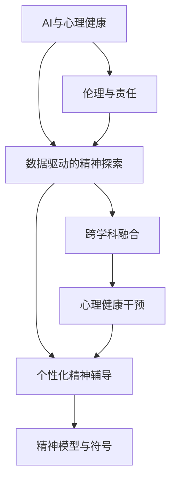

                 

# 数字化灵性：AI辅助的精神探索

## 1. 背景介绍

### 1.1 问题由来

数字时代，科技的飞速发展为我们打开了通往新世界的窗，其中最引人入胜的领域之一便是人工智能（AI）与精神探索的结合。这一领域旨在通过AI技术揭示人类意识的深层结构，为精神成长提供辅助工具。精神探索长期以来一直是哲学、心理学、宗教学等多学科关注的焦点，而AI的介入为此提供了新的视角和方法。

在数字化浪潮的推动下，AI技术的应用领域不断扩展，从医疗诊断、教育个性化、安全监控到艺术创作，无所不包。然而，这些应用往往局限于物质和物理层面，尚未深入到精神层面。与此同时，心理学、神经科学等领域的研究也逐渐认识到数字化工具在探索人类心智、提升精神健康的潜力。

结合两者的需求，AI辅助的精神探索应运而生。它不仅能为精神健康提供科学的解决方案，还能为人们提供更深层次的精神满足和心理滋养，从而促进社会的整体福祉。

### 1.2 问题核心关键点

AI辅助的精神探索，旨在通过AI技术，特别是深度学习、自然语言处理、计算机视觉等前沿技术，帮助人们更好地理解自己的内心世界，提升心理健康，实现自我成长和精神升华。其核心关键点包括：

1. **AI技术辅助**：利用AI强大的数据处理和模式识别能力，分析个体在情感、思维、行为等方面的数据，发现心理动态规律。
2. **个性化精神辅导**：基于AI对个体数据的分析，定制个性化的精神辅导方案，提供针对性的建议和引导。
3. **隐私与安全**：在处理个体数据时，确保数据的安全性和隐私保护，防止数据滥用。
4. **伦理与责任**：明确AI在精神探索中的角色和边界，避免AI技术滥用带来的伦理问题。
5. **跨学科融合**：将AI技术与心理学、神经科学、宗教学等多学科知识相结合，拓展AI在精神探索中的应用边界。

这些关键点共同构成了AI辅助精神探索的核心框架，为未来的研究与实践提供了明确的方向和指导。

## 2. 核心概念与联系

### 2.1 核心概念概述

为更好地理解AI辅助精神探索的原理和实践，本节将介绍几个密切相关的核心概念：

- **AI与心理健康**：通过AI技术，对个体的心理健康状态进行评估和干预，帮助其解决心理健康问题。
- **数据驱动的精神探索**：利用大数据和机器学习技术，分析个体在生理、心理和行为上的数据，揭示其内心世界的动态变化。
- **个性化精神辅导**：结合个体的历史数据、情感特征和行为模式，提供定制化的精神辅导方案，支持其自我成长和心理提升。
- **精神模型与符号**：构建基于符号和模型的心理框架，辅助理解人类心智的结构和运作机制。
- **伦理与责任**：在精神探索和心理健康干预中，确保AI技术的透明性、公正性和无害性。

这些概念之间的逻辑关系可以通过以下Mermaid流程图来展示：



这个流程图展示了大语言模型的核心概念及其之间的关系：

1. AI技术帮助评估心理健康，构建精神探索的基础。
2. 数据驱动的精神探索分析个体数据，提供心理动态规律。
3. 个性化精神辅导利用数据模型，定制精神辅导方案。
4. 精神模型与符号为理解和干预提供理论框架。
5. 伦理与责任确保整个过程的透明性和无害性。
6. 跨学科融合拓展AI在精神探索中的应用范围。

## 3. 核心算法原理 & 具体操作步骤

### 3.1 算法原理概述

AI辅助的精神探索主要基于数据分析和机器学习算法，通过处理个体心理数据，构建精神模型，辅助精神辅导。其核心思想是：

1. **数据收集与处理**：收集个体的生理数据（如心率、睡眠模式）、心理数据（如情感状态、思维模式）和行为数据（如社交互动、工作习惯），并进行预处理。
2. **特征提取与建模**：利用深度学习模型（如CNN、RNN、LSTM）对数据进行特征提取，构建精神状态模型。
3. **状态评估与干预**：基于模型评估个体的心理健康状态，结合个性化辅导方案，进行心理干预。

### 3.2 算法步骤详解

AI辅助的精神探索一般包括以下几个关键步骤：

**Step 1: 数据收集与预处理**
- 收集个体的生理、心理和行为数据，并将其标准化和归一化，确保数据的一致性。
- 对异常数据进行清洗和处理，确保数据的完整性和准确性。

**Step 2: 特征提取与建模**
- 利用深度学习模型对数据进行特征提取，例如使用CNN处理图像数据，使用RNN或LSTM处理时序数据。
- 构建精神状态模型，可以使用强化学习、生成对抗网络（GAN）等方法。

**Step 3: 状态评估与干预**
- 使用模型对个体的精神状态进行评估，识别潜在的心理健康问题。
- 根据评估结果，提供个性化的精神辅导方案，包括心理咨询、认知行为疗法等。
- 持续监测个体状态，及时调整干预措施，确保其心理健康。

**Step 4: 评估与反馈**
- 定期评估干预效果，通过问卷调查、生理指标等手段，获取反馈信息。
- 根据反馈信息调整辅导方案，优化精神探索过程。

### 3.3 算法优缺点

AI辅助的精神探索方法具有以下优点：
1. 高效精准：利用AI强大的数据处理能力，快速、准确地分析个体数据，提供个性化辅导。
2. 广泛适用：适用于多种心理健康问题，如焦虑、抑郁、压力等。
3. 可扩展性：通过不断收集和分析更多数据，AI模型可以持续优化，提升精神探索的准确性。
4. 跨学科融合：结合心理学、神经科学等多学科知识，为精神探索提供更多维度的视角。

同时，该方法也存在一些局限性：
1. 数据隐私：处理个体数据时，需严格保护隐私，避免数据泄露。
2. 模型透明性：AI模型的决策过程较为复杂，难以解释，可能缺乏透明度。
3. 伦理争议：AI在精神探索中的应用可能引发伦理争议，如算法偏见、数据滥用等。
4. 人性化不足：AI模型可能缺乏人类辅导员的情感支持和同理心，难以完全替代人类。
5. 技术门槛高：需要具备一定的数据科学和AI技术知识，才能有效应用AI技术进行精神探索。

尽管存在这些局限性，但AI辅助的精神探索方法仍然展示了其强大的潜力，未来仍有很大的发展空间。

### 3.4 算法应用领域

AI辅助的精神探索方法已经在多个领域展示了其应用前景，例如：

1. **心理健康干预**：为心理健康问题提供个性化辅导方案，如压力管理、情绪调节等。
2. **教育个性化**：通过分析学生的心理和行为数据，提供个性化的学习方案，提升学习效果。
3. **员工心理健康**：为职场员工提供心理健康支持和干预，提高员工的心理福祉和生产力。
4. **精神健康评估**：利用AI技术进行精神状态评估，早期发现和干预心理健康问题。
5. **心理咨询辅助**：通过AI技术辅助心理咨询师，提高咨询效率和效果。

除了上述这些领域，AI辅助的精神探索还将在更多场景中得到应用，如家庭教育、社交支持、智能养老等，为人们提供全方位的精神关怀。

## 4. 数学模型和公式 & 详细讲解 & 举例说明

### 4.1 数学模型构建

本节将使用数学语言对AI辅助精神探索的数学原理进行严格刻画。

记个体的生理、心理和行为数据集为 $D=\{(x_i,y_i)\}_{i=1}^N$，其中 $x_i$ 为个体状态特征，$y_i$ 为个体精神状态标签。

定义精神状态模型为 $M_{\theta}$，其中 $\theta$ 为模型参数。

目标是最小化损失函数 $\mathcal{L}(\theta)$，即：

$$
\mathcal{L}(\theta) = \frac{1}{N} \sum_{i=1}^N \ell(M_{\theta}(x_i),y_i)
$$

其中 $\ell$ 为损失函数，例如均方误差损失或交叉熵损失。

### 4.2 公式推导过程

以下我们以均方误差损失为例，推导模型评估和干预的公式。

假设模型 $M_{\theta}$ 在输入 $x_i$ 上的预测为 $\hat{y}=M_{\theta}(x_i)$，与真实标签 $y_i$ 之间的均方误差为：

$$
\ell(M_{\theta}(x_i),y_i) = \frac{1}{2}(y_i - \hat{y})^2
$$

将其代入经验风险公式，得：

$$
\mathcal{L}(\theta) = \frac{1}{2N} \sum_{i=1}^N (y_i - M_{\theta}(x_i))^2
$$

求导得梯度：

$$
\nabla_{\theta}\mathcal{L}(\theta) = - \frac{1}{N} \sum_{i=1}^N (y_i - M_{\theta}(x_i))(x_i - M_{\theta}(x_i)) \nabla_{\theta}M_{\theta}(x_i)
$$

利用反向传播算法计算梯度，更新模型参数：

$$
\theta \leftarrow \theta - \eta \nabla_{\theta}\mathcal{L}(\theta)
$$

其中 $\eta$ 为学习率，根据具体情况选择合适的值。

### 4.3 案例分析与讲解

**案例一：基于AI的焦虑管理**

假设某个体表现出高水平的压力和焦虑，通过生理监测设备（如心率传感器）和问卷调查，收集其生理数据和心理数据。利用深度学习模型提取特征，构建焦虑管理模型。模型评估个体的焦虑水平，并根据评估结果，提供个性化的焦虑管理方案。

**案例二：学生心理健康评估**

某学校使用AI技术对学生进行心理健康评估。通过收集学生的作业成绩、社交互动、心理问卷等数据，构建心理健康模型。模型评估学生的心理健康状态，识别可能存在的问题，如学习压力、人际关系问题等，并建议相应的心理干预措施。

以上案例展示了AI辅助精神探索在实际应用中的效果，通过分析个体的多维度数据，为心理健康提供科学解决方案。

## 5. 项目实践：代码实例和详细解释说明

### 5.1 开发环境搭建

在进行精神探索项目开发前，我们需要准备好开发环境。以下是使用Python进行TensorFlow开发的环境配置流程：

1. 安装Anaconda：从官网下载并安装Anaconda，用于创建独立的Python环境。

2. 创建并激活虚拟环境：
```bash
conda create -n psy-env python=3.8 
conda activate psy-env
```

3. 安装TensorFlow：根据CUDA版本，从官网获取对应的安装命令。例如：
```bash
conda install tensorflow -c tensorflow -c conda-forge
```

4. 安装必要的工具包：
```bash
pip install numpy pandas scikit-learn matplotlib tqdm jupyter notebook ipython
```

完成上述步骤后，即可在`psy-env`环境中开始精神探索项目开发。

### 5.2 源代码详细实现

我们以基于AI的焦虑管理项目为例，给出使用TensorFlow进行项目开发的PyTorch代码实现。

首先，定义模型结构：

```python
import tensorflow as tf

class AnxietyModel(tf.keras.Model):
    def __init__(self):
        super(AnxietyModel, self).__init__()
        self.dense1 = tf.keras.layers.Dense(64, activation='relu')
        self.dense2 = tf.keras.layers.Dense(1, activation='sigmoid')

    def call(self, inputs):
        x = self.dense1(inputs)
        x = self.dense2(x)
        return x
```

然后，定义数据集：

```python
import numpy as np

# 假设收集的生理数据
physiological_data = np.random.rand(1000, 10)

# 假设收集的心理数据
psychological_data = np.random.rand(1000, 20)

# 标注数据
labels = np.random.randint(0, 2, size=(1000, 1))

# 组合特征向量
features = np.concatenate((physiological_data, psychological_data), axis=1)
```

接着，定义模型训练过程：

```python
model = AnxietyModel()

# 定义损失函数和优化器
loss_fn = tf.keras.losses.BinaryCrossentropy(from_logits=True)
optimizer = tf.keras.optimizers.Adam()

# 定义评估指标
metrics = tf.keras.metrics.BinaryAccuracy()

# 训练循环
@tf.function
def train_step(inputs, labels):
    with tf.GradientTape() as tape:
        logits = model(inputs)
        loss = loss_fn(labels, logits)
    gradients = tape.gradient(loss, model.trainable_variables)
    optimizer.apply_gradients(zip(gradients, model.trainable_variables))
    metrics.update_state(labels, logits)

# 训练过程
for epoch in range(10):
    for inputs, labels in train_dataset:
        train_step(inputs, labels)
    print(f"Epoch {epoch+1}, loss: {train_loss.numpy():.4f}, accuracy: {train_metrics.numpy():.4f}")
```

最后，评估模型效果：

```python
# 定义评估数据集
eval_dataset = ...

# 评估过程
eval_loss, eval_metrics = model.evaluate(eval_dataset)
print(f"Evaluation loss: {eval_loss.numpy():.4f}, accuracy: {eval_metrics.numpy():.4f}")
```

以上就是使用TensorFlow进行基于AI的焦虑管理项目开发的完整代码实现。可以看到，通过TensorFlow的高效计算图功能，可以很方便地进行模型的定义、训练和评估。

### 5.3 代码解读与分析

让我们再详细解读一下关键代码的实现细节：

**AnxietyModel类**：
- `__init__`方法：定义模型的结构，包括两个全连接层。
- `call`方法：模型前向传播的实现，通过多层线性变换输出预测结果。

**数据集定义**：
- 生成模拟的生理和心理数据，构建特征向量。
- 为每个样本生成二元标签，模拟焦虑状态。

**模型训练**：
- 定义损失函数和优化器，选择合适的评价指标。
- 使用`@tf.function`装饰器进行性能优化，加速训练过程。
- 在每个epoch内，对训练数据进行迭代，更新模型参数。
- 打印训练过程中的损失和精度。

**模型评估**：
- 使用测试数据集对模型进行评估。
- 打印评估过程中的损失和精度。

可以看到，通过TensorFlow进行精神探索项目开发，代码实现相对简洁高效。开发者可以将更多精力放在数据处理、模型改进等高层逻辑上，而不必过多关注底层的实现细节。

当然，工业级的系统实现还需考虑更多因素，如模型的保存和部署、超参数的自动搜索、更灵活的任务适配层等。但核心的精神探索过程基本与此类似。

## 6. 实际应用场景

### 6.1 智能教育

AI辅助的精神探索可以广泛应用于智能教育领域，帮助学生更好地理解自我、调整心态，从而提升学习效果。例如：

- **心理健康评估**：通过分析学生的心理和行为数据，及时发现可能存在的心理问题，提供针对性的心理辅导。
- **个性化学习**：根据学生的心理状态和学习表现，调整学习内容和节奏，优化学习体验。
- **教师辅助**：为教师提供学生心理状态分析工具，帮助教师更好地理解和支持学生。

### 6.2 职场心理健康

职场人士面临着高压力、快节奏的工作环境，容易出现心理健康问题。AI辅助的精神探索可以为职场人士提供以下帮助：

- **压力管理**：通过分析工作量和心理压力数据，提供个性化的压力管理策略，如时间管理、情绪调节等。
- **员工关怀**：为员工提供心理健康支持和干预，提升其心理福祉和工作满意度。
- **职业发展**：通过分析员工的心理数据和行为数据，帮助其规划职业发展路径，提升职业成就感和满足感。

### 6.3 社交支持

社交支持是心理健康的重要组成部分，AI辅助的精神探索可以提供以下支持：

- **心理健康监测**：通过社交媒体和日常互动，分析用户的心理健康状态，提供及时的心理支持。
- **虚拟心理咨询**：利用AI技术，提供虚拟心理咨询服务，缓解用户的心理压力。
- **社交互动优化**：分析用户的社交行为和心理状态，优化其社交互动，提升社交体验。

### 6.4 未来应用展望

随着AI技术的发展，精神探索的应用场景将进一步扩展，未来可能包括：

1. **跨文化精神支持**：为不同文化背景的人提供心理支持，帮助其更好地适应新环境。
2. **精神健康预测**：通过分析多维度数据，提前预测个体的心理状态变化，进行早期干预。
3. **虚拟现实心理治疗**：利用虚拟现实技术，提供沉浸式心理治疗环境，增强治疗效果。
4. **心理游戏与互动**：开发心理游戏和互动应用，帮助用户放松心情、提升心理韧性。
5. **自动化心理干预**：结合AI和大数据分析，提供自动化心理干预服务，提高心理服务的普及率。

## 7. 工具和资源推荐

### 7.1 学习资源推荐

为了帮助开发者系统掌握AI辅助精神探索的理论基础和实践技巧，这里推荐一些优质的学习资源：

1. **《AI与心理健康》系列课程**：由心理学和AI领域的专家共同讲授，涵盖AI在心理健康评估、干预等方面的应用。
2. **《神经网络与深度学习》书籍**：详细介绍了深度学习模型的原理和应用，为理解精神探索中的模型构建提供理论基础。
3. **《心理学与数据科学》论文集**：收录了大量跨学科的最新研究成果，为精神探索提供前沿视角。
4. **Google Colab**：谷歌提供的免费在线Jupyter Notebook环境，方便开发者进行模型实验和分享学习笔记。
5. **Kaggle数据集**：提供大量心理和生理健康数据集，方便开发者进行模型训练和测试。

通过对这些资源的学习实践，相信你一定能够快速掌握AI辅助精神探索的精髓，并用于解决实际的心理健康问题。

### 7.2 开发工具推荐

高效的开发离不开优秀的工具支持。以下是几款用于AI辅助精神探索开发的常用工具：

1. **TensorFlow**：由Google主导开发的深度学习框架，生产部署方便，适合大规模工程应用。
2. **PyTorch**：基于Python的开源深度学习框架，灵活动态的计算图，适合快速迭代研究。
3. **Weights & Biases**：模型训练的实验跟踪工具，可以记录和可视化模型训练过程中的各项指标。
4. **Jupyter Notebook**：交互式编程环境，方便开发者进行模型实验和数据分析。
5. **Kaggle**：数据科学竞赛平台，提供大量高质量的数据集和模型评测工具。

合理利用这些工具，可以显著提升AI辅助精神探索的开发效率，加快创新迭代的步伐。

### 7.3 相关论文推荐

AI辅助的精神探索领域的研究始于多学科的交叉融合，以下是几篇奠基性的相关论文，推荐阅读：

1. **《深度学习在心理健康评估中的应用》**：探讨深度学习在心理健康评估中的应用，展示了深度学习模型在心理状态分类和情感识别中的效果。
2. **《基于AI的心理健康干预》**：研究AI技术在心理健康干预中的应用，提出了多种基于AI的心理治疗策略。
3. **《跨文化心理数据融合》**：探讨跨文化心理数据的融合和分析，为不同文化背景的人提供心理支持。
4. **《虚拟现实心理治疗的可行性研究》**：研究虚拟现实技术在心理治疗中的应用，提出了多种虚拟现实治疗方案。
5. **《个性化学习与心理状态分析》**：探讨个性化学习与心理状态分析的关系，为学习者提供心理支持和个性化学习方案。

这些论文代表了大语言模型微调技术的发展脉络。通过学习这些前沿成果，可以帮助研究者把握学科前进方向，激发更多的创新灵感。

## 8. 总结：未来发展趋势与挑战

### 8.1 总结

本文对AI辅助的精神探索方法进行了全面系统的介绍。首先阐述了AI辅助精神探索的研究背景和意义，明确了AI在精神健康领域的应用价值。其次，从原理到实践，详细讲解了AI辅助精神探索的数学原理和关键步骤，给出了精神探索任务开发的完整代码实例。同时，本文还广泛探讨了AI辅助精神探索在多个行业领域的应用前景，展示了AI辅助精神探索的广泛潜力。此外，本文精选了AI辅助精神探索的学习资源，力求为读者提供全方位的技术指引。

通过本文的系统梳理，可以看到，AI辅助的精神探索技术正在成为精神健康领域的重要范式，极大地拓展了心理健康干预的方法和手段，为人类心理健康带来了新的希望。未来，伴随AI技术的发展，AI辅助的精神探索技术必将在更多领域得到应用，为人们提供全方位的心理支持，提升社会的整体福祉。

### 8.2 未来发展趋势

展望未来，AI辅助的精神探索技术将呈现以下几个发展趋势：

1. **深度模型优化**：随着深度学习模型的不断发展，更先进的模型结构和算法将被应用于精神探索中，提高模型的准确性和鲁棒性。
2. **跨模态融合**：结合视觉、听觉等多模态数据，提升精神探索的多维度分析能力。
3. **个性化与动态**：利用个体历史数据，构建动态的精神探索模型，提供个性化的心理支持。
4. **数据隐私保护**：开发更高效的数据加密和隐私保护技术，确保个体数据的隐私和安全。
5. **伦理与责任**：明确AI在精神探索中的角色和边界，避免算法偏见和数据滥用，确保精神探索的透明性和公正性。
6. **跨学科融合**：结合心理学、神经科学、社会学等多学科知识，拓展AI在精神探索中的应用边界。

以上趋势凸显了AI辅助精神探索技术的广阔前景。这些方向的探索发展，必将进一步提升精神探索的精度和效果，为人类心理健康提供更加全面和科学的支持。

### 8.3 面临的挑战

尽管AI辅助的精神探索技术已经取得了瞩目成就，但在迈向更加智能化、普适化应用的过程中，它仍面临着诸多挑战：

1. **数据隐私**：处理个体数据时，需严格保护隐私，避免数据泄露。
2. **模型透明性**：AI模型的决策过程较为复杂，难以解释，可能缺乏透明度。
3. **伦理争议**：AI在精神探索中的应用可能引发伦理争议，如算法偏见、数据滥用等。
4. **人性化不足**：AI模型可能缺乏人类辅导员的情感支持和同理心，难以完全替代人类。
5. **技术门槛高**：需要具备一定的数据科学和AI技术知识，才能有效应用AI技术进行精神探索。

尽管存在这些挑战，但AI辅助的精神探索技术仍展示了其强大的潜力，未来仍有很大的发展空间。

### 8.4 研究展望

面对AI辅助精神探索所面临的挑战，未来的研究需要在以下几个方面寻求新的突破：

1. **隐私保护技术**：开发更高效的数据加密和隐私保护技术，确保个体数据的隐私和安全。
2. **可解释性增强**：引入因果分析和符号推理方法，增强AI模型的可解释性，提高其透明性和可信度。
3. **跨学科融合**：结合心理学、神经科学、社会学等多学科知识，拓展AI在精神探索中的应用边界。
4. **伦理与责任**：在精神探索和心理健康干预中，确保AI技术的透明性、公正性和无害性。
5. **模型优化与性能提升**：开发更加高效的深度学习模型，提升精神探索的精度和效果。
6. **多模态融合**：结合视觉、听觉等多模态数据，提升精神探索的多维度分析能力。

这些研究方向的探索，必将引领AI辅助精神探索技术迈向更高的台阶，为构建安全、可靠、可解释、可控的智能系统铺平道路。面向未来，AI辅助的精神探索技术还需要与其他人工智能技术进行更深入的融合，如知识表示、因果推理、强化学习等，多路径协同发力，共同推动自然语言理解和智能交互系统的进步。只有勇于创新、敢于突破，才能不断拓展语言模型的边界，让智能技术更好地造福人类社会。

## 9. 附录：常见问题与解答

**Q1：AI辅助精神探索是否适用于所有个体？**

A: AI辅助精神探索旨在为个体提供心理支持，但并非适用于所有个体。由于个体差异巨大，AI模型需要结合个体历史数据和心理特征，进行个性化的分析和干预。对于某些具有特殊心理需求的个体，建议在使用AI技术前，先寻求专业的心理健康服务。

**Q2：AI辅助精神探索能否完全替代人类辅导员？**

A: AI辅助精神探索可以提供初步的心理评估和支持，但在深度情感理解和复杂心理问题的解决上，仍无法完全替代人类辅导员。因此，AI技术应作为辅助工具，与人类辅导员协同工作，共同提供全面的心理健康服务。

**Q3：AI辅助精神探索的伦理问题如何解决？**

A: 在使用AI辅助精神探索的过程中，需严格遵循伦理原则，确保数据的隐私和安全。建立数据使用规范，明确AI技术的角色和边界，避免算法偏见和数据滥用。同时，定期进行伦理审查，确保AI技术的透明性和公正性。

**Q4：如何评估AI辅助精神探索的效果？**

A: 评估AI辅助精神探索的效果，可以从多个维度进行：

1. **心理状态改善**：通过问卷调查和心理测试，评估个体心理状态的变化。
2. **行为模式优化**：分析个体的行为数据，评估其行为模式的变化。
3. **生活质量提升**：通过生活质量问卷，评估个体整体生活质量的提升。
4. **满意度与接受度**：通过用户反馈，评估个体对AI技术的满意度和接受度。

这些指标的综合评估，可以全面反映AI辅助精神探索的效果。

---

作者：禅与计算机程序设计艺术 / Zen and the Art of Computer Programming

