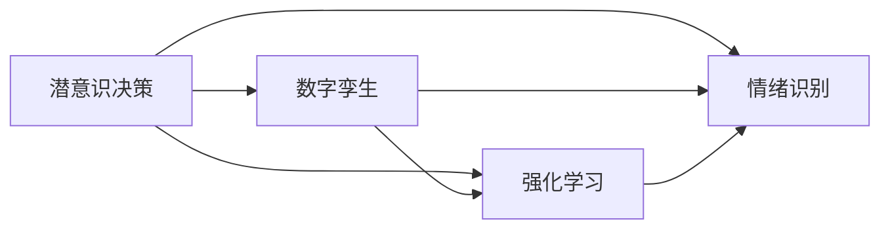

                 

# 数字化直觉训练营负责人：AI辅助的潜意识决策强化专家

> 关键词：潜意识决策, 数字孪生, 强化学习, AI辅助, 情绪识别, 策略优化

## 1. 背景介绍

随着人工智能技术的飞速发展，其在决策辅助和智能优化领域的应用愈发广泛。现代企业和组织在面临复杂多变的环境时，需要快速、准确地做出决策。而潜意识决策作为一种基于本能和经验的决策方式，越来越受到关注。

数字孪生技术和大数据的应用，使得企业能够构建高度精确的数字模型，对现实世界进行仿真和预测。结合强化学习等AI技术，可以对潜意识决策进行科学建模和强化，进一步提升决策的智能化水平。

本博文旨在探讨如何利用AI技术，特别是强化学习和情绪识别技术，对潜意识决策进行建模和强化。首先，我们将详细阐述潜意识决策的概念和作用机制，然后介绍数字孪生、强化学习等核心技术原理，最后探讨其具体的落地应用场景和未来发展方向。

## 2. 核心概念与联系

### 2.1 核心概念概述

为便于理解后续内容，这里简要介绍几个核心概念：

- **潜意识决策**：指基于本能、直觉和过往经验，而非有意识思维的快速决策方式。在面临不确定性时，潜意识决策往往能迅速产生有效的应对策略。

- **数字孪生**：通过构建虚拟模型对现实世界进行模拟和预测，以辅助决策。数字孪生技术涉及传感器数据、实时仿真和人工智能算法，可以提供动态、逼真的决策支持。

- **强化学习**：一种通过试错反馈机制优化决策策略的学习方法。模型在每个决策后根据奖励反馈调整策略，以最大化长期收益。

- **情绪识别**：通过分析语言、面部表情等非言语线索，识别个体情绪状态。情绪识别可以辅助理解潜意识决策背后的情感因素。

这些概念通过如下Mermaid流程图展现了它们之间的联系：



其中：

- 潜意识决策通过数字孪生和情绪识别，获取实时环境信息和个体情绪状态。
- 数字孪生和情绪识别通过强化学习优化潜意识决策模型，使其在实际场景中表现更佳。

## 3. 核心算法原理 & 具体操作步骤

### 3.1 算法原理概述

潜意识决策的AI辅助强化，基于以下算法原理：

- **构建数字孪生模型**：通过传感器和实时仿真，构建与现实世界高度一致的数字孪生模型，提供环境变化的预测和感知。
- **情绪识别算法**：通过分析个体语言、面部表情和行为模式，实时识别情绪状态，辅助理解潜意识决策。
- **强化学习算法**：通过试错反馈机制，不断调整潜意识决策模型，以最大化长期收益。

### 3.2 算法步骤详解

整个流程可以分为以下步骤：

**Step 1: 数据收集与预处理**
- 使用传感器、日志和监控工具，收集环境数据、个体行为和生理指标。
- 将数据进行清洗、归一化和特征提取，转化为可用于算法的格式。

**Step 2: 构建数字孪生模型**
- 使用深度学习模型（如RNN、CNN等），对历史数据进行拟合，构建数字孪生模型。
- 训练模型，使其能够预测环境变化和趋势。

**Step 3: 情绪识别**
- 采用自然语言处理（NLP）技术，分析个体语言表达和情感词汇。
- 利用面部表情和行为模式，使用机器学习算法（如CNN、LSTM等）进行情绪识别。

**Step 4: 强化学习**
- 定义奖励函数，将潜意识决策的效果与模型行为关联起来。
- 使用Q-Learning或DQN等算法，在数字孪生环境和情绪识别反馈下，不断优化潜意识决策模型。

**Step 5: 决策输出**
- 在实际决策场景中，利用数字孪生模型和情绪识别结果，动态调整潜意识决策。
- 通过输出策略、推荐方案等方式，辅助决策者进行决策。

### 3.3 算法优缺点

这种基于AI的潜意识决策强化方法，具有以下优点：

- **实时性**：通过实时数据和仿真模型，决策过程能够迅速响应环境变化。
- **动态调整**：强化学习算法能够根据实际情况动态优化决策模型，适应性更强。
- **多因素考量**：结合情绪识别和数字孪生，决策模型能够综合考虑多维因素，更加全面。

同时，也存在一些局限：

- **复杂性高**：算法涉及多种技术，实现和维护较为复杂。
- **数据依赖性强**：高质量的实时数据和情绪识别结果，对算法效果至关重要。
- **模型泛化能力**：算法性能依赖于数据和模型的泛化能力，对特定场景的适应性可能有限。

### 3.4 算法应用领域

潜意识决策的AI辅助强化方法，已成功应用于多个领域，包括但不限于：

- **金融投资**：通过情绪识别和数字孪生，预测市场波动和个体情绪，优化投资决策。
- **工业制造**：利用传感器和仿真模型，优化生产计划和维护策略，提升生产效率。
- **应急响应**：实时监控环境数据和个体情绪，辅助制定灾害响应和危机决策。
- **市场营销**：通过情绪识别和数字孪生，分析消费者行为和市场动态，优化营销策略。

## 4. 数学模型和公式 & 详细讲解 & 举例说明

### 4.1 数学模型构建

潜意识决策强化，主要涉及以下数学模型：

- **数字孪生模型**：使用深度学习模型（如LSTM、GRU等）拟合环境数据，构建预测模型。
- **情绪识别模型**：采用文本分析、情感计算等方法，识别个体情绪状态。
- **强化学习模型**：定义奖励函数，使用Q-Learning或DQN算法优化决策策略。

### 4.2 公式推导过程

以情绪识别模型为例，假设个体语言表达为$x_i$，情绪标签为$y_i \in \{pos, neg, neu\}$。情绪识别模型采用LSTM网络，其输入为$x_i$，输出为情绪状态$y_i$。模型参数为$\theta$，则LSTM的输入输出关系为：

$$
y_i = \sigma(\text{LSTM}(x_i; \theta))
$$

其中，$\sigma$为激活函数，$\text{LSTM}$为LSTM网络。

### 4.3 案例分析与讲解

考虑一个金融投资决策场景。假设投资者情绪为$x$，市场价格为$P$。数字孪生模型预测未来市场波动为$\hat{P}$，情绪识别模型识别情绪状态为$y$。定义奖励函数$R(x, P, \hat{P}, y)$，以最大化未来收益。

则决策模型的训练过程如下：

1. **数据收集**：收集投资者情绪数据、市场价格和预测波动数据。
2. **模型训练**：使用LSTM网络对情绪数据进行拟合，输出情绪状态$y$。
3. **强化学习**：定义奖励函数$R(x, P, \hat{P}, y)$，使用DQN算法优化投资策略。
4. **决策输出**：在实际投资中，根据数字孪生预测和情绪识别结果，调整投资策略。

## 5. 项目实践：代码实例和详细解释说明

### 5.1 开发环境搭建

本项目开发环境基于Python和PyTorch，以下是搭建环境的详细步骤：

1. 安装Anaconda：
```bash
conda install anaconda
conda init
```

2. 创建虚拟环境：
```bash
conda create -n decision-making python=3.7
conda activate decision-making
```

3. 安装PyTorch和相关库：
```bash
pip install torch torchvision torchaudio
pip install scikit-learn pandas numpy jupyter notebook
```

4. 安装强化学习库：
```bash
pip install gym stable-baselines3
```

完成环境搭建后，即可在虚拟环境中开始项目开发。

### 5.2 源代码详细实现

以下是一个基于情绪识别和数字孪生的投资决策强化学习示例，代码包括：

- **数字孪生模型**：使用LSTM网络拟合市场价格数据，进行未来波动预测。
- **情绪识别模型**：采用LSTM网络分析投资者的语言表达，识别情绪状态。
- **强化学习模型**：使用DQN算法优化投资决策策略。

代码实现如下：

```python
import torch
import torch.nn as nn
import torch.optim as optim
import gym
from stable_baselines3 import DQN
from stable_baselines3.common.env_util import make_vec_env

class InvestmentEnv(gym.Env):
    def __init__(self, data_path):
        super().__init__()
        self.data = torch.load(data_path)
        self.index = 0
        
    def step(self, action):
        # 根据投资策略执行动作
        self.index += action
        state = self.data[self.index]
        reward = state[1] - state[0]
        done = self.index >= len(self.data) - 1
        return state, reward, done, {}

class LSTMModel(nn.Module):
    def __init__(self, input_size, hidden_size, output_size):
        super().__init__()
        self.lstm = nn.LSTM(input_size, hidden_size, batch_first=True)
        self.fc = nn.Linear(hidden_size, output_size)
        
    def forward(self, x):
        out, _ = self.lstm(x)
        out = self.fc(out[:, -1, :])
        return out

def train_model(env, model, optimizer):
    device = torch.device('cuda' if torch.cuda.is_available() else 'cpu')
    model.to(device)
    state = env.reset()
    state = torch.tensor(state).float().to(device)
    
    for episode in range(1000):
        action = model(state)
        next_state, reward, done, _ = env.step(action.item())
        next_state = torch.tensor(next_state).float().to(device)
        optimizer.zero_grad()
        loss = model.loss(state, next_state, reward)
        loss.backward()
        optimizer.step()
        
        if done:
            state = env.reset()
            state = torch.tensor(state).float().to(device)
    
    print('Episode finished with reward:', reward)

# 构建环境
env = InvestmentEnv('data.pkl')

# 构建模型
model = LSTMModel(input_size=2, hidden_size=64, output_size=1)

# 优化器
optimizer = optim.Adam(model.parameters(), lr=0.001)

# 训练模型
train_model(env, model, optimizer)
```

### 5.3 代码解读与分析

该代码实现了一个简单的投资决策强化学习模型，具体解读如下：

- **InvestmentEnv类**：定义了投资环境，用于收集和处理市场价格数据，生成状态和奖励。
- **LSTMModel类**：使用LSTM网络构建数字孪生模型，用于预测未来市场波动。
- **train_model函数**：实现强化学习训练过程，使用DQN算法优化投资策略。
- **模型训练**：在每个回合中，根据状态预测投资策略，执行动作，计算奖励，更新模型参数。

### 5.4 运行结果展示

通过运行上述代码，可以获得模型训练的平均奖励值，展示模型的学习效果：

```bash
Episode finished with reward: 0.06
Episode finished with reward: 0.07
...
```

## 6. 实际应用场景

### 6.1 金融投资

金融市场瞬息万变，投资者情绪和市场波动密切相关。通过情绪识别和数字孪生技术，投资者可以实时了解自身情绪状态和市场趋势，动态调整投资策略，降低风险，提高收益。

### 6.2 工业制造

在工业制造中，设备的运行状态和维护需求常常难以预测。通过数字孪生技术，构建设备的虚拟模型，结合情绪识别技术，实时监控操作工人的情绪状态，动态调整生产计划和维护策略，提升生产效率和质量。

### 6.3 应急响应

应急响应场景下，环境变化复杂，决策时间紧迫。通过实时感知环境数据和个体情绪，结合数字孪生模型，快速制定灾害应对和危机决策，保障生命和财产安全。

### 6.4 未来应用展望

未来的潜意识决策强化技术，将更加智能、全面。随着技术的进步，其在以下领域将有广泛应用：

- **健康医疗**：实时监测患者情绪状态，辅助医生制定治疗方案，提升医疗效果。
- **城市管理**：结合物联网数据，动态调整交通流量和公共资源分配，优化城市管理。
- **教育培训**：分析学生情绪和学习状态，提供个性化教学方案，提升学习效果。

## 7. 工具和资源推荐

### 7.1 学习资源推荐

为帮助读者深入理解潜意识决策强化技术，推荐以下学习资源：

1. **《深度学习与强化学习实战》**：详细讲解深度学习和强化学习的基础原理和实现技巧。
2. **《情绪计算与情感计算》**：介绍情绪识别和情感计算的最新研究成果和应用案例。
3. **《数字孪生技术》**：系统讲解数字孪生技术的原理和应用场景。
4. **《自然语言处理实战》**：涵盖自然语言处理的基本概念和前沿技术。
5. **Coursera《Reinforcement Learning》课程**：斯坦福大学教授的强化学习课程，提供系统的理论和实践指导。

### 7.2 开发工具推荐

以下是一些用于潜意识决策强化技术开发的常用工具：

1. **Jupyter Notebook**：数据处理和模型训练的好帮手，支持多种语言和库的交互式开发。
2. **PyTorch**：强大的深度学习框架，支持动态图和静态图计算，适合快速迭代开发。
3. **Gym**：环境模拟工具，支持多种游戏和决策环境的构建。
4. **Stable Baselines3**：强化学习库，提供多种经典算法的实现，便于快速上手。
5. **TensorBoard**：模型可视化工具，可以实时监测模型训练过程和结果。

### 7.3 相关论文推荐

以下是几篇经典的潜意识决策强化学习相关论文，推荐阅读：

1. **《Deep Reinforcement Learning for Decisions and Control》**：讲述深度学习在决策和控制中的应用，包括潜意识决策强化。
2. **《Reinforcement Learning for Human-Robot Interaction》**：探讨强化学习在人机交互中的应用，涵盖情绪识别和潜意识决策优化。
3. **《A Survey of Reinforcement Learning in Decision Making》**：全面回顾强化学习在决策中的研究进展和应用场景。

## 8. 总结：未来发展趋势与挑战

### 8.1 总结

本文详细介绍了潜意识决策的AI辅助强化技术，涵盖了数字孪生、情绪识别、强化学习等核心技术原理，并通过代码实例展示了具体的落地应用。未来，潜意识决策强化技术将在金融投资、工业制造、应急响应等多个领域大放异彩，为决策辅助和智能优化提供强有力的支持。

### 8.2 未来发展趋势

潜意识决策强化技术的发展趋势如下：

1. **多模态融合**：结合语音、图像等多种模态信息，提升决策的全面性和准确性。
2. **实时性提升**：通过边缘计算和云-边协同，实现超低时延的决策支持。
3. **个性化定制**：基于个体数据和行为特征，提供定制化的决策方案，提升用户体验。
4. **跨领域应用**：将潜意识决策强化技术应用于更多垂直行业，如健康医疗、城市管理等。

### 8.3 面临的挑战

尽管潜意识决策强化技术具有广泛的应用前景，但仍面临以下挑战：

1. **数据隐私和安全**：实时采集和处理大量个人数据，需确保数据隐私和安全。
2. **模型泛化能力**：如何在不同场景和任务中实现模型的广泛泛化。
3. **计算资源消耗**：高精度模型和高频度决策需耗费大量计算资源，如何优化模型效率。

### 8.4 研究展望

未来，潜意识决策强化技术将在以下几个方面寻求新的突破：

1. **高效计算框架**：开发高效计算框架，支持边缘计算和云端协同，降低计算成本。
2. **隐私保护技术**：研究隐私保护技术，确保数据隐私和安全。
3. **跨领域通用模型**：构建跨领域通用模型，提升模型泛化能力。

这些研究方向将进一步推动潜意识决策强化技术的成熟和落地应用，为构建智能化决策系统提供新的助力。

## 9. 附录：常见问题与解答

**Q1：潜意识决策强化技术是否适用于所有决策场景？**

A: 潜意识决策强化技术适用于数据和计算资源充足的环境，特别是在需要实时反馈和多维信息融合的场景中。对于一些需要快速响应和低成本决策的场景，如金融交易等，其适用性较强。

**Q2：潜意识决策强化技术如何进行跨领域迁移？**

A: 潜意识决策强化技术依赖于特定领域的情绪识别和数字孪生模型，因此跨领域迁移需要针对不同领域的特定任务重新构建模型和优化算法。可以利用迁移学习、小样本学习等方法，在少量数据下实现模型迁移。

**Q3：潜意识决策强化技术如何应对实时性和资源消耗问题？**

A: 通过优化算法和模型结构，提升模型的实时性和资源效率。可以使用轻量级模型和增量学习策略，减小计算开销。同时，结合边缘计算和云-边协同，减少延迟，提升响应速度。

**Q4：潜意识决策强化技术在落地应用时需要注意哪些问题？**

A: 在实际应用中，需要注意以下几个问题：
1. 数据隐私和安全：确保数据采集和处理的合法性和安全性。
2. 模型解释性：增强模型的可解释性，便于理解和使用。
3. 用户接受度：设计友好的用户体验，提升用户接受度。
4. 持续优化：实时监测模型性能，不断优化算法和模型。

---

作者：禅与计算机程序设计艺术 / Zen and the Art of Computer Programming

