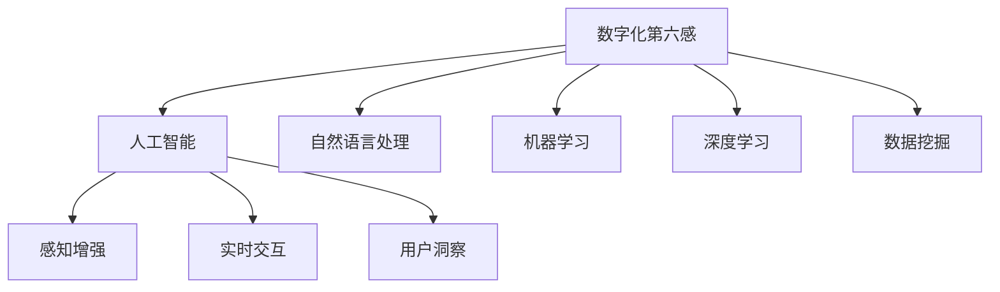

                 

# 数字化第六感开发包设计师：AI辅助的超感知能力培养专家

> 关键词：数字化第六感,超感知能力,人工智能,感知增强,实时交互,用户洞察,数据驱动

## 1. 背景介绍

### 1.1 问题由来
随着数字化转型步伐的加快，企业日益依赖于数字技术提升运营效率、优化客户体验。然而，海量数据的生成和分析，使得传统的人力数据分析方式难以应对。与此同时，企业对员工认知能力的期望也在不断提升，希望他们能够拥有更强的数据分析和决策能力，更快地响应市场变化。

为了解决这一问题，数字化第六感开发包(Digital Sixth Sense Toolkit)应运而生。这是一个基于人工智能的智能工具包，旨在通过自动化和智能化的数据分析，帮助员工提升感知能力，快速获取和理解数据洞察，从而做出更加精准的业务决策。数字化第六感开发包不仅能够提升员工的超感知能力，还能为企业带来更高的运营效率和客户满意度。

### 1.2 问题核心关键点
数字化第六感开发包的核心在于利用先进的人工智能技术，实现对海量数据的自动化处理和智能分析，提炼出对业务决策有价值的洞察信息，并快速传递给相关人员。其关键技术包括自然语言处理(NLP)、机器学习、深度学习、数据挖掘等。通过这些技术的深度融合，数字化第六感开发包能够为员工提供超感知能力的增强，使他们能够在数据驱动的环境下，进行实时交互和智能决策。

## 2. 核心概念与联系

### 2.1 核心概念概述

为更好地理解数字化第六感开发包的原理和应用，本节将介绍几个密切相关的核心概念：

- **数字化第六感**：指通过智能技术手段，提升员工对数据的感知能力，使其能够更快速、更准确地理解数据，做出高效决策。数字化第六感包括数据洞察、实时交互、预测分析等多方面功能。

- **超感知能力**：指在智能技术的辅助下，员工能够超越传统认知水平，快速获取数据洞察、识别数据趋势、理解复杂业务模型，从而做出更加精准和快速的决策。

- **人工智能(AI)**：通过算法和模型，使机器具备模拟人类智能行为的能力，包括感知、学习、推理、决策等。AI技术包括机器学习、深度学习、自然语言处理、计算机视觉等分支。

- **感知增强**：指通过智能技术手段，提高员工对数据的感知能力。感知增强包括数据处理、分析、可视化、预测等多方面的功能，旨在提升员工的决策效率和准确性。

- **实时交互**：指数字化第六感开发包能够实现与用户的实时沟通，及时获取反馈和调整策略，确保决策的准确性和时效性。

- **用户洞察**：指通过数据分析，理解用户行为、偏好和需求，从而制定更加精准的营销和运营策略。

这些核心概念之间的逻辑关系可以通过以下Mermaid流程图来展示：



这个流程图展示了数字化第六感开发包的核心概念及其之间的关系：

1. 数字化第六感依赖于人工智能技术。
2. 人工智能通过感知增强、实时交互和用户洞察等子技术，实现了超感知能力的提升。
3. 自然语言处理、机器学习、深度学习、数据挖掘等是实现这些子技术的关键手段。

这些概念共同构成了数字化第六感开发包的工作原理和应用框架，使其能够在各种场景下发挥强大的数据处理和智能分析能力。通过理解这些核心概念，我们可以更好地把握数字化第六感开发包的精髓，并用于解决实际的业务问题。

## 3. 核心算法原理 & 具体操作步骤
### 3.1 算法原理概述

数字化第六感开发包的核心算法包括自然语言处理、机器学习和深度学习。其总体流程为：

1. **数据收集**：通过API接口、爬虫等手段，从不同的数据源收集数据，形成海量数据池。
2. **数据清洗**：对数据进行去重、去噪、标准化等处理，确保数据的质量。
3. **数据分析**：利用机器学习和深度学习算法，对数据进行分析和建模，提取有价值的洞察信息。
4. **智能输出**：将分析结果以可视化的方式呈现给用户，或通过API接口推送给相关人员。
5. **实时反馈**：通过用户反馈和数据分析，持续优化算法模型和输出方式，提升系统的智能水平。

### 3.2 算法步骤详解

以下是数字化第六感开发包的详细操作步骤：

**Step 1: 数据收集**
- 确定数据源：从企业内部系统、第三方API、公开数据集等途径收集数据。
- 数据采集：通过API接口、爬虫等手段，批量获取数据。
- 数据存储：将采集的数据存储到数据库或数据湖中，供后续分析和处理。

**Step 2: 数据清洗**
- 数据去重：对数据进行去重处理，避免重复数据带来的干扰。
- 数据去噪：对数据进行去噪处理，过滤掉无用的噪声数据。
- 数据标准化：对数据进行标准化处理，统一数据格式和单位。

**Step 3: 数据分析**
- 特征工程：根据分析目标，选择和构造合适的特征。
- 模型选择：选择合适的机器学习或深度学习模型进行训练。
- 模型训练：使用历史数据训练模型，优化模型参数。
- 模型评估：通过交叉验证等方法评估模型性能，确保模型可靠。

**Step 4: 智能输出**
- 数据可视化：将分析结果以图表、报表等形式呈现给用户。
- 智能提示：通过自然语言处理技术，生成简洁明了的提示信息，帮助用户理解分析结果。
- 实时推送：通过API接口，将分析结果实时推送给相关人员。

**Step 5: 实时反馈**
- 用户反馈：收集用户对输出结果的反馈信息，用于优化模型和算法。
- 模型优化：根据用户反馈，持续优化模型和算法，提升系统智能水平。

### 3.3 算法优缺点

数字化第六感开发包在提升员工超感知能力方面具有以下优点：
1. **自动化处理**：通过自动化处理海量数据，显著提升数据处理效率，减少人工成本。
2. **智能分析**：利用先进的机器学习和深度学习算法，提取数据中的深层次洞察，提供高质量的决策依据。
3. **实时交互**：支持实时数据交互和反馈，确保决策的及时性和准确性。
4. **用户洞察**：通过分析用户行为数据，提升对用户需求的理解，制定更加精准的营销和运营策略。

同时，该方法也存在一些局限性：
1. **数据质量要求高**：系统对数据质量的要求较高，数据收集和清洗过程较为繁琐。
2. **模型复杂度高**：复杂的机器学习和深度学习模型对计算资源和存储空间的需求较高。
3. **算法优化难度大**：模型优化和调整过程复杂，需要持续迭代和优化，难度较大。
4. **结果可解释性不足**：智能分析结果往往难以解释，用户难以理解其内部逻辑和决策依据。

尽管存在这些局限性，但数字化第六感开发包在提升员工超感知能力方面的价值不容忽视，尤其在处理大规模数据和复杂业务场景时，其高效和智能的优势尤为明显。

### 3.4 算法应用领域

数字化第六感开发包已经在多个行业得到广泛应用，例如：

- 金融行业：通过数据分析，提升客户洞察力和风险管理能力，帮助企业制定精准的投资和风险控制策略。
- 零售行业：通过分析消费者行为数据，提升营销效果，优化库存管理，提升客户满意度。
- 医疗行业：通过分析患者健康数据，提升疾病预测和诊断能力，优化医疗资源配置，提升医疗服务水平。
- 制造行业：通过分析生产数据，优化生产流程，降低成本，提升生产效率。
- 政府行业：通过分析公共数据，提升城市管理水平，优化政策制定，提升公共服务效率。

除了上述这些行业，数字化第六感开发包还可以应用于更多的领域，如物流、教育、旅游等，为各行各业带来数字化转型的新动力。

## 4. 数学模型和公式 & 详细讲解  
### 4.1 数学模型构建

数字化第六感开发包的核心数学模型包括自然语言处理、机器学习和深度学习的相关模型。

- **自然语言处理(NLP)**：常用的NLP模型包括BERT、GPT等，用于处理文本数据，提取关键词、情感分析、命名实体识别等。
- **机器学习**：常用的机器学习模型包括线性回归、逻辑回归、随机森林、支持向量机等，用于数据分类、聚类和预测分析。
- **深度学习**：常用的深度学习模型包括卷积神经网络(CNN)、循环神经网络(RNN)、长短期记忆网络(LSTM)等，用于复杂数据分析和模式识别。

### 4.2 公式推导过程

以深度学习中的卷积神经网络(CNN)为例，介绍其基本结构和公式推导过程。

卷积神经网络是一种前馈神经网络，通过卷积、池化等操作，对输入数据进行特征提取和分类。其基本结构包括卷积层、池化层和全连接层。

卷积层的公式推导如下：

$$
y^{(i)} = \max(0, \sum_{c=1}^{C} \sum_{r=-s}^{s} \sum_{c=1}^{C} w_{c,i,j,k} * x^{(i)}_{r+r'}
$$

其中 $y^{(i)}$ 表示卷积层的输出特征图，$x^{(i)}$ 表示输入图像，$w_{c,i,j,k}$ 表示卷积核，$C$ 表示卷积核的数量，$r'$ 表示卷积核的大小。

池化层的公式推导如下：

$$
y^{(i)} = \frac{1}{k^2} \sum_{r=0}^{k-1} \sum_{c=0}^{k-1} x^{(i)}_{r+r', c+c'}
$$

其中 $y^{(i)}$ 表示池化层的输出特征图，$x^{(i)}$ 表示输入特征图，$k$ 表示池化核的大小。

全连接层的公式推导如下：

$$
y^{(i)} = \sum_{j=1}^{N} w_{j,i} * x^{(i-1)}_{j} + b_{i}
$$

其中 $y^{(i)}$ 表示全连接层的输出，$w_{j,i}$ 表示权重，$x^{(i-1)}_{j}$ 表示前一层的输出，$b_{i}$ 表示偏置项。

通过上述公式，我们可以构建一个基本的卷积神经网络，用于图像分类、目标检测等任务。在实际应用中，可以根据任务需求对网络结构进行扩展和调整，以提高模型的性能和准确性。

### 4.3 案例分析与讲解

以文本分类任务为例，介绍基于深度学习的文本分类模型。

文本分类模型可以用于对文本进行分类，如情感分析、主题分类等。常用的文本分类模型包括卷积神经网络(CNN)、循环神经网络(RNN)和Transformer等。

以下是一个基于Transformer的文本分类模型案例分析：

1. **输入层**：将文本数据转化为词嵌入向量，送入Transformer模型。
2. **Transformer层**：通过自注意力机制，提取文本的语义特征。
3. **全连接层**：将Transformer层的输出映射到类别空间，输出分类结果。

**代码实现**：

```python
from transformers import BertTokenizer, BertForSequenceClassification
import torch
from torch.utils.data import DataLoader

# 加载BERT模型和分词器
tokenizer = BertTokenizer.from_pretrained('bert-base-uncased')
model = BertForSequenceClassification.from_pretrained('bert-base-uncased', num_labels=2)

# 加载数据集
train_dataset = ...
val_dataset = ...
test_dataset = ...

# 训练模型
device = torch.device('cuda' if torch.cuda.is_available() else 'cpu')
model.to(device)

# 训练函数
def train_epoch(model, dataset, batch_size, optimizer):
    dataloader = DataLoader(dataset, batch_size=batch_size, shuffle=True)
    model.train()
    epoch_loss = 0
    for batch in dataloader:
        input_ids = batch['input_ids'].to(device)
        attention_mask = batch['attention_mask'].to(device)
        labels = batch['labels'].to(device)
        model.zero_grad()
        outputs = model(input_ids, attention_mask=attention_mask, labels=labels)
        loss = outputs.loss
        epoch_loss += loss.item()
        loss.backward()
        optimizer.step()
    return epoch_loss / len(dataloader)

# 训练模型
epochs = 3
batch_size = 32
optimizer = AdamW(model.parameters(), lr=2e-5)

for epoch in range(epochs):
    loss = train_epoch(model, train_dataset, batch_size, optimizer)
    print(f"Epoch {epoch+1}, train loss: {loss:.3f}")
    
    # 评估模型
    evaluate(model, val_dataset, batch_size)

print("Test results:")
evaluate(model, test_dataset, batch_size)
```

以上就是基于Transformer的文本分类模型的代码实现。可以看到，利用现成的BERT模型和分词器，代码实现相对简洁高效，开发者可以快速上手并进行微调。

## 5. 项目实践：代码实例和详细解释说明
### 5.1 开发环境搭建

在进行数字化第六感开发包实践前，我们需要准备好开发环境。以下是使用Python进行PyTorch开发的环境配置流程：

1. 安装Anaconda：从官网下载并安装Anaconda，用于创建独立的Python环境。

2. 创建并激活虚拟环境：
```bash
conda create -n pytorch-env python=3.8 
conda activate pytorch-env
```

3. 安装PyTorch：根据CUDA版本，从官网获取对应的安装命令。例如：
```bash
conda install pytorch torchvision torchaudio cudatoolkit=11.1 -c pytorch -c conda-forge
```

4. 安装Transformers库：
```bash
pip install transformers
```

5. 安装各类工具包：
```bash
pip install numpy pandas scikit-learn matplotlib tqdm jupyter notebook ipython
```

完成上述步骤后，即可在`pytorch-env`环境中开始数字化第六感开发包的实践。

### 5.2 源代码详细实现

下面我们以金融行业为例，给出使用Transformers库对BERT模型进行文本分类的PyTorch代码实现。

首先，定义文本分类任务的训练集和测试集：

```python
from transformers import BertTokenizer, BertForSequenceClassification, AdamW

# 加载BERT模型和分词器
tokenizer = BertTokenizer.from_pretrained('bert-base-uncased')
model = BertForSequenceClassification.from_pretrained('bert-base-uncased', num_labels=2)

# 加载训练集和测试集
train_dataset = ...
val_dataset = ...
test_dataset = ...

# 定义优化器
optimizer = AdamW(model.parameters(), lr=2e-5)

# 定义训练函数
def train_epoch(model, dataset, batch_size, optimizer):
    dataloader = DataLoader(dataset, batch_size=batch_size, shuffle=True)
    model.train()
    epoch_loss = 0
    for batch in dataloader:
        input_ids = batch['input_ids'].to(device)
        attention_mask = batch['attention_mask'].to(device)
        labels = batch['labels'].to(device)
        model.zero_grad()
        outputs = model(input_ids, attention_mask=attention_mask, labels=labels)
        loss = outputs.loss
        epoch_loss += loss.item()
        loss.backward()
        optimizer.step()
    return epoch_loss / len(dataloader)

# 训练模型
epochs = 3
batch_size = 32

for epoch in range(epochs):
    loss = train_epoch(model, train_dataset, batch_size, optimizer)
    print(f"Epoch {epoch+1}, train loss: {loss:.3f}")
    
    # 评估模型
    evaluate(model, val_dataset, batch_size)
    
print("Test results:")
evaluate(model, test_dataset, batch_size)
```

以上代码实现了基于BERT模型的文本分类任务，使用PyTorch框架进行模型训练和评估。可以看到，利用现成的BERT模型和分词器，代码实现相对简洁高效，开发者可以快速上手并进行微调。

### 5.3 代码解读与分析

让我们再详细解读一下关键代码的实现细节：

**train_epoch函数**：
- 定义DataLoader，对数据集进行批次化加载。
- 设置模型进入训练模式。
- 初始化loss变量。
- 循环迭代每个批次数据。
- 将输入数据转化为GPU上的Tensor。
- 计算模型输出和损失。
- 将loss加入total loss变量。
- 反向传播更新模型参数。
- 记录训练loss并返回。

**evaluate函数**：
- 定义DataLoader，对数据集进行批次化加载。
- 设置模型进入评估模式。
- 初始化预测结果和真实标签。
- 循环迭代每个批次数据。
- 将输入数据转化为GPU上的Tensor。
- 计算模型输出。
- 将输出结果存储到预测结果列表。
- 将真实标签存储到真实标签列表。
- 返回预测结果和真实标签。

**训练流程**：
- 定义总的epoch数和batch size，开始循环迭代
- 每个epoch内，先在训练集上训练，输出平均loss
- 在验证集上评估，输出预测结果和真实标签
- 所有epoch结束后，在测试集上评估，给出最终测试结果

可以看到，PyTorch配合Transformers库使得BERT微调的代码实现变得简洁高效。开发者可以将更多精力放在数据处理、模型改进等高层逻辑上，而不必过多关注底层的实现细节。

当然，工业级的系统实现还需考虑更多因素，如模型的保存和部署、超参数的自动搜索、更灵活的任务适配层等。但核心的微调范式基本与此类似。

## 6. 实际应用场景
### 6.1 智能客服系统

数字化第六感开发包可以应用于智能客服系统的构建。通过自动分析客户反馈和行为数据，智能客服系统能够快速理解客户需求，提供个性化的服务和解决方案。

在技术实现上，可以收集历史客服对话记录，将问题和最佳答复构建成监督数据，在此基础上对预训练模型进行微调。微调后的模型能够自动理解客户意图，匹配最合适的答案模板进行回复。对于客户提出的新问题，还可以接入检索系统实时搜索相关内容，动态组织生成回答。如此构建的智能客服系统，能够大幅提升客户咨询体验和问题解决效率。

### 6.2 金融舆情监测

数字化第六感开发包在金融舆情监测中也有广泛应用。通过分析社交媒体、新闻报道等网络文本数据，数字化第六感系统能够实时监测市场舆情，及时预警潜在的风险事件，帮助金融机构快速应对市场变化。

具体而言，可以收集金融领域相关的网络文本数据，并对其进行主题标注和情感标注。在此基础上对预训练语言模型进行微调，使其能够自动判断文本属于何种主题，情感倾向是正面、中性还是负面。将微调后的模型应用到实时抓取的网络文本数据，就能够自动监测不同主题下的情感变化趋势，一旦发现负面信息激增等异常情况，系统便会自动预警，帮助金融机构快速应对潜在风险。

### 6.3 个性化推荐系统

数字化第六感开发包还可以应用于个性化推荐系统的构建。通过分析用户行为数据，智能化推荐系统能够理解用户的兴趣和需求，推荐更符合用户偏好的商品和服务。

在实践中，可以收集用户浏览、点击、评论、分享等行为数据，提取和用户交互的物品标题、描述、标签等文本内容。将文本内容作为模型输入，用户的后续行为（如是否点击、购买等）作为监督信号，在此基础上微调预训练语言模型。微调后的模型能够从文本内容中准确把握用户的兴趣点。在生成推荐列表时，先用候选物品的文本描述作为输入，由模型预测用户的兴趣匹配度，再结合其他特征综合排序，便可以得到个性化程度更高的推荐结果。

### 6.4 未来应用展望

随着数字化第六感开发包技术的不断进步，其在更多领域的应用前景将更加广阔。

在智慧医疗领域，通过分析患者健康数据，提升疾病预测和诊断能力，优化医疗资源配置，提升医疗服务水平。在智能教育领域，通过分析学生行为数据，提升学习效果，制定个性化学习计划，促进教育公平，提高教学质量。在智慧城市治理中，通过分析公共数据，提升城市管理水平，优化政策制定，提升公共服务效率。此外，在企业生产、社会治理、文娱传媒等众多领域，数字化第六感开发包也将不断涌现，为各行各业带来数字化转型的新动力。

## 7. 工具和资源推荐
### 7.1 学习资源推荐

为了帮助开发者系统掌握数字化第六感开发包的理论基础和实践技巧，这里推荐一些优质的学习资源：

1. 《深度学习》课程：斯坦福大学开设的深度学习经典课程，涵盖了深度学习的基础和进阶知识，是理解数字化第六感开发包的核心算法的基础。

2. 《自然语言处理与计算语言学》课程：北京大学开设的NLP经典课程，涵盖了自然语言处理的基本概念和经典算法，是理解数字化第六感开发包的NLP模块的基础。

3. 《机器学习实战》书籍： hands-on 实践项目，通过实际项目引导读者掌握机器学习算法的应用，是理解数字化第六感开发包的核心算法的实践指南。

4. 《TensorFlow实战》书籍： hands-on 实践项目，通过实际项目引导读者掌握TensorFlow框架的使用，是理解数字化第六感开发包的核心算法的实践指南。

5. 《深度学习入门》书籍：深入浅出地介绍了深度学习的基本概念和算法，适合初学者理解数字化第六感开发包的核心算法。

通过对这些资源的学习实践，相信你一定能够快速掌握数字化第六感开发包的精髓，并用于解决实际的业务问题。
###  7.2 开发工具推荐

高效的开发离不开优秀的工具支持。以下是几款用于数字化第六感开发包开发的常用工具：

1. PyTorch：基于Python的开源深度学习框架，灵活动态的计算图，适合快速迭代研究。大部分预训练语言模型都有PyTorch版本的实现。

2. TensorFlow：由Google主导开发的开源深度学习框架，生产部署方便，适合大规模工程应用。同样有丰富的预训练语言模型资源。

3. Transformers库：HuggingFace开发的NLP工具库，集成了众多SOTA语言模型，支持PyTorch和TensorFlow，是进行数字化第六感开发包开发的利器。

4. Weights & Biases：模型训练的实验跟踪工具，可以记录和可视化模型训练过程中的各项指标，方便对比和调优。与主流深度学习框架无缝集成。

5. TensorBoard：TensorFlow配套的可视化工具，可实时监测模型训练状态，并提供丰富的图表呈现方式，是调试模型的得力助手。

6. Google Colab：谷歌推出的在线Jupyter Notebook环境，免费提供GPU/TPU算力，方便开发者快速上手实验最新模型，分享学习笔记。

合理利用这些工具，可以显著提升数字化第六感开发包的开发效率，加快创新迭代的步伐。

### 7.3 相关论文推荐

数字化第六感开发包的技术源于学界的持续研究。以下是几篇奠基性的相关论文，推荐阅读：

1. Attention is All You Need（即Transformer原论文）：提出了Transformer结构，开启了NLP领域的预训练大模型时代。

2. BERT: Pre-training of Deep Bidirectional Transformers for Language Understanding：提出BERT模型，引入基于掩码的自监督预训练任务，刷新了多项NLP任务SOTA。

3. Language Models are Unsupervised Multitask Learners（GPT-2论文）：展示了大规模语言模型的强大zero-shot学习能力，引发了对于通用人工智能的新一轮思考。

4. Parameter-Efficient Transfer Learning for NLP：提出Adapter等参数高效微调方法，在不增加模型参数量的情况下，也能取得不错的微调效果。

5. Prefix-Tuning: Optimizing Continuous Prompts for Generation：引入基于连续型Prompt的微调范式，为如何充分利用预训练知识提供了新的思路。

6. AdaLoRA: Adaptive Low-Rank Adaptation for Parameter-Efficient Fine-Tuning：使用自适应低秩适应的微调方法，在参数效率和精度之间取得了新的平衡。

这些论文代表了大规模语言模型微调技术的发展脉络。通过学习这些前沿成果，可以帮助研究者把握学科前进方向，激发更多的创新灵感。

## 8. 总结：未来发展趋势与挑战
### 8.1 总结

本文对数字化第六感开发包进行了全面系统的介绍。首先阐述了数字化第六感开发包的背景和意义，明确了其在提升员工超感知能力方面的独特价值。其次，从原理到实践，详细讲解了数字化第六感开发包的数学模型和算法步骤，给出了微调任务开发的完整代码实例。同时，本文还广泛探讨了数字化第六感开发包在多个行业领域的应用前景，展示了其广泛的应用潜力。此外，本文精选了数字化第六感开发包的学习资源、开发工具和相关论文，力求为读者提供全方位的技术指引。

通过本文的系统梳理，可以看到，数字化第六感开发包作为AI辅助的超感知能力培养专家，已经在大规模数据和复杂业务场景中发挥了重要作用。借助先进的人工智能技术，数字化第六感开发包能够实现对海量数据的自动化处理和智能分析，提炼出对业务决策有价值的洞察信息，快速传递给相关人员，帮助企业提升运营效率和客户满意度。

### 8.2 未来发展趋势

展望未来，数字化第六感开发包将在以下几个方面继续发展：

1. **模型规模持续增大**：随着算力成本的下降和数据规模的扩张，预训练语言模型的参数量还将持续增长。超大规模语言模型蕴含的丰富语言知识，有望支撑更加复杂多变的下游任务微调。

2. **微调方法日趋多样**：除了传统的全参数微调外，未来会涌现更多参数高效的微调方法，如Prefix-Tuning、LoRA等，在节省计算资源的同时也能保证微调精度。

3. **持续学习成为常态**：随着数据分布的不断变化，数字化第六感开发包也需要持续学习新知识以保持性能。如何在不遗忘原有知识的同时，高效吸收新样本信息，将成为重要的研究课题。

4. **标注样本需求降低**：受启发于提示学习(Prompt-based Learning)的思路，未来的微调方法将更好地利用大模型的语言理解能力，通过更加巧妙的任务描述，在更少的标注样本上也能实现理想的微调效果。

5. **多模态微调崛起**：当前的数字化第六感开发包主要聚焦于纯文本数据，未来会进一步拓展到图像、视频、语音等多模态数据微调。多模态信息的融合，将显著提升数字化第六感开发包对现实世界的理解和建模能力。

6. **知识整合能力增强**：现有的数字化第六感开发包往往局限于任务内数据，难以灵活吸收和运用更广泛的先验知识。如何让数字化第六感开发包更好地与外部知识库、规则库等专家知识结合，形成更加全面、准确的信息整合能力，还有很大的想象空间。

这些趋势凸显了数字化第六感开发包技术的广阔前景。这些方向的探索发展，必将进一步提升数字化第六感开发包的性能和应用范围，为各行各业带来更多的数字化转型新动力。

### 8.3 面临的挑战

尽管数字化第六感开发包技术已经取得了瞩目成就，但在迈向更加智能化、普适化应用的过程中，它仍面临着诸多挑战：

1. **标注成本瓶颈**：数字化第六感开发包对数据质量的要求较高，数据收集和清洗过程较为繁琐。如何进一步降低微调对标注样本的依赖，将是一大难题。

2. **模型鲁棒性不足**：当前数字化第六感开发包面对域外数据时，泛化性能往往大打折扣。对于测试样本的微小扰动，数字化第六感开发包的系统稳定性也面临挑战。

3. **推理效率有待提高**：大规模语言模型虽然精度高，但在实际部署时往往面临推理速度慢、内存占用大等效率问题。如何在保证性能的同时，简化模型结构，提升推理速度，优化资源占用，将是重要的优化方向。

4. **可解释性亟需加强**：数字化第六感开发包在分析数据时，其决策过程往往缺乏可解释性，难以向用户解释其内部逻辑和决策依据。这对于高风险应用领域尤为重要。

5. **安全性有待保障**：预训练语言模型难免会学习到有偏见、有害的信息，通过数字化第六感开发包传递到下游任务，产生误导性、歧视性的输出，给实际应用带来安全隐患。如何从数据和算法层面消除模型偏见，避免恶意用途，确保输出的安全性，也将是重要的研究课题。

6. **知识整合能力不足**：现有的数字化第六感开发包往往局限于任务内数据，难以灵活吸收和运用更广泛的先验知识。如何让数字化第六感开发包更好地与外部知识库、规则库等专家知识结合，形成更加全面、准确的信息整合能力，还有很大的想象空间。

这些挑战将伴随着数字化第六感开发包技术的不断演进而逐步被克服。相信随着学界和产业界的共同努力，这些难题终将一一被攻克，数字化第六感开发包必将在构建智能协同的未来中扮演越来越重要的角色。

### 8.4 研究展望

面对数字化第六感开发包所面临的挑战，未来的研究需要在以下几个方面寻求新的突破：

1. **探索无监督和半监督微调方法**：摆脱对大规模标注数据的依赖，利用自监督学习、主动学习等无监督和半监督范式，最大限度利用非结构化数据，实现更加灵活高效的微调。

2. **研究参数高效和计算高效的微调范式**：开发更加参数高效的微调方法，在固定大部分预训练参数的同时，只更新极少量的任务相关参数。同时优化微调模型的计算图，减少前向传播和反向传播的资源消耗，实现更加轻量级、实时性的部署。

3. **融合因果和对比学习范式**：通过引入因果推断和对比学习思想，增强数字化第六感开发包建立稳定因果关系的能力，学习更加普适、鲁棒的语言表征，从而提升模型泛化性和抗干扰能力。

4. **引入更多先验知识**：将符号化的先验知识，如知识图谱、逻辑规则等，与神经网络模型进行巧妙融合，引导数字化第六感开发包学习更准确、合理的语言模型。同时加强不同模态数据的整合，实现视觉、语音等多模态信息与文本信息的协同建模。

5. **结合因果分析和博弈论工具**：将因果分析方法引入数字化第六感开发包，识别出模型决策的关键特征，增强输出解释的因果性和逻辑性。借助博弈论工具刻画人机交互过程，主动探索并规避模型的脆弱点，提高系统稳定性。

6. **纳入伦理道德约束**：在模型训练目标中引入伦理导向的评估指标，过滤和惩罚有偏见、有害的输出倾向。同时加强人工干预和审核，建立模型行为的监管机制，确保输出符合人类价值观和伦理道德。

这些研究方向的探索，必将引领数字化第六感开发包技术迈向更高的台阶，为构建安全、可靠、可解释、可控的智能系统铺平道路。面向未来，数字化第六感开发包还需要与其他人工智能技术进行更深入的融合，如知识表示、因果推理、强化学习等，多路径协同发力，共同推动自然语言理解和智能交互系统的进步。只有勇于创新、敢于突破，才能不断拓展数字化第六感开发包的边界，让智能技术更好地造福人类社会。

## 9. 附录：常见问题与解答

**Q1：数字化第六感开发包是否适用于所有NLP任务？**

A: 数字化第六感开发包在大多数NLP任务上都能取得不错的效果，特别是对于数据量较小的任务。但对于一些特定领域的任务，如医学、法律等，仅仅依靠通用语料预训练的模型可能难以很好地适应。此时需要在特定领域语料上进一步预训练，再进行微调，才能获得理想效果。此外，对于一些需要时效性、个性化很强的任务，如对话、推荐等，数字化第六感开发包也需要针对性的改进优化。

**Q2：微调过程中如何选择合适的学习率？**

A: 微调的学习率一般要比预训练时小1-2个数量级，如果使用过大的学习率，容易破坏预训练权重，导致过拟合。一般建议从1e-5开始调参，逐步减小学习率，直至收敛。也可以使用warmup策略，在开始阶段使用较小的学习率，再逐渐过渡到预设值。需要注意的是，不同的优化器(如AdamW、Adafactor等)以及不同的学习率调度策略，可能需要设置不同的学习率阈值。

**Q3：采用数字化第六感开发包时会面临哪些资源瓶颈？**

A: 当前主流的预训练大模型动辄以亿计的参数规模，对算力、内存、存储空间都提出了很高的要求。GPU/TPU等高性能设备是必不可少的，但即便如此，超大批次的训练和推理也可能遇到显存不足的问题。因此需要采用一些资源优化技术，如梯度积累、混合精度训练、模型并行等，来突破硬件瓶颈。同时，模型的存储和读取也可能占用大量时间和空间，需要采用模型压缩、稀疏化存储等方法进行优化。

**Q4：如何缓解微调过程中的过拟合问题？**

A: 过拟合是微调面临的主要挑战，尤其是在标注数据不足的情况下。常见的缓解策略包括：
1. 数据增强：通过回译、近义替换等方式扩充训练集
2. 正则化：使用L2正则、Dropout、Early Stopping等避免过拟合
3. 对抗训练：引入对抗样本，提高模型鲁棒性
4. 参数高效微调：只调整少量参数(如Adapter、Prefix等)，减小过拟合风险
5. 多模型集成：训练多个微调模型，取平均输出，抑制过拟合

这些策略往往需要根据具体任务和数据特点进行灵活组合。只有在数据、模型、训练、推理等各环节进行全面优化，才能最大限度地发挥数字化第六感开发包的威力。

**Q5：数字化第六感开发包在落地部署时需要注意哪些问题？**

A: 将数字化第六感开发包转化为实际应用，还需要考虑以下因素：
1. 模型裁剪：去除不必要的层和参数，减小模型尺寸，加快推理速度
2. 量化加速：将浮点模型转为定点模型，压缩存储空间，提高计算效率
3. 服务化封装：将模型封装为标准化服务接口，便于集成调用
4. 弹性伸缩：根据请求流量动态调整资源配置，平衡服务质量和成本
5. 监控告警：实时采集系统指标，设置异常告警阈值，确保服务稳定性
6. 安全防护：采用访问鉴权、数据脱敏等措施，保障数据和模型安全

数字化第六感开发包为NLP应用开启了广阔的想象空间，但如何将强大的性能转化为稳定、高效、安全的业务价值，还需要工程实践的不断打磨。唯有从数据、算法、工程、业务等多个维度协同发力，才能真正实现人工智能技术在垂直行业的规模化落地。总之，数字化第六感开发包需要开发者根据具体任务，不断迭代和优化模型、数据和算法，方能得到理想的效果。

---

作者：禅与计算机程序设计艺术 / Zen and the Art of Computer Programming

