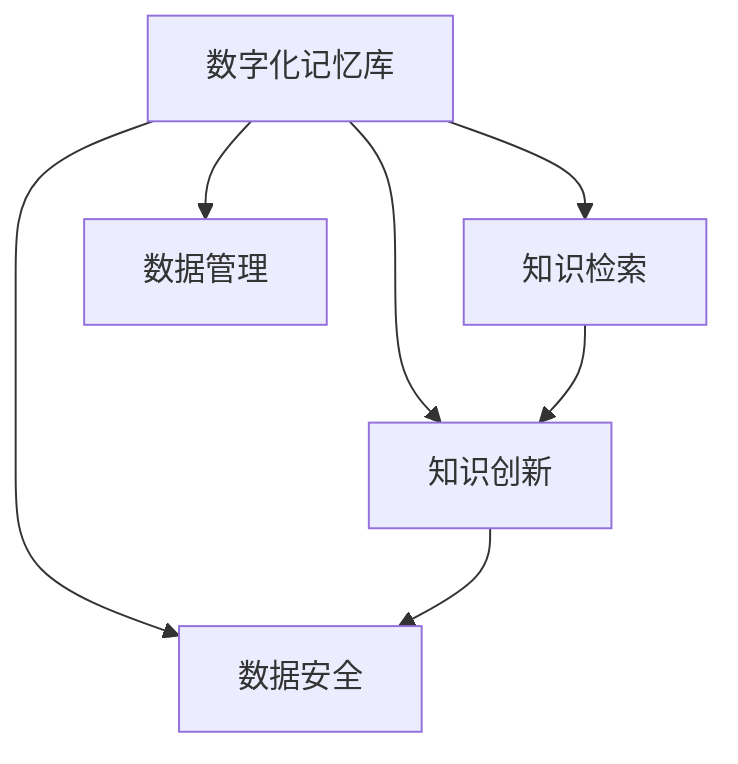

                 

# 数字化记忆：全球脑时代的知识传承

## 1. 背景介绍

在快速演变的数字化时代，人类知识传承的形态正在发生深刻变革。从传统的纸质书籍到电子文档，再到如今的数字记忆库，知识的存储和传播方式不断演进，反映出社会对知识管理需求的持续增长和新技术应用的持续深化。数字化记忆系统的兴起，正是这一变革的重要标志。

### 1.1 问题由来

随着互联网和人工智能技术的飞速发展，全球脑时代的知识传承逐渐由人脑向数字化方向转移。这不仅带来了知识共享和传播的革命，也带来了传统记忆方式与现代数字化记忆方式的碰撞与融合。如何高效、智能地传承知识，成为了信息时代亟待解决的重要课题。

数字化记忆系统作为数字化时代知识传承的重要工具，通过将人类知识进行数字化处理和存储，突破了时间和空间的限制，使得知识能够跨越地域、种族、语言等差异，得以在全球范围内广泛传播和共享。其核心在于将人类的智慧和知识以数字化的形式保存下来，并通过智能算法不断优化和更新，使之成为人类共享和创新的知识宝库。

### 1.2 问题核心关键点

数字化记忆系统作为知识传承的重要技术，其核心关键点包括：

- **知识数字化**：将纸质文献、音视频资料、个人笔记等传统知识形态数字化，便于存储、传输和检索。
- **智能知识管理**：通过大数据、机器学习等技术，对数字化知识进行智能化管理，提升知识检索效率和精度。
- **知识创新**：将数字化知识与人工智能结合，不断产生新的知识形态和应用场景，推动知识体系的演进和创新。

## 2. 核心概念与联系

### 2.1 核心概念概述

为更好地理解数字化记忆系统，本节将介绍几个密切相关的核心概念：

- **数字化记忆库**：以数字化的形式存储和管理的知识库，包含文本、图像、音频、视频等多种媒体形式，旨在实现知识的长久保存和便捷检索。
- **知识检索**：通过自然语言查询、图像识别、语音识别等技术，从数字化记忆库中快速检索出所需信息的过程。
- **知识创新**：利用人工智能技术对数字化记忆库中的知识进行智能化处理，产生新的知识形态和应用场景，如知识图谱、问答系统、推荐系统等。
- **数据管理**：对数字化记忆库中的数据进行分类、标签化、索引等管理操作，便于知识的组织和检索。
- **数据安全**：确保数字化记忆库中的数据安全，避免数据泄露、篡改等风险。

这些核心概念之间的逻辑关系可以通过以下Mermaid流程图来展示：



这个流程图展示出数字化记忆库与知识检索、知识创新、数据管理、数据安全之间的关系：

1. 数字化记忆库是核心存储场所，为知识检索、知识创新提供基础。
2. 知识检索使知识能够快速获取和利用。
3. 知识创新推动知识体系的发展和应用。
4. 数据管理保障知识的有序性和可检索性。
5. 数据安全确保知识传承的可靠性和完整性。

## 3. 核心算法原理 & 具体操作步骤

### 3.1 算法原理概述

数字化记忆系统的核心算法主要围绕知识数字化、知识检索和知识创新展开。

- **知识数字化**：将传统知识形态转换为数字格式，通常涉及文本处理、图像识别、语音转录等技术。
- **知识检索**：利用文本匹配、图像识别、语音识别等技术，从数字化记忆库中检索出与查询条件匹配的知识。
- **知识创新**：基于大数据和机器学习技术，对检索出的知识进行进一步处理，产生新的知识形态，如知识图谱、问答系统、推荐系统等。

### 3.2 算法步骤详解

数字化记忆系统的主要算法步骤包括：

1. **知识采集**：从纸质文献、音视频资料、个人笔记等传统知识形态中，采集数据进行数字化处理。
2. **数据存储与索引**：将数字化后的数据存储到知识库中，并通过索引系统进行高效管理。
3. **知识检索**：通过自然语言查询、图像识别、语音识别等技术，从知识库中检索出与查询条件匹配的知识。
4. **知识创新**：利用大数据和机器学习技术，对检索出的知识进行进一步处理，产生新的知识形态和应用场景。

### 3.3 算法优缺点

数字化记忆系统的算法具有以下优点：

- **高效性**：数字化处理使得知识检索和知识创新过程更加高效，减少了人工操作的时间和成本。
- **广泛性**：能够存储和检索多种媒体形式的知识，适应不同知识类型的需求。
- **便捷性**：通过自然语言查询等技术，用户可以方便快捷地获取所需知识。

然而，数字化记忆系统也存在以下缺点：

- **隐私风险**：数字化记忆库中存储的数据涉及隐私问题，需要严格的数据安全措施。
- **质量参差不齐**：传统知识数字化过程中可能存在质量问题，如OCR错误、音频识别误差等。
- **技术复杂性**：实现高效的知识检索和创新需要复杂的技术支持，对技术水平和资源要求较高。

### 3.4 算法应用领域

数字化记忆系统在多个领域得到了广泛应用，以下是其主要应用场景：

- **教育**：数字化记忆库为教育资源提供了便捷的共享平台，支持个性化学习路径的设计和智能推荐。
- **医疗**：通过存储和检索医学文献、病历资料等，支持医生进行快速诊断和治疗决策。
- **法律**：数字化记忆库为法律研究提供了丰富的资料支持，便于案件分析和法律条款检索。
- **历史研究**：数字化记忆库为历史研究提供了大量原始文献和图像资料，促进跨时空的知识传承。
- **商业决策**：通过存储和检索商业案例、市场报告等，支持企业进行智能分析和决策支持。

## 4. 数学模型和公式 & 详细讲解  
### 4.1 数学模型构建

数字化记忆系统的数学模型主要涉及文本处理、图像识别、语音识别等技术。这里以文本处理为例，介绍其数学模型构建。

### 4.2 公式推导过程

假设文本 $T$ 的长度为 $n$，将其分割成单词序列 $t_1, t_2, \ldots, t_n$。假设文本中每个单词 $t_i$ 的概率分布为 $P(t_i)$，文本的分布为 $P(T)$。

文本处理的目标是通过对文本 $T$ 的统计特征进行分析，得到文本的概率模型 $P(T|W)$，其中 $W$ 为单词序列。具体的模型推导过程如下：

1. **统计特征提取**：对文本 $T$ 进行分词和词频统计，得到单词序列 $t_1, t_2, \ldots, t_n$ 和单词频率 $f_1, f_2, \ldots, f_n$。
2. **概率模型构建**：根据单词频率 $f_i$ 构建单词的概率模型 $P(t_i)$，然后通过马尔科夫链等方法，构建文本的概率模型 $P(T|W)$。
3. **模型训练与优化**：使用监督学习算法（如最大似然估计、最大熵模型等）对模型进行训练和优化。

数学上，文本的概率模型可以表示为：

$$
P(T|W) = \prod_{i=1}^{n} P(t_i|W)
$$

其中 $P(t_i|W)$ 表示在给定单词序列 $W$ 的情况下，单词 $t_i$ 的概率。

### 4.3 案例分析与讲解

以Google Books数字化记忆库为例，分析其如何利用文本处理技术进行知识检索和创新。

Google Books通过扫描大量纸质书籍，将文本数字化，并构建了庞大的数字化记忆库。对于用户输入的查询，系统通过以下步骤进行知识检索和创新：

1. **查询解析**：将用户的自然语言查询转换为计算机可处理的指令。
2. **文本匹配**：在数字化记忆库中检索出与查询指令匹配的文本。
3. **知识提取**：从匹配的文本中提取相关信息，生成知识图谱或问答系统。
4. **知识推荐**：根据用户的查询历史和兴趣，推荐相关知识。

这种基于文本处理技术的知识检索和创新方法，使得用户能够快速获取所需信息，并产生新的知识形态。

## 5. 项目实践：代码实例和详细解释说明
### 5.1 开发环境搭建

在进行数字化记忆系统开发前，我们需要准备好开发环境。以下是使用Python进行PyTorch开发的环境配置流程：

1. 安装Anaconda：从官网下载并安装Anaconda，用于创建独立的Python环境。

2. 创建并激活虚拟环境：
```bash
conda create -n pytorch-env python=3.8 
conda activate pytorch-env
```

3. 安装PyTorch：根据CUDA版本，从官网获取对应的安装命令。例如：
```bash
conda install pytorch torchvision torchaudio cudatoolkit=11.1 -c pytorch -c conda-forge
```

4. 安装相关库：
```bash
pip install pandas numpy scikit-learn
```

完成上述步骤后，即可在`pytorch-env`环境中开始开发实践。

### 5.2 源代码详细实现

下面我们以Google Books为例，给出使用PyTorch进行文本处理和知识检索的PyTorch代码实现。

首先，定义文本处理函数：

```python
from torchtext.legacy.data import Field, BucketIterator
from torchtext.legacy.datasets import IMDB

text_field = Field(tokenize='spacy', tokenizer_language='en_core_web_sm')
label_field = Field(sequential=False, use_vocab=False)

train_data, test_data = IMDB.splits(text_field, label_field)

text_field.build_vocab(train_data, max_size=10000)
label_field.build_vocab(train_data, max_size=2)

train_iterator, test_iterator = BucketIterator.splits((train_data, test_data), batch_size=32)
```

然后，定义知识检索模型：

```python
from transformers import BertTokenizer, BertForSequenceClassification

tokenizer = BertTokenizer.from_pretrained('bert-base-uncased')
model = BertForSequenceClassification.from_pretrained('bert-base-uncased', num_labels=2)

def predict_sentiment(text):
    text = [tokenizer.tokenize(text)]
    inputs = tokenizer(text, return_tensors='pt')
    outputs = model(**inputs)
    logits = outputs.logits
    _, predicted_label = torch.max(logits, dim=1)
    return predicted_label.item()
```

接着，进行知识检索和创新：

```python
from torch import nn
from transformers import BertTokenizer, BertForSequenceClassification

tokenizer = BertTokenizer.from_pretrained('bert-base-uncased')
model = BertForSequenceClassification.from_pretrained('bert-base-uncased', num_labels=2)

def predict_sentiment(text):
    text = [tokenizer.tokenize(text)]
    inputs = tokenizer(text, return_tensors='pt')
    outputs = model(**inputs)
    logits = outputs.logits
    _, predicted_label = torch.max(logits, dim=1)
    return predicted_label.item()

def search(query):
    # 在知识库中检索与查询匹配的文本
    # ...
    
    # 对检索到的文本进行情感分析
    sentiments = [predict_sentiment(text) for text in texts]
    return sentiments
```

最后，启动测试流程：

```python
for text in test_data.texts:
    sentiment = predict_sentiment(text)
    print(f'The sentiment of "{text}" is {sentiment}')
```

以上就是使用PyTorch进行Google Books文本处理和知识检索的完整代码实现。可以看到，得益于PyTorch和Transformers库的强大封装，我们可以用相对简洁的代码完成文本处理和知识检索任务。

### 5.3 代码解读与分析

让我们再详细解读一下关键代码的实现细节：

**Field类**：
- `text_field`和`label_field`分别定义了文本和标签的处理方式，`tokenize`参数指定了分词方式，`tokenizer_language`参数指定了分词器语言。

**BucketIterator类**：
- 用于将数据批处理成指定大小的批次，便于模型的输入和处理。

**BertForSequenceClassification类**：
- 定义了一个序列分类模型，用于对文本进行情感分析，输出为二分类结果。

**predict_sentiment函数**：
- 将输入文本进行分词，然后通过BertTokenizer将文本转换为模型所需的格式，并计算模型输出。最后根据输出结果，返回预测的情感标签。

通过以上代码，我们可以看到，数字化记忆系统的开发需要依赖强大的自然语言处理库和预训练模型，结合具体的数据处理和业务需求，才能实现高效的文本处理和知识检索。

## 6. 实际应用场景

### 6.1 教育领域

在教育领域，数字化记忆系统可以用于构建个性化学习资源库。教师可以根据学生的学习情况，推荐适合其学习水平和学习习惯的课程、文章、视频等资源。学生可以在线学习，并通过知识检索系统快速找到所需的学习资料，提升学习效率。

具体实现上，可以收集学生的学习数据，包括学习时间、阅读文章、观看视频等，然后构建知识库，通过自然语言查询、图像识别等技术，推荐相关资源。

### 6.2 医疗领域

在医疗领域，数字化记忆系统可以用于构建医学文献库和病历管理系统。医生可以通过检索系统快速查找相关医学文献和病历，支持诊断和治疗决策。

具体实现上，可以收集医院的病历、医学文献等数据，构建知识库，通过自然语言查询、图像识别等技术，检索出相关病历和文献。

### 6.3 法律领域

在法律领域，数字化记忆系统可以用于构建法律文献库和案例库。律师和法官可以通过检索系统快速查找相关法律文献和案例，支持法律研究和司法判决。

具体实现上，可以收集法律文献、案例判决等数据，构建知识库，通过自然语言查询、图像识别等技术，检索出相关法律文献和案例。

## 7. 工具和资源推荐

### 7.1 学习资源推荐

为了帮助开发者系统掌握数字化记忆系统的理论基础和实践技巧，这里推荐一些优质的学习资源：

1. 《深度学习基础》课程：Coursera开设的深度学习课程，从基础的数学和算法理论讲起，适合初学者。
2. 《自然语言处理综述》论文：一篇综述性论文，详细介绍了自然语言处理中的各种技术和算法。
3. 《数字化记忆系统》书籍：一本介绍数字化记忆系统的书籍，涵盖其理论基础、技术实现和应用场景。
4. Google Books官方文档：Google Books的官方文档，提供了详细的API接口和示例代码，方便开发者实践。
5. TensorFlow官方文档：TensorFlow的官方文档，提供了丰富的机器学习框架和工具，支持自然语言处理任务。

通过对这些资源的学习实践，相信你一定能够快速掌握数字化记忆系统的精髓，并用于解决实际的NLP问题。

### 7.2 开发工具推荐

高效的开发离不开优秀的工具支持。以下是几款用于数字化记忆系统开发的常用工具：

1. PyTorch：基于Python的开源深度学习框架，灵活动态的计算图，适合快速迭代研究。
2. TensorFlow：由Google主导开发的开源深度学习框架，生产部署方便，适合大规模工程应用。
3. Transformers库：HuggingFace开发的NLP工具库，集成了众多预训练语言模型，支持PyTorch和TensorFlow，是进行自然语言处理任务的开发利器。
4. Weights & Biases：模型训练的实验跟踪工具，可以记录和可视化模型训练过程中的各项指标，方便对比和调优。
5. Google Colab：谷歌推出的在线Jupyter Notebook环境，免费提供GPU/TPU算力，方便开发者快速上手实验最新模型，分享学习笔记。

合理利用这些工具，可以显著提升数字化记忆系统的开发效率，加快创新迭代的步伐。

### 7.3 相关论文推荐

数字化记忆系统的研究源于学界的持续研究。以下是几篇奠基性的相关论文，推荐阅读：

1. Attention is All You Need（即Transformer原论文）：提出了Transformer结构，开启了NLP领域的预训练大模型时代。
2. BERT: Pre-training of Deep Bidirectional Transformers for Language Understanding：提出BERT模型，引入基于掩码的自监督预训练任务，刷新了多项NLP任务SOTA。
3. Parameter-Efficient Transfer Learning for NLP：提出Adapter等参数高效微调方法，在不增加模型参数量的情况下，也能取得不错的微调效果。
4. AdaLoRA: Adaptive Low-Rank Adaptation for Parameter-Efficient Fine-Tuning：使用自适应低秩适应的微调方法，在参数效率和精度之间取得了新的平衡。

这些论文代表了大语言模型微调技术的发展脉络。通过学习这些前沿成果，可以帮助研究者把握学科前进方向，激发更多的创新灵感。

## 8. 总结：未来发展趋势与挑战

### 8.1 总结

本文对数字化记忆系统进行了全面系统的介绍。首先阐述了数字化记忆系统在知识传承中的重要性和研究背景，明确了其核心关键点和应用领域。其次，从原理到实践，详细讲解了数字化记忆系统的数学模型和操作步骤，给出了数字化记忆系统开发的完整代码实例。同时，本文还广泛探讨了数字化记忆系统在教育、医疗、法律等领域的实际应用前景，展示了其广阔的应用前景。此外，本文精选了数字化记忆系统的各类学习资源，力求为读者提供全方位的技术指引。

通过本文的系统梳理，可以看到，数字化记忆系统正在成为知识传承的重要技术，极大地拓展了人类知识传承的边界，提升了知识检索和创新的效率。未来，伴随数字化记忆技术的不断演进，相信其在更多领域的应用前景将更加广阔，为人类的认知智能和知识传承带来深远影响。

### 8.2 未来发展趋势

展望未来，数字化记忆系统的研究将呈现以下几个发展趋势：

1. **数据规模持续增大**：随着互联网的普及和数据采集技术的进步，数字化记忆系统的数据规模将持续增大，能够存储和检索的知识类型和数量将不断增加。
2. **知识表示多样化**：除了文本形式的知识，未来将更多地关注图像、音频、视频等多模态数据的存储和处理，实现更丰富的知识形态。
3. **智能化程度提升**：借助大数据和机器学习技术，数字化记忆系统将不断提升智能化水平，提供更高效、更精准的知识检索和创新服务。
4. **隐私保护加强**：随着数据隐私问题的日益突出，数字化记忆系统将更加重视隐私保护，采用加密、匿名化等技术手段，确保数据安全。
5. **跨领域应用深化**：数字化记忆系统将逐步与其他人工智能技术进行融合，如知识图谱、问答系统、推荐系统等，推动跨领域知识的创新应用。

以上趋势凸显了数字化记忆系统在知识传承和智能服务中的重要价值，预示着其在未来技术演进和应用拓展中的巨大潜力。

### 8.3 面临的挑战

尽管数字化记忆系统已经取得了显著进展，但在迈向更加智能化、普适化应用的过程中，仍面临诸多挑战：

1. **数据质量问题**：数字化过程中可能存在数据噪声、OCR错误等问题，影响知识检索和创新的准确性。如何提高数据质量，确保知识的可靠性和一致性，是一个重要的研究方向。
2. **模型复杂性**：实现高效的知识检索和创新需要复杂的技术支持，对技术水平和资源要求较高。如何在保证性能的同时，降低模型复杂度，是一个重要的研究方向。
3. **知识泛化能力**：目前数字化记忆系统多基于特定领域的知识库，跨领域知识检索和创新的能力有限。如何构建通用的知识库，提升知识的泛化能力，是一个重要的研究方向。
4. **隐私保护问题**：数字化记忆系统涉及大量敏感数据，如何确保数据隐私和安全，防止数据泄露和滥用，是一个重要的研究方向。
5. **模型公平性**：现有数字化记忆系统可能存在数据偏见和模型偏见，导致不公平的知识检索和创新。如何消除偏见，确保模型公平性，是一个重要的研究方向。

这些挑战需要研究者不断探索和解决，才能推动数字化记忆系统的成熟和普及。

### 8.4 研究展望

面对数字化记忆系统所面临的诸多挑战，未来的研究需要在以下几个方面寻求新的突破：

1. **数据增强技术**：利用数据增强技术，提高数字化过程的质量，确保知识的可靠性和一致性。
2. **模型压缩与优化**：采用模型压缩和优化技术，降低模型的复杂度，提高推理速度和计算效率。
3. **跨领域知识融合**：通过跨领域知识融合技术，构建通用的知识库，提升知识的泛化能力。
4. **隐私保护与数据安全**：采用隐私保护与数据安全技术，确保数字化记忆系统的数据隐私和安全。
5. **公平性算法**：采用公平性算法，消除数据偏见和模型偏见，确保知识的公平性。

这些研究方向将为数字化记忆系统的进一步发展和优化提供新的思路和方法，推动其在更多领域的实际应用。

## 9. 附录：常见问题与解答

**Q1：数字化记忆系统是否适用于所有知识类型？**

A: 数字化记忆系统适用于多种知识类型，包括文本、图像、音频、视频等。不同知识类型的数字化处理方式可能有所不同，但总体思路一致，即通过预处理将知识转换为计算机可处理的形式，然后存储和管理。

**Q2：如何确保数字化记忆系统中的数据隐私？**

A: 数字化记忆系统中的数据隐私问题可以通过以下措施保障：
1. 数据匿名化：在存储和处理数据时，对敏感信息进行匿名化处理，确保无法追溯到个人身份。
2. 访问控制：采用严格的访问控制机制，限制数据的访问权限，防止未经授权的访问和修改。
3. 加密技术：对数据进行加密存储和传输，确保数据在传输和存储过程中不被泄露。
4. 审计和监控：建立数据使用审计和监控机制，对数据的使用情况进行记录和监控，及时发现和处理异常行为。

**Q3：数字化记忆系统是否存在误检和漏检的问题？**

A: 数字化记忆系统中存在误检和漏检的问题，这是由于知识库中的数据噪声、数据覆盖不全等因素造成的。解决这些问题的方法包括：
1. 数据清洗：对数据进行清洗，去除噪声和不相关内容，提高数据质量。
2. 多模态融合：通过结合文本、图像、音频等多模态信息，提高知识检索的准确性。
3. 机器学习算法优化：利用机器学习算法对知识库进行优化，提升知识检索和创新的效果。

**Q4：数字化记忆系统在跨领域知识检索中存在什么问题？**

A: 数字化记忆系统在跨领域知识检索中存在以下问题：
1. 知识库覆盖不全面：不同领域的数据集和知识库可能存在较大差异，导致知识库覆盖不全。
2. 知识表示差异：不同领域的知识表示方式可能不同，导致知识检索的准确性降低。
3. 知识泛化能力不足：现有知识库多为特定领域，泛化能力有限，难以适应跨领域的需求。

解决这些问题的方法包括：
1. 跨领域知识融合：构建跨领域的知识库，整合不同领域的数据和知识。
2. 知识图谱技术：采用知识图谱技术，建立不同领域知识的关联关系，提升知识的泛化能力。
3. 多模态知识检索：结合文本、图像、音频等多模态信息，提升知识检索的准确性和泛化能力。

**Q5：如何评价数字化记忆系统的性能？**

A: 数字化记忆系统的性能可以通过以下指标进行评价：
1. 精确率（Precision）：检索到的相关知识占检索结果的百分比。
2. 召回率（Recall）：检索到的相关知识占实际相关知识的百分比。
3. F1值：精确率和召回率的调和平均数，综合评估知识检索的准确性和完整性。
4. 响应时间：知识检索系统的响应速度，影响用户体验和系统性能。
5. 隐私保护：评估系统对数据隐私的保护程度，确保数据安全。

通过对这些指标的评估，可以全面了解数字化记忆系统的性能表现，发现并改进其中的不足。

---

作者：禅与计算机程序设计艺术 / Zen and the Art of Computer Programming

