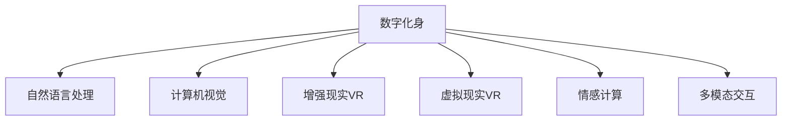

                 

# 数字化身创业：虚拟世界的个人代表

## 1. 背景介绍

### 1.1 问题由来
在数字化迅猛发展的今天，虚拟世界的构建已经成为科技公司角逐的焦点。从虚拟现实（VR）到增强现实（AR），从数字人到数字身（Digital Avatars），这些技术正逐步改变人们的交流方式、商业模式乃至社交行为。数字化身，作为虚拟世界中的个人代表，是人工智能、计算机视觉、自然语言处理等前沿技术融合的产物，赋予个体在数字世界中自由表达、互动的能力。

数字化身创业，是指利用先进技术创造数字身，为其赋予智能，并通过其在虚拟世界中的行为与互动，实现品牌推广、商业合作、社交娱乐等多种功能。这一领域不仅包含技术研发，还涉及内容创造、社区建设、市场推广等多方面，潜力巨大，正逐步吸引越来越多的创业者和企业关注。

### 1.2 问题核心关键点
数字化身创业的核心关键点在于：
1. **技术融合**：将AI、计算机视觉、自然语言处理等技术融合，创建出智能、逼真的数字身。
2. **内容创作**：为数字身提供丰富多彩的内容和互动场景，满足用户需求，增加用户粘性。
3. **社区建设**：构建虚拟世界社区，促进用户间互动，增强用户体验。
4. **市场推广**：利用数字身进行品牌推广、商业合作、社交娱乐等，实现商业变现。

### 1.3 问题研究意义
数字化身创业的研究意义在于：
1. **推动虚拟技术进步**：促进人工智能、计算机视觉等前沿技术的实际应用，推动这些技术的发展。
2. **提升用户体验**：赋予用户更丰富的虚拟世界体验，提升用户的参与感和满意度。
3. **创造新商业模式**：开拓虚拟世界的商业应用，为科技企业提供新的增长点。
4. **助力社会变革**：在教育、医疗、娱乐等领域中，数字身可以发挥重要作用，促进社会进步。

## 2. 核心概念与联系

### 2.1 核心概念概述
本节将介绍数字化身创业中涉及的核心概念：

- **数字化身（Digital Avatar）**：指在虚拟世界中，通过人工智能、计算机视觉等技术创建的虚拟角色，具备智能、情感、语音等多重特性。
- **自然语言处理（NLP）**：指让数字身能够理解和生成自然语言的技术，包括语义理解、情感分析、对话系统等。
- **计算机视觉**：指让数字身能够感知和理解视觉世界的技术，包括图像识别、面部表情分析、动作捕捉等。
- **增强现实（AR）与虚拟现实（VR）**：指通过AR/VR技术，将数字身置身于真实世界或虚拟世界中，实现与用户的交互。
- **情感计算（Affective Computing）**：指通过分析数字身的语音、面部表情、身体语言等，理解其情感状态，实现更自然的交互。
- **多模态交互**：指通过整合语音、视觉、触觉等多种感官信息，实现更全面、丰富的交互体验。

这些核心概念之间的联系可以通过以下Mermaid流程图来展示：



这个流程图展示了大语言模型微调中各核心概念之间的关联关系：

1. 数字化身通过自然语言处理与用户进行语言交互。
2. 通过计算机视觉感知虚拟世界或真实世界的视觉信息。
3. 利用增强现实和虚拟现实技术，将数字身置身于真实世界或虚拟世界中。
4. 通过情感计算，理解数字身的情感状态，实现更自然的交互。
5. 通过多模态交互，整合语音、视觉、触觉等多种感官信息，实现更全面、丰富的交互体验。

## 3. 核心算法原理 & 具体操作步骤
### 3.1 算法原理概述
数字化身创业的核心算法包括自然语言处理、计算机视觉、情感计算等多方面的技术，其核心原理如下：

- **自然语言处理**：使用深度学习模型（如BERT、GPT）进行预训练，利用微调技术（如Fine-tuning）针对特定任务进行优化，使数字身能够理解和生成自然语言。
- **计算机视觉**：使用卷积神经网络（CNN）或卷积神经网络+循环神经网络（CNN+RNN）进行图像识别和处理，使数字身能够感知和理解视觉世界。
- **情感计算**：使用机器学习算法进行情感分析，识别数字身的语音、面部表情、身体语言等情感状态，实现更自然的交互。

### 3.2 算法步骤详解
数字化身创业的算法步骤包括：

**Step 1: 数据准备与预处理**
- 收集和整理数据，包括语音数据、面部表情数据、身体语言数据、图像数据等。
- 对数据进行清洗、标注和预处理，确保数据的完整性和准确性。

**Step 2: 模型选择与训练**
- 选择合适的深度学习模型，并进行预训练。如使用BERT进行自然语言处理，使用CNN+RNN进行计算机视觉处理，使用机器学习算法进行情感计算。
- 利用微调技术对模型进行优化，使其能够适应特定的数字化身创业任务。

**Step 3: 内容创作与集成**
- 为数字身创作丰富多样的内容，包括对话脚本、面部表情库、身体语言库等。
- 将内容与数字身进行集成，确保数字身能够流畅地进行语言、视觉、触觉等多种交互。

**Step 4: 社区建设与推广**
- 构建虚拟世界社区，提供用户间的互动平台，增加用户粘性。
- 利用数字身进行品牌推广、商业合作、社交娱乐等，实现商业变现。

**Step 5: 持续优化与迭代**
- 收集用户反馈，不断优化数字身的功能和交互体验。
- 持续更新数据和模型，提升数字化身的表现和用户满意度。

### 3.3 算法优缺点
数字化身创业的算法具有以下优点：
1. **高效**：利用深度学习等先进技术，实现自动化、快速化的模型训练和优化。
2. **灵活**：通过微调技术，快速适应不同任务和需求，实现多功能集成。
3. **沉浸**：通过增强现实、虚拟现实技术，为用户提供沉浸式的交互体验。

但同时，也存在一些缺点：
1. **数据依赖**：需要大量的数据进行训练和优化，数据获取和标注成本较高。
2. **模型复杂**：涉及多方面的技术，模型复杂度高，实现难度大。
3. **交互限制**：当前技术限制下，数字身的交互体验仍需提升，无法完全取代真人。

### 3.4 算法应用领域

数字化身创业的算法已经在多个领域得到应用，例如：

- **社交娱乐**：利用数字身进行虚拟社交、游戏、互动演出等，提供沉浸式娱乐体验。
- **品牌推广**：通过数字身在虚拟世界中推广品牌，实现多渠道宣传和互动。
- **虚拟客服**：利用数字身进行虚拟客服，提升客户服务体验，降低人力成本。
- **教育培训**：通过数字身进行虚拟教学、模拟演练、情景再现等，提升教育培训效果。
- **医疗健康**：利用数字身进行虚拟诊疗、心理咨询、康复训练等，提供便捷、安全的医疗服务。

除了上述这些经典应用外，数字化身创业还将在更多场景中发挥作用，如虚拟房地产、虚拟旅游、虚拟活动等，为数字化身技术带来新的发展机遇。

## 4. 数学模型和公式 & 详细讲解 & 举例说明

### 4.1 数学模型构建

数字化身创业中的数学模型主要涉及自然语言处理、计算机视觉、情感计算等方面的知识。以下以自然语言处理为例，简要介绍模型的构建过程。

记数字化身需要理解的自然语言为 $X$，包含词语、句子、段落等文本形式。定义自然语言处理模型的输入为 $x_i \in X$，输出为 $y_i$，其中 $y_i$ 为数字化身对 $x_i$ 的理解或生成。

### 4.2 公式推导过程

以BERT模型为例，其基于Transformer架构，通过自监督学习进行预训练，从而具备强大的语言理解和生成能力。以下是BERT模型的关键公式推导：

$$
H_i = [CLS] \cdot x_i \cdot M_i \cdot x_i^T \cdot M_i^T + P(x_i) + B
$$

其中 $H_i$ 为BERT模型对输入 $x_i$ 的表示，$M_i$ 为Transformer模型中的自注意力矩阵，$P(x_i)$ 为位置编码，$B$ 为BERT模型中的嵌入层。通过预训练和微调，可以使得模型对自然语言的理解更加准确和丰富。

### 4.3 案例分析与讲解

以下以虚拟客服系统为例，展示数字化身创业的实际应用。假设数字化身在虚拟客服系统中负责处理客户咨询，其工作流程包括：

1. 客户输入问题 $x$，数字化身通过自然语言处理模型 $H$ 得到问题表示 $H_x$。
2. 将问题表示 $H_x$ 输入到计算机视觉模型 $V$ 中进行情感分析，得到情感状态 $E_x$。
3. 根据情感状态 $E_x$ 和问题 $x$，数字化身选择最适合的回答模板 $A_x$，并通过自然语言生成模型 $G$ 生成答案 $y$。
4. 将答案 $y$ 返回给客户，并根据客户反馈进行进一步的优化和迭代。

这一过程展示了数字化身在虚拟客服系统中的应用，其中自然语言处理、情感计算、多模态交互等多种技术的融合，实现了高效、自然的客户服务体验。

## 5. 项目实践：代码实例和详细解释说明
### 5.1 开发环境搭建

在进行数字化身创业的实践前，我们需要准备好开发环境。以下是使用Python进行PyTorch开发的环境配置流程：

1. 安装Anaconda：从官网下载并安装Anaconda，用于创建独立的Python环境。

2. 创建并激活虚拟环境：
```bash
conda create -n pytorch-env python=3.8 
conda activate pytorch-env
```

3. 安装PyTorch：根据CUDA版本，从官网获取对应的安装命令。例如：
```bash
conda install pytorch torchvision torchaudio cudatoolkit=11.1 -c pytorch -c conda-forge
```

4. 安装TensorFlow：由Google主导开发的开源深度学习框架，生产部署方便，适合大规模工程应用。同样有丰富的预训练语言模型资源。

5. 安装Transformers库：HuggingFace开发的NLP工具库，集成了众多SOTA语言模型，支持PyTorch和TensorFlow，是进行数字化身创业开发的利器。

6. 安装各类工具包：
```bash
pip install numpy pandas scikit-learn matplotlib tqdm jupyter notebook ipython
```

完成上述步骤后，即可在`pytorch-env`环境中开始数字化身创业的实践。

### 5.2 源代码详细实现

这里我们以虚拟客服系统为例，给出使用Transformers库对BERT模型进行自然语言处理的PyTorch代码实现。

首先，定义虚拟客服系统的数据处理函数：

```python
from transformers import BertTokenizer
from torch.utils.data import Dataset
import torch

class CustomerQueryDataset(Dataset):
    def __init__(self, queries, responses, tokenizer, max_len=128):
        self.queries = queries
        self.responses = responses
        self.tokenizer = tokenizer
        self.max_len = max_len
        
    def __len__(self):
        return len(self.queries)
    
    def __getitem__(self, item):
        query = self.queries[item]
        response = self.responses[item]
        
        encoding = self.tokenizer(query, return_tensors='pt', max_length=self.max_len, padding='max_length', truncation=True)
        input_ids = encoding['input_ids'][0]
        attention_mask = encoding['attention_mask'][0]
        
        # 将response作为label，用于训练
        labels = torch.tensor(self.responses[item])
        
        return {'input_ids': input_ids, 
                'attention_mask': attention_mask,
                'labels': labels}

# 加载BERT模型和预训练模型
from transformers import BertForSequenceClassification

model = BertForSequenceClassification.from_pretrained('bert-base-cased', num_labels=2)

# 加载数据集
tokenizer = BertTokenizer.from_pretrained('bert-base-cased')
train_dataset = CustomerQueryDataset(train_queries, train_responses, tokenizer)
dev_dataset = CustomerQueryDataset(dev_queries, dev_responses, tokenizer)
test_dataset = CustomerQueryDataset(test_queries, test_responses, tokenizer)

# 定义模型参数和优化器
optimizer = AdamW(model.parameters(), lr=2e-5)
```

然后，定义训练和评估函数：

```python
from torch.utils.data import DataLoader
from tqdm import tqdm
from sklearn.metrics import classification_report

device = torch.device('cuda') if torch.cuda.is_available() else torch.device('cpu')
model.to(device)

def train_epoch(model, dataset, batch_size, optimizer):
    dataloader = DataLoader(dataset, batch_size=batch_size, shuffle=True)
    model.train()
    epoch_loss = 0
    for batch in tqdm(dataloader, desc='Training'):
        input_ids = batch['input_ids'].to(device)
        attention_mask = batch['attention_mask'].to(device)
        labels = batch['labels'].to(device)
        model.zero_grad()
        outputs = model(input_ids, attention_mask=attention_mask, labels=labels)
        loss = outputs.loss
        epoch_loss += loss.item()
        loss.backward()
        optimizer.step()
    return epoch_loss / len(dataloader)

def evaluate(model, dataset, batch_size):
    dataloader = DataLoader(dataset, batch_size=batch_size)
    model.eval()
    preds, labels = [], []
    with torch.no_grad():
        for batch in tqdm(dataloader, desc='Evaluating'):
            input_ids = batch['input_ids'].to(device)
            attention_mask = batch['attention_mask'].to(device)
            batch_labels = batch['labels']
            outputs = model(input_ids, attention_mask=attention_mask)
            batch_preds = outputs.logits.argmax(dim=2).to('cpu').tolist()
            batch_labels = batch_labels.to('cpu').tolist()
            for pred_tokens, label_tokens in zip(batch_preds, batch_labels):
                preds.append(pred_tokens[:len(label_tokens)])
                labels.append(label_tokens)
                
    print(classification_report(labels, preds))
```

最后，启动训练流程并在测试集上评估：

```python
epochs = 5
batch_size = 16

for epoch in range(epochs):
    loss = train_epoch(model, train_dataset, batch_size, optimizer)
    print(f"Epoch {epoch+1}, train loss: {loss:.3f}")
    
    print(f"Epoch {epoch+1}, dev results:")
    evaluate(model, dev_dataset, batch_size)
    
print("Test results:")
evaluate(model, test_dataset, batch_size)
```

以上就是使用PyTorch对BERT进行虚拟客服系统微调的完整代码实现。可以看到，得益于Transformers库的强大封装，我们可以用相对简洁的代码完成BERT模型的加载和微调。

### 5.3 代码解读与分析

让我们再详细解读一下关键代码的实现细节：

**CustomerQueryDataset类**：
- `__init__`方法：初始化查询、回复、分词器等关键组件。
- `__len__`方法：返回数据集的样本数量。
- `__getitem__`方法：对单个样本进行处理，将查询输入编码为token ids，将回复作为label，并对样本进行定长padding，最终返回模型所需的输入。

**虚拟客服系统的数据处理**：
- 使用BertTokenizer对查询进行分词，生成token ids和attention mask。
- 将回复作为label，用于训练。

**模型训练**：
- 使用AdamW优化器，设置学习率，对模型进行训练。
- 在训练集上进行迭代优化，并在每个epoch输出平均损失。
- 在验证集上评估模型性能，输出分类指标。

**模型评估**：
- 使用classification_report函数，输出精确度、召回率、F1分数等评估指标。

**训练流程**：
- 定义总的epoch数和batch size，开始循环迭代。
- 每个epoch内，在训练集上进行训练，输出平均loss。
- 在验证集上评估，输出分类指标。
- 所有epoch结束后，在测试集上评估，给出最终测试结果。

可以看到，PyTorch配合Transformers库使得BERT微调的代码实现变得简洁高效。开发者可以将更多精力放在数据处理、模型改进等高层逻辑上，而不必过多关注底层的实现细节。

当然，工业级的系统实现还需考虑更多因素，如模型的保存和部署、超参数的自动搜索、更灵活的任务适配层等。但核心的微调范式基本与此类似。

## 6. 实际应用场景
### 6.1 智能客服系统

利用数字化身创业的数字化身，可以构建智能客服系统，提升客户服务体验。传统客服往往需要配备大量人力，高峰期响应缓慢，且一致性和专业性难以保证。而使用数字化身系统，可以7x24小时不间断服务，快速响应客户咨询，用自然流畅的语言解答各类常见问题。

在技术实现上，可以收集企业内部的历史客服对话记录，将问题和最佳答复构建成监督数据，在此基础上对预训练数字化身进行微调。微调后的数字化身能够自动理解用户意图，匹配最合适的答复模板进行回复。对于客户提出的新问题，还可以接入检索系统实时搜索相关内容，动态组织生成回答。如此构建的智能客服系统，能大幅提升客户咨询体验和问题解决效率。

### 6.2 金融舆情监测

金融机构需要实时监测市场舆论动向，以便及时应对负面信息传播，规避金融风险。传统的人工监测方式成本高、效率低，难以应对网络时代海量信息爆发的挑战。利用数字化身创业的文本分类和情感分析技术，为金融舆情监测提供了新的解决方案。

具体而言，可以收集金融领域相关的新闻、报道、评论等文本数据，并对其进行主题标注和情感标注。在此基础上对预训练数字化身进行微调，使其能够自动判断文本属于何种主题，情感倾向是正面、中性还是负面。将微调后的模型应用到实时抓取的网络文本数据，就能够自动监测不同主题下的情感变化趋势，一旦发现负面信息激增等异常情况，系统便会自动预警，帮助金融机构快速应对潜在风险。

### 6.3 个性化推荐系统

当前的推荐系统往往只依赖用户的历史行为数据进行物品推荐，无法深入理解用户的真实兴趣偏好。利用数字化身创业的多模态交互技术，个性化推荐系统可以更好地挖掘用户行为背后的语义信息，从而提供更精准、多样的推荐内容。

在实践中，可以收集用户浏览、点击、评论、分享等行为数据，提取和用户交互的物品标题、描述、标签等文本内容。将文本内容作为模型输入，用户的后续行为（如是否点击、购买等）作为监督信号，在此基础上微调预训练数字化身。微调后的模型能够从文本内容中准确把握用户的兴趣点。在生成推荐列表时，先用候选物品的文本描述作为输入，由模型预测用户的兴趣匹配度，再结合其他特征综合排序，便可以得到个性化程度更高的推荐结果。

### 6.4 未来应用展望

随着数字化身创业技术的不断发展，基于数字化身的虚拟世界应用将迎来新的突破。

在智慧医疗领域，基于数字化身的虚拟诊疗、心理咨询、康复训练等应用将提升医疗服务的智能化水平，辅助医生诊疗，加速新药开发进程。

在智能教育领域，数字化身将应用于虚拟教学、模拟演练、情景再现等，因材施教，促进教育公平，提高教学质量。

在智慧城市治理中，数字化身将应用于城市事件监测、舆情分析、应急指挥等环节，提高城市管理的自动化和智能化水平，构建更安全、高效的未来城市。

此外，在企业生产、社会治理、文娱传媒等众多领域，基于数字化身的虚拟世界应用也将不断涌现，为数字化身技术带来新的发展机遇。相信随着技术的日益成熟，数字化身创业必将在构建人机协同的智能时代中扮演越来越重要的角色。

## 7. 工具和资源推荐
### 7.1 学习资源推荐

为了帮助开发者系统掌握数字化身创业的理论基础和实践技巧，这里推荐一些优质的学习资源：

1. 《Transformers from Basics to Advanced》系列博文：由大模型技术专家撰写，深入浅出地介绍了Transformer原理、BERT模型、微调技术等前沿话题。

2. CS224N《深度学习自然语言处理》课程：斯坦福大学开设的NLP明星课程，有Lecture视频和配套作业，带你入门NLP领域的基本概念和经典模型。

3. 《Natural Language Processing with Transformers》书籍：Transformers库的作者所著，全面介绍了如何使用Transformers库进行NLP任务开发，包括数字化身创业在内的多种应用。

4. HuggingFace官方文档：Transformers库的官方文档，提供了海量预训练模型和完整的数字化身创业样例代码，是上手实践的必备资料。

5. CLUE开源项目：中文语言理解测评基准，涵盖大量不同类型的中文NLP数据集，并提供了基于数字化身创业的baseline模型，助力中文NLP技术发展。

通过对这些资源的学习实践，相信你一定能够快速掌握数字化身创业的精髓，并用于解决实际的NLP问题。
###  7.2 开发工具推荐

高效的开发离不开优秀的工具支持。以下是几款用于数字化身创业开发的常用工具：

1. PyTorch：基于Python的开源深度学习框架，灵活动态的计算图，适合快速迭代研究。大部分预训练语言模型都有PyTorch版本的实现。

2. TensorFlow：由Google主导开发的开源深度学习框架，生产部署方便，适合大规模工程应用。同样有丰富的预训练语言模型资源。

3. Transformers库：HuggingFace开发的NLP工具库，集成了众多SOTA语言模型，支持PyTorch和TensorFlow，是进行数字化身创业开发的利器。

4. Weights & Biases：模型训练的实验跟踪工具，可以记录和可视化模型训练过程中的各项指标，方便对比和调优。与主流深度学习框架无缝集成。

5. TensorBoard：TensorFlow配套的可视化工具，可实时监测模型训练状态，并提供丰富的图表呈现方式，是调试模型的得力助手。

6. Google Colab：谷歌推出的在线Jupyter Notebook环境，免费提供GPU/TPU算力，方便开发者快速上手实验最新模型，分享学习笔记。

合理利用这些工具，可以显著提升数字化身创业的开发效率，加快创新迭代的步伐。

### 7.3 相关论文推荐

数字化身创业的研究意义在于：
1. **推动虚拟技术进步**：促进人工智能、计算机视觉等前沿技术的实际应用，推动这些技术的发展。
2. **提升用户体验**：赋予用户更丰富的虚拟世界体验，提升用户的参与感和满意度。
3. **创造新商业模式**：开拓虚拟世界的商业应用，为科技企业提供新的增长点。
4. **助力社会变革**：在教育、医疗、娱乐等领域中，数字化身可以发挥重要作用，促进社会进步。

## 8. 总结：未来发展趋势与挑战
### 8.1 总结

本文对数字化身创业中涉及的自然语言处理、计算机视觉、情感计算等多方面的技术进行了全面系统的介绍。首先阐述了数字化身创业中涉及的核心概念及其之间的联系，明确了数字化身在虚拟世界中的代表作用。其次，从原理到实践，详细讲解了数字化身创业的数学模型和关键步骤，给出了数字化身创业的完整代码实例。同时，本文还广泛探讨了数字化身创业在多个领域的应用前景，展示了数字化身技术的巨大潜力。

通过本文的系统梳理，可以看到，数字化身创业中的技术融合、数据准备、模型训练、内容创作、社区建设、推广应用等环节，构成了一个完整的数字化身创业体系。在这一体系中，自然语言处理、计算机视觉、情感计算等核心技术扮演着重要角色。数字化身创业不仅拓展了数字化身技术的应用边界，还为智能交互系统的发展提供了新的思路和方向。

### 8.2 未来发展趋势

展望未来，数字化身创业技术将呈现以下几个发展趋势：

1. **技术融合趋势**：随着人工智能、计算机视觉、自然语言处理等技术的不断进步，数字化身将具备更加丰富的功能和更加逼真的表现形式，为用户提供更加沉浸、自然的交互体验。

2. **个性化定制趋势**：数字化身将越来越注重个性化定制，根据用户需求和偏好，提供更加贴合的交互体验。

3. **多模态融合趋势**：数字化身将整合语音、视觉、触觉等多种感官信息，实现更加全面、丰富的交互体验。

4. **情感计算趋势**：数字化身将具备更加精准的情感识别和情感生成能力，实现更加自然、真实的交互。

5. **低延迟交互趋势**：通过优化计算图、采用分布式计算等技术，数字化身将实现更加低延迟、实时的交互体验。

6. **普适化趋势**：数字化身将逐渐应用于教育、医疗、娱乐等多个领域，为各行各业带来变革性影响。

以上趋势凸显了数字化身创业技术的广阔前景。这些方向的探索发展，必将进一步提升数字化身的表现和用户体验，推动数字化身技术的全面落地。

### 8.3 面临的挑战

尽管数字化身创业技术已经取得了瞩目成就，但在迈向更加智能化、普适化应用的过程中，它仍面临着诸多挑战：

1. **数据获取和标注**：需要大量的数据进行训练和优化，数据获取和标注成本较高。

2. **模型复杂度**：涉及多方面的技术，模型复杂度高，实现难度大。

3. **交互体验**：当前技术限制下，数字化身的交互体验仍需提升，无法完全取代真人。

4. **伦理道德问题**：数字化身的情感识别和生成能力，可能带来隐私泄露、误导用户等伦理道德问题。

5. **安全防护**：数字化身需要具备一定的安全防护能力，防止被恶意攻击和误导。

6. **用户体验**：数字化身需要具备良好的人机交互界面，提升用户体验。

正视数字化身创业面临的这些挑战，积极应对并寻求突破，将是大规模数字化身创业迈向成熟的必由之路。相信随着学界和产业界的共同努力，这些挑战终将一一被克服，数字化身创业必将在构建人机协同的智能时代中扮演越来越重要的角色。

### 8.4 研究展望

未来的数字化身创业研究需要在以下几个方面寻求新的突破：

1. **无监督和半监督学习**：摆脱对大规模标注数据的依赖，利用自监督学习、主动学习等无监督和半监督范式，最大限度利用非结构化数据，实现更加灵活高效的数字化身创业。

2. **参数高效微调**：开发更加参数高效的微调方法，在固定大部分预训练参数的同时，只更新极少量的任务相关参数。

3. **融合因果和对比学习**：通过引入因果推断和对比学习思想，增强数字化身建立稳定因果关系的能力，学习更加普适、鲁棒的语言表征。

4. **多模态融合**：将语音、视觉、触觉等多种感官信息进行整合，实现更加全面、丰富的交互体验。

5. **因果分析和博弈论工具**：将因果分析方法引入数字化身，识别出模型决策的关键特征，增强输出解释的因果性和逻辑性。借助博弈论工具刻画人机交互过程，主动探索并规避模型的脆弱点，提高系统稳定性。

6. **纳入伦理道德约束**：在模型训练目标中引入伦理导向的评估指标，过滤和惩罚有偏见、有害的输出倾向。同时加强人工干预和审核，建立模型行为的监管机制，确保输出符合人类价值观和伦理道德。

这些研究方向的探索，必将引领数字化身创业技术迈向更高的台阶，为构建安全、可靠、可解释、可控的智能系统铺平道路。面向未来，数字化身创业技术还需要与其他人工智能技术进行更深入的融合，如知识表示、因果推理、强化学习等，多路径协同发力，共同推动自然语言理解和智能交互系统的进步。只有勇于创新、敢于突破，才能不断拓展数字化身技术的边界，让智能技术更好地造福人类社会。

## 9. 附录：常见问题与解答

**Q1：数字化身创业的投入成本如何？**

A: 数字化身创业的投入成本主要体现在数据获取、模型训练、系统开发等方面。具体成本取决于应用场景和数据规模。例如，在金融舆情监测、个性化推荐等任务中，需要收集和标注大量数据，数据获取成本较高。模型训练也需要较高的计算资源，大型GPU或TPU集群必不可少。此外，系统的开发和维护也需要投入大量人力和时间。

**Q2：如何选择适合的数字化身模型？**

A: 选择适合的数字化身模型需要考虑多个因素，包括应用场景、数据规模、计算资源等。例如，对于需要实时交互的应用，可以选择参数较少的轻量级模型，如MobileBERT；对于需要高精度的应用，可以选择参数较多的模型，如BERT。在选择模型时，还需要考虑其训练速度、推理效率、可解释性等因素。

**Q3：如何处理数字化身的情感识别和生成？**

A: 处理数字化身的情感识别和生成需要利用机器学习、深度学习等技术。例如，可以使用LSTM、GRU等序列模型进行情感分析，使用GAN、VAE等生成模型进行情感生成。在情感识别和生成过程中，需要考虑情感的上下文、语境等因素，以提高准确性和自然度。

**Q4：如何保障数字化身的安全性和隐私保护？**

A: 保障数字化身的安全性和隐私保护需要从多个方面入手。例如，可以对数字化身的输入输出进行加密处理，防止数据泄露。在情感识别和生成过程中，需要对用户隐私进行保护，防止敏感信息的误用。此外，还需要对数字化身进行定期审计和测试，确保其行为符合伦理道德标准。

**Q5：数字化身创业的前景如何？**

A: 数字化身创业的前景非常广阔，随着技术的发展和应用的推广，数字化身将逐渐应用于虚拟客服、金融舆情、教育培训、医疗健康等多个领域。数字化身不仅能够提升用户体验，还能创造新的商业价值，具有巨大的市场潜力。

通过本文的系统梳理，可以看到，数字化身创业技术正在逐步成熟，未来将为虚拟世界的应用带来更多创新和突破。数字化身不仅将成为个人在虚拟世界中的代表，还将推动整个社会向智能化、普适化方向发展。

---

作者：禅与计算机程序设计艺术 / Zen and the Art of Computer Programming

