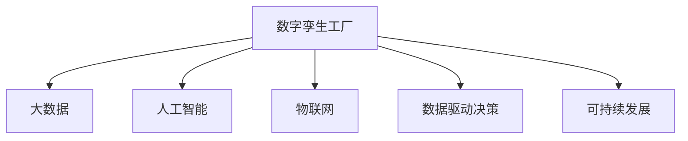

                 

# 数字孪生工厂创业：工业4.0的具体实践

> 关键词：数字孪生工厂, 工业4.0, 大数据, 人工智能, 物联网, 数据驱动决策, 可持续发展

## 1. 背景介绍

### 1.1 问题由来

随着第四次工业革命（Industrial 4.0）的到来，制造业正面临着前所未有的变革。物联网(IoT)、大数据、人工智能（AI）等新一代信息技术正在深刻改变传统制造业的生产方式和运营模式。传统的制造系统正逐渐向智能、协同、可视化的方向发展，进入"智能制造"新阶段。

在这一背景下，"数字孪生工厂"(Digital Twin Factory)成为工业4.0的新热点。它是一种全新的制造模式，通过构建工厂的虚拟数字模型，利用大数据和AI技术，实现对工厂全生命周期的可视化、分析和优化。借助数字孪生工厂，企业可以在不改变物理实体的情况下，实现对工厂运行状态的实时监控和预测，优化生产效率，提升产品质量，降低运营成本，实现可持续发展。

### 1.2 问题核心关键点

数字孪生工厂的核心在于通过构建物理工厂的数字模型，将物理系统和虚拟系统紧密结合，形成一个闭环反馈系统。关键要素包括：

1. **数据采集**：通过传感器、监控设备等手段，实时采集工厂各环节的数据，包括设备状态、生产过程、物流运输、质量检验等。
2. **数据建模**：利用大数据技术，对采集的数据进行建模，构建虚拟工厂的数字模型，实现对物理工厂的精确模拟。
3. **仿真分析**：通过AI技术对虚拟模型进行仿真分析，预测生产中的风险和瓶颈，优化生产流程。
4. **决策支持**：基于仿真分析结果，提供决策支持，指导生产调度、质量控制、资源配置等。
5. **可视化和监控**：通过可视化工具，实时展示工厂运行状态，监控关键参数，发现并解决问题。

这些关键要素共同构成了数字孪生工厂的完整体系，使制造过程变得更加透明、高效、可控。

### 1.3 问题研究意义

研究数字孪生工厂的创业实践，对于推动工业4.0技术落地，提升制造业的智能化水平，具有重要意义：

1. **提高生产效率**：通过实时监控和预测，数字孪生工厂可以优化生产流程，减少生产过程中的浪费和错误，提高整体效率。
2. **提升产品质量**：利用仿真分析，数字孪生工厂可以提前发现并纠正质量问题，提升产品合格率。
3. **降低运营成本**：通过优化资源配置和生产调度，数字孪生工厂能够减少能源消耗和设备维护成本，提升经济效益。
4. **支持可持续性**：数字孪生工厂能够实时监控环境影响，优化资源使用，减少对环境的负担，支持可持续发展目标。
5. **推动产业升级**：数字孪生工厂的技术和理念能够赋能传统制造业，推动其向智能化、自动化、个性化方向发展。

## 2. 核心概念与联系

### 2.1 核心概念概述

为更好地理解数字孪生工厂的创业实践，本节将介绍几个核心概念：

- **数字孪生工厂(Digital Twin Factory, DTF)**：一种通过数字化手段，构建工厂虚拟模型，实现对物理工厂运行状态的实时监控、预测和优化的新型制造模式。
- **大数据(Big Data)**：指传统数据处理技术难以处理的巨大、复杂、动态的数据集合，利用大数据技术可以发现数据中的隐藏模式和关联。
- **人工智能(Artificial Intelligence, AI)**：利用计算机模拟人类智能行为，通过机器学习、深度学习等技术实现自动化决策和智能操作。
- **物联网(Internet of Things, IoT)**：通过感知技术与互联网络的结合，实现物理实体与信息系统的深度融合，提供全面的数据采集和监控。
- **数据驱动决策(Data-Driven Decision Making)**：利用数据分析结果指导业务决策，提高决策的科学性和效率。
- **可持续发展(Sustainability)**：通过优化资源使用和生产流程，减少对环境的负面影响，实现长期可持续的制造过程。

这些核心概念之间的关系可以通过以下Mermaid流程图来展示：



这个流程图展示了大数字孪生工厂的各个组成部分及其相互关系：

1. 数字孪生工厂通过物联网采集大量生产数据，利用大数据技术进行建模。
2. 人工智能技术对虚拟模型进行仿真分析，提供决策支持。
3. 数据驱动决策指导生产调度、质量控制等具体运营活动。
4. 可持续发展理念贯穿整个生产过程，优化资源使用，减少环境影响。

这些概念共同构成了数字孪生工厂的核心框架，为其创业实践提供了理论基础。

## 3. 核心算法原理 & 具体操作步骤
### 3.1 算法原理概述

数字孪生工厂的核心算法原理主要包括以下几个方面：

1. **数据采集**：通过传感器、监控设备等手段，实时采集工厂各环节的数据，包括设备状态、生产过程、物流运输、质量检验等。
2. **数据建模**：利用大数据技术，对采集的数据进行建模，构建虚拟工厂的数字模型，实现对物理工厂的精确模拟。
3. **仿真分析**：通过AI技术对虚拟模型进行仿真分析，预测生产中的风险和瓶颈，优化生产流程。
4. **决策支持**：基于仿真分析结果，提供决策支持，指导生产调度、质量控制、资源配置等。
5. **可视化和监控**：通过可视化工具，实时展示工厂运行状态，监控关键参数，发现并解决问题。

这些算法原理构成了数字孪生工厂的核心运行机制，通过数据、模型、分析和可视化等技术手段，实现对制造过程的全方位监控和优化。

### 3.2 算法步骤详解

以下是数字孪生工厂的详细算法步骤：

1. **数据采集**：通过传感器、监控设备等手段，实时采集工厂各环节的数据，包括设备状态、生产过程、物流运输、质量检验等。
2. **数据清洗**：对采集的数据进行清洗，去除噪声和异常值，确保数据质量。
3. **数据建模**：利用大数据技术，对清洗后的数据进行建模，构建虚拟工厂的数字模型，实现对物理工厂的精确模拟。
4. **仿真分析**：通过AI技术对虚拟模型进行仿真分析，预测生产中的风险和瓶颈，优化生产流程。
5. **决策支持**：基于仿真分析结果，提供决策支持，指导生产调度、质量控制、资源配置等。
6. **可视化和监控**：通过可视化工具，实时展示工厂运行状态，监控关键参数，发现并解决问题。

这些步骤共同构成数字孪生工厂的完整实施流程，实现了对工厂全生命周期的可视化、分析和优化。

### 3.3 算法优缺点

数字孪生工厂的算法具有以下优点：

1. **高效率**：通过实时监控和预测，数字孪生工厂可以优化生产流程，减少生产过程中的浪费和错误，提高整体效率。
2. **高精度**：利用大数据和AI技术，数字孪生工厂可以实现对物理工厂的精确模拟，预测生产中的风险和瓶颈，优化生产流程。
3. **高可靠性**：数字孪生工厂通过可视化工具，实时展示工厂运行状态，监控关键参数，发现并解决问题，确保生产过程的可靠性。

同时，数字孪生工厂的算法也存在一些局限性：

1. **数据采集成本高**：传感器、监控设备等成本较高，大规模部署会增加初期投资。
2. **数据处理复杂**：大数据和AI技术对计算资源和数据存储要求高，需要复杂的算法和设备支持。
3. **技术门槛高**：数字孪生工厂涉及多学科知识，技术门槛较高，需要跨领域团队合作。
4. **数据隐私和安全问题**：生产数据的采集和存储涉及隐私和安全问题，需要采取严格的数据保护措施。

尽管存在这些局限性，数字孪生工厂作为一种先进的制造模式，仍然具有显著优势和广阔的应用前景。

### 3.4 算法应用领域

数字孪生工厂技术已经被广泛应用于多个领域，包括但不限于：

1. **智能制造**：通过实时监控和预测，优化生产流程，提升生产效率和质量。
2. **质量控制**：利用仿真分析，提前发现并纠正质量问题，提升产品合格率。
3. **设备维护**：通过监控设备状态，预测设备故障，提前进行维护，减少停机时间。
4. **资源优化**：优化资源配置和生产调度，减少能源消耗和设备维护成本。
5. **供应链管理**：实时监控物流运输状态，优化供应链管理，提高物流效率。
6. **环境监测**：监测环境影响，优化资源使用，支持可持续发展目标。

随着数字孪生工厂技术的不断成熟和普及，其在更多行业中的应用也将不断扩展。

## 4. 数学模型和公式 & 详细讲解 & 举例说明
### 4.1 数学模型构建

数字孪生工厂的数学模型主要包括以下几个组成部分：

1. **设备状态模型**：描述设备在生产过程中的状态，包括设备运行时间、温度、压力等。
2. **生产过程模型**：描述生产过程中各环节的逻辑关系和数据流动，包括物料进出、工艺参数等。
3. **质量控制模型**：描述产品质量的检测和反馈，包括质量指标、检验结果等。
4. **物流运输模型**：描述物料和设备的运输过程，包括运输路径、运输时间等。
5. **环境监测模型**：描述工厂生产对环境的影响，包括能源消耗、废水废气排放等。

这些模型可以采用时间序列、图结构、神经网络等方法进行建模，通过数学公式进行表达。

### 4.2 公式推导过程

以设备状态模型为例，假设设备状态可以用一维时间序列 $x(t)$ 描述，其中 $t$ 表示时间，$x(t)$ 表示设备在时间 $t$ 的状态。设备状态的变化可以表示为：

$$
x(t+\Delta t) = f(x(t), u(t), \theta)
$$

其中 $f$ 为状态转移函数，$u(t)$ 为控制信号，$\theta$ 为模型参数。

通过对采集到的设备状态数据进行时间序列分析，可以构建设备状态模型。常见的模型包括ARIMA模型、LSTM模型等。

以生产过程模型为例，假设生产过程可以表示为有向图 $G=(V,E)$，其中 $V$ 表示节点（工艺步骤），$E$ 表示边（物料流动、信息传递等）。生产过程的状态可以用 $x(t)$ 描述，控制信号 $u(t)$ 可以表示为：

$$
x(t+1) = g(x(t), u(t))
$$

其中 $g$ 为状态转移函数。通过对生产过程的实际数据进行图结构建模，可以构建生产过程模型。常见的模型包括Petri网、过程网络模型等。

### 4.3 案例分析与讲解

假设某工厂生产某产品，需要经过多个工艺步骤。通过对生产过程中各环节的数据进行采集和分析，可以构建生产过程模型，并对模型进行仿真分析，预测生产中的风险和瓶颈，优化生产流程。

具体而言，可以采用以下步骤：

1. **数据采集**：通过传感器、监控设备等手段，实时采集生产过程中的关键数据，包括物料温度、压力、质量指标等。
2. **数据清洗**：对采集的数据进行清洗，去除噪声和异常值，确保数据质量。
3. **数据建模**：利用生产过程的数据，构建有向图模型，描述各工艺步骤的逻辑关系和数据流动。
4. **仿真分析**：利用仿真软件或AI模型对生产过程进行仿真，预测生产中的风险和瓶颈，提出优化建议。
5. **决策支持**：根据仿真分析结果，优化生产调度、资源配置等，提升生产效率和产品质量。
6. **可视化和监控**：通过可视化工具，实时展示生产过程，监控关键参数，发现并解决问题。

## 5. 项目实践：代码实例和详细解释说明
### 5.1 开发环境搭建

在进行数字孪生工厂的开发实践前，我们需要准备好开发环境。以下是使用Python进行PyTorch开发的环境配置流程：

1. 安装Anaconda：从官网下载并安装Anaconda，用于创建独立的Python环境。

2. 创建并激活虚拟环境：
```bash
conda create -n dtf-env python=3.8 
conda activate dtf-env
```

3. 安装PyTorch：根据CUDA版本，从官网获取对应的安装命令。例如：
```bash
conda install pytorch torchvision torchaudio cudatoolkit=11.1 -c pytorch -c conda-forge
```

4. 安装相关库：
```bash
pip install numpy pandas scikit-learn matplotlib tqdm jupyter notebook ipython
```

完成上述步骤后，即可在`dtf-env`环境中开始项目实践。

### 5.2 源代码详细实现

下面以某工厂的数字孪生工厂项目为例，给出使用PyTorch进行生产过程建模的代码实现。

首先，定义设备状态模型：

```python
from torch import nn
import torch

class DeviceStateModel(nn.Module):
    def __init__(self, input_size, output_size, hidden_size=64):
        super(DeviceStateModel, self).__init__()
        self.rnn = nn.LSTM(input_size, hidden_size)
        self.fc = nn.Linear(hidden_size, output_size)
        
    def forward(self, x):
        out, _ = self.rnn(x)
        return self.fc(out)
```

然后，定义生产过程模型：

```python
from torch import nn
import torch

class ProductionProcessModel(nn.Module):
    def __init__(self, input_size, output_size, hidden_size=64):
        super(ProductionProcessModel, self).__init__()
        self.gru = nn.GRU(input_size, hidden_size)
        self.fc = nn.Linear(hidden_size, output_size)
        
    def forward(self, x, seq_lengths):
        out, _ = self.gru(x, seq_lengths)
        return self.fc(out)
```

接着，定义数据加载器：

```python
from torch.utils.data import DataLoader
from torchvision import datasets, transforms

# 定义数据加载器
batch_size = 32
train_dataset = ...
val_dataset = ...
test_dataset = ...
train_loader = DataLoader(train_dataset, batch_size=batch_size, shuffle=True)
val_loader = DataLoader(val_dataset, batch_size=batch_size, shuffle=False)
test_loader = DataLoader(test_dataset, batch_size=batch_size, shuffle=False)
```

最后，定义训练和评估函数：

```python
from torch import optim

# 定义模型和优化器
model = DeviceStateModel(input_size, output_size)
optimizer = optim.Adam(model.parameters(), lr=0.001)

# 定义训练函数
def train(model, train_loader, optimizer):
    model.train()
    total_loss = 0
    for batch_idx, (data, target) in enumerate(train_loader):
        data, target = data.to(device), target.to(device)
        optimizer.zero_grad()
        output = model(data)
        loss = loss_function(output, target)
        loss.backward()
        optimizer.step()
        total_loss += loss.item()
    return total_loss / len(train_loader)

# 定义评估函数
def evaluate(model, val_loader, loss_function):
    model.eval()
    total_loss = 0
    with torch.no_grad():
        for batch_idx, (data, target) in enumerate(val_loader):
            data, target = data.to(device), target.to(device)
            output = model(data)
            loss = loss_function(output, target)
            total_loss += loss.item()
    return total_loss / len(val_loader)
```

启动训练流程：

```python
epochs = 10
device = torch.device('cuda' if torch.cuda.is_available() else 'cpu')
model.to(device)

for epoch in range(epochs):
    train_loss = train(model, train_loader, optimizer)
    val_loss = evaluate(model, val_loader, loss_function)
    print(f"Epoch {epoch+1}, train loss: {train_loss:.4f}, val loss: {val_loss:.4f}")
```

以上就是使用PyTorch进行生产过程建模的完整代码实现。可以看到，利用PyTorch的强大封装，我们可以快速构建和训练数字孪生工厂的核心模型。

### 5.3 代码解读与分析

让我们再详细解读一下关键代码的实现细节：

**DeviceStateModel类**：
- `__init__`方法：初始化模型参数，包括RNN和全连接层。
- `forward`方法：定义前向传播过程，对输入数据进行处理，输出设备状态。

**ProductionProcessModel类**：
- `__init__`方法：初始化模型参数，包括GRU和全连接层。
- `forward`方法：定义前向传播过程，对输入数据进行处理，输出生产状态。

**DataLoader类**：
- 利用PyTorch的DataLoader，对数据进行批处理和加载，方便模型的训练和评估。

**train函数**：
- 在模型训练时，调用优化器更新模型参数，计算训练损失。
- 使用交叉熵损失函数计算损失，并进行反向传播。

**evaluate函数**：
- 在模型评估时，调用优化器更新模型参数，计算评估损失。
- 使用交叉熵损失函数计算损失，并打印评估结果。

**训练流程**：
- 定义总的epoch数和批大小，开始循环迭代
- 每个epoch内，先在训练集上训练，输出训练损失
- 在验证集上评估，输出验证损失
- 重复上述步骤直至收敛

## 6. 实际应用场景
### 6.1 智能制造

数字孪生工厂在智能制造中的应用，能够显著提升生产效率和产品质量，降低运营成本。通过实时监控和预测，数字孪生工厂可以优化生产流程，减少生产过程中的浪费和错误，提高整体效率。具体场景包括：

1. **生产调度优化**：通过实时监控生产设备和工艺状态，优化生产调度，避免生产瓶颈，提高生产效率。
2. **质量控制改进**：利用仿真分析，提前发现并纠正质量问题，提升产品合格率。
3. **设备维护预测**：通过监控设备状态，预测设备故障，提前进行维护，减少停机时间。

### 6.2 环境监测

数字孪生工厂的环境监测功能，能够实时监测生产过程对环境的影响，优化资源使用，支持可持续发展目标。具体场景包括：

1. **能源消耗优化**：监测生产过程的能源消耗，优化资源配置，减少能源浪费。
2. **废水废气监测**：实时监测生产过程中的废水废气排放，优化处理工艺，降低环境污染。
3. **废物回收利用**：通过优化生产流程，减少废弃物产生，提高资源利用率。

### 6.3 供应链管理

数字孪生工厂的供应链管理功能，能够优化物料和设备的管理，提高物流效率。具体场景包括：

1. **物料监控**：实时监控物料进出仓库状态，避免物料短缺或积压。
2. **运输调度**：优化运输路线和调度，减少运输时间和成本。
3. **供应商管理**：实时监测供应商的生产状态和供货情况，确保生产物料供应稳定。

### 6.4 未来应用展望

随着数字孪生工厂技术的不断成熟和普及，未来在更多领域中的应用也将不断扩展。数字孪生工厂技术能够推动传统制造业向智能化、自动化、个性化方向发展，为制造业带来革命性的变化。

在智慧城市、智能家居、智能交通等领域，数字孪生工厂技术同样具有广阔的应用前景。通过构建虚拟城市、家庭、交通工具等模型，数字孪生工厂能够实现对城市的全方位监控和优化，提高城市管理效率，提升居民生活品质。

## 7. 工具和资源推荐
### 7.1 学习资源推荐

为了帮助开发者系统掌握数字孪生工厂的理论基础和实践技巧，这里推荐一些优质的学习资源：

1. 《工业4.0与智能制造》系列博文：由专家撰写，深入浅出地介绍了工业4.0的概念、技术框架和典型应用。

2. 《Python深度学习》课程：由深度学习领域的知名专家开设的在线课程，涵盖深度学习的基础和高级内容，适合初学者和进阶学习者。

3. 《数字孪生工厂：智能制造的实践》书籍：全面介绍了数字孪生工厂的理论基础和实践案例，适合技术从业人员和研究者阅读。

4. 《Big Data for Smart Manufacturing》论文：研究利用大数据技术优化生产过程的最新进展，具有较高的学术价值和实际应用参考价值。

5. 《The Digital Twin Factory: A Path to Smart Manufacturing》报告：由知名咨询公司发布，详细分析了数字孪生工厂的典型应用和未来趋势，具有较高的行业参考价值。

通过对这些资源的学习实践，相信你一定能够快速掌握数字孪生工厂的核心技术和应用方法，并用于解决实际的制造问题。

### 7.2 开发工具推荐

高效的开发离不开优秀的工具支持。以下是几款用于数字孪生工厂开发的常用工具：

1. PyTorch：基于Python的开源深度学习框架，灵活动态的计算图，适合快速迭代研究。

2. TensorFlow：由Google主导开发的开源深度学习框架，生产部署方便，适合大规模工程应用。

3. Hadoop和Spark：大数据处理和分布式计算框架，支持大规模数据存储和处理。

4. Tableau和Power BI：数据可视化工具，用于展示工厂运行状态和监控关键参数。

5. Elasticsearch：分布式搜索和分析引擎，支持实时数据索引和查询。

合理利用这些工具，可以显著提升数字孪生工厂的开发效率，加快创新迭代的步伐。

### 7.3 相关论文推荐

数字孪生工厂技术的发展源于学界的持续研究。以下是几篇奠基性的相关论文，推荐阅读：

1. "Digital Twins: Unifying Virtual and Physical Worlds"：介绍了数字孪生工厂的概念、实现方法和应用场景，具有较高的学术价值。

2. "Big Data Analytics for Smart Manufacturing"：研究利用大数据技术优化生产过程的最新进展，具有较高的学术价值和实际应用参考价值。

3. "Model-Based Diagnosis and Prognosis for Complex Engineering Systems"：研究如何利用数字孪生技术实现复杂工程系统的故障诊断和预测，具有较高的理论价值。

4. "Real-Time Manufacturing Analytics with IoT and Cloud Computing"：研究如何利用物联网和云计算技术实现实时生产过程监控和优化，具有较高的应用价值。

5. "The Role of Digital Twins in Smart Manufacturing"：介绍数字孪生技术在智能制造中的作用和应用，具有较高的行业参考价值。

这些论文代表了大数字孪生工厂技术的发展脉络。通过学习这些前沿成果，可以帮助研究者把握学科前进方向，激发更多的创新灵感。

## 8. 总结：未来发展趋势与挑战
### 8.1 总结

本文对数字孪生工厂的创业实践进行了全面系统的介绍。首先阐述了数字孪生工厂的概念、理论基础和应用场景，明确了其在工业4.0技术落地、智能制造发展中的重要地位。其次，从原理到实践，详细讲解了数字孪生工厂的算法原理和操作步骤，给出了微调技术的完整代码实例。最后，本文探讨了数字孪生工厂的未来发展趋势和面临的挑战，提供了一些有用的建议和方向。

通过本文的系统梳理，可以看到，数字孪生工厂技术正在成为制造业智能化、自动化、个性化发展的重要推动力，能够有效提升生产效率和产品质量，降低运营成本，支持可持续发展目标。未来，随着技术的不断成熟和普及，数字孪生工厂必将在更多行业得到应用，为人类社会的生产和生活带来深远影响。

### 8.2 未来发展趋势

展望未来，数字孪生工厂技术将呈现以下几个发展趋势：

1. **技术融合与创新**：数字孪生工厂将与其他先进技术如5G、区块链、人工智能等进行深度融合，推动工业4.0技术向更高级别发展。
2. **多领域应用扩展**：数字孪生工厂技术将不仅仅应用于制造业，还将拓展到智慧城市、智能家居、智能交通等领域，带来更多创新应用。
3. **数据驱动决策**：数字孪生工厂将更加注重数据驱动的决策支持，通过大数据和AI技术优化生产流程，提升运营效率。
4. **可持续发展**：数字孪生工厂将更加注重环境保护和资源优化，支持可持续发展的目标。
5. **模型互联互通**：数字孪生工厂将实现不同设备和系统的互联互通，构建更完善的工业互联网生态。

这些趋势凸显了数字孪生工厂技术的广阔前景，预示着其在未来的重要地位和巨大潜力。

### 8.3 面临的挑战

尽管数字孪生工厂技术已经取得了一定的进展，但在实际应用过程中，仍然面临着一些挑战：

1. **技术复杂度高**：数字孪生工厂涉及多学科知识，技术门槛高，需要跨领域团队合作。
2. **数据隐私和安全问题**：生产数据的采集和存储涉及隐私和安全问题，需要采取严格的数据保护措施。
3. **数据处理能力不足**：大数据和AI技术对计算资源和数据存储要求高，需要高效的算法和设备支持。
4. **标准化和互操作性问题**：不同设备和系统的标准化和互操作性问题，仍需进一步研究和解决。
5. **人才培养和技能提升**：需要大量具备跨学科知识和技能的人才，现有的教育体系和人才培养模式需进一步优化。

尽管存在这些挑战，数字孪生工厂技术的未来前景仍然非常广阔。相信随着技术的不断发展和成熟，相关挑战将逐步得到解决，数字孪生工厂必将在更多领域得到广泛应用。

### 8.4 研究展望

面对数字孪生工厂技术面临的挑战，未来的研究需要在以下几个方面寻求新的突破：

1. **跨学科合作**：加强跨学科的合作与交流，推动数字孪生工厂技术向更广泛的领域发展。
2. **标准化和互操作性**：推动工业互联网标准化，实现不同设备和系统的互联互通。
3. **数据隐私和安全**：研究数据隐私保护和安全的解决方案，保障生产数据的安全存储和传输。
4. **高效的数据处理**：研究高效的数据处理算法和设备，提高大数据和AI的计算效率。
5. **模型优化与集成**：研究多模型的优化与集成方法，提升数字孪生工厂的决策能力和预测精度。

这些研究方向的探索，必将引领数字孪生工厂技术迈向更高的台阶，为智能制造和可持续发展目标的实现提供强有力的技术支撑。面向未来，数字孪生工厂技术还需要与其他人工智能技术进行更深入的融合，协同发力，共同推动自然语言理解和智能交互系统的进步。只有勇于创新、敢于突破，才能不断拓展数字孪生工厂的边界，让智能技术更好地造福人类社会。

## 9. 附录：常见问题与解答

**Q1：什么是数字孪生工厂？**

A: 数字孪生工厂是一种通过数字化手段，构建工厂虚拟模型，实现对物理工厂运行状态的实时监控、预测和优化的新型制造模式。

**Q2：数字孪生工厂的构建需要哪些关键步骤？**

A: 数字孪生工厂的构建需要以下关键步骤：
1. 数据采集：通过传感器、监控设备等手段，实时采集工厂各环节的数据。
2. 数据建模：利用大数据技术，对采集的数据进行建模，构建虚拟工厂的数字模型。
3. 仿真分析：通过AI技术对虚拟模型进行仿真分析，预测生产中的风险和瓶颈，优化生产流程。
4. 决策支持：基于仿真分析结果，提供决策支持，指导生产调度、质量控制、资源配置等。
5. 可视化和监控：通过可视化工具，实时展示工厂运行状态，监控关键参数，发现并解决问题。

**Q3：数字孪生工厂面临哪些技术挑战？**

A: 数字孪生工厂面临的技术挑战包括：
1. 技术复杂度高：涉及多学科知识，技术门槛高，需要跨领域团队合作。
2. 数据隐私和安全问题：生产数据的采集和存储涉及隐私和安全问题，需要采取严格的数据保护措施。
3. 数据处理能力不足：大数据和AI技术对计算资源和数据存储要求高，需要高效的算法和设备支持。
4. 标准化和互操作性问题：不同设备和系统的标准化和互操作性问题，仍需进一步研究和解决。
5. 人才培养和技能提升：需要大量具备跨学科知识和技能的人才，现有的教育体系和人才培养模式需进一步优化。

尽管存在这些挑战，数字孪生工厂技术的未来前景仍然非常广阔，相信随着技术的不断发展和成熟，相关挑战将逐步得到解决。

