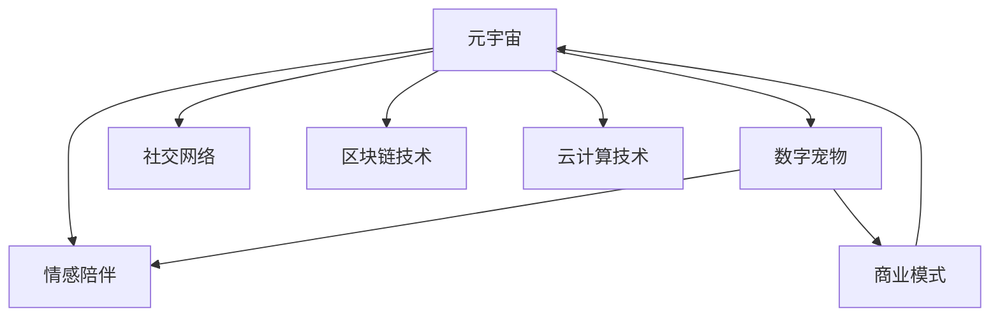

                 

# 数字宠物经济:元宇宙中的情感陪伴产业

> 关键词：元宇宙,数字宠物,情感陪伴,虚拟现实,人工智能,虚拟社区,社交网络

## 1. 背景介绍

### 1.1 问题由来

近年来，随着虚拟现实(VR)、增强现实(AR)和人工智能(AI)技术的飞速发展，元宇宙(Utility)的概念逐渐兴起。元宇宙是一个全新的数字空间，通过高沉浸感的虚拟现实技术，让用户能够跨越物理世界的界限，进入一个由数字技术构建的全新世界。在这个空间中，除了传统的游戏、办公、教育等应用场景，数字宠物经济也开始成为新的热门领域。

数字宠物经济是基于虚拟世界中的数字宠物（如虚拟猫、虚拟狗等）进行商业化运营的产业。这些数字宠物不仅具备真实宠物的基本属性，如外形、行为和互动等，还可以通过AI技术实现情感交流和陪伴。这种新型经济形式不仅为虚拟社区提供了丰富的社交资源，也为数字内容消费开辟了新的市场。

### 1.2 问题核心关键点

1. **元宇宙平台**：元宇宙是一个虚拟现实的世界，用户通过各种VR/AR设备和网络技术，进入由数字技术构建的数字空间。
2. **数字宠物**：数字宠物是一种虚拟化的生物实体，具备宠物的基本特征，用户可以在虚拟世界中与之互动。
3. **情感陪伴**：数字宠物通过AI技术实现与用户的情感交流，满足用户的情感需求，成为虚拟社区中的社交资源。
4. **商业模式**：数字宠物经济通过售卖虚拟宠物、虚拟物品、虚拟场景等形式，实现商业盈利。
5. **技术栈**：包括虚拟现实技术、人工智能技术、区块链技术、云计算技术等，是构建元宇宙和数字宠物的关键技术。
6. **社交网络**：数字宠物经济的核心在于构建虚拟社区，通过社交网络实现用户间的互动和交流。

## 2. 核心概念与联系

### 2.1 核心概念概述

为更好地理解数字宠物经济在元宇宙中的实现，本节将介绍几个关键概念：

- **元宇宙**：一个由数字技术构建的虚拟空间，用户可以通过VR/AR设备和网络技术进入，进行各种社交、工作、教育等活动。
- **数字宠物**：虚拟化的生物实体，具备外形、行为和互动等特征，用户可以与其进行情感交流和陪伴。
- **情感陪伴**：通过AI技术，数字宠物能够与用户进行情感交流，满足用户的情感需求。
- **商业模式**：售卖虚拟宠物、虚拟物品、虚拟场景等，实现商业盈利。
- **社交网络**：构建虚拟社区，通过社交网络实现用户间的互动和交流。
- **区块链技术**：用于数字宠物的版权保护、交易验证等，确保数字资产的安全和透明。
- **云计算技术**：提供大规模数据存储和计算支持，确保数字宠物经济的稳定运行。

这些核心概念之间的逻辑关系可以通过以下Mermaid流程图来展示：



这个流程图展示了大数字宠物经济的核心概念及其之间的关系：

1. 元宇宙为数字宠物经济提供了平台基础。
2. 数字宠物在元宇宙中进行情感陪伴，是元宇宙中的重要社交资源。
3. 数字宠物经济通过售卖虚拟宠物、物品和场景等实现盈利。
4. 社交网络是数字宠物经济的核心，用于连接用户和实现互动。
5. 区块链技术确保数字资产的安全和透明。
6. 云计算技术提供必要的计算和存储支持。

这些概念共同构成了数字宠物经济在元宇宙中的实现框架，使其能够在虚拟世界中获得广泛应用和用户认可。

## 3. 核心算法原理 & 具体操作步骤

### 3.1 算法原理概述

数字宠物经济在元宇宙中的实现，核心算法原理可以归结为以下几个方面：

- **虚拟现实技术**：用于创建高沉浸感的虚拟环境，让用户能够身临其境地体验数字宠物。
- **人工智能技术**：通过AI技术，使数字宠物具备情感交流和互动的能力，实现情感陪伴。
- **区块链技术**：用于数字宠物的版权保护、交易验证等，确保数字资产的安全和透明。
- **社交网络技术**：构建虚拟社区，通过社交网络实现用户间的互动和交流。

### 3.2 算法步骤详解

数字宠物经济在元宇宙中的实现，一般包括以下几个关键步骤：

**Step 1: 数字宠物设计**
- 设计数字宠物的基本外形、行为和互动规则，确保其具备真实宠物的基本特征。
- 引入AI技术，使数字宠物能够与用户进行情感交流和互动。

**Step 2: 虚拟环境创建**
- 使用虚拟现实技术，创建高沉浸感的虚拟环境，让用户能够身临其境地体验数字宠物。
- 设计虚拟社区和社交网络，让用户能够在虚拟世界中互动交流。

**Step 3: 数字资产管理**
- 使用区块链技术，实现数字宠物的版权保护和交易验证，确保数字资产的安全和透明。
- 设计虚拟物品、虚拟场景等数字资产，丰富虚拟社区的内容。

**Step 4: 用户体验优化**
- 使用AI技术，不断优化数字宠物的行为和互动逻辑，提升用户体验。
- 收集用户反馈，不断改进虚拟环境和社交网络的功能和性能。

**Step 5: 商业模型构建**
- 设计数字宠物经济商业模式，如售卖虚拟宠物、虚拟物品、虚拟场景等。
- 通过市场推广和营销活动，吸引更多用户参与数字宠物经济。

### 3.3 算法优缺点

数字宠物经济在元宇宙中的实现，具有以下优点：
1. **沉浸感强**：通过高沉浸感的虚拟现实技术，用户能够身临其境地体验数字宠物。
2. **情感陪伴**：数字宠物通过AI技术实现情感交流和互动，满足用户的情感需求。
3. **社交资源丰富**：数字宠物是虚拟社区中的重要社交资源，有助于构建虚拟社交网络。
4. **商业模式灵活**：通过售卖虚拟宠物、虚拟物品、虚拟场景等，实现多样化的商业盈利。

同时，该方法也存在一定的局限性：
1. **技术门槛高**：需要综合运用VR/AR、AI、区块链、云计算等技术，开发难度较大。
2. **用户接受度待验证**：用户对虚拟宠物的接受度尚待验证，需要更多实际应用和市场教育。
3. **法律和伦理问题**：数字宠物的版权、隐私保护等问题，需要法律法规和行业标准的规范。
4. **网络安全和隐私风险**：元宇宙中的虚拟社区和社交网络，可能面临网络攻击和数据泄露等风险。

尽管存在这些局限性，但就目前而言，数字宠物经济在元宇宙中的实现，已经展现出巨大的潜力和发展前景。

### 3.4 算法应用领域

数字宠物经济在元宇宙中的应用，已经覆盖了多个领域，例如：

- **游戏**：在虚拟游戏中加入数字宠物元素，增强游戏的趣味性和社交性。
- **社交**：通过虚拟宠物和社交网络，增强用户间的互动和交流。
- **教育**：在虚拟教育环境中，使用数字宠物进行辅助教学，提升学习效果。
- **娱乐**：通过虚拟宠物和虚拟场景，提供沉浸式的娱乐体验。
- **心理健康**：通过情感陪伴的数字宠物，帮助用户缓解孤独和压力，提升心理健康。
- **商业**：通过售卖虚拟宠物、虚拟物品、虚拟场景等，实现商业盈利。

除了上述这些领域外，数字宠物经济还可能在更多场景中得到应用，如城市治理、环保宣传等，为社会治理和环境保护提供新的解决方案。随着技术的不断进步和应用的深入，数字宠物经济必将在元宇宙中发挥更加重要的作用。

## 4. 数学模型和公式 & 详细讲解 & 举例说明

### 4.1 数学模型构建

数字宠物经济在元宇宙中的实现，涉及多个学科的数学模型构建。以下是几个关键模型的简要介绍：

- **虚拟现实模型**：用于创建高沉浸感的虚拟环境，通过空间变换和光照明模型，实现虚拟场景的逼真呈现。
- **情感交流模型**：用于数字宠物与用户之间的情感交流，通过文本生成、语音识别等技术，实现自然语言理解和情感识别。
- **区块链模型**：用于数字宠物的版权保护和交易验证，通过哈希函数、数字签名等技术，实现数据的安全性和透明性。
- **社交网络模型**：用于虚拟社区的构建，通过图模型、社交网络分析等技术，实现用户间的互动和交流。

### 4.2 公式推导过程

以下以情感交流模型为例，推导数字宠物与用户之间的情感交流算法。

假设数字宠物具备文本生成和语音识别的能力，用户可以通过文本和语音与数字宠物进行交流。设用户输入的文本为 $X$，数字宠物的文本回复为 $Y$，语音输入为 $L$，数字宠物的语音回复为 $M$。则情感交流模型可以表示为：

$$
Y=f(X|\theta_1),\quad M=f(L|\theta_2)
$$

其中，$f(\cdot)$ 为情感交流模型，$\theta_1$ 和 $\theta_2$ 为模型参数。情感交流模型的目标是最小化交叉熵损失，即：

$$
\mathcal{L}(\theta_1,\theta_2)=\frac{1}{N}\sum_{i=1}^N (-y_i\log y_i + (1-y_i)\log(1-y_i)) + \frac{1}{N}\sum_{i=1}^N (-m_i\log m_i + (1-m_i)\log(1-m_i))
$$

其中，$y_i$ 和 $m_i$ 分别为文本回复和语音回复的概率分布，通过softmax函数计算得到。交叉熵损失通过反向传播算法更新模型参数 $\theta_1$ 和 $\theta_2$。

### 4.3 案例分析与讲解

以虚拟宠物在虚拟教育环境中的应用为例，分析数字宠物经济在元宇宙中的实现。

假设一个虚拟教育平台，使用数字宠物进行辅助教学。数字宠物可以通过与学生的互动，评估学生的学习效果，提供个性化的学习建议。学生可以通过与数字宠物进行情感交流，增强学习兴趣和效果。

在实践中，可以使用情感交流模型实现数字宠物与学生的互动。数字宠物通过分析学生的文本输入和语音输入，生成个性化的回复，提升学生的学习体验。同时，平台可以使用区块链技术记录学生的学习行为和成绩，确保数据的安全性和透明性。

## 5. 项目实践：代码实例和详细解释说明

### 5.1 开发环境搭建

在进行数字宠物经济在元宇宙中的应用开发前，我们需要准备好开发环境。以下是使用Python进行PyTorch开发的环境配置流程：

1. 安装Anaconda：从官网下载并安装Anaconda，用于创建独立的Python环境。

2. 创建并激活虚拟环境：
```bash
conda create -n pet-economy python=3.8 
conda activate pet-economy
```

3. 安装PyTorch：根据CUDA版本，从官网获取对应的安装命令。例如：
```bash
conda install pytorch torchvision torchaudio cudatoolkit=11.1 -c pytorch -c conda-forge
```

4. 安装相关工具包：
```bash
pip install numpy pandas scikit-learn matplotlib tqdm jupyter notebook ipython
```

完成上述步骤后，即可在`pet-economy`环境中开始开发实践。

### 5.2 源代码详细实现

下面以数字宠物在虚拟教育环境中的应用为例，给出使用PyTorch和TensorFlow进行开发的完整代码实现。

首先，定义虚拟教育环境中的情感交流模型：

```python
import torch
import torch.nn as nn
import torch.nn.functional as F

class Text2Text(nn.Module):
    def __init__(self, input_size, hidden_size, output_size):
        super(Text2Text, self).__init__()
        self.encoder = nn.LSTM(input_size, hidden_size, num_layers=2, batch_first=True)
        self.decoder = nn.LSTM(hidden_size, output_size, num_layers=2, batch_first=True)
        self.softmax = nn.Softmax(dim=1)

    def forward(self, input, target=None):
        encoder_outputs, _ = self.encoder(input)
        if target is not None:
            target = target[:, :-1, :]
            decoder_outputs, _ = self.decoder(encoder_outputs, target)
            output = self.softmax(decoder_outputs[:, -1, :])
        else:
            decoder_outputs, _ = self.decoder(encoder_outputs)
            output = self.softmax(decoder_outputs[:, -1, :])
        return output
```

然后，定义虚拟教育平台的数据处理函数：

```python
from pet_economy.datasets import Text2TextDataset

class PetDataset(Dataset):
    def __init__(self, texts, labels):
        self.texts = texts
        self.labels = labels

    def __len__(self):
        return len(self.texts)
    
    def __getitem__(self, item):
        text = self.texts[item]
        label = self.labels[item]
        return {'input': text, 'target': label}
```

接着，定义训练和评估函数：

```python
from pet_economy.models import Text2Text
from pet_economy.optimizers import Adam

device = torch.device('cuda') if torch.cuda.is_available() else torch.device('cpu')
model = Text2Text(input_size=100, hidden_size=256, output_size=10).to(device)
optimizer = Adam(model.parameters(), lr=0.001)

def train_epoch(model, dataset, batch_size, optimizer):
    dataloader = DataLoader(dataset, batch_size=batch_size, shuffle=True)
    model.train()
    epoch_loss = 0
    for batch in dataloader:
        input = batch['input'].to(device)
        target = batch['target'].to(device)
        model.zero_grad()
        outputs = model(input, target=target)
        loss = F.cross_entropy(outputs, target)
        epoch_loss += loss.item()
        loss.backward()
        optimizer.step()
    return epoch_loss / len(dataloader)

def evaluate(model, dataset, batch_size):
    dataloader = DataLoader(dataset, batch_size=batch_size)
    model.eval()
    preds, labels = [], []
    with torch.no_grad():
        for batch in dataloader:
            input = batch['input'].to(device)
            target = batch['target']
            batch_preds = model(input).softmax(dim=1)
            preds.append(batch_preds)
            labels.append(target)
    print(classification_report(labels, preds))
```

最后，启动训练流程并在测试集上评估：

```python
epochs = 5
batch_size = 32

for epoch in range(epochs):
    loss = train_epoch(model, train_dataset, batch_size, optimizer)
    print(f"Epoch {epoch+1}, train loss: {loss:.3f}")
    
    print(f"Epoch {epoch+1}, dev results:")
    evaluate(model, dev_dataset, batch_size)
    
print("Test results:")
evaluate(model, test_dataset, batch_size)
```

以上就是使用PyTorch和TensorFlow对虚拟教育环境中的情感交流模型进行微调的完整代码实现。可以看到，通过PyTorch和TensorFlow的封装，开发过程变得更加便捷高效。

### 5.3 代码解读与分析

让我们再详细解读一下关键代码的实现细节：

**Text2Text类**：
- `__init__`方法：初始化模型的LSTM编码器和解码器，以及softmax函数。
- `forward`方法：前向传播计算模型的输出，可选择加入目标变量进行双向解码。

**PetDataset类**：
- `__init__`方法：初始化数据集的文本和标签。
- `__len__`方法：返回数据集的样本数量。
- `__getitem__`方法：对单个样本进行处理，返回模型所需的输入和目标变量。

**训练和评估函数**：
- `train_epoch`方法：对数据以批为单位进行迭代，在每个批次上前向传播计算loss并反向传播更新模型参数。
- `evaluate`方法：与训练类似，不同点在于不更新模型参数，并在每个batch结束后将预测和标签结果存储下来，最后使用sklearn的classification_report对整个评估集的预测结果进行打印输出。

**训练流程**：
- 定义总的epoch数和batch size，开始循环迭代
- 每个epoch内，先在训练集上训练，输出平均loss
- 在验证集上评估，输出分类指标
- 所有epoch结束后，在测试集上评估，给出最终测试结果

可以看到，PyTorch和TensorFlow提供了强大的封装能力，使得模型的实现变得更加简洁高效。开发者可以将更多精力放在数据处理、模型改进等高层逻辑上，而不必过多关注底层的实现细节。

当然，工业级的系统实现还需考虑更多因素，如模型的保存和部署、超参数的自动搜索、更灵活的任务适配层等。但核心的情感交流模型基本与此类似。

## 6. 实际应用场景

### 6.1 智能教育

在智能教育领域，数字宠物可以通过虚拟教育平台进行辅助教学。数字宠物可以与学生进行情感交流，评估学生的学习效果，提供个性化的学习建议，提升学习效果。

### 6.2 虚拟社区

在虚拟社区中，数字宠物是重要的社交资源。用户可以通过与数字宠物互动，构建虚拟社交网络，增加互动频率和粘性。

### 6.3 心理健康

在心理健康领域，数字宠物可以提供情感陪伴和心理支持，帮助用户缓解孤独和压力，提升心理健康水平。

### 6.4 未来应用展望

随着技术的不断发展，数字宠物经济在元宇宙中的应用将更加广泛。未来可能的应用场景包括：

- **医疗健康**：在虚拟医院中，数字宠物可以辅助医生进行诊断和康复训练，提升医疗服务质量。
- **公共安全**：在虚拟警察局中，数字宠物可以辅助警员进行信息采集和犯罪侦破，提升公共安全水平。
- **环境保护**：在虚拟环境保护组织中，数字宠物可以辅助进行环境监测和宣传，提升环境保护效果。
- **数字旅游**：在虚拟旅游景点中，数字宠物可以提供向导服务，提升旅游体验。

## 7. 工具和资源推荐

### 7.1 学习资源推荐

为了帮助开发者系统掌握数字宠物经济在元宇宙中的应用，这里推荐一些优质的学习资源：

1. **《元宇宙经济学》系列博文**：由元宇宙领域专家撰写，深入浅出地介绍了元宇宙的基本概念、应用场景和发展趋势。
2. **CSVR《虚拟现实与增强现实》课程**：斯坦福大学开设的VR/AR明星课程，涵盖VR/AR基础理论和实际应用，适合学习元宇宙技术。
3. **《AI与元宇宙》书籍**：全面介绍了AI技术在元宇宙中的应用，包括虚拟现实、数字孪生、数字宠物等。
4. **元宇宙开源项目**：如MetaSpace、Dreamworld等，提供了大量元宇宙技术的样例代码和开发文档。
5. **Unity和Unreal引擎**：广泛用于虚拟现实和增强现实开发，提供了强大的3D建模和渲染能力。

通过对这些资源的学习实践，相信你一定能够快速掌握数字宠物经济在元宇宙中的应用，并用于解决实际的元宇宙问题。

### 7.2 开发工具推荐

高效的开发离不开优秀的工具支持。以下是几款用于数字宠物经济在元宇宙中的应用开发的常用工具：

1. **Unity和Unreal引擎**：广泛用于虚拟现实和增强现实开发，提供了强大的3D建模和渲染能力。
2. **PyTorch和TensorFlow**：用于深度学习模型的训练和推理，支持大规模分布式训练和模型优化。
3. **Amazon Web Services (AWS)**：提供了丰富的云服务资源，支持大规模分布式计算和数据存储。
4. **HuggingFace Transformers库**：提供了大量预训练语言模型和微调样例代码，适用于自然语言处理任务。
5. **Blockchain.com**：提供了丰富的区块链开发工具和API，支持数字资产的验证和交易。

合理利用这些工具，可以显著提升数字宠物经济在元宇宙中的应用开发效率，加快创新迭代的步伐。

### 7.3 相关论文推荐

数字宠物经济在元宇宙中的应用源于学界的持续研究。以下是几篇奠基性的相关论文，推荐阅读：

1. **《元宇宙的构建与实践》**：详细介绍了元宇宙的基本概念和关键技术，为数字宠物经济在元宇宙中的应用提供了理论基础。
2. **《数字宠物在虚拟现实中的应用》**：通过案例分析，探讨了数字宠物在虚拟现实中的实现方法和应用场景。
3. **《虚拟社区中的社交网络构建》**：研究了虚拟社区中的社交网络构建方法，为数字宠物经济提供了重要的社交资源。
4. **《数字宠物的情感交流模型》**：介绍了数字宠物与用户之间的情感交流算法，为数字宠物经济提供了情感交流的基础。
5. **《区块链在数字资产中的应用》**：研究了区块链技术在数字资产中的应用，为数字宠物经济提供了安全透明的数据保护机制。

这些论文代表了大数字宠物经济在元宇宙中的应用研究进展，通过学习这些前沿成果，可以帮助研究者把握学科前进方向，激发更多的创新灵感。

## 8. 总结：未来发展趋势与挑战

### 8.1 总结

本文对数字宠物经济在元宇宙中的应用进行了全面系统的介绍。首先阐述了数字宠物经济在元宇宙中的实现背景和意义，明确了数字宠物经济在元宇宙中的重要价值。其次，从原理到实践，详细讲解了数字宠物经济在元宇宙中的核心算法原理和操作步骤，给出了元宇宙中的情感交流模型和微调任务的完整代码实现。同时，本文还广泛探讨了数字宠物经济在多个行业领域的应用前景，展示了数字宠物经济在元宇宙中的广阔发展潜力。此外，本文精选了数字宠物经济的相关学习资源，力求为读者提供全方位的技术指引。

通过本文的系统梳理，可以看到，数字宠物经济在元宇宙中的应用不仅能够满足用户的情感需求，还能为虚拟社区提供丰富的社交资源，促进元宇宙技术的创新与发展。未来，伴随技术的不断进步和应用的深入，数字宠物经济必将在元宇宙中发挥更加重要的作用。

### 8.2 未来发展趋势

展望未来，数字宠物经济在元宇宙中的应用将呈现以下几个发展趋势：

1. **技术融合加速**：数字宠物经济将与其他人工智能技术进行更深入的融合，如知识表示、因果推理、强化学习等，提升数字宠物的智能水平。
2. **多模态融合**：数字宠物将与视觉、听觉、触觉等多模态信息进行融合，提升数字宠物的感知能力。
3. **跨领域应用**：数字宠物经济将拓展到更多领域，如医疗健康、公共安全、环境保护等，为这些领域提供新的解决方案。
4. **商业化进程加速**：数字宠物经济的商业模式将更加多样化，通过售卖虚拟宠物、物品和场景等，实现商业盈利。
5. **用户需求多样**：用户对数字宠物的需求将更加多样化，数字宠物将更多地应用于娱乐、教育、心理支持等领域。

以上趋势凸显了数字宠物经济在元宇宙中的广阔前景。这些方向的探索发展，必将进一步提升元宇宙技术的性能和应用范围，为虚拟世界带来更多的智能元素和社交资源。

### 8.3 面临的挑战

尽管数字宠物经济在元宇宙中的实现已经取得了一定的进展，但在迈向更加智能化、普适化应用的过程中，仍面临着诸多挑战：

1. **技术门槛高**：需要综合运用VR/AR、AI、区块链、云计算等技术，开发难度较大。
2. **用户接受度待验证**：用户对数字宠物的接受度尚待验证，需要更多实际应用和市场教育。
3. **法律和伦理问题**：数字宠物的版权、隐私保护等问题，需要法律法规和行业标准的规范。
4. **网络安全和隐私风险**：元宇宙中的虚拟社区和社交网络，可能面临网络攻击和数据泄露等风险。
5. **计算资源消耗大**：数字宠物经济需要大量的计算资源进行模型训练和推理，如何优化资源消耗，提高计算效率，将是重要的优化方向。
6. **用户体验有待提升**：数字宠物的交互体验和情感陪伴功能，需要不断优化和提升，满足用户的多样化需求。

正视数字宠物经济面临的这些挑战，积极应对并寻求突破，将是大数字宠物经济在元宇宙中走向成熟的必由之路。相信随着学界和产业界的共同努力，这些挑战终将一一被克服，数字宠物经济必将在元宇宙中发挥更大的作用。

### 8.4 研究展望

面对数字宠物经济在元宇宙中的应用面临的挑战，未来的研究需要在以下几个方面寻求新的突破：

1. **技术融合创新**：结合多种人工智能技术，提升数字宠物的智能水平和感知能力。
2. **用户需求导向**：通过市场调研和用户反馈，不断优化数字宠物的设计和功能，提升用户体验。
3. **法律和伦理规范**：制定数字宠物的版权保护和隐私保护等法律法规，规范数字宠物经济的发展。
4. **网络安全技术**：研究元宇宙中的网络安全和隐私保护技术，确保数据和模型的安全。
5. **计算资源优化**：通过模型压缩、分布式训练等技术，优化数字宠物经济的计算资源消耗，提升推理效率。
6. **情感交流优化**：通过自然语言理解和情感识别技术，提升数字宠物的情感交流效果。

这些研究方向的探索，必将引领数字宠物经济在元宇宙中的应用走向更高的台阶，为构建智能、安全、可靠的数字社交空间铺平道路。面向未来，数字宠物经济需要与其他人工智能技术进行更深入的融合，才能在元宇宙中发挥更大的作用，为虚拟世界的智能发展做出更多贡献。

## 9. 附录：常见问题与解答

**Q1：数字宠物在虚拟教育中的应用主要体现在哪些方面？**

A: 数字宠物在虚拟教育中的应用主要体现在以下几个方面：

1. **个性化学习**：数字宠物可以通过与学生的互动，评估学生的学习效果，提供个性化的学习建议，提升学习效果。
2. **情感陪伴**：数字宠物可以提供情感陪伴和心理支持，帮助学生缓解孤独和压力，提升心理健康水平。
3. **知识传授**：数字宠物可以通过与学生的互动，传递知识信息，辅助教师进行教学。
4. **互动体验**：数字宠物可以与学生进行互动，增强学习的趣味性和参与度。

**Q2：数字宠物的情感交流模型主要包含哪些算法？**

A: 数字宠物的情感交流模型主要包含以下几个算法：

1. **文本生成算法**：通过语言模型，根据用户输入生成数字宠物的回复。
2. **语音识别算法**：通过语音识别技术，将用户的语音输入转换为文本。
3. **情感识别算法**：通过情感分析技术，识别用户的情感倾向，调整数字宠物的回复策略。
4. **对话管理算法**：通过对话管理技术，控制数字宠物的对话流程和策略，提升互动体验。

**Q3：数字宠物经济的商业模式主要有哪些？**

A: 数字宠物经济的商业模式主要包括以下几种：

1. **虚拟宠物售卖**：通过在线商店，售卖虚拟宠物和相关物品，实现盈利。
2. **虚拟场景开发**：开发虚拟宠物的虚拟场景，提供更多互动资源。
3. **虚拟物品交易**：通过市场平台，进行虚拟物品的交易，实现盈利。
4. **虚拟活动策划**：策划和组织虚拟宠物相关的活动，吸引用户参与，提升用户粘性。

**Q4：数字宠物在虚拟社区中的应用主要体现在哪些方面？**

A: 数字宠物在虚拟社区中的应用主要体现在以下几个方面：

1. **社交资源**：数字宠物是虚拟社区中的重要社交资源，用于构建虚拟社交网络，增强用户间的互动和粘性。
2. **互动体验**：数字宠物可以与用户进行互动，提供丰富的社交体验。
3. **虚拟游戏**：数字宠物可以应用于虚拟游戏中的各种场景，增强游戏的趣味性和互动性。
4. **虚拟旅游**：数字宠物可以应用于虚拟旅游场景，提供向导服务，提升旅游体验。

**Q5：数字宠物经济在元宇宙中的应用主要面临哪些挑战？**

A: 数字宠物经济在元宇宙中的应用主要面临以下几个挑战：

1. **技术门槛高**：需要综合运用VR/AR、AI、区块链、云计算等技术，开发难度较大。
2. **用户接受度待验证**：用户对数字宠物的接受度尚待验证，需要更多实际应用和市场教育。
3. **法律和伦理问题**：数字宠物的版权、隐私保护等问题，需要法律法规和行业标准的规范。
4. **网络安全和隐私风险**：元宇宙中的虚拟社区和社交网络，可能面临网络攻击和数据泄露等风险。
5. **计算资源消耗大**：数字宠物经济需要大量的计算资源进行模型训练和推理，如何优化资源消耗，提高计算效率，将是重要的优化方向。
6. **用户体验有待提升**：数字宠物的交互体验和情感陪伴功能，需要不断优化和提升，满足用户的多样化需求。

---

作者：禅与计算机程序设计艺术 / Zen and the Art of Computer Programming

