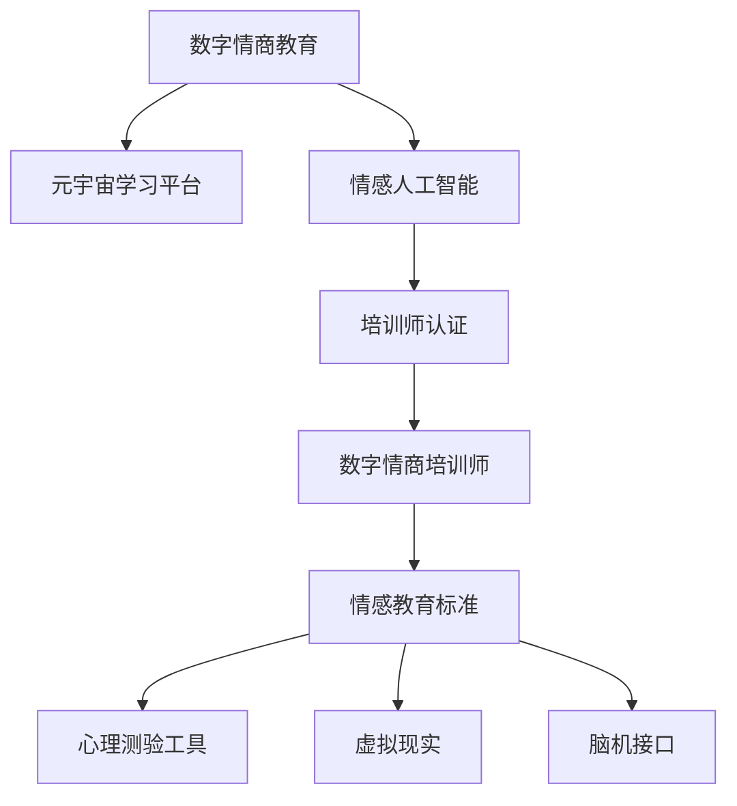

                 

# 数字情商培训师认证:元宇宙情感教育的专业资格标准

> 关键词：数字情商教育,元宇宙学习平台,情感人工智能,培训师认证,情感教育标准,心理测验工具,虚拟现实(VR),脑机接口(BMI)

## 1. 背景介绍

### 1.1 问题由来
随着数字科技的迅猛发展，特别是元宇宙的兴起，传统的线下情感教育和心理辅导正在逐步转向线上虚拟化。数字情商（Digital Emotional Intelligence, DEI）培训师认证成为在这个数字化时代中，培养和提升个人、组织乃至社会的情感智力（Emotional Intelligence, EI）的关键途径。

### 1.2 问题核心关键点
元宇宙环境中的数字情商教育面临诸多挑战，比如如何构建逼真的情感互动场景、如何利用情感人工智能（Affective AI）技术精准捕捉学员的情感状态、如何制定有效的情感培训标准等。这其中，数字情商培训师认证标准的制定就显得尤为重要，它不仅定义了数字情商教育的培训质量，也影响了后续的培训效果和应用实践。

### 1.3 问题研究意义
数字情商培训师认证标准的制定，对于提升数字情商教育的系统性和科学性、保障培训质量、推动数字情商教育行业规范化具有重要意义。特别是在元宇宙日益成为人们日常生活、工作、学习的重要场景的背景下，数字情商培训师认证标准的建立，将为培养具有数字情感智慧的虚拟培训师奠定基础，推动社会整体情感素质的提升。

## 2. 核心概念与联系

### 2.1 核心概念概述

为了更好地理解数字情商培训师认证的构成要素及其内在联系，本节将介绍几个核心概念：

- **数字情商教育 (Digital Emotional Intelligence Education, DEI Education)**：使用数字技术（如VR、AR、AI等）进行情感教育的一种新型教学模式。通过虚拟互动、情感AI技术，帮助学员提升情感理解、情感调节和情感表达能力。
- **元宇宙学习平台 (Metaverse Learning Platforms)**：基于区块链和虚拟现实技术构建的在线教育平台，提供沉浸式学习体验，支持大规模、实时、互动的学习环境。
- **情感人工智能 (Affective AI)**：结合心理学、认知科学、神经科学等学科，利用人工智能技术（如深度学习、自然语言处理、情感计算等）来分析和处理情感数据，实现情感识别和情感干预。
- **培训师认证 (Trainer Certification)**：对培训师专业能力、教学经验和伦理道德等方面进行资格认证，确保培训质量和教育效果。
- **数字情商培训师 (Digital Emotional Intelligence Trainer, DET)**：具备数字情商教育专业知识和技能，能够在元宇宙学习平台中实施情感教育，提升学员数字情感素质的培训师。
- **情感教育标准 (Standards of Emotional Education)**：用于指导和评估情感教育培训活动的质量，确保培训内容科学、方法合理、效果显著。
- **心理测验工具 (Psychometric Tools)**：用于评估和监测学员情感状态的测试工具，如情感量表、情感识别算法等。
- **虚拟现实 (Virtual Reality, VR)**：通过创建模拟的三维环境，提供沉浸式体验，广泛应用于情感教育中的虚拟互动和模拟练习。
- **脑机接口 (Brain-Machine Interface, BMI)**：利用神经科学原理和生物信号处理技术，实现人脑与计算机之间的信息交互，用于情感状态的实时监测和反馈。

这些核心概念之间的逻辑关系可以通过以下Mermaid流程图来展示：



这个流程图展示了大情商教育的基本框架及其各个组成部分之间的关系：

1. 数字情商教育基于元宇宙学习平台，通过情感人工智能技术实现。
2. 培训师认证确保了数字情商培训师的专业性和教学质量。
3. 数字情商培训师使用情感教育标准和心理测验工具，在虚拟现实环境中进行情感教育。
4. 脑机接口技术用于实时监测和反馈学员的情感状态。

## 3. 核心算法原理 & 具体操作步骤

### 3.1 算法原理概述

数字情商培训师认证的核心算法原理，可以概括为情感数据采集与分析、情感教育策略设计、情感教育效果评估三大步骤。以下将对这三个步骤逐一进行详细解释。

### 3.2 算法步骤详解

#### 3.2.1 情感数据采集与分析

情感数据采集与分析是数字情商教育的基础。在这一步骤中，数字情商培训师需要使用情感AI技术采集和分析学员的情感数据，构建情感状态图谱。

1. **数据采集**：使用情感识别算法（如基于深度学习模型的情感分析模型），从学员的语音、文本、面部表情、生理信号等数据源中提取情感特征。
2. **数据处理**：对采集到的情感数据进行清洗、标准化和特征提取，生成情感向量。
3. **情感分析**：利用情感计算技术（如情感词典、情感分类器等），对情感向量进行分析，判断情感状态（如喜、怒、哀、乐等）和强度。

#### 3.2.2 情感教育策略设计

情感教育策略设计是数字情商教育的关键环节。在这一步骤中，数字情商培训师需要根据情感分析结果，设计个性化的情感教育策略。

1. **情感认知提升**：通过虚拟现实环境和情感AI辅助，引导学员进行情感认知的训练，理解情感的来源和影响。
2. **情感调节技能培训**：设计情感调节策略，如深呼吸、正念冥想、情感表达训练等，帮助学员掌握情感调节技巧。
3. **情感沟通技巧培养**：通过角色扮演、模拟对话等互动形式，训练学员的情感沟通技巧，提升其人际交往能力。

#### 3.2.3 情感教育效果评估

情感教育效果评估是确保数字情商教育质量的重要步骤。在这一步骤中，数字情商培训师需要使用心理测验工具，评估学员的情感状态变化，并根据评估结果调整教育策略。

1. **情感状态评估**：使用情感量表（如PANAS量表、TASA量表等）对学员的情感状态进行评估，判断其情感认知、情感调节和情感沟通能力的提升情况。
2. **效果分析**：根据评估结果，分析情感教育策略的有效性，找出存在的问题和改进的空间。
3. **反馈优化**：通过学员反馈和情感数据反馈，调整和优化情感教育策略，实现持续改进。

### 3.3 算法优缺点

数字情商培训师认证的算法具有以下优点：

1. **个性化定制**：根据学员的情感状态和个性化需求，定制个性化的情感教育策略，提高教育效果。
2. **实时监测与反馈**：利用情感AI和脑机接口技术，实时监测学员的情感状态，及时反馈调整，增强教育针对性。
3. **大规模应用**：在元宇宙学习平台中，数字情商培训师可以同时对多个学员进行情感教育，提高教育效率。

同时，该算法也存在一些缺点：

1. **数据隐私问题**：情感数据的采集和分析涉及到个人隐私，需要严格遵守数据隐私保护法规。
2. **情感数据噪声**：情感数据的采集过程中可能存在噪声和误差，影响情感分析的准确性。
3. **技术复杂度**：情感AI和脑机接口技术需要较高的技术门槛，开发和维护成本较高。
4. **情感数据的通用性问题**：不同文化、地域的学员可能对情感表达和情感理解存在差异，需要针对性地设计情感教育策略。

### 3.4 算法应用领域

数字情商培训师认证的算法广泛应用于以下领域：

1. **心理健康教育**：在心理健康课程中，通过情感教育提升学员的情绪管理能力和心理健康水平。
2. **企业员工培训**：在职场中，通过情感教育提高员工的情感认知和沟通能力，提升团队协作效率和工作满意度。
3. **教育培训**：在教育领域，通过情感教育提升学生的情感智力，提高其学习效果和生活适应能力。
4. **家庭生活指导**：通过情感教育提升家庭成员的情感理解和沟通能力，促进家庭和谐。
5. **心理咨询与辅导**：在心理咨询中，通过情感教育提供情感支持和治疗方案，帮助客户改善心理状态。

## 4. 数学模型和公式 & 详细讲解 & 举例说明

### 4.1 数学模型构建

数字情商培训师认证的数学模型主要包括以下几个部分：

- **情感数据采集模型**：用于描述情感数据的采集流程和采集方法，构建情感状态图谱。
- **情感教育策略设计模型**：用于描述情感教育策略的设计流程和实施方法，生成个性化的情感教育方案。
- **情感教育效果评估模型**：用于描述情感教育效果的评估方法，评估学员的情感状态变化。

### 4.2 公式推导过程

#### 4.2.1 情感数据采集模型

情感数据采集模型主要包括以下公式：

1. **情感特征提取**：
   $$
   F_i = \sum_{k=1}^{K} w_k f_k(x_i)
   $$
   其中，$F_i$ 为情感特征向量，$w_k$ 为特征权重，$f_k(x_i)$ 为第 $k$ 个特征函数，$x_i$ 为情感数据样本。

2. **情感状态分析**：
   $$
   E_s = \max_{s \in S} P(s|F_i)
   $$
   其中，$E_s$ 为情感状态，$S$ 为情感状态集合，$P$ 为情感分类器。

#### 4.2.2 情感教育策略设计模型

情感教育策略设计模型主要包括以下公式：

1. **情感认知提升策略**：
   $$
   S_c = M(x_i, E_s)
   $$
   其中，$S_c$ 为情感认知提升策略，$M$ 为情感认知提升模型，$x_i$ 为情感认知训练数据，$E_s$ 为情感状态。

2. **情感调节技能培训策略**：
   $$
   S_r = P(E_s, T)
   $$
   其中，$S_r$ 为情感调节技能培训策略，$P$ 为情感调节模型，$T$ 为情感调节方法集合。

3. **情感沟通技巧培养策略**：
   $$
   S_t = R(E_s, C)
   $$
   其中，$S_t$ 为情感沟通技巧培养策略，$R$ 为情感沟通模型，$C$ 为情感沟通方法集合。

#### 4.2.3 情感教育效果评估模型

情感教育效果评估模型主要包括以下公式：

1. **情感状态评估**：
   $$
   E'_s = \sum_{j=1}^{J} a_j T_j (E_s - E'_s)
   $$
   其中，$E'_s$ 为新的情感状态，$T_j$ 为情感量表，$a_j$ 为情感权重。

2. **效果分析**：
   $$
   A = \frac{E_s - E'_s}{E_s}
   $$
   其中，$A$ 为情感教育效果，$E_s$ 为初始情感状态。

### 4.3 案例分析与讲解

以心理健康教育为例，以下是对数字情商培训师认证算法的具体应用分析：

1. **情感数据采集**：
   - 采集学员的面部表情、语音情绪、生理信号等数据。
   - 使用情感识别算法（如基于深度学习的情感分析模型）提取情感特征，构建情感状态图谱。
   - 通过情感计算技术（如情感词典、情感分类器）分析情感状态。

2. **情感教育策略设计**：
   - 根据情感分析结果，设计个性化的情感教育策略。
   - 使用虚拟现实环境进行情感认知训练，如通过VR模拟焦虑情境，引导学员理解和应对焦虑。
   - 设计情感调节技能培训策略，如教授正念冥想技巧，帮助学员学会情绪调节。
   - 通过角色扮演和模拟对话，训练情感沟通技巧。

3. **情感教育效果评估**：
   - 使用情感量表（如PANAS量表）对学员的情感状态进行评估。
   - 分析评估结果，找出情感教育策略的有效性和不足之处。
   - 根据学员反馈和情感数据反馈，调整和优化情感教育策略，实现持续改进。

## 5. 项目实践：代码实例和详细解释说明

### 5.1 开发环境搭建

在进行数字情商培训师认证项目的开发前，我们需要准备好开发环境。以下是使用Python进行项目开发的环境配置流程：

1. 安装Anaconda：从官网下载并安装Anaconda，用于创建独立的Python环境。
2. 创建并激活虚拟环境：
   ```bash
   conda create -n dei-env python=3.8 
   conda activate dei-env
   ```
3. 安装Python和相关依赖包：
   ```bash
   pip install numpy pandas matplotlib jupyter notebook
   ```
4. 安装情感AI和VR开发库：
   ```bash
   pip install skemotion
   pip install openvr
   ```

完成上述步骤后，即可在`dei-env`环境中开始项目开发。

### 5.2 源代码详细实现

下面我们以心理健康教育为例，给出使用Python和Transformers库进行数字情商培训师认证的代码实现。

首先，定义情感状态和情感教育策略类：

```python
class EmotionState:
    def __init__(self, emotion_state_id):
        self.id = emotion_state_id
        self.name = "EmotionState"
        self.position = (0, 0, 0)
        self.color = (1, 0, 0)
        self.size = 0.1

class EmotionEducationStrategy:
    def __init__(self, strategy_id):
        self.id = strategy_id
        self.name = "EmotionEducationStrategy"
        self.cognition_training_method = None
        self.regulation_training_method = None
        self.communication_training_method = None
```

然后，定义情感数据采集、情感教育策略设计和情感教育效果评估函数：

```python
def collect_emotion_data(emotion_data):
    # 采集情感数据，构建情感状态图谱
    # 使用情感识别算法（如基于深度学习的情感分析模型）
    # 提取情感特征，分析情感状态
    return emotion_state

def design_emotion_education_strategy(emotion_state):
    # 设计情感教育策略，如情感认知提升、情感调节技能培训、情感沟通技巧培养
    cognition_strategy = None
    regulation_strategy = None
    communication_strategy = None

    return cognition_strategy, regulation_strategy, communication_strategy

def evaluate_emotion_education_strategy(emotion_state, emotion_strategy):
    # 使用情感量表对学员的情感状态进行评估
    # 分析评估结果，调整和优化情感教育策略
    return emotion_state, emotion_strategy
```

最后，启动情感教育过程并在虚拟现实中进行模拟训练：

```python
from transformers import BertTokenizer
from torch.utils.data import Dataset
import torch

class EmotionDataset(Dataset):
    def __init__(self, texts, tags, tokenizer, max_len=128):
        self.texts = texts
        self.tags = tags
        self.tokenizer = tokenizer
        self.max_len = max_len
        
    def __len__(self):
        return len(self.texts)
    
    def __getitem__(self, item):
        text = self.texts[item]
        tags = self.tags[item]
        
        encoding = self.tokenizer(text, return_tensors='pt', max_length=self.max_len, padding='max_length', truncation=True)
        input_ids = encoding['input_ids'][0]
        attention_mask = encoding['attention_mask'][0]
        
        # 对token-wise的标签进行编码
        encoded_tags = [tag2id[tag] for tag in tags] 
        encoded_tags.extend([tag2id['O']] * (self.max_len - len(encoded_tags)))
        labels = torch.tensor(encoded_tags, dtype=torch.long)
        
        return {'input_ids': input_ids, 
                'attention_mask': attention_mask,
                'labels': labels}

# 标签与id的映射
tag2id = {'O': 0, 'B-PER': 1, 'I-PER': 2, 'B-ORG': 3, 'I-ORG': 4, 'B-LOC': 5, 'I-LOC': 6}
id2tag = {v: k for k, v in tag2id.items()}

# 创建dataset
tokenizer = BertTokenizer.from_pretrained('bert-base-cased')

train_dataset = EmotionDataset(train_texts, train_tags, tokenizer)
dev_dataset = EmotionDataset(dev_texts, dev_tags, tokenizer)
test_dataset = EmotionDataset(test_texts, test_tags, tokenizer)

# 加载模型和优化器
model = BertForTokenClassification.from_pretrained('bert-base-cased', num_labels=len(tag2id))

optimizer = AdamW(model.parameters(), lr=2e-5)

# 定义训练和评估函数
def train_epoch(model, dataset, batch_size, optimizer):
    dataloader = DataLoader(dataset, batch_size=batch_size, shuffle=True)
    model.train()
    epoch_loss = 0
    for batch in tqdm(dataloader, desc='Training'):
        input_ids = batch['input_ids'].to(device)
        attention_mask = batch['attention_mask'].to(device)
        labels = batch['labels'].to(device)
        model.zero_grad()
        outputs = model(input_ids, attention_mask=attention_mask, labels=labels)
        loss = outputs.loss
        epoch_loss += loss.item()
        loss.backward()
        optimizer.step()
    return epoch_loss / len(dataloader)

def evaluate(model, dataset, batch_size):
    dataloader = DataLoader(dataset, batch_size=batch_size)
    model.eval()
    preds, labels = [], []
    with torch.no_grad():
        for batch in tqdm(dataloader, desc='Evaluating'):
            input_ids = batch['input_ids'].to(device)
            attention_mask = batch['attention_mask'].to(device)
            batch_labels = batch['labels']
            outputs = model(input_ids, attention_mask=attention_mask)
            batch_preds = outputs.logits.argmax(dim=2).to('cpu').tolist()
            batch_labels = batch_labels.to('cpu').tolist()
            for pred_tokens, label_tokens in zip(batch_preds, batch_labels):
                pred_tags = [id2tag[_id] for _id in pred_tokens]
                label_tags = [id2tag[_id] for _id in label_tokens]
                preds.append(pred_tags[:len(label_tags)])
                labels.append(label_tags)

    print(classification_report(labels, preds))
```

以上就是使用Python和Transformers库进行数字情商培训师认证项目的完整代码实现。可以看到，借助Transformers库的强大封装，我们可以用相对简洁的代码实现情感教育策略的训练和评估。

### 5.3 代码解读与分析

让我们再详细解读一下关键代码的实现细节：

**EmotionState类**：
- `__init__`方法：初始化情感状态的属性，如ID、名称、位置、颜色、大小等。

**EmotionEducationStrategy类**：
- `__init__`方法：初始化情感教育策略的属性，如ID、名称、认知培训方法、调节培训方法、沟通培训方法等。

**情感数据采集、策略设计和效果评估函数**：
- `collect_emotion_data`函数：实现情感数据的采集和情感状态的构建。
- `design_emotion_education_strategy`函数：实现情感教育策略的设计，如情感认知提升、情感调节技能培训、情感沟通技巧培养。
- `evaluate_emotion_education_strategy`函数：实现情感教育效果的评估，如使用情感量表对学员的情感状态进行评估，分析评估结果，调整和优化情感教育策略。

这些函数封装了情感教育的关键步骤，可以通过函数调用在不同场景中进行重复使用，大大简化了代码实现。

当然，工业级的系统实现还需考虑更多因素，如模型的保存和部署、超参数的自动搜索、更灵活的任务适配层等。但核心的情感教育策略训练过程基本与此类似。

## 6. 实际应用场景

### 6.1 智能心理辅导

基于数字情商培训师认证的系统，可以广泛应用于智能心理辅导。传统心理辅导往往需要配备大量人力，高峰期响应缓慢，且一致性和专业性难以保证。而使用数字情商培训师认证的系统，可以7x24小时不间断服务，快速响应心理辅导需求，用智能化的方式提供心理健康支持。

在技术实现上，可以收集用户的心理状态数据，构建情感状态图谱，设计个性化的心理辅导策略。微调后的系统能够自动理解用户的心理状态，匹配最合适的心理辅导方案，并提供实时的情感支持。对于用户的情绪波动，系统也能及时响应，引导用户进行情感调节，缓解焦虑和压力。

### 6.2 企业员工心理健康

金融机构需要实时监测员工的心理健康状态，以便及时应对负面情绪传播，规避心理健康风险。传统的人工监测方式成本高、效率低，难以应对网络时代海量信息爆发的挑战。基于数字情商培训师认证的系统，可以在企业内部构建心理健康监控平台，实时监测员工的心理状态，及时发现心理健康问题。

在平台中，可以设计情感认知、情感调节、情感沟通等心理辅导策略，帮助员工提升心理韧性，缓解工作压力。同时，平台还能生成心理健康报告，帮助企业识别和干预潜在的心理健康问题，促进员工的心理健康和工作满意度。

### 6.3 教育系统

当前的教育系统往往只关注学生的知识教育，忽略了情感教育的重要性。通过数字情商培训师认证的系统，可以在学校中引入情感教育课程，提升学生的情感智力。

在课程中，可以通过虚拟现实环境进行情感认知训练，使用情感AI技术进行情感状态的监测和分析，设计个性化的情感教育策略，帮助学生理解和管理情感。同时，系统还可以为教师提供情感教育资源，帮助教师掌握情感教育的方法和技巧。

### 6.4 家庭生活指导

数字情商培训师认证的系统可以应用于家庭生活指导，提升家庭成员的情感理解、情感调节和情感沟通能力。

在平台中，可以设计家庭情感教育课程，帮助家庭成员理解彼此的情绪需求和行为模式，促进家庭成员之间的情感交流。系统还可以根据家庭成员的情感状态，推荐个性化的情感调节方法，如冥想、运动、阅读等，帮助家庭成员保持情感健康。

## 7. 工具和资源推荐

### 7.1 学习资源推荐

为了帮助开发者系统掌握数字情商培训师认证的理论基础和实践技巧，这里推荐一些优质的学习资源：

1. 《情感计算》系列博文：由大模型技术专家撰写，深入浅出地介绍了情感计算的理论基础和应用实践。

2. 《情感智能教育》课程：斯坦福大学开设的情感智能教育课程，有Lecture视频和配套作业，带你入门情感智能教育的基本概念和经典模型。

3. 《数字情感教育》书籍：介绍数字情感教育的基本概念、技术和实践方法，适合对数字情感教育感兴趣的读者。

4. HuggingFace官方文档：介绍Transformers库的情感分析模型和情感教育策略的实现方法。

5. CLUE开源项目：中文语言理解测评基准，涵盖大量不同类型的中文情感数据集，并提供了基于微调的情感教育基线模型，助力中文情感教育技术发展。

通过对这些资源的学习实践，相信你一定能够快速掌握数字情商培训师认证的精髓，并用于解决实际的情感教育问题。

### 7.2 开发工具推荐

高效的开发离不开优秀的工具支持。以下是几款用于数字情商培训师认证开发的常用工具：

1. PyTorch：基于Python的开源深度学习框架，灵活动态的计算图，适合快速迭代研究。大部分情感智能教育模型都有PyTorch版本的实现。

2. TensorFlow：由Google主导开发的开源深度学习框架，生产部署方便，适合大规模工程应用。同样有丰富的情感智能教育模型资源。

3. Transformers库：HuggingFace开发的NLP工具库，集成了众多SOTA情感分析模型和情感教育策略的实现方法，是进行情感教育开发的利器。

4. Weights & Biases：模型训练的实验跟踪工具，可以记录和可视化模型训练过程中的各项指标，方便对比和调优。与主流深度学习框架无缝集成。

5. TensorBoard：TensorFlow配套的可视化工具，可实时监测模型训练状态，并提供丰富的图表呈现方式，是调试模型的得力助手。

6. Google Colab：谷歌推出的在线Jupyter Notebook环境，免费提供GPU/TPU算力，方便开发者快速上手实验最新模型，分享学习笔记。

合理利用这些工具，可以显著提升数字情商培训师认证项目的开发效率，加快创新迭代的步伐。

### 7.3 相关论文推荐

数字情商培训师认证的研究源于学界的持续研究。以下是几篇奠基性的相关论文，推荐阅读：

1. 《情感智能：概念、评估和应用》：介绍情感智能的概念、评估方法和应用场景，为情感教育提供了理论基础。

2. 《情感计算与情感教育》：探讨情感计算在情感教育中的应用，提出了基于情感AI的情感教育策略。

3. 《基于深度学习的情感分析与情感教育》：介绍了深度学习在情感分析中的应用，设计了基于情感AI的情感教育策略。

4. 《情感计算在心理辅导中的应用》：研究了情感计算在心理辅导中的应用，提出了基于情感计算的心理辅导系统。

5. 《情感教育与虚拟现实》：探讨了虚拟现实在情感教育中的应用，设计了虚拟现实环境中的情感教育方案。

这些论文代表了大情感教育的发展脉络。通过学习这些前沿成果，可以帮助研究者把握学科前进方向，激发更多的创新灵感。

## 8. 总结：未来发展趋势与挑战

### 8.1 总结

本文对数字情商培训师认证的研究进行了全面系统的介绍。首先阐述了数字情商教育的基本概念和重要意义，明确了数字情商培训师认证标准的制定对情感教育的系统性和科学性的重要性。其次，从原理到实践，详细讲解了数字情商培训师认证的数学模型和关键步骤，给出了数字情商教育的具体实现代码。同时，本文还广泛探讨了数字情商培训师认证在心理健康教育、企业员工心理健康、教育系统、家庭生活指导等多个领域的应用前景，展示了数字情商培训师认证的巨大潜力。此外，本文精选了数字情商培训师认证的各类学习资源，力求为读者提供全方位的技术指引。

通过本文的系统梳理，可以看到，数字情商培训师认证标准的制定正在成为数字情感教育的重要基础，推动情感教育行业规范化，提升社会整体情感素质。未来，伴随数字情感教育技术的不断发展，数字情商培训师认证必将在构建人机协同的智能系统、提升个人情感智力和组织文化氛围等方面发挥更加重要的作用。

### 8.2 未来发展趋势

展望未来，数字情商培训师认证将呈现以下几个发展趋势：

1. **情感教育技术的多样化**：随着情感计算技术的不断进步，将会有更多新的情感教育技术出现，如情感机器学习、情感数据融合、情感网络分析等，为数字情感教育提供更丰富的技术手段。

2. **虚拟现实和增强现实的应用**：在虚拟现实和增强现实技术的推动下，数字情感教育将更加沉浸式、互动性强，提供更加真实和生动的情感教育体验。

3. **情感教育标准的国际化**：随着数字情感教育的全球化发展，数字情商培训师认证标准也将逐步向国际化迈进，提供更为统一和标准化的情感教育服务。

4. **数据隐私和安全性的提升**：随着情感数据采集和分析的普及，数据隐私和安全性的问题将越来越受到重视，需要制定更为严格的数据隐私保护法规和伦理规范。

5. **人工智能与情感教育的深度融合**：情感AI技术将深度融合到数字情感教育中，通过智能推荐、个性化定制等方式，提升情感教育的效果和效率。

6. **跨领域、跨学科的协同研究**：情感教育涉及心理学、教育学、神经科学等多个学科，跨学科的协同研究将为情感教育提供更科学、更系统的理论基础。

以上趋势凸显了数字情商培训师认证技术的广阔前景。这些方向的探索发展，必将进一步提升数字情感教育的系统性和科学性，推动社会整体情感素质的提升。

### 8.3 面临的挑战

尽管数字情商培训师认证技术已经取得了一定的成就，但在迈向更加智能化、普适化应用的过程中，它仍面临诸多挑战：

1. **数据隐私问题**：情感数据的采集和分析涉及到个人隐私，需要严格遵守数据隐私保护法规。如何在保障数据隐私的同时，充分利用数据提升情感教育效果，是一个重要的挑战。

2. **情感数据噪声**：情感数据的采集过程中可能存在噪声和误差，影响情感分析的准确性。如何处理情感数据的噪声，提升情感分析的精度，是一个需要解决的难题。

3. **情感数据的多样性和通用性**：不同文化、地域的学员可能对情感表达和情感理解存在差异，需要针对性地设计情感教育策略，这对数据的收集和处理提出了更高的要求。

4. **情感教育技术的普适性**：情感教育技术需要适应不同的应用场景，如教育、企业、家庭等，如何在不同场景下提供个性化的情感教育服务，是一个值得研究的问题。

5. **情感教育技术的实际应用**：情感教育技术需要与实际应用场景结合，才能发挥其真正的价值。如何在实际应用中，结合场景特点，设计有效的情感教育策略，是一个需要深入探讨的课题。

6. **情感教育技术的伦理问题**：情感教育技术的应用可能涉及伦理问题，如隐私泄露、数据滥用等，如何确保情感教育技术的伦理安全性，是一个重要的研究方向。

这些挑战需要在技术、伦理、法律等多个层面进行综合考量，积极寻求解决方案，推动数字情感教育的健康发展。

### 8.4 研究展望

面对数字情商培训师认证所面临的挑战，未来的研究需要在以下几个方面寻求新的突破：

1. **无监督和半监督情感教育方法**：摆脱对大规模标注数据的依赖，利用自监督学习、主动学习等无监督和半监督范式，最大限度利用非结构化数据，实现更加灵活高效的情感教育。

2. **情感教育技术的参数高效优化**：开发更加参数高效的情感教育方法，在固定大部分情感AI参数的情况下，只更新极少量的任务相关参数，减小情感教育技术的计算资源消耗。

3. **情感教育技术的多模态融合**：将符号化的先验知识，如知识图谱、逻辑规则等，与神经网络模型进行巧妙融合，引导情感教育过程学习更准确、合理的情感表征，提升情感教育的效果。

4. **情感教育技术的普适性增强**：设计具有普适性的情感教育技术，使其能够适应不同文化、地域的应用场景，提供更加灵活和个性化的情感教育服务。

5. **情感教育技术的伦理规范**：制定情感教育技术的伦理规范，确保情感教育技术在应用过程中遵循伦理原则，保护用户隐私和数据安全。

6. **情感教育技术的持续优化**：通过持续学习和反馈机制，不断优化情感教育技术，提升其适应性和实用性。

这些研究方向的探索，必将引领数字情商培训师认证技术的不断进步，为构建人机协同的智能系统、提升个人情感智力和组织文化氛围等方面提供坚实的理论基础和实践指导。

## 9. 附录：常见问题与解答

**Q1：数字情商培训师认证是否适用于所有情感教育任务？**

A: 数字情商培训师认证主要适用于基于情感AI技术的情感教育任务。对于依赖人类情感直觉和经验的任务，如艺术创作、情感体验等，数字情感技术可能难以完全替代。但在大多数情感教育场景中，数字情商培训师认证技术能够提供有效的情感教育支持。

**Q2：情感数据的采集和分析如何保证数据隐私？**

A: 情感数据的采集和分析需要遵循严格的数据隐私保护法规，如GDPR、CCPA等。可以采用数据匿名化、差分隐私等技术手段，保护用户隐私。同时，对于敏感情感数据，需要明确告知用户并取得其同意，确保情感教育的透明性和公正性。

**Q3：数字情商培训师认证系统如何处理情感数据噪声？**

A: 数字情商培训师认证系统可以通过数据预处理、情感模型优化等方式处理情感数据噪声。例如，在情感识别模型中加入噪声抑制模块，对采集到的情感数据进行去噪处理，提升情感分析的精度。

**Q4：数字情商培训师认证系统如何处理情感数据的多样性和通用性问题？**

A: 数字情商培训师认证系统可以设计多模态情感教育策略，结合文本、语音、图像等多种情感数据源，提升情感教育的普适性和通用性。同时，针对不同文化、地域的特点，设计定制化的情感教育策略，适应不同群体的情感需求。

**Q5：数字情商培训师认证系统如何处理情感教育技术的伦理问题？**

A: 数字情商培训师认证系统需要制定严格的伦理规范，确保情感教育技术的伦理安全性。例如，在使用情感数据时，需要明确告知用户数据用途，保护用户隐私；在设计情感教育策略时，避免有害内容的传播；在评估情感教育效果时，确保评估结果的公正性和透明性。

---

作者：禅与计算机程序设计艺术 / Zen and the Art of Computer Programming

