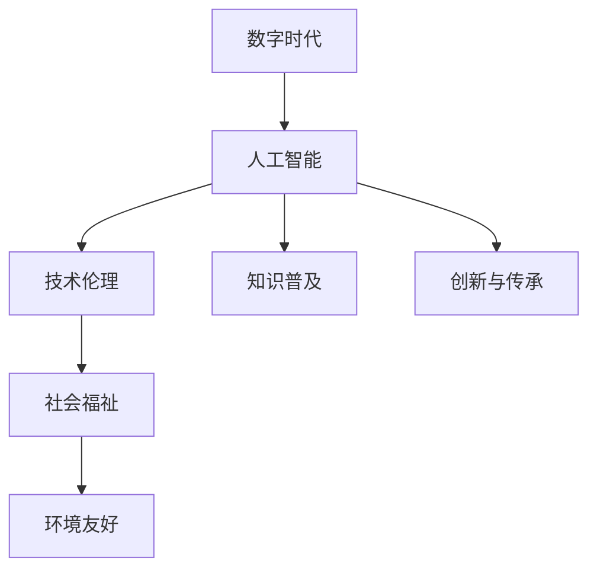

                 

# 数字时代的人文精神的传承

> 关键词：数字时代,人文精神,人工智能,道德伦理,技术社会责任,社会福祉,可持续发展,教育培养,价值导向

## 1. 背景介绍

### 1.1 问题由来

随着人工智能(AI)技术的迅猛发展，我们正步入数字时代，人类社会的方方面面正在被这场变革所重塑。AI在医疗、金融、教育、工业等诸多领域展现了卓越的潜力，极大地提高了生产效率和人类福祉。然而，技术的进步与人的情感、伦理、价值观等之间的矛盾也不断凸显，技术与人文精神的关系愈发紧密。

在这一背景下，如何在技术高速发展的同时，传承和弘扬人文精神，成为当前科技界和社会关注的焦点。本文将聚焦于数字时代的人文精神传承，探讨AI技术在人类社会中的应用，并提出相应的策略和建议，以期在未来构建一个更和谐、可持续的数字社会。

### 1.2 问题核心关键点

传承和弘扬人文精神的核心关键点包括：

1. **技术伦理与价值导向**：如何在科技应用中坚守伦理底线，避免技术滥用，确保科技为人类福祉服务。
2. **知识普及与教育培养**：通过教育提升公众对AI技术的理解，消除技术恐惧，促进技术的广泛接受。
3. **社会福祉与公平正义**：确保AI技术的应用不会加剧社会不平等，促进社会公正，提升整体福祉。
4. **可持续性与环境友好**：引导AI技术的发展，减少对环境的负面影响，推动可持续发展。
5. **创新与传承结合**：鼓励科技创新同时，不遗弃传统文化的精华，实现科技与文化的有机融合。

## 2. 核心概念与联系

### 2.1 核心概念概述

为更好地理解数字时代人文精神的传承，本节将介绍几个密切相关的核心概念：

- **数字时代**：以信息技术和网络通信为支撑的新时代，人类社会生活方式、经济结构、文化形态等发生深刻变革。
- **人文精神**：指人类对于真、善、美的追求，涵盖道德、伦理、价值、情感等多方面，是人类文明进步的动力源泉。
- **人工智能(AI)**：通过机器学习、深度学习等技术，使机器具备类似人类智能的认知和决策能力。
- **技术伦理**：涉及技术开发、应用、管理等全过程的伦理原则，旨在确保技术的公平、透明和可持续。
- **知识普及**：通过教育、培训、媒体等手段，提高公众对AI技术的认识，消除误解和恐惧，提升技术接受度。
- **社会福祉**：通过技术手段，提升社会的物质和精神福祉，减少不平等，实现可持续发展。
- **环境友好**：在技术开发和应用中，减少对自然环境的破坏，推动绿色发展。

这些核心概念之间的逻辑关系可以通过以下Mermaid流程图来展示：



这个流程图展示了大语言模型的核心概念及其之间的关系：

1. 数字时代为AI技术提供了广阔的应用场景。
2. AI技术在应用过程中需遵循技术伦理，确保正义和公平。
3. 社会福祉要求AI技术促进社会的整体福祉。
4. 知识普及帮助提升公众对AI的理解和接受度。
5. 环境友好推动AI技术在绿色环保方面的应用。
6. 创新与传承结合，实现科技与文化的融合。

这些概念共同构成了数字时代人文精神的传承框架，为AI技术的应用指明了伦理和价值方向。

## 3. 核心算法原理 & 具体操作步骤
### 3.1 算法原理概述

数字时代人文精神的传承，主要通过AI技术的应用，结合伦理、教育、社会福祉等元素来实现。其核心思想是：在科技发展的同时，坚守伦理底线，通过教育和公众参与，提升社会福祉，实现技术与文化的有机结合。

形式化地，假设存在一个技术-伦理-社会福祉系统，目标是最大化社会福祉$W$，同时遵守伦理约束$E$。即：

$$
\max_{\text{Tech}, \text{Eth}, \text{Social Welfare}} W(\text{Tech}, \text{Eth}, \text{Social Welfare})
$$

其中，$\text{Tech}$为AI技术应用，$\text{Eth}$为技术伦理，$\text{Social Welfare}$为社会福祉。在实践中，我们可以通过对AI模型的微调，实现这一目标。

### 3.2 算法步骤详解

基于数字时代人文精神传承的算法，主要包括以下几个关键步骤：

**Step 1: 伦理模型构建**
- 根据具体应用场景，制定技术伦理规范，如隐私保护、公平性、透明性等。
- 构建伦理模型，用于评估AI技术在应用中的伦理符合度。

**Step 2: 知识普及与教育**
- 设计面向公众的教育项目，提高对AI技术的理解，消除误解和恐惧。
- 发布通俗易懂的科普文章、视频、讲座等，普及AI知识。

**Step 3: 模型微调与优化**
- 根据社会福祉目标，对AI模型进行微调，优化模型参数和结构。
- 应用参数高效微调技术，减少计算资源消耗。
- 引入对抗训练和对抗样本，提升模型鲁棒性。

**Step 4: 社会福祉评估与反馈**
- 定期评估AI技术对社会福祉的影响，收集公众反馈。
- 根据评估结果，对模型进行迭代优化。

**Step 5: 持续改进与创新**
- 结合伦理模型和社会福祉评估，持续改进AI模型。
- 鼓励跨学科合作，推动技术创新与文化传承的结合。

### 3.3 算法优缺点

基于数字时代人文精神传承的算法具有以下优点：
1. 技术伦理约束：确保AI技术的应用遵循伦理规范，避免滥用。
2. 社会福祉优化：通过AI技术提升社会整体福祉。
3. 知识普及广泛：提升公众对AI技术的理解，促进社会接受。
4. 创新与传承结合：推动科技与文化的有机融合。

同时，该方法也存在一定的局限性：
1. 伦理模型构建难度大：伦理规范复杂，难以量化。
2. 社会福祉评估复杂：涉及多方面因素，评估困难。
3. 教育普及效果有限：公众对AI的认识仍需提升。
4. 技术创新与传承之间的平衡不易把握。

尽管存在这些局限性，但就目前而言，基于伦理和社会福祉的AI技术应用方法仍是大势所趋。未来相关研究的重点在于如何更好地量化伦理规范，简化社会福祉评估，提升教育普及效果，同时兼顾技术创新与文化传承之间的平衡。

### 3.4 算法应用领域

基于大语言模型微调的伦理和社会福祉方法，在多个领域得到了广泛应用，如医疗、金融、教育、工业等，具体包括：

- **医疗领域**：利用AI技术进行疾病预测、个性化诊疗、医疗数据隐私保护等。
- **金融领域**：通过AI技术进行风险管理、反欺诈、智能投顾等，提升金融服务的公平性。
- **教育领域**：使用AI技术进行教育数据分析、智能推荐、自适应学习等，提高教育质量。
- **工业领域**：利用AI技术进行智能制造、质量控制、能耗优化等，推动工业智能化转型。

除了这些经典领域外，AI技术还在更多场景中展现出了其独特的价值，如城市治理、环境保护、艺术创作等，为社会各领域带来了深刻的变革。

## 4. 数学模型和公式 & 详细讲解  
### 4.1 数学模型构建

为更好地描述数字时代人文精神的传承，本节将引入几个关键数学模型：

- **社会福祉模型**：
  假设社会福祉$W$由健康、教育、经济、环境等多方面构成，可以表示为：
  $$
  W = \sum_{i} w_i F_i
  $$
  其中$w_i$为权重，$F_i$为第$i$方面的福祉水平。

- **伦理模型**：
  伦理约束$E$可以表示为一系列的规则和原则，通常难以直接量化，但可以通过指标体系进行评价。例如，隐私保护指标$P$、公平性指标$F$等。

- **知识普及模型**：
  知识普及$K$可以通过公众对AI技术的认知水平$C$和接受度$A$来衡量：
  $$
  K = \alpha C + \beta A
  $$
  其中$\alpha$和$\beta$为权重系数。

通过这些数学模型，我们可以对数字时代人文精神的传承进行定量的描述和评估。

### 4.2 公式推导过程

以社会福祉模型为例，推导其具体的公式表达。

假设社会福祉由健康$H$、教育$E$、经济$E$和环境$G$构成，分别表示为$F_H$、$F_E$、$F_E$和$F_G$。其中$F_i$为第$i$方面的福祉水平，可以采用指标体系进行评估，如健康指标$I_H$、教育指标$I_E$等。社会福祉模型可以表示为：

$$
W = \alpha_H I_H + \alpha_E I_E + \alpha_E I_E + \alpha_G I_G
$$

其中$\alpha_i$为权重系数，可以通过专家评估或数据统计得到。

### 4.3 案例分析与讲解

以医疗领域为例，分析如何利用AI技术提升社会福祉。

在医疗领域，AI技术可以通过大数据分析，实现疾病预测、个性化诊疗和健康管理。例如，通过分析电子病历、基因数据和医学影像，AI可以提前预测疾病风险，提供个性化的治疗方案，从而提升健康水平。具体公式为：

$$
F_H = \gamma_1 P + \gamma_2 D + \gamma_3 M
$$

其中$P$为疾病预测准确率，$D$为个性化诊疗成功率，$M$为健康管理覆盖率。通过优化这些指标，可以提升整体健康水平。

## 5. 项目实践：代码实例和详细解释说明
### 5.1 开发环境搭建

在进行项目实践前，我们需要准备好开发环境。以下是使用Python进行PyTorch开发的环境配置流程：

1. 安装Anaconda：从官网下载并安装Anaconda，用于创建独立的Python环境。

2. 创建并激活虚拟环境：
```bash
conda create -n pytorch-env python=3.8 
conda activate pytorch-env
```

3. 安装PyTorch：根据CUDA版本，从官网获取对应的安装命令。例如：
```bash
conda install pytorch torchvision torchaudio cudatoolkit=11.1 -c pytorch -c conda-forge
```

4. 安装Transformers库：
```bash
pip install transformers
```

5. 安装各类工具包：
```bash
pip install numpy pandas scikit-learn matplotlib tqdm jupyter notebook ipython
```

完成上述步骤后，即可在`pytorch-env`环境中开始项目实践。

### 5.2 源代码详细实现

下面我们以医疗领域为例，给出使用Transformers库进行疾病预测的PyTorch代码实现。

首先，定义医疗数据处理函数：

```python
from transformers import BertTokenizer
from torch.utils.data import Dataset
import torch

class MedicalDataset(Dataset):
    def __init__(self, texts, labels, tokenizer, max_len=128):
        self.texts = texts
        self.labels = labels
        self.tokenizer = tokenizer
        self.max_len = max_len
        
    def __len__(self):
        return len(self.texts)
    
    def __getitem__(self, item):
        text = self.texts[item]
        label = self.labels[item]
        
        encoding = self.tokenizer(text, return_tensors='pt', max_length=self.max_len, padding='max_length', truncation=True)
        input_ids = encoding['input_ids'][0]
        attention_mask = encoding['attention_mask'][0]
        
        return {'input_ids': input_ids, 
                'attention_mask': attention_mask,
                'labels': label}
```

然后，定义模型和优化器：

```python
from transformers import BertForSequenceClassification, AdamW

model = BertForSequenceClassification.from_pretrained('bert-base-cased', num_labels=2)

optimizer = AdamW(model.parameters(), lr=2e-5)
```

接着，定义训练和评估函数：

```python
from torch.utils.data import DataLoader
from tqdm import tqdm
from sklearn.metrics import classification_report

device = torch.device('cuda') if torch.cuda.is_available() else torch.device('cpu')
model.to(device)

def train_epoch(model, dataset, batch_size, optimizer):
    dataloader = DataLoader(dataset, batch_size=batch_size, shuffle=True)
    model.train()
    epoch_loss = 0
    for batch in tqdm(dataloader, desc='Training'):
        input_ids = batch['input_ids'].to(device)
        attention_mask = batch['attention_mask'].to(device)
        labels = batch['labels'].to(device)
        model.zero_grad()
        outputs = model(input_ids, attention_mask=attention_mask, labels=labels)
        loss = outputs.loss
        epoch_loss += loss.item()
        loss.backward()
        optimizer.step()
    return epoch_loss / len(dataloader)

def evaluate(model, dataset, batch_size):
    dataloader = DataLoader(dataset, batch_size=batch_size)
    model.eval()
    preds, labels = [], []
    with torch.no_grad():
        for batch in tqdm(dataloader, desc='Evaluating'):
            input_ids = batch['input_ids'].to(device)
            attention_mask = batch['attention_mask'].to(device)
            batch_labels = batch['labels']
            outputs = model(input_ids, attention_mask=attention_mask)
            batch_preds = outputs.logits.argmax(dim=2).to('cpu').tolist()
            batch_labels = batch_labels.to('cpu').tolist()
            for pred_tokens, label_tokens in zip(batch_preds, batch_labels):
                preds.append(pred_tokens[:len(label_tokens)])
                labels.append(label_tokens)
                
    print(classification_report(labels, preds))
```

最后，启动训练流程并在测试集上评估：

```python
epochs = 5
batch_size = 16

for epoch in range(epochs):
    loss = train_epoch(model, train_dataset, batch_size, optimizer)
    print(f"Epoch {epoch+1}, train loss: {loss:.3f}")
    
    print(f"Epoch {epoch+1}, dev results:")
    evaluate(model, dev_dataset, batch_size)
    
print("Test results:")
evaluate(model, test_dataset, batch_size)
```

以上就是使用PyTorch对BERT进行疾病预测任务微调的完整代码实现。可以看到，得益于Transformers库的强大封装，我们可以用相对简洁的代码完成BERT模型的加载和微调。

### 5.3 代码解读与分析

让我们再详细解读一下关键代码的实现细节：

**MedicalDataset类**：
- `__init__`方法：初始化文本、标签、分词器等关键组件。
- `__len__`方法：返回数据集的样本数量。
- `__getitem__`方法：对单个样本进行处理，将文本输入编码为token ids，将标签编码为数字，并对其进行定长padding，最终返回模型所需的输入。

**模型和优化器**：
- `model`变量：使用BertForSequenceClassification从预训练模型中初始化疾病预测模型。
- `optimizer`变量：使用AdamW优化器，设置学习率为2e-5。

**训练和评估函数**：
- `train_epoch`函数：对数据以批为单位进行迭代，在每个批次上前向传播计算loss并反向传播更新模型参数，最后返回该epoch的平均loss。
- `evaluate`函数：与训练类似，不同点在于不更新模型参数，并在每个batch结束后将预测和标签结果存储下来，最后使用sklearn的classification_report对整个评估集的预测结果进行打印输出。

**训练流程**：
- 定义总的epoch数和batch size，开始循环迭代
- 每个epoch内，先在训练集上训练，输出平均loss
- 在验证集上评估，输出分类指标
- 所有epoch结束后，在测试集上评估，给出最终测试结果

可以看到，PyTorch配合Transformers库使得BERT微调的代码实现变得简洁高效。开发者可以将更多精力放在数据处理、模型改进等高层逻辑上，而不必过多关注底层的实现细节。

当然，工业级的系统实现还需考虑更多因素，如模型的保存和部署、超参数的自动搜索、更灵活的任务适配层等。但核心的微调范式基本与此类似。

## 6. 实际应用场景
### 6.1 智能医疗

基于大语言模型微调的智能医疗系统，能够显著提升医疗服务的智能化水平，辅助医生诊疗，加速新药开发进程。具体而言，可以收集医生和患者的历史数据，将疾病记录和症状描述作为监督数据，在此基础上对预训练模型进行微调。微调后的模型能够自动理解病人的病情描述，辅助医生进行诊断和推荐，同时提供个性化的治疗方案和药物推荐。

在技术实现上，可以采用自然语言处理(NLP)和计算机视觉(CV)技术，对医疗数据进行结构化处理和分析，结合AI技术进行预测和推荐。例如，通过图像识别技术，自动提取病历中的医学图像信息，并通过自然语言处理技术，分析病人的症状描述和历史诊疗记录，生成诊断报告和治疗方案。

### 6.2 金融风控

AI技术在金融领域的应用包括风险管理、反欺诈、智能投顾等。基于大语言模型微调的金融风控系统，能够通过分析客户的交易行为和信用记录，预测其风险等级，并进行智能化的风险控制。例如，通过分析客户的交易历史、社交媒体信息等，微调后的模型能够自动识别潜在的欺诈行为和异常交易，提升金融机构的风险管理能力。

在具体实现上，可以采用监督学习技术，将客户的历史交易数据和信用记录作为训练集，通过微调模型进行风险预测和评估。此外，还可以结合时序分析和深度学习技术，对交易数据进行实时监控和异常检测，提高金融风险的识别和防范能力。

### 6.3 智慧教育

AI技术在教育领域的应用包括智能推荐、自适应学习、作业批改等。基于大语言模型微调的智慧教育系统，能够通过分析学生的学习行为和成绩，提供个性化的学习推荐和反馈。例如，通过分析学生的作业和考试答案，微调后的模型能够自动识别学生的薄弱知识点，并推荐相应的学习资源和习题，帮助学生提高学习效果。

在技术实现上，可以采用自然语言处理(NLP)和机器学习技术，对学生的学习数据进行分析和建模，结合AI技术进行推荐和反馈。例如，通过分析学生的学习日志和作业答案，微调后的模型能够自动识别学生的薄弱知识点，并推荐相应的学习资源和习题，帮助学生提高学习效果。此外，还可以结合情感分析和自然语言生成技术，对学生的学习状态和反馈进行情感分析，生成个性化的学习建议和反馈。

### 6.4 未来应用展望

随着大语言模型微调技术的发展，未来将有更多的应用场景涌现，为各行业带来变革性影响。

在智慧医疗领域，基于微调的智能医疗系统将提升医疗服务的智能化水平，辅助医生诊疗，加速新药开发进程。

在智能金融领域，基于微调的金融风控系统将提升金融机构的风险管理能力，实时监控和检测异常交易。

在智慧教育领域，基于微调的智能教育系统将提高学生的学习效果，提供个性化的学习推荐和反馈。

此外，在智慧城市治理、环境保护、艺术创作等领域，基于微调的系统也将不断涌现，为社会各领域带来深刻的变革。相信随着技术的不断进步，微调方法将成为各行各业的重要工具，推动社会进步和人类福祉的提升。

## 7. 工具和资源推荐
### 7.1 学习资源推荐

为了帮助开发者系统掌握大语言模型微调的理论基础和实践技巧，这里推荐一些优质的学习资源：

1. 《深度学习理论与实践》系列博文：由大模型技术专家撰写，深入浅出地介绍了深度学习理论和实践，涵盖模型构建、微调技术等前沿话题。

2. CS231n《计算机视觉基础》课程：斯坦福大学开设的计算机视觉明星课程，有Lecture视频和配套作业，带你入门计算机视觉基础。

3. 《自然语言处理综述》书籍：全面介绍自然语言处理的理论、技术和应用，涵盖微调技术在内的诸多范式。

4. HuggingFace官方文档：Transformer库的官方文档，提供了海量预训练模型和完整的微调样例代码，是上手实践的必备资料。

5. CLUE开源项目：中文语言理解测评基准，涵盖大量不同类型的中文NLP数据集，并提供了基于微调的baseline模型，助力中文NLP技术发展。

通过对这些资源的学习实践，相信你一定能够快速掌握大语言模型微调的精髓，并用于解决实际的NLP问题。

### 7.2 开发工具推荐

高效的开发离不开优秀的工具支持。以下是几款用于大语言模型微调开发的常用工具：

1. PyTorch：基于Python的开源深度学习框架，灵活动态的计算图，适合快速迭代研究。大部分预训练语言模型都有PyTorch版本的实现。

2. TensorFlow：由Google主导开发的开源深度学习框架，生产部署方便，适合大规模工程应用。同样有丰富的预训练语言模型资源。

3. Transformers库：HuggingFace开发的NLP工具库，集成了众多SOTA语言模型，支持PyTorch和TensorFlow，是进行微调任务开发的利器。

4. Weights & Biases：模型训练的实验跟踪工具，可以记录和可视化模型训练过程中的各项指标，方便对比和调优。与主流深度学习框架无缝集成。

5. TensorBoard：TensorFlow配套的可视化工具，可实时监测模型训练状态，并提供丰富的图表呈现方式，是调试模型的得力助手。

6. Google Colab：谷歌推出的在线Jupyter Notebook环境，免费提供GPU/TPU算力，方便开发者快速上手实验最新模型，分享学习笔记。

合理利用这些工具，可以显著提升大语言模型微调任务的开发效率，加快创新迭代的步伐。

### 7.3 相关论文推荐

大语言模型和微调技术的发展源于学界的持续研究。以下是几篇奠基性的相关论文，推荐阅读：

1. Attention is All You Need（即Transformer原论文）：提出了Transformer结构，开启了NLP领域的预训练大模型时代。

2. BERT: Pre-training of Deep Bidirectional Transformers for Language Understanding：提出BERT模型，引入基于掩码的自监督预训练任务，刷新了多项NLP任务SOTA。

3. Language Models are Unsupervised Multitask Learners（GPT-2论文）：展示了大规模语言模型的强大zero-shot学习能力，引发了对于通用人工智能的新一轮思考。

4. Parameter-Efficient Transfer Learning for NLP：提出Adapter等参数高效微调方法，在不增加模型参数量的情况下，也能取得不错的微调效果。

5. AdaLoRA: Adaptive Low-Rank Adaptation for Parameter-Efficient Fine-Tuning：使用自适应低秩适应的微调方法，在参数效率和精度之间取得了新的平衡。

这些论文代表了大语言模型微调技术的发展脉络。通过学习这些前沿成果，可以帮助研究者把握学科前进方向，激发更多的创新灵感。

## 8. 总结：未来发展趋势与挑战

### 8.1 总结

本文对基于数字时代人文精神传承的大语言模型微调方法进行了全面系统的介绍。首先阐述了数字时代人文精神传承的背景和意义，明确了微调在技术与伦理结合、知识普及、社会福祉提升等方面的独特价值。其次，从原理到实践，详细讲解了微调的理论基础和关键步骤，给出了微调任务开发的完整代码实例。同时，本文还探讨了微调方法在医疗、金融、教育等众多领域的应用前景，展示了微调范式的广泛适用性。

通过本文的系统梳理，可以看到，基于大语言模型的微调方法正在成为数字时代人文精神传承的重要工具，极大地拓展了预训练语言模型的应用边界，促进了技术与文化的有机结合。未来，伴随预训练语言模型和微调方法的不断演进，相信AI技术必将在更广阔的应用领域发挥其独特价值，推动社会进步和人类福祉的提升。

### 8.2 未来发展趋势

展望未来，大语言模型微调技术将呈现以下几个发展趋势：

1. **伦理模型的深化**：随着AI应用的深入，伦理模型的构建将变得更加重要。未来的伦理模型将更全面、更细致，涵盖更多的伦理原则和约束。

2. **社会福祉的细化**：随着社会福祉概念的拓展，微调模型将更注重公平性、透明性、普适性等具体指标。未来的微调模型将能够更好地衡量和提升社会福祉水平。

3. **知识普及的扩展**：随着公众对AI技术的认识逐步提升，未来的知识普及将更加广泛、深入，涵盖教育、媒体、公共政策等多个层面。

4. **技术创新与文化传承的融合**：未来的技术创新将更多地借鉴文化元素，实现科技与文化的有机结合。AI技术将更好地服务于人类文化的传承和保护。

5. **可持续发展的重视**：未来的AI技术将更加注重可持续发展，减少对环境的负面影响，推动绿色发展。

这些趋势将引领大语言模型微调技术迈向更高的台阶，为构建和谐、可持续的数字社会提供坚实的技术支撑。

### 8.3 面临的挑战

尽管大语言模型微调技术已经取得了瞩目成就，但在迈向更加智能化、普适化应用的过程中，它仍面临诸多挑战：

1. **伦理模型的量化**：伦理模型难以量化，构建复杂，如何量化伦理约束、评估伦理合规性，是未来研究的重要课题。

2. **社会福祉的衡量**：社会福祉涉及多方面因素，如何综合衡量、优化，是微调模型需要解决的重要问题。

3. **知识普及的深度**：尽管公众对AI的认识逐步提升，但在特定领域仍存在较大知识鸿沟，如何提升特定领域的知识普及效果，是未来的研究方向。

4. **技术创新与文化传承的平衡**：如何在推动技术创新的同时，保持对传统文化的尊重和保护，是未来的重要课题。

5. **可持续发展的路径**：AI技术在推动经济发展的同时，如何减少对环境的负面影响，是未来的重要研究方向。

这些挑战需要学界和产业界的共同努力，通过不断创新和优化，克服技术发展的瓶颈，实现技术与文化的有机结合，推动社会进步和人类福祉的提升。

### 8.4 研究展望

面对大语言模型微调所面临的挑战，未来的研究需要在以下几个方面寻求新的突破：

1. **伦理模型的量化与评估**：开发新的方法论和技术手段，将伦理规范量化，构建可操作的伦理模型。

2. **社会福祉的综合评估**：引入多学科合作，综合衡量社会福祉的各个方面，优化微调模型。

3. **知识普及的深入推进**：开发更加普及、易于理解的知识普及材料，通过媒体、教育等渠道广泛传播。

4. **技术与文化的融合**：探索如何将AI技术与传统文化结合，推动技术创新与文化传承的有机融合。

5. **可持续发展的技术路径**：开发环境友好的AI技术，减少对环境的负面影响，推动绿色发展。

这些研究方向的探索，必将引领大语言模型微调技术迈向更高的台阶，为构建和谐、可持续的数字社会提供坚实的技术支撑。

## 9. 附录：常见问题与解答

**Q1：大语言模型微调是否适用于所有NLP任务？**

A: 大语言模型微调在大多数NLP任务上都能取得不错的效果，特别是对于数据量较小的任务。但对于一些特定领域的任务，如医学、法律等，仅仅依靠通用语料预训练的模型可能难以很好地适应。此时需要在特定领域语料上进一步预训练，再进行微调，才能获得理想效果。此外，对于一些需要时效性、个性化很强的任务，如对话、推荐等，微调方法也需要针对性的改进优化。

**Q2：微调过程中如何选择合适的学习率？**

A: 微调的学习率一般要比预训练时小1-2个数量级，如果使用过大的学习率，容易破坏预训练权重，导致过拟合。一般建议从1e-5开始调参，逐步减小学习率，直至收敛。也可以使用warmup策略，在开始阶段使用较小的学习率，再逐渐过渡到预设值。需要注意的是，不同的优化器(如AdamW、Adafactor等)以及不同的学习率调度策略，可能需要设置不同的学习率阈值。

**Q3：采用大模型微调时会面临哪些资源瓶颈？**

A: 目前主流的预训练大模型动辄以亿计的参数规模，对算力、内存、存储都提出了很高的要求。GPU/TPU等高性能设备是必不可少的，但即便如此，超大批次的训练和推理也可能遇到显存不足的问题。因此需要采用一些资源优化技术，如梯度积累、混合精度训练、模型并行等，来突破硬件瓶颈。同时，模型的存储和读取也可能占用大量时间和空间，需要采用模型压缩、稀疏化存储等方法进行优化。

**Q4：如何缓解微调过程中的过拟合问题？**

A: 过拟合是微调面临的主要挑战，尤其是在标注数据不足的情况下。常见的缓解策略包括：
1. 数据增强：通过回译、近义替换等方式扩充训练集
2. 正则化：使用L2正则、Dropout、Early Stopping等避免过拟合
3. 对抗训练：引入对抗样本，提高模型鲁棒性
4. 参数高效微调：只调整少量参数(如Adapter、Prefix等)，减小过拟合风险
5. 多模型集成：训练多个微调模型，取平均输出，抑制过拟合

这些策略往往需要根据具体任务和数据特点进行灵活组合。只有在数据、模型、训练、推理等各环节进行全面优化，才能最大限度地发挥大模型微调的威力。

**Q5：微调模型在落地部署时需要注意哪些问题？**

A: 将微调模型转化为实际应用，还需要考虑以下因素：
1. 模型裁剪：去除不必要的层和参数，减小模型尺寸，加快推理速度
2. 量化加速：将浮点模型转为定点模型，压缩存储空间，提高计算效率
3. 服务化封装：将模型封装为标准化服务接口，便于集成调用
4. 弹性伸缩：根据请求流量动态调整资源配置，平衡服务质量和成本
5. 监控告警：实时采集系统指标，设置异常告警阈值，确保服务稳定性
6. 安全防护：采用访问鉴权、数据脱敏等措施，保障数据和模型安全

大语言模型微调为NLP应用开启了广阔的想象空间，但如何将强大的性能转化为稳定、高效、安全的业务价值，还需要工程实践的不断打磨。唯有从数据、算法、工程、业务等多个维度协同发力，才能真正实现人工智能技术在垂直行业的规模化落地。总之，微调需要开发者根据具体任务，不断迭代和优化模型、数据和算法，方能得到理想的效果。

---

作者：禅与计算机程序设计艺术 / Zen and the Art of Computer Programming

