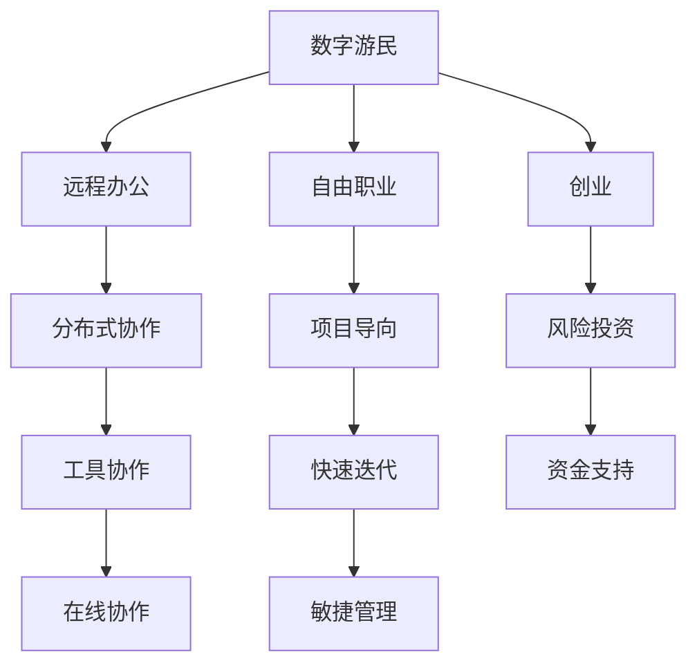

                 

# 数字游民创业：自由职业的新范式

## 1. 背景介绍

### 1.1 问题由来
在数字化和全球化的浪潮中，传统的“9-5”工作模式已逐渐被打破。数字游民（Digital Nomads）作为一种新型职业形态，吸引了越来越多的创业者、专业人士和自由职业者加入。数字游民利用互联网技术和远程协作工具，摆脱传统工作场所的束缚，随时随地进行工作和生活。

数字游民创业，指通过数字化手段，利用在线平台和工具，开展自由职业或企业运营的新兴创业模式。这种模式突破了地域限制，降低了创业门槛，提供了更高的工作灵活性和生活自由度。本文将从技术、经济、社会等多个维度，全面剖析数字游民创业的兴起背景、核心概念及其应用前景。

### 1.2 问题核心关键点
数字游民创业的兴起，得益于以下几个核心关键点：

- **互联网技术普及**：全球互联网覆盖率的提升，使得远程工作成为可能。互联网技术支撑了信息传输、数据存储、云计算等基础设施，为数字游民提供了必要的技术保障。
- **远程协作工具成熟**：Slack、Zoom、Trello等协作工具的普及，使得团队成员可以跨越时空高效协同，降低通信成本，提升工作效率。
- **在线支付与金融服务发展**：PayPal、Stripe等在线支付工具的广泛应用，以及Blockchain技术的发展，为数字游民提供了安全的交易和财务管理手段。
- **数字信任体系构建**：通过区块链等技术，数字身份认证、合同签署、知识产权保护等数字化信任体系逐步完善，为数字游民创业提供了必要的信任保障。
- **全球化劳动力市场形成**：技能共享平台如Upwork、Fiverr等的发展，打破了传统地域限制，汇聚了全球多样化的劳动力，为数字游民提供了更广阔的客户基础和合作机会。

这些关键点共同构成了数字游民创业的坚实基础，使得全球范围内越来越多的人能够摆脱地域限制，自由地开展创业活动。

## 2. 核心概念与联系

### 2.1 核心概念概述

为更好地理解数字游民创业的精髓，本节将介绍几个密切相关的核心概念：

- **数字游民（Digital Nomad）**：指利用互联网和移动设备，不受地域限制，在世界各地自由工作和生活的个体。
- **数字游民创业（Digital Nomad Entrepreneurship）**：指在数字游民状态下，通过互联网平台和技术工具，开展自由职业或企业运营的创业模式。
- **远程办公（Remote Work）**：指通过网络技术，在非传统办公地点进行工作的模式，是数字游民创业的基础形式。
- **分布式协作（Distributed Collaboration）**：指团队成员通过网络工具在地理位置上分散工作，但仍能高效协作完成任务的合作方式。
- **自由职业（Freelancing）**：指基于项目或任务进行短期或长期工作，不受固定雇主约束的工作形式。
- **创业（Entrepreneurship）**：指创立和管理企业，承担风险并追求商业成功的过程。

这些核心概念之间的逻辑关系可以通过以下Mermaid流程图来展示：



这个流程图展示了一系列关键概念之间的联系：

1. 数字游民通过远程办公模式，利用互联网和移动设备工作。
2. 数字游民可以选择自由职业，按照项目或任务进行工作。
3. 数字游民也可以从事创业活动，创立和管理企业。
4. 远程办公依赖于分布式协作工具，实现团队的高效合作。
5. 自由职业强调项目导向，注重结果和效率。
6. 创业通常需要风险投资和资金支持。
7. 敏捷管理帮助企业快速迭代，提升竞争力。
8. 在线协作工具如Slack、Zoom等，是远程办公和分布式协作的基础。

## 3. 核心算法原理 & 具体操作步骤

### 3.1 算法原理概述

数字游民创业的算法原理，可以简单归纳为以下几个方面：

- **信息收集与处理**：利用爬虫、API等技术手段，从各种在线平台收集潜在客户和合作项目信息，并通过自然语言处理（NLP）等技术进行文本分析、关键词提取等处理。
- **数据分析与决策**：应用机器学习算法，如分类、回归等，对收集到的数据进行分析，帮助数字游民进行任务选择和客户评估，优化资源分配。
- **动态定价与议价**：结合市场需求和自身成本，动态调整服务价格，确保收益最大化。
- **流程自动化与优化**：利用自动化工具，如IFTTT、Zapier等，将繁琐重复的任务自动化，提升工作效率。
- **项目管理与协作**：通过在线项目管理工具（如Trello、Asana等）和协作平台（如Slack、Microsoft Teams等），实现任务分配、进度跟踪、实时沟通等功能，提升团队协作效率。
- **客户关系管理（CRM）**：通过CRM系统，记录和管理客户信息、交易记录、反馈意见等，维护良好客户关系，提升客户满意度。

### 3.2 算法步骤详解

数字游民创业的一般流程包括以下几个关键步骤：

**Step 1: 市场调研与项目选择**
- 使用爬虫和API工具，从各大平台如Upwork、Freelancer、Fiverr等收集任务需求信息。
- 通过自然语言处理技术，如分词、实体识别、情感分析等，对收集到的信息进行初步筛选和分析。
- 根据自身技能、兴趣和市场需求，选择符合条件的项目进行进一步考察。

**Step 2: 客户关系建立与维护**
- 利用CRM系统记录和管理潜在客户和现有客户的详细信息。
- 通过邮件、社交媒体、即时通讯工具等，与客户保持沟通，了解需求，提供定制化服务。
- 定期收集客户反馈，进行满意度调查，根据反馈调整服务内容。

**Step 3: 任务执行与项目交付**
- 使用项目管理工具规划任务时间表，分配任务给团队成员，设置里程碑。
- 利用在线协作工具，进行实时沟通和文件共享，确保任务进展顺利。
- 按时交付项目成果，并通过邮件、平台评价等方式，与客户确认项目完成情况。

**Step 4: 财务管理与收益优化**
- 使用在线支付工具如PayPal、Stripe等进行项目款项管理，确保资金流动的安全性和透明度。
- 应用财务分析工具，如QuickBooks、Xero等，进行成本核算和收益分析，优化定价策略。
- 根据项目和客户反馈，不断优化服务内容和流程，提升客户满意度和复购率。

### 3.3 算法优缺点

数字游民创业作为一种新兴的自由职业模式，具有以下优点：

- **灵活性高**：不受传统办公地点和工作时间的束缚，可以在全球各地自由工作。
- **成本低廉**：不需要租用办公空间和购买办公设备，降低了创业初期的资金投入。
- **效率提升**：远程协作工具和自动化流程大大提升了工作效率，降低了沟通成本。
- **客户资源丰富**：利用在线平台可以接触到全球范围内的客户，拓展了市场空间。

同时，这种模式也存在一些缺点：

- **工作时间不规律**：缺乏固定的工作时间和办公环境，可能导致工作生活界限模糊。
- **社交隔离**：长期数字游民可能缺乏面对面的社交机会，影响身心健康。
- **工作压力增大**：高强度的工作负荷和灵活时间安排，可能导致心理压力增大。
- **职业发展受限**：远离传统工作环境，可能缺乏职业发展和晋升的机会。
- **技能更新缓慢**：需要自发学习新技能和工具，可能导致学习成本上升。

### 3.4 算法应用领域

数字游民创业在多个领域具有广泛的应用前景：

- **软件开发**：利用在线平台承接软件开发项目，自由编码、测试和部署。
- **内容创作**：通过博客、视频、设计等形式，进行内容创作和推广，获取广告收入或会员订阅。
- **在线教育**：提供一对一辅导、在线课程和知识分享服务，帮助用户提升技能和知识水平。
- **数字营销**：利用SEO、SEM、社交媒体营销等手段，为品牌和产品进行推广和营销。
- **数据科学**：从事数据分析、数据挖掘、机器学习等高技术含量的数据处理工作。
- **咨询服务**：提供战略规划、市场分析、财务咨询等服务，助力企业决策。
- **创意设计**：承接平面设计、UI/UX设计、插画等创意类设计任务，获取项目收益。
- **人力资源**：利用在线平台寻找和招聘人才，进行人力资源管理。

此外，数字游民创业还可以与各行各业进行深度融合，提供多样化的服务和解决方案。

## 4. 数学模型和公式 & 详细讲解 & 举例说明

### 4.1 数学模型构建

数字游民创业涉及多个环节和变量，可以通过数学模型来量化和分析关键指标。

假设数字游民每天工作时间为 $t$ 小时，项目单价为 $p$ 美元，每日工作量为 $w$ 项，项目完成率为 $c$，项目失败率为 $f$，客户满意度为 $s$。则每日收入 $I$ 和总成本 $C$ 可以表示为：

$$
I = p \times w \times c \times t
$$

$$
C = (p \times w) \times f
$$

客户满意度 $s$ 可以通过问卷调查或评价系统获取，项目完成率 $c$ 可以通过任务进度跟踪和反馈数据计算。

### 4.2 公式推导过程

以项目选择为例，假设数字游民从平台接收到 $N$ 个项目，每个项目的价格为 $p_i$，完成时间为 $t_i$，失败概率为 $f_i$，成功概率为 $c_i$。数字游民需要选择最优的项目组合，使得总收益最大。

构建目标函数：

$$
\max \sum_{i=1}^{N} p_i \times c_i \times t_i
$$

约束条件为：

$$
c_i \leq c \quad \forall i
$$

$$
c_i + f_i = 1 \quad \forall i
$$

其中 $c_i$ 表示项目 $i$ 的完成率，$f_i$ 表示项目 $i$ 的失败率。

目标函数可以简化为：

$$
\max \sum_{i=1}^{N} p_i \times c_i \times t_i
$$

约束条件为：

$$
c_i \leq c \quad \forall i
$$

$$
c_i = 1 - f_i \quad \forall i
$$

通过拉格朗日乘数法，可以求解出最优解。

### 4.3 案例分析与讲解

以软件开发为例，假设数字游民每天工作时间为8小时，单价为100美元/小时，项目周期为20天。假设数字游民接收到20个项目，每个项目的价格分别为50美元、80美元、100美元和150美元，完成概率分别为0.9、0.8、0.7和0.6。

根据上述数学模型，计算数字游民选择每个项目的收益：

$$
收益 = 单价 \times 完成概率 \times 项目周期 \times 每天工作时间
$$

计算每个项目的收益：

- 项目1：$50 \times 0.9 \times 20 \times 8 = 8400$ 美元
- 项目2：$80 \times 0.8 \times 20 \times 8 = 7680$ 美元
- 项目3：$100 \times 0.7 \times 20 \times 8 = 11200$ 美元
- 项目4：$150 \times 0.6 \times 20 \times 8 = 14400$ 美元

选择收益最高的前两个项目进行工作，总收益为 $7680 + 11200 = 18900$ 美元。

通过数学模型，数字游民可以量化和优化每个项目的收益和风险，从而做出最优的项目选择。

## 5. 项目实践：代码实例和详细解释说明

### 5.1 开发环境搭建

在进行数字游民创业项目开发前，需要先搭建好开发环境。以下是使用Python进行Flask开发的环境配置流程：

1. 安装Anaconda：从官网下载并安装Anaconda，用于创建独立的Python环境。

2. 创建并激活虚拟环境：
```bash
conda create -n flask-env python=3.8 
conda activate flask-env
```

3. 安装Flask：
```bash
pip install Flask
```

4. 安装Flask RESTful：
```bash
pip install Flask-RESTful
```

5. 安装Flask-SQLAlchemy：
```bash
pip install Flask-SQLAlchemy
```

6. 安装SQLite数据库：
```bash
pip install sqlite3
```

完成上述步骤后，即可在`flask-env`环境中开始项目开发。

### 5.2 源代码详细实现

以下是使用Flask开发数字游民创业项目的Python代码实现：

```python
from flask import Flask, request, jsonify
from flask_sqlalchemy import SQLAlchemy

app = Flask(__name__)
app.config['SQLALCHEMY_DATABASE_URI'] = 'sqlite:///project.db'
db = SQLAlchemy(app)

class Project(db.Model):
    id = db.Column(db.Integer, primary_key=True)
    name = db.Column(db.String(100), nullable=False)
    price = db.Column(db.Float, nullable=False)
    time = db.Column(db.Integer, nullable=False)
    success_rate = db.Column(db.Float, nullable=False)
    failure_rate = db.Column(db.Float, nullable=False)

@app.route('/projects', methods=['GET'])
def get_projects():
    projects = Project.query.all()
    results = []
    for project in projects:
        result = {
            'id': project.id,
            'name': project.name,
            'price': project.price,
            'time': project.time,
            'success_rate': project.success_rate,
            'failure_rate': project.failure_rate
        }
        results.append(result)
    return jsonify(results)

@app.route('/projects', methods=['POST'])
def create_project():
    data = request.json
    project = Project(name=data['name'], price=data['price'], time=data['time'], success_rate=data['success_rate'], failure_rate=1-data['success_rate'])
    db.session.add(project)
    db.session.commit()
    return jsonify({'message': 'Project created'})

@app.route('/projects', methods=['PUT'])
def update_project():
    data = request.json
    project = Project.query.filter_by(id=data['id']).first()
    if project:
        project.name = data['name']
        project.price = data['price']
        project.time = data['time']
        project.success_rate = data['success_rate']
        project.failure_rate = 1-data['success_rate']
        db.session.commit()
        return jsonify({'message': 'Project updated'})
    else:
        return jsonify({'error': 'Project not found'})

@app.route('/projects', methods=['DELETE'])
def delete_project():
    data = request.json
    project = Project.query.filter_by(id=data['id']).first()
    if project:
        db.session.delete(project)
        db.session.commit()
        return jsonify({'message': 'Project deleted'})
    else:
        return jsonify({'error': 'Project not found'})

if __name__ == '__main__':
    app.run(debug=True)
```

### 5.3 代码解读与分析

让我们再详细解读一下关键代码的实现细节：

**Project类**：
- `id`：项目ID，作为主键使用。
- `name`：项目名称。
- `price`：项目单价。
- `time`：项目周期。
- `success_rate`：项目完成概率。
- `failure_rate`：项目失败概率。

**路由处理函数**：
- `/projects` 路由：处理项目的增删改查操作。
- `GET /projects`：获取所有项目信息。
- `POST /projects`：创建新项目。
- `PUT /projects`：更新项目信息。
- `DELETE /projects`：删除项目信息。

**Flask框架**：
- `Flask`：Python微框架，用于构建Web应用。
- `Flask-SQLAlchemy`：Flask的ORM扩展，用于与SQLite数据库交互。
- `Flask-RESTful`：Flask的RESTful扩展，用于处理API请求。

通过上述代码，可以构建一个简单的数字游民创业项目管理系统，通过RESTful API实现项目的增删改查功能。

### 5.4 运行结果展示

运行上述代码后，可以在浏览器中访问 `http://localhost:5000`，使用POST请求提交新项目信息，使用GET请求获取所有项目信息，使用PUT请求更新项目信息，使用DELETE请求删除项目信息。

以下是一个示例请求和响应：

**POST请求示例**：
```
POST /projects
Content-Type: application/json

{
    "name": "Software Development",
    "price": 100.0,
    "time": 20,
    "success_rate": 0.9,
    "failure_rate": 0.1
}
```

**响应示例**：
```
{
    "message": "Project created"
}
```

通过上述代码和Flask框架，数字游民创业者可以构建自己的项目管理系统，实现项目的自动化管理和协作。

## 6. 实际应用场景

### 6.1 智能客服系统

数字游民创业在智能客服系统中也有广泛应用。通过构建智能客服系统，数字游民可以利用远程协作工具，实现与客户的实时沟通和问题解答。智能客服系统可以提升客户满意度，降低企业运营成本。

智能客服系统的一般流程如下：
- 客户通过在线聊天工具或电话系统提出问题。
- 智能客服系统根据客户问题，自动匹配合适的解答模板。
- 数字游民进行人工干预，提供个性化的回答。
- 客户满意度高时，系统自动进行评价和记录。

通过数字化手段，数字游民可以随时接入智能客服系统，提供优质的客户服务，提升企业的客户关系管理水平。

### 6.2 在线教育平台

在线教育平台是数字游民创业的另一个重要应用场景。通过在线教育平台，数字游民可以提供个性化的教育和培训服务，帮助用户提升技能和知识水平。

在线教育平台的一般流程如下：
- 数字游民创建课程或学习内容。
- 用户通过平台订阅课程或参与学习活动。
- 数字游民进行教学和互动。
- 用户完成课程或活动后，进行评价和反馈。

数字游民可以利用远程协作工具和在线教育平台，提供灵活多样的教育服务，满足用户的学习需求。

### 6.3 数字营销服务

数字游民创业还可以提供数字营销服务，帮助企业进行品牌推广和市场宣传。数字游民可以利用SEO、SEM、社交媒体等手段，提升企业的在线曝光度和用户转化率。

数字营销服务的一般流程如下：
- 数字游民了解客户需求和市场情况。
- 设计并实施数字营销策略。
- 监测和分析营销效果。
- 优化和调整营销策略。

通过数字化营销手段，数字游民可以帮助企业提升品牌知名度和市场竞争力，实现商业价值的最大化。

### 6.4 未来应用展望

数字游民创业在未来的发展中，将呈现以下几个趋势：

1. **全球化扩展**：数字游民可以跨越地域限制，在全球范围内寻找工作机会和客户资源，进一步拓展市场空间。
2. **技术集成**：数字游民创业将更加依赖于先进技术和工具，如AI、区块链、IoT等，提升工作效率和业务创新。
3. **业务融合**：数字游民创业将与各行各业进行深度融合，提供多样化、个性化、高附加值的服务和产品。
4. **生态构建**：数字游民创业将构建起稳定的生态系统，包括合作伙伴、客户、供应商等，形成互利共赢的合作网络。
5. **可持续发展**：数字游民创业将注重环保和可持续发展，采用绿色办公和生活方式，降低环境影响。

## 7. 工具和资源推荐

### 7.1 学习资源推荐

为了帮助数字游民创业者系统掌握数字化技能和创业知识，这里推荐一些优质的学习资源：

1. **《Flask Web Development》**：Pragmatic Bookshelf出版的Flask开发指南，系统介绍Flask框架的使用和最佳实践。
2. **《Python Web Development》**：Pluralsight的Python Web开发课程，详细介绍Python Web开发技术栈，包括Flask、Django、SQLAlchemy等。
3. **《Digital Marketing》**：Coursera的Digital Marketing课程，涵盖数字营销的各个方面，包括SEO、SEM、社交媒体营销等。
4. **《Blockchain Fundamentals》**：IBM的Blockchain Fundamentals课程，系统介绍区块链技术和应用，帮助数字游民掌握区块链技术。
5. **《Data Science for Business》**：Coursera的Data Science for Business课程，涵盖数据分析和数据科学的基本概念和应用。

通过学习这些课程和资源，数字游民创业者可以全面提升自身的技能和知识水平，更好地应对数字化挑战。

### 7.2 开发工具推荐

高效的开发离不开优秀的工具支持。以下是几款用于数字游民创业开发的常用工具：

1. **Flask**：Python微框架，轻量级、灵活，适合快速搭建Web应用。
2. **SQLAlchemy**：Python的ORM扩展，支持多种数据库，方便数据库操作。
3. **SQLite**：轻量级数据库，适用于开发和测试环境。
4. **Jupyter Notebook**：Python的交互式开发环境，支持代码编写和数据分析。
5. **Postman**：API测试工具，方便进行API请求和响应调试。
6. **Google Colab**：谷歌提供的在线Jupyter Notebook环境，免费提供GPU/TPU算力，方便快速实验。
7. **Slack**：即时通讯工具，支持团队协作和沟通。
8. **Zoom**：视频会议工具，支持远程协作和实时沟通。

合理利用这些工具，可以显著提升数字游民创业的开发效率，加快创新迭代的步伐。

### 7.3 相关论文推荐

数字游民创业作为一种新兴的自由职业模式，其研究和应用正逐步深入。以下是几篇奠基性的相关论文，推荐阅读：

1. **《Digital Nomad Entrepreneurship: A Review of Research》**：探讨数字游民创业的研究现状和未来趋势，为数字游民创业者提供理论支持和实践指导。
2. **《The Impact of Digital Nomadism on Work-Life Balance and Productivity》**：分析数字游民工作生活方式对其心理和生理健康的影响，提供改善建议。
3. **《Blockchain and Digital Nomadism: Opportunities and Challenges》**：探讨区块链技术在数字游民创业中的应用和挑战，提供技术解决方案。
4. **《The Effectiveness of Digital Nomadism on Business Development》**：分析数字游民创业对企业创新和发展的积极影响，提供实践案例。
5. **《The Future of Work: Digital Nomadism and Gig Economy》**：预测数字游民创业对未来工作模式的变革，提供政策建议和实践指南。

这些论文代表了大规模数字游民创业的研究进展，为数字游民创业者提供全面的理论支持和实践指导。

## 8. 总结：未来发展趋势与挑战

### 8.1 研究成果总结

本文从技术、经济、社会等多个维度，全面剖析了数字游民创业的兴起背景、核心概念和实际应用。主要结论如下：

1. 数字游民创业是利用互联网技术和远程协作工具，在全球范围内开展自由职业或企业运营的新兴模式。
2. 数字游民创业具有灵活性高、成本低廉、效率提升等优点，但也面临工作时间不规律、社交隔离、职业发展受限等挑战。
3. 数字游民创业在多个领域具有广泛的应用前景，包括智能客服、在线教育、数字营销等。
4. 数字游民创业将与各行各业深度融合，提供多样化、个性化、高附加值的服务和产品。
5. 数字游民创业将构建起稳定的生态系统，注重环保和可持续发展。

### 8.2 未来发展趋势

展望未来，数字游民创业将呈现以下几个发展趋势：

1. **全球化扩展**：数字游民可以在全球范围内自由工作，进一步拓展市场空间。
2. **技术集成**：数字游民创业将更加依赖于先进技术和工具，提升工作效率和业务创新。
3. **业务融合**：数字游民创业将与各行各业进行深度融合，提供多样化、个性化、高附加值的服务和产品。
4. **生态构建**：数字游民创业将构建起稳定的生态系统，形成互利共赢的合作网络。
5. **可持续发展**：数字游民创业将注重环保和可持续发展，采用绿色办公和生活方式。

### 8.3 面临的挑战

尽管数字游民创业具备诸多优势，但在其发展过程中仍面临以下挑战：

1. **技能更新快速**：数字游民需要不断学习新技术和工具，适应快速变化的市场需求。
2. **社交隔离问题**：长期数字游民可能缺乏面对面的社交机会，影响身心健康。
3. **工作时间不规律**：灵活工作时间可能导致工作生活界限模糊，影响工作效率和身心健康。
4. **市场竞争激烈**：全球化背景下的市场竞争更加激烈，数字游民需要具备较强的市场竞争力和业务拓展能力。
5. **法律和政策风险**：不同国家和地区的法律和政策可能存在差异，数字游民需要了解和遵守当地法律法规。

### 8.4 研究展望

未来，数字游民创业的研究可以从以下几个方面进行深入探索：

1. **技能发展机制**：研究如何构建有效的技能发展机制，帮助数字游民持续提升技能和知识水平。
2. **心理健康干预**：研究如何应对数字游民的社交隔离和工作压力问题，提升其心理和生理健康水平。
3. **工作时间管理**：研究如何制定合理的工作时间管理策略，平衡工作与生活，提升工作效率和满意度。
4. **市场拓展策略**：研究如何制定有效的市场拓展策略，帮助数字游民在全球范围内寻找客户和合作机会。
5. **法律和政策研究**：研究不同国家和地区的法律法规，制定符合当地要求的政策和监管措施。

通过持续的研究和创新，数字游民创业将克服面临的挑战，实现可持续发展，进一步推动数字经济和产业升级。

## 9. 附录：常见问题与解答

**Q1：数字游民创业的优势和劣势是什么？**

A: 数字游民创业的优势包括：
1. 灵活性高：不受传统办公地点和时间限制，可以在全球范围内自由工作。
2. 成本低廉：不需要租用办公空间和购买办公设备，降低创业初期的资金投入。
3. 效率提升：远程协作工具和自动化流程提升工作效率，降低沟通成本。
4. 客户资源丰富：利用在线平台可以接触到全球范围内的客户，拓展市场空间。

劣势包括：
1. 工作时间不规律：灵活工作时间可能导致工作生活界限模糊，影响工作效率和身心健康。
2. 社交隔离：长期数字游民可能缺乏面对面的社交机会，影响身心健康。
3. 职业发展受限：远离传统工作环境，可能缺乏职业发展和晋升的机会。
4. 技能更新缓慢：需要自发学习新技能和工具，可能导致学习成本上升。

**Q2：数字游民创业需要哪些核心技能？**

A: 数字游民创业需要具备以下核心技能：
1. 技术技能：掌握Python、JavaScript、SQL等编程语言，熟悉Web开发、数据科学等技术。
2. 业务技能：了解市场需求和客户需求，具备项目管理、客户关系管理等业务能力。
3. 协作技能：具备远程协作和沟通能力，使用Slack、Zoom等协作工具。
4. 创新能力：具备快速学习和创新能力，及时掌握新技术和工具，适应市场变化。
5. 创业思维：具备企业家精神，了解市场和商业模式，具备风险管理能力。

**Q3：数字游民创业如何提高客户满意度？**

A: 数字游民创业可以通过以下方式提高客户满意度：
1. 快速响应：使用在线工具和自动化流程，快速处理客户需求。
2. 个性化服务：根据客户需求提供定制化解决方案，满足客户期望。
3. 透明沟通：通过在线协作工具和定期反馈，与客户保持透明沟通，建立信任关系。
4. 持续改进：根据客户反馈不断优化服务内容和流程，提升服务质量。
5. 知识共享：通过在线平台分享知识和经验，提升客户对服务质量的认知和满意度。

**Q4：数字游民创业如何应对市场竞争？**

A: 数字游民创业可以通过以下方式应对市场竞争：
1. 差异化服务：提供独特、高附加值的服务，满足客户多样化需求。
2. 品牌建设：通过品牌营销和市场推广，提升品牌知名度和影响力。
3. 价格策略：灵活调整定价策略，根据市场需求和成本情况，制定合理的价格。
4. 技术创新：持续投入技术研发，提升服务质量和效率，保持市场竞争力。
5. 合作共赢：与行业伙伴和客户建立合作关系，形成互利共赢的生态系统。

---

作者：禅与计算机程序设计艺术 / Zen and the Art of Computer Programming

