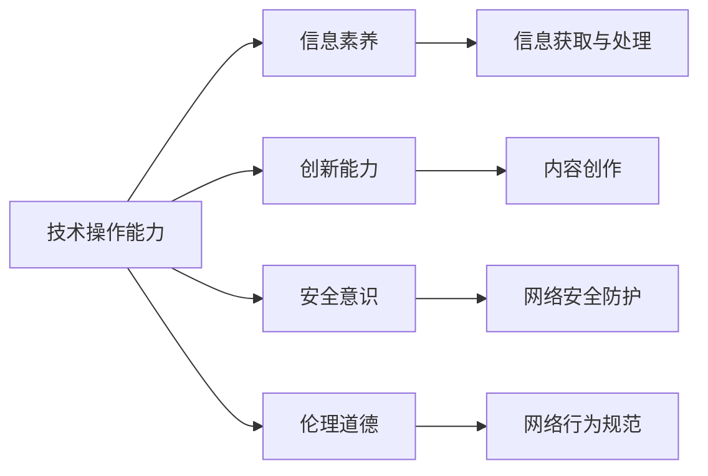

                 

# 数字素养：公民参与的基石

在数字化快速发展的今天，数字素养已成为每个公民获取信息、参与社会、提升自我、实现梦想的重要基石。无论是在教育、医疗、就业，还是在公共事务、科技创新、社会治理等各个方面，具备良好的数字素养都是实现个人和社会的全面发展的关键。本文将从背景、核心概念、算法原理、实际操作、应用领域、数学模型、案例分析、开发环境、代码实现、学习资源、未来展望等多个维度，深入探讨数字素养的重要性、实现路径和提升方法，以期为提升全民数字素养，推动数字化转型，助力社会全面进步提供有力的理论支撑和实践指导。

## 1. 背景介绍

### 1.1 数字素养的定义与重要性

数字素养（Digital Literacy），通常被定义为理解、使用和评估数字技术的能力。它不仅包括基本的技术操作能力，还涵盖了对信息的识别、评估、创造和共享的全面理解。随着数字化技术的普及，数字素养在现代社会的各个领域都显得尤为重要。

1. **经济增长**：在数字化经济时代，数字素养直接关系到一个国家的经济竞争力。高技能的劳动力不仅能提高生产效率，还能促进创新，推动经济发展。
2. **社会公平**：数字素养的不均衡分布可能导致数字鸿沟（Digital Divide），使得弱势群体无法平等享受数字时代的红利，从而影响社会公平。
3. **个人发展**：数字素养有助于个人获取知识、提升技能、拓展视野、增强决策能力，从而实现自我价值的最大化。
4. **社会治理**：在数字社会中，有效的数字素养教育能够提高公民的信息获取和处理能力，参与公共事务，推动社会治理的现代化。

### 1.2 数字素养的核心要素

数字素养的核心要素主要包括：

- **技术操作能力**：掌握计算机、智能手机、网络等数字设备的基本操作和应用。
- **信息素养**：能够识别、评价、选择和使用信息资源，具备批判性思维和信息鉴别能力。
- **创新能力**：运用数字工具进行创意表达、内容创作、产品设计等创新活动。
- **安全意识**：理解数字环境中的安全风险，具备网络安全意识和防护能力。
- **伦理道德**：理解并遵循网络行为规范，尊重他人的权益，维护数字环境的健康和和谐。

## 2. 核心概念与联系

### 2.1 核心概念概述

数字素养涵盖了广泛的概念，包括但不限于技术操作、信息获取与处理、网络安全、创新应用、伦理道德等方面。这些概念相互关联，共同构成了数字素养的核心框架。

### 2.2 Mermaid 流程图

下面通过Mermaid流程图来展示数字素养的各个核心要素及其相互联系：



这个流程图表明：

- **技术操作能力**是数字素养的基础，提供了数字环境中的基本操作平台。
- **信息素养**依赖于技术操作能力，在处理信息时发挥重要作用。
- **创新能力**建立在技术操作能力和信息素养的基础上，推动创意表达和内容创作。
- **安全意识**和**伦理道德**贯穿于整个数字素养框架，确保数字行为的安全和规范。

## 3. 核心算法原理 & 具体操作步骤

### 3.1 算法原理概述

数字素养的核心算法原理主要围绕数据处理、信息评估、行为规范等几个方面展开。通过教育、训练和实践，提升个体和社会的数字素养水平。

1. **数据处理算法**：包括数据采集、清洗、处理和分析，帮助个体掌握有效获取和利用信息的技能。
2. **信息评估算法**：通过识别和过滤不实信息、广告、恶意软件等，帮助个体提高信息甄别能力。
3. **行为规范算法**：制定和遵守网络行为准则，确保数字环境的健康和有序。

### 3.2 算法步骤详解

数字素养的提升可以通过以下步骤进行：

**Step 1: 基础教育**  
- 提供基础数字设备使用和操作的教育，如键盘操作、网络设置、应用程序使用等。
- 引入信息获取与处理的基本方法，如搜索引擎使用、数据库查询等。

**Step 2: 实践训练**  
- 通过实际操作和项目实践，帮助个体掌握数字工具的使用技巧。
- 组织线上线下结合的训练营，提供模拟工作场景，提升实战能力。

**Step 3: 进阶培训**  
- 提供高级课程，如编程、数据科学、人工智能、网络安全等，拓展技能边界。
- 开展前沿技术研究项目，鼓励创新实践。

**Step 4: 持续学习**  
- 建立数字素养在线平台，提供各类学习资源和课程，支持终身学习。
- 组织各类研讨会、工作坊、黑客松等活动，促进知识共享和交流。

### 3.3 算法优缺点

数字素养教育的主要优点包括：

- **提升个人竞争力**：通过掌握数字工具和技能，提升就业能力和创新潜力。
- **促进社会公平**：通过普及数字素养，缩小数字鸿沟，实现信息社会的包容性。
- **推动经济发展**：数字素养是数字经济的基础，有助于创新和生产力提升。

然而，数字素养教育也面临一些挑战：

- **资源不均衡**：不同地区和群体之间的数字资源获取不均衡，影响普及效果。
- **技术和知识更新快**：数字技术和应用日新月异，需要持续更新教育内容和方法。
- **安全与隐私风险**：网络环境复杂多变，需要提升个体的安全防范和隐私保护意识。

### 3.4 算法应用领域

数字素养在多个领域都有广泛应用，包括：

- **教育**：提升教师和学生的信息技术使用能力，优化教学方法和学习效果。
- **医疗**：提高医护人员和患者的信息获取和处理能力，促进健康管理和医疗服务创新。
- **就业**：增强职场人士的数字技能，提升职业竞争力，促进数字化转型。
- **政府服务**：推动政府部门实现数字化办公，提升公共服务效率和质量。
- **社会治理**：促进公民参与社会事务，提升公共政策的透明度和公众参与度。

## 4. 数学模型和公式 & 详细讲解 & 举例说明

### 4.1 数学模型构建

数字素养的教育模型可以基于以下基本框架构建：

1. **学习目标设定**：明确数字素养教育的总体目标和阶段性目标。
2. **评估标准设计**：制定科学合理的评估标准，衡量个体和群体的数字素养水平。
3. **学习路径规划**：设计系统的学习路径，覆盖从基础到高级的各个层次。
4. **反馈与改进机制**：建立持续的反馈和改进机制，确保教育效果不断优化。

### 4.2 公式推导过程

数字素养教育的数学模型可以抽象为以下公式：

$$
\text{Digital Literacy} = f(\text{Basic Skills}, \text{Advanced Skills}, \text{Continuous Learning}, \text{Safety Awareness}, \text{Ethical Standards})
$$

其中，$f$ 表示各种技能和意识之间相互作用的过程，反映了数字素养的多维度特性。

### 4.3 案例分析与讲解

以某个学校的数字素养教育项目为例，分析其数学模型构建过程：

- **学习目标设定**：明确基础操作能力、信息处理能力、创新能力、安全意识和伦理道德为该项目的主要目标。
- **评估标准设计**：采用在线测试、项目成果展示、教师和学生反馈等多种方式进行综合评估。
- **学习路径规划**：设计从基础课程到高级课程，逐步提升技能的学习路径，包含计算机基础、编程语言、数据分析、人工智能等多个模块。
- **反馈与改进机制**：通过在线平台和定期问卷调查收集反馈，及时调整教学内容和方法。

## 5. 项目实践：代码实例和详细解释说明

### 5.1 开发环境搭建

数字素养教育的开发环境主要包括以下几个方面：

1. **开发平台**：选择适合的教育软件和开发工具，如Google Classroom、Microsoft Teams、Canvas等。
2. **数据集**：收集和整理各类数字素养相关的数据集，用于测试和评估模型效果。
3. **计算资源**：配置高性能的计算资源，支持大规模数据处理和分析。
4. **网络环境**：确保稳定的网络连接，支持远程教育和协作。

### 5.2 源代码详细实现

以下是一个简单的Python代码示例，用于设计一个基础的技术操作能力评估程序：

```python
import random
import string

# 生成随机密码
def generate_password(length=8):
    letters = string.ascii_letters
    digits = string.digits
    symbols = string.punctuation
    password = ''.join(random.choice(letters + digits + symbols) for i in range(length))
    return password

# 密码检查函数
def check_password(password):
    if len(password) < 8:
        return False
    elif not any(char.isdigit() for char in password):
        return False
    elif not any(char.isalpha() for char in password):
        return False
    elif not any(char in string.punctuation for char in password):
        return False
    else:
        return True

# 测试用户密码
user_password = input("请输入您的密码：")
if check_password(user_password):
    print("您的密码符合要求。")
else:
    print("您的密码不符合要求。")
```

### 5.3 代码解读与分析

上述代码主要实现了一个简单的密码生成和检查功能，用于测试用户的基础技术操作能力。具体解读如下：

- **生成密码函数**：通过`random`模块生成包含字母、数字和特殊字符的随机密码。
- **密码检查函数**：定义密码规则，检查用户输入的密码是否符合长度、数字、字母和特殊字符的要求。
- **测试用户密码**：要求用户输入密码，调用密码检查函数，输出检查结果。

### 5.4 运行结果展示

在实际运行时，用户需要根据提示输入密码，程序将检查密码是否符合要求并给出反馈。这能够帮助用户了解密码设置的规范和标准。

## 6. 实际应用场景

### 6.1 智能教育

数字素养教育在智能教育领域有着广泛应用，通过AI辅助、虚拟现实、增强现实等技术手段，提升学生的数字素养水平。例如，利用智能教学平台进行个性化学习路径规划，通过虚拟实验室进行实验操作训练，通过AR/VR进行互动式学习，这些都能有效提升学生的实践能力和创新能力。

### 6.2 智慧医疗

在智慧医疗中，数字素养教育能够提升医护人员的信息获取和处理能力，通过电子健康记录（EHR）系统进行信息管理和共享，利用AI进行诊断和辅助治疗，提升医疗服务的质量和效率。

### 6.3 智能办公

在智能办公中，数字素养教育能够提升员工的信息处理能力和创新能力，通过企业内部网络进行高效的沟通协作，利用数据分析和AI进行决策支持，推动企业数字化转型和智能化升级。

### 6.4 社会治理

在社会治理中，数字素养教育能够提升公民的信息获取和处理能力，通过电子政务平台进行在线咨询和投诉，利用社交媒体进行公众监督和参与，提升公共服务的透明度和公众参与度。

## 7. 工具和资源推荐

### 7.1 学习资源推荐

1. **MOOC平台**：如Coursera、edX、Udacity等，提供各类数字素养相关课程。
2. **在线教育平台**：如Khan Academy、Codecademy、Coursera for Business等，提供技术操作、编程、数据分析等技能培训。
3. **开源社区**：如GitHub、Stack Overflow、Open edX等，提供丰富的开源资源和社区支持。
4. **学术资源**：如IEEE Xplore、Google Scholar、arXiv等，获取最新的研究论文和技术进展。

### 7.2 开发工具推荐

1. **编程语言**：如Python、Java、JavaScript等，广泛应用于数字素养教育的各种应用场景。
2. **开发框架**：如Django、Flask、React、Vue等，提供灵活的开发环境和丰富的功能模块。
3. **数据处理工具**：如Pandas、NumPy、SciPy等，支持数据采集、清洗、处理和分析。
4. **云计算平台**：如AWS、Google Cloud、Microsoft Azure等，提供高性能计算资源和云服务支持。

### 7.3 相关论文推荐

1. **《数字素养教育：未来社会的基础》**：探讨数字素养教育的重要性、发展趋势和未来挑战。
2. **《数字素养教育模型研究》**：分析数字素养教育的数学模型构建方法和评估标准设计。
3. **《智能教育中的数字素养提升》**：研究智能技术在数字素养教育中的应用和效果。
4. **《智慧医疗中的数字素养教育》**：探讨数字素养教育在智慧医疗中的具体应用和实践。
5. **《智能办公中的数字素养提升》**：分析数字素养教育在智能办公中的作用和效果。

## 8. 总结：未来发展趋势与挑战

### 8.1 研究成果总结

本文从数字素养的定义、核心要素、算法原理、操作步骤等多个维度，全面探讨了数字素养教育的重要性和实现路径。通过案例分析和项目实践，展示了数字素养在教育、医疗、办公、社会治理等多个领域的实际应用。通过学习资源和开发工具推荐，为数字素养教育的持续改进和优化提供了参考和指导。

### 8.2 未来发展趋势

数字素养教育的未来发展趋势主要包括以下几个方面：

1. **技术融合**：数字素养教育将更加注重与人工智能、大数据、区块链等前沿技术的融合，提升教育的智能化和个性化水平。
2. **全球化**：数字素养教育将逐渐普及到全球各个地区，提升全球数字素养水平，缩小数字鸿沟。
3. **终身学习**：数字素养教育将强调终身学习，不断更新教育内容和方法，适应快速变化的技术环境。
4. **多模态教育**：数字素养教育将整合文字、视频、音频等多种形式的教育内容，提供更加丰富的学习体验。
5. **社区驱动**：数字素养教育将更加注重社区驱动，鼓励用户参与教育资源的共建共享。

### 8.3 面临的挑战

尽管数字素养教育已取得显著进展，但仍面临诸多挑战：

1. **资源不均衡**：不同地区和群体之间的数字资源获取不均衡，影响教育普及。
2. **技术更新快**：数字技术和应用不断更新，需要持续更新教育内容和方法。
3. **安全与隐私**：网络环境复杂多变，需要提升个体的安全防范和隐私保护意识。
4. **伦理道德**：数字素养教育需要加强伦理道德教育，引导用户遵循网络行为规范。
5. **跨学科融合**：数字素养教育需要与其他学科教育融合，提升综合素质和应用能力。

### 8.4 研究展望

未来数字素养教育的研究将围绕以下几个方向展开：

1. **跨学科融合教育**：推动数字素养教育与其他学科教育的融合，提升综合素质和应用能力。
2. **个性化教育**：利用AI和大数据分析，提供个性化的学习路径和资源，满足不同群体的需求。
3. **社区驱动教育**：鼓励用户参与教育资源的共建共享，推动数字素养教育的普及和进步。
4. **终身学习体系**：构建终身学习的数字素养教育体系，实现持续提升和学习。
5. **国际化教育**：推动数字素养教育的国际化进程，提升全球数字素养水平。

## 9. 附录：常见问题与解答

**Q1: 数字素养教育的主要内容是什么？**

A: 数字素养教育的主要内容包括技术操作、信息素养、创新能力、安全意识和伦理道德五个方面。

**Q2: 数字素养教育在智能教育中的具体应用有哪些？**

A: 数字素养教育在智能教育中的应用包括AI辅助、虚拟现实、增强现实等技术手段，提升学生的实践能力和创新能力。

**Q3: 数字素养教育在智慧医疗中的应用有哪些？**

A: 数字素养教育在智慧医疗中的应用包括电子健康记录（EHR）系统进行信息管理和共享，利用AI进行诊断和辅助治疗，提升医疗服务的质量和效率。

**Q4: 数字素养教育在智能办公中的应用有哪些？**

A: 数字素养教育在智能办公中的应用包括企业内部网络进行高效的沟通协作，利用数据分析和AI进行决策支持，推动企业数字化转型和智能化升级。

**Q5: 数字素养教育在社会治理中的应用有哪些？**

A: 数字素养教育在社会治理中的应用包括电子政务平台进行在线咨询和投诉，利用社交媒体进行公众监督和参与，提升公共服务的透明度和公众参与度。

---

作者：禅与计算机程序设计艺术 / Zen and the Art of Computer Programming

